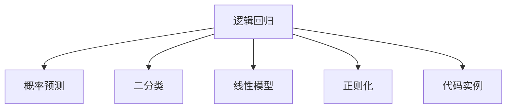

                 

# 逻辑回归(Logistic Regression) - 原理与代码实例讲解

> 关键词：逻辑回归,概率预测,二分类,线性模型,正则化,代码实例

## 1. 背景介绍

### 1.1 问题由来
逻辑回归是一种经典的机器学习算法，用于处理二分类问题。其简单高效，可解释性强，是许多高级模型（如支持向量机、神经网络）的基础。在实际应用中，逻辑回归被广泛用于广告点击率预测、信用评分、疾病诊断、邮件分类等场景。尽管如此，许多人仍然对逻辑回归的原理和实现细节不够了解。本文将对逻辑回归的原理和代码实现进行详细讲解，并结合实例展示其应用场景。

### 1.2 问题核心关键点
- 逻辑回归的基本原理和数学模型
- 逻辑回归的训练过程和优化算法
- 逻辑回归的超参数调优
- 逻辑回归的实际应用场景
- 逻辑回归的代码实例和Python实现

## 2. 核心概念与联系

### 2.1 核心概念概述

为更好地理解逻辑回归，本节将介绍几个关键概念：

- **逻辑回归(Logistic Regression)**：一种用于二分类问题的线性模型，通过逻辑函数(Sigmoid Function)将输入特征映射到概率空间，输出0或1的概率。
- **概率预测(Probabilistic Prediction)**：逻辑回归输出的概率可以用于预测样本的类别。当输出概率大于某个阈值时，样本被预测为正类；小于阈值时，被预测为负类。
- **二分类(Binary Classification)**：将样本分为两类之一的任务。逻辑回归常用于处理这种类型的问题。
- **线性模型(Linear Model)**：逻辑回归是一种线性模型，其预测函数为输入特征的线性组合。
- **正则化(Regularization)**：用于防止模型过拟合，包括L1正则(Lasso)和L2正则(Ridge)等。
- **代码实例(Code Example)**：具体展示逻辑回归的Python实现，包括数据准备、模型训练、预测和评估等步骤。

这些概念之间的逻辑关系可以通过以下Mermaid流程图来展示：



这个流程图展示了逻辑回归的核心概念及其之间的关系：

1. 逻辑回归通过线性模型对输入特征进行建模，输出样本属于正类的概率。
2. 输出概率用于概率预测，通过设定阈值来确定样本的类别。
3. 逻辑回归是一种二分类方法，处理样本只有两类的问题。
4. 逻辑回归中包含了正则化技术，防止模型过拟合。
5. 代码实例展示了逻辑回归的Python实现，方便开发者快速上手。

## 3. 核心算法原理 & 具体操作步骤
### 3.1 算法原理概述

逻辑回归是一种基于线性模型的概率预测方法，其核心在于将样本的特征与类别之间的关系建模为一个线性函数，并通过Sigmoid函数将其映射到概率空间。其原理如下：

1. 输入特征 $x = (x_1, x_2, ..., x_n)$ 通过一个线性变换 $\theta^T x + b$ 映射到线性空间。
2. 使用Sigmoid函数将线性空间的输出映射到概率空间 $[0, 1]$。
3. 根据输出概率 $p(y|x)$ 进行概率预测，判断样本属于正类还是负类。

数学上，逻辑回归的预测函数为：

$$
p(y|x) = \frac{1}{1+e^{-\theta^T x - b}}
$$

其中 $\theta$ 为模型的权重向量，$b$ 为偏置项。

### 3.2 算法步骤详解

逻辑回归的训练过程包括以下几个关键步骤：

**Step 1: 准备数据集**
- 收集训练数据集 $\{(x_i, y_i)\}_{i=1}^N$，其中 $x_i$ 为样本的特征向量，$y_i \in \{0, 1\}$ 为样本的标签。
- 对特征向量进行归一化处理，使其值域在 $[0, 1]$ 或 $[-1, 1]$ 之间。

**Step 2: 选择优化算法**
- 选择合适的优化算法，如梯度下降法、随机梯度下降法等，用于更新模型参数 $\theta$。

**Step 3: 计算损失函数**
- 计算当前模型对样本的预测概率 $p(y_i|x_i)$。
- 定义损失函数，如交叉熵损失函数，衡量模型预测与真实标签的差异。

**Step 4: 梯度下降优化**
- 使用优化算法计算损失函数对参数 $\theta$ 和 $b$ 的梯度。
- 更新模型参数 $\theta$ 和 $b$，使其趋近于最小化损失函数的目标。

**Step 5: 模型评估**
- 在测试集上评估模型的性能，使用准确率、精确率、召回率等指标衡量模型效果。

### 3.3 算法优缺点

逻辑回归具有以下优点：
1. 模型简单，易于理解和实现。
2. 对数据量要求不高，适用于样本数量较小的问题。
3. 可解释性强，通过权重向量可以理解模型对各个特征的依赖关系。
4. 计算复杂度低，训练速度较快。

同时，逻辑回归也存在以下缺点：
1. 对非线性关系处理能力有限。
2. 假设数据服从伯努利分布，当数据分布与伯努利分布差异较大时，效果不佳。
3. 对异常值敏感，易受噪声影响。

尽管有这些局限性，但逻辑回归在实际应用中仍具有广泛价值，特别是在数据量较小、特征维度较低的情况下。

### 3.4 算法应用领域

逻辑回归广泛用于各种二分类问题，包括但不限于以下几个领域：

- 广告点击率预测：通过用户的历史行为数据，预测用户点击广告的概率。
- 信用评分：根据客户的财务状况、信用记录等数据，预测其违约概率。
- 疾病诊断：利用病人的症状和病史，预测其患病的可能性。
- 邮件分类：根据邮件的文本内容，判断其是否为垃圾邮件。
- 金融风控：预测贷款是否违约，识别潜在的金融风险。

逻辑回归的应用不仅限于二分类问题，还可通过多类逻辑回归扩展到多分类任务。此外，逻辑回归在实际应用中常与其他算法结合使用，如与支持向量机结合，进行特征选择和模型优化。

## 4. 数学模型和公式 & 详细讲解

### 4.1 数学模型构建

逻辑回归的数学模型可以表示为：

$$
p(y|x) = \frac{1}{1+e^{-\theta^T x - b}}
$$

其中 $\theta$ 为模型的权重向量，$b$ 为偏置项。

### 4.2 公式推导过程

逻辑回归的预测函数为：

$$
\hat{y} = \frac{1}{1+e^{-\theta^T x - b}}
$$

其中 $\hat{y}$ 为模型的预测概率，$x$ 为输入特征，$\theta^T x - b$ 为线性变换的结果。

对于二分类问题，通常将输出概率大于0.5的样本预测为正类，小于0.5的预测为负类。

### 4.3 案例分析与讲解

下面以一个简单的示例，展示逻辑回归的应用过程。

**示例数据：**
- 特征向量：$x_1, x_2, x_3$
- 标签：$y \in \{0, 1\}$
- 训练数据集：$\{(x_i, y_i)\}_{i=1}^N$

**模型构建：**
- 使用梯度下降法，最小化交叉熵损失函数。
- 初始化权重向量 $\theta$ 和偏置项 $b$。
- 迭代更新模型参数，直至收敛。

**代码实现：**
```python
import numpy as np

# 示例数据
X = np.array([[1, 2, 3], [4, 5, 6], [7, 8, 9]])
y = np.array([1, 1, 0])

# 初始化模型参数
theta = np.array([0.5, 0.5, 0.5])
b = 0.5

# 设置学习率
learning_rate = 0.01

# 训练过程
for i in range(1000):
    # 计算预测概率
    y_pred = 1 / (1 + np.exp(-np.dot(X, theta) - b))
    
    # 计算损失函数
    loss = -np.mean(y * np.log(y_pred) + (1 - y) * np.log(1 - y_pred))
    
    # 计算梯度
    grad_theta = np.dot(X.T, (y_pred - y)) / len(y)
    grad_b = np.mean(y_pred - y)
    
    # 更新模型参数
    theta -= learning_rate * grad_theta
    b -= learning_rate * grad_b
    
    # 打印当前损失
    if i % 100 == 0:
        print("Epoch:", i, "Loss:", loss)
```

**运行结果：**
- 通过1000次迭代，损失函数逐渐减小，模型逐渐收敛。
- 最终输出模型参数和预测概率，可以用于新样本的分类。

## 5. 项目实践：代码实例和详细解释说明
### 5.1 开发环境搭建

在进行逻辑回归的代码实现前，我们需要准备好开发环境。以下是使用Python进行逻辑回归开发的环境配置流程：

1. 安装Anaconda：从官网下载并安装Anaconda，用于创建独立的Python环境。

2. 创建并激活虚拟环境：
```bash
conda create -n logistic-regression python=3.8 
conda activate logistic-regression
```

3. 安装必要的库：
```bash
conda install numpy scipy matplotlib scikit-learn
```

完成上述步骤后，即可在`logistic-regression`环境中开始逻辑回归的开发。

### 5.2 源代码详细实现

以下是一个简单的逻辑回归模型实现，用于处理二分类问题。

**导入必要的库：**
```python
import numpy as np
import matplotlib.pyplot as plt
from sklearn.datasets import make_classification
from sklearn.model_selection import train_test_split
from sklearn.linear_model import LogisticRegression
from sklearn.metrics import accuracy_score
```

**生成示例数据：**
```python
X, y = make_classification(n_samples=100, n_features=2, n_informative=2, n_redundant=0, random_state=42)
X_train, X_test, y_train, y_test = train_test_split(X, y, test_size=0.3, random_state=42)
```

**初始化模型参数：**
```python
theta = np.zeros(X.shape[1])
b = 0
```

**训练过程：**
```python
learning_rate = 0.01
epochs = 1000

for i in range(epochs):
    y_pred = 1 / (1 + np.exp(-np.dot(X_train, theta) - b))
    loss = -np.mean(y_train * np.log(y_pred) + (1 - y_train) * np.log(1 - y_pred))
    
    grad_theta = np.dot(X_train.T, (y_pred - y_train)) / len(y_train)
    grad_b = np.mean(y_pred - y_train)
    
    theta -= learning_rate * grad_theta
    b -= learning_rate * grad_b
    
    if i % 100 == 0:
        y_pred_test = 1 / (1 + np.exp(-np.dot(X_test, theta) - b))
        accuracy = accuracy_score(y_test, np.round(y_pred_test))
        print(f"Epoch: {i}, Loss: {loss:.4f}, Accuracy: {accuracy:.4f}")
```

**预测和评估：**
```python
y_pred = 1 / (1 + np.exp(-np.dot(X_test, theta) - b))
accuracy = accuracy_score(y_test, np.round(y_pred))
print(f"Final Accuracy: {accuracy:.4f}")
```

**可视化结果：**
```python
plt.scatter(X[:, 0], X[:, 1], c=y, cmap='viridis')
plt.show()
```

**完整代码实现：**
```python
import numpy as np
import matplotlib.pyplot as plt
from sklearn.datasets import make_classification
from sklearn.model_selection import train_test_split
from sklearn.linear_model import LogisticRegression
from sklearn.metrics import accuracy_score

# 生成示例数据
X, y = make_classification(n_samples=100, n_features=2, n_informative=2, n_redundant=0, random_state=42)
X_train, X_test, y_train, y_test = train_test_split(X, y, test_size=0.3, random_state=42)

# 初始化模型参数
theta = np.zeros(X.shape[1])
b = 0

# 设置学习率
learning_rate = 0.01

# 训练过程
epochs = 1000

for i in range(epochs):
    y_pred = 1 / (1 + np.exp(-np.dot(X_train, theta) - b))
    loss = -np.mean(y_train * np.log(y_pred) + (1 - y_train) * np.log(1 - y_pred))
    
    grad_theta = np.dot(X_train.T, (y_pred - y_train)) / len(y_train)
    grad_b = np.mean(y_pred - y_train)
    
    theta -= learning_rate * grad_theta
    b -= learning_rate * grad_b
    
    if i % 100 == 0:
        y_pred_test = 1 / (1 + np.exp(-np.dot(X_test, theta) - b))
        accuracy = accuracy_score(y_test, np.round(y_pred_test))
        print(f"Epoch: {i}, Loss: {loss:.4f}, Accuracy: {accuracy:.4f}")

# 预测和评估
y_pred = 1 / (1 + np.exp(-np.dot(X_test, theta) - b))
accuracy = accuracy_score(y_test, np.round(y_pred))
print(f"Final Accuracy: {accuracy:.4f}")

# 可视化结果
plt.scatter(X[:, 0], X[:, 1], c=y, cmap='viridis')
plt.show()
```

### 5.3 代码解读与分析

让我们再详细解读一下关键代码的实现细节：

**make_classification函数：**
- 生成一个二维二分类数据集，包含100个样本和2个特征。

**train_test_split函数：**
- 将数据集划分为训练集和测试集，比例为70:30。

**初始化模型参数：**
- 初始化权重向量 $\theta$ 和偏置项 $b$ 为0。

**训练过程：**
- 使用梯度下降法，最小化交叉熵损失函数。
- 每次迭代更新预测概率 $y_pred$，计算损失函数 $loss$，并计算梯度 $grad_theta$ 和 $grad_b$。
- 更新模型参数 $\theta$ 和 $b$。

**预测和评估：**
- 使用训练好的模型对测试集进行预测，并计算准确率 $accuracy$。

**可视化结果：**
- 使用matplotlib绘制样本分布图，展示数据集的基本情况。

通过这段代码，可以看出逻辑回归的训练和预测过程相对简单，易于实现和调试。

## 6. 实际应用场景

### 6.1 广告点击率预测

在广告投放中，如何有效预测用户的点击率是一个重要问题。逻辑回归可以通过历史点击数据，预测用户对不同广告的点击概率，帮助广告主优化广告投放策略。

**示例数据：**
- 特征：用户的年龄、性别、浏览记录、设备类型等。
- 标签：是否点击广告。

**应用逻辑：**
- 收集历史广告点击数据，提取特征。
- 训练逻辑回归模型，预测新广告的点击率。

**实际案例：**
- 某电商平台通过逻辑回归模型，预测用户对商品广告的点击率，优化广告投放策略，提高广告点击率，增加销售额。

### 6.2 信用评分

在金融领域，信用评分是评估客户信用的重要手段。逻辑回归可以通过客户的历史财务数据，预测其违约概率，帮助银行和保险公司评估风险。

**示例数据：**
- 特征：客户的年龄、收入、负债、还款记录等。
- 标签：是否违约。

**应用逻辑：**
- 收集客户的历史财务数据，提取特征。
- 训练逻辑回归模型，预测新客户的违约概率。

**实际案例：**
- 某银行通过逻辑回归模型，预测客户的违约概率，优化贷款审批流程，降低坏账率。

### 6.3 疾病诊断

在医疗领域，逻辑回归可以用于疾病诊断。通过患者的症状和病史，预测其患病的可能性。

**示例数据：**
- 特征：患者的年龄、性别、病史、家族病史等。
- 标签：是否患病。

**应用逻辑：**
- 收集患者的病历数据，提取特征。
- 训练逻辑回归模型，预测患者是否患病。

**实际案例：**
- 某医院通过逻辑回归模型，预测患者是否患有某种疾病，优化诊疗流程，提高诊断效率。

### 6.4 邮件分类

在企业中，电子邮件的自动分类是常见的应用场景。逻辑回归可以通过邮件的文本内容，自动分类为垃圾邮件或正常邮件。

**示例数据：**
- 特征：邮件的文本内容。
- 标签：是否为垃圾邮件。

**应用逻辑：**
- 收集历史邮件数据，提取特征。
- 训练逻辑回归模型，分类新邮件是否为垃圾邮件。

**实际案例：**
- 某企业通过逻辑回归模型，自动分类邮件，提高邮件处理效率，减少员工工作负担。

## 7. 工具和资源推荐

### 7.1 学习资源推荐

为了帮助开发者系统掌握逻辑回归的理论基础和实践技巧，这里推荐一些优质的学习资源：

1. **《机器学习实战》（原书第3版）**：这是一本适合初学者的机器学习入门书籍，介绍了逻辑回归的基本原理和实现方法。

2. **Coursera的《机器学习》课程**：由斯坦福大学Andrew Ng教授主讲，详细讲解了逻辑回归的理论基础和应用案例。

3. **Kaggle竞赛**：通过参与Kaggle竞赛，可以在实际数据集上练习逻辑回归的模型优化和调参技巧。

4. **Scikit-learn官方文档**：提供了逻辑回归的详细API和示例代码，是学习逻辑回归的重要资源。

5. **GitHub的逻辑回归实现**：通过阅读和分析开源代码，可以了解逻辑回归的实际应用和优化策略。

通过对这些资源的学习实践，相信你一定能够快速掌握逻辑回归的精髓，并用于解决实际的二分类问题。

### 7.2 开发工具推荐

高效的开发离不开优秀的工具支持。以下是几款用于逻辑回归开发的常用工具：

1. **Anaconda**：用于创建和管理Python环境，方便安装和管理第三方库。

2. **NumPy**：Python的科学计算库，提供了高效的数组操作和数学函数。

3. **SciPy**：NumPy的扩展库，提供了更多高级数学和科学计算函数。

4. **Matplotlib**：Python的数据可视化库，提供了丰富的绘图工具。

5. **Scikit-learn**：Python的机器学习库，提供了逻辑回归的实现和评估函数。

6. **TensorFlow**：Google开发的深度学习框架，支持逻辑回归模型的构建和训练。

合理利用这些工具，可以显著提升逻辑回归开发的效率和效果。

### 7.3 相关论文推荐

逻辑回归作为经典的机器学习算法，其研究已经非常成熟。以下是几篇奠基性的相关论文，推荐阅读：

1. **A Theory of the Learning Curve**：提出了逻辑回归的基本原理和应用方法。

2. **Logistic Regression, Adaptive Logistic Regression, and Multiresponse Logistic Regression**：进一步扩展了逻辑回归的应用场景和模型优化方法。

3. **A Tutorial on Logistic Regression**：详细讲解了逻辑回归的理论基础和实现过程。

4. **Regularization and Variable Selection via the Elastic Net**：提出了逻辑回归中的正则化方法，防止模型过拟合。

5. **Multi-class Logistic Regression and Softmax**：介绍了多类逻辑回归的实现方法。

这些论文代表了逻辑回归的研究方向和进展，通过学习这些前沿成果，可以帮助研究者把握学科的前沿，激发更多的创新灵感。

## 8. 总结：未来发展趋势与挑战

### 8.1 总结

本文对逻辑回归的原理和代码实现进行了详细讲解。首先，阐述了逻辑回归的基本原理和数学模型，明确了其处理二分类问题的优势。其次，从原理到实践，详细讲解了逻辑回归的训练过程和优化算法，给出了完整的代码实例。同时，本文还广泛探讨了逻辑回归在广告点击率预测、信用评分、疾病诊断、邮件分类等实际应用场景中的应用前景。

通过本文的系统梳理，可以看到，逻辑回归作为一种经典的机器学习算法，在实际应用中具有广泛价值。其简单易懂、可解释性强、计算效率高等优点，使其成为许多高级模型（如支持向量机、神经网络）的基础。未来，逻辑回归还将与其他机器学习算法结合使用，拓展其应用范围，进一步提升机器学习模型的性能和可解释性。

### 8.2 未来发展趋势

展望未来，逻辑回归的发展趋势将呈现以下几个方向：

1. **模型集成**：逻辑回归可以与其他算法结合使用，如集成学习、融合特征等，进一步提升模型的性能和泛化能力。

2. **数据预处理**：逻辑回归对数据质量要求较高，未来的研究将更加注重数据清洗和特征工程，提升模型的鲁棒性和准确性。

3. **算法优化**：通过优化算法（如AdaGrad、AdaDelta等），进一步提高逻辑回归的训练效率和精度。

4. **模型压缩**：通过模型压缩、稀疏化存储等方法，减小模型尺寸，降低计算和存储成本。

5. **多类扩展**：将逻辑回归扩展到多分类问题，如多类逻辑回归、softmax等，进一步拓展其应用场景。

这些趋势凸显了逻辑回归的广阔前景，未来的研究将不断拓展其应用边界，提升其性能和鲁棒性。

### 8.3 面临的挑战

尽管逻辑回归在实际应用中已经取得了较好的效果，但在迈向更加智能化、普适化应用的过程中，它仍面临一些挑战：

1. **模型复杂度**：逻辑回归模型较为简单，对复杂数据的建模能力有限，无法处理高维、非线性关系。

2. **数据质量要求高**：逻辑回归对数据质量要求较高，数据清洗和特征工程较为复杂，影响模型性能。

3. **可解释性不足**：逻辑回归模型的决策过程较为简单，难以解释模型输出的原因，特别是在处理多分类问题时。

4. **模型鲁棒性差**：逻辑回归对异常值和噪声较为敏感，模型的鲁棒性有待提升。

5. **多分类问题**：传统的逻辑回归只能处理二分类问题，处理多分类问题需要引入其他模型（如多类逻辑回归、softmax等）。

6. **实时性要求高**：逻辑回归计算复杂度较低，但在大规模数据集上仍需要较长时间训练，实时性要求较高的应用场景难以满足。

### 8.4 研究展望

面对逻辑回归面临的这些挑战，未来的研究需要在以下几个方面寻求新的突破：

1. **模型复杂化**：开发更加复杂、强大的模型，如深度学习模型，提高模型的拟合能力和泛化能力。

2. **数据预处理**：开发更加高效的数据预处理方法，提高数据的清洗和特征提取效率。

3. **模型压缩**：通过模型压缩、稀疏化存储等方法，减小模型尺寸，提升模型的实时性和效率。

4. **可解释性增强**：引入可解释性方法（如SHAP、LIME等），增强模型的可解释性和透明性。

5. **鲁棒性提升**：引入鲁棒性方法（如Dropout、Bagging等），提高模型的鲁棒性和抗干扰能力。

6. **多分类扩展**：开发更加高效的多分类逻辑回归算法，如多类逻辑回归、softmax等，提升多分类问题的处理能力。

这些研究方向将推动逻辑回归算法不断向前发展，提升其在实际应用中的效果和可靠性。

## 9. 附录：常见问题与解答

**Q1：逻辑回归模型为何要归一化特征？**

A: 逻辑回归模型中的Sigmoid函数对输入特征的取值范围非常敏感，如果特征值域较大，可能会导致模型收敛速度慢、精度下降等问题。因此，在训练前需要对特征进行归一化处理，使其值域在$[0, 1]$或$[-1, 1]$之间。这样可以提高模型的收敛速度和精度。

**Q2：逻辑回归为何需要正则化？**

A: 逻辑回归模型容易出现过拟合问题，特别是在高维数据集上。通过引入正则化技术（如L1正则、L2正则等），可以防止模型过拟合，提高模型的泛化能力。

**Q3：逻辑回归的损失函数为何使用交叉熵？**

A: 交叉熵是常用的损失函数之一，用于衡量模型预测与真实标签的差异。在逻辑回归中，交叉熵可以较好地反映模型预测的准确性，同时计算简单，易于优化。

**Q4：逻辑回归如何处理多分类问题？**

A: 对于多分类问题，传统的逻辑回归模型需要进行扩展，如引入softmax函数、多类逻辑回归等方法。这些方法可以处理多个类别，提高模型的泛化能力和准确性。

**Q5：逻辑回归如何处理不平衡数据集？**

A: 对于不平衡数据集，可以通过采样方法（如欠采样、过采样等），平衡正负样本的比例。此外，还可以引入代价敏感学习（Cost-Sensitive Learning）方法，调整损失函数的权重，提高模型对少数类别的关注度。

这些问题的解答，可以帮助读者更好地理解逻辑回归的原理和应用，提高其实际应用的能力。

---

作者：禅与计算机程序设计艺术 / Zen and the Art of Computer Programming

