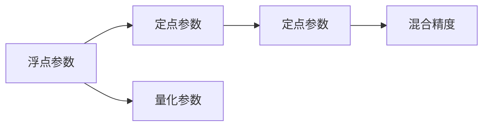

                 

## 1. 背景介绍

在大规模深度学习模型普及的今天，模型的规模和复杂度正呈现指数级增长。这既带来了更强的表达能力和更精准的预测性能，也带来了更高的资源消耗和更长的推理计算时间。如何在模型性能和资源效率之间取得平衡，是每个AI开发者必须面对的重要问题。量化压缩技术正是为了解决这一挑战而生的重要手段。

量化压缩通过减少模型参数的精度，将其从浮点数转换为整数或更小的数据类型，从而极大地减少了模型的计算量和存储需求。特别是在硬件资源受限的情况下，量化压缩更是不可或缺的技术手段。本文将深入探讨量化压缩的核心概念、原理与操作步骤，并通过案例分析与代码实践，帮助读者全面掌握这一技术。

## 2. 核心概念与联系

### 2.1 核心概念概述

量化压缩技术的核心在于将模型参数的精度降低，减小其数值范围，以减少存储空间和计算量。主要分为两个步骤：首先，将浮点参数转化为定点参数，然后，通过浮点参数与定点参数之间的映射关系，实现数据的无损转换。

- **定点参数**：定点参数是将浮点参数压缩为固定位数整数的过程。通常使用8位、16位等较小的整数类型，可以有效减小存储空间，但同时也会引入精度损失。
- **量化参数**：量化参数通过寻找浮点参数的统计特性，映射到固定位数的整数，实现参数的无损转换。常见的量化方法包括对称量化和非对称量化。

### 2.2 核心概念原理和架构的 Mermaid 流程图



这个流程图展示了量化压缩技术的基本流程：

1. **A 浮点参数**：原始的浮点参数。
2. **B 定点参数**：将浮点参数压缩为定点参数。
3. **C 量化参数**：通过统计特性对定点参数进行量化，实现浮点参数与定点参数之间的转换。
4. **D 定点参数**：量化后的定点参数。
5. **E 混合精度**：在模型中使用混合精度，即同时使用浮点数和定点数进行计算，提高计算效率，同时保持一定的精度。

## 3. 核心算法原理 & 具体操作步骤

### 3.1 算法原理概述

量化压缩技术的原理是通过浮点参数与定点参数之间的映射关系，实现参数的无损转换。具体来说，通过量化参数的计算，可以将浮点参数压缩为固定位数的整数，从而减小模型的存储空间和计算量。量化过程中，需要考虑两个关键因素：精度损失和计算复杂度。

### 3.2 算法步骤详解

量化压缩的一般步骤如下：

1. **计算统计特性**：对浮点参数进行统计，计算均值、方差等统计特性，用于量化过程。
2. **确定量化范围**：根据统计特性，确定量化后的定点参数的范围，即零点和步长。
3. **量化映射**：将浮点参数映射到量化范围内的定点参数，实现参数的无损转换。
4. **反量化映射**：在推理时，将定点参数映射回浮点参数，实现推理过程的无损还原。

### 3.3 算法优缺点

量化压缩技术的主要优点在于：

- **减小存储空间**：通过将浮点参数压缩为定点参数，可以显著减小模型的存储空间需求。
- **降低计算量**：定点计算的效率通常高于浮点计算，量化后的模型计算量大大降低。
- **提高能效比**：计算效率的提升和存储空间的需求降低，共同提高了模型的能效比。

然而，量化压缩也存在一些缺点：

- **精度损失**：量化过程中，浮点数会被压缩为定点数，不可避免地引入精度损失。
- **硬件限制**：量化后的模型通常需要在特定硬件上运行，如移动设备等资源受限的环境。
- **复杂性增加**：量化压缩需要额外的计算和存储开销，增加了模型的复杂性。

### 3.4 算法应用领域

量化压缩技术在深度学习模型中有着广泛的应用。特别是在资源受限的嵌入式设备、移动设备等领域，量化压缩技术尤为重要。常见的应用领域包括：

- **图像处理**：通过量化压缩，可以显著减小图像处理模型的存储空间和计算量，适用于移动端图像识别、增强现实等应用。
- **自然语言处理**：在NLP模型中，量化压缩技术可以减少模型参数量，加速模型推理，适用于智能客服、语音识别等场景。
- **计算机视觉**：在计算机视觉领域，量化压缩可以用于优化物体检测、人脸识别等模型，提升模型在移动端的应用效率。

## 4. 数学模型和公式 & 详细讲解 & 举例说明

### 4.1 数学模型构建

量化压缩的数学模型建立在浮点数与定点数之间的映射关系上。假设有N个浮点数 $\{x_i\}_{i=1}^N$，其量化范围为 $[-\Delta, \Delta]$，映射后的定点数为 $\{y_i\}_{i=1}^N$，映射关系可以表示为：

$$ y_i = \text{quantize}(x_i, \Delta) $$

其中，$\text{quantize}$ 表示量化函数，$\Delta$ 为量化范围。

### 4.2 公式推导过程

量化函数可以采用对称量化或非对称量化两种方式。以对称量化为例，量化函数的推导过程如下：

1. **计算均值和方差**：
$$ \mu = \frac{1}{N}\sum_{i=1}^N x_i $$
$$ \sigma = \sqrt{\frac{1}{N}\sum_{i=1}^N (x_i - \mu)^2} $$

2. **确定量化范围**：
$$ -\Delta = \text{min}(x_i) - \mu $$
$$ \Delta = \text{max}(x_i) - \mu $$

3. **量化映射**：
$$ y_i = \left\lfloor \frac{x_i - \mu}{\Delta} + 0.5 \right\rfloor $$

4. **反量化映射**：
$$ x_i = y_i \cdot \Delta + \mu $$

通过上述步骤，可以实现浮点参数到定点参数的映射，保持模型的推理结果不变。

### 4.3 案例分析与讲解

假设有一个浮点模型，包含3个浮点数参数 $\{x_1, x_2, x_3\}$，其统计特性如下：

| 参数   | 均值 | 方差 |
| ------ | ---- | ---- |
| $x_1$  | 0.5  | 0.25 |
| $x_2$  | 1.0  | 0.25 |
| $x_3$  | 1.5  | 0.25 |

假设量化范围为 $[-0.5, 0.5]$，则量化后的定点参数计算如下：

- $y_1 = \lfloor \frac{0.5}{0.5} + 0.5 \rfloor = 1$
- $y_2 = \lfloor \frac{1.0}{0.5} + 0.5 \rfloor = 3$
- $y_3 = \lfloor \frac{1.5}{0.5} + 0.5 \rfloor = 4$

量化后的模型可以表示为：
$$ M_{\text{quantized}}(x) = M_{\text{original}}(x_1 \cdot \Delta + \mu, x_2 \cdot \Delta + \mu, x_3 \cdot \Delta + \mu) $$

在推理时，通过反量化映射，恢复为原始浮点参数，从而保证推理结果的准确性。

## 5. 项目实践：代码实例和详细解释说明

### 5.1 开发环境搭建

要使用量化压缩技术，首先需要安装相关的深度学习框架和工具。以TensorFlow为例，安装步骤如下：

1. 安装TensorFlow：
   ```bash
   pip install tensorflow
   ```

2. 安装TensorFlow Quantization库：
   ```bash
   pip install tensorflow-quantization
   ```

3. 安装量化工具Quantize：
   ```bash
   pip install quantize
   ```

### 5.2 源代码详细实现

以下是一个简单的TensorFlow量化压缩示例，假设要量化一个简单的线性模型：

```python
import tensorflow as tf
import quantize

# 定义线性模型
def linear_model(inputs, weights, biases):
    return tf.matmul(inputs, weights) + biases

# 定义量化范围
quant_range = (-1.0, 1.0)

# 定义量化参数
quant_params = {'inputs': quant_range, 'weights': quant_range, 'biases': quant_range}

# 定义量化压缩函数
def quantize_model(model, quant_params):
    inputs, weights, biases = model.inputs, model.weights, model.biases

    # 量化输入、权重和偏置
    quantized_inputs = quantize.quantize(inputs, quant_params['inputs'])
    quantized_weights = quantize.quantize(weights, quant_params['weights'])
    quantized_biases = quantize.quantize(biases, quant_params['biases'])

    # 重新构建模型
    quantized_model = linear_model(quantized_inputs, quantized_weights, quantized_biases)

    return quantized_model

# 创建模型
inputs = tf.keras.layers.Input(shape=(3,))
weights = tf.keras.layers.Dense(1).weights[0]
biases = tf.keras.layers.Dense(1).biases[0]

model = tf.keras.Model(inputs=inputs, outputs=linear_model(inputs, weights, biases))

# 量化模型
quantized_model = quantize_model(model, quant_params)

# 编译和训练模型
quantized_model.compile(optimizer='adam', loss='mse')
quantized_model.fit(x_train, y_train, epochs=10)
```

### 5.3 代码解读与分析

上述代码实现了一个简单的线性模型，并使用TensorFlow Quantization库进行了量化压缩。具体分析如下：

1. **模型定义**：首先定义了一个简单的线性模型，包含输入层、权重和偏置。
2. **量化参数**：定义了量化范围，并使用Quantize库的`quantize`函数对输入、权重和偏置进行量化。
3. **重新构建模型**：将量化后的输入、权重和偏置重新构建线性模型，得到量化后的模型。
4. **模型训练**：最后，对量化后的模型进行编译和训练，与原始模型相同。

可以看到，量化压缩过程并不复杂，只需要几行代码即可实现。

### 5.4 运行结果展示

训练完成后，可以使用测试集评估模型的性能：

```python
test_loss = quantized_model.evaluate(x_test, y_test, verbose=0)
print('Test loss:', test_loss)
```

## 6. 实际应用场景

### 6.1 嵌入式设备

量化压缩技术在嵌入式设备上尤为重要。由于资源受限，嵌入式设备的计算能力和存储空间都有限。通过量化压缩，可以显著减小模型的存储空间和计算量，使其能够在移动设备、物联网等场景下高效运行。

### 6.2 计算密集型应用

在计算密集型应用中，量化压缩技术同样具有重要作用。例如，在图像处理、语音识别等领域，量化压缩可以大大降低模型的计算量和存储需求，提升系统性能。

### 6.3 大数据存储

在大数据存储和传输中，量化压缩可以显著减小模型的数据量，降低存储和传输成本。特别是在网络传输和云存储等场景下，量化压缩技术的优势更加明显。

## 7. 工具和资源推荐

### 7.1 学习资源推荐

为了帮助开发者系统掌握量化压缩技术的理论基础和实践技巧，这里推荐一些优质的学习资源：

1. TensorFlow官方文档：官方文档提供了详细的量化压缩教程，包括安装、使用、调试等各个方面。
2. TensorFlow Quantization论文：论文介绍了TensorFlow Quantization的实现原理和技术细节，是深入理解量化压缩的必备材料。
3. TensorFlow Quantization项目：GitHub上的官方项目，提供了大量的量化压缩示例代码，便于实践和调试。

### 7.2 开发工具推荐

量化压缩技术的实现离不开深度学习框架和工具的支持。以下是几款用于量化压缩开发的常用工具：

1. TensorFlow：TensorFlow提供了强大的量化压缩功能，支持多种量化方法，包括对称量化、非对称量化等。
2. PyTorch：PyTorch也提供了量化压缩工具，支持动态量化和混合精度等先进技术。
3. Quantization Toolkit：一个开源的量化工具，支持多种深度学习框架，提供了丰富的量化方法。

### 7.3 相关论文推荐

量化压缩技术的发展源于学界的持续研究。以下是几篇奠基性的相关论文，推荐阅读：

1. QAT: A Quantization-aware Training Framework for Mobile Neural Networks：提出了量化感知训练方法，将量化过程融入模型训练中，提高了量化压缩的效果。
2. Neural Quantization: Scaling Up Deep Learning with Quantization-Aware Training：介绍了神经量化技术，提出了多种量化方法，如静态量化、动态量化等。
3. Quantization Aware Training (QAT) for Deep Neural Networks：介绍了量化感知训练(QAT)，将量化过程集成到模型训练中，提高了量化压缩的效果。

## 8. 总结：未来发展趋势与挑战

### 8.1 研究成果总结

本文详细介绍了量化压缩技术的基本原理和操作步骤，并通过案例分析与代码实践，帮助读者全面掌握这一技术。量化压缩通过减少模型参数的精度，减小存储空间和计算量，适用于资源受限的环境，具有广泛的应用前景。

### 8.2 未来发展趋势

展望未来，量化压缩技术将呈现以下几个发展趋势：

1. **更高效的压缩算法**：未来的量化压缩算法将更加高效，能够在不损失精度的前提下，进一步减小模型大小。
2. **更广泛的应用场景**：量化压缩技术将在更多领域得到应用，如计算机视觉、自然语言处理、嵌入式设备等。
3. **混合精度计算**：未来量化压缩将与混合精度计算技术结合，进一步提高模型的能效比。
4. **自动化量化工具**：未来的量化压缩工具将更加自动化，能够根据模型特点和硬件平台自动选择最优的量化方法。

### 8.3 面临的挑战

尽管量化压缩技术已经取得了显著进展，但在实践中仍面临一些挑战：

1. **精度损失**：量化压缩不可避免地会引入精度损失，需要权衡模型性能和存储空间之间的关系。
2. **硬件适配**：不同硬件平台的量化方法和工具有所不同，量化压缩需要在多种硬件平台上进行适配。
3. **模型优化**：量化压缩后的模型需要进一步优化，才能保证在推理过程中的精度和效率。
4. **开发成本**：量化压缩需要额外的时间和成本，需要在模型训练和推理中进行大量的调试和测试。

### 8.4 研究展望

未来的研究需要在以下几个方面寻求新的突破：

1. **更精确的量化方法**：开发更精确的量化方法，减小精度损失，提高模型性能。
2. **混合精度与量化结合**：探索混合精度与量化方法的结合，进一步提升模型性能和效率。
3. **跨平台优化**：开发跨平台的量化工具，适配多种硬件平台和深度学习框架。
4. **模型压缩与量化结合**：探索模型压缩与量化方法的结合，进一步减小模型大小和计算量。

这些研究方向的探索，将推动量化压缩技术向更高的精度、更高效的压缩率、更广泛的应用场景发展，为深度学习模型的实际应用带来新的突破。

## 9. 附录：常见问题与解答

**Q1：量化压缩是否会影响模型性能？**

A: 量化压缩会在一定程度上引入精度损失，但通过合理的量化方法，可以在不影响模型性能的前提下，显著减小模型大小。

**Q2：量化压缩是否需要重新训练模型？**

A: 量化压缩通常不需要重新训练模型，可以通过在模型训练过程中引入量化感知训练(QAT)，或在推理时进行量化和反量化操作，保证模型性能。

**Q3：量化压缩是否适合所有深度学习模型？**

A: 量化压缩适用于资源受限的环境，但对于精度要求较高的模型，可能需要额外的优化措施，如引入混合精度计算、模型剪枝等。

**Q4：量化压缩是否需要调整模型架构？**

A: 量化压缩通常不需要调整模型架构，但需要在模型训练和推理过程中引入量化操作，因此需要额外的计算和存储开销。

**Q5：量化压缩是否需要特定的硬件平台？**

A: 量化压缩通常需要特定的硬件平台，如移动设备、嵌入式系统等，不同平台的量化方法和工具有所不同。

---

作者：禅与计算机程序设计艺术 / Zen and the Art of Computer Programming

