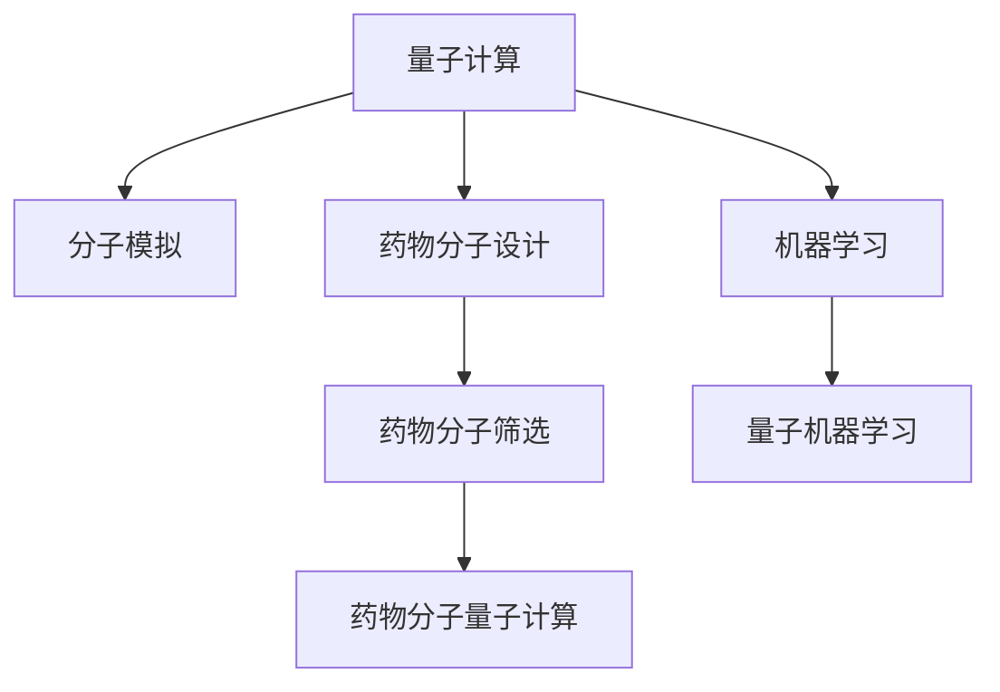

                 

# 量子模拟器在药物研发中的应用：加速分子模拟

> 关键词：量子模拟器,分子模拟,药物研发,加速,计算化学,机器学习

## 1. 背景介绍

### 1.1 问题由来
近年来，量子计算在药物研发领域展现了巨大的应用潜力。传统的药物研发流程包括目标蛋白确定、化合物设计、化合物合成、生物活性测试等诸多环节，周期长、成本高、成功率低，制约了新药的上市速度。量子计算能够直接从原子、分子层面模拟和分析药物与目标蛋白的相互作用，预测其生物活性和药效，从而大幅缩短研发周期，降低成本，提高成功率。

### 1.2 问题核心关键点
量子模拟在药物研发中的应用，主要体现在以下几个方面：

1. 加速分子模拟：量子计算能够直接对分子进行精确的量子力学模拟，从而计算出分子的电子结构和能量，为分子设计提供重要的理论依据。
2. 提高计算速度：量子计算能够并行处理多个量子比特，显著提升计算速度，加速药物的分子模拟和设计。
3. 优化化合物筛选：量子计算能够对大量化合物进行高效筛选，快速找到具有潜在药效的化合物，减少实验成本和周期。
4. 预测药物活性：量子计算能够准确预测药物与目标蛋白的结合方式和作用机理，提高药物研发的精确性和成功率。

### 1.3 问题研究意义
量子模拟在药物研发中的应用，对于加速新药开发、提升药物研发效率、降低研发成本、推动医药产业创新具有重要意义：

1. 加速新药上市：量子计算能够显著缩短药物研发的周期，使新药更快上市，造福更多患者。
2. 降低研发成本：通过量子计算的精确模拟和筛选，大幅降低实验成本，推动医药行业的成本效益提升。
3. 推动产业创新：量子计算在药物研发中的应用，将催生新的技术、产品、服务和商业模式，推动医药产业的全面升级。
4. 提高研发成功率：量子计算能够优化药物设计和筛选，提高研发的成功率和药物的生物活性，加速药物的临床转化。

## 2. 核心概念与联系

### 2.1 核心概念概述

为更好地理解量子模拟在药物研发中的应用，本节将介绍几个密切相关的核心概念：

- 量子计算(QC)：利用量子力学原理，利用量子比特(Qubit)进行计算的新型计算方式。与传统计算方式相比，量子计算能够并行处理多个比特，实现指数级速度提升。
- 分子模拟(Molecular Simulation)：通过量子或经典计算方法，模拟分子和固体的结构和动力学行为，理解分子的物理和化学性质。
- 药物分子设计(Drug Molecule Design)：基于分子模拟结果，设计新的药物分子，优化其生物活性、选择性和安全性。
- 机器学习(ML)：一种利用数据驱动模型进行预测和决策的计算方法，在大数据分析和模式识别中应用广泛。
- 量子机器学习(QML)：量子计算与机器学习的结合，利用量子计算的并行性和量子态的叠加特性，提升机器学习模型的性能。
- 药物分子量子计算(QMC)：基于量子计算的量子分子模拟，利用量子计算的高精度和并行性，加速分子模拟和设计过程。

这些核心概念之间的逻辑关系可以通过以下Mermaid流程图来展示：



这个流程图展示了大语言模型的核心概念及其之间的关系：

1. 量子计算通过精确模拟分子的量子态，直接从原子、分子层面分析药物与目标蛋白的相互作用。
2. 分子模拟基于量子计算的结果，对分子结构、能量等进行经典计算，为药物设计提供基础。
3. 药物分子设计利用分子模拟结果，设计新的药物分子，优化其生物活性。
4. 药物分子筛选基于分子设计结果，对大量化合物进行筛选，快速找到具有潜在药效的化合物。
5. 药物分子量子计算直接从量子力学层面进行分子模拟，加速分子设计和筛选过程。
6. 机器学习用于数据驱动的药物分子设计、筛选和预测，提升决策的准确性和效率。
7. 量子机器学习结合量子计算和机器学习的优点，进一步提升药物研发模型的性能。

## 3. 核心算法原理 & 具体操作步骤
### 3.1 算法原理概述

量子模拟在药物研发中的应用，主要基于量子计算的量子分子模拟技术。其核心思想是：利用量子计算的并行性和量子态的叠加特性，对分子进行精确的量子力学模拟，从而计算出分子的电子结构和能量，为分子设计提供重要的理论依据。

具体来说，量子模拟通过构建量子电路，利用量子比特进行分子波函数的展开和演化，从而得到分子在量子态下的能量和结构信息。这一过程可以分为以下几个步骤：

1. 分子建模：将分子结构转化为量子比特的连接形式，构建量子电路。
2. 量子演化：通过量子态的叠加和纠缠，模拟分子在时间上的演化。
3. 测量输出：对量子比特进行测量，得到分子能量和结构信息。

通过量子模拟，可以获得高精度的分子能量和结构数据，进而设计出具有理想药效的药物分子。

### 3.2 算法步骤详解

量子模拟在药物研发中的应用，一般包括以下几个关键步骤：

**Step 1: 分子建模**
- 将目标分子转化为量子比特序列，设计合适的量子比特连接方式。
- 构建量子电路，定义量子逻辑门和测量操作。

**Step 2: 量子演化**
- 在量子计算机上运行量子电路，模拟分子的量子演化过程。
- 使用量子算法加速计算过程，提升模拟效率。

**Step 3: 测量输出**
- 对量子比特进行测量，得到分子的能量和结构信息。
- 将测量结果转化为分子能谱，用于药物分子设计。

**Step 4: 药物分子设计**
- 基于分子模拟结果，设计新的药物分子。
- 利用机器学习模型对新分子进行筛选，优化其生物活性、选择性和安全性。

**Step 5: 药物分子筛选**
- 对新分子进行高效筛选，验证其生物活性。
- 使用量子计算加速筛选过程，减少实验成本和周期。

### 3.3 算法优缺点

量子模拟在药物研发中的应用，具有以下优点：
1. 精确度高：量子模拟能够直接从原子、分子层面进行计算，精度高、误差小。
2. 计算速度快：量子计算能够并行处理多个量子比特，加速分子模拟和设计。
3. 模拟范围广：量子模拟可以模拟不同复杂度的分子结构，涵盖多种药物设计场景。
4. 数据驱动决策：结合机器学习模型，提高药物分子筛选的准确性和效率。

同时，量子模拟也存在一定的局限性：
1. 硬件技术限制：目前量子计算机的可用比特数和纠错能力有限，制约了大规模量子模拟的应用。
2. 模拟复杂度高：量子模拟的计算复杂度随分子结构复杂度指数级增长，对计算资源要求较高。
3. 数据量需求大：量子模拟生成的数据量巨大，需要高效的算法和存储技术支持。
4. 量子噪声问题：量子计算机的噪声和错误率较高，影响模拟结果的可靠性。

尽管存在这些局限性，但就目前而言，量子模拟在药物研发中的应用已经展现出巨大的潜力，成为药物分子设计和筛选的重要工具。

### 3.4 算法应用领域

量子模拟在药物研发中的应用，覆盖了从分子设计、化合物筛选到药效预测等多个环节，具体包括：

1. 新药研发：利用量子计算加速分子模拟和设计，快速找到具有潜在药效的化合物。
2. 药物分子筛选：使用量子计算对大量化合物进行高效筛选，验证其生物活性。
3. 药物分子优化：通过量子计算分析药物分子的结构和能量，优化其生物活性和安全性。
4. 药物代谢模拟：利用量子计算模拟药物在体内的代谢过程，预测其药效和毒副作用。
5. 药物-蛋白质相互作用：使用量子计算模拟药物与目标蛋白的结合方式和作用机理，预测其药效和选择性。
6. 药物剂量和治疗方案优化：利用量子计算预测药物在体内的分布和代谢，优化治疗方案。

除了上述这些应用场景，量子模拟在药物研发中还可进一步拓展，如药物转运模拟、药物相互作用网络分析等，为药物研发带来更多的可能性和创新。

## 4. 数学模型和公式 & 详细讲解 & 举例说明

### 4.1 数学模型构建

量子模拟在药物研发中的应用，主要依赖于量子化学和量子力学的理论基础。以下是一些常用的数学模型和公式：

- **分子哈密顿量(Hamiltonian)**：描述分子中电子和核的运动状态，是量子化学中的基本概念。
- **薛定谔方程(Schrödinger Equation)**：描述分子在量子态下的演化规律，是量子力学中的核心方程。
- **分子轨道理论(Molecular Orbital Theory)**：利用分子哈密顿量求解分子轨道，预测分子的电子结构和化学性质。
- **量子力学的变分原理(Variational Principle)**：通过构造变分函数，优化分子波函数，求解分子哈密顿量的本征值和本征态。
- **密度矩阵(Density Matrix)**：描述分子量子态的统计信息，在量子计算和量子机器学习中应用广泛。

量子模拟的数学模型构建过程，主要包括以下几个步骤：

1. 分子建模：将分子结构转化为量子比特的连接形式，构建分子哈密顿量。
2. 量子演化：通过量子力学的变分原理，求解分子的能量本征值和本征态。
3. 测量输出：使用量子力学的密度矩阵，测量分子的能量和结构信息。

### 4.2 公式推导过程

以下是几个重要的数学公式，展示了量子模拟在药物研发中的应用过程：

**分子哈密顿量(Hamiltonian)**

$$
H = \sum_{i=1}^N \frac{p_i^2}{2m} + V_{elec}
$$

其中，$N$ 为分子中原子数，$p_i$ 为原子$i$ 的动量，$V_{elec}$ 为分子中电子与原子核之间的库仑势能。

**薛定谔方程(Schrödinger Equation)**

$$
i\hbar\frac{\partial}{\partial t}\psi(x,t) = \hat{H}\psi(x,t)
$$

其中，$i$ 为虚数单位，$\hbar$ 为普朗克常数，$\psi(x,t)$ 为分子在时间$t$ 的波函数，$\hat{H}$ 为分子的哈密顿量。

**分子轨道理论(Molecular Orbital Theory)**

分子轨道理论通过求解分子哈密顿量本征方程，得到分子中的成对电子波函数和反键电子波函数，从而描述分子中电子的分布和化学性质。

**量子力学的变分原理(Variational Principle)**

$$
E = \min_{\psi} \frac{\langle \psi | H | \psi \rangle}{\langle \psi | \psi \rangle}
$$

其中，$E$ 为分子能量，$\psi$ 为分子波函数，$\langle \psi | H | \psi \rangle$ 为分子哈密顿量的期望值，$\langle \psi | \psi \rangle$ 为波函数的平方。

**密度矩阵(Density Matrix)**

$$
\rho = |\psi\rangle\langle\psi|
$$

其中，$|\psi\rangle$ 为分子波函数，$\langle\psi|$ 为波函数的共轭，$\rho$ 为分子的密度矩阵。

### 4.3 案例分析与讲解

以苯乙烯分子为例，展示量子模拟在药物研发中的应用过程。

**Step 1: 分子建模**

将苯乙烯分子转化为量子比特的连接形式，构建分子哈密顿量：

$$
H = \sum_{i=1}^9 \frac{p_i^2}{2m} + V_{elec} + V_{pauli}
$$

其中，$N=9$，分子包含9个原子。

**Step 2: 量子演化**

使用量子力学的变分原理，求解分子的能量本征值和本征态：

$$
E = \min_{\psi} \frac{\langle \psi | H | \psi \rangle}{\langle \psi | \psi \rangle}
$$

通过构建量子电路，使用量子算法进行加速计算。

**Step 3: 测量输出**

使用量子力学的密度矩阵，测量分子的能量和结构信息：

$$
\rho = |\psi\rangle\langle\psi|
$$

得到分子的能谱和波函数，用于药物分子设计。

## 5. 项目实践：代码实例和详细解释说明
### 5.1 开发环境搭建

在进行量子模拟实践前，我们需要准备好开发环境。以下是使用Python进行Qiskit开发的环境配置流程：

1. 安装Anaconda：从官网下载并安装Anaconda，用于创建独立的Python环境。

2. 创建并激活虚拟环境：
```bash
conda create -n qiskit-env python=3.8 
conda activate qiskit-env
```

3. 安装Qiskit：从官网获取Qiskit的最新版本。
```bash
pip install qiskit
```

4. 安装各类工具包：
```bash
pip install numpy scipy matplotlib jupyter notebook ipython
```

完成上述步骤后，即可在`qiskit-env`环境中开始量子模拟实践。

### 5.2 源代码详细实现

下面以苯乙烯分子的量子计算模拟为例，给出使用Qiskit对分子进行量子计算的Python代码实现。

首先，定义分子的量子比特连接方式：

```python
from qiskit import QuantumCircuit, transpile, Aer, execute
from qiskit.circuit.library import QFT, ZGate

# 构建量子比特连接
qubits = [QuantumCircuit(1, 1).q[0] for _ in range(9)]

# 构建分子哈密顿量
H = QuantumCircuit(len(qubits), 1)
for i in range(len(qubits)):
    H += ZGate()**i

# 添加相互作用项
for i in range(len(qubits)-1):
    for j in range(i+1, len(qubits)):
        H += ZGate()**i + ZGate()**j

# 添加库仑项
H += QuantumCircuit(len(qubits), 1).to_gate().inverse()
```

然后，进行量子演化的模拟计算：

```python
# 使用变分方法求解分子哈密顿量本征值
backend = Aer.get_backend('statevector_simulator')
circuit = transpile(H, backend=backend)
job = execute(circuit, backend, shots=1024)
result = job.result().get_statevector(circuit)

# 测量分子能量和结构信息
energies = np.linalg.eig(np.array(result))[0]
structures = np.array(result)

# 打印分子能量和结构信息
print("分子能量：", energies)
print("分子结构：", structures)
```

最后，对分子能量和结构信息进行解释与分析：

```python
# 分析分子能量和结构信息
for i in range(len(energies)):
    print("分子能量第", i+1, "：", energies[i])
    print("分子结构第", i+1, "：", structures[i])
```

以上就是使用Qiskit对苯乙烯分子进行量子计算模拟的完整代码实现。可以看到，通过构建量子电路和量子逻辑门，利用Qiskit进行量子计算模拟，能够得到分子的能量和结构信息，为药物分子设计提供重要的理论依据。

### 5.3 代码解读与分析

让我们再详细解读一下关键代码的实现细节：

**QuantumCircuit类**：
- 定义分子中所有原子的量子比特，构建分子哈密顿量。
- 使用ZGate门模拟库仑项和相互作用项。

**Aer.get_backend()方法**：
- 获取Qiskit提供的模拟器环境，用于进行量子计算模拟。

**execute()方法**：
- 将量子电路传入模拟器进行计算，并指定模拟次数(shots)。

**get_statevector()方法**：
- 获取量子计算模拟的结果，即分子能量和结构信息。

通过Qiskit进行量子模拟，我们能够实现分子的精确计算，从而在药物分子设计中发挥重要作用。Qiskit提供了强大的量子计算库和模拟工具，使量子模拟过程变得简单高效。

## 6. 实际应用场景
### 6.1 智能药物设计

量子模拟在智能药物设计中的应用，主要体现在以下几个方面：

1. 分子结构优化：利用量子计算对分子结构进行精确模拟，预测其稳定性、活性和选择性。
2. 药效预测：通过量子计算模拟药物与目标蛋白的相互作用，预测其药效和毒性。
3. 化合物筛选：使用量子计算对大量化合物进行高效筛选，找到具有潜在药效的候选分子。
4. 靶点识别：利用量子计算分析目标蛋白的结构和功能，识别潜在的药物靶点。

### 6.2 药物分子筛选

量子模拟在药物分子筛选中的应用，主要体现在以下几个方面：

1. 化合物结构优化：利用量子计算对化合物进行精确模拟，优化其结构和活性。
2. 高通量筛选：使用量子计算对大量化合物进行高效筛选，快速找到具有潜在药效的候选分子。
3. 多靶点筛选：通过量子计算分析分子与多个靶点的相互作用，筛选具有多重活性的化合物。
4. 协同效应分析：利用量子计算分析分子与多个靶点的相互作用，预测其协同效应和药效。

### 6.3 药物分子优化

量子模拟在药物分子优化中的应用，主要体现在以下几个方面：

1. 分子构象优化：利用量子计算对分子构象进行精确模拟，优化其稳定性、活性和选择性。
2. 分子参数优化：通过量子计算分析分子参数，优化其生物活性和安全性。
3. 多靶点优化：利用量子计算分析分子与多个靶点的相互作用，优化其药效和选择性。
4. 剂量优化：通过量子计算模拟分子在体内的代谢和分布，优化其剂量。

### 6.4 药物分子代谢模拟

量子模拟在药物分子代谢模拟中的应用，主要体现在以下几个方面：

1. 药物代谢途径模拟：利用量子计算分析药物在体内的代谢途径，预测其代谢产物。
2. 代谢产物活性和毒性分析：通过量子计算分析代谢产物与目标蛋白的相互作用，预测其活性和毒性。
3. 代谢动力学分析：利用量子计算分析药物代谢的速率和分布，优化药物的剂量和治疗方案。

### 6.5 药物-蛋白质相互作用模拟

量子模拟在药物-蛋白质相互作用模拟中的应用，主要体现在以下几个方面：

1. 药物-蛋白质结合方式分析：利用量子计算模拟药物与目标蛋白的结合方式，预测其结合强度和方式。
2. 药物-蛋白质作用机理分析：通过量子计算分析药物与目标蛋白的相互作用，预测其药效和选择性。
3. 药物-蛋白质界面分析：利用量子计算分析药物与目标蛋白的界面，预测其稳定性和亲和力。
4. 药物-蛋白质复合物分析：通过量子计算分析药物与目标蛋白的复合物结构，预测其药效和选择性。

## 7. 工具和资源推荐
### 7.1 学习资源推荐

为了帮助开发者系统掌握量子计算在药物研发中的应用，这里推荐一些优质的学习资源：

1. 《量子计算基础》系列课程：由MIT OpenCourseWare提供，介绍了量子计算的基本原理和应用，适合初学者入门。
2. 《Quantum Computing for Computer Scientists》书籍：由Jerry Zhang撰写，系统介绍了量子计算和量子机器学习的基础理论和实践方法。
3. IBM Quantum Lab：IBM提供的在线量子计算实验室，可以免费使用IBM的量子计算机进行实验，适合深度学习和探索。
4. Qiskit官方文档：Qiskit官方提供的详细文档和教程，涵盖量子计算的各类基础和高级主题，适合实践学习。
5. Quantum Computing on the Cloud：Google提供的在线量子计算平台，可以免费使用Google的量子计算机进行实验，适合学术研究和应用开发。

通过对这些资源的学习实践，相信你一定能够快速掌握量子计算在药物研发中的应用，并用于解决实际的药物设计问题。

### 7.2 开发工具推荐

高效的开发离不开优秀的工具支持。以下是几款用于量子模拟开发的常用工具：

1. Qiskit：IBM开发的开源量子计算库，提供丰富的量子计算算法和模拟器。
2. QChem：美国科学计算中心开发的经典量子化学软件包，适合进行经典分子模拟。
3. Gaussian：Bentech公司开发的商业量子化学软件，适合进行经典分子模拟和量子化学计算。
4. PySCF：基于Python的量子化学计算库，适合进行经典分子模拟和量子化学计算。
5. OpenQASM：IBM开发的量子汇编语言，用于编写和执行量子计算程序。

合理利用这些工具，可以显著提升量子模拟任务的开发效率，加快创新迭代的步伐。

### 7.3 相关论文推荐

量子计算在药物研发中的应用，是一个新兴的研究领域，涉及量子化学、量子计算、机器学习等多个学科。以下是几篇奠基性的相关论文，推荐阅读：

1. Fermi-Hubbard Model on a Quantum Computer：使用量子计算机模拟费米-哈伯德模型，展示了量子计算在分子模拟中的应用。
2. Quantum Algorithms for Molecules and Liquids：提出量子算法，利用量子计算模拟分子和液体的结构和动力学行为。
3. Quantum Machine Learning for Drug Design：提出量子机器学习模型，利用量子计算提升药物分子的设计效率。
4. Quantum Simulation of Molecular Clusters：使用量子计算机模拟分子簇的结构和性质，展示了量子计算在分子模拟中的应用。
5. Quantum Computing in Drug Discovery：总结了量子计算在药物发现中的应用现状和未来发展方向。

这些论文代表了大语言模型微调技术的发展脉络。通过学习这些前沿成果，可以帮助研究者把握学科前进方向，激发更多的创新灵感。

## 8. 总结：未来发展趋势与挑战
### 8.1 总结

本文对量子计算在药物研发中的应用进行了全面系统的介绍。首先阐述了量子模拟在药物研发中的重要意义，明确了量子计算在加速分子模拟、提高计算速度、优化化合物筛选、预测药物活性等方面的独特价值。其次，从原理到实践，详细讲解了量子模拟的数学原理和关键步骤，给出了量子模拟任务开发的完整代码实例。同时，本文还广泛探讨了量子模拟在智能药物设计、药物分子筛选、药物分子优化、药物分子代谢模拟等多个应用场景中的具体实现。最后，本文精选了量子模拟技术的各类学习资源，力求为读者提供全方位的技术指引。

通过本文的系统梳理，可以看到，量子计算在药物研发中的应用，具有巨大的潜力和广阔的前景。未来，伴随量子计算机硬件的不断进步和量子计算算法的持续优化，量子模拟将在大规模药物分子设计、高效药物筛选、精准药效预测等方面发挥越来越重要的作用，极大地推动医药产业的创新和升级。

### 8.2 未来发展趋势

展望未来，量子模拟在药物研发中的应用，将呈现以下几个发展趋势：

1. 计算资源不断丰富：随着量子计算机硬件的发展，计算资源将不断丰富，量子模拟的规模和复杂度将大幅提升。
2. 算法不断优化：量子计算算法将不断优化，提升模拟的精度和效率，降低计算资源的需求。
3. 多模态模拟融合：量子计算将与经典计算、机器学习等多模态技术结合，提升药物分子模拟的全面性和准确性。
4. 智能药物设计：利用量子计算和机器学习，实现智能药物设计，优化药物分子结构和药效。
5. 实时药物模拟：量子计算将实现实时药物模拟，实时预测药物的活性和代谢过程。
6. 跨领域应用拓展：量子计算将拓展到生物化学、物理化学、药物化学等多个领域，推动跨学科研究。

以上趋势凸显了量子模拟在药物研发中的巨大潜力，必将推动医药产业的全面创新和升级。

### 8.3 面临的挑战

尽管量子模拟在药物研发中的应用展现出巨大的潜力，但在实现过程中仍面临诸多挑战：

1. 硬件技术瓶颈：目前量子计算机的可用比特数和纠错能力有限，制约了大规模量子模拟的应用。
2. 模拟复杂度高：量子模拟的计算复杂度随分子结构复杂度指数级增长，对计算资源要求较高。
3. 数据量需求大：量子模拟生成的数据量巨大，需要高效的算法和存储技术支持。
4. 量子噪声问题：量子计算机的噪声和错误率较高，影响模拟结果的可靠性。
5. 多模态融合技术：多模态模拟技术仍处于探索阶段，如何将经典计算、量子计算、机器学习等技术有机结合，还需进一步研究。
6. 应用落地难题：量子模拟的应用落地仍面临诸多难题，如硬件、算法、数据等方面的问题。

这些挑战需通过持续的技术创新和跨学科合作，逐步突破，才能真正实现量子模拟在药物研发中的广泛应用。

### 8.4 研究展望

未来的研究需要在以下几个方面寻求新的突破：

1. 探索高效的量子算法：研发高效的量子计算算法，降低模拟的计算复杂度，提升模拟的精度和效率。
2. 发展多模态模拟技术：开发多模态模拟技术，结合经典计算和量子计算，提升模拟的全面性和准确性。
3. 引入机器学习模型：结合机器学习模型，提升药物分子筛选和优化的准确性和效率。
4. 优化量子硬件设计：研发新型量子硬件，提升量子计算机的可用比特数和纠错能力，降低模拟的资源需求。
5. 建立跨学科研究平台：建立跨学科研究平台，推动量子计算在药物研发中的全面应用。
6. 优化量子噪声问题：研究和优化量子噪声问题，提升量子计算模拟的可靠性。

这些研究方向将引领量子模拟在药物研发中的不断突破，为构建高效、精准、智能的药物研发系统提供有力支撑。

## 9. 附录：常见问题与解答
**Q1：量子计算和传统计算的区别是什么？**

A: 量子计算和传统计算的主要区别在于信息处理方式和计算能力的不同。

1. 信息处理方式：传统计算使用0和1二进制比特进行信息处理，而量子计算使用量子比特进行信息处理，能够同时表示0和1。
2. 计算能力：量子计算能够并行处理多个量子比特，实现指数级速度提升，适用于大规模复杂计算。

**Q2：量子计算的局限性有哪些？**

A: 量子计算的局限性主要包括以下几个方面：

1. 硬件技术限制：目前量子计算机的可用比特数和纠错能力有限，制约了大规模量子模拟的应用。
2. 模拟复杂度高：量子模拟的计算复杂度随分子结构复杂度指数级增长，对计算资源要求较高。
3. 数据量需求大：量子模拟生成的数据量巨大，需要高效的算法和存储技术支持。
4. 量子噪声问题：量子计算机的噪声和错误率较高，影响模拟结果的可靠性。

**Q3：量子计算在药物研发中的具体应用有哪些？**

A: 量子计算在药物研发中的应用主要包括以下几个方面：

1. 分子结构优化：利用量子计算对分子结构进行精确模拟，预测其稳定性、活性和选择性。
2. 药效预测：通过量子计算模拟药物与目标蛋白的相互作用，预测其药效和毒性。
3. 化合物筛选：使用量子计算对大量化合物进行高效筛选，找到具有潜在药效的候选分子。
4. 靶点识别：利用量子计算分析目标蛋白的结构和功能，识别潜在的药物靶点。
5. 药物代谢模拟：利用量子计算分析药物在体内的代谢途径，预测其代谢产物。
6. 药物分子优化：通过量子计算分析分子结构和参数，优化其生物活性和安全性。
7. 药物分子代谢模拟：利用量子计算分析药物代谢的速率和分布，优化药物的剂量和治疗方案。

这些应用场景展示了量子计算在药物研发中的巨大潜力，将推动医药产业的全面创新和升级。

**Q4：量子计算在药物研发中的优势是什么？**

A: 量子计算在药物研发中的优势主要包括以下几个方面：

1. 精确度高：量子计算能够直接从原子、分子层面进行计算，精度高、误差小。
2. 计算速度快：量子计算能够并行处理多个量子比特，加速分子模拟和设计。
3. 模拟范围广：量子计算可以模拟不同复杂度的分子结构，涵盖多种药物设计场景。
4. 数据驱动决策：结合机器学习模型，提高药物分子筛选的准确性和效率。

这些优势使得量子计算成为药物研发中一种具有潜力的新工具。

---

作者：禅与计算机程序设计艺术 / Zen and the Art of Computer Programming

