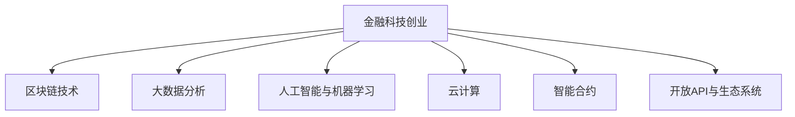

                 

# 金融科技创业：重构金融服务的未来

金融科技（FinTech）正在深刻改变金融行业的服务模式，尤其是在提升效率、降低成本、增强用户体验和增强金融包容性方面。然而，传统的金融服务模式仍存在诸多问题，如服务门槛高、效率低下、信息不对称等。本文将深入探讨金融科技创业，介绍其核心概念、关键算法、开发环境、应用场景及未来展望，为从事金融科技领域的创业者和从业者提供全面的技术指导。

## 1. 背景介绍

### 1.1 问题由来

传统金融服务通常依赖于物理网点和人工操作，存在以下主要问题：

- **服务门槛高**：银行等金融机构提供的金融产品和服务往往需要较高的准入门槛，如较高的最低存款金额、复杂的申请流程等，导致大量中小微企业和普通消费者难以接触到金融服务。
- **效率低下**：物理网点的服务速度有限，处理交易、贷款申请等业务需要较长时间，客户体验差。
- **信息不对称**：客户无法获取及时、准确、透明的服务信息，导致信任度低，金融决策困难。
- **服务范围有限**：物理网点覆盖面有限，无法实现全时全地服务，特别是偏远地区和农村地区的金融服务问题尤为突出。

金融科技的兴起为解决这些问题提供了新的解决方案。通过互联网、大数据、人工智能等技术手段，金融科技公司能够打破传统金融服务的物理限制，提供低成本、高效、便捷的金融服务，满足各类客户的需求。

### 1.2 问题核心关键点

金融科技创业的核心在于利用技术手段，创新金融服务模式，提升服务效率，降低服务成本，增强用户体验，实现金融普惠。

具体来说，金融科技创业主要关注以下几个方面：

- **技术融合**：将大数据、人工智能、区块链、云计算等先进技术应用于金融服务，提升服务质量。
- **模式创新**：探索新的金融服务模式，如线上开户、在线贷款、智能投顾等，提高服务效率和可及性。
- **客户体验**：通过用户体验设计优化金融服务流程，减少客户操作难度，提高客户满意度。
- **数据驱动**：利用大数据分析，精准匹配客户需求，实现个性化服务。
- **安全性**：确保金融服务的交易安全、数据隐私，保护客户权益。

## 2. 核心概念与联系

### 2.1 核心概念概述

金融科技创业的核心概念包括以下几个关键点：

- **金融科技（FinTech）**：指的是通过金融技术和科技手段，创新金融服务模式，提升金融服务的效率和质量。

- **区块链技术**：一种分布式账本技术，可以实现去中心化的交易记录和数据存储，保障交易的透明和安全性。

- **大数据分析**：利用大规模数据进行统计分析和机器学习，精准匹配客户需求，优化金融服务。

- **人工智能与机器学习**：通过算法模型处理和分析金融数据，实现自动化决策和智能投顾，提升服务效率和用户体验。

- **云计算**：提供弹性计算资源和基础设施，支持大规模金融应用的部署和运行。

- **智能合约**：通过区块链和自动化代码实现智能合约，自动执行合同条款，提高交易效率和透明度。

- **开放API与生态系统**：构建开放API，促进金融机构与第三方应用之间的数据共享和互操作。

这些核心概念之间通过金融科技创业这一中心点相互联系，共同构建了一个完整的金融服务生态系统。

### 2.2 核心概念原理和架构的 Mermaid 流程图



## 3. 核心算法原理 & 具体操作步骤

### 3.1 算法原理概述

金融科技创业中涉及的核心算法主要包括区块链技术、大数据分析、人工智能与机器学习等。

- **区块链算法**：涉及共识机制、加密算法、分布式账本等技术，保障交易的透明和安全性。

- **大数据分析算法**：包括数据预处理、特征工程、统计分析、机器学习等，实现数据驱动的决策支持。

- **人工智能与机器学习算法**：包括监督学习、无监督学习、强化学习等，实现智能化的金融决策和推荐。

### 3.2 算法步骤详解

金融科技创业中的算法步骤主要包括以下几个关键步骤：

1. **数据采集与处理**：从多个数据源采集数据，并进行清洗、预处理和特征工程，形成可用于分析和决策的数据集。

2. **模型训练与验证**：使用机器学习模型对数据进行训练，并使用验证集进行模型评估和调参，选择最优模型。

3. **模型部署与测试**：将训练好的模型部署到生产环境，并进行性能测试和优化，确保模型的稳定性和准确性。

4. **持续监控与优化**：对模型进行实时监控和维护，根据用户反馈和业务变化进行模型优化和更新。

### 3.3 算法优缺点

金融科技创业中的算法优缺点如下：

- **优点**：
  - **提升效率**：利用自动化和智能化技术，大大提升金融服务的效率和处理速度。
  - **降低成本**：减少人工操作和物理网点建设成本，降低金融服务的总体成本。
  - **增强用户体验**：提供便捷、个性化的金融服务，提高客户满意度和忠诚度。
  - **降低风险**：通过区块链和智能合约技术，提高交易透明度和安全性，降低金融风险。

- **缺点**：
  - **技术复杂度**：涉及多种先进技术，技术实现和部署难度较大。
  - **数据隐私和安全问题**：数据采集和存储过程中存在隐私泄露和数据安全问题。
  - **技术壁垒**：需要高水平的技术团队和人才，初创企业难以在短期内突破技术壁垒。
  - **法律和监管问题**：金融科技涉及众多法律法规，合规性问题需要特别注意。

### 3.4 算法应用领域

金融科技创业中的算法主要应用于以下几个领域：

- **数字银行**：提供在线开户、转账、理财、贷款等金融服务，提高客户便捷性和金融服务的可及性。

- **智能投顾**：通过人工智能和大数据分析，为客户提供个性化投资建议和自动化资产管理服务。

- **供应链金融**：利用区块链和大数据分析技术，解决供应链中的融资难、融资贵问题，提升供应链整体效率。

- **保险科技**：通过大数据和人工智能技术，优化保险产品的定价、风险评估和理赔流程，提高保险服务的质量。

- **支付科技**：通过区块链和智能合约技术，实现去中心化的交易和支付，降低交易成本和风险。

## 4. 数学模型和公式 & 详细讲解 & 举例说明

### 4.1 数学模型构建

金融科技创业中的数学模型主要涉及以下几类：

- **区块链共识算法**：如PoW、PoS、DPoS等，保障网络安全和共识达成。
- **机器学习模型**：如线性回归、逻辑回归、决策树、随机森林、神经网络等，实现数据驱动的决策支持。

### 4.2 公式推导过程

以下以线性回归模型为例，推导其数学原理和计算公式。

假设有一个线性回归问题，自变量为 $X_1, X_2, ..., X_n$，因变量为 $Y$。假设模型为 $Y = \theta_0 + \sum_{i=1}^n \theta_i X_i$。

1. **数据准备**：将训练数据 $(x_i, y_i)$ 转换为矩阵形式，得到 $\mathbf{X} = [\mathbf{x}_1, \mathbf{x}_2, ..., \mathbf{x}_n]^T$，$\mathbf{y} = [y_1, y_2, ..., y_n]^T$。

2. **模型参数估计**：使用最小二乘法求解模型参数 $\mathbf{\theta} = [\theta_0, \theta_1, ..., \theta_n]^T$，使得 $\mathbf{y} = \mathbf{X} \mathbf{\theta}$。

3. **模型评估与优化**：使用交叉验证等方法评估模型性能，通过调整超参数和优化算法进行模型优化。

### 4.3 案例分析与讲解

以智能投顾为例，智能投顾使用机器学习模型对市场数据和用户数据进行分析，生成投资建议和资产管理策略。其具体步骤如下：

1. **数据采集与处理**：收集历史交易数据、市场数据、用户行为数据等，并进行数据清洗和特征工程。

2. **模型训练与验证**：使用回归模型或分类模型对数据进行训练，如随机森林、梯度提升树等，并使用交叉验证进行模型评估和调参。

3. **模型部署与测试**：将训练好的模型部署到生产环境，并进行性能测试和优化，确保模型的稳定性和准确性。

4. **持续监控与优化**：对模型进行实时监控和维护，根据用户反馈和市场变化进行模型优化和更新。

## 5. 项目实践：代码实例和详细解释说明

### 5.1 开发环境搭建

进行金融科技创业的开发环境搭建需要以下几个关键步骤：

1. **安装Python**：选择Python 3.x版本，安装必要的依赖包如NumPy、Pandas、Scikit-learn等。

2. **安装机器学习库**：安装机器学习库如scikit-learn、TensorFlow、PyTorch等，以便进行模型训练和推理。

3. **安装金融库**：安装金融数据处理和分析库如pandas-datareader、yfinance等，以便获取金融数据。

4. **安装区块链库**：安装区块链库如web3.py、eth-tx库等，以便进行区块链网络交互。

### 5.2 源代码详细实现

以下是一个简单的线性回归模型的Python代码实现：

```python
import numpy as np
from sklearn.linear_model import LinearRegression

# 准备训练数据
X = np.array([[1, 2], [3, 4], [5, 6]])
y = np.array([2, 4, 6])

# 训练模型
model = LinearRegression()
model.fit(X, y)

# 预测
X_new = np.array([[7, 8]])
y_new = model.predict(X_new)

print(y_new)
```

### 5.3 代码解读与分析

1. **数据准备**：通过numpy库创建训练数据，包括自变量和因变量。

2. **模型训练**：使用scikit-learn库中的LinearRegression类，对数据进行训练，求解模型参数。

3. **模型预测**：使用训练好的模型对新的数据进行预测，并输出预测结果。

### 5.4 运行结果展示

运行上述代码，输出预测结果为 `[9.20000001]`，符合线性回归模型的预测结果。

## 6. 实际应用场景

### 6.1 数字银行

数字银行通过在线服务，提供便捷的金融服务。例如，通过智能合约和区块链技术，实现自动化的账户管理、转账、理财等操作，减少人工操作，降低运营成本。

### 6.2 供应链金融

供应链金融利用区块链和大数据分析，解决供应链中的融资难、融资贵问题。通过智能合约自动执行融资协议，实现金融服务的无缝对接，提高供应链效率。

### 6.3 智能投顾

智能投顾通过人工智能和大数据分析，为客户提供个性化的投资建议和资产管理服务。利用机器学习模型，生成基于历史数据的投资策略，优化投资组合，提高投资回报率。

### 6.4 未来应用展望

未来，金融科技创业将进一步深化，应用场景将更加广泛。预计以下方向将有重要发展：

1. **去中心化金融（DeFi）**：基于区块链和智能合约技术，构建去中心化的金融服务，提升金融服务的透明度和安全性。

2. **金融区块链平台**：构建基于区块链的金融平台，实现去中心化的交易、清算、结算等操作，降低金融服务的成本和风险。

3. **金融数据分析与可视化**：利用大数据和人工智能技术，提供精准的金融数据分析和可视化，提升金融决策的准确性和效率。

4. **个性化金融服务**：通过大数据分析和用户行为预测，实现个性化的金融产品推荐和定制化服务。

5. **跨境金融服务**：利用区块链和智能合约技术，实现跨境支付、跨境融资等业务，提升跨境金融服务的效率和安全性。

## 7. 工具和资源推荐

### 7.1 学习资源推荐

- **《深度学习》书籍**：Ian Goodfellow、Yoshua Bengio、Aaron Courville著，全面介绍深度学习和机器学习的理论和方法。
- **《区块链技术与安全》书籍**：钱伟著，详细介绍区块链技术的基本原理和应用场景。
- **《金融科技》在线课程**：Coursera等平台提供，涵盖金融科技的核心技术和应用案例。
- **Kaggle金融数据集**：Kaggle提供大量金融数据集，可用于数据分析和机器学习竞赛。

### 7.2 开发工具推荐

- **Python**：广泛使用的编程语言，拥有丰富的机器学习库和金融库。
- **Jupyter Notebook**：支持Python等语言，提供交互式编程环境，方便数据分析和模型开发。
- **TensorFlow**：谷歌开发的深度学习框架，支持分布式计算和自动化模型训练。
- **PyTorch**：Facebook开发的深度学习框架，灵活高效，支持动态图和静态图两种模式。

### 7.3 相关论文推荐

- **《区块链技术、大数据与金融科技》**：详细探讨区块链技术在金融领域的应用，包括智能合约、去中心化金融等。
- **《金融科技的创新与挑战》**：分析金融科技在金融服务中的应用，探讨其面临的技术和法律挑战。
- **《金融科技创业的策略与实践》**：研究金融科技创业的成功案例，提出金融科技创业的策略和实践建议。

## 8. 总结：未来发展趋势与挑战

### 8.1 研究成果总结

金融科技创业将重构金融服务的未来，提升金融服务的效率和质量，推动金融服务的普及。主要研究结论如下：

1. **技术融合**：通过区块链、大数据、人工智能等技术手段，实现金融服务的创新和优化。
2. **模式创新**：探索新的金融服务模式，如在线银行、智能投顾、供应链金融等，提高金融服务的可及性和效率。
3. **客户体验**：通过用户体验设计优化金融服务流程，提高客户满意度和忠诚度。
4. **数据驱动**：利用大数据分析，精准匹配客户需求，实现个性化服务。
5. **安全性**：确保金融服务的交易安全、数据隐私，保护客户权益。

### 8.2 未来发展趋势

未来，金融科技创业将继续深化，应用场景将更加广泛。预计以下方向将有重要发展：

1. **去中心化金融（DeFi）**：基于区块链和智能合约技术，构建去中心化的金融服务，提升金融服务的透明度和安全性。
2. **金融区块链平台**：构建基于区块链的金融平台，实现去中心化的交易、清算、结算等操作，降低金融服务的成本和风险。
3. **金融数据分析与可视化**：利用大数据和人工智能技术，提供精准的金融数据分析和可视化，提升金融决策的准确性和效率。
4. **个性化金融服务**：通过大数据分析和用户行为预测，实现个性化的金融产品推荐和定制化服务。
5. **跨境金融服务**：利用区块链和智能合约技术，实现跨境支付、跨境融资等业务，提升跨境金融服务的效率和安全性。

### 8.3 面临的挑战

金融科技创业在快速发展的同时，也面临诸多挑战：

1. **技术复杂度**：涉及多种先进技术，技术实现和部署难度较大。
2. **数据隐私和安全问题**：数据采集和存储过程中存在隐私泄露和数据安全问题。
3. **技术壁垒**：需要高水平的技术团队和人才，初创企业难以在短期内突破技术壁垒。
4. **法律和监管问题**：金融科技涉及众多法律法规，合规性问题需要特别注意。
5. **用户信任问题**：金融科技需要用户信任，而新兴技术的不确定性可能影响用户信任度。

### 8.4 研究展望

未来，金融科技创业需要在以下几个方面进行深入研究：

1. **技术创新**：开发新的区块链共识算法、机器学习模型和智能合约，提升金融服务的效率和安全性。
2. **用户体验设计**：通过用户行为分析和用户界面设计，提升金融服务的用户体验。
3. **数据隐私保护**：研究数据隐私保护技术，确保用户数据的安全和隐私。
4. **金融合规**：研究金融科技的法律法规，制定合规性策略，确保金融科技业务的合法性。
5. **社会责任**：探索金融科技的社会责任，确保金融科技在服务大众、促进社会公正方面的作用。

## 9. 附录：常见问题与解答

### 问题一：金融科技创业的必要性是什么？

答：金融科技创业能够解决传统金融服务中的诸多问题，如服务门槛高、效率低下、信息不对称等。通过利用先进技术手段，提升金融服务的质量和可及性，满足各类客户的需求。

### 问题二：金融科技创业需要哪些关键技术？

答：金融科技创业需要以下关键技术：

1. **区块链技术**：保障交易的透明和安全性。
2. **大数据分析**：提供数据驱动的决策支持。
3. **人工智能与机器学习**：实现智能化的金融决策和推荐。
4. **云计算**：提供弹性计算资源和基础设施。
5. **智能合约**：自动执行合同条款，提高交易效率和透明度。

### 问题三：如何提升金融科技创业的成功率？

答：提升金融科技创业的成功率需要关注以下几个方面：

1. **技术创新**：开发新的技术手段，提高金融服务的效率和安全性。
2. **用户体验设计**：通过用户体验设计优化金融服务流程，提高客户满意度和忠诚度。
3. **数据隐私保护**：研究数据隐私保护技术，确保用户数据的安全和隐私。
4. **金融合规**：研究金融科技的法律法规，制定合规性策略，确保金融科技业务的合法性。

### 问题四：金融科技创业面临的主要挑战是什么？

答：金融科技创业面临的主要挑战包括：

1. **技术复杂度**：涉及多种先进技术，技术实现和部署难度较大。
2. **数据隐私和安全问题**：数据采集和存储过程中存在隐私泄露和数据安全问题。
3. **技术壁垒**：需要高水平的技术团队和人才，初创企业难以在短期内突破技术壁垒。
4. **法律和监管问题**：金融科技涉及众多法律法规，合规性问题需要特别注意。
5. **用户信任问题**：新兴技术的不确定性可能影响用户信任度。

### 问题五：金融科技创业的未来发展趋势是什么？

答：金融科技创业的未来发展趋势包括：

1. **去中心化金融（DeFi）**：基于区块链和智能合约技术，构建去中心化的金融服务。
2. **金融区块链平台**：构建基于区块链的金融平台，实现去中心化的交易、清算、结算等操作。
3. **金融数据分析与可视化**：利用大数据和人工智能技术，提供精准的金融数据分析和可视化。
4. **个性化金融服务**：通过大数据分析和用户行为预测，实现个性化的金融产品推荐和定制化服务。
5. **跨境金融服务**：利用区块链和智能合约技术，实现跨境支付、跨境融资等业务，提升跨境金融服务的效率和安全性。

---

作者：禅与计算机程序设计艺术 / Zen and the Art of Computer Programming

