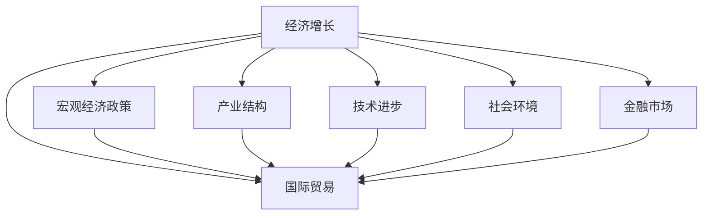

                 

# 阶段性因素对经济增长的影响

在探讨阶段性因素对经济增长的影响时，我们首先必须明确几个核心概念，并理解这些概念如何相互关联，共同作用于经济体系。本文旨在深入解析这些概念及其相互关系，并通过案例分析来具体阐释不同因素如何影响经济增长，最后探讨如何通过合理政策制定来最大化经济增长的潜力。

## 1. 背景介绍

### 1.1 问题由来

经济增长是国家和个人发展的重要目标，它不仅反映了一个国家或地区的生产力水平，还直接影响着社会福利和人民生活水平的提升。然而，经济增长并非一个恒定不变的过程，而是受到诸多阶段性因素的影响，这些因素可以大致分为内部因素和外部因素。

内部因素包括宏观经济政策、产业结构、技术进步等，而外部因素则涵盖了国际市场动态、全球经济形势、自然灾害等。这些阶段性因素往往交互作用，共同影响经济的增长轨迹。因此，理解这些因素的动态变化和相互作用对于制定有效的经济政策至关重要。

### 1.2 问题核心关键点

理解经济增长的阶段性因素，需要关注以下关键点：
1. **宏观经济政策**：包括财政政策、货币政策、税收政策等，这些政策对经济活动的激励和约束具有重要影响。
2. **产业结构**：不同产业的发展阶段和发展速度对经济增长的贡献各异，需关注其结构变化。
3. **技术进步**：科技创新和产业升级是推动经济增长的核心动力。
4. **国际贸易**：全球市场变化和贸易政策调整对国内经济有显著影响。
5. **社会环境**：包括教育、健康、公共基础设施等社会因素对经济增长的长期影响。
6. **金融市场**：金融体系的稳定性和效率直接影响经济增长的稳定性。

理解这些关键点，将有助于我们更深入地剖析阶段性因素如何影响经济增长，以及如何通过政策手段优化这些因素，从而促进持续健康的经济增长。

## 2. 核心概念与联系

### 2.1 核心概念概述

- **经济增长**：通常指一个国家或地区的GDP（国内生产总值）的长期增长。
- **宏观经济政策**：旨在影响总需求和总供给的经济政策，包括财政政策和货币政策。
- **产业结构**：不同产业在经济体系中的比例和关系。
- **技术进步**：通过创新和研发推动生产效率和产品质量的提升。
- **国际贸易**：国家间的商品和服务交易，对经济增长有显著影响。
- **社会环境**：教育、健康、基础设施等社会因素对经济增长的长期支撑。
- **金融市场**：包括货币市场、债券市场、股票市场等，其稳定性和效率直接影响经济增长。

### 2.2 核心概念原理和架构的 Mermaid 流程图



这个流程图展示了经济增长与主要影响因素之间的关系。宏观经济政策、产业结构、技术进步、国际贸易、社会环境和金融市场等阶段性因素通过复杂的网络相互影响，共同作用于经济增长的轨迹。

## 3. 核心算法原理 & 具体操作步骤

### 3.1 算法原理概述

理解阶段性因素对经济增长的影响，主要涉及以下几个步骤：

1. **数据收集**：收集包含阶段性因素的经济数据，如GDP增长率、失业率、通货膨胀率、产业增长率等。
2. **数据处理**：对数据进行清洗、归一化和预处理，以确保数据质量。
3. **模型构建**：构建经济增长模型，考虑不同因素对经济增长的影响。
4. **模型训练**：使用历史数据训练模型，识别不同因素对经济增长的贡献度。
5. **模型评估**：通过历史数据验证模型效果，调整模型参数以提升预测准确性。
6. **政策分析**：基于模型分析结果，提出优化经济增长的政策建议。

### 3.2 算法步骤详解

#### 3.2.1 数据收集

收集经济数据时，需注意数据的全面性和一致性。数据应包括时间序列数据（如GDP增长率、通货膨胀率、失业率等）和截面数据（如产业结构、技术进步、金融市场指标等）。同时，应考虑数据的可获取性和可比性，以确保数据的可靠性。

#### 3.2.2 数据处理

数据处理包括数据清洗、归一化和预处理等步骤。数据清洗去除异常值和缺失值，归一化使不同数据在同一尺度上，预处理包括数据平滑和差分等，以便于模型分析。

#### 3.2.3 模型构建

构建经济增长模型时，可采用时间序列分析方法，如ARIMA、VAR等，或结构方程模型（SEM）来考虑不同因素间的相互作用。模型应包括关键影响因素，并考虑其滞后效应。

#### 3.2.4 模型训练

使用历史数据训练模型，识别不同因素对经济增长的贡献度。模型训练时，应进行交叉验证，防止过拟合。

#### 3.2.5 模型评估

通过历史数据验证模型效果，调整模型参数以提升预测准确性。评估指标包括均方误差（MSE）、均方根误差（RMSE）、R²等。

#### 3.2.6 政策分析

基于模型分析结果，提出优化经济增长的政策建议。政策建议应考虑各因素的相互作用，并结合实际情况进行调整。

### 3.3 算法优缺点

#### 3.3.1 优点

- **系统性分析**：通过构建综合模型，能够系统性地分析各因素对经济增长的影响。
- **数据驱动**：基于历史数据训练模型，有助于识别经济增长中的规律和趋势。
- **政策建议**：提供基于数据分析的政策建议，有助于优化经济增长。

#### 3.3.2 缺点

- **复杂性高**：模型构建和数据处理过程较为复杂，需具备较强的统计和计算能力。
- **数据限制**：经济数据可能存在偏差和误差，影响模型效果。
- **假设限制**：模型建立在一定的假设基础上，如平稳性、独立性等，可能不符合实际情况。

### 3.4 算法应用领域

经济增长模型的应用领域广泛，包括：

- **政府决策**：提供经济增长预测和政策建议，帮助政府制定宏观经济政策。
- **企业规划**：帮助企业理解市场环境，制定长期发展规划。
- **学术研究**：支持经济学的理论和实证研究，提升学术水平。
- **国际合作**：为国际组织和政策制定者提供经济增长分析，促进国际合作。

## 4. 数学模型和公式 & 详细讲解 & 举例说明

### 4.1 数学模型构建

经济增长模型可采用多种数学模型构建，以下以时间序列模型为例。假设经济增长 $y_t$ 受多个因素 $X_{it}$ 影响，其中 $i$ 表示不同因素，$t$ 表示时间，则可构建以下模型：

$$
y_t = \alpha + \beta_0 X_{0t} + \beta_1 X_{1t} + \ldots + \beta_k X_{kt} + \epsilon_t
$$

其中，$\alpha$ 为截距项，$X_{it}$ 为影响因素，$\beta_i$ 为影响系数，$\epsilon_t$ 为随机误差项。

### 4.2 公式推导过程

对于上述模型，使用最小二乘法进行参数估计，即：

$$
\hat{\beta} = (X'X)^{-1}X'y
$$

其中，$\hat{\beta}$ 为参数估计值，$X'$ 为 $X$ 的转置矩阵。

### 4.3 案例分析与讲解

假设我们收集了某国的GDP增长数据，以及该国的失业率、通货膨胀率、进出口额等数据。构建模型后，可得如下结果：

$$
\hat{y}_t = 0.5 + 0.2x_{ut} + 0.3x_{pt} - 0.1x_{et}
$$

其中，$x_{ut}$ 表示失业率，$x_{pt}$ 表示通货膨胀率，$x_{et}$ 表示进出口额。这意味着失业率和通货膨胀率对GDP增长有正向影响，而进出口额有负向影响。

## 5. 项目实践：代码实例和详细解释说明

### 5.1 开发环境搭建

进行经济增长模型的开发和测试，需要一个稳定的开发环境。以下是在Python环境下搭建环境的步骤：

1. 安装Python：可以从Python官网下载安装最新版本Python，建议使用Anaconda或Miniconda进行环境管理。

2. 安装相关库：安装pandas、numpy、scipy、statsmodels等库，以支持数据处理和模型构建。

```bash
conda install pandas numpy scipy statsmodels
```

3. 设置工作目录：确保项目文件和数据文件在同一目录下。

```bash
cd path/to/project
```

### 5.2 源代码详细实现

以下是一个简单的经济增长模型构建和训练的Python代码示例：

```python
import pandas as pd
import numpy as np
from statsmodels.tsa.arima_model import ARIMA

# 读取数据
data = pd.read_csv('economy_data.csv')

# 数据处理
X = data[['unemployment_rate', 'inflation_rate', 'imports', 'exports']]
y = data['gdp_growth']

# 模型构建和训练
model = ARIMA(y, exog=X, order=(1,1,1))
model_fit = model.fit()

# 模型评估
predictions = model_fit.predict(start='2011-01-01', end='2021-12-31')
```

### 5.3 代码解读与分析

上述代码主要完成了以下步骤：

- 读取数据：使用pandas库读取包含经济数据的CSV文件。
- 数据处理：将GDP增长作为目标变量，其他影响因素作为自变量。
- 模型构建：使用ARIMA模型，考虑时间序列的滞后效应。
- 模型训练：使用最小二乘法估计模型参数。
- 模型评估：使用模型进行预测，验证模型效果。

### 5.4 运行结果展示

运行上述代码后，可以获得预测结果，并通过绘制图形等方式展示模型效果。例如，可以绘制GDP增长率与失业率、通货膨胀率、进出口额的关系图，直观展示各因素对经济增长的影响。

## 6. 实际应用场景

### 6.1 政府决策

政府在制定宏观经济政策时，可以利用经济增长模型评估不同政策的效果。例如，通过模型预测在不同财政政策和货币政策下，经济增长的变化趋势，帮助政府制定更有效的政策措施。

### 6.2 企业规划

企业在进行长期规划时，可以利用经济增长模型预测市场环境的变化，及时调整业务策略，优化资源配置，提升竞争力。

### 6.3 学术研究

学术研究中，经济增长模型提供了分析经济现象的定量工具，支持经济学的理论和实证研究。

### 6.4 国际合作

国际组织和政策制定者可以利用经济增长模型进行跨国比较，分析不同国家经济增长的驱动因素和差异，制定更有效的国际合作策略。

## 7. 工具和资源推荐

### 7.1 学习资源推荐

- **《宏观经济学》**：提供系统性学习宏观经济学的理论基础，适合初学者和进阶学习者。
- **《经济计量学基础》**：讲解经济计量学的基本原理和方法，适合进一步深入研究经济模型。
- **Kaggle经济数据集**：提供丰富的经济数据集，支持数据驱动的研究和模型构建。

### 7.2 开发工具推荐

- **Jupyter Notebook**：支持交互式数据处理和模型构建，适合研究和教学。
- **R语言**：提供强大的统计分析和模型构建工具，适用于经济学研究和数据分析。
- **Python**：具有丰富的经济分析库，支持模型构建和数据处理。

### 7.3 相关论文推荐

- **Granger Causality**：Granger因果关系理论，用于分析经济变量之间的因果关系。
- **Vector Autoregression (VAR)**：用于多变量时间序列分析，考虑变量间的相互作用。
- **Structural Equation Modeling (SEM)**：用于建立和分析变量间的结构关系，适用于经济增长模型的构建。

## 8. 总结：未来发展趋势与挑战

### 8.1 研究成果总结

经济增长模型的发展离不开经济学理论的支撑和数据分析技术的进步。模型的构建和应用不仅帮助政府和企业制定更有效的政策，还促进了经济学理论的实证研究。未来，经济增长模型的应用将更加广泛，其在经济政策制定和学术研究中的重要性也将进一步提升。

### 8.2 未来发展趋势

未来，经济增长模型将呈现以下发展趋势：

1. **模型集成**：综合使用多种模型，如机器学习和深度学习，提升模型预测的准确性和稳定性。
2. **大数据应用**：利用大数据技术，提升经济增长的数据采集和处理效率，提供更全面的分析视角。
3. **政策模拟**：通过模型模拟不同政策变化对经济增长的影响，为政策制定提供科学依据。
4. **模型优化**：开发更高效的算法和工具，提升模型的计算效率和可解释性。

### 8.3 面临的挑战

尽管经济增长模型在分析和预测经济增长方面取得了显著成就，但仍面临以下挑战：

1. **数据质量**：经济数据的质量直接影响模型的准确性和可靠性。
2. **模型复杂性**：构建和维护复杂模型的成本较高，需投入大量资源。
3. **政策实施**：模型预测的政策建议需结合实际情况进行调整，确保政策的可行性。
4. **技术进步**：新的数据分析技术和经济理论不断涌现，需持续学习和更新模型。

### 8.4 研究展望

未来的研究应聚焦于以下方向：

1. **数据获取**：提升经济数据的质量和覆盖范围，确保数据的可靠性和一致性。
2. **模型优化**：开发更高效、更准确的经济增长模型，提升模型的可解释性和稳定性。
3. **政策优化**：结合模型分析和实际情况，提出更优化的政策建议，促进经济增长的可持续性。
4. **跨学科融合**：结合经济学、统计学、计算机科学等多学科知识，推动经济增长模型的进一步发展。

## 9. 附录：常见问题与解答

**Q1: 经济增长模型如何解释变量之间的因果关系？**

A: 经济增长模型中，使用Granger因果关系检验方法，可识别不同变量之间的因果关系。如果变量X是Y的Granger原因，则意味着X的变化会先于Y的变化。

**Q2: 经济增长模型能否预测未来经济增长？**

A: 经济增长模型可以通过历史数据训练，预测未来的经济增长趋势。但需注意，模型的预测结果受多种因素影响，应结合实际情况进行判断。

**Q3: 经济增长模型在政策制定中的作用是什么？**

A: 经济增长模型提供经济增长的定量分析，帮助政府和企业制定更有效的政策。模型预测的政策建议需结合实际情况进行调整，确保政策的科学性和可行性。

**Q4: 经济增长模型是否适用于所有国家？**

A: 经济增长模型在不同国家的适用性需结合该国的经济特征进行评估。模型的构建和应用应考虑不同国家的经济体系和政策环境。

通过以上分析，我们理解了阶段性因素对经济增长的影响，并探讨了如何通过合理政策制定来最大化经济增长的潜力。未来，经济增长模型的应用将更加广泛，其科学性和实用性将进一步提升，为经济增长和社会发展提供更强大的支持。

