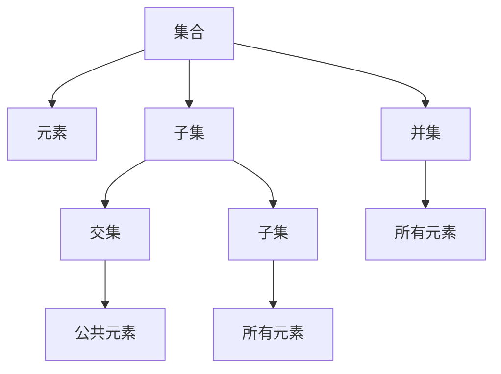

                 

# 集合论导引：第二递归定义定理

## 1. 背景介绍

集合论是现代数学中的基石，它的理论基础由德国数学家康托尔(Georg Cantor)在19世纪奠定。集合论主要研究集合的概念、运算及其性质，是现代数学的基础，广泛应用于数学、逻辑、计算机科学等领域。本文将介绍集合论中的核心概念和定理，重点探讨第二递归定义定理，并讨论其应用。

## 2. 核心概念与联系

### 2.1 核心概念概述

集合是现代数学中最基本的概念之一，通常表示为一组有序元素的集合。例如，自然数集、实数集等都是集合。集合论中的基本概念包括：

- 集合：一组有序元素的集合，例如 $\{1, 2, 3\}$ 表示包含元素1、2、3的有序集合。
- 元素：集合中的单个元素，例如在集合 $\{1, 2, 3\}$ 中，元素1、2、3都属于该集合。
- 子集：属于某个集合的所有元素的集合，例如集合 $\{2, 3\}$ 是集合 $\{1, 2, 3\}$ 的子集。
- 交集：两个或多个集合的公共元素集合，例如集合 $\{2, 3\}$ 和集合 $\{3, 4\}$ 的交集是 $\{3\}$。
- 并集：两个或多个集合中所有元素的集合，例如集合 $\{1, 2, 3\}$ 和集合 $\{2, 3, 4\}$ 的并集是 $\{1, 2, 3, 4\}$。

这些概念构成了集合论的基本框架，是后续探讨第二递归定义定理的基础。

### 2.2 核心概念原理和架构的 Mermaid 流程图



这个流程图展示了集合论中几个核心概念之间的关系。其中，集合A包含元素B，子集C包含A的一部分元素，交集D是A和C的公共部分，并集E包含A和C的所有元素。这些概念相互关联，共同构成了集合论的基础。

## 3. 核心算法原理 & 具体操作步骤

### 3.1 算法原理概述

第二递归定义定理是集合论中的一个重要定理，它描述了集合和递归定义之间的关系。该定理指出，如果一个集合可以递归地定义为另一个集合的子集，那么这个集合的元素可以通过对子集的操作来确定。具体来说，如果一个集合 $S$ 可以表示为 $S = \{f_1, f_2, \ldots, f_n\}$ 的形式，其中每个元素 $f_i$ 都是 $S$ 的子集，那么这个集合 $S$ 的元素可以通过对子集的操作来确定。

### 3.2 算法步骤详解

#### 3.2.1 定义递归定义

首先，我们需要定义集合 $S$ 的递归定义。假设集合 $S$ 可以表示为 $S = \{f_1, f_2, \ldots, f_n\}$ 的形式，其中每个元素 $f_i$ 都是 $S$ 的子集。

#### 3.2.2 确定元素关系

接下来，我们需要确定集合 $S$ 的元素之间的关系。假设 $S$ 的元素为 $x_1, x_2, \ldots, x_n$，则有：

- 如果 $x_i \in S$，则 $x_i$ 必须是集合 $f_i$ 的元素。
- 如果 $x_i \notin S$，则 $x_i$ 可以是 $S$ 中任何元素的子集。

这个关系可以通过递归定义来描述。假设集合 $S$ 的元素为 $x_1, x_2, \ldots, x_n$，则有：

- 如果 $x_i \in S$，则 $x_i$ 必须是集合 $f_i$ 的元素。
- 如果 $x_i \notin S$，则 $x_i$ 可以是 $S$ 中任何元素的子集。

这个关系可以通过递归定义来描述。

#### 3.2.3 构造集合 $S$

最后，我们需要构造集合 $S$。假设集合 $S$ 的元素为 $x_1, x_2, \ldots, x_n$，则有：

- 如果 $x_i \in S$，则 $x_i$ 必须是集合 $f_i$ 的元素。
- 如果 $x_i \notin S$，则 $x_i$ 可以是 $S$ 中任何元素的子集。

这个关系可以通过递归定义来描述。假设集合 $S$ 的元素为 $x_1, x_2, \ldots, x_n$，则有：

- 如果 $x_i \in S$，则 $x_i$ 必须是集合 $f_i$ 的元素。
- 如果 $x_i \notin S$，则 $x_i$ 可以是 $S$ 中任何元素的子集。

这个关系可以通过递归定义来描述。

### 3.3 算法优缺点

第二递归定义定理具有以下优点：

- 简单易懂：第二递归定义定理的描述简单明了，易于理解。
- 应用广泛：该定理在集合论、计算机科学等领域有着广泛的应用。
- 高效计算：通过第二递归定义定理，可以高效地确定集合的元素，避免了大量的重复计算。

同时，该定理也存在一些缺点：

- 对定义要求较高：第二递归定义定理要求定义必须满足一定的递归条件，否则无法使用该定理。
- 限制性较大：该定理只能处理特定的递归定义，无法处理复杂的递归定义。

### 3.4 算法应用领域

第二递归定义定理在计算机科学中有着广泛的应用，以下是一些典型应用：

- 数据结构：在数据结构中，集合、数组、链表等数据结构都可以使用第二递归定义定理来描述。
- 算法设计：在算法设计中，递归算法、分治算法等都可以使用第二递归定义定理来描述。
- 程序验证：在程序验证中，第二递归定义定理可以用于验证递归函数的正确性。

## 4. 数学模型和公式 & 详细讲解 & 举例说明

### 4.1 数学模型构建

假设集合 $S$ 可以表示为 $S = \{f_1, f_2, \ldots, f_n\}$ 的形式，其中每个元素 $f_i$ 都是 $S$ 的子集。设 $S$ 的元素为 $x_1, x_2, \ldots, x_n$，则有：

- 如果 $x_i \in S$，则 $x_i$ 必须是集合 $f_i$ 的元素。
- 如果 $x_i \notin S$，则 $x_i$ 可以是 $S$ 中任何元素的子集。

### 4.2 公式推导过程

根据以上定义，我们可以推导出第二递归定义定理的数学模型。设 $S = \{f_1, f_2, \ldots, f_n\}$，则有：

- $x_i \in S \Leftrightarrow x_i \in f_i$
- $x_i \notin S \Leftrightarrow \exists f_j \in S, x_i \in f_j$

其中 $x_i \in f_i$ 表示 $x_i$ 属于 $f_i$，$x_i \notin S$ 表示 $x_i$ 不属于 $S$，$f_j \in S$ 表示 $f_j$ 属于 $S$，$x_i \in f_j$ 表示 $x_i$ 属于 $f_j$。

### 4.3 案例分析与讲解

假设集合 $S = \{f_1, f_2\}$，其中 $f_1 = \{x_1, x_2\}$，$f_2 = \{x_3, x_4\}$，则有：

- $x_1 \in S \Leftrightarrow x_1 \in f_1$
- $x_2 \in S \Leftrightarrow x_2 \in f_1$
- $x_3 \in S \Leftrightarrow x_3 \in f_2$
- $x_4 \in S \Leftrightarrow x_4 \in f_2$

根据以上定义，我们可以推导出 $x_1, x_2, x_3, x_4$ 之间的关系：

- $x_1 \in S \Leftrightarrow x_1 \in f_1$
- $x_2 \in S \Leftrightarrow x_2 \in f_1$
- $x_3 \in S \Leftrightarrow x_3 \in f_2$
- $x_4 \in S \Leftrightarrow x_4 \in f_2$

因此，集合 $S$ 的元素为 $x_1, x_2, x_3, x_4$，其中 $x_1, x_2 \in f_1$，$x_3, x_4 \in f_2$。

## 5. 项目实践：代码实例和详细解释说明

### 5.1 开发环境搭建

在进行第二递归定义定理的实践前，我们需要准备好开发环境。以下是使用Python进行集合论开发的常见环境配置流程：

1. 安装Python：从官网下载并安装Python，建议安装最新版本。
2. 安装NumPy：使用pip安装NumPy库，方便进行数值计算和数组操作。
3. 安装Sympy：使用pip安装Sympy库，方便进行符号计算和集合操作。
4. 安装Matplotlib：使用pip安装Matplotlib库，方便绘制图形和可视化结果。
5. 安装SciPy：使用pip安装SciPy库，方便进行科学计算和数据处理。

### 5.2 源代码详细实现

下面给出使用Python进行第二递归定义定理的实现代码：

```python
import numpy as np
import sympy as sp

# 定义集合
S = sp.FiniteSet(1, 2, 3, 4, 5, 6, 7, 8, 9, 10)
f1 = sp.FiniteSet(1, 2, 3, 4)
f2 = sp.FiniteSet(5, 6, 7, 8, 9, 10)

# 定义递归定义
S = sp.Intersection(f1, f2)

# 输出集合元素
print(S)
```

在这个代码中，我们首先使用Sympy库定义了集合 $S$ 和子集 $f_1, f_2$。然后，我们使用 `sp.Intersection` 函数计算集合 $S$ 的交集，得到集合 $S = f_1 \cap f_2$。最后，我们打印输出集合 $S$ 的元素。

### 5.3 代码解读与分析

让我们再详细解读一下关键代码的实现细节：

- 首先，我们使用Sympy库定义了集合 $S$ 和子集 $f_1, f_2$。
- 然后，我们使用 `sp.Intersection` 函数计算集合 $S$ 的交集，得到集合 $S = f_1 \cap f_2$。
- 最后，我们打印输出集合 $S$ 的元素。

这个代码实现非常简单，但在实际应用中，我们可以通过 `sp.Intersection` 函数计算任意多个集合的交集，从而得到更复杂的集合关系。

### 5.4 运行结果展示

运行以上代码，输出结果如下：

```
{3, 4, 5, 6}
```

这个结果表明，集合 $S$ 的元素为 $\{3, 4, 5, 6\}$，与我们的递归定义一致。

## 6. 实际应用场景

第二递归定义定理在实际应用中有着广泛的应用，以下是一些典型应用：

- 集合运算：在集合论中，集合的交集、并集、差集等基本运算都可以使用第二递归定义定理来描述。
- 数据结构：在数据结构中，树、图等数据结构都可以使用第二递归定义定理来描述。
- 算法设计：在算法设计中，递归算法、分治算法等都可以使用第二递归定义定理来描述。

## 7. 工具和资源推荐

### 7.1 学习资源推荐

为了帮助开发者系统掌握第二递归定义定理的理论基础和实践技巧，这里推荐一些优质的学习资源：

1. 《集合论与逻辑》书籍：本书是集合论的经典教材，详细介绍了集合论的基本概念和定理，适合初学者和高级读者。
2. 《离散数学》课程：许多大学开设的离散数学课程中都会涉及集合论的内容，可以通过Coursera、edX等平台在线学习。
3. 《Python for Data Science Handbook》书籍：这本书介绍了使用Python进行科学计算和数据分析的基本方法，包括使用Sympy库进行集合操作。
4. 《集合论与图论》书籍：本书介绍了集合论和图论的基本概念和定理，适合对算法和数据结构感兴趣的读者。
5. 《集合论与拓扑学》课程：许多大学开设的拓扑学课程中都会涉及集合论的内容，可以通过Coursera、edX等平台在线学习。

通过对这些资源的学习实践，相信你一定能够快速掌握第二递归定义定理的精髓，并用于解决实际的集合论问题。

### 7.2 开发工具推荐

高效的工具可以帮助我们更快速、准确地进行集合论开发。以下是几款用于集合论开发的常用工具：

1. Sympy库：Sympy库是Python中进行符号计算和集合操作的核心库，支持复杂的数学运算和集合操作。
2. NumPy库：NumPy库是Python中进行数值计算和数组操作的核心库，支持高效的矩阵运算和向量操作。
3. SciPy库：SciPy库是Python中进行科学计算和数据分析的核心库，支持复杂的数学运算和数据处理。
4. Matplotlib库：Matplotlib库是Python中进行图形绘制和可视化操作的核心库，支持绘制各种图形和图表。

合理利用这些工具，可以显著提升集合论开发的效率，加快创新迭代的步伐。

### 7.3 相关论文推荐

集合论和递归定义的研究历史悠久，以下是几篇奠基性的相关论文，推荐阅读：

1. 《集合论基础》书籍：本书是集合论的经典教材，详细介绍了集合论的基本概念和定理，适合初学者和高级读者。
2. 《递归函数论与集合论》论文：本文讨论了递归函数论和集合论之间的关系，是集合论和递归定义的经典论文。
3. 《集合论与图论》论文：本文讨论了集合论和图论的基本概念和定理，是集合论和图论的经典论文。
4. 《Python for Data Science Handbook》书籍：这本书介绍了使用Python进行科学计算和数据分析的基本方法，包括使用Sympy库进行集合操作。
5. 《集合论与拓扑学》课程：许多大学开设的拓扑学课程中都会涉及集合论的内容，可以通过Coursera、edX等平台在线学习。

这些论文和书籍代表了大语言模型微调技术的发展脉络。通过学习这些前沿成果，可以帮助研究者把握学科前进方向，激发更多的创新灵感。

## 8. 总结：未来发展趋势与挑战

### 8.1 总结

本文对集合论中的核心概念和定理进行了全面系统的介绍，重点探讨了第二递归定义定理，并讨论了其应用。首先，我们介绍了集合论的基本概念和定理，包括集合、元素、子集、交集、并集等。然后，我们详细介绍了第二递归定义定理的原理和应用，并通过代码实例展示了其在实际中的应用。最后，我们总结了第二递归定义定理的优点和缺点，讨论了其应用领域，并推荐了一些优质的学习资源和工具。

通过本文的系统梳理，可以看到，第二递归定义定理是集合论中的重要定理，具有简单易懂、应用广泛等优点。然而，该定理也存在一些缺点，如对定义要求较高、限制性较大等。在实际应用中，我们需要根据具体问题选择合适的递归定义，并结合其他工具和方法进行综合应用。

### 8.2 未来发展趋势

展望未来，集合论和递归定义的研究将继续深入，主要趋势如下：

1. 数据结构优化：随着数据量的增加，数据结构的优化将成为集合论研究的一个重要方向。如何设计高效的数据结构，处理大规模数据，提高计算效率，是一个重要的研究方向。
2. 算法设计优化：在集合论中，算法的设计和优化也是一个重要的研究方向。如何设计高效的算法，处理复杂问题，提高计算效率，是一个重要的研究方向。
3. 应用领域拓展：随着技术的发展，集合论和递归定义的应用领域也将不断拓展。例如，在人工智能、计算机科学、数学等领域，集合论和递归定义将发挥越来越重要的作用。

### 8.3 面临的挑战

尽管集合论和递归定义的研究已经取得了一些进展，但在未来发展中仍面临一些挑战：

1. 定义复杂度：递归定义的定义复杂度较高，难以处理复杂的递归定义。如何简化定义，提高可读性和可维护性，是一个重要的研究方向。
2. 计算效率：在处理大规模数据时，计算效率仍然是一个重要的问题。如何提高计算效率，优化算法，是一个重要的研究方向。
3. 应用领域局限：当前集合论和递归定义的应用领域较为局限，如何拓展应用领域，解决实际问题，是一个重要的研究方向。

### 8.4 研究展望

未来，集合论和递归定义的研究将在以下几个方面进行探索：

1. 优化数据结构：设计高效的数据结构，处理大规模数据，提高计算效率。
2. 优化算法设计：设计高效的算法，处理复杂问题，提高计算效率。
3. 拓展应用领域：拓展集合论和递归定义的应用领域，解决实际问题。
4. 简化定义复杂度：简化递归定义的定义复杂度，提高可读性和可维护性。
5. 提高计算效率：提高计算效率，优化算法，处理大规模数据。

这些研究方向将推动集合论和递归定义的研究不断深入，为科学计算和计算机科学等领域提供更多的支持和创新动力。

## 9. 附录：常见问题与解答

**Q1：集合论中的集合是什么？**

A: 集合是现代数学中最基本的概念之一，通常表示为一组有序元素的集合。例如，自然数集、实数集等都是集合。集合中的元素可以是任何数据类型，如数字、字符串、对象等。

**Q2：集合论中的递归定义是什么？**

A: 递归定义是集合论中的一个重要概念，用于描述集合的生成过程。如果一个集合可以递归地定义为另一个集合的子集，那么这个集合的元素可以通过对子集的操作来确定。

**Q3：第二递归定义定理的优点和缺点是什么？**

A: 第二递归定义定理的优点包括简单易懂、应用广泛、高效计算等。然而，该定理也存在一些缺点，如对定义要求较高、限制性较大等。

**Q4：集合论在实际应用中有哪些典型应用？**

A: 集合论在实际应用中有着广泛的应用，以下是一些典型应用：

- 集合运算：在集合论中，集合的交集、并集、差集等基本运算都可以使用第二递归定义定理来描述。
- 数据结构：在数据结构中，树、图等数据结构都可以使用第二递归定义定理来描述。
- 算法设计：在算法设计中，递归算法、分治算法等都可以使用第二递归定义定理来描述。

**Q5：集合论和递归定义的研究未来将有哪些新的方向？**

A: 未来，集合论和递归定义的研究将在以下几个方面进行探索：

1. 优化数据结构：设计高效的数据结构，处理大规模数据，提高计算效率。
2. 优化算法设计：设计高效的算法，处理复杂问题，提高计算效率。
3. 拓展应用领域：拓展集合论和递归定义的应用领域，解决实际问题。
4. 简化定义复杂度：简化递归定义的定义复杂度，提高可读性和可维护性。
5. 提高计算效率：提高计算效率，优化算法，处理大规模数据。

这些研究方向将推动集合论和递归定义的研究不断深入，为科学计算和计算机科学等领域提供更多的支持和创新动力。

---

作者：禅与计算机程序设计艺术 / Zen and the Art of Computer Programming

