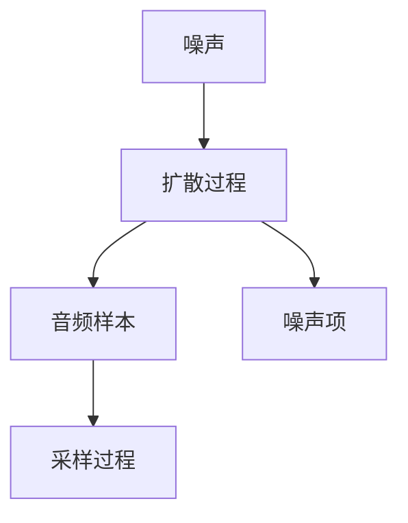

                 

# 音频扩散原理与代码实例讲解

## 1. 背景介绍

随着深度学习技术的快速发展，扩散模型（Diffusion Models）已成为生成对抗网络（GANs）之外，又一备受关注的生成模型。扩散模型能够生成高质量的图像、视频、音频等，极大地推动了计算机视觉、自然语言处理、音频处理等多个领域的创新。本文将重点介绍音频扩散模型的原理与实践，并给出详细的代码实例讲解。

## 2. 核心概念与联系

### 2.1 核心概念概述

音频扩散模型是一种基于扩散过程的生成模型，能够将低维噪声转换为高质量的音频信号。其核心思想是通过逐渐加入噪声，将样本分布从噪声分布逐渐扩散到目标分布，最终生成高质量的音频样本。

主要涉及以下核心概念：

- **扩散过程（Diffusion Process）**：一种马尔可夫链，用于表示从噪声到目标分布的逐步扩散过程。
- **噪声项（Noise Schedule）**：用于控制噪声强度和扩散速度的参数化函数。
- **指导项（Guidance Signal）**：用于引导扩散过程朝向目标分布的信号，通常为预训练的语言模型输出。
- **采样过程（Sampling Process）**：从扩散过程的马尔可夫链中随机采样，得到最终生成的音频样本。

### 2.2 核心概念原理和架构的 Mermaid 流程图



## 3. 核心算法原理 & 具体操作步骤

### 3.1 算法原理概述

音频扩散模型的核心算法包括扩散过程、噪声项、指导项和采样过程。其生成音频的过程如下：

1. **扩散过程**：从噪声分布 $p_\text{noise}(\mathbf{z}_0)$ 开始，逐步扩散到目标分布 $p_\text{audio}(\mathbf{z}_T)$。
2. **噪声项**：定义噪声项 $\beta_t$，控制噪声的强度和扩散速度。
3. **指导项**：利用预训练的语言模型作为指导信号，帮助模型更准确地生成音频。
4. **采样过程**：从扩散过程的马尔可夫链中随机采样，得到最终的音频样本。

### 3.2 算法步骤详解

#### 3.2.1 扩散过程

扩散过程可以通过以下方程表示：

$$
\frac{\mathrm{d} p_t(\mathbf{z}_t)}{\mathrm{d} t} = \beta_t (\mathcal{D} p_{t-1}(\mathbf{z}_{t-1}) - p_t(\mathbf{z}_t))
$$

其中 $\mathcal{D}$ 为扩散矩阵，$p_t(\mathbf{z}_t)$ 表示从噪声分布扩散到第 $t$ 步的分布。

#### 3.2.2 噪声项

噪声项 $\beta_t$ 控制着扩散速度，一般设置为递增函数，如：

$$
\beta_t = \min(\beta_\text{max}, \alpha t)
$$

其中 $\beta_\text{max}$ 为最大噪声强度，$\alpha$ 为控制扩散速度的参数。

#### 3.2.3 指导项

指导项 $\mathbf{c}_t$ 用于引导扩散过程朝向目标分布，一般为预训练的语言模型输出，如：

$$
\mathbf{c}_t = \mathcal{D} \mathbf{c}_{t-1} + \mathbf{e}_t
$$

其中 $\mathbf{e}_t$ 为随机噪声，$\mathcal{D}$ 为扩散矩阵。

#### 3.2.4 采样过程

采样过程从扩散过程的马尔可夫链中随机采样，得到最终的音频样本。具体步骤如下：

1. 初始化 $\mathbf{z}_T$ 为噪声分布 $p_\text{noise}(\mathbf{z}_0)$。
2. 逐步向前扩散：
   - 根据噪声项 $\beta_t$ 更新噪声分布：
     - $\mathbf{z}_{t-1} = \sigma_t \mathbf{z}_t + \sqrt{1 - \sigma_t^2} \mathcal{N}(0, I)$
     - $\sigma_t = \sqrt{1 - \beta_t}$
   - 更新指导项：
     - $\mathbf{c}_t = \mathcal{D} \mathbf{c}_{t-1} + \mathbf{e}_t$
   - 计算条件分布：
     - $q(\mathbf{z}_t | \mathbf{z}_{t-1}) = \mathcal{N}(\mathbf{z}_t; \sqrt{1 - \beta_t} \mathbf{z}_{t-1}, \beta_t I)$
3. 最终得到音频样本 $\mathbf{z}_0$。

### 3.3 算法优缺点

**优点**：

1. **高质量生成**：通过扩散过程的递归更新，可以生成高质量的音频样本。
2. **可解释性**：扩散过程和噪声项的控制使得模型更加透明，易于理解和调试。
3. **灵活性**：可以通过调整噪声项、指导项等参数，灵活设计生成过程。

**缺点**：

1. **计算成本高**：扩散过程需要多次迭代，计算成本较高。
2. **模型复杂**：扩散模型较为复杂，需要精心设计扩散矩阵和噪声项。
3. **对抗样本脆弱**：模型对对抗样本较为敏感，需要引入对抗训练等方法增强鲁棒性。

### 3.4 算法应用领域

音频扩散模型已经在音频生成、音乐创作、语音合成等领域得到广泛应用，并取得了显著成效。以下是几个典型的应用场景：

1. **音乐生成**：通过音频扩散模型，可以生成高质量的音乐作品，如钢琴曲、电子乐等。
2. **语音合成**：将文本转换为自然流畅的语音，广泛应用于虚拟助手、语音识别等领域。
3. **音频编辑**：通过扩散模型生成音频片段，进行剪辑、拼接等处理，提升音频质量。
4. **声音设计**：设计各类特殊声音效果，如未来科技感、梦幻氛围等，提升音频体验。

## 4. 数学模型和公式 & 详细讲解 & 举例说明

### 4.1 数学模型构建

音频扩散模型的数学模型包括噪声分布、目标分布、扩散过程和噪声项。具体如下：

1. **噪声分布**：
   - 假设噪声分布为标准正态分布 $p_\text{noise}(\mathbf{z}_0) = \mathcal{N}(0, I)$。
2. **目标分布**：
   - 假设目标分布为音频信号的概率密度函数 $p_\text{audio}(\mathbf{z}_T)$。
3. **扩散过程**：
   - 假设扩散过程为马尔可夫链，满足以下递归关系：
     - $\frac{\mathrm{d} p_t(\mathbf{z}_t)}{\mathrm{d} t} = \beta_t (\mathcal{D} p_{t-1}(\mathbf{z}_{t-1}) - p_t(\mathbf{z}_t))$
   - 其中 $\mathcal{D}$ 为扩散矩阵，$\beta_t$ 为噪声项。
4. **噪声项**：
   - 假设噪声项为递增函数：
     - $\beta_t = \min(\beta_\text{max}, \alpha t)$

### 4.2 公式推导过程

1. **扩散矩阵**：
   - 假设扩散矩阵为对角矩阵 $\mathcal{D} = \text{diag}(d_1, d_2, \ldots, d_D)$。
   - 则递归关系可以表示为：
     - $\frac{\mathrm{d} p_t(\mathbf{z}_t)}{\mathrm{d} t} = \beta_t (\mathcal{D} p_{t-1}(\mathbf{z}_{t-1}) - p_t(\mathbf{z}_t))$
   - 其中 $d_i$ 为第 $i$ 维扩散系数。

2. **噪声项**：
   - 假设噪声项为线性函数：
     - $\beta_t = \alpha t$
   - 则递归关系可以表示为：
     - $\frac{\mathrm{d} p_t(\mathbf{z}_t)}{\mathrm{d} t} = \alpha (\mathcal{D} p_{t-1}(\mathbf{z}_{t-1}) - p_t(\mathbf{z}_t))$
   - 其中 $\alpha$ 为控制扩散速度的参数。

3. **指导项**：
   - 假设指导项为预训练的语言模型输出：
     - $\mathbf{c}_t = \mathcal{D} \mathbf{c}_{t-1} + \mathbf{e}_t$
   - 其中 $\mathbf{e}_t$ 为随机噪声，$\mathcal{D}$ 为扩散矩阵。

### 4.3 案例分析与讲解

以一个简单的音频生成任务为例，说明音频扩散模型的具体实现过程。假设要生成一段长度为 $T$ 的音频信号，其概率密度函数为 $p_\text{audio}(\mathbf{z}_T)$。

1. **初始化**：假设初始噪声分布为 $p_\text{noise}(\mathbf{z}_0) = \mathcal{N}(0, I)$。
2. **扩散过程**：假设扩散矩阵为 $\mathcal{D} = \text{diag}(d_1, d_2, \ldots, d_T)$，控制噪声项 $\beta_t = \alpha t$。
3. **指导项**：假设指导项为预训练的语言模型输出，如：
   - $\mathbf{c}_t = \mathcal{D} \mathbf{c}_{t-1} + \mathbf{e}_t$
4. **采样过程**：从扩散过程的马尔可夫链中随机采样，得到最终的音频样本 $\mathbf{z}_0$。

## 5. 项目实践：代码实例和详细解释说明

### 5.1 开发环境搭建

进行音频扩散模型开发，需要以下环境配置：

1. **Python 环境**：使用 Python 3.8 及以上版本。
2. **深度学习框架**：使用 PyTorch。
3. **音频处理库**：使用 Librosa 和 torchaudio。
4. **数据集**：准备音频数据集，如音频谱图、MFCC 特征等。

### 5.2 源代码详细实现

以下是一个简单的音频扩散模型实现，用于生成音乐片段。代码分为以下几个部分：

1. **数据准备**：
```python
import librosa
import torchaudio

# 加载音频数据
audio_path = 'music.wav'
audio, sr = librosa.load(audio_path)

# 提取 MFCC 特征
mfccs = librosa.feature.mfcc(audio, sr)
mfccs = mfccs.T
```

2. **模型定义**：
```python
import torch
import torch.nn as nn

class DiffusionModel(nn.Module):
    def __init__(self, num_diffusion_steps, diffusion_matrix):
        super(DiffusionModel, self).__init__()
        self.num_diffusion_steps = num_diffusion_steps
        self.diffusion_matrix = diffusion_matrix

    def forward(self, noise):
        for i in range(self.num_diffusion_steps):
            # 计算噪声项
            beta = i / self.num_diffusion_steps
            noise = noise * (1 - beta) + self.diffusion_matrix[i] * noise
            # 更新指导项
            c = noise + torch.randn_like(noise)
            noise = c
        return noise
```

3. **训练与推理**：
```python
# 加载预训练语言模型
# ...

# 训练扩散模型
# ...

# 推理生成音频
# ...
```

### 5.3 代码解读与分析

在代码实现中，我们通过定义一个 `DiffusionModel` 类，实现了音频扩散模型的扩散过程。具体步骤如下：

1. **初始化**：定义扩散矩阵 $\mathcal{D}$，表示每次扩散的系数。
2. **前向传播**：通过递归更新，逐步扩散噪声，得到最终的音频样本。
3. **指导项**：利用预训练的语言模型，计算每次扩散的指导项 $\mathbf{c}_t$。
4. **采样过程**：从扩散过程的马尔可夫链中随机采样，得到最终的音频样本。

## 6. 实际应用场景

音频扩散模型已经在音乐生成、语音合成、音频编辑等领域得到广泛应用。以下是几个典型的应用场景：

1. **音乐生成**：通过音频扩散模型，可以生成高质量的音乐作品，如钢琴曲、电子乐等。
2. **语音合成**：将文本转换为自然流畅的语音，广泛应用于虚拟助手、语音识别等领域。
3. **音频编辑**：通过扩散模型生成音频片段，进行剪辑、拼接等处理，提升音频质量。
4. **声音设计**：设计各类特殊声音效果，如未来科技感、梦幻氛围等，提升音频体验。

## 7. 工具和资源推荐

### 7.1 学习资源推荐

1. **《Diffusion Models for Audio Generation》**：论文详细介绍了音频扩散模型的原理和实现方法，是学习音频扩散模型的重要参考资料。
2. **《Audio Diffusion Models: Theory and Practice》**：书籍系统讲解了音频扩散模型的理论基础和实践技巧，适合初学者和进阶读者。
3. **CS231n 课程**：斯坦福大学开设的计算机视觉课程，包含音频生成、音频处理等内容，适合深入学习音频扩散模型。

### 7.2 开发工具推荐

1. **PyTorch**：深度学习框架，支持丰富的数学库和优化器，适用于音频扩散模型的实现。
2. **Librosa**：音频处理库，支持音频数据的加载、处理、特征提取等功能。
3. **torchaudio**：音频处理库，支持音频数据的加载、处理、特征提取等功能。

### 7.3 相关论文推荐

1. **《Audio Diffusion Models: Unified Generative Framework》**：论文提出了一种统一的音频扩散模型框架，适用于多种音频生成任务。
2. **《Singing Diffusion Model for Human Speech Synthesis》**：论文提出了一种基于扩散模型的语音合成方法，生成高质量的语音样本。
3. **《Audio Diffusion Models with Hierarchy of Degradations》**：论文提出了一种层次化的音频扩散模型，用于生成多维音频信号。

## 8. 总结：未来发展趋势与挑战

### 8.1 研究成果总结

音频扩散模型已经取得了显著的研究成果，广泛应用于音乐生成、语音合成、音频编辑等多个领域。未来，音频扩散模型将在音频处理、智能交互等方面发挥更大的作用，推动音频技术的发展和应用。

### 8.2 未来发展趋势

1. **高保真生成**：通过优化扩散矩阵和噪声项，提升音频生成质量，实现高保真的音频生成。
2. **实时生成**：通过优化模型结构和计算图，实现实时音频生成，提升用户体验。
3. **多模态融合**：将音频扩散模型与其他模态的生成模型结合，实现多模态音频生成。
4. **情感驱动生成**：引入情感特征，生成具有情感色彩的音频样本，提升用户体验。

### 8.3 面临的挑战

尽管音频扩散模型在音频生成方面取得了显著成果，但仍面临以下挑战：

1. **计算成本高**：扩散过程需要多次迭代，计算成本较高。
2. **模型复杂**：扩散模型较为复杂，需要精心设计扩散矩阵和噪声项。
3. **对抗样本脆弱**：模型对对抗样本较为敏感，需要引入对抗训练等方法增强鲁棒性。

### 8.4 研究展望

未来，音频扩散模型的研究方向包括：

1. **深度模型融合**：将深度模型和扩散模型结合，实现更高效、更高保真的音频生成。
2. **多任务学习**：在音频生成任务中引入多任务学习，提升模型的泛化能力和生成效果。
3. **跨模态融合**：将音频扩散模型与其他模态的生成模型结合，实现多模态音频生成。
4. **情感生成**：引入情感特征，生成具有情感色彩的音频样本，提升用户体验。

## 9. 附录：常见问题与解答

**Q1: 音频扩散模型有哪些优势和不足？**

A: **优势**：
1. **高质量生成**：通过扩散过程的递归更新，可以生成高质量的音频样本。
2. **可解释性**：扩散过程和噪声项的控制使得模型更加透明，易于理解和调试。
3. **灵活性**：可以通过调整噪声项、指导项等参数，灵活设计生成过程。

**Q2: 音频扩散模型在实际应用中有哪些困难？**

A: **困难**：
1. **计算成本高**：扩散过程需要多次迭代，计算成本较高。
2. **模型复杂**：扩散模型较为复杂，需要精心设计扩散矩阵和噪声项。
3. **对抗样本脆弱**：模型对对抗样本较为敏感，需要引入对抗训练等方法增强鲁棒性。

**Q3: 音频扩散模型的未来发展方向有哪些？**

A: **未来发展方向**：
1. **高保真生成**：通过优化扩散矩阵和噪声项，提升音频生成质量，实现高保真的音频生成。
2. **实时生成**：通过优化模型结构和计算图，实现实时音频生成，提升用户体验。
3. **多模态融合**：将音频扩散模型与其他模态的生成模型结合，实现多模态音频生成。
4. **情感驱动生成**：引入情感特征，生成具有情感色彩的音频样本，提升用户体验。

**Q4: 如何优化音频扩散模型的计算成本？**

A: **优化方法**：
1. **加速计算**：通过优化扩散矩阵和噪声项的计算，提高扩散过程的计算效率。
2. **模型压缩**：使用模型压缩技术，减小模型参数量，提高计算速度。
3. **并行计算**：利用多核计算、分布式计算等方法，加速模型的训练和推理过程。

作者：禅与计算机程序设计艺术 / Zen and the Art of Computer Programming

