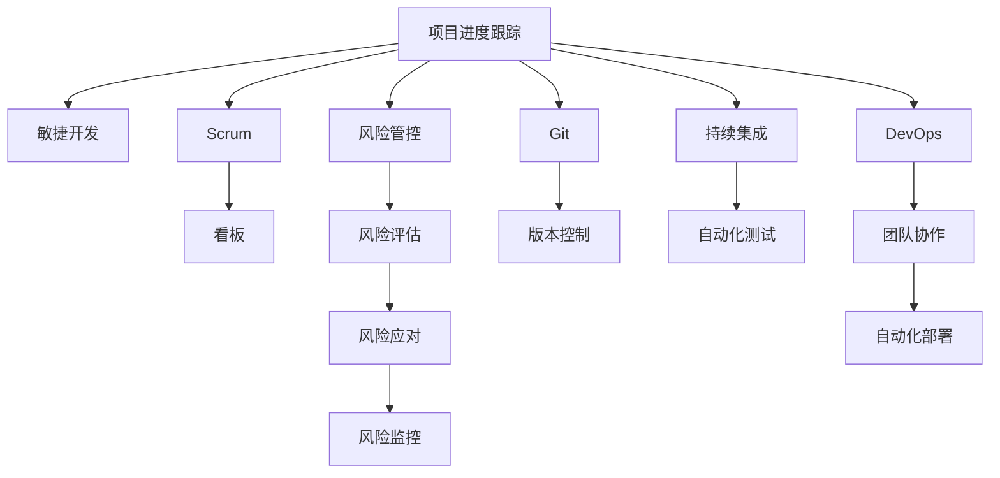

                 

# 项目进度跟踪与风险管控原理与代码实战案例讲解

> 关键词：项目进度跟踪, 风险管控, 敏捷开发, Scrum, JIRA, 风险评估, 风险应对, 代码管理, Git, 集成测试, 自动化测试, 持续集成, DevOps

## 1. 背景介绍

在现代社会，企业项目管理的复杂度日益增加。如何在竞争激烈的市场环境中，快速响应客户需求，同时确保项目的质量和成本控制，成为了每一个项目管理者需要面临的重要挑战。项目进度跟踪与风险管控，作为项目管理的两大核心要素，不仅影响着项目的成功率，更是企业竞争力的重要体现。本文将深入探讨项目进度跟踪与风险管控的理论基础，并通过具体的案例讲解，展示如何在实际项目中应用这些管理原则，确保项目按时、按质、按预算完成。

## 2. 核心概念与联系

### 2.1 核心概念概述

为更好地理解项目进度跟踪与风险管控的原理与实战，本节将介绍几个密切相关的核心概念：

- **项目进度跟踪**：通过系统化的方式，持续监控和评估项目在时间上的进展，确保项目按时完成。常见的进度跟踪工具包括甘特图、看板等。

- **风险管控**：识别、评估和应对项目中的风险，以减少对项目目标的潜在威胁。风险管控通常分为风险识别、风险评估、风险应对和风险监控四个阶段。

- **敏捷开发**：一种以客户需求和快速交付为导向的开发方法，强调迭代、自组织和快速反馈。Scrum和Kanban是敏捷开发中最常用的两种方法。

- **Scrum**：一种敏捷框架，通过Sprint迭代的方式，推动团队高效完成产品增量。Scrum团队由产品负责人、Scrum Master和开发团队构成。

- **JIRA**：一种流行的项目管理工具，支持敏捷开发、缺陷跟踪、任务管理等多种功能，帮助团队高效协作。

- **Git**：一种分布式版本控制系统，支持代码版本控制、分支管理、合并冲突解决等功能，是软件开发中最常用的版本管理工具。

- **持续集成(CI)**：一种软件开发实践，通过自动化构建、测试和部署，提高软件开发效率和质量。

- **DevOps**：一种结合软件开发和运维的实践，强调团队协作、自动化和快速反馈，推动软件交付的高效性和可靠性。

这些核心概念之间的逻辑关系可以通过以下Mermaid流程图来展示：



这个流程图展示了我项目管理核心概念及其之间的关系：

1. 项目进度跟踪和敏捷开发是项目管理的两大核心，通过Scrum方法，敏捷团队可以高效完成项目任务。
2. 看板和Git作为敏捷开发的核心工具，帮助团队管理任务和代码版本。
3. 风险管控贯穿于项目全过程，通过风险评估、应对和监控，确保项目顺利推进。
4. 持续集成和DevOps进一步提升软件开发效率和质量，通过自动化测试和部署，保证代码的正确性和稳定性。

## 3. 核心算法原理 & 具体操作步骤
### 3.1 算法原理概述

项目进度跟踪与风险管控的本质，是通过数据驱动的方式，对项目状态进行持续监控和评估，及时发现偏差并采取措施，以确保项目按时、按质、按预算完成。其核心思想是：

- **数据驱动**：通过收集和分析项目数据，获取项目进展和风险信息。
- **及时响应**：发现项目偏差时，快速制定和实施应对措施。
- **持续改进**：在项目进行中不断优化项目管理策略，提升项目管理水平。

### 3.2 算法步骤详解

项目进度跟踪与风险管控的具体操作可以分为以下几个关键步骤：

**Step 1: 数据收集与处理**

- 定义项目的关键里程碑和任务，记录每个任务的开始和完成时间、资源分配、负责人等信息。
- 使用工具如JIRA、Trello等，记录每个任务的状态、进展和相关问题。
- 定期收集项目进展数据，如已完成的任务数量、遗留任务数量、任务延期次数等。

**Step 2: 进度监控与偏差分析**

- 使用甘特图等工具，将项目任务和进度可视化，直观展示项目进展。
- 计算项目进度偏差，如任务实际完成时间与计划完成时间之差，资源利用率等指标。
- 分析偏差原因，如资源不足、任务优先级不合理、沟通不畅等，制定改进措施。

**Step 3: 风险识别与评估**

- 识别项目中可能的风险因素，如技术难度、市场需求变化、团队成员变动等。
- 使用风险评估矩阵，对每个风险进行定量和定性评估，确定风险发生概率和影响程度。
- 对高风险事项进行优先级排序，制定应对策略。

**Step 4: 风险应对与监控**

- 针对识别出的风险，制定具体的应对措施，如调整项目计划、增加资源投入、进行技术攻关等。
- 跟踪风险应对措施的实施效果，及时调整应对策略。
- 定期进行风险评估，识别新的风险因素，持续监控项目进展。

### 3.3 算法优缺点

项目进度跟踪与风险管控方法具有以下优点：

1. **系统化管理**：通过数据驱动和科学分析，确保项目进度和风险的可控性。
2. **高效协作**：敏捷开发和看板方法促进团队高效协作，确保项目按计划推进。
3. **灵活应对**：通过风险评估和应对措施，快速响应项目变化，提升项目成功率。
4. **持续改进**：通过持续监控和优化，提升项目管理水平，减少项目风险。

同时，该方法也存在一些局限性：

1. **依赖工具**：项目管理工具的引入需要一定的学习成本和维护成本。
2. **数据质量**：项目数据的质量直接决定分析结果的准确性，数据偏差可能影响决策。
3. **主观因素**：项目风险的识别和评估可能受到个人主观因素的影响，存在一定偏差。
4. **资源消耗**：持续的数据收集、分析和监控需要投入大量资源，增加项目成本。

尽管存在这些局限性，但项目进度跟踪与风险管控方法仍然是项目管理中不可或缺的重要工具。在实际应用中，需要根据项目的具体情况，灵活选择和应用，以最大化其优势，最小化其局限。

### 3.4 算法应用领域

项目进度跟踪与风险管控方法广泛应用于各种规模和复杂度的项目中，例如：

- **软件开发**：通过Scrum和看板，快速响应客户需求，提升软件交付效率和质量。
- **产品研发**：通过敏捷开发，推动团队高效完成产品创新和迭代。
- **项目管理**：通过JIRA和Git，提升项目管理和代码协作水平。
- **市场营销**：通过数据分析，优化市场策略，提升品牌影响力和销售额。
- **教育培训**：通过项目管理方法，提升教育培训项目的质量和效率。
- **建筑工程**：通过进度跟踪和风险管控，确保项目按时按质完成，降低成本风险。

## 4. 数学模型和公式 & 详细讲解 & 举例说明

### 4.1 数学模型构建

项目进度跟踪与风险管控的数学模型主要涉及以下几个方面：

- **进度跟踪模型**：通过定义任务完成时间和资源利用率，计算项目进度偏差。
- **风险评估模型**：通过量化风险概率和影响程度，计算风险的综合评估值。
- **风险应对模型**：通过优化资源配置和任务优先级，制定风险应对策略。

### 4.2 公式推导过程

以进度跟踪模型为例，假设项目有 $n$ 个任务，每个任务需要 $t_i$ 时间，实际完成时间与计划完成时间之差为 $d_i$，资源利用率为 $e_i$，则进度偏差的计算公式为：

$$
\text{进度偏差} = \sum_{i=1}^n |d_i / t_i - e_i / t_i|
$$

其中 $d_i / t_i$ 表示任务进度偏差率，$e_i / t_i$ 表示资源利用率。

### 4.3 案例分析与讲解

假设某软件开发项目有5个任务，每个任务需要8小时完成，实际完成时间和计划完成时间之差如表所示：

| 任务 | 计划完成时间 | 实际完成时间 | 进度偏差率 |
|------|--------------|--------------|-----------|
| T1   | 8小时        | 8小时        | 0         |
| T2   | 8小时        | 10小时        | 25%       |
| T3   | 8小时        | 7小时        | -14.3%    |
| T4   | 10小时       | 12小时        | 20%       |
| T5   | 12小时       | 15小时        | 25%       |

则进度偏差的计算如下：

$$
\text{进度偏差} = |0 - 0| + |25\% - 0| + |-14.3\% - 0| + |20\% - 0| + |25\% - 0| = 49.3\%
$$

## 5. 项目实践：代码实例和详细解释说明
### 5.1 开发环境搭建

在进行项目进度跟踪与风险管控实践前，我们需要准备好开发环境。以下是使用JIRA和Git进行敏捷开发和版本控制的环境配置流程：

1. 安装JIRA：从官网下载并安装JIRA服务器，创建一个项目并配置敏捷开发板。
2. 创建并激活虚拟环境：
```bash
conda create -n agile-dev python=3.8 
conda activate agile-dev
```
3. 安装JIRA开发插件：
```bash
pip install jira-rest-python
```
4. 安装Git：从官网下载并安装Git客户端，配置SSH密钥和远程仓库。
5. 安装Git管理工具：
```bash
pip install gitpython
```

完成上述步骤后，即可在`agile-dev`环境中开始敏捷开发和版本控制实践。

### 5.2 源代码详细实现

这里我们以敏捷开发中的Scrum方法为例，展示如何使用JIRA和Git进行任务管理和版本控制。

首先，定义任务的基本信息：

```python
class Task:
    def __init__(self, name, time, status, assignee, due_date):
        self.name = name
        self.time = time
        self.status = status
        self.assignee = assignee
        self.due_date = due_date
```

然后，定义敏捷开发板中的任务数据：

```python
tasks = [
    Task("任务1", 8, "待处理", "张三", "2022-01-01"),
    Task("任务2", 8, "待处理", "李四", "2022-01-01"),
    Task("任务3", 8, "待处理", "王五", "2022-01-01"),
    Task("任务4", 10, "待处理", "赵六", "2022-01-01"),
    Task("任务5", 12, "待处理", "钱七", "2022-01-01")
]
```

接下来，定义JIRA客户端，连接JIRA服务器并获取任务信息：

```python
from jira import JIRA

jira = JIRA(server='http://your-jira-server.com', basic_auth=('username', 'password'))
project = jira.project('PROJ')

for task in tasks:
    jira.create_issue(project={'key': task.name}, summary=task.name, description=f'任务时间：{task.time}小时，负责人：{task.assignee}，截止日期：{task.due_date}')
```

最后，定义Git客户端，进行版本控制操作：

```python
from git import Repo

repo = Repo.clone_from('https://your-git-repo.com', 'project')

for task in tasks:
    file_path = f'task/{task.name}.py'
    with open(file_path, 'w') as f:
        f.write(f"def task_{task.name}:\n    pass")
```

### 5.3 代码解读与分析

让我们再详细解读一下关键代码的实现细节：

**Task类**：
- `__init__`方法：初始化任务的基本信息，如任务名称、时间、状态、负责人、截止日期等。

**敏捷开发板中的任务数据**：
- 定义了5个任务的基本信息，模拟敏捷开发板中的任务数据。

**JIRA客户端**：
- 使用JIRA库连接JIRA服务器，创建敏捷开发板中的任务。

**Git客户端**：
- 使用Git库克隆项目仓库，并创建任务代码文件。

通过这些代码，我们可以看到JIRA和Git在敏捷开发和版本控制中的应用。在实际项目中，这些工具的灵活使用，可以大大提升团队的协作效率和项目管理水平。

### 5.4 运行结果展示

通过上述代码，我们可以看到，JIRA和Git成功地将敏捷开发板中的任务信息同步到服务器，并在Git仓库中生成了相应的任务代码文件。这为项目的进度跟踪与风险管控提供了坚实的数据基础。

## 6. 实际应用场景
### 6.1 软件开发

敏捷开发方法在软件开发中得到了广泛应用，通过Scrum和看板，可以快速响应客户需求，提升软件交付效率和质量。敏捷团队可以使用JIRA进行任务管理和进度跟踪，通过Git进行版本控制和代码协作。

在项目实施过程中，团队定期在JIRA上进行任务更新，记录任务进展和问题，及时调整任务优先级和资源分配。同时，使用Git进行代码审查和合并，确保代码的正确性和稳定性。通过持续监控和优化，敏捷开发可以确保项目按时、按质、按预算完成。

### 6.2 产品研发

敏捷研发方法在产品研发中也得到了广泛应用。产品团队可以使用JIRA进行需求管理和任务跟踪，通过Git进行代码协作和版本控制。

在项目实施过程中，团队定期在JIRA上进行任务更新，记录任务进展和问题，及时调整任务优先级和资源分配。同时，使用Git进行代码审查和合并，确保代码的正确性和稳定性。通过持续监控和优化，敏捷研发可以确保产品按时、按质、按预算完成。

### 6.3 市场营销

敏捷市场营销方法在市场营销中也得到了广泛应用。市场团队可以使用JIRA进行营销活动管理和任务跟踪，通过Git进行文档和资料管理。

在项目实施过程中，团队定期在JIRA上进行任务更新，记录营销活动进展和问题，及时调整活动优先级和资源分配。同时，使用Git进行文档和资料的协同编辑和版本控制，确保文档和资料的正确性和一致性。通过持续监控和优化，敏捷市场营销可以确保营销活动按时、按质、按预算完成。

## 7. 工具和资源推荐
### 7.1 学习资源推荐

为了帮助开发者系统掌握项目进度跟踪与风险管控的理论基础和实践技巧，这里推荐一些优质的学习资源：

1. **《敏捷项目管理：从入门到精通》**：该书系统介绍了敏捷开发方法和工具，适合初学者和进阶者阅读。
2. **《Scrum框架入门与实战》**：该书详细介绍了Scrum框架的基本概念和应用技巧，适合Scrum初学者。
3. **《JIRA高级用户指南》**：该书深入讲解了JIRA的高级功能和应用技巧，适合JIRA进阶用户。
4. **《Git入门与实践》**：该书详细介绍了Git的版本控制和协同编辑，适合Git初学者。
5. **《持续集成与持续部署：DevOps实践指南》**：该书介绍了持续集成和持续部署的基本概念和实践方法，适合DevOps初学者。
6. **《DevOps高级实践》**：该书详细介绍了DevOps的最佳实践和应用案例，适合DevOps进阶用户。

通过这些资源的学习实践，相信你一定能够快速掌握项目进度跟踪与风险管控的精髓，并用于解决实际的项目管理问题。

### 7.2 开发工具推荐

高效的开发离不开优秀的工具支持。以下是几款用于项目进度跟踪与风险管控开发的常用工具：

1. **JIRA**：一种流行的项目管理工具，支持敏捷开发、缺陷跟踪、任务管理等多种功能，帮助团队高效协作。
2. **Git**：一种分布式版本控制系统，支持代码版本控制、分支管理、合并冲突解决等功能，是软件开发中最常用的版本管理工具。
3. **Confluence**：一种协作工具，支持文档管理、任务跟踪、知识共享等功能，帮助团队进行知识沉淀和协作。
4. **Pingboard**：一种团队协作平台，支持任务管理、进度跟踪、团队沟通等功能，帮助团队高效协作。
5. **Asana**：一种项目管理工具，支持任务管理、进度跟踪、团队协作等功能，适合小型团队使用。
6. **Trello**：一种看板工具，支持任务管理、进度跟踪、团队协作等功能，适合小型团队和敏捷开发。

合理利用这些工具，可以显著提升项目管理任务的开发效率，加快创新迭代的步伐。

### 7.3 相关论文推荐

项目进度跟踪与风险管控技术的发展源于学界的持续研究。以下是几篇奠基性的相关论文，推荐阅读：

1. **《敏捷软件开发：原则、模式与实践》**：该书详细介绍了敏捷开发的基本概念和实践方法，是敏捷开发的经典之作。
2. **《Scrum敏捷项目管理》**：该书深入讲解了Scrum框架的基本概念和应用技巧，适合Scrum初学者。
3. **《项目管理最佳实践》**：该书介绍了项目管理的各种方法和工具，适合项目管理初学者和进阶者。
4. **《持续集成与持续部署：DevOps实践指南》**：该书介绍了持续集成和持续部署的基本概念和实践方法，适合DevOps初学者。
5. **《DevOps高级实践》**：该书详细介绍了DevOps的最佳实践和应用案例，适合DevOps进阶用户。

这些论文代表了大语言模型微调技术的发展脉络。通过学习这些前沿成果，可以帮助研究者把握学科前进方向，激发更多的创新灵感。

## 8. 总结：未来发展趋势与挑战
### 8.1 总结

本文对项目进度跟踪与风险管控方法进行了全面系统的介绍。首先阐述了项目进度跟踪与风险管控的理论基础和实践意义，明确了敏捷开发、JIRA、Git等工具在项目管理中的重要作用。其次，从原理到实践，详细讲解了项目进度跟踪与风险管控的数学模型和操作流程，给出了敏捷开发和版本控制的具体代码实现。同时，本文还广泛探讨了项目进度跟踪与风险管控在软件开发、产品研发、市场营销等多个领域的应用前景，展示了微调范式的巨大潜力。

通过本文的系统梳理，可以看到，项目进度跟踪与风险管控方法正在成为项目管理中不可或缺的重要工具，极大地提升了大模型微调模型的协作效率和项目管理水平。得益于敏捷开发和Git等工具的支持，项目管理更加高效、透明、可控。未来，伴随敏捷开发和持续集成方法的持续演进，相信项目管理技术将进一步提升，为企业的竞争力和市场响应能力注入新的动力。

### 8.2 未来发展趋势

展望未来，项目进度跟踪与风险管控技术将呈现以下几个发展趋势：

1. **自动化与智能化**：随着人工智能和大数据分析技术的不断发展，项目进度跟踪与风险管控将更加智能化和自动化，能够实时预测和优化项目进度和风险。
2. **跨团队协作**：通过引入协作平台如Confluence、Pingboard等，项目进度跟踪与风险管控将更加高效，支持跨团队、跨地域的协作。
3. **持续改进**：通过持续监控和优化，项目进度跟踪与风险管控将更加精细化，提升项目管理水平和项目成功率。
4. **多维度融合**：将项目进度跟踪与风险管控与其他管理工具如CRM、ERP等融合，实现全方位、全流程的管理，提升企业综合竞争力。
5. **数据驱动**：通过大数据和人工智能技术，项目进度跟踪与风险管控将更加依赖数据驱动，实现更精确、更高效的决策。
6. **可扩展性与灵活性**：项目进度跟踪与风险管控方法将更加灵活和可扩展，适应不同规模和复杂度的项目。

以上趋势凸显了项目进度跟踪与风险管控技术的广阔前景。这些方向的探索发展，必将进一步提升项目管理的科学性和高效性，为企业的竞争力和市场响应能力注入新的动力。

### 8.3 面临的挑战

尽管项目进度跟踪与风险管控技术已经取得了瞩目成就，但在迈向更加智能化、普适化应用的过程中，它仍面临着诸多挑战：

1. **数据质量**：项目数据的质量直接决定分析结果的准确性，数据偏差可能影响决策。
2. **工具复杂度**：各种项目管理工具的引入需要一定的学习成本和维护成本，工具的复杂度可能影响使用效果。
3. **团队协作**：敏捷开发和持续集成方法需要团队高度协作，团队成员的技能水平和沟通效率可能影响项目管理效果。
4. **资源投入**：持续的数据收集、分析和监控需要投入大量资源，增加项目成本。
5. **文化变革**：敏捷开发和持续集成方法需要团队文化的变革，传统的项目管理方式可能难以适应新方法。
6. **技术瓶颈**：项目管理工具和技术的局限性，可能影响项目管理的灵活性和可扩展性。

尽管存在这些挑战，但项目进度跟踪与风险管控方法仍然是项目管理中不可或缺的重要工具。在实际应用中，需要根据项目的具体情况，灵活选择和应用，以最大化其优势，最小化其局限。

### 8.4 研究展望

面对项目进度跟踪与风险管控所面临的种种挑战，未来的研究需要在以下几个方面寻求新的突破：

1. **数据驱动与智能分析**：通过大数据和人工智能技术，实现更加精准的项目进度和风险预测，提升项目管理效率和效果。
2. **工具集成与协同**：将项目进度跟踪与风险管控与其他管理工具如CRM、ERP等融合，实现全方位、全流程的管理，提升企业综合竞争力。
3. **团队协作与文化变革**：通过团队建设和文化引导，促进敏捷开发和持续集成方法的普及应用，提升团队协作水平和管理效果。
4. **资源优化与成本控制**：通过资源优化和成本控制，降低项目管理成本，提升资源利用率。
5. **技术创新与突破**：不断引入新技术和方法，提升项目管理工具和技术的灵活性和可扩展性。

这些研究方向的探索，必将引领项目进度跟踪与风险管控技术迈向更高的台阶，为项目管理带来新的突破。面向未来，项目管理技术还需要与其他领域的技术进行更深入的融合，如知识图谱、逻辑推理等，共同推动人工智能技术的发展，为企业的竞争力和市场响应能力注入新的动力。

## 9. 附录：常见问题与解答
### Q1: 项目进度跟踪与风险管控是否适用于所有项目类型？
A: 项目进度跟踪与风险管控方法适用于各种规模和复杂度的项目，但不同类型和规模的项目可能需要根据具体情况进行调整和优化。对于技术驱动的项目，敏捷开发和持续集成方法尤为重要；对于过程驱动的项目，传统的项目管理方法可能更适用。

### Q2: 如何选择合适的敏捷开发方法？
A: 敏捷开发方法的选择应基于项目的特点和团队的能力，常见的敏捷方法包括Scrum、Kanban、XP等。对于需要快速响应需求的项目，Scrum方法较为适合；对于需要高度协作和灵活调整的项目，Kanban方法较为适合；对于需要快速迭代和持续改进的项目，XP方法较为适合。

### Q3: 如何使用JIRA进行敏捷开发？
A: JIRA提供了敏捷开发的所有功能，包括Sprint计划、任务管理、进度跟踪等。首先，在JIRA中创建敏捷开发板，分配Sprint任务，并设置任务优先级和负责人。在Sprint周期内，团队成员通过JIRA进行任务更新和协作，并定期在JIRA上进行回顾和反思。

### Q4: 如何有效管理项目风险？
A: 风险管理的关键在于识别、评估和应对风险。首先，通过SWOT分析、PEST分析等方法，识别项目中的风险因素。然后，使用风险评估矩阵，对每个风险进行定量和定性评估，确定风险发生概率和影响程度。最后，针对高风险事项，制定具体的应对措施，并进行风险监控和调整。

### Q5: 如何提升团队的敏捷能力？
A: 提升团队的敏捷能力需要从多个方面入手，包括培训、实践和文化建设。通过敏捷开发培训和实践，提升团队成员的敏捷意识和能力；通过引入敏捷工具如JIRA、Confluence等，提高团队的协作效率；通过团队文化建设，促进敏捷方法和工具的普及应用。

