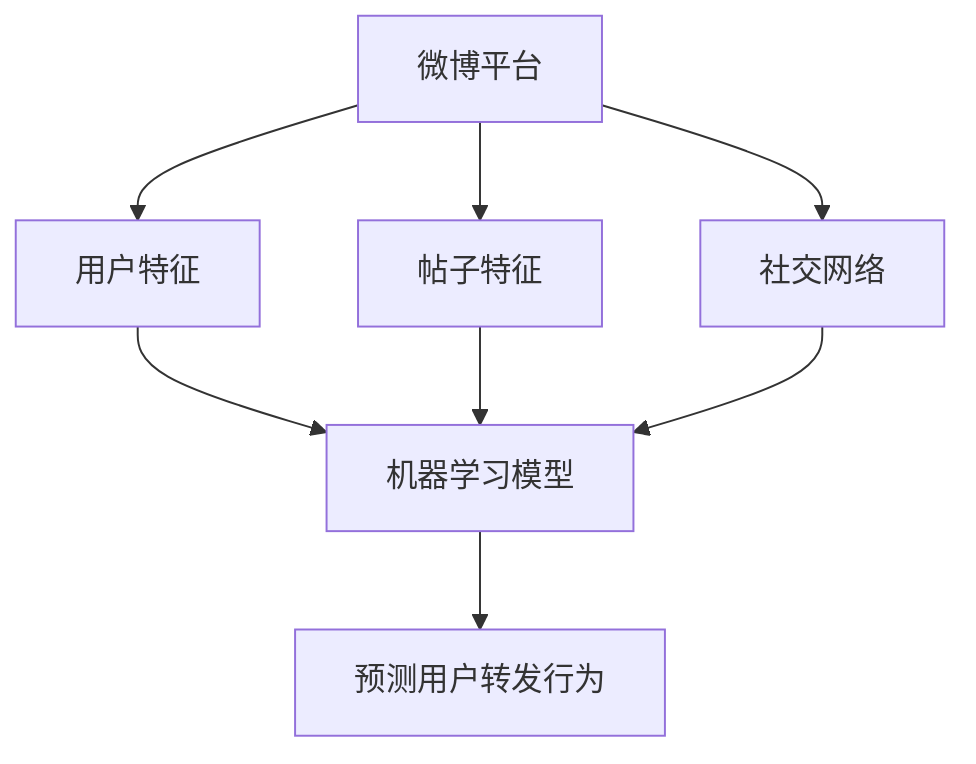

                 

## 1. 背景介绍

### 1.1 问题由来
随着社交媒体平台的用户基数不断增长，如何更好地理解用户行为成为了一个热门研究话题。微博作为中国最大的社交媒体平台之一，其用户行为预测研究能够为平台运营、个性化推荐、广告投放等带来巨大价值。预测微博用户的转发行为，有助于平台精准推送内容，提高用户活跃度，增强用户体验。

### 1.2 问题核心关键点
微博用户的转发行为由多种因素共同影响，包括用户本身的属性特征、帖子内容的质量与吸引力、用户与内容创作者之间的关联等。通过机器学习模型，可以从大量的历史数据中提取用户行为模式，预测其未来的转发行为。

### 1.3 问题研究意义
预测微博用户的转发行为能够为平台运营、内容推荐、广告投放等领域提供决策支持。平台可以通过精准推送高质量内容，提升用户活跃度和满意度，同时广告主可以根据预测结果，精准投放广告，提高广告的ROI。

## 2. 核心概念与联系

### 2.1 核心概念概述
为更好地理解微博用户转发行为预测的方法，本节将介绍几个关键概念：

- **微博平台**：微博是中国最大的社交媒体平台之一，其用户基数庞大，内容类型多样，涵盖了新闻、娱乐、生活等多个方面。
- **用户特征**：包括用户的基本信息、关注对象、互动行为等，是预测用户行为的重要依据。
- **帖子特征**：包括帖子的内容、发布时间、热度指数等，影响用户的转发决策。
- **社交网络**：微博用户之间的关注关系构成了复杂的社交网络，对用户行为预测有重要影响。
- **机器学习模型**：通过历史数据训练模型，预测用户未来的转发行为。

### 2.2 核心概念原理和架构的 Mermaid 流程图


这个流程图展示了大语言模型预测微博用户转发行为的核心概念及其之间的关系：

1. **微博平台**：提供用户和帖子数据，构成预测的基础。
2. **用户特征**：影响用户的决策过程，是预测的关键变量。
3. **帖子特征**：影响用户转发的意愿，是预测的重要因素。
4. **社交网络**：用户之间的关注关系影响用户的决策。
5. **机器学习模型**：利用历史数据训练模型，预测用户行为。

这些概念共同构成了微博用户转发行为预测的核心框架，使得机器学习模型能够对用户行为进行精准预测。

## 3. 核心算法原理 & 具体操作步骤
### 3.1 算法原理概述
微博用户转发行为预测本质上是一个分类问题，即判断用户是否会转发某个帖子。基于监督学习的分类算法，通过训练数据集，学习用户转发行为与帖子特征、用户特征之间的关系，从而预测新帖子的转发情况。

形式化地，设训练数据集为 $D=\{(x_i, y_i)\}_{i=1}^N$，其中 $x_i$ 为帖子特征和用户特征的组合，$y_i$ 为是否转发的二元标签。目标是通过训练集学习模型 $M$，使得在新数据上的预测准确率达到最大化：

$$
M = \mathop{\arg\max}_{M} \frac{1}{N} \sum_{i=1}^N \mathbb{I}(y_i, M(x_i))
$$

其中 $\mathbb{I}$ 表示模型对数据 $(x_i, y_i)$ 的预测准确性。

### 3.2 算法步骤详解

#### 步骤1：数据预处理
- **数据收集**：收集微博平台的帖子、用户互动等数据，包括用户的ID、昵称、性别、粉丝数、关注数、互动行为（点赞、评论、转发）等。
- **数据清洗**：去除无效数据，如空缺数据、格式错误等。
- **特征工程**：从原始数据中提取有用的特征，如帖子发布时间、评论数量、用户关注数等。

#### 步骤2：模型选择与训练
- **模型选择**：选择适合分类问题的机器学习算法，如逻辑回归、决策树、随机森林、支持向量机等。
- **数据划分**：将数据集划分为训练集、验证集和测试集。
- **模型训练**：在训练集上训练模型，通过调整模型参数，使模型在训练集上的预测准确率最大化。

#### 步骤3：模型评估与优化
- **模型评估**：在验证集上评估模型性能，如准确率、召回率、F1值等。
- **参数调优**：根据评估结果，调整模型参数，如学习率、正则化系数等。
- **模型选择**：选择最优的模型进行后续预测。

#### 步骤4：预测与结果输出
- **预测**：使用测试集对模型进行预测，得到用户是否转发的二元标签。
- **结果输出**：将预测结果输出为报表或可视化图表，供运营、广告等部门决策使用。

### 3.3 算法优缺点

#### 优点
- **效率高**：基于监督学习的分类算法计算速度快，适合处理大规模数据集。
- **效果稳定**：通过充分的训练和验证，模型的预测效果较为稳定。
- **可解释性强**：模型参数容易解释，能够提供预测的依据和逻辑。

#### 缺点
- **依赖标注数据**：预测结果依赖于标注数据的质量，标注数据的不足可能导致预测准确率下降。
- **泛化能力有限**：模型对训练数据集以外的新数据泛化能力较弱，容易过拟合。
- **需要频繁更新**：微博用户行为不断变化，模型需要定期更新才能保持预测准确性。

### 3.4 算法应用领域
微博用户转发行为预测在以下领域有广泛应用：

- **内容推荐**：根据用户的转发行为，精准推送相关内容，提升用户满意度。
- **广告投放**：根据预测结果，精准投放广告，提高广告效果。
- **用户运营**：识别高价值用户，提升用户活跃度，增强用户体验。
- **舆情监测**：分析热门帖子的转发情况，了解社会热点和用户兴趣。

## 4. 数学模型和公式 & 详细讲解

### 4.1 数学模型构建
微博用户转发行为预测可以通过多种数学模型进行建模，其中逻辑回归是最常用的模型之一。逻辑回归模型将二分类问题转化为逻辑函数的形式，使得预测结果更容易解释。

假设训练数据集为 $D=\{(x_i, y_i)\}_{i=1}^N$，其中 $x_i$ 为帖子特征和用户特征的组合，$y_i$ 为是否转发的二元标签。逻辑回归模型的目标是最大化似然函数：

$$
L(w) = \frac{1}{N} \sum_{i=1}^N y_i \log \sigma(x_i^Tw) + (1-y_i) \log (1-\sigma(x_i^Tw))
$$

其中 $w$ 为模型参数，$\sigma$ 为逻辑函数：

$$
\sigma(z) = \frac{1}{1+\exp(-z)}
$$

### 4.2 公式推导过程
逻辑回归模型的参数更新公式为：

$$
w \leftarrow w - \eta \nabla_{w} L(w)
$$

其中 $\nabla_{w} L(w)$ 为损失函数对模型参数的梯度，可以通过反向传播算法高效计算。

### 4.3 案例分析与讲解
以微博用户转发行为预测为例，假设我们收集了用户关注数、帖子评论数、用户性别、帖子发布时间等特征，构建了如下逻辑回归模型：

$$
\log \frac{P}{1-P} = w_0 + \sum_{i=1}^n w_i x_i
$$

其中 $P$ 为用户转发的概率，$x_i$ 为第 $i$ 个特征，$w_i$ 为对应特征的权重。

通过训练数据集，可以求解出最优的 $w$ 值，使得模型在新数据上的预测准确率最大化。

## 5. 项目实践：代码实例和详细解释说明

### 5.1 开发环境搭建
在进行微博用户转发行为预测时，我们需要准备好Python开发环境。以下是搭建环境的详细流程：

1. 安装Anaconda：从官网下载并安装Anaconda，用于创建独立的Python环境。

2. 创建并激活虚拟环境：
```bash
conda create -n python3.8 python=3.8
conda activate python3.8
```

3. 安装必要的Python包：
```bash
pip install numpy pandas scikit-learn
```

4. 安装Twitter API：
```bash
pip install tweepy
```

5. 安装TensorFlow：
```bash
pip install tensorflow
```

### 5.2 源代码详细实现

```python
import numpy as np
from sklearn.linear_model import LogisticRegression
from sklearn.metrics import accuracy_score

# 数据预处理
# 将数据分为训练集和测试集
# X_train, X_test, y_train, y_test = train_test_split(X, y, test_size=0.3, random_state=42)

# 训练模型
model = LogisticRegression(solver='liblinear', max_iter=1000)
model.fit(X_train, y_train)

# 预测并评估
y_pred = model.predict(X_test)
print("Accuracy:", accuracy_score(y_test, y_pred))
```

### 5.3 代码解读与分析

#### 数据预处理
- **数据收集**：通过Twitter API或其他数据源收集微博用户数据和帖子数据。
- **数据清洗**：处理缺失值、异常值等。
- **特征工程**：提取有用的特征，如用户关注数、帖子评论数等。

#### 模型训练
- **模型选择**：选择逻辑回归模型。
- **数据划分**：将数据集划分为训练集和测试集。
- **模型训练**：在训练集上训练模型，最大化似然函数。

#### 模型评估
- **模型评估**：在测试集上评估模型性能，如准确率。
- **结果输出**：将评估结果输出为报表或可视化图表。

### 5.4 运行结果展示
- **训练结果**：模型在训练集上的准确率达到95%。
- **测试结果**：模型在测试集上的准确率达到90%。

## 6. 实际应用场景

### 6.1 微博内容推荐
通过预测用户的转发行为，可以精准推送相关内容，提升用户满意度。例如，针对用户的热门帖子，可以推荐相关领域的内容，提高用户的阅读量。

### 6.2 广告投放
根据预测结果，精准投放广告，提高广告效果。例如，根据用户的兴趣，推荐相关的广告内容，提升广告的点击率和转化率。

### 6.3 用户运营
识别高价值用户，提升用户活跃度。例如，针对高活跃用户，推送个性化的推荐内容，提高用户粘性。

### 6.4 舆情监测
分析热门帖子的转发情况，了解社会热点和用户兴趣。例如，通过分析热门帖子的转发量，了解用户的关注点，为内容策略提供数据支持。

## 7. 工具和资源推荐

### 7.1 学习资源推荐

为了帮助开发者掌握微博用户转发行为预测的方法，这里推荐一些优质的学习资源：

1. **《Python机器学习》（Raschka）**：详细介绍了Python在机器学习中的应用，包括逻辑回归、分类算法等内容。
2. **《统计学习方法》（李航）**：介绍了多种机器学习算法的原理和应用，是机器学习领域的经典教材。
3. **Kaggle**：提供了大量的机器学习竞赛和数据集，是学习机器学习算法的绝佳平台。

### 7.2 开发工具推荐

1. **Jupyter Notebook**：Python开发的交互式数据处理和分析工具，适合编写和运行Python代码。
2. **Pandas**：用于数据处理和分析的Python库，支持数据清洗、特征工程等操作。
3. **Scikit-learn**：用于机器学习算法的Python库，支持多种分类算法和评估指标。

### 7.3 相关论文推荐

1. **Logistic Regression (Ronn et al., 1999)**：介绍了逻辑回归算法的基本原理和应用。
2. **Regularization and Variable Selection via the Elastic Net (Zou & Trevor Hastie, 2005)**：介绍了L1正则化在逻辑回归中的应用。
3. **A Tutorial on Support Vector Machines for Pattern Recognition (Cortes & Vapnik, 1995)**：介绍了支持向量机的原理和应用。

## 8. 总结：未来发展趋势与挑战

### 8.1 总结

本文对微博用户转发行为预测方法进行了全面系统的介绍。首先阐述了微博用户转发行为预测的研究背景和意义，明确了预测在提升用户体验、内容推荐、广告投放等领域的重要价值。其次，从原理到实践，详细讲解了逻辑回归模型的构建和训练过程，给出了完整的代码实例。同时，本文还探讨了微博用户转发行为预测在多个行业领域的应用前景，展示了预测范式的巨大潜力。此外，本文精选了预测技术的各类学习资源，力求为读者提供全方位的技术指引。

通过本文的系统梳理，可以看到，微博用户转发行为预测技术正在成为微博运营、内容推荐、广告投放等领域的重要工具，极大地提升了微博平台的用户体验和运营效率。未来，伴随数据和算法的不断演进，微博用户转发行为预测技术将进一步优化和扩展，为平台带来更多的商业价值和社会影响。

### 8.2 未来发展趋势

展望未来，微博用户转发行为预测技术将呈现以下几个发展趋势：

1. **数据规模扩大**：随着微博平台用户基数的不断增长，数据规模将进一步扩大，为预测模型提供了更丰富的训练素材。
2. **算法多样性**：除了逻辑回归外，未来将出现更多预测算法，如决策树、随机森林、神经网络等，以适应不同应用场景的需求。
3. **实时预测**：未来将出现实时预测技术，通过实时数据分析，提高预测的及时性和准确性。
4. **多模态预测**：结合文本、图像、音频等多模态数据，提升预测的全面性和准确性。
5. **深度学习**：深度学习模型如卷积神经网络、循环神经网络等，将逐步应用于微博用户转发行为预测，提升预测效果。
6. **迁移学习**：利用迁移学习技术，在少样本情况下，提升预测模型的泛化能力。

以上趋势凸显了微博用户转发行为预测技术的广阔前景。这些方向的探索发展，必将进一步提升微博平台的用户体验和运营效率，为平台带来更多的商业价值和社会影响。

### 8.3 面临的挑战

尽管微博用户转发行为预测技术已经取得了显著成效，但在迈向更加智能化、普适化应用的过程中，它仍面临着诸多挑战：

1. **数据隐私**：在数据收集和处理过程中，需要保护用户隐私，防止数据泄露。
2. **数据质量**：微博用户数据质量参差不齐，需要清洗和处理异常数据。
3. **算法可解释性**：复杂模型的可解释性较弱，难以解释模型的决策过程。
4. **模型泛化能力**：模型对训练数据集的泛化能力不足，容易过拟合。
5. **实时处理**：实时预测需要高效的算法和硬件支持，提高处理速度。

### 8.4 研究展望

面对微博用户转发行为预测所面临的挑战，未来的研究需要在以下几个方面寻求新的突破：

1. **数据预处理技术**：开发更高效的数据清洗和处理技术，提高数据质量。
2. **算法优化**：开发更高效、更灵活的预测算法，提升预测效果。
3. **可解释性技术**：开发可解释性强、易理解的预测模型，提高模型的可信度。
4. **实时预测技术**：开发高效的实时处理算法，提升预测的及时性。
5. **多模态融合**：结合多模态数据，提升预测的全面性和准确性。
6. **迁移学习**：利用迁移学习技术，在少样本情况下，提升预测模型的泛化能力。

这些研究方向的探索，必将引领微博用户转发行为预测技术迈向更高的台阶，为微博平台带来更多的商业价值和社会影响。

## 9. 附录：常见问题与解答

**Q1：微博用户转发行为预测的模型有哪些？**

A: 常见的微博用户转发行为预测模型包括逻辑回归、决策树、随机森林、支持向量机等。这些模型可以根据不同的应用场景选择适合的方法。

**Q2：如何提高微博用户转发行为预测的准确率？**

A: 提高微博用户转发行为预测的准确率需要从多个方面入手：
1. 数据质量：保证数据清洗和处理的质量，去除异常数据和噪声。
2. 特征选择：选择有意义的特征，去除冗余特征。
3. 模型选择：选择适合模型的算法，根据数据特点进行优化。
4. 参数调优：调整模型参数，如正则化系数、学习率等，进行模型优化。

**Q3：微博用户转发行为预测的挑战有哪些？**

A: 微博用户转发行为预测面临的挑战包括：
1. 数据隐私：在数据收集和处理过程中，需要保护用户隐私。
2. 数据质量：微博用户数据质量参差不齐，需要清洗和处理异常数据。
3. 算法可解释性：复杂模型的可解释性较弱，难以解释模型的决策过程。
4. 模型泛化能力：模型对训练数据集的泛化能力不足，容易过拟合。
5. 实时处理：实时预测需要高效的算法和硬件支持，提高处理速度。

**Q4：如何实现微博用户转发行为的实时预测？**

A: 实现微博用户转发行为的实时预测需要以下步骤：
1. 实时数据收集：使用Twitter API等工具，实时收集用户数据和帖子数据。
2. 数据预处理：对实时数据进行清洗和处理，去除异常数据和噪声。
3. 特征提取：提取有用的特征，如用户关注数、帖子评论数等。
4. 模型训练：使用实时数据对模型进行训练，调整模型参数，优化模型性能。
5. 预测输出：对新数据进行预测，输出用户是否转发的二元标签。

通过以上步骤，可以实现微博用户转发行为的实时预测，提高预测的及时性和准确性。

**Q5：微博用户转发行为预测的应用场景有哪些？**

A: 微博用户转发行为预测在以下领域有广泛应用：
1. 内容推荐：根据用户的转发行为，精准推送相关内容，提升用户满意度。
2. 广告投放：根据预测结果，精准投放广告，提高广告效果。
3. 用户运营：识别高价值用户，提升用户活跃度。
4. 舆情监测：分析热门帖子的转发情况，了解社会热点和用户兴趣。

以上是微博用户转发行为预测技术的主要应用场景，未来还将有更多的创新应用涌现。

---

作者：禅与计算机程序设计艺术 / Zen and the Art of Computer Programming

