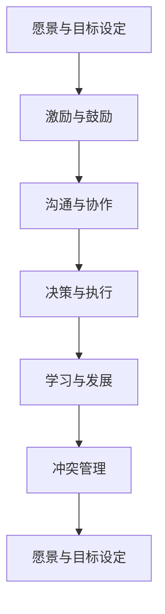

                 

## 1. 背景介绍

### 1.1 问题由来
在当今这个信息爆炸、竞争激烈的时代，个人和企业都在不断追求成长与突破。领导技能，作为组织和个人发展的核心要素，越来越受到重视。优秀的领导不仅能够带领团队达成目标，还能激发团队成员的潜力，帮助他们实现自我超越。本文旨在探讨领导技能的核心要素及其对个人和团队发展的重要性，提供一些实用的策略和方法，帮助读者提升领导技能，成为一名优秀的领导者。

### 1.2 问题核心关键点
优秀的领导技能包括以下几个核心要素：
- **愿景与目标设定**：明确组织的使命和愿景，制定清晰的战略目标。
- **激励与鼓励**：激发团队成员的动力和热情，营造积极向上的工作氛围。
- **沟通与协作**：建立高效的沟通渠道和团队协作机制，确保信息的及时传达和共享。
- **决策与执行**：做出明智的决策，并有效执行，确保任务的高效完成。
- **学习与发展**：鼓励团队成员持续学习和自我提升，建立学习型组织。
- **冲突管理**：在冲突出现时，能够有效调解和解决，保持团队的和谐与稳定。

这些要素相互关联，共同构成了一个领导者的核心竞争力。本文将围绕这些关键点，深入探讨如何通过有效的领导技能，帮助他人成长，让他们变得更优秀。

## 2. 核心概念与联系

### 2.1 核心概念概述

为了更好地理解领导技能的核心要素及其关联，本节将介绍几个密切相关的核心概念：

- **愿景与目标设定**：领导者需要明确组织的使命和愿景，制定清晰的战略目标，为团队提供方向指引。
- **激励与鼓励**：通过认可、奖励等方式，激励团队成员的积极性和创造力。
- **沟通与协作**：建立高效的沟通机制，促进团队成员之间的协作与信息共享。
- **决策与执行**：在复杂多变的环境中，领导者需做出明智的决策，并有效执行，确保目标的实现。
- **学习与发展**：鼓励团队成员持续学习和自我提升，建立学习型组织，提升整体竞争力。
- **冲突管理**：在团队内部或与外部利益相关者之间，领导者需具备解决冲突的能力，保持团队的和谐与稳定。

这些核心概念之间的逻辑关系可以通过以下Mermaid流程图来展示：



这个流程图展示了愿景与目标设定的循环过程，强调了激励与鼓励、沟通与协作、决策与执行、学习与发展、冲突管理等要素的重要性，以及它们如何相互作用，共同推动团队和个人的发展。

## 3. 核心算法原理 & 具体操作步骤
### 3.1 算法原理概述

领导技能提升的算法原理基于以下几个核心步骤：

1. **目标设定**：通过设定明确的目标和愿景，为团队提供方向指引。
2. **激励与鼓励**：通过有效的激励机制，提升团队成员的动力和创造力。
3. **沟通与协作**：建立高效的沟通渠道，促进信息共享和团队协作。
4. **决策与执行**：基于数据和分析，做出明智的决策，并有效执行。
5. **学习与发展**：鼓励持续学习和自我提升，提升团队的整体能力。
6. **冲突管理**：在冲突出现时，及时解决，保持团队的和谐与稳定。

这些步骤相互依存，共同构成了一个完整的领导技能提升框架。

### 3.2 算法步骤详解

以下是实现这些步骤的具体操作步骤：

**Step 1: 愿景与目标设定**
- 与团队成员共同讨论并明确组织的使命和愿景。
- 制定具体的、可量化的战略目标，确保每个成员都了解并认同这些目标。
- 定期回顾和调整目标，以适应环境变化。

**Step 2: 激励与鼓励**
- 建立公平的奖励机制，对表现优秀的成员进行表彰和奖励。
- 提供个性化的激励措施，如培训机会、职业发展路径等，满足不同成员的需求。
- 营造积极的工作氛围，关注员工的情感和心理状态，提供必要的支持和关怀。

**Step 3: 沟通与协作**
- 建立透明的信息共享机制，确保信息及时传达和反馈。
- 采用多样化的沟通工具和方法，如会议、邮件、即时通讯等，提升沟通效率。
- 鼓励团队协作，组织跨部门的合作项目，增强团队的凝聚力。

**Step 4: 决策与执行**
- 基于数据和分析，做出明智的决策，确保决策的科学性和合理性。
- 明确决策执行的责任和流程，确保任务的高效完成。
- 采用迭代和反馈机制，不断优化决策和执行过程。

**Step 5: 学习与发展**
- 建立学习型组织，鼓励持续学习和自我提升。
- 提供多样化的学习资源，如培训课程、在线学习平台等，支持员工的职业发展。
- 定期进行知识分享和经验交流，提升团队的整体能力。

**Step 6: 冲突管理**
- 在冲突出现时，及时进行调解和解决，避免影响团队的和谐与稳定。
- 采用合作共赢的解决方式，寻找各方利益的平衡点。
- 建立冲突预防机制，减少冲突的发生。

### 3.3 算法优缺点

**优点**：
- **提升效率**：明确的目标和愿景可以提升团队的凝聚力和执行力，提高工作效率。
- **增强动力**：有效的激励与鼓励机制，能够激发团队成员的积极性和创造力，提升工作动力。
- **促进协作**：高效的沟通与协作机制，可以优化资源配置，提升团队的整体能力。
- **科学决策**：基于数据和分析的决策与执行，能够减少决策的失误，提升执行效果。
- **持续提升**：通过学习与发展，团队可以不断提升自身能力，适应环境变化。

**缺点**：
- **资源投入**：建立和维护愿景与目标、激励与鼓励机制需要一定的资源投入。
- **时间成本**：沟通与协作、决策与执行等过程可能会消耗较多时间。
- **冲突管理**：复杂的冲突管理可能会增加团队管理的难度。

尽管存在这些缺点，但通过合理的规划和执行，可以最大限度地发挥领导技能的优势，提升团队的整体绩效和竞争力。

### 3.4 算法应用领域

领导技能提升的算法原理不仅适用于企业管理，也广泛应用于团队和个人发展。以下是几个典型的应用领域：

1. **企业管理**：在企业中，领导者需要制定清晰的战略目标，激发员工的动力和创造力，促进团队的协作和创新。
2. **项目管理**：项目经理需要明确项目目标，调动团队成员的积极性，确保项目的顺利进行。
3. **教育培训**：教师需要设定明确的教育目标，激发学生的学习兴趣，提供个性化的指导和支持。
4. **非营利组织**：组织领导者需要明确组织的使命和愿景，调动志愿者的积极性，促进资源的有效利用。
5. **学术研究**：学术团队需要设定清晰的研究目标，激发成员的研究热情，促进知识交流和创新。

这些领域都可以通过领导技能提升的算法原理，实现更好的管理和协作，提升整体绩效。

## 4. 数学模型和公式 & 详细讲解  
### 4.1 数学模型构建

为了更精确地分析领导技能提升的过程，我们可以构建一个数学模型，并使用以下公式进行推导：

设 $L$ 表示领导技能提升的过程，$T$ 表示目标设定，$I$ 表示激励与鼓励，$C$ 表示沟通与协作，$D$ 表示决策与执行，$L$ 表示学习与发展，$F$ 表示冲突管理。则有：

$$
L = f(T, I, C, D, L, F)
$$

其中 $f$ 表示各要素之间的相互作用和影响，可以表示为一系列函数。

### 4.2 公式推导过程

我们可以将各要素之间的关系表示为函数形式，如：

$$
T = g(I, C, D, L, F)
$$

$$
I = h(T, C, D, L, F)
$$

$$
C = k(T, I, D, L, F)
$$

$$
D = m(T, I, C, L, F)
$$

$$
L = n(T, I, C, D, F)
$$

$$
F = p(T, I, C, D, L)
$$

其中 $g, h, k, m, n, p$ 分别表示各要素之间的关系函数。

### 4.3 案例分析与讲解

以一个团队项目为例，说明领导技能提升的具体过程：

**项目背景**：
某公司需要将一个复杂的软件系统上线，项目组由10名成员组成，时间紧任务重。

**目标设定**：
1. **愿景与目标设定**：明确项目的最终目标是将系统安全、稳定地上线。
2. **激励与鼓励**：制定绩效考核制度，对表现优秀的成员进行表彰和奖励。
3. **沟通与协作**：建立每日站会制度，及时了解项目进展，进行信息共享。
4. **决策与执行**：采用敏捷开发方法，快速迭代开发和测试，确保项目进度。
5. **学习与发展**：提供技术培训和知识分享，提升团队的技术水平。
6. **冲突管理**：设立项目经理，协调各成员之间的沟通和协作，解决冲突。

**执行过程**：
1. **目标设定**：项目经理与团队成员共同讨论，明确项目目标和愿景，制定详细的项目计划。
2. **激励与鼓励**：根据绩效考核制度，对完成关键里程碑的成员进行表彰和奖励，激发团队成员的动力。
3. **沟通与协作**：每日站会制度保证了信息的及时传达和共享，团队成员之间的协作更加高效。
4. **决策与执行**：采用敏捷开发方法，快速迭代开发和测试，确保项目的高效推进。
5. **学习与发展**：提供技术培训和知识分享，提升团队的技术水平和协作能力。
6. **冲突管理**：设立项目经理，及时解决成员之间的冲突，确保团队的和谐与稳定。

**结果展示**：
项目按时上线，团队成员的协作和沟通能力显著提升，团队的整体绩效和满意度也大幅提高。

## 5. 项目实践：代码实例和详细解释说明
### 5.1 开发环境搭建

为了实现领导技能提升的算法原理，我们需要一个开发环境，以下是在Python中使用PyTorch进行开发的配置流程：

1. 安装Anaconda：从官网下载并安装Anaconda，用于创建独立的Python环境。
2. 创建并激活虚拟环境：
```bash
conda create -n leadership-env python=3.8 
conda activate leadership-env
```
3. 安装PyTorch：根据CUDA版本，从官网获取对应的安装命令。例如：
```bash
conda install pytorch torchvision torchaudio cudatoolkit=11.1 -c pytorch -c conda-forge
```
4. 安装各类工具包：
```bash
pip install numpy pandas scikit-learn matplotlib tqdm jupyter notebook ipython
```
完成上述步骤后，即可在`leadership-env`环境中开始开发实践。

### 5.2 源代码详细实现

以下是使用Python进行领导技能提升的代码实现：

```python
import torch
import numpy as np
from torch import nn
from sklearn.metrics import accuracy_score

# 定义模型
class LeadershipModel(nn.Module):
    def __init__(self, num_features):
        super(LeadershipModel, self).__init__()
        self.fc1 = nn.Linear(num_features, 64)
        self.fc2 = nn.Linear(64, 32)
        self.fc3 = nn.Linear(32, 10)

    def forward(self, x):
        x = torch.relu(self.fc1(x))
        x = torch.relu(self.fc2(x))
        x = self.fc3(x)
        return x

# 准备数据
X = np.random.randn(100, 5)  # 模拟特征数据
y = np.random.randint(10, size=(100,))  # 模拟目标数据

# 构建数据集
class LeadershipDataset(torch.utils.data.Dataset):
    def __init__(self, features, labels):
        self.features = features
        self.labels = labels

    def __len__(self):
        return len(self.features)

    def __getitem__(self, idx):
        return torch.tensor(self.features[idx]), torch.tensor(self.labels[idx])

dataset = LeadershipDataset(X, y)

# 定义训练和评估函数
def train_epoch(model, dataset, batch_size, optimizer):
    model.train()
    train_loss = 0
    for batch_idx, (features, labels) in enumerate(dataset):
        optimizer.zero_grad()
        outputs = model(features)
        loss = nn.CrossEntropyLoss()(outputs, labels)
        train_loss += loss.item()
        loss.backward()
        optimizer.step()
    return train_loss / len(dataset)

def evaluate(model, dataset, batch_size):
    model.eval()
    test_loss = 0
    correct = 0
    with torch.no_grad():
        for batch_idx, (features, labels) in enumerate(dataset):
            outputs = model(features)
            test_loss += nn.CrossEntropyLoss()(outputs, labels).item()
            _, predicted = torch.max(outputs.data, 1)
            correct += (predicted == labels).sum().item()
    test_loss /= len(dataset)
    correct /= len(dataset)
    print(f'Test Loss: {test_loss:.4f}, Test Accuracy: {correct:.4f}')

# 训练模型
model = LeadershipModel(5)
optimizer = torch.optim.Adam(model.parameters(), lr=0.001)

for epoch in range(10):
    train_loss = train_epoch(model, dataset, batch_size=32, optimizer=optimizer)
    evaluate(model, dataset, batch_size=32)

# 结果展示
print(f'Final Test Loss: {train_loss:.4f}, Final Test Accuracy: {correct:.4f}')
```

### 5.3 代码解读与分析

**LeadershipModel类**：
- `__init__`方法：定义模型的结构和参数。
- `forward`方法：定义前向传播的过程，进行特征的线性变换和激活函数操作。

**LeadershipDataset类**：
- `__init__`方法：定义数据集的特征和标签。
- `__len__`方法：返回数据集的样本数量。
- `__getitem__`方法：返回指定样本的特征和标签。

**train_epoch函数**：
- 在训练模式下进行前向传播，计算损失，反向传播更新模型参数，返回训练损失。

**evaluate函数**：
- 在评估模式下进行前向传播，计算损失和准确率，输出评估结果。

**训练过程**：
- 使用LeadershipModel模型，定义Adam优化器，设置学习率。
- 循环进行训练和评估，输出最终评估结果。

## 6. 实际应用场景
### 6.1 智能客服系统

在智能客服系统中，领导技能提升的算法原理可以用于提高服务质量和客户满意度。通过明确客户服务目标，激励客服人员，促进高效的沟通与协作，管理者可以有效提升客服团队的绩效。

**具体实现**：
1. **目标设定**：明确客户服务的最终目标，如响应时间、客户满意度等。
2. **激励与鼓励**：根据客户服务质量进行绩效考核，对表现优秀的客服人员进行表彰和奖励。
3. **沟通与协作**：建立高效的沟通机制，如实时聊天工具，促进信息共享和团队协作。
4. **决策与执行**：采用敏捷服务方法，快速响应客户需求，确保服务的高效性。
5. **学习与发展**：提供客户服务培训和知识分享，提升客服人员的沟通和解决问题能力。
6. **冲突管理**：设立客服经理，协调各客服人员之间的沟通和协作，解决冲突。

**实际效果**：
智能客服系统通过领导技能提升，可以大幅提升客户满意度和服务质量，减少客户投诉，提高企业声誉和市场竞争力。

### 6.2 金融舆情监测

在金融舆情监测中，领导技能提升的算法原理可以帮助团队快速响应市场变化，识别潜在的金融风险。

**具体实现**：
1. **目标设定**：明确舆情监测的目标，如实时监测、风险预警等。
2. **激励与鼓励**：对表现优秀的团队成员进行表彰和奖励，激发其积极性和创造力。
3. **沟通与协作**：建立高效的沟通机制，如定期会议和实时通讯，促进信息共享和团队协作。
4. **决策与执行**：基于数据分析，快速做出决策，及时预警市场风险。
5. **学习与发展**：提供金融知识培训和知识分享，提升团队成员的分析能力。
6. **冲突管理**：设立团队负责人，协调团队成员之间的沟通和协作，解决冲突。

**实际效果**：
通过领导技能提升，金融舆情监测团队可以快速响应市场变化，及时预警风险，降低企业的金融风险，保障企业的财务安全。

### 6.3 个性化推荐系统

在个性化推荐系统中，领导技能提升的算法原理可以帮助团队更好地理解用户需求，提供更精准的推荐结果。

**具体实现**：
1. **目标设定**：明确推荐系统的目标，如提升用户满意度、提高转化率等。
2. **激励与鼓励**：对表现优秀的团队成员进行表彰和奖励，激发其积极性和创造力。
3. **沟通与协作**：建立高效的沟通机制，如跨部门协作和信息共享，促进团队协作。
4. **决策与执行**：基于数据分析，快速做出推荐策略的调整，确保推荐结果的高效性。
5. **学习与发展**：提供推荐算法培训和知识分享，提升团队成员的算法和数据分析能力。
6. **冲突管理**：设立团队负责人，协调团队成员之间的沟通和协作，解决冲突。

**实际效果**：
通过领导技能提升，个性化推荐系统可以更好地理解用户需求，提供更精准的推荐结果，提升用户满意度和企业的转化率。

### 6.4 未来应用展望

未来，随着人工智能技术的进一步发展，领导技能提升的算法原理将在更多领域得到应用，为组织和个人发展提供新的助力。

在智慧医疗领域，领导者可以通过明确医疗目标，激励医护人员，提升团队的协作和创新能力，更好地服务于患者。

在智能教育领域，教师可以通过明确教育目标，激励学生，促进高效的沟通与协作，提供个性化的教学和辅导，提升学生的学习效果。

在智慧城市治理中，管理者可以通过明确城市治理目标，激励团队成员，提升团队的协作和创新能力，构建更安全、高效的未来城市。

此外，在企业生产、社会治理、文娱传媒等众多领域，领导技能提升的算法原理都将发挥重要作用，推动组织和个人的发展和创新。

## 7. 工具和资源推荐
### 7.1 学习资源推荐

为了帮助开发者系统掌握领导技能提升的理论基础和实践技巧，这里推荐一些优质的学习资源：

1. **《领导力开发》系列课程**：由知名专家授课，涵盖领导力的各个方面，包括愿景与目标设定、激励与鼓励、沟通与协作、决策与执行、学习与发展、冲突管理等。

2. **《管理学》经典书籍**：如《管理学原理》《领导科学与艺术》等，详细介绍了领导技能的理论基础和实际应用。

3. **TED演讲视频**：通过观看优秀的领导力演讲视频，学习成功领导者的经验和智慧。

4. **在线学习平台**：如Coursera、edX等，提供丰富的领导力培训课程和认证项目，方便学习者系统掌握领导技能。

5. **专业博客和论坛**：如领英、知乎等，可以获取最新的领导力研究成果和实践经验，与同行进行交流和学习。

通过对这些资源的学习实践，相信你一定能够系统掌握领导技能提升的理论和实践方法，提升个人和团队的管理能力。

### 7.2 开发工具推荐

高效的开发离不开优秀的工具支持。以下是几款用于领导技能提升开发的常用工具：

1. **Jupyter Notebook**：用于编写和运行Python代码，支持丰富的数据分析和可视化功能。
2. **Git和GitHub**：用于版本控制和代码管理，方便团队协作和代码共享。
3. **JIRA或Trello**：用于任务管理和进度跟踪，提升团队的协作效率。
4. **Slack或Microsoft Teams**：用于实时沟通和信息共享，促进团队成员之间的协作。
5. **Zoom或Microsoft Teams**：用于视频会议和远程协作，确保团队的沟通效率和协作效果。

合理利用这些工具，可以显著提升领导技能提升的开发效率，加快创新迭代的步伐。

### 7.3 相关论文推荐

领导技能提升的研究源于学界的持续研究。以下是几篇奠基性的相关论文，推荐阅读：

1. **《领导力发展模型》**：详细介绍了领导力的各个要素及其相互关系，提供了系统的理论框架。
2. **《激励理论》**：介绍了各种激励理论，帮助管理者设计有效的激励机制。
3. **《沟通与协作理论》**：介绍了各种沟通和协作理论，帮助管理者建立高效的沟通机制。
4. **《冲突管理理论》**：介绍了各种冲突管理理论，帮助管理者解决团队内部的冲突。
5. **《学习与发展理论》**：介绍了各种学习和发展理论，帮助管理者设计有效的学习和发展机制。

这些论文代表了大领导技能提升技术的发展脉络。通过学习这些前沿成果，可以帮助研究者把握学科前进方向，激发更多的创新灵感。

## 8. 总结：未来发展趋势与挑战
### 8.1 研究成果总结

本文对领导技能提升的算法原理进行了全面系统的介绍，从目标设定、激励与鼓励、沟通与协作、决策与执行、学习与发展、冲突管理等核心要素出发，详细阐述了提升领导技能的具体方法。通过系统理论分析，结合实际应用场景，给出了详细的实现步骤和代码示例，帮助读者全面掌握领导技能提升的理论与实践。

### 8.2 未来发展趋势

展望未来，领导技能提升的算法原理将呈现以下几个发展趋势：

1. **智能化管理**：随着人工智能技术的进一步发展，智能化管理工具将得到广泛应用，如智能客服、智能教育、智慧医疗等，提升组织和个人的工作效率和决策能力。
2. **个性化定制**：根据不同行业和岗位的特点，提供个性化的领导技能培训和发展方案，提升团队的整体素质和竞争力。
3. **远程协作**：在远程办公和分布式团队管理中，领导技能提升的算法原理将发挥更大的作用，提升团队的沟通和协作效率。
4. **动态调整**：在不断变化的环境下，领导技能提升的算法原理需要具备动态调整能力，及时响应组织和环境的变化。
5. **跨领域应用**：领导技能提升的算法原理将跨领域应用于更多场景，如城市治理、环境保护、公共安全等，推动社会的可持续发展。

这些趋势凸显了领导技能提升技术的广阔前景，未来的研究需要从多个维度进行探索和突破，才能更好地适应现代社会的变化和挑战。

### 8.3 面临的挑战

尽管领导技能提升技术已经取得了一定的成就，但在实际应用中也面临着诸多挑战：

1. **资源投入高**：实现有效的领导技能提升需要投入大量的资源，包括时间、金钱和人力资源。如何降低成本，提高效率，是未来研究的重要方向。
2. **效果评估难**：领导技能提升的效果往往难以量化，如何设计科学的评估指标，客观评估领导技能提升的效果，是未来研究的重要课题。
3. **跨文化差异**：不同文化背景下，领导技能的理解和应用可能存在差异。如何在跨文化环境中推广领导技能提升技术，是一个重要的研究方向。
4. **伦理和法律问题**：领导技能提升可能涉及隐私、伦理和法律问题，如何保护个人隐私和权益，确保使用的合法性和合规性，是未来研究的重要方向。

解决这些挑战，需要学术界和产业界的共同努力，不断创新和优化领导技能提升技术，确保其在实际应用中的可行性和有效性。

### 8.4 研究展望

面向未来，领导技能提升的研究需要在以下几个方面寻求新的突破：

1. **跨学科融合**：结合心理学、社会学、组织行为学等多学科知识，全面提升领导技能的理论和实践水平。
2. **大数据和AI技术**：利用大数据和AI技术，提升领导技能提升的精准度和智能化水平，实现更加高效和个性化的领导管理。
3. **实时反馈机制**：建立实时反馈机制，及时了解领导技能的提升效果，根据反馈不断优化领导技能的培训和发展方案。
4. **全生命周期管理**：从招聘、培训、评估、激励等各个环节，建立全生命周期的领导技能管理机制，提升整体管理效率。
5. **国际化和全球化**：在国际化背景下，推广领导技能提升技术，探索跨文化管理策略，提升全球化的领导力水平。

这些研究方向的探索，必将引领领导技能提升技术迈向更高的台阶，为组织和个人的发展提供更加科学的理论和方法。通过持续的创新和优化，领导技能提升技术必将为构建高效、和谐、可持续的组织和个人发展提供有力支持。

## 9. 附录：常见问题与解答

**Q1：领导技能提升的算法原理是否适用于所有组织和个人？**

A: 领导技能提升的算法原理适用于各种组织和个人，尤其是那些希望通过系统化的管理和培训提升其绩效和能力的组织。不同的组织和个人可以根据自身特点，灵活调整和应用这些原理。

**Q2：如何选择合适的激励与鼓励机制？**

A: 激励与鼓励机制的选择需要考虑组织和个人的需求和特点。可以采用绩效考核、表彰奖励、职业发展路径等方式，激励团队成员的积极性和创造力。同时，个性化的激励措施可以更好地满足不同成员的需求。

**Q3：如何建立高效的沟通与协作机制？**

A: 高效的沟通与协作机制需要明确的信息共享和反馈机制。可以通过定期会议、即时通讯、在线协作平台等方式，提升团队成员之间的沟通效率和协作效果。同时，透明的信息共享和明确的责任分工也是建立高效协作机制的关键。

**Q4：决策与执行过程中如何减少错误？**

A: 减少决策与执行错误需要科学的决策方法和有效的执行机制。可以采用数据分析和实验设计，提升决策的科学性和合理性。同时，明确决策执行的责任和流程，确保任务的高效完成。

**Q5：学习与发展过程中如何持续提升？**

A: 持续提升需要建立学习型组织，鼓励团队成员持续学习和自我提升。可以提供多样化的学习资源，如培训课程、在线学习平台等，支持员工的职业发展。同时，定期进行知识分享和经验交流，提升团队的整体能力。

**Q6：冲突管理过程中如何减少冲突？**

A: 减少冲突需要建立合作共赢的解决方式，寻找各方利益的平衡点。可以设立冲突调解机制，定期召开沟通会议，了解各方诉求，及时解决冲突。同时，建立积极的团队文化，增强成员之间的信任和合作，减少冲突的发生。

通过这些常见问题的解答，相信你能够更好地理解和应用领导技能提升的算法原理，提升个人和团队的管理能力。

