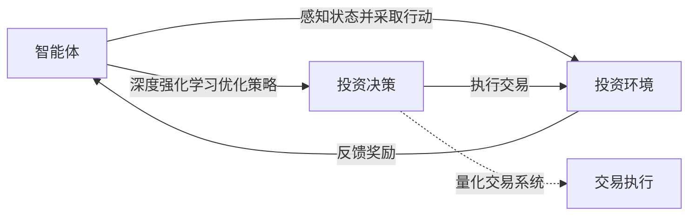

# AI人工智能 Agent：金融投资中智能体的应用

关键词：人工智能、智能体、金融投资、强化学习、深度学习、量化交易

## 1. 背景介绍

### 1.1 问题的由来
随着人工智能技术的飞速发展,将AI应用于金融投资领域已成为业界关注的热点。传统的投资方式依赖于人工分析和决策,存在效率低下、主观性强等问题。利用AI智能体来辅助甚至取代人工投资决策,有望极大提升投资效率和收益。

### 1.2 研究现状
目前,国内外已有不少机构开始探索将智能体技术应用于股票、期货、外汇等金融投资领域。一些知名金融机构如高盛、摩根大通等已开发了自己的AI投资系统。学术界也在智能体投资算法、风险控制等方面取得了一定进展。但总体而言,这一领域仍处于起步阶段,还有许多理论和实践问题有待突破。

### 1.3 研究意义
研究AI智能体在金融投资中的应用,具有重要的理论和实践意义:

1. 丰富人工智能在金融领域的应用场景,推动AI与金融的深度融合。
2. 创新投资决策模式,提高投资效率,为量化投资提供新思路。 
3. 加深对金融市场规律的认知,从数据驱动的角度洞察市场行为。
4. 降低投资风险,提高资金利用效率,为投资者创造更多价值。

### 1.4 本文结构
本文将重点探讨AI智能体在金融投资领域的应用。第2部分介绍相关核心概念;第3部分讲解智能体投资的核心算法原理;第4部分建立数学模型并举例说明;第5部分给出代码实例;第6部分分析实际应用场景;第7部分推荐相关工具和资源;第8部分总结全文并展望未来。

## 2. 核心概念与联系

- 智能体(Agent):能感知环境并做出行动的自主实体,具有一定的推理、学习、决策能力。
- 强化学习(Reinforcement Learning):智能体通过与环境的交互,根据反馈不断优化行为策略的学习范式。 
- 深度学习(Deep Learning):通过构建多层神经网络,从数据中自动学习特征和模式的机器学习方法。
- 量化交易(Quantitative Trading):以数学模型和程序化交易为主的投资方式,强调数据驱动和系统性投资。

在金融投资领域,智能体通过深度强化学习等AI技术,可建立端到端的量化投资策略,根据市场环境做出最优决策,并持续学习优化,以提升投资绩效。下图展示了几个核心概念间的关系:



## 3. 核心算法原理 & 具体操作步骤

### 3.1 算法原理概述
智能体投资的核心是深度强化学习算法。通过将深度学习与强化学习相结合,智能体可从海量的历史数据中学习提取特征,并通过与市场环境的交互不断优化投资策略。其基本原理可概括为:根据当前状态选择一个行动,执行后获得环境反馈的奖励,并转移到下一个状态,如此循环,目标是最大化长期累积奖励。形式化表示为:

$$
G_t = R_{t+1} + \gamma R_{t+2} + ... = \sum_{k=0}^{\infty} \gamma^k R_{t+k+1}
$$

其中$G_t$为累积奖励,$R_t$为每个时间步的奖励,$\gamma$为折扣因子。

### 3.2 算法步骤详解
智能体投资的深度强化学习一般分为以下步骤:

1. 环境建模:将金融市场抽象为马尔可夫决策过程(MDP),定义状态空间、行动空间和奖励函数。
2. 神经网络构建:设计深度神经网络来拟合策略函数(Policy)和价值函数(Value),用于决策和评估。
3. 样本采集:智能体在环境中探索,根据策略采取行动并记录轨迹样本(trajectory)。
4. 策略优化:使用采集到的样本,通过策略梯度、Q-Learning等算法来更新策略网络参数。 
5. 策略评估:在验证集上测试优化后的策略,评估投资绩效。可加入风险控制等额外考量。
6. 迭代训练:重复步骤3-5,持续优化策略,直到满足一定的收敛条件。

### 3.3 算法优缺点
深度强化学习在智能体投资中的优势在于:
- 端到端学习,减少人工设计,让数据说话
- 在线学习,可根据市场变化实时调整策略
- 非线性拟合,捕捉复杂的市场模式
- 泛化能力强,可处理高维数据

同时也存在一些局限:
- 样本效率低,需要大量的交互数据
- 超参数敏感,训练不稳定 
- 解释性差,策略不透明
- 安全性隐患,如何避免策略崩溃

### 3.4 算法应用领域
智能体投资算法可广泛应用于以下领域:
- 股票多因子选股
- 期货CTA策略
- 外汇套利交易
- 衍生品定价与对冲
- 资产配置与组合管理
- 另类数据挖掘
- 市场微观结构研究

## 4. 数学模型和公式 & 详细讲解 & 举例说明

### 4.1 数学模型构建
我们以股票多因子选股为例,展示如何使用智能体技术构建数学投资模型。假设有m只股票,n个因子,T个交易日,记股票收益率为$r_{t}^{i}$,因子值为$x_{t}^{ij}$,目标是学习一个线性的股票打分函数:

$$
score_t^i = \sum_{j=1}^{n} w_j x_t^{ij}
$$

其中$w_j$为因子权重,是强化学习需要优化的策略参数。每个交易日,从打分最高的k只股票中等权配置资金,持有一段时间后卖出,计算投资组合收益率:

$$
R_t = \frac{1}{k} \sum_{i=1}^{k} r_{t+1}^{i}
$$

目标是最大化长期累积的组合收益率。

### 4.2 公式推导过程
我们采用策略梯度算法来优化打分函数的参数。定义策略函数为$\pi_{\theta}(a_t|s_t)$,即在状态$s_t$下选择行动$a_t$的概率。使用softmax函数将打分函数转化为概率分布:

$$
\pi_{\theta}(a_t=i|s_t) = \frac{exp(score_t^i)}{\sum_{j=1}^{m} exp(score_t^j)}
$$

其中$\theta=\{w_1,...,w_n\}$为策略参数。定义价值函数$V^{\pi}(s_t)$为从状态$s_t$开始,执行策略$\pi$能获得的期望累积奖励:

$$
V^{\pi}(s_t) = \mathbb{E}_{a_t \sim \pi_{\theta}} [G_t|S_t=s_t] 
$$

策略梯度定理告诉我们,策略函数的梯度正比于动作优势(advantage)和动作概率的对数梯度:

$$
\nabla_{\theta} J(\theta) = \mathbb{E}_{s_t,a_t}[\nabla_{\theta} log\pi_{\theta}(a_t|s_t) A^{\pi}(s_t,a_t)]
$$

其中$J(\theta)$为目标函数,$A^{\pi}(s_t,a_t)$为优势函数,表示在状态$s_t$下选择行动$a_t$比平均水平好多少:

$$
A^{\pi}(s_t,a_t) = Q^{\pi}(s_t,a_t) - V^{\pi}(s_t)
$$

其中$Q^{\pi}(s_t,a_t)$为行动价值函数,表示在状态$s_t$下选择行动$a_t$,之后遵循策略$\pi$的期望回报。

### 4.3 案例分析与讲解
我们用一个简单的例子来说明该模型的运作。假设有3只股票A、B、C,2个因子分别为市盈率(PE)和净资产收益率(ROE),因子权重初始化为[0.5, 0.5],历史数据如下:

|日期|股票|PE|ROE|收益率|
|--|--|--|--|--|
|第1天|A|10|0.1|0.05|
| |B|20|0.2|0.03|
| |C|30|0.15|-0.02|
|第2天|A|15|0.11|?|
| |B|18|0.25|?|
| |C|35|0.12|?|

在第1天,股票的打分为:
- A: 0.5 * 10 + 0.5 * 0.1 = 5.05
- B: 0.5 * 20 + 0.5 * 0.2 = 10.1
- C: 0.5 * 30 + 0.5 * 0.15 = 15.075

因此选出B和C构建投资组合,第1天的组合收益率为:
$$
R_1 = \frac{1}{2} (0.03 + (-0.02)) = 0.005
$$

假设奖励函数就取当天的组合收益率,那么策略梯度中的优势项可近似为:

$$
A(s_1,a=B) = R_1 - V(s_1) = 0.005 - \bar{R} \
A(s_1,a=C) = R_1 - V(s_1) = 0.005 - \bar{R}
$$

其中$\bar{R}$为过去组合收益率的均值。将优势项代入梯度公式,即可更新打分函数的权重,进入下一个交易日。不断重复这一过程,策略就可以逐步优化,权重会收敛到最优值。

### 4.4 常见问题解答
1. 训练智能体投资策略需要多少数据?
   
   通常需要3-5年的日频数据。如果是高频交易,则需要海量的分钟、tick级数据。数据质量很关键,要注意数据清洗、归一化、去噪等预处理。

2. 如何选择奖励函数?
   
   奖励函数的设计直接影响策略学习的方向。常见的做法是以夏普比率、最大回撤等风险调整后收益为奖励。奖励函数要与实际的投资目标相一致。

3. 超参数如何调节?
   
   超参数如学习率、批量大小、网络结构等对结果影响很大。可使用网格搜索等自动调参方法。也可参考一些经验法则,如学习率取 0.001,批量取32等。

4. 遇到过拟合怎么办?
   
   过拟合是强化学习常见问题。可采取以下措施:增加训练数据,降低模型复杂度,加入正则化,做好训练验证集划分,提前停止等。

## 5. 项目实践：代码实例和详细解释说明

### 5.1 开发环境搭建
首先需要搭建智能体开发环境。我们使用Python语言,安装以下库:
- NumPy:数值计算库
- Pandas:数据处理库
- PyTorch:深度学习框架
- Gym:强化学习环境库
- Matplotlib:可视化库

可使用pip命令安装:
```bash
pip install numpy pandas torch gym matplotlib
```

### 5.2 源代码详细实现
下面给出一个简单的智能体投资代码示例(以伪代码形式呈现):

```python
import numpy as np
import pandas as pd
import torch
import torch.nn as nn
import torch.optim as optim
from env import StockTradingEnv

# 定义策略网络
class PolicyNet(nn.Module):
    def __init__(self, input_dim, hidden_dim, output_dim):
        super().__init__()
        self.layers = nn.Sequential(
            nn.Linear(input_dim, hidden_dim),
            nn.ReLU(),
            nn.Linear(hidden_dim, output_dim),
            nn.Softmax(dim=-1)
        )
    
    def forward(self, x):
        return self.layers(x)

# 定义强化学习算法
def reinforce(env, policy_net, optimizer, num_episodes, gamma):
    rewards = []
    for