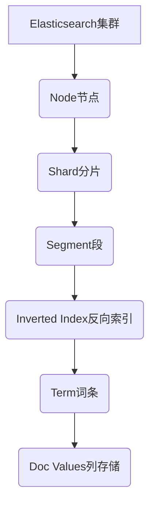

# ES搜索原理与代码实例讲解

## 1. 背景介绍

### 1.1 问题的由来

在当今信息时代，数据的爆炸式增长已成为一个不争的事实。无论是个人还是企业,都面临着如何高效地存储、检索和分析海量数据的挑战。传统的关系型数据库虽然在结构化数据的处理方面表现出色,但在处理非结构化、半结构化数据时却显得力不从心。这就催生了一种新型的数据存储和检索解决方案——全文搜索引擎。

全文搜索引擎(Full-Text Search Engine)是一种专门用于快速搜索大量包含自然语言文档的数据库系统。它能够根据用户输入的查询条件,快速从海量数据中找出相关的文档。与传统的数据库相比,全文搜索引擎具有更强大的文本分析能力,可以对非结构化数据进行分词、去重、归一化等预处理,从而提高搜索的准确性和效率。

### 1.2 研究现状

目前,市面上有多种开源和商业的全文搜索引擎可供选择,如Lucene、Solr、Elasticsearch、Apache Nutch等。其中,Elasticsearch(简称ES)作为一款分布式、RESTful风格的搜索和分析引擎,凭借其易用性、高可扩展性和实时性等优势,在很多领域得到了广泛应用。

Elasticsearch基于Lucene构建,不仅能够为全文搜索提供一个分布式的解决方案,还集成了数据分析和可视化功能,可以用于日志处理、全文搜索、安全智能(如病毒检测)、业务分析等多种场景。越来越多的公司开始将Elasticsearch作为核心数据处理管道的一部分,用于存储和分析来自各种来源的数据。

### 1.3 研究意义

虽然Elasticsearch提供了丰富的API和可视化工具,但要真正掌握其核心原理并高效利用它,仍需要对其内部机制有深入的理解。本文将剖析Elasticsearch的搜索原理,介绍其中的关键概念和算法,并通过实例代码讲解其具体实现,旨在帮助读者从理论和实践两个层面全面把握Elasticsearch,为大家进一步学习和应用这一强大的搜索引擎奠定基础。

### 1.4 本文结构

本文共分为9个部分:

1. 背景介绍
2. 核心概念与联系
3. 核心算法原理与具体操作步骤
4. 数学模型和公式详细讲解与举例说明
5. 项目实践:代码实例和详细解释说明
6. 实际应用场景
7. 工具和资源推荐
8. 总结:未来发展趋势与挑战
9. 附录:常见问题与解答

## 2. 核心概念与联系

在深入探讨Elasticsearch搜索原理之前,我们先来了解一些核心概念,为后续内容的学习打下基础。



### 2.1 Node节点

Elasticsearch本质上是一个分布式系统,允许多台服务器协同工作,共同承担数据的存储和处理。集群中的每个服务器称为一个节点(Node)。

### 2.2 Index索引

Elasticsearch数据管理的逻辑单位是Index(索引),相当于关系型数据库中的Database概念。Index的具体数据存储则由Shard分片构成。

### 2.3 Shard分片

Shard是Index数据的底层存储单元,每个Index默认会分为5个Primary Shard和5个Replica Shard(副本分片,用于容错)。分片不只是数据分块存储,还能提高系统的可扩展性和性能。

### 2.4 Segment段

Shard中的数据实际是存储在一个个小的Segment文件中,并由多个Segment组成。每次数据写入产生一个新的Segment,定期会将多个Segment合并为更大的Segment。

### 2.5 Inverted Index反向索引

Elasticsearch的核心是构建出一个分布式的,面向文档的倒排索引(Inverted Index)。倒排索引是采用一种全文建立索引方式,计算每个单词到文档的映射。

### 2.6 Term词条

Term是指文档中出现的单词,是构建倒排索引的最小单位。Term不仅包括全文本中的单词,还可以是邮箱、URL、数值、日期等结构化数据。

### 2.7 Doc Values列存储

Doc Values是Lucene建立在Fields之上的一种列存储方式,用于提高结构化数据的访问性能。Doc Values会单独存储Field的数据,以支持快速排序和聚合操作。

上述概念相互关联,共同构成了Elasticsearch的数据存储和索引架构。接下来,我们将进一步剖析其中的核心算法原理。

## 3. 核心算法原理与具体操作步骤

### 3.1 算法原理概述

Elasticsearch的搜索原理主要基于Lucene的倒排索引(Inverted Index)和BM25相似度算法。

倒排索引是一种索引技术,可以快速获取包含特定单词的文档列表。它的核心思想是:

1. 将文档集合的所有单词构建一个索引,记录了每个单词在哪些文档中出现。
2. 在搜索时,只需要查找这个索引,就可以快速获取包含查询单词的文档列表。

BM25是一种计算相似度分数的算法,用于根据查询和文档之间的相似程度对结果进行排序。它的公式考虑了多个因素,如词频(Term Frequency)、逆向文档频率(Inverse Document Frequency)等,能够较好地判断文档与查询的相关性。

Elasticsearch在Lucene的基础上,通过分布式架构、分片技术、并行计算等优化,使得搜索性能得到了大幅提升。

### 3.2 算法步骤详解

Elasticsearch执行搜索的主要步骤如下:

```mermaid
graph TD
    A[查询请求] --> B(分词器)
    B --> C(布尔查询)
    C --> D(Term查询)
    D --> E(倒排索引查找)
    E --> F(相关度计算]
    F --> G(结果排序]
    G --> H[搜索结果]
```

1. **查询请求**:用户通过HTTP接口发送查询请求,指定查询语句和搜索条件。

2. **分词器**:对查询语句进行分词,将其拆分为多个Term(词条)。

3. **布尔查询**:根据查询语句构建布尔查询,确定查询的组合逻辑(如AND、OR、NOT等)。

4. **Term查询**:针对每个Term,构建对应的Term查询。

5. **倒排索引查找**:利用倒排索引,快速找出包含这些Term的所有文档。

6. **相关度计算**:对于每个命中的文档,计算其与查询的相关度分数,主要使用BM25算法。

7. **结果排序**:根据相关度分数对结果进行排序。

8. **搜索结果**:返回排序后的搜索结果列表。

接下来,我们通过数学模型和公式,进一步深入探讨BM25相似度算法的原理。

## 4. 数学模型和公式详细讲解与举例说明

### 4.1 数学模型构建

BM25算法的完整公式如下:

$$
\mathrm{score}(D,Q) = \sum_{i=1}^{n} \mathrm{IDF}(q_i) \cdot \frac{f(q_i,D) \cdot (k_1+1)}{f(q_i,D)+k_1\cdot\left(1-b+b\cdot\frac{|D|}{avgdl}\right)}
$$

其中:

- $D$表示文档
- $Q$表示查询,包含$n$个查询词条$q_1, q_2, ..., q_n$
- $f(q_i, D)$表示词条$q_i$在文档$D$中出现的词频(Term Frequency)
- $|D|$表示文档$D$的长度(字数)
- $avgdl$表示文档集合的平均长度
- $k_1$和$b$是两个常量,用于调节词频和文档长度的影响

公式中的$\mathrm{IDF}(q_i)$表示词条$q_i$的逆向文档频率(Inverse Document Frequency),计算方式如下:

$$
\mathrm{IDF}(q_i) = \log\frac{N - n(q_i) + 0.5}{n(q_i) + 0.5}
$$

其中:

- $N$表示文档集合的总文档数
- $n(q_i)$表示包含词条$q_i$的文档数

### 4.2 公式推导过程

BM25公式由以下几个部分组成:

1. **词频(Term Frequency)部分**: $\frac{f(q_i,D)}{f(q_i,D)+k_1\cdot\left(1-b+b\cdot\frac{|D|}{avgdl}\right)}$

   这一部分用于计算词条$q_i$在文档$D$中的词频得分。公式上半部分是词频$f(q_i,D)$,下半部分是一个调节因子,考虑了文档长度的影响。$k_1$和$b$是两个常量,用于控制词频和文档长度的权重。

2. **IDF(Inverse Document Frequency)部分**: $\mathrm{IDF}(q_i)$

   IDF用于体现词条的稀有程度。一个在整个文档集合中很少出现的词条,应当比常见词条的权重更高。IDF的计算公式利用了文档频率的倒数,从而使得稀有词条的IDF值较大。

3. **查询词条组合部分**: $\sum_{i=1}^{n} \mathrm{IDF}(q_i) \cdot \frac{f(q_i,D) \cdot (k_1+1)}{f(q_i,D)+k_1\cdot\left(1-b+b\cdot\frac{|D|}{avgdl}\right)}$

   最终的相似度分数是所有查询词条的分数之和。每个词条的分数是其IDF值与调节后的词频得分的乘积。

通过上述几个部分的相乘相加,BM25算法能够综合考虑词频、逆向文档频率和文档长度等多个因素,较好地判断文档与查询的相关程度。

### 4.3 案例分析与讲解

现在,让我们通过一个具体的例子来理解BM25算法是如何工作的。

假设我们有一个包含5个文档的小型文档集合,其中:

- 文档1: "Hello Lucene, you are awesome!"
- 文档2: "Hello Elasticsearch and Lucene."
- 文档3: "Learn Elasticsearch from Elastic.co"
- 文档4: "Elasticsearch Rocks!"
- 文档5: "Mastering Elasticsearch"

我们的查询是"Lucene Elasticsearch",包含两个词条。

首先,我们计算每个词条的IDF:

- $\mathrm{IDF(Lucene)} = \log\frac{5 - 2 + 0.5}{2 + 0.5} = 0.916$
- $\mathrm{IDF(Elasticsearch)} = \log\frac{5 - 3 + 0.5}{3 + 0.5} = 0.693$

其次,我们计算每个文档对于这两个词条的词频得分:

- 文档1:
  - $\mathrm{score(Lucene)} = \frac{1}{1+0.5\cdot\left(1-0.75+0.75\cdot\frac{6}{5}\right)} = 0.667$
  - $\mathrm{score(Elasticsearch)} = 0$ (该文档不包含"Elasticsearch")
- 文档2:
  - $\mathrm{score(Lucene)} = 0.667$
  - $\mathrm{score(Elasticsearch)} = \frac{1}{1+0.5\cdot\left(1-0.75+0.75\cdot\frac{7}{5}\right)} = 0.636$
- 文档3:
  - $\mathrm{score(Lucene)} = 0$
  - $\mathrm{score(Elasticsearch)} = \frac{1}{1+0.5\cdot\left(1-0.75+0.75\cdot\frac{7}{5}\right)} = 0.636$
- 文档4:
  - $\mathrm{score(Lucene)} = 0$
  - $\mathrm{score(Elasticsearch)} = \frac{1}{1+0.5\cdot\left(1-0.75+0.75\cdot\frac{3}{5}\right)} = 0.750$
- 文档5:
  - $\mathrm{score(Lucene)} = 0$
  - $\mathrm{score