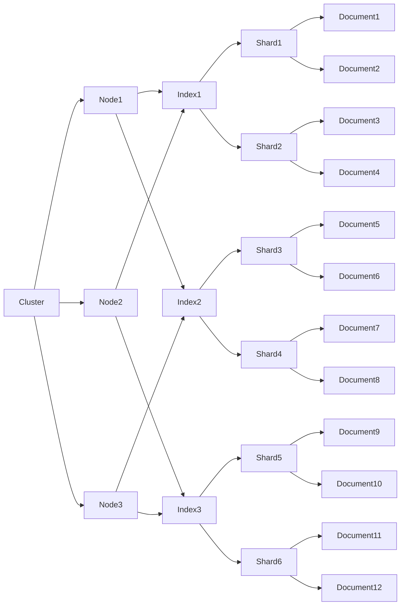

# ElasticSearch原理与代码实例讲解

作者：禅与计算机程序设计艺术 / Zen and the Art of Computer Programming

关键词：ElasticSearch、倒排索引、分布式搜索、Lucene

## 1. 背景介绍

### 1.1 问题的由来
随着互联网的飞速发展,数据量呈现爆炸式增长。如何高效地检索和分析海量数据成为了一个巨大的挑战。传统的关系型数据库已经无法满足实时全文检索和复杂数据分析的需求。

### 1.2 研究现状
目前,主流的全文检索和数据分析工具包括Solr、Sphinx和ElasticSearch等。其中,ElasticSearch凭借其卓越的性能、易用性和可扩展性脱颖而出,成为了最受欢迎的分布式搜索和分析引擎之一。

### 1.3 研究意义
深入研究ElasticSearch的原理和实现,对于优化海量数据的检索和分析性能,构建高可用、高并发的搜索和分析服务具有重要意义。同时,ElasticSearch也为大数据时代的数据挖掘和商业智能提供了强大的技术支撑。

### 1.4 本文结构
本文将从ElasticSearch的核心概念出发,详细阐述其内部原理,包括倒排索引、分布式架构、查询机制等。并通过实际的代码示例,讲解如何使用ElasticSearch进行索引构建、全文检索、聚合分析等操作。最后,探讨ElasticSearch的实际应用场景和未来发展趋势。

## 2. 核心概念与联系

要理解ElasticSearch的工作原理,首先需要了解其几个核心概念:

- 文档(Document):可以被索引的基本数据单元。通常是一个JSON对象,包含多个字段。
- 索引(Index):文档的容器,类似于关系数据库中的database。一个索引包含多个文档,文档的字段可以被索引以加快搜索。
- 节点(Node):运行ElasticSearch实例的单个服务器。可以在同一台机器上运行多个节点。
- 集群(Cluster):一组具有相同cluster.name的节点集合,协同工作,共享数据,提供故障转移和扩展性。
- 分片(Shard):索引可以被拆分为多个分片,分布在集群的各个节点上,从而实现数据的分布式存储和并行处理。

这些概念之间的关系如下图所示:



## 3. 核心算法原理 & 具体操作步骤

### 3.1 算法原理概述
ElasticSearch的核心是建立在Lucene库之上的倒排索引。倒排索引以单词为key,包含该单词的文档列表为value。这种结构可以实现快速的全文搜索。

### 3.2 算法步骤详解
1. 文档分析:将输入的文本文档切分为一系列单词(term),经过标准化处理(如大小写转换、同义词处理等)后得到词条(token)。
2. 词条索引:对每个词条,记录包含该词条的文档ID,词频TF(Term Frequency),位置等信息,建立倒排列表(Posting List)。
3. 倒排文件:将倒排列表写入磁盘,形成倒排文件(Inverted File),包括词典(Term Dictionary)和倒排列表两部分。
4. 查询解析:将用户输入的查询语句进行词法和语法分析,转换为Lucene的内部查询结构。
5. 倒排索引扫描:对查询语句中每个词条,在倒排索引中查找对应的倒排列表。
6. 文档评分:根据词条在文档中的频率、位置等信息,对每个文档进行相关性评分,常用的评分模型有TF-IDF、BM25等。
7. 结果排序:对候选文档按照评分进行排序,返回Top-K个最相关的文档。

### 3.3 算法优缺点

优点:
- 索引结构紧凑,查询速度快。
- 支持复杂的查询语法,如布尔查询、短语查询、模糊查询等。
- 可以对查询结果进行高效的排序和过滤。

缺点:
- 索引文件庞大,占用存储空间。
- 实时索引更新开销大。
- 不适合处理海量的连续数值数据。

### 3.4 算法应用领域
倒排索引广泛应用于全文检索、推荐系统、广告系统等领域。典型的应用有:

- 搜索引擎:如Google、Baidu等,为海量网页建立倒排索引,实现快速的关键词搜索。
- 电商平台:商品信息检索、用户行为分析等。
- 日志分析:ELK技术栈(ElasticSearch+Logstash+Kibana)用于收集、检索、可视化海量日志数据。

## 4. 数学模型和公式 & 详细讲解 & 举例说明

### 4.1 数学模型构建
在ElasticSearch中,文档相关性评分采用了改进的TF-IDF模型,称为BM25。其数学表达式为:

$$
score(q,d) = \sum_{t \in q} w_t \cdot \frac{(k_1+1) tf_{t,d}}{k_1((1-b)+b \cdot \frac{dl}{avgdl}) + tf_{t,d}} \cdot \frac{(k_2+1)qf_t}{k_2+qf_t}
$$

其中:
- $w_t$ 表示词条t的逆文档频率IDF。
- $tf_{t,d}$ 表示词条t在文档d中的词频。
- $qf_t$ 表示词条t在查询中的频率。
- $k_1,b$ 是可调参数,控制词频饱和度和文档长度归一化。
- $dl,avgdl$分别表示文档d的长度和文档平均长度。

### 4.2 公式推导过程
BM25公式可以看作是TF-IDF的一种变体,引入了以下改进:

1. 对TF部分进行饱和归一化,避免TF过大时分值无限增大:

$$
\frac{(k_1+1) tf_{t,d}}{k_1((1-b)+b \cdot \frac{dl}{avgdl}) + tf_{t,d}}
$$

2. 引入查询词频因子,对多次出现的查询词给予更高的权重:

$$
\frac{(k_2+1)qf_t}{k_2+qf_t}
$$

3. 在文档长度归一化时,考虑了文档长度与平均长度的比值,更合理地惩罚过长或过短的文档:

$$
(1-b)+b \cdot \frac{dl}{avgdl}
$$

### 4.3 案例分析与讲解
假设我们有以下3个文档和1个查询:

- d1: "The quick brown fox jumps over the lazy dog"
- d2: "quick fox lazy jumps"
- d3: "brown fox lazy quick dog"
- q: "quick fox"

计算每个文档对查询的BM25分值(取$k_1=1.5, b=0.75, k_2=1.2$):

对于d1:
- "quick"的TF为1,文档长度为9,IDF为0.477
- "fox"的TF为1,IDF为0.176
$$
score(q,d_1) = 0.477*\frac{2.5*1}{1.5*0.811+1} + 0.176*\frac{2.5*1}{1.5*0.811+1} = 0.774
$$

对于d2:
- "quick"的TF为1,文档长度为4,IDF为0.477
- "fox"的TF为1,IDF为0.176
$$
score(q,d_2) = 0.477*\frac{2.5*1}{1.5*0.458+1} + 0.176*\frac{2.5*1}{1.5*0.458+1} = 1.030
$$

对于d3:
- "quick"的TF为1,文档长度为5,IDF为0.477
- "fox"的TF为1,IDF为0.176
$$
score(q,d_3) = 0.477*\frac{2.5*1}{1.5*0.583+1} + 0.176*\frac{2.5*1}{1.5*0.583+1} = 0.928
$$

因此,最终的相关性排序为:d2 > d3 > d1。可以看出,BM25对查询词出现频率高、文档长度适中的文档给予了较高的分值。

### 4.4 常见问题解答
1. 为什么要对TF进行饱和归一化?
答:当一个词条在文档中出现频率很高时,其对相关性的贡献会趋于一个上限,继续增大TF并不会带来分值的显著提升。饱和归一化可以模拟这一特性,避免分值过大。

2. BM25的参数k1和b如何调节?
答:k1控制TF的饱和程度,k1越大,饱和越慢;b控制文档长度归一化的强度,b越大,惩罚越强。一般取值范围是:k1∈[1.2,2.0],b∈[0.5,0.8]。可以通过交叉验证等方法在特定数据集上进行调参。

3. ElasticSearch中除了BM25,还有哪些相关性算法?
答:ElasticSearch还支持其他一些相关性算法,如Dirichlet LM、DFR等。可以通过similarity参数进行配置。但BM25是最常用的默认算法。

## 5. 项目实践：代码实例和详细解释说明

### 5.1 开发环境搭建
首先需要安装并运行ElasticSearch,可以从官网下载二进制包,解压后运行:

```bash
$ wget https://artifacts.elastic.co/downloads/elasticsearch/elasticsearch-7.12.0-linux-x86_64.tar.gz
$ tar -xzf elasticsearch-7.12.0-linux-x86_64.tar.gz
$ cd elasticsearch-7.12.0/bin
$ ./elasticsearch
```

然后安装Python客户端库elasticsearch:

```bash
$ pip install elasticsearch
```

### 5.2 源代码详细实现
下面用Python代码演示ElasticSearch的常见操作:

```python
from elasticsearch import Elasticsearch

# 连接ES
es = Elasticsearch()

# 创建索引
index_name = "my_index"
if not es.indices.exists(index=index_name):
    es.indices.create(index=index_name)

# 插入文档
doc1 = {"title":"ElasticSearch原理","author":"John","content":"ElasticSearch是一个基于Lucene的搜索服务器。它提供了一个分布式多用户能力的全文搜索引擎。"}
doc2 = {"title":"Python入门","author":"Mary","content":"Python是一种解释型、面向对象、动态数据类型的高级程序设计语言。"}
es.index(index=index_name, id=1, body=doc1)
es.index(index=index_name, id=2, body=doc2)

# 查询文档
query = {
    "query": {
        "match": {
            "content": "搜索"
        }
    }
}
result = es.search(index=index_name, body=query)
print(result)

# 聚合分析
aggs = {
    "aggs": {
        "author_count": {
            "terms": {
                "field": "author.keyword",
                "size": 10
            }
        }
    }
}
result = es.search(index=index_name, body=aggs)
print(result)

# 删除文档
es.delete(index=index_name, id=1)

# 删除索引
es.indices.delete(index=index_name)
```

### 5.3 代码解读与分析
1. 首先连接到ElasticSearch服务器,默认为本地9200端口。
2. 检查索引是否存在,不存在则创建。
3. 定义两个文档,用es.index方法插入索引,指定id。
4. 定义match查询,搜索content字段中包含"搜索"的文档,用es.search方法执行。
5. 定义terms聚合,统计author字段的取值及其文档数,用es.search方法执行。
6. 用es.delete方法根据id删除文档。
7. 用es.indices.delete方法删除整个索引。

可以看出,Elastic