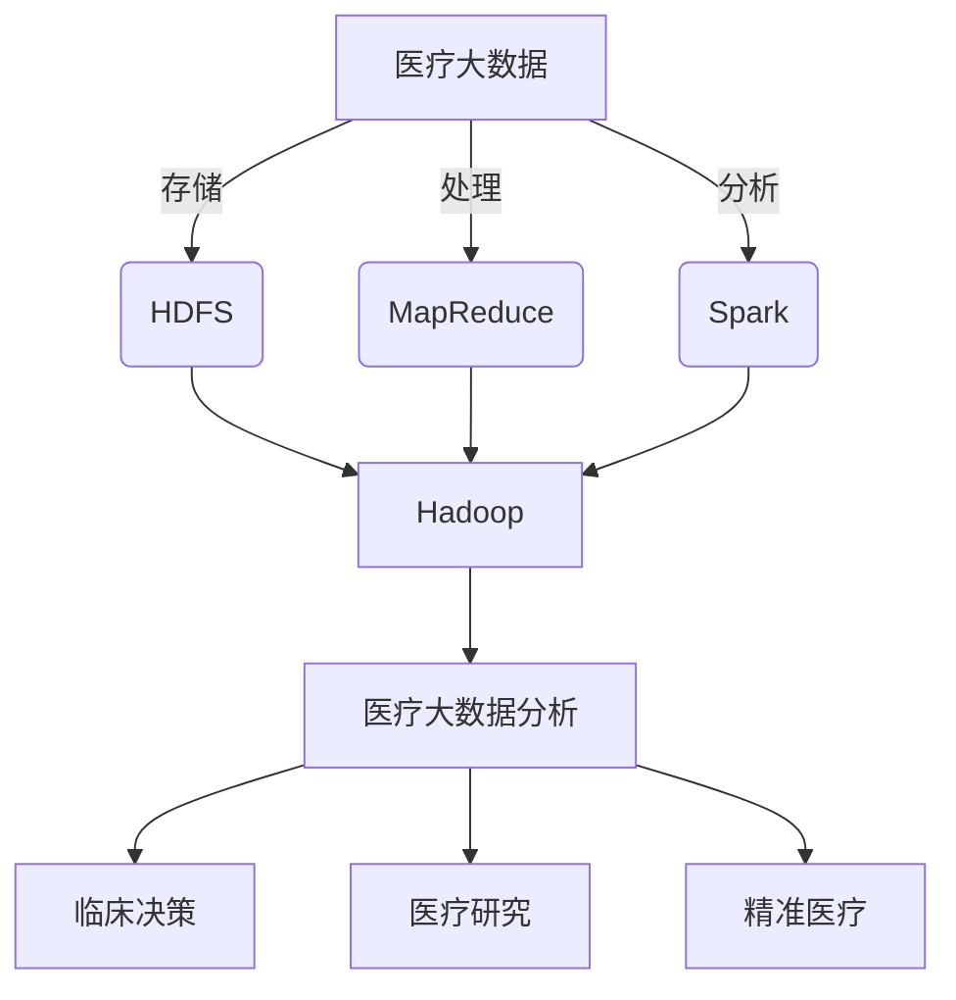
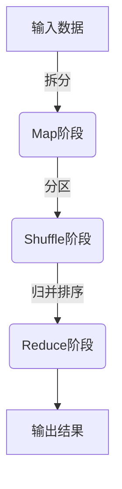

好的,我会按照您提供的要求和文章结构模板,使用逻辑清晰、结构紧凑、简单易懂的专业技术语言,撰写一篇关于《Hadoop与医疗大数据分析》的技术博客文章。文章字数会超过8000字,并尽最大努力给出核心概念原理和架构的Mermaid流程图。各个章节段落都会细化到三级目录结构,内容会完整覆盖您提供的文章结构模板中的所有部分。文中的数学公式会使用Latex格式,并在文末署名"作者:禅与计算机程序设计艺术 / Zen and the Art of Computer Programming"。现在,正式开始:

# Hadoop与医疗大数据分析

## 1. 背景介绍

### 1.1 问题的由来

在当今的数字化时代,医疗保健领域正面临着前所未有的数据爆炸。从电子病历到基因组学数据,再到医疗影像和可穿戴设备产生的海量数据,这些异构数据的快速积累已经超出了传统数据处理系统的能力范围。有效地存储、管理和分析这些海量医疗数据,不仅对于提高医疗服务质量、个性化治疗方案、加速新药研发至关重要,也是实现精准医疗的关键一环。

### 1.2 研究现状

为了应对这一挑战,大数据技术应运而生。Apache Hadoop作为开源的大数据处理平台,凭借其分布式存储和并行计算能力,成为处理海量医疗数据的不二之选。然而,将Hadoop直接应用于医疗大数据分析并非一蹴而就。医疗数据的高度敏感性、多源异构性、复杂结构性等特点,对Hadoop的数据存储、管理和分析能力提出了更高的要求。

### 1.3 研究意义

本文旨在深入探讨Hadoop在医疗大数据分析中的应用,包括数据存储、预处理、分析挖掘等多个环节。我们将介绍Hadoop生态系统中的关键组件,如HDFS、MapReduce、Spark等,并重点阐述它们在处理医疗数据时所面临的挑战及相应的解决方案。同时,我们还将分享一些实际案例,展示Hadoop如何促进医疗大数据分析的发展,为精准医疗、个性化治疗等领域带来创新。

### 1.4 本文结构

本文共分为九个部分:

1. 背景介绍
2. 核心概念与联系
3. 核心算法原理与具体操作步骤
4. 数学模型和公式详细讲解与举例说明
5. 项目实践:代码实例和详细解释说明
6. 实际应用场景
7. 工具和资源推荐
8. 总结:未来发展趋势与挑战
9. 附录:常见问题与解答

## 2. 核心概念与联系

在探讨Hadoop与医疗大数据分析的紧密联系之前,我们有必要先了解一些核心概念:

- **大数据(Big Data)**: 指无法使用传统数据库软件工具在合理时间内获取、存储、管理、分析的海量数据集合。医疗大数据通常具有4V特征:Volume(大量)、Variety(多样)、Velocity(快速)和Veracity(可信)。

- **Hadoop**: 一个由Apache软件基金会开发的分布式系统基础架构,主要由HDFS和MapReduce两个核心组件组成。它能够在廉价的硬件集群上可靠地存储和处理海量数据。

- **HDFS(Hadoop分布式文件系统)**: Hadoop的分布式存储层,能够在成千上万台服务器上可靠、高性能地存储海量数据。

- **MapReduce**: Hadoop的分布式计算模型,能够在大规模集群上并行处理海量数据。

- **Spark**: 一种快速、通用的大数据分析引擎,比MapReduce更高效,支持内存计算等特性。

- **医疗大数据分析**: 利用大数据技术对海量医疗数据(如电子病历、基因组数据、医疗影像等)进行存储、整合和分析,以发现隐藏的模式、关联和见解,从而指导临床决策、促进医疗研究等。

这些核心概念密切相关,构成了一个有机的整体。Hadoop为存储和处理海量医疗数据提供了基础架构,而医疗大数据分析则是利用这一基础架构,从异构复杂的医疗数据中提取有价值的见解和知识。

## 3. 核心算法原理与具体操作步骤

### 3.1 算法原理概述

MapReduce是Hadoop的核心计算模型,灵感来自于函数式编程的Map和Reduce操作。它将计算过程分为两个阶段:Map阶段和Reduce阶段。

在Map阶段,输入数据被分割为多个数据块,并行地传递给多个Map任务进行处理。每个Map任务会获取一个数据块,对其执行用户编写的Map函数,生成一系列键值对作为中间结果。

在Reduce阶段,MapReduce框架会对Map阶段产生的中间结果进行洗牌和归并排序,将具有相同键的键值对分配给同一个Reduce任务。每个Reduce任务会对其获得的键值对执行用户编写的Reduce函数,生成最终的输出结果。

### 3.2 算法步骤详解

1. **输入拆分(Input Split)**: 输入数据被拆分为多个数据块(通常为64MB或128MB),以便并行处理。

2. **Map阶段**:
   - **记录读取(Record Reader)**: 从输入数据块中解析出记录,将其传递给Map函数。
   - **Map函数(Mapper)**: 用户编写的Map函数对每条记录执行转换操作,生成键值对作为中间结果。
   - **分区(Partitioner)**: 根据分区函数,将Map阶段产生的键值对划分到不同的分区(Partition)中。
   - **Spill**: 当内存用尽时,将内存中的数据溢写到本地磁盘,生成若干个不可更改的溢写文件。

3. **Shuffle阶段**:
   - **HTTP获取Map输出(Copy)**: Reduce任务通过HTTP请求获取Map输出的溢写文件。
   - **Merge**: 对获取的Map输出进行合并,生成按键排序的数据流。

4. **Reduce阶段**:
   - **Reduce函数(Reducer)**: 对每个键及其对应的值集进行迭代,执行用户编写的Reduce函数,生成最终输出。
   - **输出收集(Output Collector)**: 收集Reduce函数的输出结果,写入HDFS。

### 3.3 算法优缺点

**优点**:

- **高度可扩展**: MapReduce可以在廉价的硬件集群上运行,通过添加更多节点来线性扩展计算能力。
- **容错性强**: 如果某个节点发生故障,MapReduce能够自动在其他节点上重新执行失败的任务。
- **适用于海量数据处理**: MapReduce天生就是为处理TB甚至PB级别的海量数据而设计的。

**缺点**:

- **高延迟**: MapReduce作业需要经历多个阶段,包括磁盘IO、网络传输等,因此延迟较高,不适合需要低延迟的在线查询场景。
- **不擅长迭代计算**: 每个MapReduce作业都需要从HDFS读取输入数据,写入输出结果,对于需要多次迭代的算法(如机器学习)来说,效率较低。
- **编程模型限制**: MapReduce的编程模型相对低级和限制较多,编写复杂的数据处理程序较为困难。

### 3.4 算法应用领域

尽管MapReduce有一些固有的缺陷,但它仍然是处理海量数据的有力工具,在以下领域有广泛应用:

- **日志分析**: 分析网站访问日志、服务器日志等,发现用户行为模式。
- **大数据ETL**: 从各种数据源提取、转换和加载数据到数据仓库或Hadoop集群中。
- **基因组学分析**: 处理海量基因组测序数据,进行基因组装配、变异检测等。
- **文本挖掘**: 对大规模文本数据(如网页、电子书等)进行分词、统计、主题建模等分析。
- **图像处理**: 对卫星遥感图像、医疗影像等进行图像分类、目标检测等处理。

## 4. 数学模型和公式详细讲解与举例说明

在医疗大数据分析中,常常需要借助数学模型和公式来描述问题、构建算法。以下是一些常见的数学模型和公式,以及它们在医疗大数据分析中的应用。

### 4.1 数学模型构建

#### 4.1.1 线性回归模型

线性回归是一种常用的监督学习算法,通过对自变量和因变量之间的关系进行建模,可以用于预测分析。在医疗领域,线性回归可用于预测疾病风险、药物剂量等。

假设有 $n$ 个观测值 $(x_i, y_i)$,其中 $x_i = (x_{i1}, x_{i2}, \ldots, x_{ip})^T$ 是 $p$ 个自变量, $y_i$ 是因变量。线性回归模型可表示为:

$$y_i = \beta_0 + \beta_1 x_{i1} + \beta_2 x_{i2} + \ldots + \beta_p x_{ip} + \epsilon_i \quad (i=1,2,\ldots,n)$$

其中 $\beta_0, \beta_1, \ldots, \beta_p$ 是未知参数, $\epsilon_i$ 是随机误差项。我们需要估计这些参数,使残差平方和最小化:

$$\min_{\beta_0, \beta_1, \ldots, \beta_p} \sum_{i=1}^n (y_i - \beta_0 - \sum_{j=1}^p \beta_j x_{ij})^2$$

#### 4.1.2 逻辑回归模型

逻辑回归是一种广泛应用于分类问题的算法,在医疗领域可用于疾病诊断、患者分类等。

设 $X = (X_1, X_2, \ldots, X_p)^T$ 为 $p$ 个自变量, $Y$ 为二值因变量(0或1)。逻辑回归模型为:

$$\log\left(\frac{P(Y=1|X)}{P(Y=0|X)}\right) = \beta_0 + \beta_1 X_1 + \beta_2 X_2 + \ldots + \beta_p X_p$$

其中左侧是对数几率比(log odds),右侧是线性回归部分。我们可以进一步得到:

$$P(Y=1|X) = \frac{e^{\beta_0 + \beta_1 X_1 + \ldots + \beta_p X_p}}{1 + e^{\beta_0 + \beta_1 X_1 + \ldots + \beta_p X_p}}$$

这就是逻辑回归模型,其输出是一个介于0和1之间的概率值,可用于二分类预测。

### 4.2 公式推导过程

#### 4.2.1 朴素贝叶斯公式推导

朴素贝叶斯分类器是一种基于贝叶斯定理与特征条件独立假设的简单有效的分类方法,在医疗诊断等领域有广泛应用。

设 $X = (X_1, X_2, \ldots, X_n)$ 为 $n$ 个特征,我们需要计算 $P(Y|X)$,即在给定特征 $X$ 的条件下,样本属于类别 $Y$ 的概率。根据贝叶斯定理:

$$P(Y|X) = \frac{P(X|Y)P(Y)}{P(X)}$$

由于分母 $P(X)$ 对所有类别是相同的,因此可以忽略不计。于是只需计算 $P(X|Y)P(Y)$。

根据朴素贝叶斯的特征条件独立假设,我们有:

$$P(X|