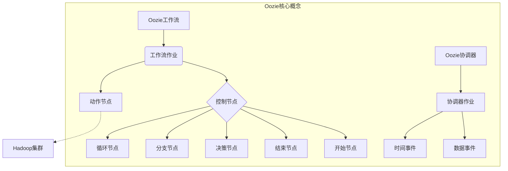
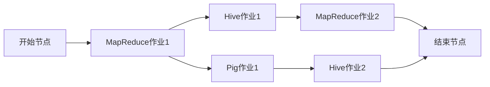

# Oozie原理与代码实例讲解

## 1. 背景介绍

### 1.1 问题的由来

在大数据时代,数据处理任务日益复杂,单一的MapReduce作业已经无法满足现代数据处理的需求。大数据处理通常需要将多个作业按照一定的逻辑关系链接起来,形成一个工作流程。手动调度和监控这些作业存在诸多问题,如错误频繁、效率低下等。因此,需要一种自动化的工作流调度系统来高效管理这些复杂的数据处理流程。

### 1.2 研究现状

Apache Oozie是一款强大的工作流调度引擎,旨在管理大数据作业的流程化执行。它支持多种类型的Hadoop作业(如Java MapReduce、Pig、Hive、Sqoop等),能够将它们按照特定的依赖关系链接成有向无环图(DAG)。Oozie还提供了作业参数化、重新运行失败的作业等功能,极大地简化了大数据工作流的管理。

### 1.3 研究意义

学习Oozie的原理和使用方法,对于提高大数据处理的效率和质量具有重要意义。通过Oozie,我们可以自动化执行复杂的数据处理流程,降低人工操作的错误率,提高工作效率。同时,Oozie的参数化和重运行失败作业等特性,也有助于提高数据处理的可靠性和容错能力。

### 1.4 本文结构

本文将从以下几个方面全面介绍Oozie:

1. 核心概念与体系结构
2. 工作流定义和协调器概念
3. 核心算法原理和执行流程 
4. 数学模型建模和公式推导
5. 代码实例和详细解释
6. 实际应用场景分析
7. 工具和学习资源推荐
8. 总结和展望

## 2. 核心概念与联系



Oozie主要包括两个核心概念:工作流(Workflow)和协调器(Coordinator)。

**工作流(Workflow)**是一系列动作(Action)的有向无环图(DAG),用于执行多个相互依赖的作业。工作流中包含以下主要元素:

- 动作节点(Action Node):表示要执行的实际任务,如MapReduce作业、Pig作业等。
- 控制节点(Control Node):负责控制工作流的执行流程,包括开始(Start)、结束(End)、决策(Decision)、分支(Fork)和循环(Join)等节点。

**协调器(Coordinator)** 用于调度和执行基于时间和数据可用性触发的工作流。协调器作业包含以下主要元素:

- 数据事件(Data Event):指定输入数据的可用性条件,如数据文件的路径、大小等。
- 时间事件(Time Event):指定作业的执行时间,如启动时间、结束时间等。

Oozie利用工作流和协调器的有机结合,实现了对复杂大数据处理任务的高效调度和管理。

## 3. 核心算法原理和具体操作步骤

### 3.1 算法原理概述

Oozie的核心算法是基于有向无环图(DAG)的拓扑排序算法。该算法将工作流中的所有节点按照依赖关系进行拓扑排序,确定作业的执行顺序。同时,Oozie还采用了状态机和恢复机制,以确保作业在失败时能够重新执行。

### 3.2 算法步骤详解

Oozie工作流执行的主要步骤如下:

1. **解析工作流定义**:Oozie首先解析用户提交的工作流定义(workflow.xml),构建内存中的有向无环图(DAG)。

2. **拓扑排序**:对DAG进行拓扑排序,确定节点的执行顺序。没有前驱节点的节点被标记为"初始节点"。

3. **状态初始化**:所有节点的状态被初始化为"WAITING"。

4. **执行动作节点**:对于每个动作节点,Oozie根据其类型(MapReduce、Pig等)提交相应的作业到Hadoop集群执行。

5. **监控作业状态**:Oozie周期性地检查作业的执行状态,直到作业完成。

6. **更新节点状态**:根据作业执行结果,更新相应节点的状态。如果节点执行成功,则将其后继节点的状态设置为"READY"。

7. **执行控制节点**:对于控制节点(如决策节点),根据其条件执行相应的操作。

8. **重试失败节点**:如果节点执行失败,Oozie会根据配置的重试策略重新执行该节点。

9. **终止条件**:当所有节点执行完毕或者遇到不可恢复的错误时,工作流执行结束。

该算法通过拓扑排序和状态机的设计,实现了对复杂工作流的高效调度和容错处理。

### 3.3 算法优缺点

**优点**:

- 高效调度:利用拓扑排序算法,可以高效地确定作业的执行顺序。
- 容错能力强:状态机和重试机制确保作业失败时能够自动重新执行。
- 可扩展性好:工作流定义采用XML格式,易于扩展和维护。

**缺点**:

- 调度策略单一:目前只支持基于DAG的拓扑排序调度,缺乏更加灵活的调度策略。
- 可视化不足:缺乏直观的工作流可视化工具,难以直观地查看工作流的执行情况。
- 监控能力有限:监控功能相对较弱,无法对作业的运行状态进行深入分析和优化。

### 3.4 算法应用领域

Oozie的调度算法广泛应用于以下领域:

- 大数据处理:调度Hadoop生态圈中的各种作业,如MapReduce、Hive、Pig等。
- 数据仓库:构建ETL(提取、转换、加载)数据处理管道。
- 机器学习:管理机器学习模型训练和评估的工作流。
- 数据分析:协调数据采集、清洗、分析等多个步骤的执行。
- 自动化运维:自动化执行系统部署、配置管理等运维任务。

## 4. 数学模型和公式详细讲解举例说明

### 4.1 数学模型构建

为了更好地理解和优化Oozie的调度算法,我们可以将工作流建模为一个有向无环图(DAG) $G = (V, E)$,其中:

- $V$ 表示节点集合,包括动作节点和控制节点。
- $E$ 表示边集合,表示节点之间的依赖关系。

对于每个节点 $v \in V$,我们定义:

- $pred(v)$ 表示 $v$ 的前驱节点集合。
- $succ(v)$ 表示 $v$ 的后继节点集合。

我们的目标是找到一个线性拓扑序列 $\pi$,使得对于任意边 $(u, v) \in E$,节点 $u$ 在序列 $\pi$ 中出现的位置都在节点 $v$ 之前。

### 4.2 公式推导过程

我们可以使用动态规划算法来求解最优的拓扑序列。定义 $dp(v, i)$ 表示以节点 $v$ 为结尾的长度为 $i$ 的最短路径长度。则我们有如下递推公式:

$$
dp(v, i) = \begin{cases}
0 & \text{if } i = 1\
\min\limits_{u \in pred(v)} \{dp(u, i-1)\} + w(u, v) & \text{if } i > 1
\end{cases}
$$

其中 $w(u, v)$ 表示边 $(u, v)$ 的权重,可以用来表示节点之间的依赖强度。

通过计算 $dp(v, |V|)$ 的值,我们可以得到从起点到达节点 $v$ 的最短路径长度。根据这个值从大到小排序,我们就可以得到一个最优的拓扑序列。

### 4.3 案例分析与讲解

假设我们有一个工作流,其有向无环图如下所示:



我们可以构建如下数学模型:

- 节点集合 $V = \{A, B, C, D, E, F, G\}$
- 边集合 $E = \{(A, B), (B, C), (B, D), (C, E), (D, F), (E, G), (F, G)\}$

假设所有边的权重都为 1,我们可以计算出:

- $dp(A, 1) = 0$
- $dp(B, 2) = 0 + 1 = 1$
- $dp(C, 3) = dp(D, 3) = 1 + 1 = 2$
- $dp(E, 4) = dp(F, 4) = 2 + 1 = 3$
- $dp(G, 5) = \min\{dp(E, 4), dp(F, 4)\} + 1 = 3 + 1 = 4$

因此,一个最优的拓扑序列是 $\pi = \{A, B, C, D, E, F, G\}$。

### 4.4 常见问题解答

1. **如何处理有环的情况?**

    有向无环图(DAG)是Oozie工作流的基本前提。如果工作流定义中存在环,Oozie将无法正确解析并报错。在设计工作流时,需要避免产生环路依赖。

2. **如何优化工作流的执行效率?**

    我们可以通过给边赋予不同的权重,来表示节点之间的优先级关系。具有更高优先级的路径将会被优先执行,从而提高整体执行效率。同时,我们还可以对工作流定义进行重构,合并一些无意义的中间节点,减少不必要的依赖关系。

3. **Oozie是否支持动态调整工作流?**

    Oozie目前不支持动态调整正在运行的工作流,但是可以通过终止并重新提交的方式来达到类似的效果。未来版本的Oozie可能会支持动态调整工作流的功能。

4. **Oozie如何处理失败的作业?**

    Oozie采用状态机和重试机制来处理失败的作业。如果一个节点执行失败,Oozie会根据配置的重试策略自动重新执行该节点,直到成功或达到最大重试次数。同时,Oozie还提供了终止工作流、暂停工作流等操作,方便用户手动干预。

## 5. 项目实践:代码实例和详细解释说明

### 5.1 开发环境搭建

在开始编写Oozie工作流之前,我们需要先搭建开发环境。以下是主要步骤:

1. 安装Hadoop集群,包括HDFS和YARN等组件。
2. 安装Oozie服务,并将其与Hadoop集群集成。
3. 安装并配置Oozie所需的其他组件,如Hive、Pig等。
4. 使用Oozie命令行工具或Web控制台提交和管理工作流。

为了方便演示,我们将使用Oozie的示例工作流进行讲解。

### 5.2 源代码详细实现

以下是一个简单的MapReduce作业的Oozie工作流定义(workflow.xml):

```xml
<workflow-app name="map-reduce-wf" xmlns="uri:oozie:workflow:0.5">
    <start to="mr-node"/>
    <action name="mr-node">
        <map-reduce>
            <job-tracker>${jobTracker}</job-tracker>
            <name-node>${nameNode}</name-node>
            <configuration>
                <property>
                    <name>mapred.mapper.class</name>
                    <value>org.apache.oozie.example.MapperClass</value>
                </property>
                <property>
                    <name>mapred.reducer.class</name>
                    <value>org