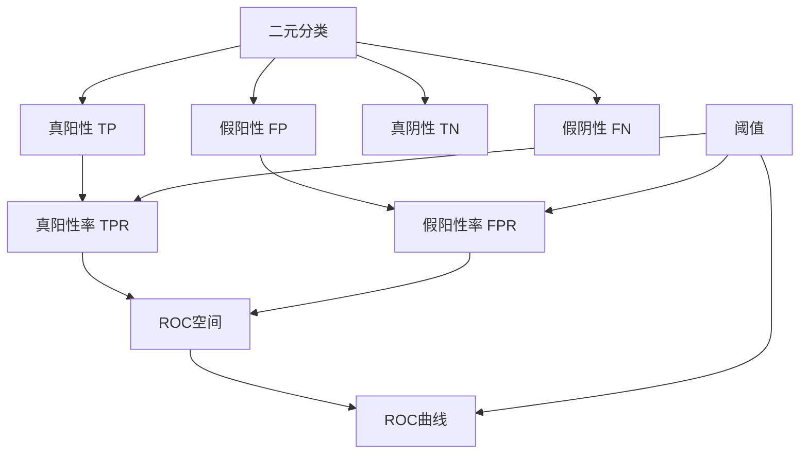

# ROC曲线原理与代码实例讲解

## 1. 背景介绍

### 1.1 问题的由来

在机器学习和数据挖掘领域中,评估分类模型的性能是一个关键任务。分类模型的目标是根据输入数据的特征,将其归类到正确的类别中。然而,分类器的预测结果往往存在一定的误差,因此需要一种有效的方法来衡量模型的分类质量。这就引出了受试者工作特征(Receiver Operating Characteristic,ROC)曲线的概念。

ROC曲线是一种常用的评估二元分类模型性能的图形工具。它通过绘制真阳性率(True Positive Rate,TPR)与假阳性率(False Positive Rate,FPR)的关系曲线,直观地反映了分类器在不同阈值下的判别能力。ROC曲线广泛应用于机器学习、医学诊断、信号检测等领域,帮助研究人员选择合适的分类器并优化模型参数。

### 1.2 研究现状

ROC曲线的概念最早源于第二次世界大战期间,用于评估雷达接收机检测目标的能力。随后,在20世纪60年代,ROC曲线开始在心理学领域得到应用,用于分析人类在识别刺激时的判断能力。直到20世纪80年代,ROC曲线才被引入机器学习和数据挖掘领域,成为评估分类模型性能的标准工具之一。

近年来,随着机器学习和人工智能技术的快速发展,ROC曲线的应用范围不断扩大。它不仅被用于评估二元分类模型,还被推广到多类别分类问题。此外,ROC曲线也被应用于异常检测、排序学习等领域。研究人员还提出了多种改进的ROC曲线变体,如PR曲线(Precision-Recall Curve)、代价曲线(Cost Curve)等,以满足不同应用场景的需求。

### 1.3 研究意义

ROC曲线在机器学习和数据挖掘领域具有重要的理论和实践意义:

1. **模型评估和选择**: ROC曲线提供了一种直观和量化的方式来评估分类模型的性能,有助于选择最优模型。
2. **阈值优化**: ROC曲线可以帮助确定分类器的最佳阈值,以实现期望的真阳性率和假阳性率的平衡。
3. **可解释性**: ROC曲线反映了模型在不同决策阈值下的判别能力,有助于理解模型的行为和特性。
4. **领域应用**: ROC曲线在医学诊断、信号检测、金融风险评估等领域具有广泛的应用,帮助专家做出更准确的决策。

通过深入探讨ROC曲线的原理和实现方法,我们可以更好地理解和应用这一重要的评估工具,从而提高机器学习模型的性能和可靠性。

### 1.4 本文结构

本文将全面介绍ROC曲线的理论基础、计算方法、代码实现和实际应用。文章的主要结构如下:

1. 背景介绍
2. 核心概念与联系
3. 核心算法原理与具体操作步骤
4. 数学模型和公式详细讲解与举例说明
5. 项目实践:代码实例和详细解释说明
6. 实际应用场景
7. 工具和资源推荐
8. 总结:未来发展趋势与挑战
9. 附录:常见问题与解答

通过全面的理论讲解和实践指导,读者将能够深入理解ROC曲线的原理,掌握其计算和绘制方法,并将其应用于实际的机器学习项目中。

## 2. 核心概念与联系

在深入探讨ROC曲线的原理和实现之前,我们需要先了解一些核心概念和它们之间的联系。这些概念包括:

1. **二元分类**(Binary Classification): 将样本划分为两个互斥的类别,如正例(Positive)和负例(Negative)。ROC曲线主要用于评估二元分类模型的性能。

2. **真阳性**(True Positive,TP): 将正例正确分类为正例的情况。

3. **假阳性**(False Positive,FP): 将负例错误分类为正例的情况。

4. **真阴性**(True Negative,TN): 将负例正确分类为负例的情况。

5. **假阴性**(False Negative,FN): 将正例错误分类为负例的情况。

6. **真阳性率**(True Positive Rate,TPR)或**灵敏度**(Sensitivity): 正确预测为正例的比例,计算公式为TP/(TP+FN)。

7. **假阳性率**(False Positive Rate,FPR): 错误预测为正例的比例,计算公式为FP/(FP+TN)。

8. **阈值**(Threshold): 分类器将样本划分为正例或负例的决策边界。通过调整阈值,可以控制TPR和FPR的取值。

9. **ROC空间**(ROC Space): 以FPR为横坐标,TPR为纵坐标构成的二维平面,ROC曲线就绘制在这个空间中。

10. **ROC曲线**(Receiver Operating Characteristic Curve): 在ROC空间中,以不同阈值下的(FPR,TPR)点连接而成的曲线。

这些概念之间存在着密切的联系,理解它们对于掌握ROC曲线的原理和应用至关重要。下一节将详细介绍ROC曲线的核心算法原理和具体操作步骤。

## 3. 核心算法原理与具体操作步骤

### 3.1 算法原理概述

ROC曲线的核心思想是通过改变分类器的阈值,计算不同阈值下的TPR和FPR,并在ROC空间中绘制出(FPR,TPR)点,最终连接这些点形成ROC曲线。

具体来说,算法的步骤如下:

1. 对于二元分类问题,计算每个样本被分类器预测为正例的概率得分(Score)。
2. 对概率得分进行降序排列,并依次将每个样本的得分作为阈值,计算对应的TPR和FPR。
3. 在ROC空间中绘制(FPR,TPR)点,并将这些点按FPR的升序连接起来,形成ROC曲线。

理想情况下,ROC曲线应该尽可能靠近左上角的(0,1)点,这表示分类器能够完美地将正例和负例分开。相反,如果ROC曲线接近对角线,则说明分类器的性能不佳。

### 3.2 算法步骤详解

下面我们将详细解释ROC曲线的计算步骤:

1. **计算概率得分**

   对于每个样本,分类器会输出一个概率得分(Score),表示该样本被预测为正例的可能性。得分范围通常在[0,1]之间,得分越高,被预测为正例的可能性就越大。

2. **对概率得分排序**

   将所有样本的概率得分按降序排列,得到一个排序后的得分列表。

3. **计算TPR和FPR**

   从排序后的得分列表中,依次选取每个得分作为阈值,计算对应的TPR和FPR:

   - 真阳性(TP): 得分大于等于阈值的正例样本数量。
   - 假阳性(FP): 得分大于等于阈值的负例样本数量。
   - 真阴性(TN): 得分小于阈值的负例样本数量。
   - 假阴性(FN): 得分小于阈值的正例样本数量。
   - TPR = TP / (TP + FN)
   - FPR = FP / (FP + TN)

4. **绘制ROC曲线**

   在ROC空间中,以FPR为横坐标,TPR为纵坐标,绘制每个(FPR,TPR)点。然后按FPR的升序将这些点连接起来,形成ROC曲线。

需要注意的是,在实际计算中,我们通常会添加两个特殊点:(0,0)和(1,1),分别表示将所有样本预测为负例和正例时的情况。这样可以使ROC曲线在ROC空间中形成一条闭合曲线。

### 3.3 算法优缺点

ROC曲线算法具有以下优点:

1. **直观性**: ROC曲线提供了一种直观的方式来评估分类器的性能,易于理解和解释。
2. **阈值无关**: ROC曲线不依赖于任何特定的阈值,而是反映了分类器在所有可能阈值下的性能。
3. **类别不平衡**: 即使在类别分布不平衡的情况下,ROC曲线也能够很好地评估分类器的性能。

然而,ROC曲线算法也存在一些缺点:

1. **评估指标单一**: ROC曲线只考虑了TPR和FPR,没有涵盖其他评估指标,如精确率(Precision)和召回率(Recall)。
2. **计算开销**: 当样本数量很大时,计算ROC曲线的时间开销可能会较高。
3. **多类别问题**: ROC曲线主要适用于二元分类问题,对于多类别分类问题,需要进行一定的扩展和修改。

### 3.4 算法应用领域

ROC曲线算法广泛应用于以下领域:

1. **机器学习和数据挖掘**: 评估分类模型的性能,选择合适的模型和参数。
2. **医学诊断**: 评估诊断测试的准确性,如癌症筛查、疾病预测等。
3. **信号检测**: 评估信号检测系统的性能,如雷达、声纳等。
4. **金融风险评估**: 评估信用风险模型的性能,如贷款违约预测。
5. **自然语言处理**: 评估文本分类、情感分析等任务的性能。
6. **计算机视觉**: 评估目标检测、图像分类等任务的性能。

总的来说,ROC曲线算法为各种领域的分类问题提供了一种有效的评估和优化工具。

## 4. 数学模型和公式详细讲解与举例说明

### 4.1 数学模型构建

为了更好地理解ROC曲线的原理,我们需要构建一个数学模型来描述它。首先,我们定义一个二元分类问题,其中样本集合为$\mathcal{D} = \{(x_i, y_i)\}_{i=1}^{N}$,其中$x_i$表示样本的特征向量,而$y_i \in \{0, 1\}$表示样本的标签(0表示负例,1表示正例)。

我们假设有一个分类器$f(x)$,它可以为每个样本$x$输出一个概率得分$s = f(x) \in [0, 1]$,表示该样本被预测为正例的可能性。通过设置不同的阈值$t \in [0, 1]$,我们可以将样本划分为正例和负例:

$$
\hat{y} = \begin{cases}
1, & \text{if } s \geq t \
0, & \text{if } s < t
\end{cases}
$$

其中,$\hat{y}$表示预测的标签。

对于每个阈值$t$,我们可以计算真阳性率TPR(t)和假阳性率FPR(t):

$$
\begin{aligned}
\text{TPR}(t) &= \frac{\sum_{i=1}^{N} \mathbb{1}(s_i \geq t, y_i = 1)}{\sum_{i=1}^{N} \mathbb{1}(y_i = 1)} \
\text{FPR}(t) &= \frac{\sum_{i=1}^{N} \mathbb{1}(s_i \geq t, y_i = 0)}{\sum_{i=1}^{N} \mathbb{1}(y_i = 0)}
\end{aligned}
$$

其中,$\mathbb{1}(\cdot)$是指示函数,当条件成立时取值为1,否则为0。

ROC曲线就是在ROC空间中绘制(FPR(t),TPR(t))点,并将这些点按FPR的升序连接而成的曲线。

### 4.2 公式推导过程

接下来,我们将