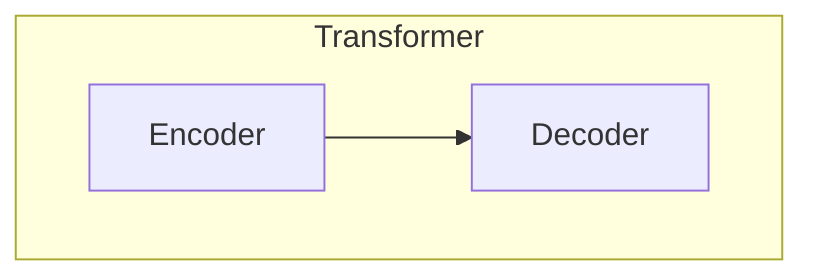
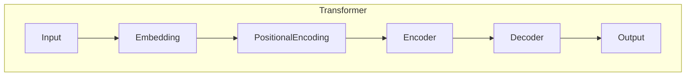
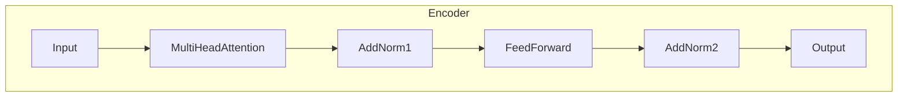
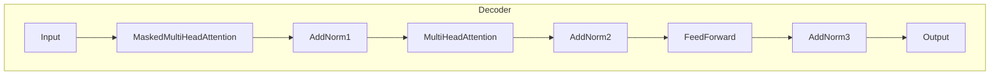

# Transformer 原理与代码实战案例讲解

## 1. 背景介绍

### 1.1 问题的由来

在自然语言处理(NLP)和序列数据建模领域,长期以来都面临着一个挑战:如何有效地捕捉输入序列中长距离依赖关系的信息。传统的序列模型如循环神经网络(RNN)和长短期记忆网络(LSTM)在处理较长序列时存在梯度消失或爆炸的问题,难以充分利用远距离的上下文信息。

为了解决这一问题,Transformer模型应运而生。Transformer是一种全新的基于注意力机制(Attention Mechanism)的神经网络架构,它完全摒弃了RNN和LSTM中的递归结构,使用自注意力(Self-Attention)机制来直接建模输入序列中任意两个位置之间的依赖关系,从而有效地解决了长期依赖问题。

### 1.2 研究现状

自2017年Transformer模型被提出以来,它在机器翻译、文本生成、语音识别等多个NLP任务上取得了非常优异的表现,甚至超越了人类专家的水平。此后,Transformer模型也被广泛应用于计算机视觉(CV)、推荐系统等其他领域,成为了深度学习的一个研究热点。

目前,Transformer模型及其变体已经成为NLP领域的主流模型之一,被广泛应用于各种预训练语言模型(如BERT、GPT等)和下游任务中。同时,Transformer模型的自注意力机制也被借鉴到了CV领域的一些模型中,如Vision Transformer等。

### 1.3 研究意义

深入理解Transformer模型的原理和实现细节,对于掌握当前主流的NLP技术是非常重要的。本文将全面介绍Transformer模型的核心思想、数学原理、实现细节以及在实际任务中的应用,旨在帮助读者全面掌握这一里程碑式的模型。

### 1.4 本文结构

本文将从以下几个方面对Transformer模型进行全面解读:

1. 核心概念与联系
2. 核心算法原理与具体操作步骤
3. 数学模型和公式详细讲解与案例分析
4. 项目实践:代码实例和详细解释说明
5. 实际应用场景
6. 工具和资源推荐
7. 总结:未来发展趋势与挑战
8. 附录:常见问题与解答

## 2. 核心概念与联系

在深入探讨Transformer模型之前,我们先介绍几个与之密切相关的核心概念。

### 2.1 自注意力机制(Self-Attention)

自注意力机制是Transformer模型的核心,它能够捕捉输入序列中任意两个位置之间的依赖关系,从而有效解决长期依赖问题。不同于RNN/LSTM中的序列结构,自注意力机制通过计算查询(Query)、键(Key)和值(Value)之间的相似性来建模序列内部的依赖关系。

### 2.2 位置编码(Positional Encoding)

由于Transformer模型完全放弃了RNN/LSTM中的递归结构,因此它无法像RNN那样自然地捕捉序列的位置信息。为了解决这个问题,Transformer引入了位置编码的概念,将序列的位置信息编码到输入的嵌入向量中。

### 2.3 多头注意力(Multi-Head Attention)

多头注意力机制是在单一注意力机制的基础上进行扩展,它允许模型共享计算资源,从不同的子空间关注不同的位置,从而提高模型的表达能力和性能。

### 2.4 编码器-解码器架构(Encoder-Decoder Architecture)

Transformer采用了编码器-解码器的架构,用于处理序列到序列(Sequence-to-Sequence)的任务,如机器翻译等。编码器用于编码输入序列,解码器则根据编码器的输出生成目标序列。

### 2.5 掩码多头注意力(Masked Multi-Head Attention)

在解码器的自注意力层中,由于目标序列是逐个单词生成的,因此在计算每个单词的注意力时,需要掩蔽掉该单词之后的所有单词,以防止模型利用了未来的信息。这就是掩码多头注意力机制。

### 2.6 残差连接(Residual Connection)和层归一化(Layer Normalization)

为了加速模型的收敛并提高性能,Transformer引入了残差连接和层归一化的技术,这在很大程度上缓解了深度神经网络的梯度消失/爆炸问题。

上述概念是理解Transformer模型的基础,接下来我们将逐步深入探讨模型的核心算法原理。

## 3. 核心算法原理与具体操作步骤

### 3.1 算法原理概述

Transformer模型的核心思想是利用自注意力机制来建模输入序列中任意两个位置之间的依赖关系,从而有效捕捉长期依赖的信息。具体来说,Transformer包含以下几个主要组件:

1. **嵌入层(Embedding Layer)**: 将输入的单词(或子词)映射为嵌入向量的表示。
2. **位置编码(Positional Encoding)**: 将序列的位置信息编码到嵌入向量中。
3. **编码器(Encoder)**: 由多个相同的编码器层组成,每个编码器层包含一个多头自注意力子层和一个前馈神经网络子层。编码器的作用是编码输入序列的上下文信息。
4. **解码器(Decoder)**: 由多个相同的解码器层组成,每个解码器层包含一个掩码多头自注意力子层、一个多头注意力子层(关注编码器输出)和一个前馈神经网络子层。解码器的作用是根据编码器的输出生成目标序列。
5. **线性层和softmax层**: 将解码器的输出映射为目标序列的单词概率分布。

编码器和解码器的核心是自注意力机制,我们将在下一小节详细介绍其工作原理。

### 3.2 算法步骤详解

#### 3.2.1 自注意力机制(Self-Attention)

自注意力机制是Transformer模型的核心,它能够直接建模输入序列中任意两个位置之间的依赖关系。具体来说,给定一个输入序列 $X = (x_1, x_2, ..., x_n)$,自注意力机制首先将其映射为三个向量:查询向量(Query) $Q$、键向量(Key) $K$ 和值向量(Value) $V$,然后计算 $Q$ 和 $K$ 之间的相似性得分,并根据这些相似性得分对 $V$ 进行加权求和,得到输出向量。数学表示如下:

$$\begin{aligned}
Q &= XW^Q\
K &= XW^K\
V &= XW^V\
\text{Attention}(Q, K, V) &= \text{softmax}(\frac{QK^T}{\sqrt{d_k}})V
\end{aligned}$$

其中, $W^Q$、$W^K$ 和 $W^V$ 分别是可学习的权重矩阵,用于将输入 $X$ 映射到查询、键和值空间; $d_k$ 是缩放因子,用于防止内积过大导致softmax函数的梯度较小。

自注意力机制的优点在于,它能够直接捕捉输入序列中任意两个位置之间的依赖关系,而不受序列长度的限制。这解决了RNN/LSTM在处理长序列时容易出现梯度消失/爆炸的问题。

#### 3.2.2 多头注意力机制(Multi-Head Attention)

为了进一步提高模型的表达能力,Transformer引入了多头注意力机制。多头注意力机制将输入 $X$ 通过不同的线性变换映射到多个子空间,然后在每个子空间中分别执行自注意力操作,最后将所有子空间的注意力输出进行拼接并经过另一个线性变换,得到最终的多头注意力输出。数学表示如下:

$$\begin{aligned}
\text{MultiHead}(Q, K, V) &= \text{Concat}(head_1, ..., head_h)W^O\
\text{where } head_i &= \text{Attention}(QW_i^Q, KW_i^K, VW_i^V)
\end{aligned}$$

其中, $W_i^Q$、$W_i^K$、$W_i^V$ 和 $W^O$ 都是可学习的权重矩阵。多头注意力机制允许模型从不同的子空间关注不同的位置,从而提高了模型的表达能力。

#### 3.2.3 编码器(Encoder)

Transformer的编码器由多个相同的编码器层组成,每个编码器层包含两个子层:

1. **多头自注意力子层(Multi-Head Self-Attention Sublayer)**: 对输入序列执行多头自注意力操作,捕捉序列内部的依赖关系。
2. **前馈神经网络子层(Feed-Forward Neural Network Sublayer)**: 对上一子层的输出执行全连接的前馈神经网络操作,为每个位置提供额外的非线性映射能力。

在每个子层之后,都会进行残差连接和层归一化操作,以加速模型的收敛并提高性能。编码器的输出将被送入解码器进行进一步处理。

#### 3.2.4 解码器(Decoder)

Transformer的解码器也由多个相同的解码器层组成,每个解码器层包含三个子层:

1. **掩码多头自注意力子层(Masked Multi-Head Self-Attention Sublayer)**: 对目标序列执行掩码多头自注意力操作,捕捉目标序列内部的依赖关系,但掩蔽掉当前位置之后的信息。
2. **多头注意力子层(Multi-Head Attention Sublayer)**: 对编码器的输出执行多头注意力操作,捕捉目标序列与输入序列之间的依赖关系。
3. **前馈神经网络子层(Feed-Forward Neural Network Sublayer)**: 对上一子层的输出执行全连接的前馈神经网络操作,为每个位置提供额外的非线性映射能力。

与编码器类似,在每个子层之后也会进行残差连接和层归一化操作。解码器的输出将被送入线性层和softmax层,生成目标序列的单词概率分布。

#### 3.2.5 位置编码(Positional Encoding)

由于Transformer模型完全放弃了RNN/LSTM中的递归结构,因此它无法像RNN那样自然地捕捉序列的位置信息。为了解决这个问题,Transformer引入了位置编码的概念,将序列的位置信息编码到输入的嵌入向量中。

位置编码可以通过不同的函数来实现,如正弦/余弦函数、学习的嵌入向量等。在原始的Transformer模型中,位置编码是通过正弦/余弦函数来实现的,数学表示如下:

$$\begin{aligned}
PE_{(pos, 2i)} &= \sin(pos / 10000^{2i / d_{model}})\
PE_{(pos, 2i+1)} &= \cos(pos / 10000^{2i / d_{model}})
\end{aligned}$$

其中, $pos$ 表示单词在序列中的位置, $i$ 表示嵌入向量的维度索引, $d_{model}$ 是嵌入向量的维度大小。

位置编码与输入的嵌入向量相加,就能够为模型提供序列的位置信息。

### 3.3 算法优缺点

#### 3.3.1 优点

1. **并行计算能力强**: 由于Transformer模型完全摒弃了RNN/LSTM中的递归结构,因此它能够充分利用现代硬件(如GPU)的并行计算能力,大大提高了训练和推理的效率。
2. **长期依赖建模能力强**: 自注意力机制能够直接捕捉输