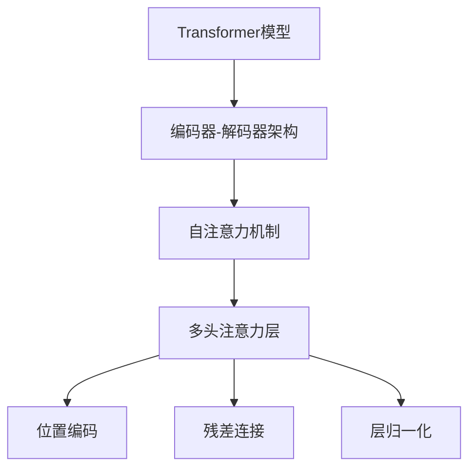

# Transformer大模型实战 多头注意力层

## 1. 背景介绍

### 1.1 问题的由来

在自然语言处理和机器学习领域,序列数据(如文本、语音、时间序列等)的建模和处理一直是一个核心挑战。传统的序列模型如递归神经网络(RNN)和长短期记忆网络(LSTM)在处理长期依赖关系时存在困难,并且由于序列化计算的特性,难以充分利用现代硬件的并行计算能力。

为了解决这些问题,Transformer模型应运而生。Transformer是一种全新的基于注意力机制的序列到序列模型,它完全摒弃了RNN和卷积网络,纯粹基于注意力机制来捕获输入和输出之间的长期依赖关系。自2017年被提出以来,Transformer模型在机器翻译、语音识别、文本生成等多个领域取得了卓越的成绩,成为序列建模的主流模型之一。

### 1.2 研究现状

Transformer模型的核心是多头自注意力(Multi-Head Attention)机制,它允许模型同时关注输入序列的不同位置,捕获长期依赖关系。与RNN相比,多头注意力层更加并行化,能够充分利用现代GPU和TPU等硬件的并行计算能力,大大提高了模型的计算效率。

目前,Transformer模型已经在自然语言处理、计算机视觉、语音识别、推荐系统等多个领域取得了卓越的成绩,成为深度学习领域的主流模型之一。大型预训练语言模型如BERT、GPT等都是基于Transformer模型的变体。随着模型规模和数据量的不断增长,Transformer大模型的性能也在不断提升,在一些任务上已经超过了人类水平。

### 1.3 研究意义

深入理解Transformer模型中多头注意力层的原理和实现细节,对于更好地应用和优化这一关键模块至关重要。本文将全面介绍多头注意力层的理论基础、数学模型、实现细节和优化技巧,为读者提供一个全面而深入的指南。

通过学习本文,读者将能够:

- 彻底理解多头注意力层的工作原理和数学模型
- 掌握多头注意力层的核心算法步骤及其优化技术
- 了解多头注意力层在实际项目中的应用场景和最佳实践
- 获取多头注意力层的代码实现、开发工具和学习资源

### 1.4 本文结构

本文将按照以下结构展开:

1. 背景介绍
2. 核心概念与联系
3. 核心算法原理与具体操作步骤
4. 数学模型和公式详细讲解与举例说明
5. 项目实践:代码实例和详细解释说明
6. 实际应用场景
7. 工具和资源推荐
8. 总结:未来发展趋势与挑战
9. 附录:常见问题与解答

## 2. 核心概念与联系

在深入探讨多头注意力层之前,我们需要先了解一些核心概念和它们之间的联系。

1. **Transformer模型**: Transformer是一种全新的基于注意力机制的序列到序列模型,用于处理序列数据。它完全摒弃了RNN和卷积网络,纯粹基于注意力机制来捕获输入和输出之间的长期依赖关系。

2. **编码器-解码器架构**: Transformer采用了编码器-解码器的架构,其中编码器用于编码输入序列,解码器用于生成输出序列。两者之间通过注意力机制建立联系。

3. **自注意力机制**: 自注意力机制是Transformer的核心,它允许模型同时关注输入序列的不同位置,捕获长期依赖关系。

4. **多头注意力层**: 多头注意力层是实现自注意力机制的关键组件,它将注意力分成多个"头"(head),每个头关注输入序列的不同部分,最后将所有头的结果组合起来。

5. **位置编码**: 由于Transformer模型完全放弃了RNN和卷积网络,因此需要一种机制来捕获序列数据中的位置信息。位置编码就是用于解决这个问题的技术。

6. **残差连接**: 残差连接是一种常见的神经网络优化技术,它通过将输入直接与输出相加,有助于缓解深层网络的梯度消失问题。

7. **层归一化**: 层归一化是另一种常见的优化技术,它通过对每一层的输入进行归一化,加速了模型的收敛并提高了性能。

这些概念相互关联、相辅相成,共同构建了Transformer模型的核心架构。理解它们之间的联系对于掌握多头注意力层的原理至关重要。

## 3. 核心算法原理与具体操作步骤

### 3.1 算法原理概述

多头注意力层是Transformer模型中最关键的组件之一。它的核心思想是将注意力机制分成多个"头"(head),每个头关注输入序列的不同部分,最后将所有头的结果组合起来。这种方式可以让模型同时关注输入序列的不同位置,捕获长期依赖关系。

多头注意力层的计算过程可以概括为以下四个步骤:

1. **线性映射**: 将输入序列通过线性变换映射到查询(Query)、键(Key)和值(Value)三个向量空间。
2. **分头**: 将查询、键和值向量分别分割成多个"头"。
3. **注意力计算**: 对每个头分别计算注意力权重,并将注意力权重与值向量相乘,得到每个头的注意力输出。
4. **头合并**: 将所有头的注意力输出拼接起来,经过另一个线性变换,得到最终的多头注意力输出。

这种分头机制使得注意力计算可以并行化,从而提高了计算效率。同时,由于每个头关注输入序列的不同部分,多头注意力层也捕获了更丰富的依赖关系信息。

### 3.2 算法步骤详解

现在,我们来详细解释一下多头注意力层的具体计算步骤。假设输入序列为 $X = (x_1, x_2, \dots, x_n)$,其中 $x_i \in \mathbb{R}^{d_\text{model}}$ 是一个 $d_\text{model}$ 维的向量。我们的目标是计算一个新的序列 $Z = (z_1, z_2, \dots, z_n)$,其中每个 $z_i$ 都是输入序列 $X$ 的一个加权和,权重由注意力机制决定。

1. **线性映射**

首先,我们将输入序列 $X$ 通过三个不同的线性变换映射到查询(Query)、键(Key)和值(Value)三个向量空间:

$$
\begin{aligned}
Q &= XW^Q \
K &= XW^K \
V &= XW^V
\end{aligned}
$$

其中 $W^Q \in \mathbb{R}^{d_\text{model} \times d_k}$、$W^K \in \mathbb{R}^{d_\text{model} \times d_k}$ 和 $W^V \in \mathbb{R}^{d_\text{model} \times d_v}$ 是可学习的权重矩阵。

2. **分头**

接下来,我们将查询、键和值向量分别分割成 $h$ 个"头"(head):

$$
\begin{aligned}
Q &= \text{concat}(Q_1, Q_2, \dots, Q_h) \
K &= \text{concat}(K_1, K_2, \dots, K_h) \
V &= \text{concat}(V_1, V_2, \dots, V_h)
\end{aligned}
$$

其中 $Q_i \in \mathbb{R}^{n \times \frac{d_k}{h}}$、$K_i \in \mathbb{R}^{n \times \frac{d_k}{h}}$ 和 $V_i \in \mathbb{R}^{n \times \frac{d_v}{h}}$ 分别表示第 $i$ 个头的查询、键和值向量。

3. **注意力计算**

对于每个头 $i$,我们计算注意力权重 $\alpha_{ij}$,表示第 $j$ 个位置对第 $i$ 个位置的重要性:

$$
\alpha_{ij} = \frac{\exp(e_{ij})}{\sum_{k=1}^n \exp(e_{ik})}
$$

其中 $e_{ij} = \frac{Q_iK_j^T}{\sqrt{d_k/h}}$ 是缩放点积注意力(Scaled Dot-Product Attention)的计算公式。

然后,我们将注意力权重与值向量相乘,得到每个头的注意力输出:

$$
\text{head}_i = \sum_{j=1}^n \alpha_{ij}V_j
$$

4. **头合并**

最后,我们将所有头的注意力输出拼接起来,经过另一个线性变换,得到最终的多头注意力输出 $Z$:

$$
Z = \text{concat}(\text{head}_1, \text{head}_2, \dots, \text{head}_h)W^O
$$

其中 $W^O \in \mathbb{R}^{hd_v \times d_\text{model}}$ 是可学习的权重矩阵。

通过这种分头机制,多头注意力层可以同时关注输入序列的不同位置,捕获更丰富的依赖关系信息。同时,由于注意力计算可以并行化,多头注意力层也具有很高的计算效率。

### 3.3 算法优缺点

**优点**:

1. **长期依赖建模能力强**: 与RNN相比,多头注意力层能够直接捕获输入序列中任意两个位置之间的依赖关系,从而更好地建模长期依赖。

2. **并行计算能力强**: 多头注意力层的计算过程可以高度并行化,能够充分利用现代GPU和TPU等硬件的并行计算能力,大大提高了计算效率。

3. **捕获多种依赖关系**: 通过分头机制,多头注意力层可以同时关注输入序列的不同部分,捕获更丰富的依赖关系信息。

4. **灵活性强**: 多头注意力层可以应用于不同类型的序列数据,如文本、语音、图像等,具有很强的通用性和灵活性。

**缺点**:

1. **计算复杂度高**: 尽管可以并行化,但多头注意力层的计算复杂度仍然较高,尤其是在处理长序列时。

2. **内存占用大**: 由于需要计算全序列的注意力权重矩阵,多头注意力层对内存的占用较大,可能会限制模型的规模。

3. **缺乏位置信息**: 与RNN和卷积网络不同,Transformer模型本身无法直接获取序列数据中的位置信息,需要额外的位置编码机制。

4. **训练不稳定性**: 由于注意力机制的高度灵活性,Transformer模型在训练过程中可能会出现不稳定的情况,需要一些特殊的优化技术。

总的来说,多头注意力层的优点是显著的,它为序列建模带来了全新的思路和能力。但同时,我们也需要注意其存在的一些缺陷和挑战,并采取相应的优化措施。

### 3.4 算法应用领域

多头注意力层及其所基于的Transformer模型,已经在多个领域取得了卓越的成绩,成为序列建模的主流模型之一。下面是一些典型的应用领域:

1. **自然语言处理**
   - 机器翻译: Transformer是目前最先进的神经机器翻译模型之一。
   - 文本生成: 基于Transformer的大型语言模型(如GPT)可以生成高质量的文本内容。
   - 文本分类、情感分析等任务。

2. **计算机视觉**
   - 图像分类: Transformer模型已被成功应用于图像分类任务。
   - 目标检测: 一些基于Transformer的目标检测模型取得了优异的性能。
   - 图像生成: 基于Transformer的生成对抗网络可以生成高质量的图像。

3. **语音识别**
   - 基于Transformer的语音识别模型在工业界得到了广泛应用。

4. **推荐系统**
   - Transformer模型可以捕获