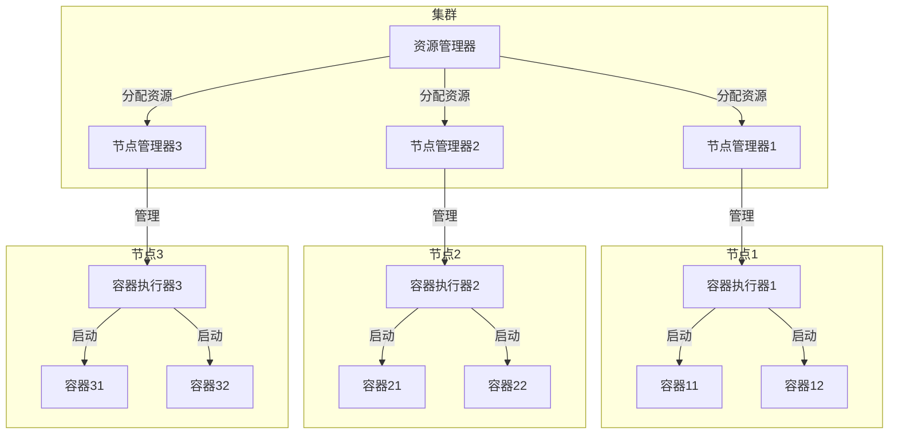
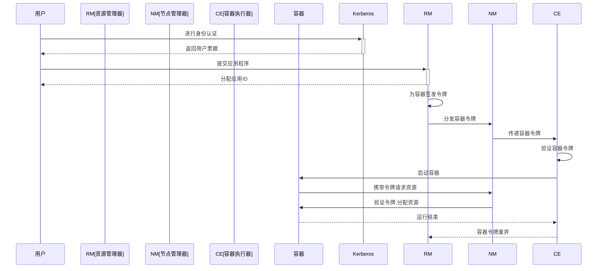

以下是关于"YARN容器的安全性与身份认证"的技术博客文章正文:

# YARN容器的安全性与身份认证

## 1. 背景介绍

### 1.1 问题的由来

随着大数据和云计算的快速发展,分布式计算框架(如Apache Hadoop和Apache Spark)被广泛应用于各行各业。Apache Hadoop YARN(Yet Another Resource Negotiator)作为Hadoop的资源管理和任务调度框架,在确保集群资源高效利用的同时,也面临着安全性和身份认证的挑战。

在分布式环境中,由于节点分散在不同的物理机器上,容器(Container)作为YARN的基本计算单元,很容易受到来自内部和外部的各种攻击和威胁,如容器逃逸、资源滥用、数据泄露等,这给集群的安全性带来了巨大风险。因此,加强YARN容器的安全性和身份认证机制就显得尤为重要。

### 1.2 研究现状

目前,YARN提供了一些基本的安全机制,如Kerberos认证、YARN服务级别授权、Linux容器执行环境等。但这些机制还无法完全满足复杂环境下的安全需求。业界和学术界正在不断探索更安全、更高效的容器安全解决方案。

例如,Google的gVisor通过在容器和主机内核之间引入虚拟机监控程序层,实现了对容器的严格隔离和安全加固。而Docker则采用了名为User Namespaces的Linux内核特性,为容器提供了独立的用户和组ID空间,增强了容器的安全性。

### 1.3 研究意义

加强YARN容器的安全性和身份认证,不仅能够保护集群免受各种攻击和威胁,确保数据的完整性和隐私性,还能够为企业提供一个可靠、高效、安全的大数据计算平台,支撑各种关键业务应用。因此,这一课题具有重要的理论意义和实践价值。

### 1.4 本文结构

本文将从以下几个方面深入探讨YARN容器的安全性和身份认证:

- 核心概念与联系
- 核心算法原理与具体操作步骤
- 数学模型和公式详细讲解及案例分析
- 项目实践:代码实例和详细解释
- 实际应用场景分析
- 相关工具和学习资源推荐
- 总结未来发展趋势与面临的挑战

## 2. 核心概念与联系

在探讨YARN容器安全性之前,我们先了解几个核心概念:

1. **容器(Container)**: YARN中的资源抽象,封装了CPU、内存、磁盘、网络等计算资源,是运行应用程序的基本单元。

2. **容器执行器(Container Executor)**: 负责在节点上启动和停止容器,以及监控容器资源使用情况。

3. **节点管理器(Node Manager)**: 负责管理单个节点上的资源和容器。

4. **资源管理器(Resource Manager)**: 集群资源管理的主体,负责资源分配和调度。

5. **应用尝试(Application Attempt)**: 一个应用程序的具体实例,包含多个容器。

6. **容器令牌(Container Token)**: 由资源管理器签名的安全令牌,用于标识容器的身份。

这些概念相互关联,共同构建了YARN的资源管理和任务调度框架。其中,容器是最基本的计算单元,容器执行器负责在节点上管理容器的生命周期,而节点管理器和资源管理器则负责集群范围内的资源协调和调度。容器令牌则是实现容器身份认证的关键。

## 3. 核心算法原理与具体操作步骤

### 3.1 算法原理概述

YARN容器的安全性和身份认证主要依赖于以下几个核心机制:

1. **基于Kerberos的身份认证**: Kerberos是一种网络认证协议,为客户端/服务端应用提供了相互身份认证的能力。在YARN中,Kerberos用于对用户进行身份认证,并为已认证的主体(如容器)签发安全票据(Ticket)。

2. **基于容器令牌的授权**: 容器令牌是由资源管理器签名的安全令牌,标识了容器的身份。只有持有合法容器令牌的容器,才能被节点管理器和容器执行器接受并分配资源。

3. **Linux容器执行环境**: YARN利用Linux namespace和cgroups等特性,为每个容器创建了一个相对隔离的执行环境,限制了容器对主机资源的访问权限,从而增强了容器的安全性。

4. **YARN服务级别授权**: YARN服务(如资源管理器、节点管理器等)支持基于Kerberos的服务级别访问控制,只有经过认证和授权的客户端,才能访问相应的服务。

这些机制有机结合,共同为YARN容器提供了全方位的安全防护。

### 3.2 算法步骤详解

YARN容器的身份认证和授权过程可以概括为以下几个步骤:

1. **用户身份认证**: 用户首先通过Kerberos进行身份认证,获取用户票据(User Ticket)。

2. **提交应用程序**: 用户使用已获取的票据向资源管理器提交应用程序,资源管理器会为该应用程序分配一个应用ID。

3. **签发容器令牌**: 资源管理器为应用程序的每个容器签发一个容器令牌,该令牌包含了容器ID、应用尝试ID等身份信息,并使用资源管理器的私钥进行数字签名。

4. **分发容器令牌**: 资源管理器将容器令牌分发给相应的节点管理器,节点管理器再将令牌传递给容器执行器。

5. **容器启动**: 容器执行器在启动容器之前,会验证容器令牌的合法性和完整性。只有持有合法令牌的容器,才能被成功启动并分配资源。

6. **容器运行**: 容器在运行过程中,所有对节点管理器和资源管理器的请求都需要携带容器令牌,以证明自己的合法身份。

7. **容器终止**: 容器运行结束后,相应的容器令牌也会被废弃。

该过程中,Kerberos负责用户身份认证,而容器令牌则作为容器身份的"通行证",确保只有合法的容器才能获取资源和运行。

### 3.3 算法优缺点

**优点**:

1. **增强安全性**: 基于Kerberos和容器令牌的双重身份认证机制,有效防止了非法用户和容器访问集群资源。

2. **细粒度控制**: 容器令牌实现了对每个容器的精细化身份控制,提高了安全性和可审计性。

3. **可扩展性好**: 该机制与YARN的设计理念相符,具有很好的扩展性和兼容性。

4. **利用现有技术**: 充分利用了Kerberos和Linux容器等成熟技术,降低了实现难度。

**缺点**:

1. **管理复杂度高**: 引入Kerberos和容器令牌等机制,增加了系统的管理和维护复杂度。

2. **性能开销**: 身份认证和加密计算会带来一定的性能开销,影响系统吞吐量。

3. **单点故障风险**: 资源管理器作为容器令牌的签发者,如果出现单点故障,将影响整个集群的正常运行。

4. **安全边界有限**: 虽然Linux容器提供了一定程度的隔离,但仍存在容器逃逸的风险。

### 3.4 算法应用领域

YARN容器安全性和身份认证机制主要应用于以下领域:

1. **大数据计算平台**: 如Apache Hadoop、Apache Spark等分布式计算框架。

2. **云计算平台**: 如OpenStack Nova、Kubernetes等基于容器的云平台。

3. **科学计算和HPC**: 在需要大规模计算资源的科学计算和高性能计算领域。

4. **物联网和边缘计算**: 随着5G和物联网的发展,边缘侧的分布式计算也对容器安全性提出了新要求。

5. **企业级应用**: 企业级大数据分析、机器学习等应用,对数据安全性和隐私保护有较高要求。

总的来说,任何需要在分布式异构环境中运行容器化应用的场景,都可以应用YARN容器安全机制来保护系统和数据的安全。

## 4. 数学模型和公式详细讲解与举例说明

### 4.1 数学模型构建

为了量化分析YARN容器安全性,我们构建了一个基于攻击树的数学模型。攻击树是一种用于描述系统安全性的图形化模型,将攻击目标分解为一系列子目标和攻击路径。

我们定义一个YARN集群系统$S$,其安全性可以用一个布尔函数$f_S$表示:

$$f_S = f(g_1, g_2, ..., g_n)$$

其中,$g_i$表示系统中的一个安全目标或子目标。如果所有$g_i$都满足,则$f_S=1$,表示系统是安全的;否则$f_S=0$,表示系统存在安全风险。

对于YARN容器安全性,我们将其分解为以下几个主要目标:

- $g_1$: 防止非法用户访问集群资源
- $g_2$: 防止非法容器获取资源
- $g_3$: 防止容器逃逸攻击
- $g_4$: 防止容器资源滥用
- ...

每个目标$g_i$又可以进一步分解为子目标,并通过与或非等逻辑运算构建攻击路径。例如,防止非法容器获取资源($g_2$)的攻击路径可以表示为:

$$g_2 = g_{21} \lor g_{22}$$

其中,$g_{21}$表示"伪造容器令牌",$g_{22}$表示"窃取合法容器令牌"。只要发生了$g_{21}$或$g_{22}$,就意味着$g_2$不能被满足,即存在安全风险。

通过构建完整的攻击树,我们可以清晰地看到系统中的各种攻击路径,并针对性地加固防护措施。

### 4.2 公式推导过程

接下来,我们推导一个公式,用于量化计算YARN容器的整体安全性。

假设一个YARN集群系统$S$包含$n$个安全目标$g_i(1 \leq i \leq n)$,其中每个$g_i$都可以进一步分解为若干子目标。我们定义:

- $P(g_i)$: