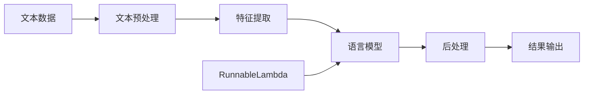

# 【LangChain编程：从入门到实践】RunnableLambda

作者：禅与计算机程序设计艺术 / Zen and the Art of Computer Programming

## 1. 背景介绍

### 1.1 问题的由来

随着人工智能和自然语言处理技术的快速发展，如何构建高效、灵活的语言模型应用成为了一个热门话题。传统的方法通常需要大量的手工编码和调试，开发效率低下。而 LangChain 作为一个强大的语言模型应用开发框架，提供了一套简洁易用的 API，大大降低了开发门槛，提高了开发效率。

### 1.2 研究现状

目前，LangChain 已经被广泛应用于各种自然语言处理任务，如问答系统、对话生成、文本摘要等。许多研究者和开发者都在探索如何利用 LangChain 构建更加智能、高效的语言模型应用。然而，对于初学者来说，如何快速上手 LangChain 编程仍然是一个挑战。

### 1.3 研究意义

本文将以 LangChain 中的 RunnableLambda 为切入点，深入探讨如何利用 LangChain 进行语言模型应用开发。通过详细介绍 RunnableLambda 的核心概念、工作原理和使用方法，帮助读者快速掌握 LangChain 编程技巧，为构建高质量的语言模型应用奠定基础。

### 1.4 本文结构

本文将分为以下几个部分：

1. 背景介绍
2. 核心概念与联系
3. 核心算法原理与具体操作步骤
4. 数学模型和公式详细讲解与举例说明
5. 项目实践：代码实例和详细解释说明
6. 实际应用场景
7. 工具和资源推荐
8. 总结：未来发展趋势与挑战
9. 附录：常见问题与解答

## 2. 核心概念与联系

在深入探讨 RunnableLambda 之前，我们先来了解一下 LangChain 的核心概念。

LangChain 是一个基于语言模型的应用开发框架，它提供了一套简洁易用的 API，用于构建各种语言模型应用，如问答系统、对话生成、文本摘要等。LangChain 的核心思想是将复杂的语言模型应用拆分为多个可组合、可重用的组件，每个组件负责特定的功能，如文本预处理、特征提取、模型推理等。通过灵活组合这些组件，开发者可以快速构建出功能强大的语言模型应用。

而 RunnableLambda 则是 LangChain 中的一个重要组件，它允许开发者将自定义的 Python 函数封装为可在语言模型应用中执行的 Lambda 函数。通过 RunnableLambda，我们可以方便地将各种数据处理、计算逻辑集成到语言模型应用中，大大扩展了语言模型的能力。

下图展示了 LangChain 的整体架构，以及 RunnableLambda 在其中的位置：



## 3. 核心算法原理 & 具体操作步骤

### 3.1 算法原理概述

RunnableLambda 的核心思想是将 Python 函数封装为可在语言模型应用中执行的 Lambda 函数。它利用了 Python 的函数式编程特性，允许将函数作为参数传递和返回。

具体来说，RunnableLambda 接受一个 Python 函数作为输入，并返回一个新的函数对象。这个新的函数对象可以像普通的 Python 函数一样被调用，同时它还携带了一些元数据，用于描述函数的输入输出类型、参数名称等。当语言模型应用需要调用这个函数时，它会将函数的输入数据序列化为特定格式，并通过 RunnableLambda 提供的接口发送给函数执行器。函数执行器会反序列化输入数据，调用原始的 Python 函数，并将函数的返回值序列化后发送回语言模型应用。

### 3.2 算法步骤详解

下面我们来详细介绍 RunnableLambda 的使用步骤。

步骤1：定义 Python 函数

首先，我们需要定义一个 Python 函数，用于封装我们的自定义逻辑。这个函数可以接受任意数量和类型的参数，并返回一个值。例如：

```python
def my_func(a: int, b: str) -> float:
    return float(a) + len(b)
```

步骤2：创建 RunnableLambda 对象

接下来，我们需要创建一个 RunnableLambda 对象，并将上一步定义的函数传递给它。例如：

```python
from langchain.runnable_utils import RunnableLambda

runnable_func = RunnableLambda(my_func)
```

这里，我们将 `my_func` 函数传递给 `RunnableLambda` 构造函数，得到一个新的函数对象 `runnable_func`。

步骤3：调用 RunnableLambda 对象

现在，我们可以像调用普通的 Python 函数一样调用 `runnable_func` 对象。例如：

```python
result = runnable_func(a=42, b="hello")
print(result)  # 输出 47.0
```

这里，我们将参数 `a` 设置为整数 42，参数 `b` 设置为字符串 "hello"，调用 `runnable_func` 对象，得到返回值 47.0。

步骤4：集成到语言模型应用中

最后，我们可以将 `runnable_func` 对象集成到语言模型应用中。具体的集成方式取决于我们使用的语言模型和应用框架，但一般来说，我们需要将 `runnable_func` 对象注册为一个可调用的组件，并在需要的时候调用它。

例如，在一个问答系统中，我们可以将 `runnable_func` 对象注册为一个查询函数，当用户提出特定的问题时，系统会自动调用这个函数，并将函数的返回值作为答案返回给用户。

### 3.3 算法优缺点

RunnableLambda 的主要优点包括：

1. 简单易用：RunnableLambda 提供了一套简洁的 API，只需要几行代码就可以将 Python 函数封装为可在语言模型应用中执行的 Lambda 函数。

2. 灵活性强：RunnableLambda 对 Python 函数的输入输出类型没有任何限制，因此我们可以封装各种类型的函数，包括数值计算、字符串处理、列表操作等。

3. 可组合性强：多个 RunnableLambda 对象可以组合在一起，构建出更加复杂的数据处理流程。

4. 可重用性强：封装为 RunnableLambda 对象的 Python 函数可以在多个语言模型应用中重复使用，提高了代码的复用性。

当然，RunnableLambda 也有一些局限性：

1. 性能开销：由于 RunnableLambda 需要在函数调用前后进行数据的序列化和反序列化，因此会带来一定的性能开销。对于计算密集型的任务，这种开销可能会比较明显。

2. 安全性问题：RunnableLambda 允许在语言模型应用中执行任意的 Python 代码，如果不加以限制，可能会带来安全性问题，如代码注入攻击等。

### 3.4 算法应用领域

RunnableLambda 在各种语言模型应用中都有广泛的应用，包括：

1. 问答系统：将 RunnableLambda 封装的函数作为查询函数，根据用户的问题自动调用相应的函数，生成答案。

2. 对话生成：将 RunnableLambda 封装的函数作为对话生成的规则，根据用户的输入自动生成回复。

3. 文本摘要：将 RunnableLambda 封装的函数作为文本摘要的规则，自动提取文本的关键信息。

4. 知识图谱构建：将 RunnableLambda 封装的函数作为知识提取的规则，自动从文本中提取实体、关系等知识要素。

5. 语义解析：将 RunnableLambda 封装的函数作为语义解析的规则，自动将自然语言表达转换为结构化的语义表示。

## 4. 数学模型和公式 & 详细讲解 & 举例说明

### 4.1 数学模型构建

RunnableLambda 的数学模型可以用以下公式来表示：

$$f_{runnable} = RunnableLambda(f)$$

其中，$f$ 表示原始的 Python 函数，$f_{runnable}$ 表示封装后的 RunnableLambda 对象。

当调用 $f_{runnable}$ 对象时，可以用以下公式来表示：

$$y = f_{runnable}(x_1, x_2, ..., x_n)$$

其中，$x_1, x_2, ..., x_n$ 表示函数的输入参数，$y$ 表示函数的返回值。

### 4.2 公式推导过程

RunnableLambda 的数学模型非常简单，主要是对 Python 函数进行封装和调用。下面我们来详细推导一下调用 RunnableLambda 对象的过程。

假设我们有一个 Python 函数 $f$，它接受 $n$ 个参数 $x_1, x_2, ..., x_n$，并返回一个值 $y$：

$$y = f(x_1, x_2, ..., x_n)$$

我们将这个函数传递给 RunnableLambda 构造函数，得到一个新的函数对象 $f_{runnable}$：

$$f_{runnable} = RunnableLambda(f)$$

现在，我们可以像调用普通的 Python 函数一样调用 $f_{runnable}$ 对象：

$$y = f_{runnable}(x_1, x_2, ..., x_n)$$

当我们调用 $f_{runnable}$ 对象时，实际上是在调用原始的 Python 函数 $f$，只不过在调用前后多了一些数据序列化和反序列化的操作。

具体来说，调用 $f_{runnable}$ 对象时，会发生以下步骤：

1. 将输入参数 $x_1, x_2, ..., x_n$ 序列化为特定的格式，得到序列化后的数据 $\hat{x}$。

2. 将序列化后的数据 $\hat{x}$ 发送给函数执行器。

3. 函数执行器反序列化数据 $\hat{x}$，得到原始的输入参数 $x_1, x_2, ..., x_n$。

4. 函数执行器调用原始的 Python 函数 $f$，得到返回值 $y$。

5. 函数执行器将返回值 $y$ 序列化为特定的格式，得到序列化后的数据 $\hat{y}$。

6. 函数执行器将序列化后的数据 $\hat{y}$ 发送回调用方。

7. 调用方反序列化数据 $\hat{y}$，得到原始的返回值 $y$。

可以看到，调用 RunnableLambda 对象的过程虽然比直接调用 Python 函数要复杂一些，但对于调用方来说，这个过程是完全透明的，就像在调用一个普通的 Python 函数一样。

### 4.3 案例分析与讲解

下面我们来看一个具体的案例，来说明如何使用 RunnableLambda。

假设我们要开发一个问答系统，当用户输入一个问题时，系统需要自动生成一个答案。我们可以将答案生成的逻辑封装在一个 Python 函数中，并将其转换为 RunnableLambda 对象，集成到问答系统中。

具体来说，我们可以定义一个 Python 函数，接受问题字符串作为输入，并返回答案字符串：

```python
def generate_answer(question: str) -> str:
    # 在这里实现答案生成的逻辑
    if "天气" in question:
        return "今天的天气很好，适合出去走走。"
    elif "吃饭" in question:
        return "我推荐你去尝尝那家新开的西餐厅，味道不错。"
    else:
        return "对不起，我不太理解你的问题。"
```

然后，我们将这个函数传递给 RunnableLambda 构造函数，得到一个新的函数对象：

```python
from langchain.runnable_utils import RunnableL