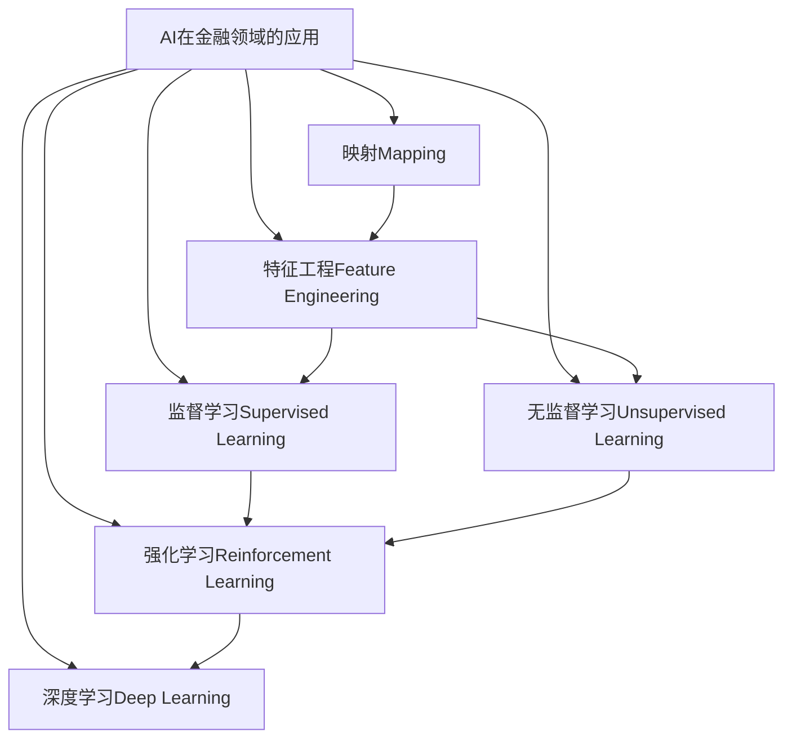
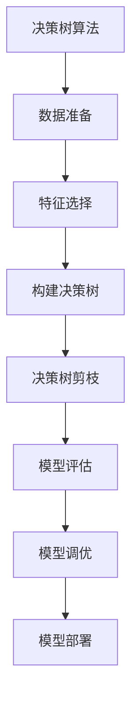

下面是标题为《一切皆是映射：AI在金融领域的应用探究》的技术博客文章正文：

# 一切皆是映射：AI在金融领域的应用探究

## 1. 背景介绍

### 1.1 问题的由来

在当今数字化时代,金融行业正面临着前所未有的挑战和机遇。传统的金融服务模式已难以满足日益复杂的客户需求,金融机构亟需通过创新来提高效率、降低风险并提供更优质的服务体验。而人工智能(AI)技术的兴起为金融行业带来了全新的发展契机。

### 1.2 研究现状  

近年来,AI在金融领域的应用研究和实践取得了长足进展。包括风险管理、投资组合优化、反洗钱监控、客户服务等多个领域都已开始广泛应用AI技术。但与此同时,AI在金融领域的应用也面临着诸多挑战,如算法的可解释性、隐私保护、监管合规性等问题有待进一步探讨和解决。

### 1.3 研究意义

本文旨在系统地探讨AI在金融领域的应用现状、核心技术原理以及未来发展趋势,为金融从业者提供AI技术的实践指导,并为学术界提供AI在金融领域应用的研究视角。通过深入剖析,我们希望能够发现AI赋能金融的新思路,促进金融行业的创新发展。

### 1.4 本文结构

本文将从以下几个方面全面阐述AI在金融领域的应用:

1. 核心概念与联系
2. 核心算法原理与具体操作步骤
3. 数学模型和公式的详细讲解与案例分析
4. 项目实践:代码实例和详细解释
5. 实际应用场景和未来展望
6. 工具和学习资源推荐
7. 总结:未来发展趋势与挑战
8. 附录:常见问题与解答

## 2. 核心概念与联系

在探讨AI在金融领域的应用之前,我们需要理解几个核心概念及其内在联系:

1. **映射(Mapping)**: 映射是将一个集合中的元素与另一个集合中的元素建立对应关系的过程。在AI领域,映射常被用于建立输入和输出之间的函数关系。

2. **特征工程(Feature Engineering)**: 特征工程是从原始数据中提取有意义的特征,以供机器学习模型训练和预测使用。在金融领域,合理的特征工程对于构建高质量的模型至关重要。

3. **监督学习(Supervised Learning)**: 监督学习是机器学习中的一种范式,通过学习输入数据和相应的标签,建立映射函数,从而对新的输入数据进行预测或分类。

4. **无监督学习(Unsupervised Learning)**: 无监督学习则是从未标记的数据中发现内在模式和结构,常用于聚类、降维和异常检测等任务。

5. **强化学习(Reinforcement Learning)**: 强化学习是一种基于环境交互的学习方式,智能体通过试错不断优化决策,以获得最大化的累积回报。

6. **深度学习(Deep Learning)**: 深度学习是一种基于人工神经网络的机器学习方法,能够从大量数据中自动学习特征表示,在图像、语音、自然语言处理等领域表现出色。

这些概念相互关联、环环相扣,共同构建了AI在金融领域应用的理论基础和技术框架。

## 3. 核心算法原理与具体操作步骤

### 3.1 算法原理概述

AI在金融领域的应用主要依赖于以下几种核心算法:

1. **决策树(Decision Tree)**: 决策树是一种监督学习算法,通过递归地构建决策树模型,对数据进行分类或回归预测。在金融领域,决策树可用于信用风险评估、欺诈检测等任务。

2. **支持向量机(Support Vector Machine, SVM)**: SVM是一种有监督的非概率二元线性分类模型,其工作原理是通过寻找最大边界超平面,将不同类别的数据点分开。SVM在金融领域常用于股票价格预测、信用评分等任务。

3. **人工神经网络(Artificial Neural Network, ANN)**: ANN是一种模拟生物神经网络的数学模型,通过对网络权重的不断调整,实现对输入数据的映射和学习。ANN在金融领域可用于风险建模、交易策略优化等任务。

4. **聚类算法(Clustering Algorithms)**: 聚类算法是无监督学习的一种重要方法,通过将相似的数据对象划分到同一个簇,发现数据的内在结构。常用的聚类算法包括K-Means、层次聚类等,可用于客户细分、异常检测等金融应用场景。

5. **强化学习算法(Reinforcement Learning Algorithms)**: 强化学习算法通过与环境的交互,不断优化决策策略,以获得最大化的累积回报。在金融领域,强化学习可应用于自动交易、资产配置优化等任务。

6. **生成对抗网络(Generative Adversarial Networks, GANs)**: GANs是一种生成模型,由生成网络和判别网络组成,通过两个网络的对抗训练,生成符合真实数据分布的样本。GANs在金融领域可用于数据增广、合成数据生成等任务。

### 3.2 算法步骤详解

以决策树算法为例,我们详细介绍其具体操作步骤:

1. **数据准备**: 收集并预处理金融数据,包括处理缺失值、标准化等步骤。

2. **特征选择**: 从原始数据中选择对预测目标有影响的特征,如客户年龄、收入、信用记录等。

3. **构建决策树**:
   - 根据特征的信息增益或基尼指数,选择最优特征作为根节点。
   - 对于每个特征值,根据数据递归地构建子树。
   - 直到满足停止条件(如树的深度或叶节点数据纯度)。

4. **决策树剪枝**: 通过预剪枝或后剪枝,避免模型过拟合。

5. **模型评估**: 使用测试数据集评估决策树模型的性能,如准确率、精确率、召回率等指标。

6. **模型调优**: 根据评估结果,调整模型参数或算法超参数,提高模型性能。

7. **模型部署**: 将训练好的决策树模型部署到生产环境,用于实际的金融应用场景。

### 3.3 算法优缺点

决策树算法具有以下优缺点:

**优点**:
- 可解释性强,决策过程易于理解
- 可处理数值型和类别型数据
- 对缺失值的处理能力较强
- 训练速度快,计算开销较小

**缺点**:
- 容易过拟合,对训练数据的微小变化敏感
- 对于某些复杂的决策边界,决策树可能表现不佳
- 当特征空间较大时,构建最优决策树的计算代价高

### 3.4 算法应用领域

决策树算法在金融领域有广泛的应用,包括但不限于:

- **信用风险评估**: 根据客户的个人信息、财务状况等特征,评估客户的违约风险。
- **欺诈检测**: 通过分析交易数据,识别可疑的欺诈行为。
- **客户细分**: 根据客户的人口统计特征、消费习惯等,对客户进行细分和营销策略制定。
- **金融预测**: 基于历史数据预测股票价格、汇率等金融指标的变化趋势。

## 4. 数学模型和公式详细讲解与举例说明

### 4.1 数学模型构建

在金融领域,数学模型是描述金融现象、分析问题和进行决策的重要工具。常见的数学模型包括:

1. **时间序列模型**: 用于描述和预测金融时间序列数据(如股票价格、利率等)的变化趋势。

2. **资产定价模型**: 用于估算资产的合理价值,如资本资产定价模型(CAPM)、期权定价模型等。

3. **投资组合优化模型**: 旨在在给定风险水平下,寻求最优的投资组合配置,以实现最大化预期收益。

4. **风险度量模型**: 用于量化和管理金融风险,如值at风险(VaR)模型、期望缺口(Expected Shortfall)模型等。

5. **结构化模型**: 描述复杂金融衍生品的定价和风险管理,如信用风险模型、利率期权模型等。

以投资组合优化为例,我们将构建一个基于均值-方差模型的数学模型。

设有 $n$ 种资产,资产 $i$ 的预期收益率为 $r_i$,协方差矩阵为 $\Sigma$,投资组合权重向量为 $w = (w_1, w_2, ..., w_n)^T$,其中 $\sum_{i=1}^n w_i = 1$。

投资组合的预期收益率为:

$$
E(r_p) = \sum_{i=1}^n w_i r_i = w^T r
$$

其中 $r = (r_1, r_2, ..., r_n)^T$ 是资产预期收益率向量。

投资组合的方差(风险)为:

$$
\sigma_p^2 = w^T \Sigma w
$$

我们的目标是在给定风险水平 $\sigma_0$ 下,最大化投资组合的预期收益率:

$$
\max_{w} \quad w^T r \
\text{s.t.} \quad w^T \Sigma w \leq \sigma_0^2 \
\sum_{i=1}^n w_i = 1
$$

这是一个典型的二次规划问题,可以使用各种优化算法求解。

### 4.2 公式推导过程

我们以期权定价的著名Black-Scholes模型为例,推导其核心公式。

设 $S_t$ 为时间 $t$ 时的标的资产价格,满足几何布朗运动:

$$
dS_t = \mu S_t dt + \sigma S_t dW_t
$$

其中 $\mu$ 为预期收益率, $\sigma$ 为波动率, $dW_t$ 为标准布朗运动。

构建一个复制投资组合 $\Pi$,包括一份期权和 $\Delta$ 份标的资产的相反头寸,则有:

$$
\Pi = V - \Delta S
$$

由于无风险套利的原因,该投资组合在短时间内的收益应当等于无风险利率 $r$ 的复利:

$$
d\Pi = rV dt
$$

将 $V$ 用伊藤柠檬展开,代入上式,并对冲掉随机项 $dW_t$,我们可以得到著名的Black-Scholes偏微分方程:

$$
\frac{\partial V}{\partial t} + \frac{1}{2}\sigma^2S^2\frac{\partial^2 V}{\partial S^2} + rS\frac{\partial V}{\partial S} - rV = 0
$$

对于欧式看涨期权,其边界条件为:

$$
V(S,T) = \max(S-K,0)
$$

解析解为:

$$
V(S,t) = SN(d_1) - Ke^{-r(T-t)}N(d_2)
$$

其中:

$$
d_1 = \frac{\ln(S/K) + (r + \sigma^2/2)(T-t)}{\sigma\sqrt{T-t}}, \quad d_2 = d_1 - \sigma\sqrt{T-t}
$$

$N(\cdot)$ 为标准正态分布函数。

### 4.3 案例分析与讲解

**案例背景**:

某投资者持有一支股票投资组合,包括5只股票,其预期收益率和协方差矩阵如下:

$$
r = \begin{bmatrix}
0.12\
0.15\
0.10