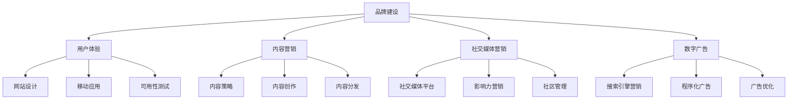

# 互联网技术架构中的品牌建设与市场营销

## 1. 背景介绍

### 1.1 问题的由来

在当今快节奏的数字时代，品牌建设和市场营销已经成为企业发展的关键支柱。随着互联网技术的不断进化,传统的营销方式已经无法满足现代消费者的需求。企业需要与时俱进,采用创新的技术架构来提升品牌形象,扩大市场影响力。

互联网技术架构为品牌建设和市场营销带来了新的机遇和挑战。一方面,企业可以利用大数据分析、人工智能、云计算等先进技术来深入了解目标受众,制定精准的营销策略。另一方面,技术的快速迭代也要求企业保持敏捷性,及时调整营销策略以适应市场变化。

### 1.2 研究现状

近年来,越来越多的企业开始重视互联网技术在品牌建设和市场营销中的作用。一些领先企业已经建立了先进的技术架构,通过大数据分析、社交媒体营销、个性化推荐等手段来提升品牌知名度和客户体验。

然而,许多中小企业由于资金和技术实力的限制,仍然停留在传统的营销模式,难以充分利用互联网技术的优势。此外,技术架构的复杂性和快速迭代也给企业带来了挑战,需要持续投入资源进行技术升级和人员培训。

### 1.3 研究意义

本文旨在探讨互联网技术架构在品牌建设和市场营销中的应用,为企业提供实践指导。通过深入分析核心概念、算法原理、数学模型等,帮助读者全面理解技术架构的构建和优化方法。同时,本文还将介绍实际应用场景、工具资源推荐,为读者提供可操作性的建议。

### 1.4 本文结构

本文将从以下几个方面展开讨论:

1. 核心概念与联系
2. 核心算法原理与具体操作步骤
3. 数学模型和公式详细讲解与案例分析
4. 项目实践:代码实例和详细解释说明
5. 实际应用场景
6. 工具和资源推荐
7. 总结:未来发展趋势与挑战
8. 附录:常见问题与解答

## 2. 核心概念与联系

在互联网技术架构中,品牌建设和市场营销涉及多个核心概念,它们相互关联,构成了一个完整的体系。以下是一些关键概念:

- **品牌建设(Brand Building)**: 品牌建设是通过一系列策略和活动来塑造和提升品牌形象,增强品牌知名度和忠诚度的过程。它包括用户体验、内容营销、社交媒体营销和数字广告等多个方面。

- **用户体验(User Experience)**: 用户体验是指用户在与品牌互动过程中的感受和体验。良好的用户体验可以提高用户满意度,增强品牌忠诚度。它涉及网站设计、移动应用开发和可用性测试等方面。

- **内容营销(Content Marketing)**: 内容营销是通过创建和分发有价值、相关和一致的内容来吸引和保留明确定义的受众,从而推动利润和销售的过程。它包括内容策略制定、内容创作和内容分发等环节。

- **社交媒体营销(Social Media Marketing)**: 社交媒体营销是利用社交媒体平台来推广品牌、产品或服务,与目标受众建立互动和关系的过程。它涉及社交媒体平台选择、影响力营销和社区管理等方面。

- **数字广告(Digital Advertising)**: 数字广告是通过互联网、移动设备等数字媒体进行的广告投放和优化。它包括搜索引擎营销、程序化广告和广告优化等环节。

这些核心概念相互关联,共同构建了一个完整的品牌建设和市场营销体系。企业需要根据自身情况,制定合理的策略和技术架构,以充分发挥互联网技术的优势,提高品牌影响力和市场竞争力。

## 3. 核心算法原理与具体操作步骤

在互联网技术架构中,品牌建设和市场营销涉及多种算法和技术,以下是一些核心算法原理和具体操作步骤:

### 3.1 算法原理概述

1. **协同过滤算法(Collaborative Filtering)**: 协同过滤算法是一种基于用户之间的相似性来预测用户偏好的算法。它广泛应用于个性化推荐系统、内容推荐和目标受众定位等场景。

2. **页面排名算法(PageRank)**: 页面排名算法是谷歌搜索引擎的核心算法之一,用于评估网页的重要性和权威性。它通过分析网页之间的链接结构,计算每个网页的权重分数,从而确定搜索结果的排名。

3. **广告拍卖算法(Ad Auction)**: 广告拍卖算法是在线广告系统中广泛使用的算法,用于确定哪些广告应该展示给用户,以及广告的排列顺序。常见的广告拍卖算法包括第二价格密封拍卖(Second-Price Sealed Auction)和广义第二价格拍卖(Generalized Second-Price Auction)等。

4. **社交网络分析算法(Social Network Analysis)**: 社交网络分析算法用于研究社交网络中的用户行为和关系模式,常见的算法包括中心性分析、社区发现和影响力分析等。这些算法在社交媒体营销、影响力营销和社区管理等领域有广泛应用。

5. **自然语言处理算法(Natural Language Processing)**: 自然语言处理算法用于处理和理解人类语言,包括文本分类、情感分析、命名实体识别等。这些算法在内容营销、用户反馈分析和聊天机器人等场景中发挥重要作用。

### 3.2 算法步骤详解

以协同过滤算法为例,具体步骤如下:

1. **数据预处理**: 收集用户对项目(如产品、内容等)的评分或行为数据,并进行数据清洗和格式化。

2. **计算用户相似度**: 基于用户对相同项目的评分或行为,计算用户之间的相似度。常用的相似度度量方法包括皮尔逊相关系数(Pearson Correlation)、余弦相似度(Cosine Similarity)等。

3. **生成候选集**: 对于目标用户,根据其历史行为,生成一个候选项目集合。

4. **预测评分**: 对于每个候选项目,基于与目标用户相似的其他用户对该项目的评分,计算目标用户对该项目的预测评分。常用的预测算法包括基于用户的协同过滤(User-based Collaborative Filtering)和基于项目的协同过滤(Item-based Collaborative Filtering)等。

5. **排序和推荐**: 根据预测评分,对候选项目进行排序,并将排名靠前的项目推荐给目标用户。

协同过滤算法的核心思想是利用用户之间的相似性来预测用户的偏好,从而实现个性化推荐。该算法在电子商务、视频推荐、新闻推荐等领域有广泛应用。

### 3.3 算法优缺点

协同过滤算法的优点包括:

- 能够有效地捕捉用户的隐式偏好,提供个性化推荐。
- 算法简单,易于实现和扩展。
- 不需要对项目进行内容分析,只依赖用户的历史行为数据。

缺点包括:

- 存在冷启动问题,对于新用户或新项目,由于缺乏历史数据,难以进行准确推荐。
- 数据稀疏性问题,当用户对项目的评分数据较少时,算法的准确性会受到影响。
- 可解释性差,算法无法解释推荐结果的原因。
- 存在数据隐私和安全问题,需要采取适当的隐私保护措施。

### 3.4 算法应用领域

协同过滤算法在以下领域有广泛应用:

- 电子商务网站的个性化商品推荐
- 视频网站的个性化视频推荐
- 新闻网站的个性化新闻推荐
- 音乐应用的个性化音乐推荐
- 社交网络的好友推荐
- 广告系统的个性化广告投放

除了协同过滤算法,其他算法如页面排名算法、广告拍卖算法、社交网络分析算法和自然语言处理算法等,也在品牌建设和市场营销的不同领域发挥着重要作用。企业需要根据具体场景和需求,选择合适的算法和技术,以提高营销效率和用户体验。

## 4. 数学模型和公式详细讲解与举例说明

在互联网技术架构中,品牌建设和市场营销涉及多种数学模型和公式,以下是一些核心模型和公式的详细讲解与案例分析。

### 4.1 数学模型构建

1. **矩阵分解模型(Matrix Factorization)**: 矩阵分解模型是协同过滤算法中常用的一种模型,它将用户-项目评分矩阵分解为用户矩阵和项目矩阵的乘积,从而捕捉用户和项目的潜在特征。

   设有 $m$ 个用户和 $n$ 个项目,用户-项目评分矩阵 $R_{m \times n}$,可以分解为:

   $$R \approx P^TQ$$

   其中 $P_{m \times k}$ 是用户矩阵, $Q_{n \times k}$ 是项目矩阵, $k$ 是潜在特征维数。

2. **PageRank 模型**: PageRank 模型是谷歌搜索引擎的核心算法之一,用于评估网页的重要性和权威性。它基于网页之间的链接结构,计算每个网页的 PageRank 值。

   设有 $N$ 个网页,网页 $i$ 的 PageRank 值 $PR(i)$ 可以表示为:

   $$PR(i) = (1 - d) + d \sum_{j \in B_i} \frac{PR(j)}{L(j)}$$

   其中 $B_i$ 是链接到网页 $i$ 的网页集合, $L(j)$ 是网页 $j$ 的出链接数, $d$ 是阻尼系数,通常取值 $0.85$。

3. **广告拍卖模型**: 在广告拍卖系统中,常用的模型是第二价格密封拍卖(Second-Price Sealed Auction)和广义第二价格拍卖(Generalized Second-Price Auction)。

   在第二价格密封拍卖中,每个广告主提交一个出价,获胜者支付的价格是第二高出价。设有 $n$ 个广告主,出价为 $b_1, b_2, \dots, b_n$,排序后为 $b_{(1)} \geq b_{(2)} \geq \dots \geq b_{(n)}$,则获胜者支付的价格为 $b_{(2)}$。

   在广义第二价格拍卖中,考虑了广告位置和广告质量等因素,获胜者支付的价格为:

   $$\text{价格} = \frac{b_{(2)}}{q_1} \cdot q_2$$

   其中 $q_1$ 和 $q_2$ 分别是获胜者和次高出价者的广告质量分数。

### 4.2 公式推导过程

以矩阵分解模型为例,推导过程如下:

1. 定义目标函数:

   $$\min_{P, Q} \sum_{(u, i) \in \mathcal{K}} (r_{ui} - p_u^Tq_i)^2 + \lambda(||P||^2_F + ||Q||^2_F)$$

   其中 $\mathcal{K}$ 是已知评分的用户-项目对