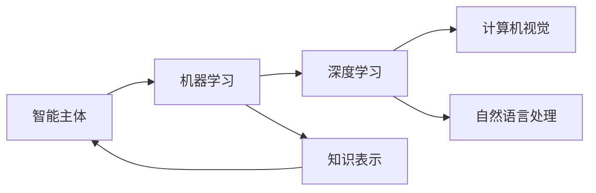
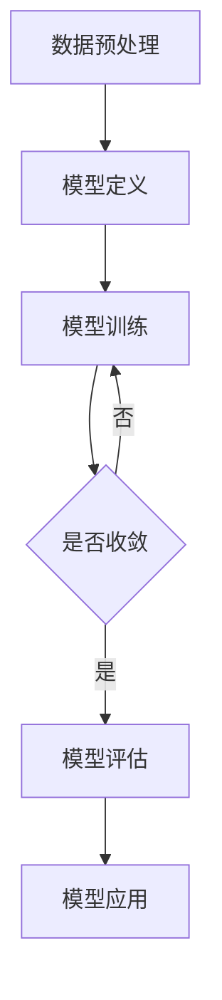

# 人工智能基础原理与代码实战案例讲解

## 1. 背景介绍
### 1.1 问题的由来
人工智能(Artificial Intelligence, AI)自1956年达特茅斯会议正式提出以来,经过70多年的发展,已经取得了巨大的进步。从早期的符号主义、专家系统,到上世纪80年代的连接主义和神经网络,再到近年来大放异彩的深度学习和强化学习,人工智能技术不断突破,应用领域日益广泛。当前,人工智能已经渗透到各行各业,成为推动科技进步和社会发展的重要力量。然而,尽管人工智能取得了长足发展,但对于普通大众而言,人工智能仍然是一个充满神秘感的"黑匣子"。人们对人工智能的原理和实现方法缺乏基本的了解,更不用说动手实践和应用了。

### 1.2 研究现状
目前,人工智能相关的科普读物和教程虽然不少,但大多停留在概念性的介绍和泛泛而谈,鲜有深入浅出、理论结合实践的系统性讲解。市面上常见的人工智能教材,要么过于注重数学推导和理论分析,要么只给出代码实现而缺乏原理说明,很难满足人工智能初学者的需求。因此,写一本全面系统地介绍人工智能基础原理,并辅以代码实战案例讲解的技术博客和教程,具有重要的意义。

### 1.3 研究意义
本文从人工智能的基本概念出发,系统阐述了人工智能的发展历程、理论基础和关键技术,通过实际的代码案例和项目实践,生动形象地展示人工智能的魅力。本文不仅能够帮助读者深入理解人工智能的原理和方法,掌握人工智能系统开发的基本技能,还能启发读者运用人工智能技术解决实际问题,激发大众对人工智能的兴趣和热情。通过本文的学习,读者可以对人工智能有一个全面的认识,为进一步探索人工智能奇妙的世界打下良好基础。

### 1.4 本文结构
本文主要包括以下几个部分:
- 第1部分介绍了人工智能的研究背景、发展现状和研究意义,并对全文结构做了概述。
- 第2部分系统阐述人工智能的核心概念和关键技术,如机器学习、深度学习、知识表示等。
- 第3部分重点介绍几种常见的人工智能算法,包括监督学习、无监督学习、强化学习等,并通过具体的步骤讲解这些算法的原理和实现。
- 第4部分从数学建模的角度,详细推导人工智能常用的数学模型和公式,并给出一些案例加以分析说明。
- 第5部分通过丰富的代码实例,演示人工智能项目的开发流程和调试方法,帮助读者快速上手实战。
- 第6部分列举人工智能的实际应用场景,展望人工智能未来的发展前景。
- 第7部分推荐了人工智能领域学习和研究的相关资源,包括在线课程、开发工具、论文等。
- 第8部分对全文进行了总结,指出了人工智能未来的发展趋势和面临的挑战。
- 第9部分的附录,解答了人工智能初学者经常遇到的一些问题。

## 2. 核心概念与联系

人工智能是一门融合了计算机科学、数学、哲学、心理学等多个学科的交叉学科。要学好人工智能,首先要了解其核心概念和关键技术。下面我们就来看看人工智能中的一些重要概念:

- 智能主体(Intelligent Agent):能够感知环境并采取行动以实现目标的系统。智能体是人工智能研究的基本对象。
- 机器学习(Machine Learning):使计算机系统能够自动改进性能的方法。通过学习数据集,机器可以掌握数据中蕴含的规律和模式。
- 深度学习(Deep Learning):是机器学习的一个分支,使用类似人脑的多层神经网络结构,能够学习复杂的特征表示。
- 知识表示(Knowledge Representation):将知识转化为计算机可以处理的形式,如本体、语义网络、产生式规则等。
- 自然语言处理(Natural Language Processing):让计算机理解、生成和处理人类语言的技术,如语音识别、机器翻译、情感分析等。
- 计算机视觉(Computer Vision):使计算机能够从图像或视频中获取信息,如目标检测、人脸识别、图像分割等。

这些概念之间并非孤立,而是相互关联、相互渗透的。比如,深度学习是机器学习的一个重要分支,广泛应用于计算机视觉、自然语言处理等领域。知识表示是实现智能系统推理和决策的基础。智能体则借助机器学习等技术,通过与环境的交互来优化自身的策略和行为。下面这张Mermaid流程图直观地展示了这些概念之间的联系:

掌握了这些核心概念,就可以进一步探索人工智能的理论基础和关键技术了。

## 3. 核心算法原理 & 具体操作步骤
### 3.1 算法原理概述
人工智能的核心是让机器具备自主学习和智能决策的能力。为了实现这一目标,人工智能领域发展出了多种学习范式和优化算法。按照学习方式的不同,机器学习算法可以分为:

- 监督学习(Supervised Learning):通过标注数据训练模型,使其能够对新样本做出正确预测。代表算法有决策树、支持向量机、神经网络等。
- 无监督学习(Unsupervised Learning):从无标注数据中发现隐含的结构和关系。代表算法有聚类、降维、关联规则挖掘等。
- 强化学习(Reinforcement Learning):通过与环境的交互,使智能体学会采取最优策略以获得最大奖励。代表算法有Q学习、策略梯度等。
- 半监督学习(Semi-supervised Learning):同时利用少量标注数据和大量无标注数据,提高模型的泛化能力。
- 迁移学习(Transfer Learning):将一个领域学到的知识迁移到另一个相关领域,加速学习过程。

除此之外,人工智能还涉及优化理论、博弈论、因果推断等诸多理论基础。优化理论为模型训练提供了高效的数值计算方法,如梯度下降、牛顿法、拟牛顿法等。博弈论刻画了多个理性行为主体之间的策略选择和相互博弈,在对抗学习、机制设计等方面有重要应用。因果推断则致力于发现数据背后的因果关系,这对于解释模型行为、避免数据偏差等至关重要。

### 3.2 算法步骤详解
下面我们以监督学习中的线性回归算法为例,详细讲解其原理和实现步骤。

线性回归是一种简单但非常实用的机器学习算法。它的基本思想是:假设输入变量x和输出变量y之间存在线性关系,通过最小化误差平方和来求解最优的模型参数。具体来说,对于一组训练样本$\{(x_1,y_1), (x_2,y_2), ..., (x_n,y_n)\}$,线性回归模型可以表示为:

$$h_{\theta}(x)=\theta_0+\theta_1x_1+...+\theta_dx_d$$

其中,$\theta_0,\theta_1,...,\theta_d$为模型参数,$d$为输入特征的维度。为了求解最优参数,我们定义如下的损失函数:

$$J(\theta)=\frac{1}{2m}\sum_{i=1}^{m}(h_{\theta}(x^{(i)})-y^{(i)})^2$$

损失函数衡量了模型预测值与真实值之间的差异。我们的目标是找到使损失函数最小化的参数$\theta$。这可以通过梯度下降法来实现:

$$\theta_j:=\theta_j-\alpha\frac{1}{m}\sum_{i=1}^{m}(h_{\theta}(x^{(i)})-y^{(i)})x_j^{(i)}$$

其中,$\alpha$为学习率,$j=0,1,...,d$。重复迭代上述更新规则,直到损失函数收敛或达到预设的迭代次数。

线性回归的具体步骤如下:
1. 数据预处理:对数据进行清洗、缺失值处理、特征缩放等。
2. 模型定义:确定模型的类型(如普通线性回归、岭回归等),初始化模型参数。
3. 模型训练:采用梯度下降等优化算法,迭代更新模型参数以最小化损失函数。
4. 模型评估:在测试集上评估模型的性能,计算均方误差、R平方等指标。
5. 模型应用:使用训练好的模型对新样本进行预测。

以下是线性回归算法的基本流程图:

### 3.3 算法优缺点
线性回归的优点包括:
- 简单易懂,计算开销小,适合大规模数据集。
- 模型可解释性强,回归系数直接反映变量的影响。
- 能够外推,对未知数据也有一定的预测能力。

但线性回归也存在一些局限:
- 只能拟合线性关系,对非线性数据拟合效果差。
- 对异常值和离群点敏感,容易受其影响。
- 当特征维度远大于样本数时,容易过拟合。

针对线性回归的不足,人们发展出了一系列改进算法,如多项式回归、局部加权回归、逻辑回归等,以适应不同的数据特点和任务需求。

### 3.4 算法应用领域
线性回归在工业界有着广泛的应用,如:
- 市场趋势预测:根据历史销售数据、经济指标等因素预测未来市场需求。
- 房价估算:利用房屋的位置、面积、房龄等特征预测房屋价格。
- 药物研发:通过分子描述符预测候选药物的活性或毒性。
- 能源负荷预测:结合气象、历史用电量等数据预测电力负荷。

线性回归通常用于连续型变量的预测。对于分类问题,可以使用逻辑回归等算法。对于时间序列预测,可以考虑自回归模型、ARIMA等专门的方法。

## 4. 数学模型和公式 & 详细讲解 & 举例说明
### 4.1 数学模型构建
线性回归的数学模型可以表示为:

$$y=\theta_0+\theta_1x_1+...+\theta_dx_d+\epsilon$$

其中,$y$为目标变量,$x_1,x_2,...,x_d$为输入特征,$\theta_0,\theta_1,...,\theta_d$为回归系数,$\epsilon$为随机误差项。这里我们假设$\epsilon$服从均值为0、方差为$\sigma^2$的高斯分布,即$\epsilon \sim N(0,\sigma^2)$。

给定一组训练样本$\{(x_1,y_1), (x_2,y_2), ..., (x_n,y_n)\}$,其中$x_i=(x_{i1},x_{i2},...,x_{id})^T$,线性回归的目标是找到一组参数$\theta=(\theta_0,\theta_1,...,\theta_d)^T$,使得模型预测值$\hat{y}_i=\theta^Tx_i$与真实值$y_i$尽可能接近。

为了度量模型的拟合程度,我们引入均方误差(Mean Squared Error,MSE)作为损失函数:

$$J(\theta)=\frac{1}{2m}\sum_{i=1}^{m}(\theta^Tx^{(i)}-y^{(i)})^2$$

最小化损失函数等价于对参数$\theta$进行极大似然估计。

### 4.2 公式推导过程
对损失函数$J