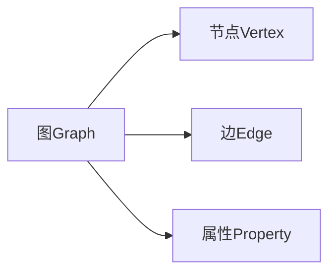
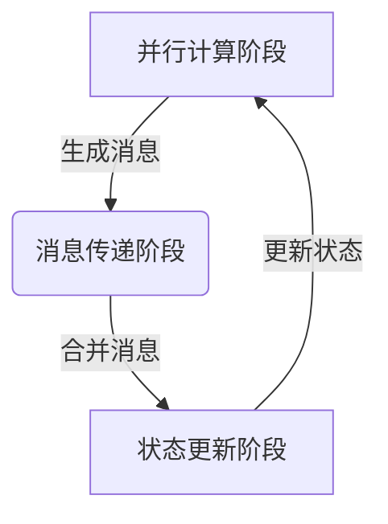
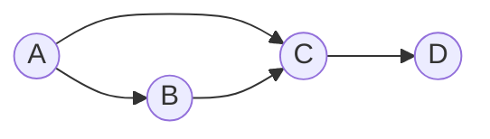

# 图计算引擎的核心概念:图与节点

## 1. 背景介绍

### 1.1 问题的由来

在当今大数据时代,海量的复杂关系数据正在不断涌现,传统的关系型数据库和NoSQL数据库在处理这些数据时遇到了诸多挑战。为了更高效地存储和计算这些关系数据,图数据库(Graph Database)应运而生。图数据库使用图(Graph)这一数学概念来表示数据之间的关系,非常适合描述复杂的关联关系。

随着图数据库的兴起,图计算引擎(Graph Computing Engine)作为支持图数据处理的核心组件,受到了广泛关注。图计算引擎能够高效地执行图查询、图分析和图算法等操作,成为了图数据库的核心计算能力。

### 1.2 研究现状

目前,已有多种图计算引擎问世,如Apache Giraph、Apache Spark GraphX、GPU加速的Gunrock等。这些引擎在图数据处理性能、可扩展性、编程模型等方面各有特色。

然而,现有图计算引擎在处理大规模图数据时仍面临诸多挑战,如内存开销大、计算性能低下、编程模型复杂等。因此,设计一种高效、易用的图计算引擎,成为了当前研究的热点课题。

### 1.3 研究意义

图计算引擎的性能直接决定了图数据库的计算能力,对于提升大数据分析、社交网络挖掘、知识图谱构建等应用的处理效率至关重要。研究高性能图计算引擎,不仅可以推动图数据库技术的发展,还将为众多依赖图计算的应用领域带来重大价值。

### 1.4 本文结构

本文将系统地介绍图计算引擎的核心概念和关键技术,内容安排如下:

1. 背景介绍
2. 核心概念与联系
3. 核心算法原理与具体操作步骤
4. 数学模型和公式详细讲解与案例分析
5. 项目实践:代码实例和详细解释
6. 实际应用场景
7. 工具和资源推荐
8. 总结:未来发展趋势与挑战
9. 附录:常见问题与解答

## 2. 核心概念与联系

在深入探讨图计算引擎的细节之前,我们有必要先理解两个最基本也是最核心的概念:图(Graph)和节点(Vertex)。

### 2.1 图(Graph)

图是一种数学概念,由一组节点(顶点)和连接这些节点的边(边)组成。在图计算引擎中,图被用来表示复杂的关系数据。

图具有以下几个关键属性:

- 节点(Vertex)集合
- 边(Edge)集合
- 每条边连接两个节点
- 节点和边可携带属性(Property)信息

根据边是否有方向,图可分为无向图和有向图两种。

### 2.2 节点(Vertex)

节点是构成图的基本单元,用于表示实体对象。每个节点都可以携带任意属性信息,如ID、名称、类型等。

在图计算过程中,节点常常作为计算的起点或终点,并根据特定算法在图上传递消息、更新状态。因此,节点的设计直接影响了图计算的效率和可扩展性。

### 2.3 边(Edge)

边是连接两个节点的线,用于表示节点之间的关系。每条边也可以携带属性信息,如关系类型、权重等。

边的存在使得图计算引擎可以高效地遍历图数据,发现节点之间的关联模式。不同类型的边可支持不同的计算操作,如最短路径查找、关联规则挖掘等。

### 2.4 属性(Property)

属性是附加在节点和边上的键值对信息,用于描述节点/边的特征。属性的引入使得图能够表达更加丰富的语义信息。

在图计算中,属性常被用作计算的条件或结果,如根据节点属性过滤、根据边属性聚合等。合理利用属性可以极大提高图计算的灵活性和效率。

### 2.5 核心概念的联系

图、节点、边和属性这四个核心概念相互关联、相辅相成:

- 图是最顶层的概念,包含了节点和边的集合
- 节点是图的基本单元,每个节点可以连接多条边
- 边连接两个节点,表示它们之间的关系
- 节点和边都可以携带任意属性信息,丰富了图的语义

这四个概念共同构建了图数据模型的框架,为图计算引擎提供了数据基础。掌握了这些概念,我们就能更好地理解和使用图计算引擎。

## 3. 核心算法原理与具体操作步骤

### 3.1 算法原理概述

图计算引擎的核心是一组分布式图算法,用于高效地处理大规模图数据。其中,最著名和最广泛使用的是"顺次迭代"(Bulk Synchronous Parallel,BSP)计算模型。

BSP模型将图计算任务划分为一系列超步(Superstep),每个超步包含以下三个阶段:

1. **并行计算阶段**: 每个节点并行执行用户定义的计算逻辑,如根据节点的当前状态生成消息。
2. **消息传递阶段**: 系统跨节点传递并合并消息。
3. **状态更新阶段**: 每个节点根据收到的消息更新自身状态。

这三个阶段循环执行,直到满足终止条件(如没有新消息或达到最大迭代次数)。BSP模型通过将计算和通信分离,实现了高效的并行图计算。

### 3.2 算法步骤详解

我们以经典的PageRank算法为例,具体展示BSP模型在图计算中的工作流程:

1. **初始化阶段**:为每个网页节点赋予初始的PageRank值(如1/N,N为网页总数)。

2. **迭代计算阶段**:
    - **并行计算阶段**: 每个节点根据当前PageRank值,计算出"贡献值",并将贡献值作为消息发送给所有出边的目标节点。
    - **消息传递阶段**: 系统收集并合并所有发往同一目标节点的消息。
    - **状态更新阶段**: 每个节点根据收到的消息,重新计算自身的PageRank值。

3. **终止条件检查**:检查是否达到终止条件(如PageRank值收玩或达到最大迭代次数)。如果未达到,进入下一次迭代。

4. **输出结果**:当达到终止条件时,输出每个节点的最终PageRank值作为计算结果。

PageRank算法的核心思想是通过网页之间的链接传递权重,并进行迭代直至收敛。BSP模型使该算法可以高效并行执行,大大提升了计算性能。

### 3.3 算法优缺点

BSP模型的优点:

- **高度并行**: 每个超步中,所有节点可以并行执行计算,充分利用分布式系统的计算能力。
- **容错性强**: 由于计算和通信是分离的,单个节点的失败不会影响全局计算。
- **通用性强**: 可以用于实现各种图算法,如PageRank、最短路径、连通分量等。

BSP模型的缺点:

- **通信开销大**: 每个超步都需要进行全局通信,当图数据规模很大时,通信成本会急剧上升。
- **收敛速度慢**: 对于某些算法,BSP模型需要大量迭代才能收敛,导致计算时间过长。
- **内存占用高**: 每个节点需要维护完整的图数据结构,对内存要求较高。

### 3.4 算法应用领域

BSP模型及其衍生的图计算算法被广泛应用于以下领域:

- **网页排序**: 以PageRank为代表的链接分析算法,用于提高网页搜索质量。
- **社交网络分析**: 检测社交网络中的社区结构、传播路径等。
- **推荐系统**: 基于用户行为数据构建图模型,发现用户兴趣相似模式。
- **欺诈检测**: 通过分析金融交易网络图,识别出异常欺诈行为。
- **交通规划**: 在道路网络图上计算最短路径、交通流量等。
- **生物信息学**: 分析蛋白质互作网络、基因调控网络等。

总的来说,任何涉及关系数据的领域都可以使用图计算技术,从中发现有价值的模式和洞见。

## 4. 数学模型和公式详细讲解与举例说明

### 4.1 数学模型构建

为了形式化描述图计算问题,我们需要先构建图的数学模型。一个图G可以表示为:

$$G=(V, E)$$

其中:
- $V$ 是节点集合,包含图中所有节点 $V=\{v_1,v_2,...,v_n\}$
- $E$ 是边集合,包含图中所有边 $E=\{e_1,e_2,...,e_m\}$

每条边 $e=(u,v)$ 连接两个节点 $u,v\in V$。如果是无向图,则 $(u,v)$ 等价于 $(v,u)$。

我们还可以为节点和边引入属性:

- 节点属性函数: $\phi_V: V \rightarrow \Sigma_V$
- 边属性函数: $\phi_E: E \rightarrow \Sigma_E$

其中 $\Sigma_V$ 和 $\Sigma_E$ 分别是节点属性和边属性的值域。

### 4.2 公式推导过程

基于上述图模型,我们可以将图计算问题形式化为在图 $G$ 上定义的函数:

$$f: (V, E, \phi_V, \phi_E) \rightarrow \Sigma$$

其中 $\Sigma$ 是函数值域,用于存放计算结果。

以PageRank算法为例,我们需要计算每个节点的PageRank值,即:

$$PR(v) = \frac{1-d}{N} + d\sum_{u\in M(v)}\frac{PR(u)}{L(u)}$$

- $PR(v)$ 是节点 $v$ 的PageRank值
- $d$ 是阻尼系数,通常取值0.85
- $N$ 是图中节点总数
- $M(v)$ 是指向节点 $v$ 的所有节点集合
- $L(u)$ 是节点 $u$ 的出边数量

该公式的基本思路是:
1. 所有节点初始拥有相同的权重 $\frac{1}{N}$
2. 节点 $v$ 的最终权重是其初始权重,加上从所有入边节点 $u$ 传递过来的 $\frac{PR(u)}{L(u)}$ 的总和

通过迭代计算,直至所有节点的PageRank值收敛。

### 4.3 案例分析与讲解

我们用一个简单的示例图来演示PageRank算法:

1. 初始化: 假设图中共有4个节点,它们的初始PageRank值都是0.25
2. 第一次迭代:
    - A节点向B和C各贡献0.25/2=0.125
    - B节点向C贡献0.25
    - C节点向D贡献0.25
    - 各节点接收到的PR值:A(0),B(0.125),C(0.125+0.25+0.125)=0.5,D(0.25)
3. 第二次迭代:
    - A节点向B和C各贡献0/2=0
    - B节点向C贡献0.125
    - C节点向D贡献0.5
    - 各节点接收到的PR值:A(0),B(0),C(0+0.125)=0.125,D(0.5+0)=0.5
4. 第三次迭代后各节点PR值不再变化,算法收敛

最终结果是:
- $PR(A)=0$
- $PR(B)=0$
- $PR(C)=0.125$
- $PR(D)=0.5$

我