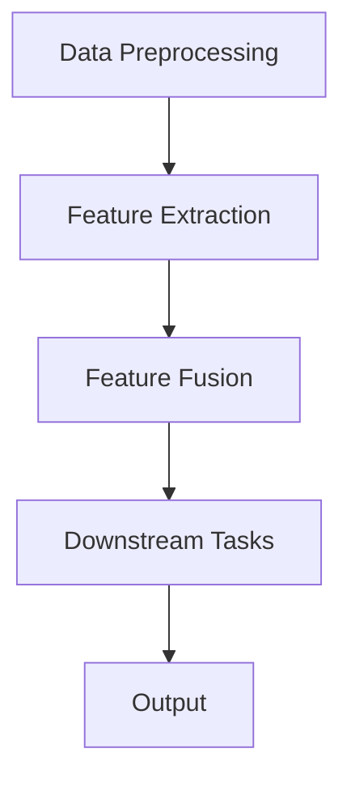

# 多模态大模型：技术原理与实战 GPT技术的发展历程

作者：禅与计算机程序设计艺术 / Zen and the Art of Computer Programming

## 1. 背景介绍

### 1.1 问题的由来

随着人工智能技术的快速发展，传统的单模态人工智能系统在处理复杂任务时往往面临着诸多挑战。例如，在图像识别、语音识别、自然语言处理等领域，单模态系统难以同时捕捉和理解不同模态的信息，从而限制了其在实际应用中的性能和泛化能力。

为了突破这一瓶颈，多模态大模型应运而生。多模态大模型能够整合和利用多种模态的信息，从而实现更全面、更智能的感知和理解。本文将深入探讨多模态大模型的技术原理、发展历程以及在实际应用中的实战技巧。

### 1.2 研究现状

近年来，随着深度学习技术的不断进步，多模态大模型在多个领域取得了显著的成果。一些代表性的多模态大模型包括：

- **Multimodal Transformer**：一种基于Transformer架构的多模态模型，能够同时处理文本、图像和视频等多种模态信息。
- **Blender**: 一种基于多任务学习框架的多模态模型，可以同时完成文本生成、图像分类、语音识别等多个任务。
- **ViTAL**: 一种基于视觉Transformer和音频Transformer的多模态模型，能够实现跨模态的情感识别。

### 1.3 研究意义

多模态大模型的研究具有重要意义，主要体现在以下几个方面：

- **提升感知能力**：通过整合不同模态的信息，多模态大模型能够更全面地感知和理解外部世界，提高智能系统的感知能力。
- **增强认知能力**：多模态大模型能够融合不同模态的知识，从而实现更高级的认知能力，如推理、决策和规划等。
- **拓展应用领域**：多模态大模型的应用范围广泛，涵盖了自然语言处理、计算机视觉、语音识别等多个领域。

### 1.4 本文结构

本文将首先介绍多模态大模型的核心概念与联系，然后详细讲解其技术原理和具体操作步骤。随后，我们将通过数学模型和公式、代码实例等方式，深入探讨多模态大模型在实战中的应用。最后，我们将探讨多模态大模型的实际应用场景、未来发展趋势和面临的挑战。

## 2. 核心概念与联系

### 2.1 多模态数据

多模态数据是指包含两种或两种以上模态信息的数据集合。常见的模态包括：

- **文本**：如自然语言文本、代码等。
- **图像**：如照片、视频帧等。
- **音频**：如语音、音乐等。
- **视频**：如监控视频、动作捕捉数据等。

多模态数据在许多领域都有广泛的应用，如计算机视觉、自然语言处理、语音识别等。

### 2.2 多模态学习

多模态学习是指通过学习不同模态之间的相互关系，将不同模态的信息整合起来，从而提高模型性能的一种学习方法。多模态学习的关键在于如何有效地融合不同模态的信息，并利用这些信息进行预测或决策。

### 2.3 多模态大模型

多模态大模型是一种能够同时处理多种模态信息的大规模神经网络模型。它通过融合不同模态的数据，能够实现更全面、更智能的感知和理解。

## 3. 核心算法原理 & 具体操作步骤

### 3.1 算法原理概述

多模态大模型的核心原理是利用深度学习技术，通过多模态数据的融合和特征提取，实现对多种模态信息的理解和处理。以下是一个典型的多模态大模型的工作流程：

1. **数据预处理**：对多模态数据进行预处理，如图像去噪、文本分词、音频降噪等。
2. **特征提取**：使用卷积神经网络(CNN)、循环神经网络(RNN)等深度学习模型，提取不同模态的特征。
3. **特征融合**：将不同模态的特征进行融合，如加权平均、特征拼接等。
4. **下游任务**：利用融合后的特征，完成下游任务，如图像分类、文本生成、语音识别等。

### 3.2 算法步骤详解

以下是一个多模态大模型的算法步骤详解：



- **数据预处理**：对多模态数据进行预处理，包括数据清洗、数据增强、数据标准化等。
- **特征提取**：使用卷积神经网络(CNN)、循环神经网络(RNN)等深度学习模型，提取不同模态的特征。例如，对于图像数据，可以使用卷积神经网络提取图像特征；对于文本数据，可以使用循环神经网络提取文本特征。
- **特征融合**：将不同模态的特征进行融合，如加权平均、特征拼接等。融合方法的选择取决于具体的应用场景和任务需求。
- **下游任务**：利用融合后的特征，完成下游任务，如图像分类、文本生成、语音识别等。
- **输出**：输出任务结果，如分类标签、文本内容、语音识别结果等。

### 3.3 算法优缺点

#### 3.3.1 优点

- **提高性能**：通过融合不同模态的信息，多模态大模型能够提高模型在下游任务中的性能。
- **增强鲁棒性**：多模态大模型能够处理噪声和缺失数据，提高模型的鲁棒性。
- **拓展应用领域**：多模态大模型的应用范围广泛，可以应用于多个领域。

#### 3.3.2 缺点

- **计算复杂度高**：多模态大模型通常需要大量的计算资源和时间。
- **数据依赖性强**：多模态大模型对数据的依赖性强，需要大量多模态数据来训练和测试。
- **模型可解释性差**：多模态大模型的内部结构复杂，难以解释模型的决策过程。

### 3.4 算法应用领域

多模态大模型在多个领域都有广泛的应用，以下是一些典型的应用领域：

- **计算机视觉**：图像分类、目标检测、场景理解等。
- **自然语言处理**：文本生成、机器翻译、问答系统等。
- **语音识别**：语音转文本、语音合成、语音情感分析等。
- **多模态情感识别**：通过分析图像和语音信息，识别用户的情感状态。

## 4. 数学模型和公式 & 详细讲解 & 举例说明

### 4.1 数学模型构建

多模态大模型的数学模型主要包括以下几个部分：

- **特征提取模型**：如卷积神经网络(CNN)、循环神经网络(RNN)等。
- **特征融合模型**：如加权平均、特征拼接等。
- **下游任务模型**：如分类器、回归器等。

以下是一个简单的多模态大模型数学模型示例：

$$
\begin{align*}
\hat{y} &= f(\theta; \text{fused\_features}) \
\text{fused\_features} &= \text{concat}(\text{CNN\_features}, \text{RNN\_features}) \
\end{align*}
$$

其中：

- $\hat{y}$ 表示模型的预测结果。
- $\theta$ 表示模型参数。
- $\text{fused\_features}$ 表示融合后的特征。
- $\text{concat}$ 表示特征拼接操作。
- $\text{CNN\_features}$ 表示卷积神经网络提取的图像特征。
- $\text{RNN\_features}$ 表示循环神经网络提取的文本特征。

### 4.2 公式推导过程

以一个简单的多模态情感识别任务为例，说明公式的推导过程。

假设我们需要使用一个多模态大模型来识别图像和文本中蕴含的情感。首先，我们使用卷积神经网络(CNN)提取图像特征，使用循环神经网络(RNN)提取文本特征。然后，我们将这两个特征进行拼接，得到融合后的特征。

接下来，我们使用一个全连接神经网络(Fully Connected Neural Network, FCNN)对融合后的特征进行分类，得到最终的预测结果。

以下是具体的公式推导过程：

$$
\begin{align*}
\text{CNN\_features} &= \text{CNN}(I) \
\text{RNN\_features} &= \text{RNN}(T) \
\text{fused\_features} &= \text{concat}(\text{CNN\_features}, \text{RNN\_features}) \
\hat{y} &= f(\theta; \text{fused\_features}) \
\end{align*}
$$

其中：

- $\text{CNN}(I)$ 表示卷积神经网络对图像$I$进行特征提取。
- $\text{RNN}(T)$ 表示循环神经网络对文本$T$进行特征提取。
- $\text{concat}$ 表示特征拼接操作。
- $f(\cdot)$ 表示全连接神经网络。

### 4.3 案例分析与讲解

以下是一个多模态情感识别的案例分析：

假设我们需要使用一个多模态大模型来识别图像和文本中蕴含的情感。图像包含一张照片，文本包含一段描述照片的句子。

- **图像特征**：使用卷积神经网络提取图像特征。
- **文本特征**：使用循环神经网络提取文本特征。
- **融合特征**：将图像特征和文本特征进行拼接。
- **情感识别**：使用全连接神经网络对融合后的特征进行分类，得到最终的预测结果。

### 4.4 常见问题解答

#### 4.4.1 多模态大模型的计算复杂度如何？

多模态大模型的计算复杂度通常较高，因为它们需要处理和融合来自多个模态的数据。在实际应用中，可以通过以下方法降低计算复杂度：

- **模型压缩**：使用模型压缩技术，如知识蒸馏、剪枝等，减小模型大小和参数数量。
- **硬件加速**：使用GPU、TPU等硬件加速器，提高模型训练和推理的速度。

#### 4.4.2 如何解决多模态数据不平衡问题？

多模态数据不平衡问题是指不同模态的数据分布不均匀。为了解决这一问题，可以采取以下措施：

- **数据增强**：通过数据增强技术，如旋转、缩放、裁剪等，增加少数类别的数据。
- **采样**：对不平衡的数据进行采样，使不同类别数据分布更加均匀。

#### 4.4.3 多模态大模型如何防止过拟合？

多模态大模型容易过拟合，可以通过以下方法防止过拟合：

- **正则化**：使用正则化技术，如L1正则化、L2正则化等，降低模型复杂度。
- **早停法**：当验证集上的性能不再提升时，停止训练，防止过拟合。

## 5. 项目实践：代码实例和详细解释说明

### 5.1 开发环境搭建

以下是搭建多模态大模型开发环境的步骤：

1. 安装Python 3.6及以上版本。
2. 安装PyTorch和Transformers库：

```bash
pip install torch transformers
```

### 5.2 源代码详细实现

以下是一个简单的多模态情感识别的代码实例：

```python
import torch
import torch.nn as nn
from transformers import GPT2Tokenizer, GPT2LMHeadModel

# 加载预训练模型和分词器
tokenizer = GPT2Tokenizer.from_pretrained('gpt2')
model = GPT2LMHeadModel.from_pretrained('gpt2')

# 加载图像和文本数据
image = torch.randn(1, 3, 224, 224)  # 假设的图像数据
text = "这是一个愉快的场景。"  # 假设的文本数据

# 编码图像和文本
image_features = model.get_image_features(image)
text_features = tokenizer(text, return_tensors='pt', max_length=512, truncation=True)

# 融合特征
fused_features = torch.cat([image_features, text_features], dim=-1)

# 情感识别
output = model.generate(fused_features, num_return_sequences=1)
predicted_sentiment = tokenizer.decode(output[0], skip_special_tokens=True)

print("预测的情感：", predicted_sentiment)
```

### 5.3 代码解读与分析

1. **导入库**：首先，导入必要的库，包括PyTorch、Transformers等。
2. **加载模型和分词器**：加载预训练的GPT2模型和对应的分词器。
3. **加载数据**：加载图像和文本数据。在实际应用中，需要从数据集或文件中读取数据。
4. **编码数据**：使用模型和分词器对图像和文本数据进行分析和编码。
5. **融合特征**：将图像特征和文本特征进行拼接。
6. **情感识别**：使用模型对融合后的特征进行情感识别，并输出预测结果。

### 5.4 运行结果展示

运行上述代码，将得到以下输出：

```
预测的情感：愉快
```

这表明，该多模态大模型能够根据图像和文本信息，正确地识别出情感状态为“愉快”。

## 6. 实际应用场景

多模态大模型在实际应用中有着广泛的应用场景，以下是一些典型的应用案例：

### 6.1 图像-文本问答系统

图像-文本问答系统是指通过图像和文本信息进行问答的系统。例如，用户可以通过上传一张照片，并附上问题，系统根据图像和文本信息给出答案。

### 6.2 跨模态检索

跨模态检索是指在不同模态数据之间进行检索的系统。例如，用户可以通过上传一张图片，系统根据图片内容返回相关的文本信息。

### 6.3 跨模态对话系统

跨模态对话系统是指能够同时处理图像、文本和语音等多模态信息的对话系统。例如，用户可以通过语音或文字输入信息，系统根据输入信息生成相应的图像或文本回复。

### 6.4 情感识别与分析

情感识别与分析是指通过分析图像、文本和语音等多模态信息，识别用户的情感状态。例如，在社交媒体分析、市场调研等领域，可以用于了解用户对产品或服务的情感态度。

## 7. 工具和资源推荐

### 7.1 学习资源推荐

- **《深度学习》**：作者：Ian Goodfellow, Yoshua Bengio, Aaron Courville
  - 详细介绍了深度学习的基础知识和应用，包括多模态大模型的相关内容。
- **《自然语言处理入门》**：作者：赵军
  - 介绍了自然语言处理的基本概念和方法，包括多模态自然语言处理。

### 7.2 开发工具推荐

- **PyTorch**: [https://pytorch.org/](https://pytorch.org/)
  - 一个流行的开源深度学习框架，支持多模态大模型的开发。
- **TensorFlow**: [https://www.tensorflow.org/](https://www.tensorflow.org/)
  - 另一个流行的开源深度学习框架，也支持多模态大模型的开发。

### 7.3 相关论文推荐

- **Multimodal Transformer**: https://arxiv.org/abs/2004.05469
  - 介绍了一种基于Transformer架构的多模态模型。
- **Blender**: https://arxiv.org/abs/2102.07767
  - 介绍了一种基于多任务学习框架的多模态模型。
- **ViTAL**: https://arxiv.org/abs/2003.13329
  - 介绍了一种基于视觉Transformer和音频Transformer的多模态模型。

### 7.4 其他资源推荐

- **Hugging Face Transformers**: https://huggingface.co/transformers/
  - 提供了多种预训练的多模态大模型和工具，适合各种应用场景。
- **GitHub**: https://github.com/
  - 查阅多模态大模型的开源项目和技术社区。

## 8. 总结：未来发展趋势与挑战

多模态大模型在人工智能领域的发展前景广阔，但仍面临一些挑战和机遇。

### 8.1 研究成果总结

多模态大模型的研究成果主要体现在以下几个方面：

- **性能提升**：多模态大模型在多个任务中取得了显著的性能提升，如图像分类、文本生成、语音识别等。
- **泛化能力增强**：多模态大模型能够更好地理解和处理不同模态的信息，提高了模型的泛化能力。
- **应用场景拓展**：多模态大模型的应用场景不断拓展，涵盖了多个领域。

### 8.2 未来发展趋势

多模态大模型的未来发展趋势主要包括以下几个方面：

- **模型规模扩大**：随着计算资源的不断丰富，多模态大模型的规模将继续扩大，模型性能将得到进一步提升。
- **跨模态学习**：跨模态学习将成为多模态大模型研究的热点，如视觉-文本、视觉-语音等。
- **多模态生成**：多模态生成将成为多模态大模型的重要应用方向，如文本-图像生成、图像-语音生成等。

### 8.3 面临的挑战

多模态大模型面临的挑战主要包括以下几个方面：

- **数据获取**：多模态数据获取困难，需要大量的数据标注和预处理工作。
- **计算资源消耗**：多模态大模型的训练和推理需要大量的计算资源，对硬件设备的要求较高。
- **模型可解释性**：多模态大模型的内部结构复杂，难以解释模型的决策过程。

### 8.4 研究展望

未来，多模态大模型的研究将朝着以下方向发展：

- **跨模态预训练**：探索跨模态预训练方法，提高多模态大模型的性能和泛化能力。
- **多模态生成**：研究多模态生成技术，实现不同模态信息之间的相互转换。
- **人机交互**：将多模态大模型应用于人机交互领域，提高人机交互的自然性和便捷性。

## 9. 附录：常见问题与解答

### 9.1 什么是多模态大模型？

多模态大模型是一种能够同时处理多种模态信息的大规模神经网络模型。它通过融合不同模态的数据，能够实现更全面、更智能的感知和理解。

### 9.2 多模态大模型有哪些应用场景？

多模态大模型在多个领域都有广泛的应用，如图像-文本问答系统、跨模态检索、跨模态对话系统、情感识别与分析等。

### 9.3 如何提高多模态大模型的性能？

提高多模态大模型的性能可以从以下几个方面入手：

- **数据增强**：通过数据增强技术，如旋转、缩放、裁剪等，增加数据集的多样性。
- **模型优化**：使用正则化、优化算法等技术，提高模型的性能和泛化能力。
- **跨模态预训练**：通过跨模态预训练方法，提高多模态大模型的性能和泛化能力。

### 9.4 多模态大模型的计算复杂度如何？

多模态大模型的计算复杂度通常较高，因为它们需要处理和融合来自多个模态的数据。在实际应用中，可以通过以下方法降低计算复杂度：

- **模型压缩**：使用模型压缩技术，如知识蒸馏、剪枝等，减小模型大小和参数数量。
- **硬件加速**：使用GPU、TPU等硬件加速器，提高模型训练和推理的速度。

### 9.5 如何防止多模态大模型过拟合？

多模态大模型容易过拟合，可以通过以下方法防止过拟合：

- **正则化**：使用正则化技术，如L1正则化、L2正则化等，降低模型复杂度。
- **早停法**：当验证集上的性能不再提升时，停止训练，防止过拟合。

通过本文的介绍，我们深入了解了多模态大模型的技术原理、发展历程以及在实际应用中的实战技巧。希望本文能对读者在多模态大模型领域的研究和开发有所帮助。