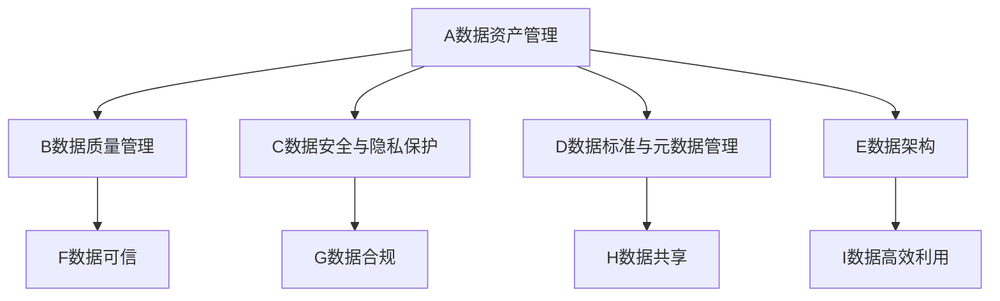

# 数据治理与数据治理人才培养

关键词：数据治理、数据资产管理、数据质量、数据安全、数据治理人才

## 1. 背景介绍

### 1.1  问题的由来
在当今数字化时代,数据已成为企业的核心资产之一。然而,许多组织在管理和利用数据方面仍面临诸多挑战,如数据孤岛、数据质量差、数据安全隐患等。这些问题严重制约了企业数字化转型的进程,亟需建立科学有效的数据治理体系。

### 1.2  研究现状
目前,国内外学术界和业界对数据治理的研究日益深入。一些大型企业如阿里、腾讯等已开始探索数据治理实践,并取得了初步成效。但总体而言,数据治理在国内尚处于起步阶段,缺乏成熟的理论指导和实践经验。

### 1.3  研究意义
深入研究数据治理,对于提升组织数据管理水平、释放数据价值、支撑数字化转型具有重要意义。同时,培养一批懂技术、懂业务、懂管理的复合型数据治理人才,是推动数据治理落地的关键。

### 1.4  本文结构
本文将从数据治理的核心概念出发,阐述数据治理的主要内容和关键技术,并重点探讨数据治理人才培养的途径。全文共分为9个部分,主要内容包括:

1. 背景介绍
2. 核心概念与联系
3. 核心算法原理与具体操作步骤
4. 数学模型和公式详细讲解与举例说明
5. 项目实践:代码实例和详细解释说明
6. 实际应用场景
7. 工具和资源推荐
8. 总结:未来发展趋势与挑战
9. 附录:常见问题与解答

## 2. 核心概念与联系

数据治理的核心概念包括:
- 数据资产管理:将数据视为企业的战略资产,全生命周期管理数据,提升数据价值。
- 数据质量管理:从完整性、准确性、一致性等维度,持续提升数据质量,确保数据可用、可信。
- 数据安全与隐私保护:制定数据分级分类、数据脱敏等策略,防范数据泄露和不当使用。
- 数据标准与元数据管理:建立统一的数据标准规范和元数据,打通数据孤岛,促进数据共享。
- 数据架构:规划数据架构蓝图,合理配置数据存储、计算、服务等资源。

这些概念环环相扣,共同构成了数据治理的核心内容。其内在联系可用下图表示:



只有系统规划、综合施策,才能真正实现对数据全生命周期的有效管控,充分发挥数据价值。

## 3. 核心算法原理 & 具体操作步骤

### 3.1 算法原理概述
数据治理涉及诸多算法,如数据质量检测、数据脱敏、主数据识别、元数据抽取等。这里重点介绍数据质量检测的相关算法。

数据质量检测的目标是发现数据中存在的质量问题,如完整性、唯一性、有效性等。常用的算法包括:
- 字段完整性检查:判断字段是否为空、是否符合长度要求等。
- 取值唯一性检查:判断字段取值是否唯一。
- 取值有效性检查:判断字段取值是否在规定的范围内。
- 逻辑一致性检查:判断不同字段之间的逻辑关系是否正确。

### 3.2 算法步骤详解
以字段完整性检查为例,详细说明算法步骤:

1. 输入:数据表 $D$,待检查字段列表 $F$,完整性阈值 $\alpha$
2. 对于 $F$ 中的每个字段 $f_i$,执行3-6步
3. 计算 $f_i$ 的非空值数量 $n_i$
4. 计算 $f_i$ 的总行数 $m_i$
5. 计算 $f_i$ 的完整性指标 $p_i=\frac{n_i}{m_i}$
6. 若 $p_i<\alpha$,则认为 $f_i$ 存在完整性问题,记录下来
7. 输出:所有存在完整性问题的字段列表 $F'$

其他几类检查算法的思路与之类似,区别在于完整性判断条件不同。

### 3.3 算法优缺点
数据质量检测算法的优点是:
- 思路清晰,易于实现
- 可解释性强,便于定位问题
- 通用性好,可灵活适配不同数据场景

但也存在一些局限:
- 检测规则需要人工定义,工作量大
- 无法发现未知的隐藏质量问题
- 对于海量数据,检测效率有待提升

### 3.4 算法应用领域
数据质量检测算法在数据治理中应用广泛,可用于:
- 数据准入质量把关
- 数据清洗
- 数据资产盘点
- 数据质量考核
- ...

通过持续开展数据质量检测,不断提升数据质量,为后续数据应用奠定基础。

## 4. 数学模型和公式 & 详细讲解 & 举例说明

### 4.1 数学模型构建
为精准评估数据质量水平,需要构建数据质量评估模型。设数据表 $D$ 有 $m$ 个纪录、$n$ 个字段,定义数据质量分数为:

$$Q(D)=\sum_{i=1}^n w_i q_i$$

其中:
- $w_i$ 表示第 $i$ 个字段的权重,$\sum_{i=1}^n w_i=1$
- $q_i$ 表示第 $i$ 个字段的质量分数,介于0到1之间,由完整性、唯一性、有效性等指标加权平均得到

### 4.2 公式推导过程
以完整性指标为例,推导 $q_i$ 的计算公式:

设第 $i$ 个字段共有 $m_i$ 个记录,其中非空值有 $x_i$ 个,则完整性指标为:

$$c_i=\frac{x_i}{m_i}$$

类似地,可以定义唯一性指标 $u_i$、有效性指标 $v_i$ 等。再赋予适当的权重 $\alpha_j$,得到字段质量分数:

$$q_i=\sum_j \alpha_j q_{ij}, \quad q_{ij} \in \{c_i,u_i,v_i,...\}$$

### 4.3 案例分析与讲解
现有一份客户信息表,共10000行、5个字段,各字段权重 $w_i=0.2$。经检测,各字段质量问题如下:

| 字段   | 完整性 | 唯一性 | 有效性 |
|:-------|:------:|:------:|:------:|
| 客户ID | 100%   | 100%   | 100%   |
| 姓名   | 100%   | 99%    | 100%   |
| 手机号 | 98%    | 100%   | 90%    |
| 邮箱   | 95%    | 100%   | 98%    |
| 地址   | 85%    | 100%   | 100%   |

假设完整性、唯一性、有效性权重分别为 0.5,0.3,0.2。则各字段质量分数为:

$q_1 = 0.5 \times 1 + 0.3 \times 1 + 0.2 \times 1 = 1$
$q_2 \approx 0.5 \times 1 + 0.3 \times 0.99 + 0.2 \times 1 \approx 0.997$
$q_3 = 0.5 \times 0.98 + 0.3 \times 1 + 0.2 \times 0.9 = 0.97$
$q_4 = 0.5 \times 0.95 + 0.3 \times 1 + 0.2 \times 0.98 = 0.971$
$q_5 = 0.5 \times 0.85 + 0.3 \times 1 + 0.2 \times 1 = 0.925$

代入数据质量评估模型,得到该表的数据质量分数:

$$Q = 0.2 \times 1 + 0.2 \times 0.997 + 0.2 \times 0.97 + 0.2 \times 0.971 + 0.2 \times 0.925 \approx 0.973$$

可见,该表的数据质量较高,但仍有进一步提升空间,如改善地址字段的完整性等。

### 4.4 常见问题解答
Q: 数据质量评估中的权重如何确定?
A: 权重反映了不同指标、不同字段对数据质量的重要程度,需要根据数据应用场景,结合专家经验来设定。可采用层次分析法(AHP)等方法,将定性分析与定量计算相结合。

Q: 数据质量评估的频率如何?
A: 数据质量评估的频率取决于数据更新频率、业务需求等因素。一般采取定期+不定期相结合的方式,如每日一次全量评估,每次数据更新后再触发增量评估。

Q: 如何利用数据质量评估结果?
A: 数据质量评估可以帮助发现数据质量短板,进而有针对性地开展数据治理工作。例如,对质量分数低的字段,可以进行重点清洗;对多次出现质量问题的数据源,可以约谈数据提供方;将质量评估结果与绩效考核挂钩,以提高各方重视程度。

## 5. 项目实践：代码实例和详细解释说明

### 5.1 开发环境搭建
本项目采用Python语言,使用Pandas库进行数据处理。首先安装必要的依赖包:

```bash
pip install pandas
pip install numpy
```

### 5.2 源代码详细实现
定义数据质量检测函数:

```python
import pandas as pd
import numpy as np

def check_integrity(df, cols, threshold=0.9):
    """
    检查字段完整性
    :param df: 数据框
    :param cols: 待检查的字段列表
    :param threshold: 完整性阈值,默认为0.9
    :return: 完整性未达标的字段列表
    """
    res = []
    for col in cols:
        ratio = df[col].count() / len(df)
        if ratio < threshold:
            res.append(col)
    return res

def check_uniqueness(df, cols):
    """
    检查字段唯一性
    :param df: 数据框
    :param cols: 待检查的字段列表
    :return: 唯一性未达标的字段列表
    """
    res = []
    for col in cols:
        if df[col].nunique() < len(df):
            res.append(col)
    return res

def check_validity(df, cols, criterion):
    """
    检查字段有效性
    :param df: 数据框
    :param cols: 待检查的字段列表
    :param criterion: 有效性判断条件,以字典形式提供
    :return: 有效性未达标的字段列表
    """
    res = []
    for col in cols:
        if col in criterion:
            num_valid = df[col].apply(lambda x: criterion[col](x)).sum()
            ratio = num_valid / df[col].count()
            if ratio < 1:
                res.append(col)
    return res
```

定义数据质量评估函数:

```python
def evaluate_quality(df, weights, rule):
    """
    评估数据框的整体质量
    :param df: 数据框
    :param weights: 各字段的权重,以字典形式提供
    :param rule: 各字段的检查规则,以字典形式提供,包括完整性、唯一性、有效性检查相关参数
    :return: 数据质量分数
    """
    score = 0
    for col, w in weights.items():
        q = 1
        if "completeness" in rule[col]:
            q *= (1 - len(check_integrity(df, [col], rule[col]["completeness"])) > 0)
        if "uniqueness" in rule[col]:
            q *= (1 - len(check_uniqueness(df, [col])) > 0)
        if "validity" in rule[col]:
            q *= (1 - len(check_validity