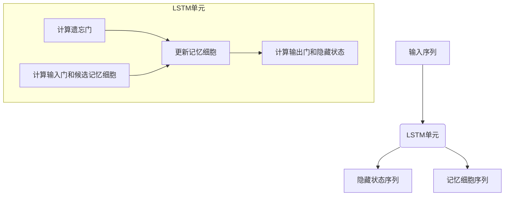

好的,我会按照您的要求,以《长短时记忆网络 (LSTM) 原理与代码实例讲解》为主题,遵循约束条件,写一篇高质量的技术博客文章。

# 长短时记忆网络 (LSTM) 原理与代码实例讲解

## 1. 背景介绍

### 1.1 问题的由来

在自然语言处理、语音识别、机器翻译等序列数据处理任务中,传统的神经网络模型如前馈神经网络和卷积神经网络在处理长序列数据时存在一些问题。这些模型无法很好地捕捉序列数据中长期的依赖关系,容易出现梯度消失或梯度爆炸的问题,导致模型性能下降。

为了解决这个问题,1997年,Hochreiter和Schmidhuber提出了长短时记忆网络(Long Short-Term Memory, LSTM)。LSTM通过引入门控机制和记忆细胞的设计,能够更好地捕捉长期依赖关系,从而在处理长序列数据时表现出色。

### 1.2 研究现状

自从LSTM被提出以来,它在自然语言处理、语音识别、机器翻译等领域取得了巨大的成功。许多知名公司和研究机构都在广泛使用和研究LSTM,例如Google、Facebook、微软、IBM等。同时,也有许多改进版本的LSTM被提出,如GRU(门控循环单元)、双向LSTM等,进一步提高了模型的性能。

### 1.3 研究意义

LSTM的出现为序列数据处理任务带来了革命性的变化。它能够有效捕捉长期依赖关系,克服了传统神经网络模型的局限性。研究LSTM的原理和实现方式,对于深入理解序列数据建模、提高模型性能具有重要意义。

此外,LSTM也为其他领域的研究带来了启发,例如视频理解、时间序列预测等,都可以借鉴LSTM的思想来设计新的模型架构。

### 1.4 本文结构

本文将从以下几个方面全面介绍LSTM:

1. 核心概念与联系
2. 核心算法原理与具体操作步骤
3. 数学模型和公式详细讲解与案例分析
4. 项目实践:代码实例和详细解释说明
5. 实际应用场景
6. 工具和资源推荐
7. 总结:未来发展趋势与挑战
8. 附录:常见问题与解答

## 2. 核心概念与联系

在介绍LSTM的核心概念之前,我们先简单回顾一下传统的循环神经网络(Recurrent Neural Network, RNN)。

RNN是一种用于处理序列数据的神经网络模型,它通过在隐藏层之间建立循环连接来捕捉序列数据中的动态行为。然而,传统的RNN在处理长序列数据时存在梯度消失或梯度爆炸的问题,导致无法很好地捕捉长期依赖关系。

为了解决这个问题,LSTM引入了三个门控机制(输入门、遗忘门和输出门)和一个记忆细胞,使得网络能够更好地控制信息的流动,从而捕捉长期依赖关系。

LSTM的核心概念包括:

1. **门控机制(Gate Mechanism)**: 包括输入门、遗忘门和输出门,用于控制信息的流动。
2. **记忆细胞(Memory Cell)**: 用于存储长期状态信息。
3. **隐藏状态(Hidden State)**: 表示当前时刻的输出,与记忆细胞共同决定了下一时刻的输出。

LSTM通过有选择地保留或忽略信息,使得网络能够更好地捕捉长期依赖关系,从而在处理长序列数据时表现出色。

接下来,我们将详细介绍LSTM的核心算法原理和具体操作步骤。

## 3. 核心算法原理与具体操作步骤

### 3.1 算法原理概述

LSTM的核心思想是通过门控机制和记忆细胞来控制信息的流动,从而捕捉长期依赖关系。具体来说,LSTM在每个时刻都会根据当前输入和上一时刻的隐藏状态,计算出三个门的值(输入门、遗忘门和输出门),以及一个候选记忆细胞值。

1. **输入门(Input Gate)**: 决定了当前时刻的输入信息有多大程度上被更新到记忆细胞中。
2. **遗忘门(Forget Gate)**: 决定了上一时刻的记忆细胞有多大程度上被保留。
3. **输出门(Output Gate)**: 决定了记忆细胞有多大程度上被用作最终的输出。
4. **候选记忆细胞(Candidate Memory Cell)**: 是一个新的记忆细胞的候选值,它将被部分加入到当前的记忆细胞中。

通过这种门控机制和记忆细胞的设计,LSTM能够有选择地保留或忽略信息,从而捕捉长期依赖关系。

### 3.2 算法步骤详解

LSTM在每个时刻 t 的具体计算步骤如下:

1. **计算遗忘门**: 根据当前输入 $x_t$ 和上一时刻的隐藏状态 $h_{t-1}$,计算遗忘门的值 $f_t$:

$$f_t = \sigma(W_f \cdot [h_{t-1}, x_t] + b_f)$$

其中, $\sigma$ 是sigmoid激活函数, $W_f$ 和 $b_f$ 是遗忘门的权重和偏置。

2. **计算输入门和候选记忆细胞**: 同样根据当前输入 $x_t$ 和上一时刻的隐藏状态 $h_{t-1}$,计算输入门的值 $i_t$ 和候选记忆细胞 $\tilde{C}_t$:

$$i_t = \sigma(W_i \cdot [h_{t-1}, x_t] + b_i)$$
$$\tilde{C}_t = \tanh(W_C \cdot [h_{t-1}, x_t] + b_C)$$

其中, $W_i$、$b_i$、$W_C$ 和 $b_C$ 分别是输入门和候选记忆细胞的权重和偏置。

3. **更新记忆细胞**: 根据遗忘门 $f_t$、输入门 $i_t$ 和候选记忆细胞 $\tilde{C}_t$,更新当前时刻的记忆细胞 $C_t$:

$$C_t = f_t \odot C_{t-1} + i_t \odot \tilde{C}_t$$

其中, $\odot$ 表示元素wise乘积操作。这一步实现了对记忆细胞的选择性更新。

4. **计算输出门和隐藏状态**: 根据当前记忆细胞 $C_t$、当前输入 $x_t$ 和上一时刻的隐藏状态 $h_{t-1}$,计算输出门 $o_t$ 和当前时刻的隐藏状态 $h_t$:

$$o_t = \sigma(W_o \cdot [h_{t-1}, x_t] + b_o)$$
$$h_t = o_t \odot \tanh(C_t)$$

其中, $W_o$ 和 $b_o$ 是输出门的权重和偏置。

通过上述步骤,LSTM就完成了一个时刻的计算,并将隐藏状态 $h_t$ 传递到下一时刻。在处理长序列数据时,LSTM能够通过门控机制和记忆细胞的设计,有选择地保留或忽略信息,从而捕捉长期依赖关系。

下面是LSTM在处理序列数据时的流程图:

### 3.3 算法优缺点

**优点:**

1. **捕捉长期依赖关系**: 通过门控机制和记忆细胞的设计,LSTM能够有选择地保留或忽略信息,从而捕捉长期依赖关系。
2. **缓解梯度消失/爆炸问题**: LSTM通过门控机制控制梯度的流动,有效缓解了传统RNN中的梯度消失或梯度爆炸问题。
3. **广泛应用**: LSTM在自然语言处理、语音识别、机器翻译等序列数据处理任务中表现出色,被广泛应用。

**缺点:**

1. **计算复杂度高**: 相比传统RNN,LSTM的计算量更大,因为它需要计算多个门和记忆细胞。
2. **参数多**: LSTM需要学习更多的参数,包括门控机制和记忆细胞的权重和偏置,这增加了模型的复杂性。
3. **无法并行计算**: LSTM的计算过程是序列化的,无法像卷积神经网络那样进行并行计算,这在一定程度上限制了它的计算效率。

### 3.4 算法应用领域

由于LSTM能够有效捕捉长期依赖关系,因此它在处理序列数据的任务中表现出色,主要应用领域包括:

1. **自然语言处理(NLP)**: 如机器翻译、文本生成、情感分析等。
2. **语音识别**: 将语音信号转换为文本。
3. **时间序列预测**: 如股票预测、天气预报等。
4. **视频理解**: 如行为识别、视频描述等。
5. **手写识别**: 将手写字符转换为文本。
6. **音乐生成**: 根据已有的音乐数据生成新的音乐作品。

除了上述领域,LSTM及其变体还被应用于其他领域,如蛋白质结构预测、机器人控制等,展现出广阔的应用前景。

## 4. 数学模型和公式详细讲解与举例说明

### 4.1 数学模型构建

为了更好地理解LSTM的工作原理,我们需要构建它的数学模型。LSTM的数学模型由以下几个部分组成:

1. **输入门(Input Gate)**: 控制当前输入 $x_t$ 和上一隐藏状态 $h_{t-1}$ 对记忆细胞 $C_t$ 的影响程度。
2. **遗忘门(Forget Gate)**: 控制上一记忆细胞 $C_{t-1}$ 对当前记忆细胞 $C_t$ 的影响程度。
3. **输出门(Output Gate)**: 控制当前记忆细胞 $C_t$ 对隐藏状态 $h_t$ 的影响程度。
4. **记忆细胞(Memory Cell)**: 用于存储长期状态信息。
5. **隐藏状态(Hidden State)**: 表示当前时刻的输出。

我们将使用以下符号表示LSTM中的各个变量:

- $x_t$: 时刻 t 的输入
- $h_t$: 时刻 t 的隐藏状态
- $C_t$: 时刻 t 的记忆细胞
- $f_t$: 时刻 t 的遗忘门
- $i_t$: 时刻 t 的输入门
- $o_t$: 时刻 t 的输出门
- $\tilde{C}_t$: 时刻 t 的候选记忆细胞
- $W$: 权重矩阵
- $b$: 偏置向量

### 4.2 公式推导过程

接下来,我们将详细推导LSTM在每个时刻的计算公式。

1. **计算遗忘门**:

$$f_t = \sigma(W_f \cdot [h_{t-1}, x_t] + b_f)$$

其中, $\sigma$ 是sigmoid激活函数, $W_f$ 和 $b_f$ 是遗忘门的权重和偏置。遗忘门的值介于 0 和 1 之间,决定了上一时刻的记忆细胞 $C_{t-1}$ 有多大程度上被保留。

2. **计算输入门和候选记忆细胞**:

$$i_t = \sigma(W_i \cdot [h_{t-1}, x_t] + b_i)$$
$$\tilde{C}_t = \tanh(W_C \cdot [h_{t-1}, x_t] + b_C)$$

其中, $W_i$、$b_i$、$W_C$ 和 $b_C$ 分别