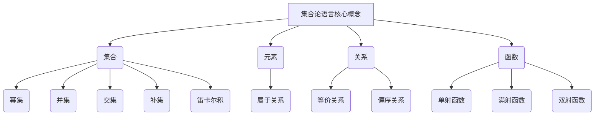

# 集合论导引：集合论语言

## 1. 背景介绍

### 1.1 问题的由来

集合论是数学的一个基础分支,它研究集合的概念、性质和运算。集合论语言作为集合论的形式化表达方式,为集合论的发展奠定了坚实的基础。然而,对于初学者来说,集合论语言的抽象性和严谨性常常令人望而生畏。如何以简单易懂的方式介绍集合论语言,帮助读者逐步建立对集合论的理解,是本文旨在解决的问题。

### 1.2 研究现状

集合论语言的研究可以追溯到19世纪末期,当时数学家们致力于为数学奠定坚实的逻辑基础。Georg Cantor提出了集合论的基本概念,并发展了相关的符号系统。20世纪初,Zermelo-Fraenkel公理系统(ZFC)被广泛接受为集合论的公理化基础。此后,集合论语言的研究主要集中在公理系统的完整性、一致性和无矛盾性等方面。

### 1.3 研究意义

集合论语言不仅是集合论本身的基础,也是数学逻辑、计算机科学等许多领域的基石。掌握集合论语言有助于我们更好地理解和运用集合论的概念,并将其应用于实际问题的求解。此外,集合论语言的严谨性和抽象性也培养了我们的逻辑思维能力,对于提高编程能力和解决复杂问题都有着重要意义。

### 1.4 本文结构

本文将从集合论语言的基本概念出发,循序渐进地介绍其核心内容。首先,我们将探讨集合论语言的核心概念及其相互关系。然后,详细阐述集合论语言的核心算法原理和具体操作步骤。接下来,我们将构建数学模型并推导相关公式,并通过案例分析加深理解。此外,还将提供项目实践中的代码实例和详细解释。最后,我们将探讨集合论语言在实际应用场景中的作用,并总结未来的发展趋势和挑战。

## 2. 核心概念与联系



集合论语言的核心概念包括集合、元素、关系和函数。这些概念相互关联,构成了集合论语言的基础框架。

1. **集合**是集合论语言的核心概念。一个集合是由具有某种共同特征的元素所组成的整体。集合可以通过列举法或描述法来定义。集合的基本运算包括幂集、并集、交集、补集和笛卡尔积等。

2. **元素**是构成集合的基本单位。一个元素要么属于一个集合,要么不属于该集合,这种关系被称为**属于关系**。

3. **关系**描述了集合之间或集合内部元素之间的某种联系。常见的关系包括等价关系和偏序关系等。

4. **函数**是一种特殊的关系,它将一个集合的元素与另一个集合的元素建立了对应关系。函数可以分为单射函数、满射函数和双射函数等。

这些核心概念相互关联、相互依赖,共同构成了集合论语言的基础框架。掌握这些概念及其联系,对于理解和运用集合论语言至关重要。

## 3. 核心算法原理 & 具体操作步骤

### 3.1 算法原理概述

集合论语言的核心算法原理主要基于集合论的公理系统,特别是著名的Zermelo-Fraenkel公理系统(ZFC)。ZFC公理系统包含以下几个主要部分:

1. **扩展性公理**:确保任何集合都可以构造出一个新的集合。
2. **并集公理**:保证任意集合的并集都存在。
3. **幂集公理**:确保任何集合的幂集都存在。
4. **无限公理**:保证存在无限集合。
5. **替代公理**:用于定义函数和证明函数存在性。
6. **选择公理**:确保从任何非空集合中都可以选择一个元素。
7. **规范公理**:包括扩展性公理、并集公理和幂集公理的特殊情况。

基于这些公理,我们可以构建集合论语言的核心算法,并保证其正确性和一致性。

### 3.2 算法步骤详解

集合论语言的核心算法步骤可以概括为以下几个方面:

1. **集合构造**:根据公理,我们可以通过列举法或描述法来构造新的集合。
2. **集合运算**:包括并集、交集、补集、笛卡尔积等运算,用于从已有集合中构造新的集合。
3. **关系定义**:根据公理,我们可以定义各种关系,如等价关系、偏序关系等。
4. **函数定义**:利用替代公理,我们可以定义函数并证明其存在性。
5. **证明过程**:通过公理和已知结论,我们可以推导出新的命题并加以证明。

以下是一个简单的算法示例,用于构造一个集合的幂集:

```
输入: 一个集合 A
输出: A 的幂集 P(A)

步骤:
1. 根据幂集公理,对于任何集合 A,都存在一个集合 P(A),其中每个元素都是 A 的子集。
2. 初始化 P(A) 为空集。
3. 将空集 {} 加入 P(A)。
4. 对于 A 中的每个元素 x:
    4.1 构造一个只包含 x 的单元素集合 {x}。
    4.2 将 {x} 加入 P(A)。
    4.3 对于 P(A) 中的每个集合 B:
        4.3.1 构造一个新集合 C = B ∪ {x}。
        4.3.2 将 C 加入 P(A)。
5. 返回 P(A)。
```

这个算法利用了集合论语言的核心概念和运算,通过递归的方式构造出给定集合的幂集。算法的正确性可以通过数学归纳法和公理系统来证明。

### 3.3 算法优缺点

集合论语言的核心算法具有以下优点:

1. **严谨性**:基于公理系统,算法具有坚实的数学基础,保证了其正确性和一致性。
2. **通用性**:算法可以应用于各种集合论问题,具有广泛的适用性。
3. **可证明性**:算法的每一步都可以通过公理和已知结论来证明,具有很强的说服力。

但同时,这些算法也存在一些缺点:

1. **抽象性强**:算法过于抽象,对于初学者来说可能难以理解。
2. **效率较低**:由于算法的严谨性,在实际应用中可能存在效率问题。
3. **局限性**:算法仅适用于集合论语言的范畴,无法直接解决其他领域的问题。

### 3.4 算法应用领域

集合论语言的核心算法广泛应用于数学、逻辑学和计算机科学等领域。以下是一些典型的应用场景:

1. **数学基础**:集合论语言为数学奠定了坚实的基础,许多数学分支都依赖于集合论的概念和方法。
2. **形式化验证**:在软件工程和计算机安全领域,集合论语言可用于形式化验证系统的正确性和安全性。
3. **数据库理论**:关系代数和关系模型的理论基础都源于集合论语言。
4. **编程语言理论**:许多编程语言的语义定义都基于集合论语言,如lambda演算和类型理论等。
5. **人工智能**:集合论语言在知识表示、推理系统和机器学习等人工智能领域都有广泛应用。

总的来说,集合论语言的核心算法为许多领域提供了坚实的理论基础,是一种强大而通用的工具。

## 4. 数学模型和公式 & 详细讲解 & 举例说明

### 4.1 数学模型构建

在集合论语言中,我们可以使用数学模型来描述和研究各种集合论概念和问题。一个典型的数学模型包括以下几个部分:

1. **基本集合**:定义研究对象所涉及的基本集合,如自然数集合、实数集合等。
2. **关系和函数**:在基本集合上定义相关的关系和函数,如等价关系、偏序关系、映射函数等。
3. **公理和定理**:列出研究对象所需的公理和已知定理,作为推理的基础。
4. **命题和证明**:提出需要研究的命题,并基于公理和已知定理进行严格的数学证明。

以下是一个简单的数学模型示例,用于研究集合的基本运算:

1. 基本集合: 设 $U$ 为一个非空集合,称为**宇集**。
2. 关系和函数: 在 $U$ 上定义以下运算:
   - 并集: $\forall A, B \subseteq U, A \cup B = \{x | x \in A \text{ 或 } x \in B\}$
   - 交集: $\forall A, B \subseteq U, A \cap B = \{x | x \in A \text{ 且 } x \in B\}$
   - 补集: $\forall A \subseteq U, \overline{A} = \{x | x \in U \text{ 且 } x \notin A\}$
3. 公理和定理:
   - 交换律: $\forall A, B \subseteq U, A \cup B = B \cup A, A \cap B = B \cap A$
   - 结合律: $\forall A, B, C \subseteq U, (A \cup B) \cup C = A \cup (B \cup C), (A \cap B) \cap C = A \cap (B \cap C)$
   - 补集定理: $\forall A \subseteq U, \overline{\overline{A}} = A$
4. 命题和证明: 对于任意集合 $A, B, C \subseteq U$,证明以下命题:
   - 分配律: $A \cap (B \cup C) = (A \cap B) \cup (A \cap C)$
   - 德摩根律: $\overline{A \cup B} = \overline{A} \cap \overline{B}, \overline{A \cap B} = \overline{A} \cup \overline{B}$

通过构建这样的数学模型,我们可以系统地研究集合的基本运算及其性质,并利用公理和已知定理进行严格的数学推理和证明。

### 4.2 公式推导过程

在集合论语言中,公式的推导过程通常依赖于公理系统和已知定理。以下是一个简单的公式推导示例,用于证明集合的分配律:

$$A \cap (B \cup C) = (A \cap B) \cup (A \cap C)$$

**证明过程**:

1) 先证明 $A \cap (B \cup C) \subseteq (A \cap B) \cup (A \cap C)$:

   取 $x \in A \cap (B \cup C)$, 则 $x \in A$ 且 $x \in B \cup C$。

   根据 $x \in B \cup C$ 的定义,有两种情况:

   情况1: $x \in B$,则 $x \in A \cap B$,因此 $x \in (A \cap B) \cup (A \cap C)$。

   情况2: $x \in C$,则 $x \in A \cap C$,因此 $x \in (A \cap B) \cup (A \cap C)$。

   综上所述,对于任意 $x \in A \cap (B \cup C)$,都有 $x \in (A \cap B) \cup (A \cap C)$,因此 $A \cap (B \cup C) \subseteq (A \cap B) \cup (A \cap C)$。

2) 再证明 $(A \cap B) \cup (A \cap C) \subseteq A \cap (B \cup C)$:

   取 $x \in (A \cap B) \cup (A \cap C)$,则根据并集的定义,有两种情况:

   情况1: $x \in A \cap B$,则 $x \in A$