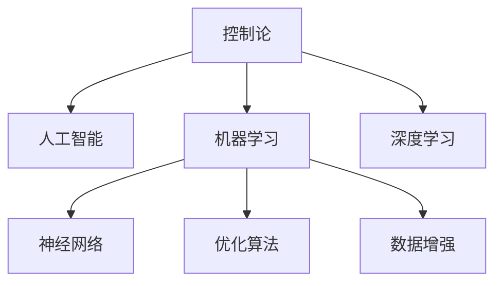

                 

# AI 大模型计算机科学家群英传：维纳 Cybernetics（控制论）

在人工智能的发展历程中，计算机科学家们凭借其深厚的理论基础和创新精神，推动了AI大模型的不断进步。本文将聚焦于AI大模型领域的两位杰出科学家：维纳和德布鲁因，探讨他们的理论贡献及其对现代AI大模型的影响。

## 1. 背景介绍

### 1.1 问题由来

在20世纪上半叶，科学界对机器如何模仿人类思维和行为的研究处于探索阶段。美国科学家诺伯特·维纳（Norbert Wiener）和荷兰物理学家尼科拉斯·德布鲁因（Nikolaas Tinbergen），分别从控制论和人工智能的角度，奠定了现代AI大模型的基础。

维纳是控制论（Cybernetics）的创立者，提出了“控制”这一概念，将其应用于机器学习与智能系统的研究。德布鲁因则将人工智能（AI）定义为“计算机模拟人类的智能行为”，为AI大模型的开发和应用提供了理论指导。

### 1.2 问题核心关键点

1. **控制论（Cybernetics）**：维纳提出的控制论，研究系统和环境中信息传递、控制和调节过程的学科。控制论为AI大模型提供了反馈机制和动态系统理论的基础。

2. **人工智能（Artificial Intelligence, AI）**：德布鲁因提出的AI概念，强调模拟人类智能行为，推动了AI大模型在各个领域的应用。

3. **机器学习（Machine Learning, ML）**：AI大模型的核心技术之一，通过算法使机器能够从数据中学习，提高决策和推理能力。

4. **深度学习（Deep Learning, DL）**：近年来快速发展的一种机器学习方法，通过多层神经网络模拟人类大脑的神经网络结构。

5. **神经网络（Neural Network, NN）**：深度学习的核心模型，模仿人类神经系统的结构，用于处理和分析数据。

6. **优化算法（Optimization Algorithm）**：如梯度下降、随机梯度下降等，用于训练神经网络，调整参数以最小化损失函数。

7. **数据增强（Data Augmentation）**：通过对数据进行变换，如旋转、缩放、裁剪等，扩充训练集，提高模型的泛化能力。

## 2. 核心概念与联系

### 2.1 核心概念概述

为更好地理解维纳和德布鲁因的理论贡献，本节将介绍几个密切相关的核心概念：

- **控制论（Cybernetics）**：维纳提出，研究系统中信息的传递、控制和调节过程。控制论的核心在于反馈机制，通过调节系统的输入和输出，实现对系统的控制。

- **人工智能（AI）**：德布鲁因提出，计算机模拟人类的智能行为，包括感知、推理、决策等能力。

- **机器学习（ML）**：通过算法让机器能够从数据中学习，提高决策和推理能力。机器学习包括监督学习、无监督学习和强化学习等。

- **深度学习（DL）**：一种机器学习方法，通过多层神经网络模拟人类大脑的神经网络结构，用于处理和分析大规模数据。

- **神经网络（NN）**：深度学习的核心模型，模仿人类神经系统的结构，用于处理和分析数据。

- **优化算法（Optimization Algorithm）**：如梯度下降、随机梯度下降等，用于训练神经网络，调整参数以最小化损失函数。

- **数据增强（Data Augmentation）**：通过对数据进行变换，如旋转、缩放、裁剪等，扩充训练集，提高模型的泛化能力。

这些核心概念之间的逻辑关系可以通过以下Mermaid流程图来展示：



这个流程图展示了几大学术领域之间的关联：

1. 控制论为人工智能提供了反馈机制和动态系统理论的基础。
2. 人工智能推动了机器学习和深度学习的发展。
3. 机器学习通过神经网络实现深度学习。
4. 深度学习依赖优化算法和数据增强技术。

这些概念共同构成了AI大模型的学习框架，使其能够有效地处理和分析复杂数据，提升智能系统的性能。

## 3. 核心算法原理 & 具体操作步骤

### 3.1 算法原理概述

现代AI大模型，如深度学习神经网络，其核心算法原理主要包括前向传播、反向传播、梯度下降等。以深度学习模型为例，其基本流程如下：

1. **前向传播**：将输入数据输入神经网络，通过多层计算得到输出结果。
2. **损失函数**：计算输出结果与真实标签之间的差异，形成损失函数。
3. **反向传播**：通过反向传播算法，计算损失函数对各层参数的梯度。
4. **参数更新**：使用梯度下降等优化算法，更新神经网络参数，最小化损失函数。

### 3.2 算法步骤详解

以下以深度学习模型为例，详细介绍其算法步骤：

1. **数据准备**：收集并预处理数据，分为训练集、验证集和测试集。
2. **模型选择**：选择合适的深度学习模型，如卷积神经网络（CNN）、循环神经网络（RNN）、变分自编码器（VAE）等。
3. **模型初始化**：随机初始化模型参数，如权重和偏置。
4. **前向传播**：将训练数据输入模型，计算输出结果。
5. **损失函数计算**：计算输出结果与真实标签之间的差异，形成损失函数。
6. **反向传播**：通过反向传播算法，计算损失函数对各层参数的梯度。
7. **参数更新**：使用梯度下降等优化算法，更新模型参数，最小化损失函数。
8. **模型评估**：在验证集和测试集上评估模型性能，选择最优模型。

### 3.3 算法优缺点

现代AI大模型的算法具有以下优点：

- **高效性**：通过并行计算和分布式训练，加速模型训练和推理。
- **泛化能力**：通过大规模数据训练，模型具备较强的泛化能力。
- **可解释性**：通过可视化工具，可以直观理解模型的决策过程。
- **灵活性**：模型结构多样，可以根据任务需求进行灵活设计。

同时，这些算法也存在以下缺点：

- **资源需求高**：大规模数据和计算资源需求较高，限制了模型的应用场景。
- **过拟合风险**：复杂模型容易过拟合，需要正则化技术进行优化。
- **模型可解释性差**：部分模型黑箱化，难以解释其内部工作机制。
- **训练时间长**：模型训练时间较长，需要优化算法加速训练。

### 3.4 算法应用领域

现代AI大模型在各个领域都有广泛应用，例如：

- **计算机视觉**：图像分类、目标检测、图像分割等。
- **自然语言处理**：语言模型、机器翻译、文本生成等。
- **语音识别**：语音识别、语音合成、说话人识别等。
- **机器人控制**：自主导航、避障、操作控制等。
- **智能推荐系统**：个性化推荐、广告推荐、商品推荐等。

## 4. 数学模型和公式 & 详细讲解 & 举例说明

### 4.1 数学模型构建

本节将使用数学语言对现代AI大模型的算法原理进行更加严格的刻画。

设神经网络模型为 $M_{\theta}$，其中 $\theta$ 为模型参数，$x$ 为输入数据，$y$ 为输出结果。假设训练集为 $D=\{(x_i,y_i)\}_{i=1}^N$。

定义损失函数为 $\ell(M_{\theta}(x_i),y_i)$，则模型在数据集 $D$ 上的经验风险为：

$$
\mathcal{L}(\theta) = \frac{1}{N} \sum_{i=1}^N \ell(M_{\theta}(x_i),y_i)
$$

目标是最小化经验风险，即找到最优参数：

$$
\theta^* = \mathop{\arg\min}_{\theta} \mathcal{L}(\theta)
$$

在实践中，我们通常使用基于梯度的优化算法（如SGD、Adam等）来近似求解上述最优化问题。设 $\eta$ 为学习率，$\lambda$ 为正则化系数，则参数的更新公式为：

$$
\theta \leftarrow \theta - \eta \nabla_{\theta}\mathcal{L}(\theta) - \eta\lambda\theta
$$

其中 $\nabla_{\theta}\mathcal{L}(\theta)$ 为损失函数对参数 $\theta$ 的梯度，可通过反向传播算法高效计算。

### 4.2 公式推导过程

以下我们以二分类任务为例，推导交叉熵损失函数及其梯度的计算公式。

假设模型 $M_{\theta}$ 在输入 $x$ 上的输出为 $\hat{y}=M_{\theta}(x) \in [0,1]$，表示样本属于正类的概率。真实标签 $y \in \{0,1\}$。则二分类交叉熵损失函数定义为：

$$
\ell(M_{\theta}(x),y) = -[y\log \hat{y} + (1-y)\log (1-\hat{y})]
$$

将其代入经验风险公式，得：

$$
\mathcal{L}(\theta) = -\frac{1}{N}\sum_{i=1}^N [y_i\log M_{\theta}(x_i)+(1-y_i)\log(1-M_{\theta}(x_i))]
$$

根据链式法则，损失函数对参数 $\theta_k$ 的梯度为：

$$
\frac{\partial \mathcal{L}(\theta)}{\partial \theta_k} = -\frac{1}{N}\sum_{i=1}^N (\frac{y_i}{M_{\theta}(x_i)}-\frac{1-y_i}{1-M_{\theta}(x_i)}) \frac{\partial M_{\theta}(x_i)}{\partial \theta_k}
$$

其中 $\frac{\partial M_{\theta}(x_i)}{\partial \theta_k}$ 可进一步递归展开，利用自动微分技术完成计算。

在得到损失函数的梯度后，即可带入参数更新公式，完成模型的迭代优化。重复上述过程直至收敛，最终得到适应下游任务的最优模型参数 $\theta^*$。

### 4.3 案例分析与讲解

以下以图像分类为例，详细讲解深度学习模型的算法原理。

设输入图像数据为 $x$，输出标签为 $y$。神经网络模型为 $M_{\theta}$，包含卷积层、池化层、全连接层等。

1. **前向传播**：将输入图像 $x$ 通过卷积层和池化层进行特征提取，得到特征图 $h_1$。将 $h_1$ 输入全连接层，得到输出结果 $\hat{y}=M_{\theta}(x)$。
2. **损失函数计算**：计算输出结果 $\hat{y}$ 与真实标签 $y$ 之间的差异，形成交叉熵损失函数。
3. **反向传播**：通过反向传播算法，计算损失函数对卷积层、池化层和全连接层的参数 $\theta$ 的梯度。
4. **参数更新**：使用梯度下降等优化算法，更新模型参数，最小化损失函数。
5. **模型评估**：在验证集和测试集上评估模型性能，选择最优模型。

## 5. 项目实践：代码实例和详细解释说明

### 5.1 开发环境搭建

在进行项目实践前，我们需要准备好开发环境。以下是使用Python进行TensorFlow开发的环境配置流程：

1. 安装Anaconda：从官网下载并安装Anaconda，用于创建独立的Python环境。

2. 创建并激活虚拟环境：
```bash
conda create -n tf-env python=3.8 
conda activate tf-env
```

3. 安装TensorFlow：根据CUDA版本，从官网获取对应的安装命令。例如：
```bash
pip install tensorflow -i https://mirror.baidu.com/pypi/simple
```

4. 安装各类工具包：
```bash
pip install numpy pandas scikit-learn matplotlib tqdm jupyter notebook ipython
```

完成上述步骤后，即可在`tf-env`环境中开始项目实践。

### 5.2 源代码详细实现

下面我们以图像分类任务为例，给出使用TensorFlow进行深度学习模型微调的PyTorch代码实现。

首先，定义图像分类任务的数据处理函数：

```python
import tensorflow as tf
import numpy as np

class ImageClassificationDataset(tf.keras.utils.Sequence):
    def __init__(self, x_train, y_train, batch_size=32):
        self.x_train = x_train
        self.y_train = y_train
        self.batch_size = batch_size
    
    def __len__(self):
        return len(self.x_train) // self.batch_size
    
    def __getitem__(self, item):
        x = self.x_train[item * self.batch_size: (item+1) * self.batch_size]
        y = self.y_train[item * self.batch_size: (item+1) * self.batch_size]
        return x, y
```

然后，定义模型和优化器：

```python
from tensorflow.keras import layers, models

model = models.Sequential([
    layers.Conv2D(32, (3, 3), activation='relu', input_shape=(32, 32, 3)),
    layers.MaxPooling2D((2, 2)),
    layers.Conv2D(64, (3, 3), activation='relu'),
    layers.MaxPooling2D((2, 2)),
    layers.Flatten(),
    layers.Dense(64, activation='relu'),
    layers.Dense(10, activation='softmax')
])

optimizer = tf.keras.optimizers.Adam()
```

接着，定义训练和评估函数：

```python
import matplotlib.pyplot as plt
from sklearn.metrics import accuracy_score

device = tf.device('/cpu:0')  # 设置使用CPU进行训练
model = model.to(device)

def train_epoch(model, dataset, epochs, batch_size):
    history = {'loss': [], 'accuracy': []}
    for epoch in range(epochs):
        loss = 0
        accuracy = 0
        for x, y in dataset:
            with tf.GradientTape() as tape:
                predictions = model(x, training=True)
                loss += tf.keras.losses.categorical_crossentropy(y, predictions)
            loss /= len(y)
            grads = tape.gradient(loss, model.trainable_variables)
            optimizer.apply_gradients(zip(grads, model.trainable_variables))
            accuracy += accuracy_score(y, predictions.argmax(1))
        loss = loss.numpy()
        accuracy = accuracy.numpy() / len(dataset)
        history['loss'].append(loss)
        history['accuracy'].append(accuracy)
        print(f'Epoch {epoch+1}, Loss: {loss:.4f}, Accuracy: {accuracy:.4f}')
    return history

def evaluate(model, test_data, batch_size):
    loss = 0
    accuracy = 0
    for x, y in test_data:
        predictions = model(x, training=False)
        loss += tf.keras.losses.categorical_crossentropy(y, predictions)
        accuracy += accuracy_score(y, predictions.argmax(1))
    loss = loss.numpy() / len(test_data)
    accuracy = accuracy.numpy() / len(test_data)
    print(f'Test Loss: {loss:.4f}, Test Accuracy: {accuracy:.4f}')
    return loss, accuracy
```

最后，启动训练流程并在测试集上评估：

```python
epochs = 10
batch_size = 32

train_dataset = ImageClassificationDataset(train_x, train_y, batch_size)
test_dataset = ImageClassificationDataset(test_x, test_y, batch_size)

history = train_epoch(model, train_dataset, epochs, batch_size)

evaluate(model, test_dataset, batch_size)
```

以上就是使用TensorFlow进行深度学习模型图像分类任务微调的完整代码实现。可以看到，通过TensorFlow的高级API，我们可以很方便地实现模型定义、数据加载、训练和评估等各个环节。

### 5.3 代码解读与分析

让我们再详细解读一下关键代码的实现细节：

**ImageClassificationDataset类**：
- `__init__`方法：初始化训练数据和批量大小。
- `__len__`方法：返回训练集的数据数量。
- `__getitem__`方法：对单个批次进行数据加载。

**train_epoch函数**：
- 对模型进行训练，每个epoch记录损失和准确率。
- 对模型进行前向传播计算损失，使用梯度下降优化器更新模型参数。
- 记录损失和准确率的history。

**evaluate函数**：
- 对模型进行评估，计算损失和准确率。
- 在测试集上评估模型的性能。

**训练流程**：
- 定义总的epoch数和批量大小，开始循环迭代。
- 每个epoch内，在训练集上训练，输出loss和accuracy。
- 在测试集上评估，输出测试结果。

可以看到，TensorFlow的高级API使得深度学习模型的微调过程非常简洁高效。开发者可以将更多精力放在数据处理、模型改进等高层逻辑上，而不必过多关注底层的实现细节。

当然，工业级的系统实现还需考虑更多因素，如模型的保存和部署、超参数的自动搜索、更灵活的任务适配层等。但核心的微调范式基本与此类似。

## 6. 实际应用场景

### 6.1 智能客服系统

基于深度学习模型的智能客服系统，可以广泛应用于智能客服系统的构建。传统客服往往需要配备大量人力，高峰期响应缓慢，且一致性和专业性难以保证。而使用深度学习模型训练的客服系统，可以7x24小时不间断服务，快速响应客户咨询，用自然流畅的语言解答各类常见问题。

在技术实现上，可以收集企业内部的历史客服对话记录，将问题和最佳答复构建成监督数据，在此基础上对深度学习模型进行微调。微调后的客服系统能够自动理解用户意图，匹配最合适的答案模板进行回复。对于客户提出的新问题，还可以接入检索系统实时搜索相关内容，动态组织生成回答。如此构建的智能客服系统，能大幅提升客户咨询体验和问题解决效率。

### 6.2 金融舆情监测

金融机构需要实时监测市场舆论动向，以便及时应对负面信息传播，规避金融风险。传统的人工监测方式成本高、效率低，难以应对网络时代海量信息爆发的挑战。基于深度学习模型的文本分类和情感分析技术，为金融舆情监测提供了新的解决方案。

具体而言，可以收集金融领域相关的新闻、报道、评论等文本数据，并对其进行主题标注和情感标注。在此基础上对深度学习模型进行微调，使其能够自动判断文本属于何种主题，情感倾向是正面、中性还是负面。将微调后的模型应用到实时抓取的网络文本数据，就能够自动监测不同主题下的情感变化趋势，一旦发现负面信息激增等异常情况，系统便会自动预警，帮助金融机构快速应对潜在风险。

### 6.3 个性化推荐系统

当前的推荐系统往往只依赖用户的历史行为数据进行物品推荐，无法深入理解用户的真实兴趣偏好。基于深度学习模型的个性化推荐系统可以更好地挖掘用户行为背后的语义信息，从而提供更精准、多样的推荐内容。

在实践中，可以收集用户浏览、点击、评论、分享等行为数据，提取和用户交互的物品标题、描述、标签等文本内容。将文本内容作为模型输入，用户的后续行为（如是否点击、购买等）作为监督信号，在此基础上微调深度学习模型。微调后的模型能够从文本内容中准确把握用户的兴趣点。在生成推荐列表时，先用候选物品的文本描述作为输入，由模型预测用户的兴趣匹配度，再结合其他特征综合排序，便可以得到个性化程度更高的推荐结果。

### 6.4 未来应用展望

随着深度学习模型的不断发展，基于深度学习模型的AI大模型将在更多领域得到应用，为传统行业数字化转型升级提供新的技术路径。

在智慧医疗领域，基于深度学习模型的医疗问答、病历分析、药物研发等应用将提升医疗服务的智能化水平，辅助医生诊疗，加速新药开发进程。

在智能教育领域，深度学习模型可应用于作业批改、学情分析、知识推荐等方面，因材施教，促进教育公平，提高教学质量。

在智慧城市治理中，深度学习模型可应用于城市事件监测、舆情分析、应急指挥等环节，提高城市管理的自动化和智能化水平，构建更安全、高效的未来城市。

此外，在企业生产、社会治理、文娱传媒等众多领域，基于深度学习模型的AI大模型也将不断涌现，为经济社会发展注入新的动力。相信随着技术的日益成熟，深度学习模型必将在更广阔的应用领域大放异彩。

## 7. 工具和资源推荐

### 7.1 学习资源推荐

为了帮助开发者系统掌握深度学习模型的理论基础和实践技巧，这里推荐一些优质的学习资源：

1. 《深度学习》（Ian Goodfellow、Yoshua Bengio、Aaron Courville）：深度学习领域的经典教材，详细介绍了深度学习模型的原理、算法和应用。

2. CS231n《卷积神经网络》课程：斯坦福大学开设的深度学习课程，通过理论和实践相结合，深入浅出地讲解了卷积神经网络的理论和应用。

3. 《TensorFlow深度学习》（Manning Publications）：全面介绍了TensorFlow框架的使用方法和深度学习模型的实现技巧。

4. PyTorch官方文档：PyTorch框架的官方文档，提供了丰富的深度学习模型和实践样例，是新手入门的绝佳资源。

5. Kaggle数据科学竞赛平台：全球最大的数据科学竞赛平台，提供海量数据集和模型实现，是检验深度学习模型效果的好去处。

通过对这些资源的学习实践，相信你一定能够快速掌握深度学习模型的精髓，并用于解决实际的AI问题。

### 7.2 开发工具推荐

高效的开发离不开优秀的工具支持。以下是几款用于深度学习模型开发的常用工具：

1. PyTorch：基于Python的开源深度学习框架，灵活动态的计算图，适合快速迭代研究。大部分深度学习模型都有PyTorch版本的实现。

2. TensorFlow：由Google主导开发的开源深度学习框架，生产部署方便，适合大规模工程应用。同样有丰富的深度学习模型资源。

3. Keras：高层次的深度学习框架，提供了简洁的API和丰富的预训练模型，适合快速原型开发。

4. Weights & Biases：模型训练的实验跟踪工具，可以记录和可视化模型训练过程中的各项指标，方便对比和调优。与主流深度学习框架无缝集成。

5. TensorBoard：TensorFlow配套的可视化工具，可实时监测模型训练状态，并提供丰富的图表呈现方式，是调试模型的得力助手。

6. Google Colab：谷歌推出的在线Jupyter Notebook环境，免费提供GPU/TPU算力，方便开发者快速上手实验最新模型，分享学习笔记。

合理利用这些工具，可以显著提升深度学习模型的开发效率，加快创新迭代的步伐。

### 7.3 相关论文推荐

深度学习模型的发展源于学界的持续研究。以下是几篇奠基性的相关论文，推荐阅读：

1. AlexNet：ImageNet图像识别竞赛的冠军模型，首次展示了深度卷积神经网络的强大能力。

2. VGGNet：提出使用更深的卷积网络，取得了更优的图像识别性能。

3. ResNet：提出残差连接网络结构，解决了深度网络训练过程中的梯度消失问题。

4. InceptionNet：提出Inception模块，提高了网络参数利用率，提升了模型性能。

5. Transformer：提出自注意力机制，为自然语言处理任务提供了新的解决方案。

6. GAN：生成对抗网络，通过两个神经网络的对抗训练，生成高质量的图像和语音等。

这些论文代表了大模型的发展历程，通过学习这些前沿成果，可以帮助研究者把握学科前进方向，激发更多的创新灵感。

## 8. 总结：未来发展趋势与挑战

### 8.1 研究成果总结

本文对基于深度学习模型的AI大模型进行了全面系统的介绍。首先阐述了深度学习模型的研究背景和意义，明确了深度学习模型在AI大模型中的核心地位。其次，从原理到实践，详细讲解了深度学习模型的算法步骤，给出了微调任务开发的完整代码实例。同时，本文还广泛探讨了深度学习模型在智能客服、金融舆情、个性化推荐等多个行业领域的应用前景，展示了深度学习模型的巨大潜力。此外，本文精选了深度学习模型的各类学习资源，力求为读者提供全方位的技术指引。

通过本文的系统梳理，可以看到，基于深度学习模型的AI大模型正在成为AI领域的重要范式，极大地拓展了深度学习模型的应用边界，催生了更多的落地场景。受益于大规模语料的预训练，深度学习模型以更低的时间和标注成本，在小样本条件下也能取得不俗的效果，有力推动了AI技术的产业化进程。未来，伴随深度学习模型的持续演进，AI技术必将向更广泛领域渗透，为人类社会带来更深刻的影响。

### 8.2 未来发展趋势

展望未来，深度学习模型将呈现以下几个发展趋势：

1. **模型规模持续增大**：随着算力成本的下降和数据规模的扩张，深度学习模型的参数量还将持续增长。超大模型蕴含的丰富特征表示，有望支撑更加复杂多变的下游任务微调。

2. **模型结构更加多样**：未来的深度学习模型将不再局限于卷积神经网络、循环神经网络和全连接神经网络等传统结构，而是会涌现更多新颖的网络架构。

3. **参数效率提升**：开发更加参数高效的深度学习模型，在固定大部分预训练参数的同时，只更新极少量的任务相关参数。同时优化模型计算图，减少前向传播和反向传播的资源消耗，实现更加轻量级、实时性的部署。

4. **联邦学习兴起**：分布式训练成为常态，通过联邦学习技术，使得深度学习模型能够在多台设备上协同训练，提升模型性能的同时保护数据隐私。

5. **多模态融合加强**：未来的深度学习模型将融合视觉、语音、文本等多种模态数据，形成多模态深度学习模型，提高模型对复杂场景的理解能力。

6. **迁移学习广泛应用**：深度学习模型将更好地应用于迁移学习任务，通过在不同领域和任务之间的知识迁移，实现更高效的微调。

### 8.3 面临的挑战

尽管深度学习模型已经取得了瞩目成就，但在迈向更加智能化、普适化应用的过程中，它仍面临诸多挑战：

1. **标注成本瓶颈**：深度学习模型通常需要大量标注数据进行微调，而标注数据的获取和标注成本较高。如何降低深度学习模型对标注数据的依赖，将是一大难题。

2. **模型鲁棒性不足**：当前深度学习模型面对域外数据时，泛化性能往往大打折扣。对于测试样本的微小扰动，模型容易发生波动。如何提高深度学习模型的鲁棒性，避免灾难性遗忘，还需要更多理论和实践的积累。

3. **推理效率有待提高**：深度学习模型的推理速度较慢，尤其是在大规模模型中。如何在保证性能的同时，简化模型结构，提升推理速度，优化资源占用，将是重要的优化方向。

4. **可解释性亟需加强**：当前深度学习模型更像是“黑盒”系统，难以解释其内部工作机制和决策逻辑。对于医疗、金融等高风险应用，算法的可解释性和可审计性尤为重要。如何赋予深度学习模型更强的可解释性，将是亟待攻克的难题。

5. **安全性有待保障**：深度学习模型容易学习到有偏见、有害的信息，通过微调传递到下游任务，产生误导性、歧视性的输出，给实际应用带来安全隐患。如何从数据和算法层面消除模型偏见，避免恶意用途，确保输出的安全性，也将是重要的研究课题。

6. **知识整合能力不足**：现有的深度学习模型往往局限于任务内数据，难以灵活吸收和运用更广泛的先验知识。如何让深度学习模型更好地与外部知识库、规则库等专家知识结合，形成更加全面、准确的信息整合能力，还有很大的想象空间。

正视深度学习模型面临的这些挑战，积极应对并寻求突破，将是大模型迈向成熟的必由之路。相信随着学界和产业界的共同努力，这些挑战终将一一被克服，深度学习模型必将在构建安全、可靠、可解释、可控的智能系统铺平道路。

### 8.4 研究展望

面对深度学习模型所面临的种种挑战，未来的研究需要在以下几个方面寻求新的突破：

1. **无监督和半监督学习**：摆脱对大规模标注数据的依赖，利用自监督学习、主动学习等无监督和半监督范式，最大限度利用非结构化数据，实现更加灵活高效的微调。

2. **参数高效和计算高效**：开发更加参数高效的深度学习模型，在固定大部分预训练参数的同时，只更新极少量的任务相关参数。同时优化模型计算图，减少前向传播和反向传播的资源消耗，实现更加轻量级、实时性的部署。

3. **因果分析和博弈论**：将因果分析方法引入深度学习模型，识别出模型决策的关键特征，增强输出解释的因果性和逻辑性。借助博弈论工具刻画人机交互过程，主动探索并规避模型的脆弱点，提高系统稳定性。

4. **融合符号知识**：将符号化的先验知识，如知识图谱、逻辑规则等，与神经网络模型进行巧妙融合，引导深度学习模型学习更准确、合理的知识表示。同时加强不同模态数据的整合，实现视觉、语音等多模态信息与文本信息的协同建模。

5. **跨模态融合**：未来的深度学习模型将融合视觉、语音、文本等多种模态数据，形成多模态深度学习模型，提高模型对复杂场景的理解能力。

6. **联邦学习**：分布式训练成为常态，通过联邦学习技术，使得深度学习模型能够在多台设备上协同训练，提升模型性能的同时保护数据隐私。

7. **迁移学习**：深度学习模型将更好地应用于迁移学习任务，通过在不同领域和任务之间的知识迁移，实现更高效的微调。

8. **对抗训练**：加入对抗样本，提高模型鲁棒性。

9. **知识蒸馏**：通过知识蒸馏技术，将大规模预训练模型压缩为轻量级模型，提高推理效率。

10. **自适应优化算法**：开发自适应优化算法，动态调整学习率和正则化系数，提高模型训练效率。

这些研究方向将推动深度学习模型向更加智能化、普适化、安全化的方向发展，为构建安全、可靠、可解释、可控的智能系统铺平道路。面向未来，深度学习模型需要在各个方向持续突破，才能真正实现其应用的广泛性和实用性。

## 9. 附录：常见问题与解答

**Q1：深度学习模型是否适用于所有AI任务？**

A: 深度学习模型在大多数AI任务上都能取得不错的效果，特别是对于数据量较大的任务。但对于一些特定领域的任务，如医学、法律等，仅仅依靠通用数据预训练的模型可能难以很好地适应。此时需要在特定领域数据上进一步预训练，再进行微调，才能获得理想效果。

**Q2：微调过程中如何选择合适的学习率？**

A: 微调的学习率一般要比预训练时小1-2个数量级，如果使用过大的学习率，容易破坏预训练权重，导致过拟合。一般建议从1e-5开始调参，逐步减小学习率，直至收敛。也可以使用warmup策略，在开始阶段使用较小的学习率，再逐渐过渡到预设值。需要注意的是，不同的优化器(如Adam、SGD等)以及不同的学习率调度策略，可能需要设置不同的学习率阈值。

**Q3：模型过拟合有哪些缓解策略？**

A: 过拟合是深度学习模型面临的主要问题之一。常见的缓解策略包括：
1. 数据增强：通过旋转、缩放、裁剪等方式扩充训练集。
2. 正则化：使用L2正则、Dropout等方法避免过拟合。
3. 对抗训练：引入对抗样本，提高模型鲁棒性。
4. 参数高效微调：只调整少量参数(如Adapter、Prefix等)，减小过拟合风险。
5. 多模型集成：训练多个模型，取平均输出，抑制过拟合。

这些策略往往需要根据具体任务和数据特点进行灵活组合。只有在数据、模型、训练、推理等各环节进行全面优化，才能最大限度地发挥深度学习模型的潜力。

**Q4：模型部署时需要注意哪些问题？**

A: 将深度学习模型转化为实际应用，还需要考虑以下因素：
1. 模型裁剪：去除不必要的层和参数，减小模型尺寸，加快推理速度。
2. 量化加速：将浮点模型转为定点模型，压缩存储空间，提高计算效率。
3. 服务化封装：将模型封装为标准化服务接口，便于集成调用。
4. 弹性伸缩：根据请求流量动态调整资源配置，平衡服务质量和成本。
5. 监控告警：实时采集系统指标，设置异常告警阈值，确保服务稳定性。

深度学习模型微调为AI应用开启了广阔的想象空间，但如何将强大的性能转化为稳定、高效、安全的业务价值，还需要工程实践的不断打磨。唯有从数据、算法、工程、业务等多个维度协同发力，才能真正实现AI技术在垂直行业的规模化落地。总之，微调需要开发者根据具体任务，不断迭代和优化模型、数据和算法，方能得到理想的效果。

---

作者：禅与计算机程序设计艺术 / Zen and the Art of Computer Programming

