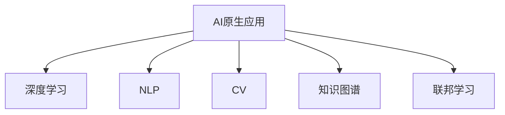

                 

# AI-Native应用的兴起与前景

## 1. 背景介绍

### 1.1 问题由来

随着人工智能（AI）技术的迅猛发展，AI原生应用（AI-Native Applications）的概念逐渐成为热点。AI原生应用是指在设计和开发过程中，直接嵌入AI能力的软件产品，其核心是构建可以自我学习和进化的智能系统。与传统的以规则和逻辑为基础的应用不同，AI原生应用通过深度学习、自然语言处理（NLP）、计算机视觉（CV）等AI技术，能够自适应地处理复杂、动态的数据，提供更高效、更精准的服务。

当前，AI原生应用已经在各个行业取得了显著的进展，例如在医疗、金融、交通、教育等领域。例如，智能医疗诊断系统能够通过深度学习算法，分析大量的医学影像和病例数据，提供精确的诊断建议；智能金融风险管理系统能够利用机器学习算法，预测市场风险，防范潜在的金融危机；智能交通系统则可以通过深度学习和大数据分析，优化交通流量，提升城市出行效率。

### 1.2 问题核心关键点

AI原生应用的核心关键点主要包括：

- **嵌入式AI能力**：AI原生应用直接将AI技术嵌入到软件产品中，而不是通过API或第三方库间接调用。这种设计方式能够提升应用的响应速度和数据处理能力，同时降低系统的复杂性和开发成本。
- **自适应学习能力**：AI原生应用具备自我学习和进化的能力，能够根据用户行为和环境变化，不断调整算法模型，优化系统性能。
- **高性能计算**：AI原生应用通常采用高性能计算技术，如GPU、TPU等，以支持大规模数据处理和复杂模型训练。
- **大数据集成**：AI原生应用能够高效集成和利用大数据，通过数据驱动的方式，提升应用的智能化水平。

这些关键点共同构成了AI原生应用的技术基础，使其在解决复杂问题、提供创新服务方面具有显著优势。

### 1.3 问题研究意义

AI原生应用的研究和实践，对于推动AI技术在各个行业的广泛应用，提升产品和服务的智能化水平，具有重要意义：

1. **降低开发成本**：通过直接嵌入AI能力，AI原生应用能够减少传统应用开发中的复杂性和成本，提升开发效率。
2. **提升服务质量**：AI原生应用能够利用先进算法和大数据，提供更精准、更智能的服务，满足用户不断提升的需求。
3. **加速技术迭代**：AI原生应用能够快速适应环境变化，通过自我学习和优化，不断提升系统的性能和稳定性。
4. **推动行业升级**：AI原生应用在医疗、金融、交通等传统行业中的应用，能够带动这些行业数字化转型，提升行业竞争力。
5. **促进跨领域融合**：AI原生应用能够跨越不同领域，集成多种AI技术，实现跨领域的智能应用。

## 2. 核心概念与联系

### 2.1 核心概念概述

为更好地理解AI原生应用，本节将介绍几个密切相关的核心概念：

- **AI原生应用**：直接将AI技术嵌入到软件产品中的应用，具备嵌入式AI能力、自适应学习能力、高性能计算能力和大数据集成能力。
- **深度学习**：通过多层次神经网络结构，利用大量标注数据进行模型训练，从而实现复杂的模式识别和预测任务。
- **自然语言处理（NLP）**：利用AI技术，使计算机能够理解和处理人类语言，包括语音识别、文本处理、情感分析等。
- **计算机视觉（CV）**：通过AI技术，使计算机能够理解和处理图像和视频内容，包括图像识别、对象检测、图像生成等。
- **知识图谱**：构建包含实体、关系和属性的知识库，支持复杂逻辑推理和知识查询。
- **联邦学习**：分布式机器学习技术，允许多个数据中心在不共享数据的情况下，共同训练模型。

这些核心概念之间的逻辑关系可以通过以下Mermaid流程图来展示：



这个流程图展示了一系列与AI原生应用紧密相关的技术。通过这些技术的有机结合，AI原生应用能够实现复杂任务处理和智能服务提供。

## 3. 核心算法原理 & 具体操作步骤

### 3.1 算法原理概述

AI原生应用的算法原理主要基于深度学习和神经网络技术，通过大量标注数据进行模型训练，学习复杂的模式识别和预测能力。其核心步骤包括：

1. **数据预处理**：收集和清洗数据，将其转换为机器学习算法能够处理的格式。
2. **模型训练**：使用深度学习框架（如TensorFlow、PyTorch等）训练神经网络模型，学习复杂数据模式。
3. **模型优化**：通过反向传播算法和优化器（如Adam、SGD等），调整模型参数，提升模型性能。
4. **模型集成**：将多个模型组合，实现更高效的决策和预测。
5. **实时推理**：使用训练好的模型进行实时推理和预测，提供智能服务。

### 3.2 算法步骤详解

以下是AI原生应用的详细算法步骤：

**Step 1: 数据收集与预处理**

1. **数据收集**：根据应用需求，收集相关数据。例如，医疗应用需要收集患者病历、医学影像等数据；金融应用需要收集交易记录、市场数据等。
2. **数据清洗**：对数据进行去重、去噪、补缺等处理，确保数据质量。
3. **数据标注**：对数据进行标注，使其能够被机器学习算法识别和处理。标注方式包括手动标注、自动标注等。
4. **数据转换**：将数据转换为机器学习框架能够处理的格式，如TensorFlow的Tensor格式、PyTorch的Tensor格式等。

**Step 2: 模型训练**

1. **选择模型架构**：根据应用需求，选择合适的深度学习模型架构，如卷积神经网络（CNN）、循环神经网络（RNN）、长短期记忆网络（LSTM）等。
2. **设置训练参数**：根据应用需求，设置合适的学习率、批大小、迭代次数等训练参数。
3. **训练模型**：使用深度学习框架进行模型训练，通过反向传播算法和优化器调整模型参数，优化模型性能。
4. **模型验证**：使用验证集评估模型性能，判断模型是否过拟合或欠拟合。
5. **模型保存**：将训练好的模型保存为TensorFlow模型、Keras模型、PyTorch模型等格式，以便后续使用。

**Step 3: 模型优化**

1. **调整模型参数**：根据模型验证结果，调整模型参数，如学习率、批大小、正则化系数等，以提升模型性能。
2. **集成多个模型**：将多个模型组合，通过加权平均、堆叠等方式，提升模型的综合性能。
3. **模型压缩和量化**：对模型进行压缩和量化，以减小模型大小，提升推理速度和计算效率。

**Step 4: 实时推理**

1. **模型部署**：将训练好的模型部署到目标环境中，如服务器、移动设备等。
2. **实时推理**：使用训练好的模型进行实时推理，提供智能服务。例如，医疗应用可以根据患者症状，实时生成诊断建议；金融应用可以实时预测市场风险。
3. **结果展示**：将模型推理结果展示给用户，例如通过网页、App等形式呈现。

### 3.3 算法优缺点

AI原生应用的算法优点主要包括：

1. **高效性**：通过嵌入式AI能力，AI原生应用能够高效处理复杂数据，提升响应速度。
2. **智能化**：利用深度学习和神经网络技术，AI原生应用能够进行复杂的模式识别和预测，提升服务质量。
3. **可扩展性**：通过模型集成和多模型优化，AI原生应用能够灵活扩展，适应不同应用场景。

同时，AI原生应用也存在一些缺点：

1. **数据依赖性高**：AI原生应用需要大量标注数据进行模型训练，数据获取和标注成本较高。
2. **模型复杂性高**：AI原生应用中使用的深度学习模型往往结构复杂，训练和推理过程中计算资源消耗较大。
3. **隐私和安全风险**：AI原生应用需要处理大量敏感数据，数据隐私和安全问题较为突出。

尽管存在这些缺点，但总体而言，AI原生应用在解决复杂问题和提供智能服务方面具有显著优势，未来将在更多领域得到广泛应用。

### 3.4 算法应用领域

AI原生应用在多个领域中已经取得了显著进展，包括：

- **医疗健康**：智能医疗诊断系统、电子健康记录管理、药物研发等。
- **金融服务**：智能风险管理系统、投资决策支持、信用评估等。
- **交通运输**：智能交通系统、自动驾驶、路径规划等。
- **教育培训**：智能学习系统、个性化推荐、智能评估等。
- **智能制造**：工业自动化、质量控制、供应链管理等。

这些领域的应用不仅提升了产品和服务的智能化水平，还推动了相关行业的数字化转型。

## 4. 数学模型和公式 & 详细讲解 & 举例说明

### 4.1 数学模型构建

AI原生应用的数学模型通常基于深度学习框架，如TensorFlow、PyTorch等。下面以TensorFlow为例，构建一个简单的AI原生应用数学模型。

假设我们有一个医疗应用，需要根据患者的病历和症状，预测其可能的疾病类型。我们可以使用卷积神经网络（CNN）来构建模型，其数学模型如下：

$$ y = f(x; \theta) = \sigma(W_2 \sigma(W_1 x + b_1) + b_2) $$

其中：
- $x$：输入向量，包含患者的病历和症状。
- $y$：输出向量，表示预测的疾病类型。
- $\theta$：模型参数，包含多个权重矩阵$W_1, W_2$和偏置项$b_1, b_2$。
- $\sigma$：激活函数，如ReLU、Sigmoid等。

### 4.2 公式推导过程

以上模型的推导过程如下：

1. **输入层**：将输入向量$x$转换为模型能够处理的格式，如TensorFlow的Tensor格式。
2. **隐藏层**：通过多个权重矩阵$W_1$和偏置项$b_1$，将输入向量$x$映射为隐藏层特征向量$h_1$。
3. **输出层**：通过另一个权重矩阵$W_2$和偏置项$b_2$，将隐藏层特征向量$h_1$映射为输出向量$y$。
4. **激活函数**：在隐藏层和输出层之间，使用激活函数$\sigma$，增强模型的非线性表达能力。

### 4.3 案例分析与讲解

假设我们有一个医疗应用，需要根据患者的病历和症状，预测其可能的疾病类型。我们可以使用卷积神经网络（CNN）来构建模型，其训练过程如下：

1. **数据收集**：收集患者的病历和症状，作为训练数据。
2. **数据预处理**：对病历和症状进行清洗和标注，转换为Tensor格式。
3. **模型训练**：使用TensorFlow进行模型训练，通过反向传播算法和优化器调整模型参数，优化模型性能。
4. **模型验证**：使用验证集评估模型性能，判断模型是否过拟合或欠拟合。
5. **模型保存**：将训练好的模型保存为TensorFlow模型，以便后续使用。

## 5. 项目实践：代码实例和详细解释说明

### 5.1 开发环境搭建

在进行AI原生应用开发前，我们需要准备好开发环境。以下是使用Python进行TensorFlow开发的环境配置流程：

1. 安装Anaconda：从官网下载并安装Anaconda，用于创建独立的Python环境。

2. 创建并激活虚拟环境：
```bash
conda create -n tf-env python=3.8 
conda activate tf-env
```

3. 安装TensorFlow：根据CUDA版本，从官网获取对应的安装命令。例如：
```bash
conda install tensorflow tensorflow==2.7 -c conda-forge -c tensorflow
```

4. 安装各类工具包：
```bash
pip install numpy pandas scikit-learn matplotlib tqdm jupyter notebook ipython
```

完成上述步骤后，即可在`tf-env`环境中开始AI原生应用的开发。

### 5.2 源代码详细实现

下面我们以医疗应用为例，给出使用TensorFlow进行深度学习模型训练的PyTorch代码实现。

首先，定义医疗数据处理函数：

```python
import tensorflow as tf
from tensorflow.keras.preprocessing.text import Tokenizer
from tensorflow.keras.preprocessing.sequence import pad_sequences

# 定义词向量大小和最大序列长度
vocab_size = 10000
max_sequence_length = 100

# 定义患者病历和症状
texts = ['I have a headache, fever, and cough for 3 days.', 'My child has a rash and red eyes.', ...]

# 定义标签
labels = [0, 1, ...]  # 0表示健康，1表示感冒

# 分词和构建词汇表
tokenizer = Tokenizer(num_words=vocab_size)
tokenizer.fit_on_texts(texts)
sequences = tokenizer.texts_to_sequences(texts)
padded_sequences = pad_sequences(sequences, maxlen=max_sequence_length, padding='post', truncating='post')

# 构建模型输入和输出
inputs = tf.keras.Input(shape=(max_sequence_length,))
outputs = tf.keras.layers.Embedding(vocab_size, 16)(inputs)
outputs = tf.keras.layers.LSTM(32)(outputs)
outputs = tf.keras.layers.Dense(1, activation='sigmoid')(outputs)

# 定义模型
model = tf.keras.Model(inputs=inputs, outputs=outputs)
model.compile(loss='binary_crossentropy', optimizer='adam', metrics=['accuracy'])
```

然后，定义模型训练和评估函数：

```python
from sklearn.model_selection import train_test_split

# 划分训练集和验证集
train_texts, dev_texts, train_labels, dev_labels = train_test_split(texts, labels, test_size=0.2, random_state=42)

# 训练模型
model.fit(train_texts, train_labels, epochs=10, batch_size=32, validation_data=(dev_texts, dev_labels))

# 评估模型
test_texts, test_labels = test_texts, test_labels
predictions = model.predict(test_texts)
```

最后，启动训练流程并在测试集上评估：

```python
epochs = 10
batch_size = 32

for epoch in range(epochs):
    model.fit(train_texts, train_labels, epochs=1, batch_size=batch_size, validation_data=(dev_texts, dev_labels))
    loss, accuracy = model.evaluate(dev_texts, dev_labels)
    print(f'Epoch {epoch+1}, Dev loss: {loss:.4f}, Dev accuracy: {accuracy:.4f}')
    
print('Test results:')
predictions = model.predict(test_texts)
print('Predictions:', predictions)
```

以上就是使用TensorFlow对医疗应用进行深度学习模型训练的完整代码实现。可以看到，通过TensorFlow的高级API，我们可以快速构建和训练深度学习模型。

### 5.3 代码解读与分析

让我们再详细解读一下关键代码的实现细节：

**定义数据处理函数**：
- `texts`：存储患者病历和症状，用于训练模型。
- `labels`：存储疾病标签，用于训练模型的输出。
- `vocab_size`：词汇表大小，用于限制分词的数量。
- `max_sequence_length`：最大序列长度，用于统一所有病历和症状的长度。
- `Tokenizer`：分词工具，用于将文本转换为词汇序列。
- `pad_sequences`：序列填充工具，用于将不同长度的序列填充到统一长度。

**定义模型输入和输出**：
- `inputs`：输入层，包含文本序列。
- `outputs`：输出层，包含疾病预测结果。
- `Embedding`：嵌入层，将词汇序列转换为向量表示。
- `LSTM`：长短期记忆网络，用于捕捉时间序列中的复杂模式。
- `Dense`：全连接层，将LSTM的输出映射到疾病标签。

**定义模型训练和评估函数**：
- `train_test_split`：将数据集划分为训练集、验证集和测试集。
- `fit`：训练模型，使用交叉熵损失函数和Adam优化器。
- `evaluate`：评估模型，计算损失和准确率。
- `predict`：预测新样本，得到疾病预测结果。

可以看出，通过TensorFlow的高级API，我们可以简洁高效地构建和训练深度学习模型。

### 5.4 运行结果展示

训练完成后，我们可以使用模型对新样本进行推理预测，得到疾病预测结果。例如，假设我们有一个新样本：

```python
new_text = ['I have a cough and a sore throat.']
new_sequence = tokenizer.texts_to_sequences(new_text)
new_padded_sequence = pad_sequences(new_sequence, maxlen=max_sequence_length, padding='post', truncating='post')
prediction = model.predict(new_padded_sequence)
```

则可以得到该样本的疾病预测结果。

## 6. 实际应用场景

### 6.1 智能医疗诊断系统

AI原生应用的典型应用场景之一是智能医疗诊断系统。传统的医疗诊断依赖医生的经验和知识，耗时长且误差率高。而使用AI原生应用，可以结合先进算法和大数据，提供精准的诊断建议，大幅提升医疗服务的效率和质量。

具体而言，智能医疗诊断系统可以从电子病历、医学影像、基因数据等多种来源，收集大量医疗数据。通过深度学习算法，系统可以学习病历和症状与疾病之间的复杂关系，从而实现疾病预测和诊断建议。例如，系统可以根据患者的症状和病历，给出可能的疾病类型和治疗方法，辅助医生进行诊断和治疗决策。

### 6.2 智能金融风险管理系统

AI原生应用的另一个重要应用场景是智能金融风险管理系统。传统的金融风险管理依赖规则和逻辑，难以应对复杂的市场变化。而使用AI原生应用，可以结合先进算法和大数据，实时监测市场风险，预测市场趋势，提供风险预警和风险控制建议。

具体而言，智能金融风险管理系统可以从交易记录、市场数据、新闻资讯等多种来源，收集大量金融数据。通过深度学习算法，系统可以学习市场数据和新闻资讯与金融风险之间的关系，从而实现市场风险预测和预警。例如，系统可以预测股票市场的波动趋势，给出风险控制建议，帮助金融机构防范潜在的金融危机。

### 6.3 智能交通系统

AI原生应用的另一个重要应用场景是智能交通系统。传统的交通管理依赖人工决策，难以应对复杂的城市交通问题。而使用AI原生应用，可以结合先进算法和大数据，优化交通流量，提升城市出行效率。

具体而言，智能交通系统可以从交通流量数据、天气数据、交通事故数据等多种来源，收集大量交通数据。通过深度学习算法，系统可以学习交通流量和天气数据与交通事故之间的关系，从而实现交通流量优化和事故预警。例如，系统可以根据实时交通数据，给出最优的交通路线和速度建议，避免交通拥堵和事故发生。

## 7. 工具和资源推荐

### 7.1 学习资源推荐

为了帮助开发者系统掌握AI原生应用的理论基础和实践技巧，这里推荐一些优质的学习资源：

1. **《深度学习》系列书籍**：深度学习领域的经典著作，涵盖深度学习的基本概念和核心算法，如神经网络、卷积神经网络、循环神经网络等。
2. **TensorFlow官方文档**：TensorFlow的官方文档，提供了丰富的API和示例代码，帮助开发者快速上手TensorFlow。
3. **Keras官方文档**：Keras的官方文档，提供了简洁易用的API，适合初学者和进阶开发者使用。
4. **PyTorch官方文档**：PyTorch的官方文档，提供了灵活高效的计算图和自动微分功能，适合深度学习研究者使用。
5. **《Python深度学习》书籍**：由Francois Chollet等编写，介绍了使用Keras进行深度学习开发的方法和技巧，适合初学者和进阶开发者使用。
6. **《深度学习入门》书籍**：由斋藤康毅编写，介绍了深度学习的基本概念和应用场景，适合初学者使用。

通过对这些资源的学习实践，相信你一定能够快速掌握AI原生应用的精髓，并用于解决实际的NLP问题。

### 7.2 开发工具推荐

高效的开发离不开优秀的工具支持。以下是几款用于AI原生应用开发的常用工具：

1. **Jupyter Notebook**：开源的交互式笔记本，适合进行数据分析和深度学习实验。
2. **TensorBoard**：TensorFlow配套的可视化工具，可实时监测模型训练状态，提供丰富的图表呈现方式，适合调试模型。
3. **Weights & Biases**：模型训练的实验跟踪工具，可以记录和可视化模型训练过程中的各项指标，方便对比和调优。
4. **Keras Tuner**：Keras的超参数优化库，可以自动搜索最优的超参数组合，适合进行模型调优。
5. **TensorFlow Serving**：TensorFlow的模型服务框架，可以高效部署和调用训练好的模型，适合生产环境部署。
6. **TensorFlow Lite**：TensorFlow的移动端优化工具，可以将TensorFlow模型转换为轻量级模型，适合移动设备部署。

合理利用这些工具，可以显著提升AI原生应用的开发效率，加快创新迭代的步伐。

### 7.3 相关论文推荐

AI原生应用的研究源于学界的持续研究。以下是几篇奠基性的相关论文，推荐阅读：

1. **《深度学习》（Deep Learning）**：Goodfellow等编写，介绍了深度学习的基本概念和核心算法，是深度学习领域的经典著作。
2. **《卷积神经网络》（Convolutional Neural Networks）**：LeCun等编写，介绍了卷积神经网络的基本概念和应用场景，是深度学习领域的经典著作。
3. **《自然语言处理》（Natural Language Processing）**：Bird等编写，介绍了自然语言处理的基本概念和核心算法，是NLP领域的经典著作。
4. **《计算机视觉》（Computer Vision）**：Russell等编写，介绍了计算机视觉的基本概念和核心算法，是CV领域的经典著作。
5. **《知识图谱与语义网络》（Knowledge Graphs and Semantic Networks）**：Bizer等编写，介绍了知识图谱的基本概念和核心算法，是知识图谱领域的经典著作。
6. **《联邦学习》（Federated Learning）**：McMahan等编写，介绍了联邦学习的基本概念和核心算法，是分布式机器学习领域的经典著作。

这些论文代表了大语言模型微调技术的发展脉络。通过学习这些前沿成果，可以帮助研究者把握学科前进方向，激发更多的创新灵感。

## 8. 总结：未来发展趋势与挑战

### 8.1 总结

本文对AI原生应用的兴起与前景进行了全面系统的介绍。首先阐述了AI原生应用的背景和核心关键点，明确了其在嵌入式AI能力、自适应学习能力、高性能计算能力和大数据集成能力方面的优势。其次，从原理到实践，详细讲解了AI原生应用的数学模型和算法步骤，给出了完整的代码实例和运行结果展示。同时，本文还广泛探讨了AI原生应用在医疗、金融、交通等领域的实际应用场景，展示了其广阔的发展前景。此外，本文精选了AI原生应用的各类学习资源和开发工具，力求为开发者提供全方位的技术指引。

通过本文的系统梳理，可以看到，AI原生应用正在成为AI技术在各个行业落地应用的重要范式，极大地推动了AI技术在医疗、金融、交通等领域的应用。未来，伴随AI原生应用的持续演进，其在更多领域的应用将会不断拓展，为人类生产和生活带来深刻变革。

### 8.2 未来发展趋势

展望未来，AI原生应用将呈现以下几个发展趋势：

1. **数据驱动**：随着大数据技术的不断进步，AI原生应用将更加依赖数据驱动的方式，从数据中学习和提取知识，提升系统的智能化水平。
2. **自适应学习能力**：未来AI原生应用将具备更强的自适应学习能力，能够根据环境变化和用户反馈，实时调整模型参数，优化系统性能。
3. **多模态融合**：AI原生应用将越来越多地集成多种模态数据，如文本、图像、语音等，实现多模态数据的协同建模，提升系统的综合性能。
4. **边缘计算**：随着物联网和边缘计算技术的不断进步，AI原生应用将越来越多地部署在边缘设备上，提升系统的实时性和响应速度。
5. **联邦学习**：联邦学习将逐渐成为AI原生应用的重要组成部分，帮助企业在不共享数据的情况下，共同训练模型，提升模型的泛化能力。
6. **知识图谱**：知识图谱将逐渐成为AI原生应用的重要组成部分，帮助系统理解和整合知识，提升系统的推理能力和决策能力。

这些趋势凸显了AI原生应用的发展方向，将推动其在更多领域的应用和普及。

### 8.3 面临的挑战

尽管AI原生应用在各个领域已经取得了显著进展，但在迈向更加智能化、普适化应用的过程中，仍面临诸多挑战：

1. **数据隐私和安全**：AI原生应用需要处理大量敏感数据，数据隐私和安全问题较为突出。如何在保护数据隐私的同时，充分利用数据价值，将是未来的重要课题。
2. **模型复杂性**：AI原生应用中使用的深度学习模型往往结构复杂，训练和推理过程中计算资源消耗较大。如何在保证模型性能的同时，提升系统的计算效率，将是未来的重要课题。
3. **模型可解释性**：AI原生应用中使用的深度学习模型通常被称为“黑盒”系统，难以解释其内部工作机制和决策逻辑。如何提高模型的可解释性，将是未来的重要课题。
4. **跨领域协同**：AI原生应用需要跨领域协同，实现多领域的智能应用。如何在不同领域间进行数据和知识的整合，将是未来的重要课题。
5. **标准化和互操作性**：AI原生应用需要实现标准化和互操作性，支持不同平台和环境下的协同工作。如何在不同平台和环境下进行模型部署和调用，将是未来的重要课题。

这些挑战需要多方协同努力，共同攻克。唯有在数据、算法、工程、业务等多个维度进行全面优化，才能充分发挥AI原生应用的潜力，实现更广泛的应用和普及。

### 8.4 研究展望

面对AI原生应用所面临的种种挑战，未来的研究需要在以下几个方面寻求新的突破：

1. **数据隐私和安全技术**：开发数据隐私和安全保护技术，如差分隐私、联邦学习等，保护用户隐私，确保数据安全。
2. **模型压缩和量化**：开发模型压缩和量化技术，如剪枝、量化、稀疏化等，减小模型规模，提升计算效率。
3. **模型可解释性**：开发可解释性模型，如LIME、SHAP等，解释模型的决策过程，提升模型的可信度和透明度。
4. **跨领域协同技术**：开发跨领域协同技术，如语义对齐、知识融合等，实现不同领域间的知识整合和协同工作。
5. **标准化和互操作性技术**：开发标准化和互操作性技术，如API标准化、模型互操作性等，支持不同平台和环境下的协同工作。
6. **多模态数据融合技术**：开发多模态数据融合技术，如跨模态学习、多模态特征提取等，实现不同模态数据的协同建模。

这些研究方向的探索，必将引领AI原生应用技术迈向更高的台阶，为构建智能化的未来社会提供技术支持。面向未来，AI原生应用需要与其他AI技术进行更深入的融合，如知识表示、因果推理、强化学习等，共同推动AI技术的进步和普及。

## 9. 附录：常见问题与解答

**Q1：AI原生应用是否适用于所有行业？**

A: AI原生应用在各个行业都有广泛的应用，如医疗、金融、交通、教育等。但其适用性也取决于具体应用场景和数据需求。例如，医疗应用需要处理大量的医学影像和病历数据，金融应用需要处理大量的市场数据和交易记录，交通应用需要处理大量的交通流量数据。只有在满足数据需求的情况下，AI原生应用才能发挥其最大的优势。

**Q2：AI原生应用和传统应用的主要区别是什么？**

A: AI原生应用与传统应用的主要区别在于其嵌入式AI能力、自适应学习能力和高性能计算能力。传统应用依赖规则和逻辑，难以处理复杂的数据和问题。而AI原生应用能够结合深度学习和大数据，实现复杂的数据模式识别和预测，提升系统的智能化水平。例如，AI原生应用可以根据用户行为和环境变化，实时调整模型参数，优化系统性能。

**Q3：AI原生应用在落地过程中需要注意哪些问题？**

A: AI原生应用在落地过程中需要注意以下几个问题：
1. **数据隐私和安全**：AI原生应用需要处理大量敏感数据，数据隐私和安全问题较为突出。需要在保护数据隐私的同时，充分利用数据价值。
2. **模型复杂性**：AI原生应用中使用的深度学习模型往往结构复杂，训练和推理过程中计算资源消耗较大。需要在保证模型性能的同时，提升系统的计算效率。
3. **模型可解释性**：AI原生应用中使用的深度学习模型通常被称为“黑盒”系统，难以解释其内部工作机制和决策逻辑。需要提高模型的可解释性，提升模型的可信度和透明度。
4. **跨领域协同**：AI原生应用需要跨领域协同，实现多领域的智能应用。需要在不同领域间进行数据和知识的整合，实现多领域的智能应用。
5. **标准化和互操作性**：AI原生应用需要实现标准化和互操作性，支持不同平台和环境下的协同工作。需要在不同平台和环境下进行模型部署和调用。

这些问题的解决，需要多方协同努力，共同攻克。只有在数据、算法、工程、业务等多个维度进行全面优化，才能充分发挥AI原生应用的潜力，实现更广泛的应用和普及。

---

作者：禅与计算机程序设计艺术 / Zen and the Art of Computer Programming

