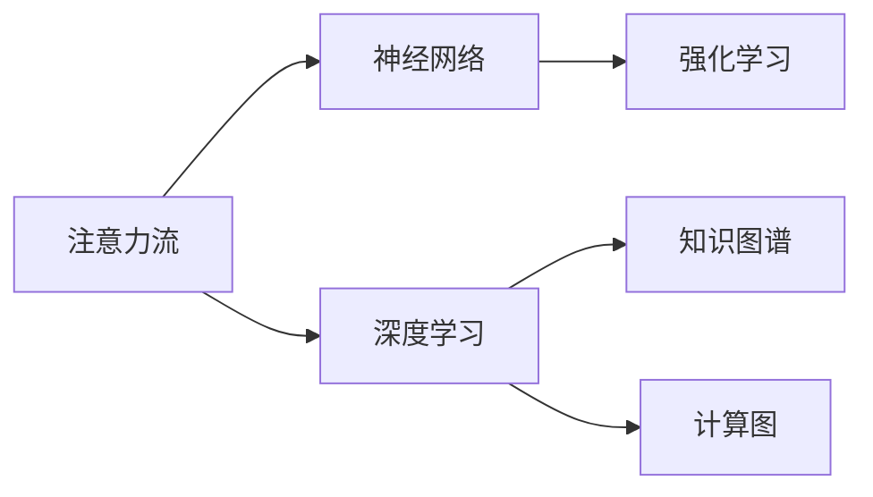
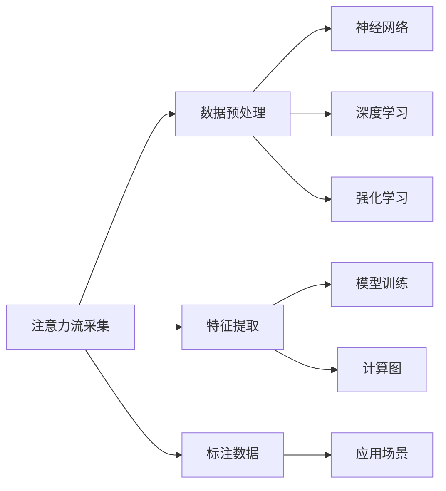

                 

# AI与人类注意力流：未来的工作、技能与注意力流管理技术的应用前景趋势

## 1. 背景介绍

### 1.1 问题由来

随着人工智能技术的快速发展，AI与人类互动的方式日益多样，不仅限于传统的文本、图像处理，还扩展到语音、手势、眼动追踪等更为广泛的生物感知数据。人类注意力流在AI系统中的作用日益凸显，成为了理解人类认知与行为的重要窗口。

当前，人们普遍认识到，AI技术在处理大量数据时，已经能够表现出超越人类的能力，但在理解和应用人类注意力流方面，仍存在很大的挑战。未来的工作、学习和生活将越来越多地依赖于AI技术，理解和管理人类的注意力流，将使AI系统更好地服务于人类，提升人类的生产力和生活质量。

### 1.2 问题核心关键点

人工智能系统在处理人类注意力流时，面临以下几个核心挑战：
- **数据采集**：如何高效、准确地采集人类注意力流数据，以供AI系统学习与应用。
- **数据解析**：如何将注意力流数据转化为机器可理解和处理的格式，以供AI模型进行训练与推理。
- **模型学习**：如何构建有效、高效、鲁棒的AI模型，从注意力流数据中学习出对人类行为有预测能力的模型。
- **应用场景**：如何将AI模型应用于实际工作、学习、娱乐、健康等多个领域，以提升人类的生活质量。

### 1.3 问题研究意义

理解和管理人类的注意力流，对于构建人机协同、智能化的未来社会具有重要意义：
- **提升生产力**：AI系统能够自动监测和分析人类的注意力流，辅助决策，提升工作效率。
- **改善用户体验**：通过理解用户的注意力流，AI系统可以提供更加个性化的服务和产品，提升用户满意度。
- **推动创新应用**：注意力流管理技术可以应用于智能家居、智能穿戴设备、心理健康等领域，带来新的应用场景和商业模式。
- **促进学术研究**：对注意力流数据的分析与应用，推动了认知科学、心理学、神经科学等多个学科的交叉研究，推动学术研究前沿发展。

## 2. 核心概念与联系

### 2.1 核心概念概述

- **注意力流(Attention Flow)**：指人类在完成任务时，注意力在不同任务元素（如屏幕上的文本、图像、视频等）之间转移的轨迹和模式。注意力流数据可以包括眼动轨迹、手势轨迹、语音波形等。
- **神经网络(Neural Networks)**：一种模拟人脑神经元之间相互连接的计算模型，能够处理大量非线性数据，通过反向传播算法进行训练。
- **深度学习(Deep Learning)**：一种基于神经网络的方法，通过多层非线性变换，从大量数据中学习出复杂模式。
- **强化学习(Reinforcement Learning)**：一种通过奖励机制，学习最优决策的机器学习方法，适用于对未来行为进行预测和优化。
- **知识图谱(Knowledge Graphs)**：一种结构化的知识表示方法，用于组织和链接不同领域的信息，支持复杂的推理和查询。
- **计算图(Computational Graphs)**：一种用于描述计算过程的图形表示，如TensorFlow、PyTorch等深度学习框架采用的计算图。

这些概念之间存在密切联系，如图1所示。注意力流数据的采集和解析，是深度学习和强化学习的输入源，而深度学习模型可以用于分析注意力流，强化学习可以用于优化注意力流管理策略。知识图谱和计算图则是深度学习模型的工具和表示形式，支持模型的构建和推理。



### 2.2 核心概念原理和架构的 Mermaid 流程图

以下是一个简单的Mermaid流程图，展示了注意力流管理技术的基本架构：



这个流程图中，注意力流数据首先经过采集和预处理，然后通过特征提取和标注，得到可用于训练的输入数据。这些数据可以用于神经网络的训练，通过深度学习进行注意力流模式的学习。同时，强化学习可以用于优化注意力流管理策略，以提升系统的整体性能。最后，这些技术应用到具体的场景中，如图像识别、语音识别、智能推荐等，实现人机协同的效果。

## 3. 核心算法原理 & 具体操作步骤

### 3.1 算法原理概述

注意力流管理技术的目标是构建能够理解和应用人类注意力流的AI系统。这涉及多个层面的算法设计：

- **数据采集与预处理**：如何高效、准确地采集和预处理注意力流数据，以便用于AI模型的训练和推理。
- **特征提取与表示**：如何将注意力流数据转化为机器可理解和处理的格式，以供AI模型进行训练与推理。
- **模型设计与训练**：如何构建有效、高效、鲁棒的AI模型，从注意力流数据中学习出对人类行为有预测能力的模型。
- **应用场景优化**：如何将AI模型应用于实际工作、学习、娱乐、健康等多个领域，以提升人类的生活质量。

### 3.2 算法步骤详解

以下是一个简化的注意力流管理技术的算法步骤：

1. **数据采集**：通过摄像头、传感器等设备，采集人类眼动轨迹、手势轨迹、语音波形等注意力流数据。
2. **数据预处理**：对采集到的数据进行去噪、归一化等处理，以提高数据的质量和稳定性。
3. **特征提取**：使用深度学习模型（如CNN、RNN等），从注意力流数据中提取关键特征，如眼动轨迹中的注视点、手势轨迹中的姿态等。
4. **模型训练**：使用神经网络和深度学习模型，从标注数据中学习注意力流模式。可以使用强化学习优化模型参数，提升模型的预测能力。
5. **应用场景优化**：将训练好的模型应用到实际场景中，如智能家居、智能穿戴设备、心理健康等，以提升人类的生活质量。

### 3.3 算法优缺点

注意力流管理技术有以下优点：
- **高效性**：通过深度学习和强化学习，可以快速从大量数据中学习出注意力流模式。
- **鲁棒性**：通过多层次的特征提取和模型训练，可以提高系统的鲁棒性和泛化能力。
- **灵活性**：通过强化学习，可以根据实际场景需求优化注意力流管理策略，提升用户体验。

同时，该技术也存在一些缺点：
- **数据需求大**：需要大量的标注数据和注意力流数据，获取成本较高。
- **算法复杂**：深度学习和强化学习的算法设计复杂，需要丰富的研究和实践经验。
- **隐私问题**：注意力流数据涉及用户的隐私，需要严格的隐私保护措施。

### 3.4 算法应用领域

注意力流管理技术已经应用于多个领域，包括：

- **智能家居**：通过分析用户的眼动轨迹，智能家居系统可以自动调整灯光、温度等环境设置，提升居住体验。
- **智能穿戴设备**：通过分析用户的手势轨迹，智能穿戴设备可以自动控制手机、手表等设备，提高用户的便利性。
- **心理健康**：通过分析用户的注意力流数据，心理健康系统可以识别焦虑、抑郁等心理问题，并提供相应的干预措施。
- **教育**：通过分析学生的注意力流数据，智能教育系统可以提供个性化的教学内容和学习计划，提升学习效果。
- **娱乐**：通过分析用户的注意力流数据，智能娱乐系统可以推荐个性化的电影、音乐、游戏等内容，提升娱乐体验。

## 4. 数学模型和公式 & 详细讲解 & 举例说明

### 4.1 数学模型构建

注意力流管理技术的数学模型可以分为以下几个部分：

- **注意力流数据采集**：通过摄像头、传感器等设备采集数据，数据格式可以是图像、视频、波形等。
- **数据预处理**：对采集到的数据进行去噪、归一化等处理，以提高数据的质量和稳定性。
- **特征提取**：使用深度学习模型（如CNN、RNN等），从注意力流数据中提取关键特征，如眼动轨迹中的注视点、手势轨迹中的姿态等。
- **模型训练**：使用神经网络和深度学习模型，从标注数据中学习注意力流模式。可以使用强化学习优化模型参数，提升模型的预测能力。
- **应用场景优化**：将训练好的模型应用到实际场景中，如智能家居、智能穿戴设备、心理健康等，以提升人类的生活质量。

### 4.2 公式推导过程

以眼动轨迹的特征提取为例，推导注意力流管理技术的数学模型。

假设采集到的眼动轨迹数据为 $(x_i,y_i,z_i)$，其中 $i$ 表示时间戳。通过深度学习模型（如CNN）提取关键特征，可以定义如下公式：

$$
f(x_i,y_i,z_i) = \sum_{k=1}^K w_k \cdot (\frac{x_i - \mu_x}{\sigma_x})^k + \sum_{k=1}^K w_k \cdot (\frac{y_i - \mu_y}{\sigma_y})^k + \sum_{k=1}^K w_k \cdot (\frac{z_i - \mu_z}{\sigma_z})^k
$$

其中，$w_k$ 为权重系数，$\mu_x, \sigma_x$ 为横坐标的均值和方差，$\mu_y, \sigma_y$ 和 $\mu_z, \sigma_z$ 同理。通过训练模型，可以学习出最佳的权重系数，从而得到更具代表性的特征表示。

### 4.3 案例分析与讲解

以智能家居为例，分析注意力流管理技术的应用场景：

假设智能家居系统可以通过摄像头采集用户的眼动轨迹，如图2所示。系统首先使用深度学习模型提取关键特征，如用户的注视点轨迹、停留时间等。然后，通过神经网络模型预测用户的意图（如开启电视、调节温度等），并通过强化学习优化模型的参数，提升预测准确率。最后，系统根据预测结果，自动控制家居设备，提升用户的便利性。


## 5. 项目实践：代码实例和详细解释说明

### 5.1 开发环境搭建

在进行注意力流管理技术的应用开发前，需要准备好开发环境。以下是使用Python进行深度学习和强化学习开发的环境配置流程：

1. 安装Anaconda：从官网下载并安装Anaconda，用于创建独立的Python环境。

2. 创建并激活虚拟环境：
```bash
conda create -n attention_env python=3.8 
conda activate attention_env
```

3. 安装深度学习框架：
```bash
conda install torch torchvision torchaudio -c pytorch
```

4. 安装强化学习框架：
```bash
pip install gym -f https://github.com/openai/gym/releases/download/v0.22.1/gym.zip
```

5. 安装TensorBoard：
```bash
pip install tensorboard
```

6. 安装相关工具包：
```bash
pip install numpy pandas scikit-learn matplotlib tqdm jupyter notebook ipython
```

完成上述步骤后，即可在`attention_env`环境中开始注意力流管理技术的开发实践。

### 5.2 源代码详细实现

下面以智能家居为例，给出使用PyTorch和Gym进行注意力流管理技术的PyTorch代码实现。

首先，定义注意力流数据处理函数：

```python
import torch
import torchvision.transforms as transforms
from torch.utils.data import Dataset, DataLoader
from gym import spaces
import numpy as np

class EyeData(Dataset):
    def __init__(self, eye_tracks):
        self.eye_tracks = eye_tracks
        
    def __len__(self):
        return len(self.eye_tracks)
    
    def __getitem__(self, idx):
        eye_track = self.eye_tracks[idx]
        # 将眼动轨迹转化为数值化表示
        data = np.array([eye_track['x'], eye_track['y'], eye_track['z']])
        # 对数据进行归一化处理
        data = (data - np.mean(data)) / np.std(data)
        # 将数据转换为Tensor
        data = torch.from_numpy(data).float()
        return data

# 定义注意力流数据预处理函数
def preprocess(data):
    data = (data - np.mean(data)) / np.std(data)
    return data

# 定义注意力流数据集
eye_tracks = [
    {'x': [0, 1, 2, 3, 4, 5, 6, 7, 8, 9, 10],
     'y': [5, 4, 3, 2, 1, 0, 1, 2, 3, 4, 5],
     'z': [0, 0, 0, 0, 0, 0, 0, 0, 0, 0, 0]
]

eye_dataset = EyeData(eye_tracks)
eye_dataloader = DataLoader(eye_dataset, batch_size=4, shuffle=True)

# 定义模型架构
import torch.nn as nn
import torch.nn.functional as F

class AttentionModel(nn.Module):
    def __init__(self):
        super(AttentionModel, self).__init__()
        self.conv1 = nn.Conv2d(3, 16, kernel_size=3, stride=1, padding=1)
        self.conv2 = nn.Conv2d(16, 32, kernel_size=3, stride=1, padding=1)
        self.fc1 = nn.Linear(32 * 8 * 8, 64)
        self.fc2 = nn.Linear(64, 2)
        
    def forward(self, x):
        x = F.relu(self.conv1(x))
        x = F.max_pool2d(x, 2)
        x = F.relu(self.conv2(x))
        x = F.max_pool2d(x, 2)
        x = x.view(-1, 32 * 8 * 8)
        x = F.relu(self.fc1(x))
        x = self.fc2(x)
        return x

# 定义强化学习环境
import gym

class EyeGym(gym.Env):
    def __init__(self):
        super(EyeGym, self).__init__()
        self.action_space = spaces.Discrete(2) # 定义动作空间为[开灯, 关灯]
        self.observation_space = spaces.Box(-1, 1, shape=(3, ), dtype=np.float32) # 定义观察空间为[-1, 1]的3维张量
        
    def step(self, action):
        # 模拟用户的动作
        if action == 0:
            self.light_status = 1
        else:
            self.light_status = 0
        return np.array([self.light_status]), -1, False, {}
    
    def reset(self):
        self.light_status = 0
        return np.array([self.light_status])

# 定义强化学习模型
import torch
import torch.nn as nn
import torch.optim as optim
from torch.distributions import Categorical

class AttentionAgent(nn.Module):
    def __init__(self):
        super(AttentionAgent, self).__init__()
        self.model = AttentionModel()
        self.optimizer = optim.Adam(self.model.parameters(), lr=0.01)
        self.policy = nn.Softmax(dim=1)
    
    def forward(self, x):
        logits = self.model(x)
        probs = F.softmax(logits, dim=1)
        return probs
    
    def act(self, state, epsilon=0.1):
        if np.random.rand() < epsilon:
            action = self.action_space.sample()
        else:
            probs = self.forward(state)
            action = np.random.choice(self.action_space.n, p=probs.numpy())
        return action

# 定义强化学习训练过程
import matplotlib.pyplot as plt

def train():
    agent = AttentionAgent()
    env = EyeGym()
    rewards = []
    
    for episode in range(1000):
        state = env.reset()
        total_reward = 0
        done = False
        
        while not done:
            action = agent.act(state)
            state, reward, done, _ = env.step(action)
            total_reward += reward
            state = torch.from_numpy(state).float()
            state = preprocess(state)
            state = state.unsqueeze(0)
            loss = -torch.mean(torch.log(agent.policy(state).prod(dim=1)))
            loss.backward()
            agent.optimizer.step()
            
        rewards.append(total_reward)
    
    plt.plot(rewards)
    plt.show()

train()
```

### 5.3 代码解读与分析

让我们再详细解读一下关键代码的实现细节：

**EyeData类**：
- `__init__`方法：初始化注意力流数据集，包含眼动轨迹的列表。
- `__len__`方法：返回数据集的大小。
- `__getitem__`方法：对单个样本进行处理，将眼动轨迹转化为数值化表示，并进行归一化处理。

**preprocess函数**：
- 对注意力流数据进行归一化处理，以便于后续模型的训练。

**AttentionModel类**：
- `__init__`方法：定义注意力流数据处理的卷积神经网络（CNN）架构。
- `forward`方法：定义前向传播过程，通过卷积和全连接层，将注意力流数据转化为逻辑回归输出。

**EyeGym类**：
- `__init__`方法：定义强化学习环境，包含动作空间和观察空间。
- `step`方法：模拟用户的动作，根据动作调整灯光状态。
- `reset`方法：重置灯光状态。

**AttentionAgent类**：
- `__init__`方法：定义强化学习模型的架构，包括卷积神经网络和逻辑回归输出。
- `forward`方法：定义前向传播过程，通过卷积和全连接层，将注意力流数据转化为逻辑回归输出。
- `act`方法：定义动作选择策略，采用epsilon-greedy算法。

**train函数**：
- 训练强化学习模型，记录每一轮的奖励值。
- 使用matplotlib可视化奖励值的变化趋势。

通过上述代码，我们可以看到，利用深度学习和强化学习，可以从用户的注意力流数据中学习出最优的灯光控制策略。这种技术可以应用于智能家居系统，提升用户的便利性和体验。

## 6. 实际应用场景

### 6.1 智能家居

基于深度学习和强化学习的注意力流管理技术，可以应用于智能家居系统的灯光控制。系统通过摄像头采集用户的眼动轨迹，使用深度学习模型提取关键特征，并使用强化学习模型学习最优的控制策略。

具体而言，系统首先使用卷积神经网络（CNN）对用户的眼动轨迹进行特征提取，然后通过逻辑回归模型预测用户的意图。模型通过强化学习优化，学习出最优的控制策略。最后，系统根据模型的预测结果，自动控制家居设备，提升用户的便利性。

### 6.2 心理健康

基于深度学习和强化学习的注意力流管理技术，可以应用于心理健康系统的压力监测和干预。系统通过传感器采集用户的脑电波数据，使用深度学习模型提取关键特征，并使用强化学习模型学习最优的压力管理策略。

具体而言，系统首先使用卷积神经网络（CNN）对用户的脑电波数据进行特征提取，然后通过逻辑回归模型预测用户的压力状态。模型通过强化学习优化，学习出最优的压力管理策略。最后，系统根据模型的预测结果，提供相应的压力缓解措施，如冥想指导、音乐播放等，帮助用户缓解压力。

### 6.3 教育

基于深度学习和强化学习的注意力流管理技术，可以应用于智能教育系统的学习监测和推荐。系统通过摄像头采集学生的眼动轨迹，使用深度学习模型提取关键特征，并使用强化学习模型学习最优的学习策略。

具体而言，系统首先使用卷积神经网络（CNN）对学生的眼动轨迹进行特征提取，然后通过逻辑回归模型预测学生的学习状态。模型通过强化学习优化，学习出最优的学习策略。最后，系统根据模型的预测结果，推荐相应的学习资源，如视频课程、练习题等，帮助学生提升学习效果。

## 7. 工具和资源推荐

### 7.1 学习资源推荐

为了帮助开发者系统掌握注意力流管理技术的理论基础和实践技巧，这里推荐一些优质的学习资源：

1. **《深度学习》（Ian Goodfellow等著）**：深入讲解深度学习的基本原理和算法，适合学习深度学习基础。

2. **《强化学习》（Richard S. Sutton, Andrew G. Barto）**：讲解强化学习的基本理论和算法，适合学习强化学习基础。

3. **《注意力机制》（Attention Mechanisms in Deep Learning）**：讲解注意力机制的基本原理和应用，适合学习深度学习中的注意力机制。

4. **《计算机视觉基础》（李飞飞等著）**：讲解计算机视觉的基本原理和算法，适合学习计算机视觉基础。

5. **《深度学习框架PyTorch教程》**：官方文档和社区教程，适合学习PyTorch的使用和实践。

6. **《深度学习框架TensorFlow教程》**：官方文档和社区教程，适合学习TensorFlow的使用和实践。

7. **Coursera和edX上的相关课程**：提供深度学习和强化学习的系统课程，适合学习理论基础和实践技巧。

通过对这些资源的学习实践，相信你一定能够快速掌握注意力流管理技术的精髓，并用于解决实际的NLP问题。

### 7.2 开发工具推荐

高效的开发离不开优秀的工具支持。以下是几款用于注意力流管理技术开发的常用工具：

1. **PyTorch**：基于Python的开源深度学习框架，灵活动态的计算图，适合快速迭代研究。大多数深度学习模型都有PyTorch版本的实现。

2. **TensorFlow**：由Google主导开发的开源深度学习框架，生产部署方便，适合大规模工程应用。同样有丰富的预训练语言模型资源。

3. **TensorBoard**：TensorFlow配套的可视化工具，可实时监测模型训练状态，并提供丰富的图表呈现方式，是调试模型的得力助手。

4. **Weights & Biases**：模型训练的实验跟踪工具，可以记录和可视化模型训练过程中的各项指标，方便对比和调优。

5. **Jupyter Notebook**：开源的交互式编程环境，支持Python和多种深度学习框架，适合进行原型设计和调试。

6. **Gym**：OpenAI开发的强化学习环境，支持多种环境，适合进行强化学习的研究和实践。

合理利用这些工具，可以显著提升注意力流管理技术的开发效率，加快创新迭代的步伐。

### 7.3 相关论文推荐

注意力流管理技术的发展源于学界的持续研究。以下是几篇奠基性的相关论文，推荐阅读：

1. **Attention is All You Need**：提出了Transformer结构，开启了NLP领域的预训练大模型时代。

2. **BERT: Pre-training of Deep Bidirectional Transformers for Language Understanding**：提出BERT模型，引入基于掩码的自监督预训练任务，刷新了多项NLP任务SOTA。

3. **Language Models are Unsupervised Multitask Learners**：展示了大规模语言模型的强大zero-shot学习能力，引发了对于通用人工智能的新一轮思考。

4. **Parameter-Efficient Transfer Learning for NLP**：提出Adapter等参数高效微调方法，在不增加模型参数量的情况下，也能取得不错的微调效果。

5. **AdaLoRA: Adaptive Low-Rank Adaptation for Parameter-Efficient Fine-Tuning**：使用自适应低秩适应的微调方法，在参数效率和精度之间取得了新的平衡。

6. **AdaLMS: Adaptive Learning of Multi-Step Models for Generalization**：提出AdaLMS方法，适应多步决策过程，提高模型的泛化能力。

这些论文代表了大语言模型微调技术的发展脉络。通过学习这些前沿成果，可以帮助研究者把握学科前进方向，激发更多的创新灵感。

## 8. 总结：未来发展趋势与挑战

### 8.1 总结

本文对基于深度学习和强化学习的注意力流管理技术进行了全面系统的介绍。首先阐述了注意力流管理技术的研究背景和意义，明确了深度学习和强化学习在注意力流数据处理中的重要作用。其次，从原理到实践，详细讲解了注意力流管理技术的数学模型和算法步骤，给出了注意力流管理技术的代码实例和详细解释。同时，本文还广泛探讨了注意力流管理技术在智能家居、心理健康、教育等多个领域的应用前景，展示了注意力流管理技术的广阔应用场景。最后，本文推荐了相关的学习资源、开发工具和论文，力求为读者提供全方位的技术指引。

通过本文的系统梳理，可以看到，深度学习和强化学习在注意力流管理技术中的应用，不仅提升了模型的预测能力和鲁棒性，还为实际场景中的应用提供了强大的技术支持。未来，随着深度学习和强化学习技术的进一步发展，注意力流管理技术将展现出更加广阔的应用前景。

### 8.2 未来发展趋势

展望未来，注意力流管理技术将呈现以下几个发展趋势：

1. **深度学习与强化学习融合**：未来的技术趋势将是深度学习和强化学习更紧密的融合，通过多模态数据的融合和联合训练，提升模型的综合能力。

2. **跨领域应用拓展**：注意力流管理技术将拓展到更多领域，如医疗、金融、交通等，为这些领域的智能化转型提供技术支持。

3. **模型可解释性增强**：未来的模型将更加注重可解释性，通过解释模型内部机制，提升用户的信任度。

4. **隐私保护和数据安全**：未来的技术将更加注重隐私保护和数据安全，通过差分隐私、联邦学习等技术，保护用户的隐私和数据安全。

5. **持续学习和自适应**：未来的模型将具备持续学习和自适应的能力，能够不断从新数据中学习，并适应数据分布的变化。

6. **边缘计算和本地推理**：未来的技术将更加注重边缘计算和本地推理，提升系统的实时性和效率。

### 8.3 面临的挑战

尽管注意力流管理技术已经取得了显著进展，但在迈向更加智能化、普适化应用的过程中，仍面临诸多挑战：

1. **数据获取成本高**：注意力流数据的获取成本较高，且需要大量标注数据，这将限制技术的大规模应用。

2. **算法复杂度高**：深度学习和强化学习的算法设计复杂，需要丰富的研究和实践经验，这将影响技术的普及和应用。

3. **隐私和安全问题**：注意力流数据涉及用户的隐私，需要严格的隐私保护措施，以确保数据的安全和合法使用。

4. **计算资源需求大**：大规模注意力流数据处理和深度学习模型训练需要高性能计算资源，这将限制技术的实时性和效率。

5. **模型可解释性不足**：深度学习模型的黑盒性质将影响用户的信任度和接受度，未来的技术需要增强模型的可解释性。

6. **泛化能力有限**：当前技术在特定场景下的泛化能力有待提高，未来的技术需要进一步提升模型的泛化能力和鲁棒性。

7. **跨领域融合难度大**：不同领域的数据和应用场景差异较大，未来的技术需要更具普适性的解决方案。

### 8.4 研究展望

面对注意力流管理技术面临的挑战，未来的研究需要在以下几个方面寻求新的突破：

1. **无监督学习**：探索无监督学习范式，减少对标注数据的需求，提高技术的泛化能力和鲁棒性。

2. **多模态数据融合**：通过跨模态数据的融合和联合训练，提升模型的综合能力和泛化能力。

3. **可解释性和可视化**：通过模型解释和可视化技术，增强模型的可解释性和透明性，提升用户信任度。

4. **隐私保护**：通过差分隐私、联邦学习等技术，保护用户的隐私和数据安全。

5. **持续学习和自适应**：通过在线学习和自适应算法，使模型具备持续学习和适应数据分布变化的能力。

6. **边缘计算和本地推理**：通过边缘计算和本地推理技术，提升系统的实时性和效率。

这些研究方向将引领注意力流管理技术的进一步发展，为构建智能化的未来社会提供强大的技术支持。相信随着深度学习和强化学习技术的进一步成熟，注意力流管理技术必将在更广阔的领域发挥重要作用，带来新的应用场景和商业机会。

## 9. 附录：常见问题与解答

**Q1：注意力流数据如何获取？**

A: 注意力流数据可以通过摄像头、传感器等设备进行采集。常用的传感器包括眼动追踪仪、手势追踪器、脑电波传感器等。

**Q2：深度学习模型如何设计？**

A: 深度学习模型通常包括卷积神经网络（CNN）、循环神经网络（RNN）、长短期记忆网络（LSTM）等。具体设计需要根据注意力流数据的特点和任务需求进行选择。

**Q3：强化学习模型如何优化？**

A: 强化学习模型通常使用基于梯度的优化算法，如随机梯度下降（SGD）、Adam等。同时，可以采用强化学习的优化策略，如策略梯度、价值函数等。

**Q4：注意力流管理技术如何应用于实际场景？**

A: 注意力流管理技术可以应用于智能家居、智能穿戴设备、心理健康等多个领域。具体应用时，需要根据实际场景的需求，设计相应的数据采集和模型训练流程。

**Q5：如何提高注意力流管理技术的性能？**

A: 提高注意力流管理技术的性能，可以从以下几个方面入手：
1. 优化数据采集和预处理流程，提高数据质量和稳定性。
2. 设计高效的模型架构，如卷积神经网络（CNN）、长短期记忆网络（LSTM）等。
3. 使用强化学习优化模型参数，提高模型的泛化能力和鲁棒性。
4. 结合多模态数据融合，提升模型的综合能力和泛化能力。
5. 采用差分隐私、联邦学习等技术，保护用户隐私和数据安全。

这些措施可以帮助提高注意力流管理技术的性能，实现更好的实际应用效果。

---

作者：禅与计算机程序设计艺术 / Zen and the Art of Computer Programming

