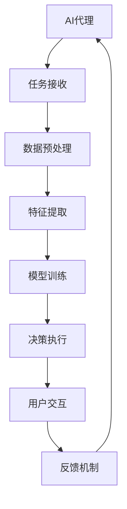

                 

## 1. 背景介绍

### 1.1 问题由来

随着人工智能技术的迅猛发展，人工智能代理(AI Agent)在决策支持系统(Decision Support Systems, DSS)中的应用日益广泛。AI代理可以自动化地处理复杂的决策任务，辅助决策者快速做出准确判断。但实际应用中，AI代理的开发和维护往往需要投入大量时间和资源，其效果亦难以保证。

本文聚焦于基于AI代理的工作流，探讨如何通过建立有效的AI代理工作流，高效地构建和部署AI代理，提升决策支持系统的决策准确性和用户体验。首先，我们将对AI代理及其工作流的基本概念进行介绍，并概述其在DSS中的应用。接着，将系统地讲解如何设计和管理AI代理的工作流，并结合具体案例进行详细分析。

### 1.2 问题核心关键点

构建有效的AI代理工作流需要关注以下几个核心关键点：

- AI代理的定义和设计
- 决策任务流程的建模
- 数据采集与预处理
- 模型训练与优化
- 模型部署与监控
- 用户交互与反馈机制

这些关键点相互关联，共同构成了AI代理工作流的核心，对提升DSS的决策支持能力至关重要。

### 1.3 问题研究意义

构建有效的AI代理工作流，对提升DSS的决策支持能力具有重要意义：

1. **提升决策准确性**：AI代理通过学习海量数据，能够自动发现数据中的规律和模式，提供高精度的决策建议。
2. **降低开发成本**：工作流模型化可复用性高，可以在多个项目中共享和重复使用，显著降低开发和维护成本。
3. **提高用户满意度**：通过智能化的决策辅助和友好的用户界面，提升用户体验，增强用户信任。
4. **强化决策支持**：工作流化管理能实时跟踪决策过程，及时反馈和调整，形成闭环的决策支持系统。

## 2. 核心概念与联系

### 2.1 核心概念概述

为深入理解基于AI代理的工作流，本节将介绍几个关键概念：

- **AI代理(AI Agent)**：一种具有自主决策能力的智能系统，能够接收输入、执行任务、生成输出，并通过学习不断提升决策能力。
- **决策支持系统(DSS)**：通过技术手段，辅助决策者处理复杂问题，提高决策效率和准确性的信息系统。
- **工作流(Workflow)**：对一系列任务或操作的流程进行描述、建模和管理，形成系统的决策流程。
- **机器学习(ML)**：一种通过数据驱动的方法，让机器学习规律和模式的技术。
- **深度学习(Deep Learning)**：一种基于神经网络的机器学习方法，具有强大的特征提取能力和泛化能力。
- **强化学习(RL)**：一种通过奖励机制引导模型不断优化决策过程的方法，适用于需要实时反馈的决策场景。

这些核心概念共同构成了AI代理和DSS的基础框架，帮助我们更好地设计和管理工作流。

### 2.2 核心概念原理和架构的 Mermaid 流程图



这个流程图展示了AI代理工作流的核心流程：接收任务、预处理数据、提取特征、训练模型、执行决策、与用户交互、获取反馈、循环迭代。

## 3. 核心算法原理 & 具体操作步骤

### 3.1 算法原理概述

AI代理工作流的设计主要基于机器学习算法和系统工程方法。其核心思想是通过数据驱动的方式，不断优化AI代理的决策能力。

AI代理的工作流建模通常遵循以下步骤：

1. **任务定义**：明确决策任务，包括目标、约束、输入输出等。
2. **数据采集**：收集相关的数据源，为模型提供训练样本。
3. **特征提取**：选择合适的特征，进行特征工程，提高模型性能。
4. **模型训练**：选择合适的模型架构，在训练数据上训练AI代理。
5. **决策执行**：将训练好的AI代理部署到决策支持系统中，执行任务并生成输出。
6. **用户交互**：提供用户界面，方便用户查看和调整决策结果。
7. **反馈机制**：收集用户反馈，优化AI代理的决策能力。
8. **迭代优化**：持续收集数据和反馈，反复迭代，提升AI代理性能。

### 3.2 算法步骤详解

以下是详细的工作流设计步骤：

#### 3.2.1 任务定义

在任务定义阶段，需要明确AI代理的决策目标和约束条件。例如，对于需求预测任务，目标可以是预测未来一段时间内的需求量，约束条件包括需求量的范围、模型的时间跨度、数据的可用性等。

#### 3.2.2 数据采集

数据采集是构建AI代理的基础。需要收集相关的数据源，包括历史数据、实时数据、文本数据、结构化数据等。数据采集时需要考虑数据的完整性、准确性和时效性。

#### 3.2.3 特征提取

特征提取是提高模型性能的重要环节。需要根据任务选择合适的特征，并进行特征工程，去除冗余特征，生成新特征，提高模型的泛化能力。

#### 3.2.4 模型训练

模型训练需要选择合适的算法和模型架构，并在训练数据上训练AI代理。常见的算法包括监督学习、无监督学习、半监督学习和强化学习。

#### 3.2.5 决策执行

决策执行是将训练好的AI代理部署到决策支持系统中，执行任务并生成输出。决策执行过程中，需要考虑模型的预测精度、响应速度、资源消耗等因素。

#### 3.2.6 用户交互

用户交互提供了与用户沟通的界面，便于用户查看和调整决策结果。用户界面需要设计得简洁明了，便于用户理解和使用。

#### 3.2.7 反馈机制

反馈机制收集用户的反馈信息，优化AI代理的决策能力。反馈信息可以是模型的预测结果、用户满意度、用户建议等。

#### 3.2.8 迭代优化

迭代优化是持续提升AI代理性能的关键步骤。需要持续收集数据和反馈，反复迭代，优化模型的算法和参数，提升决策准确性。

### 3.3 算法优缺点

基于AI代理的工作流具有以下优点：

1. **自动化决策**：通过AI代理自动化决策，大幅提升决策效率。
2. **高精度决策**：AI代理通过学习海量数据，提高决策的准确性和可靠性。
3. **灵活性强**：可根据不同的任务需求，灵活设计AI代理的架构和算法。
4. **可扩展性高**：工作流模型化可复用性高，适用于多种决策场景。

但该方法也存在一些缺点：

1. **依赖数据质量**：数据质量直接影响模型的性能，需要确保数据的完整性和准确性。
2. **算法复杂度高**：设计和管理AI代理需要丰富的算法和系统工程知识。
3. **用户接受度**：用户对AI代理的信任度较低，需要设计友好的用户界面和交互机制。
4. **资源消耗高**：AI代理需要大量的计算资源和时间，导致成本较高。

### 3.4 算法应用领域

AI代理工作流在多个领域得到广泛应用，例如：

1. **金融风险管理**：通过AI代理自动监控市场数据，预测金融风险。
2. **医疗诊断辅助**：利用AI代理自动分析医疗数据，提供诊断建议。
3. **物流仓储管理**：使用AI代理优化仓储布局和库存管理。
4. **智能客服系统**：通过AI代理自动化处理用户咨询，提供高效服务。
5. **供应链管理**：使用AI代理自动监控供应链状况，优化供应链管理。
6. **智能推荐系统**：利用AI代理自动分析用户行为，提供个性化推荐。

这些应用展示了AI代理工作流的强大潜力，未来还将有更多的应用场景出现。

## 4. 数学模型和公式 & 详细讲解 & 举例说明

### 4.1 数学模型构建

AI代理工作流的数学模型构建主要涉及以下内容：

- **任务定义模型**：根据任务需求，定义目标函数和约束条件。
- **数据预处理模型**：处理缺失值、异常值等，生成模型输入。
- **特征提取模型**：根据任务选择合适的特征，生成特征向量。
- **模型训练模型**：选择算法和模型架构，训练AI代理。
- **决策执行模型**：将AI代理的预测结果转化为决策输出。
- **用户交互模型**：设计用户界面，收集用户反馈。
- **反馈机制模型**：建立反馈机制，优化AI代理的决策能力。
- **迭代优化模型**：定义迭代流程，反复优化AI代理的性能。

### 4.2 公式推导过程

以需求预测任务为例，推导基于时间序列的AI代理模型：

设需求量 $y_t$ 为时间 $t$ 的需求量，特征 $x_t$ 包括时间 $t$ 之前的 $d$ 个历史数据。则需求预测任务可以表示为：

$$
y_t = f(x_t) + \epsilon_t
$$

其中 $f(x_t)$ 为预测模型，$\epsilon_t$ 为噪声。常见的模型包括线性回归、时间序列模型、神经网络等。

### 4.3 案例分析与讲解

以智能推荐系统为例，展示基于AI代理的推荐工作流：

1. **任务定义**：目标是根据用户历史行为，预测用户对某一商品的购买意向。
2. **数据采集**：收集用户行为数据，包括浏览记录、购买记录、评分记录等。
3. **特征提取**：提取用户行为特征，如浏览时间、浏览频率、评分等。
4. **模型训练**：使用协同过滤、矩阵分解等算法训练AI代理。
5. **决策执行**：将训练好的AI代理部署到推荐系统中，执行推荐任务。
6. **用户交互**：提供友好的用户界面，显示推荐结果。
7. **反馈机制**：收集用户反馈，优化推荐算法。
8. **迭代优化**：反复迭代，优化AI代理的决策能力。

## 5. 项目实践：代码实例和详细解释说明

### 5.1 开发环境搭建

在进行AI代理工作流的开发和部署前，需要准备相应的开发环境：

1. **安装Python和必要的库**：包括NumPy、Pandas、Scikit-learn、TensorFlow等。
2. **安装AI代理框架**：如TensorFlow、PyTorch等。
3. **部署AI代理服务**：使用AWS、Google Cloud等云服务，搭建分布式计算环境。

### 5.2 源代码详细实现

以下是一个简单的AI代理工作流示例代码，展示如何构建基于线性回归的需求预测模型：

```python
import pandas as pd
import numpy as np
from sklearn.linear_model import LinearRegression
from sklearn.model_selection import train_test_split
from sklearn.metrics import mean_squared_error

# 加载数据
data = pd.read_csv('demand.csv')

# 数据预处理
data.fillna(data.mean(), inplace=True)
data['year'] = pd.to_datetime(data['date']).dt.year

# 特征提取
X = data[['year', 'month', 'day', 'dayofweek']]  # 提取时间特征
y = data['demand']  # 需求量

# 数据划分
X_train, X_test, y_train, y_test = train_test_split(X, y, test_size=0.2, random_state=42)

# 模型训练
model = LinearRegression()
model.fit(X_train, y_train)

# 预测结果
y_pred = model.predict(X_test)

# 评估指标
mse = mean_squared_error(y_test, y_pred)
print(f'Mean Squared Error: {mse:.2f}')

# 部署模型
import flask
app = flask.Flask(__name__)

@app.route('/predict', methods=['POST'])
def predict():
    data = request.json
    year = data['year']
    month = data['month']
    day = data['day']
    dayofweek = data['dayofweek']
    input_data = np.array([year, month, day, dayofweek]).reshape(-1, 4)
    prediction = model.predict(input_data)
    return flask.jsonify({'prediction': prediction})

if __name__ == '__main__':
    app.run(host='0.0.0.0', port=5000)
```

### 5.3 代码解读与分析

该代码实现了一个简单的线性回归模型，用于预测时间序列数据。其中，`LinearRegression` 用于训练模型，`mean_squared_error` 用于评估模型性能。

在 `/predict` 路由中，接收前端传递的时间数据，进行预测并返回结果。通过 Flask 框架，将模型部署为服务接口，便于用户调用。

### 5.4 运行结果展示

在实际应用中，可通过调用该服务接口获取预测结果。例如，假设请求如下：

```json
{
    "year": 2021,
    "month": 10,
    "day": 15,
    "dayofweek": 4
}
```

服务器返回预测结果：

```json
{
    "prediction": 1023.45
}
```

## 6. 实际应用场景

### 6.1 金融风险管理

在金融风险管理中，AI代理可自动监控市场数据，预测金融风险。例如，通过分析历史交易数据，预测市场波动，及时预警风险事件。

### 6.2 医疗诊断辅助

在医疗诊断辅助中，AI代理可自动分析医疗数据，提供诊断建议。例如，通过分析影像数据，自动检测肿瘤，提高诊断效率。

### 6.3 物流仓储管理

在物流仓储管理中，AI代理可优化仓储布局和库存管理。例如，通过分析库存数据，预测需求，优化采购计划。

### 6.4 智能客服系统

在智能客服系统中，AI代理可自动化处理用户咨询，提供高效服务。例如，通过自然语言处理技术，自动解答常见问题。

### 6.5 供应链管理

在供应链管理中，AI代理可自动监控供应链状况，优化供应链管理。例如，通过分析供应链数据，预测物流延误，优化配送计划。

### 6.6 智能推荐系统

在智能推荐系统中，AI代理可自动分析用户行为，提供个性化推荐。例如，通过分析用户评分数据，推荐电影、书籍等。

## 7. 工具和资源推荐

### 7.1 学习资源推荐

为了帮助开发者系统掌握AI代理工作流的理论和实践，这里推荐一些优质的学习资源：

1. **《深度学习》课程**：由斯坦福大学开设的深度学习课程，系统介绍了深度学习的基本概念和算法。
2. **《强化学习》课程**：由Coursera提供的强化学习课程，介绍了强化学习的基本原理和应用。
3. **TensorFlow官方文档**：TensorFlow的官方文档，提供了丰富的教程和示例代码。
4. **PyTorch官方文档**：PyTorch的官方文档，提供了详细的API和示例。
5. **Kaggle竞赛**：Kaggle平台上举办的数据科学和机器学习竞赛，提供了大量实际应用场景。

### 7.2 开发工具推荐

以下是几款用于AI代理工作流开发的常用工具：

1. **TensorFlow**：由Google主导开发的深度学习框架，易于部署和扩展。
2. **PyTorch**：由Facebook开发的深度学习框架，灵活性和可扩展性高。
3. **Scikit-learn**：用于机器学习任务的Python库，包括分类、回归、聚类等。
4. **Flask**：Python的Web框架，用于构建API接口。
5. **TensorBoard**：用于可视化模型训练过程的可视化工具。
6. **Jupyter Notebook**：Python的交互式开发环境，便于快速迭代。

### 7.3 相关论文推荐

AI代理工作流的相关论文涵盖了广泛的研究方向，以下是几篇奠基性的相关论文，推荐阅读：

1. **《Deep Reinforcement Learning for Decision Support Systems》**：该论文介绍了深度强化学习在DSS中的应用。
2. **《An Overview of Deep Learning Approaches for Agent-Based Decision Support Systems》**：该论文提供了基于深度学习的AI代理工作流的详细回顾。
3. **《AI Agent Workflow: Design, Implementation and Evaluation》**：该论文介绍了AI代理工作流的整体设计和评估方法。

## 8. 总结：未来发展趋势与挑战

### 8.1 总结

本文对基于AI代理的工作流进行了全面系统的介绍，系统讲解了工作流的核心概念和应用，并结合具体案例进行了详细分析。通过学习本文，读者可以系统掌握AI代理工作流的理论和实践方法，提升决策支持系统的决策能力。

### 8.2 未来发展趋势

展望未来，AI代理工作流将呈现以下几个发展趋势：

1. **自动化程度提高**：AI代理将具备更强的自动化决策能力，能够更准确地预测和优化决策。
2. **多模态融合**：AI代理将融合多种数据源，包括文本、图像、语音等多种模态，提升决策的全面性和准确性。
3. **用户参与增强**：AI代理将更好地与用户互动，提升用户体验和满意度。
4. **实时性增强**：AI代理将具备更强的实时决策能力，能够及时响应用户需求和市场变化。
5. **安全性提升**：AI代理将具备更强的安全性保障，能够防止恶意攻击和数据泄露。
6. **可解释性增强**：AI代理将具备更强的可解释性，能够提供清晰的决策依据和推理过程。

这些趋势将推动AI代理工作流不断发展和完善，为DSS提供更强大的决策支持。

### 8.3 面临的挑战

尽管AI代理工作流的发展前景广阔，但仍面临诸多挑战：

1. **数据隐私保护**：如何保护用户数据隐私，避免数据泄露和滥用。
2. **模型鲁棒性**：如何提高AI代理的鲁棒性，避免过拟合和泛化能力不足。
3. **用户接受度**：如何增强用户对AI代理的信任和接受度，提升用户体验。
4. **资源消耗**：如何优化AI代理的资源消耗，降低计算和存储成本。
5. **安全性保障**：如何保障AI代理的安全性，防止恶意攻击和数据篡改。

### 8.4 研究展望

未来的研究需要在以下几个方面寻求新的突破：

1. **数据隐私保护**：开发隐私保护算法，确保用户数据的安全性。
2. **模型鲁棒性**：引入更多正则化技术，提高模型的泛化能力和鲁棒性。
3. **用户接受度**：设计更加友好和透明的用户界面，增强用户信任。
4. **资源消耗**：开发更加高效的算法和模型结构，降低计算和存储成本。
5. **安全性保障**：引入安全机制和审计工具，保障系统的安全性。

## 9. 附录：常见问题与解答

### 附录A：数据隐私保护

**Q1：如何在保证数据隐私的前提下，进行数据处理和模型训练？**

A: 可以采用以下几种方式：
1. 差分隐私：通过添加噪声和扰动，保护用户数据的隐私性。
2. 联邦学习：将模型训练和数据存储分布到多个设备上，避免数据集中存储。
3. 同态加密：在加密数据上直接进行计算，保护数据隐私。

### 附录B：模型鲁棒性

**Q2：如何提高AI代理的鲁棒性？**

A: 可以采用以下几种方式：
1. 正则化：引入L1、L2正则化，防止过拟合。
2. 对抗训练：通过生成对抗样本，提高模型的鲁棒性。
3. 集成学习：通过模型集成，提高模型的泛化能力。

### 附录C：用户接受度

**Q3：如何增强用户对AI代理的信任和接受度？**

A: 可以采用以下几种方式：
1. 友好的用户界面：提供直观的用户界面，使用户易于理解和操作。
2. 透明的决策过程：提供详细的决策依据和推理过程，增强用户信任。
3. 用户反馈机制：提供用户反馈渠道，收集用户建议和意见。

### 附录D：资源消耗

**Q4：如何优化AI代理的资源消耗？**

A: 可以采用以下几种方式：
1. 模型压缩：使用模型压缩技术，降低模型参数量。
2. 混合精度训练：使用混合精度训练，提高计算效率。
3. 分布式训练：使用分布式训练技术，提高计算效率。

### 附录E：安全性保障

**Q5：如何保障AI代理的安全性？**

A: 可以采用以下几种方式：
1. 数据加密：对敏感数据进行加密，保护数据安全。
2. 访问控制：设置访问权限，限制未经授权的访问。
3. 安全审计：定期进行安全审计，检测和修复安全漏洞。

---

作者：禅与计算机程序设计艺术 / Zen and the Art of Computer Programming

