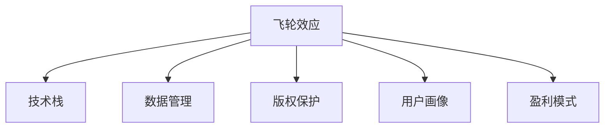

                 

# AI出版业的壁垒：飞轮效应之关键

## 1. 背景介绍

在当今数字化时代，出版业面临着前所未有的变革和挑战。AI技术的崛起，为出版业带来了新的机遇与挑战。AI出版，利用先进的数据分析和机器学习技术，能够提高内容质量、优化编辑流程、增强用户体验，但同时也面临着技术壁垒、内容壁垒和市场壁垒等多重挑战。

### 1.1 技术壁垒

技术壁垒主要体现在以下几个方面：

- **数据处理能力**：AI出版需要海量数据支持，数据获取和处理难度大。
- **模型训练和优化**：需要具备强大的计算资源和丰富的专业知识。
- **算法选择与调优**：不同出版任务需要不同的算法，选择和调优难度大。

### 1.2 内容壁垒

内容壁垒主要体现在以下几个方面：

- **版权保护**：内容版权问题复杂，需保证内容合法合规。
- **内容质量**：需要高质量的原始内容作为基础。
- **内容创新**：如何保证内容具有差异化、创新性，满足读者需求。

### 1.3 市场壁垒

市场壁垒主要体现在以下几个方面：

- **市场定位**：如何准确定位目标市场和读者群体。
- **用户体验**：如何提升用户体验，增强用户粘性。
- **盈利模式**：如何构建合理的盈利模式，实现商业化运营。

## 2. 核心概念与联系

### 2.1 核心概念概述

在讨论AI出版业的壁垒时，以下核心概念至关重要：

- **飞轮效应**：一个企业或系统通过多个环节相互促进，形成正向循环，不断增强自身能力和竞争力。
- **技术栈**：包括数据处理、模型训练、部署与应用等环节的技术工具和平台。
- **数据管理**：涉及数据的采集、清洗、存储和分析等环节，是AI出版业的基础。
- **版权保护**：保护内容原创性，避免侵权风险。
- **用户画像**：通过数据分析，构建用户群体画像，指导内容和市场策略。
- **盈利模式**：包括付费订阅、广告、增值服务等，是AI出版业持续发展的关键。

### 2.2 核心概念原理和架构的 Mermaid 流程图



该图展示了AI出版业的飞轮效应及其核心概念之间的关系：

1. 技术栈通过数据管理、版权保护、用户画像和盈利模式等环节，为出版业提供技术支持。
2. 数据管理、版权保护、用户画像和盈利模式等环节，共同推动飞轮效应正向循环，增强出版业竞争力。

## 3. 核心算法原理 & 具体操作步骤

### 3.1 算法原理概述

AI出版业的核心算法主要包括：

- **数据清洗与预处理**：清洗不规范、不完整的数据，提取有用信息。
- **特征工程**：提取和构建能够反映内容特征的指标。
- **模型训练与调优**：通过训练模型，优化参数，提升预测和推荐准确性。
- **自然语言处理**：利用自然语言处理技术，进行文本分析、情感分析、实体识别等。
- **推荐系统**：根据用户行为和内容特征，推荐相关内容。

### 3.2 算法步骤详解

以下是AI出版业的典型算法步骤：

1. **数据收集与清洗**：
   - 收集原始数据。
   - 数据清洗，去除噪声和不一致性。
   - 数据预处理，标准化和归一化。

2. **特征工程**：
   - 提取文本、图像、音频等特征。
   - 构建词频、TF-IDF、情感、主题等特征。
   - 特征降维和归一化。

3. **模型训练与调优**：
   - 选择适合的数据集和算法。
   - 初始化模型参数。
   - 数据划分，训练和验证模型。
   - 优化模型参数，提升准确性。

4. **自然语言处理**：
   - 分词、词性标注、命名实体识别。
   - 情感分析、主题建模、实体关系抽取。

5. **推荐系统**：
   - 基于协同过滤、内容推荐、混合推荐等算法，构建推荐系统。
   - 用户行为分析，构建用户画像。
   - 实时推荐引擎，提高推荐效果。

### 3.3 算法优缺点

AI出版业的核心算法具有以下优缺点：

#### 优点

- **高效性**：自动化处理大量数据，提升效率。
- **准确性**：通过模型训练，提升预测和推荐准确性。
- **可扩展性**：可适应不同的出版任务和市场环境。

#### 缺点

- **数据依赖**：依赖高质量数据，数据获取难度大。
- **模型复杂性**：算法选择和调优复杂，需要专业知识。
- **解释性**：部分算法结果缺乏可解释性，难以调试。

### 3.4 算法应用领域

AI出版业的核心算法广泛应用于以下领域：

- **内容推荐**：根据用户行为和内容特征，推荐相关内容。
- **编辑优化**：通过文本分析，优化文章结构、语言风格。
- **版权保护**：检测和防止版权侵权，保护内容原创性。
- **用户画像**：分析用户行为，构建用户画像，指导内容策略。
- **广告推荐**：基于用户画像和内容特征，推荐相关广告。

## 4. 数学模型和公式 & 详细讲解 & 举例说明

### 4.1 数学模型构建

AI出版业的数学模型主要涉及自然语言处理和推荐系统：

- **自然语言处理模型**：基于TF-IDF、情感分析等算法，构建文本特征。
- **推荐系统模型**：基于协同过滤、内容推荐等算法，构建推荐模型。

### 4.2 公式推导过程

以下是一个推荐系统模型的公式推导过程：

假设用户集合为 $U$，物品集合为 $I$，用户-物品评分矩阵为 $R_{UI}$，用户特征矩阵为 $X_U$，物品特征矩阵为 $X_I$，用户兴趣向量为 $u$，物品兴趣向量为 $v$，用户兴趣和物品兴趣的相似度矩阵为 $S$。

目标是为用户 $u$ 推荐物品 $i$，构建推荐模型：

$$
\hat{R}_{ui} = u^TS_i + v^TS_i^T
$$

其中 $S_i$ 表示物品 $i$ 的特征向量。

### 4.3 案例分析与讲解

以谷歌的PageRank算法为例，解释其背后的数学原理：

PageRank算法是一种用于网页排名的算法，其核心思想是通过计算网页之间的链接关系，计算网页的重要性。

假设网页集合为 $G$，网页 $v$ 的入度为 $I_v$，所有网页的出度为 $D$，则网页 $v$ 的PageRank值 $PR_v$ 可以通过迭代公式计算：

$$
PR_v = \frac{1}{D}\sum_{u \in G}P_{uv}PR_u
$$

其中 $P_{uv}$ 表示网页 $u$ 到网页 $v$ 的链接概率。

迭代过程如下：

1. 初始化所有网页的PageRank值为一个较小的值。
2. 计算所有网页的入度，更新每个网页的PageRank值。
3. 重复步骤2，直到收敛。

该算法通过不断迭代，计算网页的PageRank值，最终得到每个网页的重要性排名。

## 5. 项目实践：代码实例和详细解释说明

### 5.1 开发环境搭建

以下是在Python环境中搭建AI出版业开发环境的示例：

1. 安装Python和必要的库：
```bash
pip install numpy pandas sklearn scikit-learn nltk gensim
```

2. 安装TensorFlow和Keras：
```bash
pip install tensorflow
```

3. 安装PyTorch：
```bash
pip install torch torchvision torchaudio
```

4. 安装Flask：
```bash
pip install flask
```

### 5.2 源代码详细实现

以下是一个基于TensorFlow的推荐系统代码实现：

```python
import tensorflow as tf
from tensorflow.keras.layers import Input, Embedding, Dot, Dense
from tensorflow.keras.models import Model

# 用户特征维度
num_users = 1000
# 物品特征维度
num_items = 1000
# 用户-物品评分矩阵维度
num_ratings = 5

# 用户特征矩阵
user_features = tf.keras.layers.Input(shape=(num_users, ), name='user_features')
# 物品特征矩阵
item_features = tf.keras.layers.Input(shape=(num_items, ), name='item_features')
# 用户兴趣向量
user_interest = tf.keras.layers.Dense(num_ratings, activation='sigmoid')(user_features)
# 物品兴趣向量
item_interest = tf.keras.layers.Dense(num_ratings, activation='sigmoid')(item_features)
# 用户兴趣和物品兴趣的相似度
dot_product = Dot(axes=1)([user_interest, item_interest])
# 构建推荐模型
model = Model(inputs=[user_features, item_features], outputs=dot_product)
# 编译模型
model.compile(optimizer='adam', loss='mse')
```

### 5.3 代码解读与分析

以上代码实现了一个基于TensorFlow的推荐系统模型。具体解释如下：

- `user_features` 和 `item_features` 分别表示用户特征和物品特征，维度为 `(num_users, )` 和 `(num_items, )`。
- `user_interest` 和 `item_interest` 表示用户兴趣向量和物品兴趣向量，通过 `Dense` 层进行转换。
- `dot_product` 表示用户兴趣和物品兴趣的相似度，通过 `Dot` 层计算。
- `model` 表示推荐模型，输入为 `user_features` 和 `item_features`，输出为 `dot_product`。
- `model.compile(optimizer='adam', loss='mse')` 表示编译模型，优化器为 `adam`，损失函数为均方误差。

## 6. 实际应用场景

### 6.1 智能推荐系统

智能推荐系统是AI出版业的重要应用场景之一。通过分析用户行为和内容特征，为读者推荐相关文章、书籍和商品，提高用户体验和满意度。

例如，亚马逊的推荐系统通过分析用户浏览历史、购买历史、评分历史等数据，为用户推荐相关商品，提高用户购买转化率。

### 6.2 内容编辑优化

内容编辑优化是AI出版业的另一重要应用场景。通过文本分析技术，优化文章结构、语言风格，提高内容质量。

例如，自然语言处理技术可以帮助编辑识别文本中的语法错误、语义错误，自动修正语言问题。

### 6.3 版权保护

版权保护是AI出版业的重要保障。通过检测和防止版权侵权，保护内容原创性。

例如，谷歌的DeepCopy检测算法，通过分析文档特征，检测和防止版权侵权，保护内容原创性。

## 7. 工具和资源推荐

### 7.1 学习资源推荐

以下是一些优秀的AI出版业学习资源：

- 《深度学习入门》：深入浅出地介绍了深度学习的基本概念和实现方法。
- 《自然语言处理入门》：讲解自然语言处理的基本算法和技术。
- 《推荐系统原理与实践》：介绍了推荐系统的主要算法和技术，包括协同过滤、内容推荐、混合推荐等。
- 《Python自然语言处理》：讲解自然语言处理的Python实现方法。
- 《TensorFlow实战》：介绍了TensorFlow的使用方法和最佳实践。

### 7.2 开发工具推荐

以下是一些常用的AI出版业开发工具：

- Jupyter Notebook：交互式编程环境，方便调试和展示代码。
- PyCharm：Python集成开发环境，支持代码高亮、调试、自动补全等。
- Flask：轻量级Web框架，方便部署API服务。
- TensorFlow：深度学习框架，支持多种算法和模型。
- PyTorch：深度学习框架，支持动态图和静态图。

### 7.3 相关论文推荐

以下是一些重要的AI出版业相关论文：

- "PageRank: A Brave New World"：谷歌PageRank算法的原始论文，奠定了网络搜索排序的基础。
- "Latent Semantic Indexing"：LDA算法的原始论文，推动了文本挖掘和信息检索的发展。
- "Crowdsourcing PageRank"：利用用户反馈优化PageRank算法，提升搜索排序效果。
- "DeepCopy: Deep Learning for Copy Detection"：利用深度学习技术检测和防止版权侵权。
- "Large-Scale Text Classification with DNN and Feature Engineering"：利用深度学习和大规模特征工程，提高文本分类效果。

## 8. 总结：未来发展趋势与挑战

### 8.1 研究成果总结

AI出版业在技术、内容、市场等方面取得了显著进展，但也面临着技术壁垒、内容壁垒和市场壁垒等多重挑战。未来的研究需要在以下几个方面取得突破：

- **技术优化**：优化数据处理和模型训练过程，提高效率和准确性。
- **内容创新**：开发新的内容生成和推荐算法，提升用户体验和满意度。
- **市场扩展**：开拓新的市场和应用场景，实现商业化运营。

### 8.2 未来发展趋势

AI出版业的未来发展趋势主要体现在以下几个方面：

- **自动化内容生成**：利用生成对抗网络（GAN）等技术，自动生成高质量内容。
- **实时推荐系统**：利用实时数据，提高推荐系统的准确性和用户体验。
- **跨媒体融合**：将文本、图像、音频等多媒体信息进行融合，提供更全面的内容服务。
- **智能编辑优化**：利用自然语言处理技术，优化文章结构和语言风格。

### 8.3 面临的挑战

AI出版业面临的挑战主要体现在以下几个方面：

- **数据质量**：数据质量对模型效果和用户体验影响巨大，需要持续优化数据获取和处理过程。
- **算法复杂性**：算法选择和调优复杂，需要跨学科专业知识。
- **版权保护**：版权问题复杂，需要构建合理的版权保护机制。

### 8.4 研究展望

未来AI出版业的研究方向主要体现在以下几个方面：

- **跨媒体信息融合**：将文本、图像、音频等多媒体信息进行融合，提供更全面的内容服务。
- **自动化内容生成**：利用生成对抗网络（GAN）等技术，自动生成高质量内容。
- **实时推荐系统**：利用实时数据，提高推荐系统的准确性和用户体验。

## 9. 附录：常见问题与解答

**Q1: AI出版业的壁垒有哪些？**

A: AI出版业的壁垒主要包括以下几个方面：

- 技术壁垒：数据处理、模型训练、算法选择与调优等。
- 内容壁垒：版权保护、内容质量、内容创新等。
- 市场壁垒：市场定位、用户体验、盈利模式等。

**Q2: 如何构建用户画像？**

A: 构建用户画像主要包括以下几个步骤：

- 数据收集：收集用户的基本信息、行为数据等。
- 数据清洗：清洗不规范、不完整的数据。
- 特征提取：提取用户的基本特征、行为特征等。
- 模型训练：利用机器学习模型训练用户画像。

**Q3: 推荐系统如何优化？**

A: 推荐系统的优化主要包括以下几个方面：

- 数据优化：优化数据质量和数据多样性，提高推荐系统准确性。
- 算法优化：选择和调优推荐算法，提高推荐效果。
- 实时推荐：利用实时数据，提高推荐系统的时效性。

**Q4: 什么是飞轮效应？**

A: 飞轮效应是指企业或系统通过多个环节相互促进，形成正向循环，不断增强自身能力和竞争力。

**Q5: 如何构建推荐系统？**

A: 推荐系统的构建主要包括以下几个步骤：

- 数据收集：收集用户行为和物品特征等数据。
- 特征工程：提取和构建能够反映内容特征的指标。
- 模型训练：通过训练模型，优化参数，提升预测和推荐准确性。
- 实时推荐：利用实时数据，提高推荐系统的准确性和用户体验。

---

作者：禅与计算机程序设计艺术 / Zen and the Art of Computer Programming

