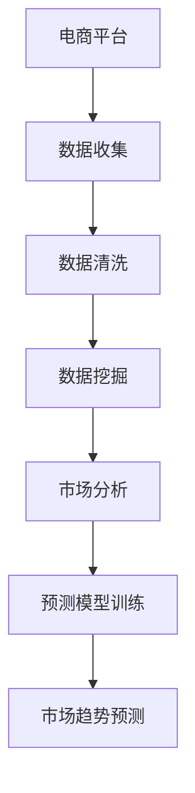

                 

# AI在电商平台市场趋势分析中的应用

> 关键词：电商平台,市场分析,人工智能,数据挖掘,机器学习,预测模型,大数据,算法优化

## 1. 背景介绍

### 1.1 问题由来

随着电子商务的蓬勃发展，电商平台已成为全球消费者购物的主要渠道之一。各大电商平台为了争夺市场份额，提升用户体验，纷纷投入大量资源进行市场分析和预测。但传统市场分析方法存在诸多局限，如数据处理复杂、分析效率低下、预测准确度不高等问题。近年来，人工智能(AI)技术的发展为电商平台市场分析带来了新的思路和工具。

### 1.2 问题核心关键点

AI技术在电商平台市场分析中的应用，关键点在于数据处理、模型训练、预测分析等方面。具体如下：

1. **数据处理**：电商平台拥有海量用户行为数据，但这些数据往往具有异构性和高维度特性，需要先进的算法和技术进行处理，以提取有价值的信息。

2. **模型训练**：利用机器学习算法对处理后的数据进行建模，训练出能够对市场趋势进行预测的模型。

3. **预测分析**：利用训练好的模型，对未来的市场趋势进行预测和分析，辅助决策制定。

4. **算法优化**：对现有算法进行优化，提高模型训练效率和预测准确度。

## 2. 核心概念与联系

### 2.1 核心概念概述

为更好地理解AI在电商平台市场分析中的应用，本节将介绍几个密切相关的核心概念：

- **电商平台**：指在线销售商品和服务的网站平台，包括阿里巴巴、京东、亚马逊等。

- **市场分析**：指对市场数据进行收集、整理、分析和预测，以辅助企业制定市场策略、优化运营流程等。

- **人工智能**：指利用计算机模拟人类的智能行为，实现数据的自动化处理和决策优化。

- **数据挖掘**：指从大数据中提取有用信息和知识的过程，常用于市场分析中的用户行为分析、商品推荐等。

- **机器学习**：指利用算法和统计方法，让计算机从数据中学习规律，并进行预测和决策。

- **预测模型**：指基于历史数据和机器学习算法，训练出能够对未来市场趋势进行预测的模型。

- **大数据**：指规模庞大、结构复杂的数据集合，常用于市场分析中的用户行为分析和市场趋势预测。

这些核心概念之间的逻辑关系可以通过以下Mermaid流程图来展示：



这个流程图展示了大语言模型的核心概念及其之间的关系：

1. 电商平台收集用户数据。
2. 数据经过清洗和挖掘，提取有用信息。
3. 信息用于市场分析，了解市场动态。
4. 分析结果用于训练预测模型。
5. 预测模型用于市场趋势预测。

## 3. 核心算法原理 & 具体操作步骤
### 3.1 算法原理概述

AI在电商平台市场分析中的应用，本质上是利用机器学习算法对海量数据进行处理和分析，从而预测市场趋势。其核心算法包括数据清洗、特征提取、模型训练、预测分析等步骤。

具体来说，市场分析流程包括以下几个关键步骤：

1. **数据收集**：从电商平台收集用户行为数据，如点击率、浏览记录、购买行为等。

2. **数据清洗**：处理缺失值、异常值等，确保数据的完整性和准确性。

3. **特征提取**：从数据中提取有用的特征，如用户行为特征、商品特征等。

4. **模型训练**：选择合适的机器学习算法，对提取出的特征进行建模，训练出预测模型。

5. **预测分析**：利用训练好的模型，对未来的市场趋势进行预测和分析，辅助决策制定。

### 3.2 算法步骤详解

**Step 1: 数据收集**

电商平台的市场分析首先需要收集用户行为数据。这些数据可以通过API接口、日志记录、行为追踪等方式获取。具体步骤如下：

- 从电商平台获取用户数据，包括点击率、浏览记录、购买行为等。
- 将数据存储在分布式存储系统中，如Hadoop、Spark等。
- 使用数据清洗工具，如Pandas、Spark SQL等，对数据进行处理和清洗。

**Step 2: 数据清洗**

数据清洗是市场分析的重要步骤，其目的是确保数据的完整性和准确性。具体步骤如下：

- 处理缺失值：使用插值、均值填充等方法，处理缺失数据。
- 处理异常值：使用离群点检测算法，如Z-score、IQR等，删除异常数据。
- 处理重复数据：使用去重算法，如MapReduce、Spark等，去除重复数据。

**Step 3: 特征提取**

特征提取是将原始数据转化为有意义的特征表示的过程。电商平台的特征提取通常包括用户特征和商品特征。具体步骤如下：

- 用户特征：从用户行为数据中提取用户行为特征，如浏览时间、点击次数、购买频率等。
- 商品特征：从商品描述、销售记录中提取商品特征，如价格、评分、类别等。

**Step 4: 模型训练**

模型训练是市场分析的核心步骤，通过训练机器学习模型，实现对市场趋势的预测。常见的模型包括线性回归、决策树、随机森林、神经网络等。具体步骤如下：

- 选择合适的机器学习算法，如回归、分类、聚类等。
- 将清洗后的数据分为训练集和测试集。
- 使用训练集对模型进行训练，调整模型参数，直到模型收敛。
- 使用测试集对模型进行验证，评估模型性能。

**Step 5: 预测分析**

预测分析是将训练好的模型应用于实际数据，对未来的市场趋势进行预测和分析。具体步骤如下：

- 将新数据输入训练好的模型，得到预测结果。
- 分析预测结果，了解市场趋势和变化规律。
- 根据预测结果，制定市场策略和运营计划。

### 3.3 算法优缺点

AI在电商平台市场分析中的应用，具有以下优点：

1. **高效性**：利用机器学习算法，可以高效处理海量数据，提取有用的信息。
2. **预测准确性**：通过训练预测模型，可以实现对市场趋势的精准预测。
3. **自动化**：市场分析过程自动运行，减少了人工干预的复杂性。

同时，该方法也存在一些局限性：

1. **数据质量依赖**：模型的预测效果依赖于数据的质量和完整性。
2. **模型选择困难**：不同的数据和问题需要不同的算法，选择合适的算法具有挑战性。
3. **模型解释性不足**：复杂的机器学习模型难以解释其决策过程。
4. **动态变化**：市场环境动态变化，模型需要定期更新以保持准确性。

尽管存在这些局限性，但就目前而言，AI在电商平台市场分析中的应用仍然是最主流的方法。未来相关研究的重点在于如何进一步提高模型的解释性和泛化能力，同时兼顾自动化和预测准确度。

### 3.4 算法应用领域

AI在电商平台市场分析中的应用，已经涵盖了从用户行为分析到市场趋势预测等多个方面，具体如下：

- **用户行为分析**：通过分析用户行为数据，了解用户偏好和购买意愿，优化用户体验。
- **商品推荐**：利用机器学习算法，为用户推荐合适的商品，提高销售转化率。
- **库存管理**：根据历史销售数据和市场预测，优化库存管理，降低成本。
- **市场趋势预测**：分析市场数据，预测未来趋势，制定市场策略。
- **个性化定价**：利用AI技术，对不同用户和市场进行个性化定价，提高利润率。
- **广告投放优化**：通过分析用户行为数据，优化广告投放策略，提高广告效果。

## 4. 数学模型和公式 & 详细讲解 & 举例说明
### 4.1 数学模型构建

本节将使用数学语言对AI在电商平台市场分析中的应用进行更加严格的刻画。

记电商平台市场分析的数据集为 $D=\{(x_i,y_i)\}_{i=1}^N$，其中 $x_i$ 表示用户行为数据，$y_i$ 表示商品销售情况。

定义市场分析的目标函数为 $f(x)$，即预测模型对用户行为数据的映射。设 $h(x)$ 为特征提取函数，$w$ 为模型参数。则市场分析的数学模型为：

$$
f(x) = h(x)w
$$

其中 $h(x)$ 为特征提取函数，可以将原始数据 $x$ 转化为特征向量。

### 4.2 公式推导过程

以下我们以线性回归模型为例，推导市场分析的预测公式及其梯度计算。

假设 $x_i$ 表示用户行为数据，$y_i$ 表示商品销售情况。则线性回归模型的预测公式为：

$$
\hat{y_i} = \sum_{j=1}^d x_{ij}w_j
$$

其中 $w$ 为模型参数，$d$ 为特征维度。

根据最小二乘法，模型参数 $w$ 的估计值为：

$$
w = (X^TX)^{-1}X^Ty
$$

其中 $X$ 为特征矩阵，$y$ 为目标向量。

在线性回归模型中，预测误差 $e$ 为实际值与预测值之差：

$$
e_i = y_i - \hat{y_i}
$$

根据梯度下降算法，模型参数的更新公式为：

$$
w \leftarrow w - \eta \nabla_{w}\frac{1}{2}\sum_{i=1}^N e_i^2
$$

其中 $\eta$ 为学习率。

在得到参数更新公式后，即可带入实际数据进行模型训练，不断迭代优化，直到达到预设的收敛条件。

### 4.3 案例分析与讲解

假设电商平台收集到一组用户行为数据，如点击次数、浏览时间、购买频率等，并标记了商品的销售情况。现利用线性回归模型对市场趋势进行预测。

**Step 1: 数据准备**

将收集到的用户行为数据和商品销售情况组成数据集 $D$。

**Step 2: 特征提取**

选择用户行为数据中的点击次数、浏览时间、购买频率作为特征向量 $x_i$。

**Step 3: 模型训练**

将数据集 $D$ 分为训练集和测试集。使用训练集对线性回归模型进行训练，得到模型参数 $w$。

**Step 4: 预测分析**

使用测试集对模型进行验证，计算预测误差，评估模型性能。

## 5. 项目实践：代码实例和详细解释说明
### 5.1 开发环境搭建

在进行市场分析实践前，我们需要准备好开发环境。以下是使用Python进行PyTorch开发的环境配置流程：

1. 安装Anaconda：从官网下载并安装Anaconda，用于创建独立的Python环境。

2. 创建并激活虚拟环境：
```bash
conda create -n market-analysis python=3.8 
conda activate market-analysis
```

3. 安装PyTorch：根据CUDA版本，从官网获取对应的安装命令。例如：
```bash
conda install pytorch torchvision torchaudio cudatoolkit=11.1 -c pytorch -c conda-forge
```

4. 安装其他必要工具包：
```bash
pip install pandas numpy scikit-learn tensorflow matplotlib
```

5. 安装Jupyter Notebook：
```bash
conda install jupyter notebook
```

完成上述步骤后，即可在`market-analysis`环境中开始市场分析实践。

### 5.2 源代码详细实现

下面以电商平台市场分析为例，给出使用PyTorch进行线性回归模型训练的代码实现。

首先，定义线性回归模型类：

```python
import torch
import torch.nn as nn
import torch.optim as optim

class LinearRegressionModel(nn.Module):
    def __init__(self, input_dim):
        super(LinearRegressionModel, self).__init__()
        self.linear = nn.Linear(input_dim, 1)
        
    def forward(self, x):
        return self.linear(x)

# 输入数据的特征维度
input_dim = 3

# 创建模型实例
model = LinearRegressionModel(input_dim)
```

接着，定义训练函数：

```python
from torch.utils.data import TensorDataset, DataLoader

def train_model(model, optimizer, loss_fn, train_loader, epochs):
    model.train()
    for epoch in range(epochs):
        for batch_idx, (inputs, targets) in enumerate(train_loader):
            optimizer.zero_grad()
            outputs = model(inputs)
            loss = loss_fn(outputs, targets)
            loss.backward()
            optimizer.step()
            
    return model
```

然后，定义数据处理和加载函数：

```python
def load_data():
    # 读取数据集
    data = pd.read_csv('market_analysis.csv')
    # 提取特征和标签
    features = data.drop(['label'], axis=1).values
    labels = data['label'].values
    # 将数据转化为Tensor格式
    features = torch.from_numpy(features).float()
    labels = torch.from_numpy(labels).float()
    # 划分训练集和测试集
    split_idx = int(0.8 * len(features))
    train_features, test_features = features[:split_idx], features[split_idx:]
    train_labels, test_labels = labels[:split_idx], labels[split_idx:]
    
    # 创建训练集和测试集
    train_dataset = TensorDataset(train_features, train_labels)
    test_dataset = TensorDataset(test_features, test_labels)
    
    # 创建数据加载器
    train_loader = DataLoader(train_dataset, batch_size=32, shuffle=True)
    test_loader = DataLoader(test_dataset, batch_size=32)
    
    return train_loader, test_loader

# 加载数据
train_loader, test_loader = load_data()
```

最后，启动模型训练并在测试集上评估：

```python
# 定义优化器和损失函数
optimizer = optim.SGD(model.parameters(), lr=0.01)
loss_fn = nn.MSELoss()

# 训练模型
model = train_model(model, optimizer, loss_fn, train_loader, 100)

# 评估模型
with torch.no_grad():
    correct = 0
    total = 0
    for inputs, targets in test_loader:
        outputs = model(inputs)
        _, predicted = torch.max(outputs.data, 1)
        total += targets.size(0)
        correct += (predicted == targets).sum().item()
    print('Accuracy: {} %'.format(100 * correct / total))
```

以上就是使用PyTorch对线性回归模型进行电商平台市场分析的完整代码实现。可以看到，利用PyTorch框架，市场分析的代码实现变得简洁高效。

### 5.3 代码解读与分析

让我们再详细解读一下关键代码的实现细节：

**load_data函数**：
- 从CSV文件中读取市场分析数据。
- 提取特征和标签，并将数据转化为Tensor格式。
- 划分训练集和测试集，创建数据加载器。

**train_model函数**：
- 定义训练循环，设置优化器和损失函数。
- 在每个epoch内，对每个batch进行前向传播和反向传播。
- 最终返回训练好的模型。

**train_model函数的调用**：
- 定义优化器和损失函数。
- 调用train_model函数进行模型训练。
- 在测试集上评估模型性能。

通过以上步骤，可以完成一个基本的电商平台市场分析模型训练流程。

## 6. 实际应用场景
### 6.1 智能推荐系统

智能推荐系统是电商平台市场分析的重要应用之一。通过分析用户行为数据，推荐系统能够为用户推荐合适的商品，提高用户满意度和购买转化率。

在技术实现上，可以收集用户的浏览记录、购买历史、评价反馈等数据，利用机器学习算法训练推荐模型。推荐模型能够根据用户的历史行为，预测其未来购买意愿，并根据预测结果进行商品推荐。推荐系统的核心在于特征工程，如何提取和组合用户行为特征，构建更精准的预测模型，是推荐系统成功的关键。

### 6.2 价格优化

价格优化是电商平台市场分析的另一个重要应用。通过分析市场数据，预测商品的销售情况，动态调整商品价格，可以有效提升销售额和利润率。

具体而言，可以收集历史销售数据、竞争对手价格、市场趋势等因素，利用时间序列分析、回归分析等算法，训练出价格预测模型。模型能够根据历史数据和市场趋势，预测未来价格走势，从而优化商品定价策略。

### 6.3 库存管理

库存管理是电商平台运营的核心环节。通过分析市场数据，预测商品需求，可以有效优化库存，降低成本。

在市场分析中，可以利用时间序列分析、回归分析等算法，预测未来商品需求。根据预测结果，优化库存策略，避免库存积压和缺货。同时，利用机器学习算法，分析用户行为数据，预测订单量，进一步优化库存管理。

### 6.4 未来应用展望

随着AI技术的发展，电商平台市场分析的应用将更加广泛和深入。未来，AI在电商平台市场分析中的应用，可能涉及以下几个方面：

- **个性化服务**：利用AI技术，分析用户行为数据，提供个性化的服务体验。
- **动态定价**：利用AI技术，实时调整商品价格，提高销售转化率和利润率。
- **市场趋势预测**：利用AI技术，预测市场趋势，制定科学的市场策略。
- **风险管理**：利用AI技术，分析市场数据，识别风险点，制定有效的风险管理策略。
- **营销优化**：利用AI技术，优化广告投放策略，提高广告效果。

## 7. 工具和资源推荐
### 7.1 学习资源推荐

为了帮助开发者系统掌握AI在电商平台市场分析的理论基础和实践技巧，这里推荐一些优质的学习资源：

1. 《深度学习理论与实践》系列博文：由大模型技术专家撰写，深入浅出地介绍了深度学习理论和实践技巧。

2. 《Python数据科学手册》：Python数据科学领域的经典书籍，涵盖了数据处理、机器学习、深度学习等方面的内容。

3. 《机器学习实战》：实用的机器学习项目实战教程，涵盖众多经典机器学习算法和案例。

4. Coursera《深度学习》课程：由斯坦福大学教授Andrew Ng开设的深度学习课程，深入浅出地介绍了深度学习的基本概念和算法。

5. 《TensorFlow实战》：TensorFlow深度学习框架的实战教程，涵盖TensorFlow的安装、使用和优化等方面的内容。

通过对这些资源的学习实践，相信你一定能够快速掌握AI在电商平台市场分析的精髓，并用于解决实际的NLP问题。

### 7.2 开发工具推荐

高效的开发离不开优秀的工具支持。以下是几款用于市场分析开发的常用工具：

1. PyTorch：基于Python的开源深度学习框架，灵活动态的计算图，适合快速迭代研究。

2. TensorFlow：由Google主导开发的开源深度学习框架，生产部署方便，适合大规模工程应用。

3. Jupyter Notebook：Python开发的交互式编程环境，方便快速开发和调试算法模型。

4. Weights & Biases：模型训练的实验跟踪工具，可以记录和可视化模型训练过程中的各项指标，方便对比和调优。

5. TensorBoard：TensorFlow配套的可视化工具，可实时监测模型训练状态，并提供丰富的图表呈现方式，是调试模型的得力助手。

6. Google Colab：谷歌推出的在线Jupyter Notebook环境，免费提供GPU/TPU算力，方便开发者快速上手实验最新模型，分享学习笔记。

合理利用这些工具，可以显著提升市场分析的开发效率，加快创新迭代的步伐。

### 7.3 相关论文推荐

AI在电商平台市场分析的发展源于学界的持续研究。以下是几篇奠基性的相关论文，推荐阅读：

1. Predictive Maintenance for Manufacturing Systems：利用机器学习算法，对制造业系统进行预测性维护。

2. Smart Recommendation Systems for Retailers：利用机器学习算法，构建智能推荐系统，提高用户满意度。

3. Pricing Strategy Optimization Using Artificial Intelligence：利用AI技术，优化商品定价策略，提高销售转化率。

4. Inventory Management Using Artificial Intelligence：利用AI技术，优化库存管理，降低运营成本。

这些论文代表了大模型市场分析技术的发展脉络。通过学习这些前沿成果，可以帮助研究者把握学科前进方向，激发更多的创新灵感。

## 8. 总结：未来发展趋势与挑战

### 8.1 总结

本文对AI在电商平台市场分析中的应用进行了全面系统的介绍。首先阐述了市场分析在电商平台中的重要性和现状，明确了AI技术在市场分析中的独特价值。其次，从原理到实践，详细讲解了市场分析的数学模型和算法流程，给出了市场分析任务开发的完整代码实例。同时，本文还广泛探讨了市场分析技术在智能推荐、价格优化、库存管理等多个行业领域的应用前景，展示了AI技术在电商平台中的广阔应用空间。

通过本文的系统梳理，可以看到，AI在电商平台市场分析中的应用已经取得了显著的成效，为电商平台的运营和决策提供了强有力的支持。未来，伴随AI技术的不断发展，市场分析技术必将更加智能化、自动化，为电商平台带来更高的效率和更好的用户体验。

### 8.2 未来发展趋势

展望未来，AI在电商平台市场分析的应用将呈现以下几个发展趋势：

1. **自动化程度提升**：随着AI技术的发展，市场分析过程将更加自动化，减少人工干预，提升效率。

2. **算法模型优化**：新的机器学习算法和模型将不断涌现，提升预测准确度和算法效率。

3. **多模态数据融合**：市场分析将更多地引入多模态数据，如文本、图像、视频等，提升数据丰富度。

4. **实时数据处理**：实时数据处理技术的发展，将使市场分析能够实时响应市场变化，快速做出决策。

5. **深度学习应用**：深度学习算法将在市场分析中发挥更大作用，提高预测准确度和模型性能。

6. **跨领域应用拓展**：市场分析技术将广泛应用于更多领域，如金融、医疗、制造等，为各行各业带来变革性影响。

以上趋势凸显了AI在电商平台市场分析技术的广阔前景。这些方向的探索发展，必将进一步提升市场分析的精度和效率，为电商平台带来更高的运营效益和客户满意度。

### 8.3 面临的挑战

尽管AI在电商平台市场分析中的应用已经取得了显著成效，但在迈向更加智能化、普适化应用的过程中，它仍面临诸多挑战：

1. **数据质量问题**：市场分析依赖于高质量的数据，但数据来源多样，数据质量参差不齐，如何确保数据的准确性和完整性，仍是挑战之一。

2. **算法复杂性**：复杂的机器学习算法，如深度学习模型，难以解释其决策过程，难以获得可靠的结果。

3. **模型泛化能力**：模型在训练集上表现良好，但在新数据上表现不佳，如何提高模型的泛化能力，是亟待解决的问题。

4. **资源消耗大**：大规模的市场分析需要大量的计算资源和存储空间，如何降低资源消耗，提高计算效率，是技术发展的瓶颈。

5. **隐私保护**：市场分析需要收集和处理大量的用户数据，如何保护用户隐私，避免数据泄露，也是重要的问题。

6. **模型更新频率**：市场环境快速变化，模型需要定期更新以保持准确性，如何高效地更新模型，是技术应用中的难题。

正视市场分析面临的这些挑战，积极应对并寻求突破，将使AI在电商平台市场分析中发挥更大的作用。相信随着学界和产业界的共同努力，这些挑战终将一一被克服，AI在电商平台市场分析中必将取得更大的成效。

### 8.4 研究展望

面向未来，AI在电商平台市场分析技术的研究展望如下：

1. **跨领域知识融合**：将不同领域知识与AI技术结合，提升市场分析的全面性和准确性。

2. **个性化服务**：利用AI技术，提供更加个性化的服务体验，提升用户满意度。

3. **动态定价**：利用AI技术，实时调整商品价格，提高销售转化率和利润率。

4. **风险管理**：利用AI技术，识别市场风险点，制定有效的风险管理策略。

5. **智能推荐**：利用AI技术，优化推荐算法，提高推荐效果。

6. **智能客服**：利用AI技术，提供智能客服服务，提升客户体验。

7. **可视化分析**：利用AI技术，提供可视化分析工具，帮助决策者直观理解市场动态。

这些研究方向将进一步推动AI在电商平台市场分析中的应用，为电商平台带来更高的效率和更好的用户体验。

## 9. 附录：常见问题与解答

**Q1：市场分析是否适用于所有电商平台？**

A: 市场分析技术适用于大部分电商平台，特别是那些拥有大量用户行为数据的平台。但对于一些用户数据较少的小型电商平台，市场分析的效果可能有限。因此，选择合适的市场分析技术和工具，需要根据平台的特点和需求进行评估。

**Q2：市场分析如何提高用户满意度？**

A: 市场分析通过分析用户行为数据，了解用户需求和偏好，从而为用户提供更精准的商品推荐和个性化服务。通过优化用户体验，提升用户满意度。

**Q3：市场分析如何优化库存管理？**

A: 市场分析通过预测商品需求，优化库存策略，避免库存积压和缺货。同时，利用用户行为数据，预测订单量，进一步优化库存管理。

**Q4：市场分析面临哪些挑战？**

A: 市场分析面临的主要挑战包括数据质量问题、算法复杂性、模型泛化能力不足、资源消耗大、隐私保护和模型更新频率等。解决这些问题需要技术手段和策略的结合。

**Q5：如何提高市场分析的预测准确度？**

A: 提高市场分析的预测准确度，需要优化特征提取和模型选择，增加训练数据量，提高模型泛化能力，采用先进的机器学习算法和模型。同时，不断调整和优化市场分析策略，以适应市场环境的变化。

通过以上对市场分析的介绍和实践，相信你能够更好地理解AI在电商平台中的应用，并应用于实际的商业决策中。

---

作者：禅与计算机程序设计艺术 / Zen and the Art of Computer Programming

