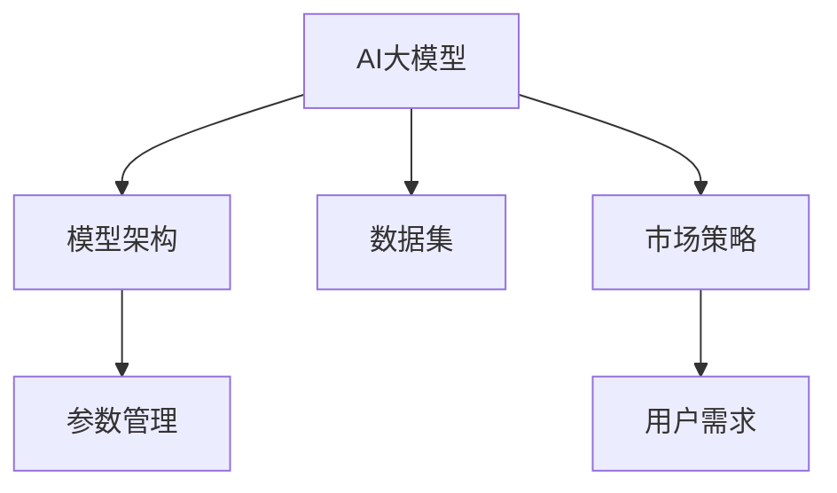

                 

# AI大模型创业：如何应对未来挑战？

## 1. 背景介绍

### 1.1 问题由来

随着人工智能(AI)技术的快速演进，AI大模型在各个行业中的应用越来越广泛。从自然语言处理(NLP)到计算机视觉(CV)，再到语音识别(SR)，AI大模型以其强大的处理能力、广泛的应用场景和高效率，正在重塑传统行业的数字化转型路径。然而，在AI大模型创业的过程中，面临着诸多前所未有的挑战。如何在激烈的市场竞争中取得突破？如何构建可持续发展的AI大模型公司？本文将详细探讨这些问题，并提出实用的应对策略。

### 1.2 问题核心关键点

AI大模型创业的核心挑战包括以下几个方面：

- **技术难题**：包括模型架构设计、算法优化、参数高效管理等。
- **数据难题**：如何获取高质量的数据，并合理利用数据进行模型训练。
- **市场竞争**：如何在竞争激烈的市场中脱颖而出，赢得用户和客户的信任。
- **产品化难题**：如何将技术转化为产品，满足用户需求，并提供持续的优化和支持。
- **伦理和法律**：如何确保AI大模型的使用符合伦理规范和法律法规，避免负面社会影响。

这些挑战需要创业者和技术人员共同面对，并寻找有效的解决方案。

## 2. 核心概念与联系

### 2.1 核心概念概述

为更好地理解AI大模型创业的技术和商业逻辑，本节将介绍几个核心概念：

- **AI大模型**：指以深度学习为基础的、能够处理大规模复杂任务的通用模型，如BERT、GPT-3等。
- **模型架构**：包括模型层数、神经元个数、激活函数等，是影响模型性能和效率的关键因素。
- **参数管理**：涉及模型参数的存储、调度和优化，是构建高性能、高效能模型的基础。
- **数据集**：高质量的数据集是模型训练和优化的基石，直接影响模型的表现。
- **市场策略**：包括产品定位、市场营销、客户服务等，是公司商业化的重要手段。
- **用户需求**：指AI大模型的使用者（企业、开发者、消费者）的需求和期望，是模型开发和优化的重要参考。

这些概念之间的逻辑关系可以通过以下Mermaid流程图来展示：



这个流程图展示了大模型创业的各个核心环节及其之间的关系：

1. **模型架构**：构建高性能的模型。
2. **参数管理**：优化模型参数，提高效率和效果。
3. **数据集**：提供高质量的数据。
4. **市场策略**：推广和应用模型。
5. **用户需求**：以用户为中心，持续改进模型。

这些环节相互配合，共同构建起AI大模型创业的成功路径。

## 3. 核心算法原理 & 具体操作步骤

### 3.1 算法原理概述

AI大模型的创业，需要掌握一系列核心算法和具体操作步骤，以确保模型的性能、效率和可扩展性。

**3.1.1 模型架构设计**：
选择或设计适合的模型架构，如Transformer、CNN、RNN等，是构建高性能AI大模型的基础。Transformer因其高效的自注意力机制，在大规模语言模型中表现优异。

**3.1.2 参数管理**：
模型参数是模型表现的核心，如何高效管理这些参数，直接关系到模型的性能和效率。参数高效管理包括参数剪枝、量化、压缩等技术，以减少模型大小，提高推理速度和效率。

**3.1.3 数据集构建和管理**：
高质量的数据集是模型训练的基石。数据集的构建需要考虑数据的来源、质量、多样性等因素，并合理利用数据进行模型训练和优化。

**3.1.4 训练和优化**：
模型训练需要选择合适的优化算法和超参数，如Adam、SGD等，并进行充分的训练和优化，以提高模型的性能和泛化能力。

**3.1.5 部署和应用**：
模型训练完成后，需要进行部署和应用，提供API接口、SDK工具包等，方便用户使用。

### 3.2 算法步骤详解

**Step 1: 设计模型架构**
- 选择或设计适合任务需求的模型架构，如Transformer、CNN、RNN等。
- 确定模型层数、神经元个数、激活函数等关键参数。

**Step 2: 收集和构建数据集**
- 从可靠的数据源获取高质量的数据集，确保数据的多样性和代表性。
- 数据集需要进行预处理，如清洗、归一化、标注等。

**Step 3: 模型训练和优化**
- 选择合适的优化算法和超参数，如Adam、SGD等，进行模型训练。
- 通过验证集评估模型性能，调整超参数，进行模型优化。

**Step 4: 模型部署和应用**
- 将训练好的模型进行部署，提供API接口、SDK工具包等，方便用户使用。
- 通过实时监控和反馈，不断优化模型性能。

### 3.3 算法优缺点

**优点**：
- **高性能**：构建的AI大模型能够处理大规模复杂任务，具备高效率和强大表现。
- **通用性**：模型架构和参数管理技术，使得模型可以适用于多种任务和场景。
- **可扩展性**：模型可以通过增加参数、层数等方式进行扩展，以适应更复杂的任务需求。

**缺点**：
- **高成本**：构建高性能AI大模型需要大量计算资源和时间。
- **数据依赖**：高质量的数据集是模型训练和优化的关键，但获取高质量数据集成本较高。
- **技术复杂**：模型架构设计、参数管理等技术复杂，需要高水平的技术团队。

### 3.4 算法应用领域

AI大模型在多个领域得到了广泛应用，包括：

- **自然语言处理(NLP)**：如文本分类、情感分析、机器翻译等。
- **计算机视觉(CV)**：如图像识别、目标检测、图像生成等。
- **语音识别(SR)**：如语音转文字、语音识别等。
- **智能推荐系统**：如个性化推荐、广告推荐等。
- **医疗健康**：如医学影像分析、健康数据分析等。

这些应用领域展示了AI大模型的强大潜力和广泛应用前景。

## 4. 数学模型和公式 & 详细讲解  
### 4.1 数学模型构建

构建AI大模型的数学模型，需要考虑模型的输入、输出、损失函数等关键要素。

假设输入数据为 $x \in \mathbb{R}^n$，输出数据为 $y \in \mathbb{R}^m$，则模型的数学模型可以表示为：

$$
y = f(x; \theta)
$$

其中，$f$ 为模型函数，$\theta$ 为模型参数。模型的损失函数通常为均方误差、交叉熵等，用于衡量模型预测结果与真实结果之间的差异。

### 4.2 公式推导过程

以线性回归模型为例，推导模型的损失函数和梯度公式。

假设模型 $y = f(x; \theta) = \theta^T x$，其中 $\theta \in \mathbb{R}^m$。则均方误差损失函数为：

$$
L(y, \hat{y}) = \frac{1}{2n} \sum_{i=1}^n (y_i - \hat{y}_i)^2
$$

其中 $y_i$ 为真实输出，$\hat{y}_i$ 为模型预测输出。

对模型参数 $\theta$ 的梯度公式为：

$$
\frac{\partial L}{\partial \theta} = \frac{1}{n} (X^T X)^{-1} X^T (y - X \theta)
$$

其中 $X = [x_1, x_2, ..., x_n]$，为输入数据的矩阵表示。

通过反向传播算法，可以高效计算梯度，并更新模型参数 $\theta$。

### 4.3 案例分析与讲解

以图像分类任务为例，展示如何构建和使用AI大模型。

假设输入数据为 $x = [x_{1,1}, x_{1,2}, ..., x_{m,n}]$，输出数据为 $y \in \{1, 2, ..., k\}$。可以设计一个卷积神经网络(CNN)模型：

$$
y = f(x; \theta) = \sigma(\text{Conv}(x; \theta_C) + \text{BN}(\theta_B) + \text{ReLU}(\theta_R) + \text{Dropout}(\theta_D) + \text{Dense}(\theta_D) + \text{Softmax}(\theta_S))
$$

其中 $\text{Conv}$、$\text{BN}$、$\text{ReLU}$、$\text{Dropout}$、$\text{Dense}$ 和 $\text{Softmax}$ 分别为卷积层、批量归一化层、ReLU激活函数、Dropout、全连接层和Softmax输出层。通过选择合适的超参数和优化算法，可以训练出高性能的AI大模型，用于图像分类任务。

## 5. 项目实践：代码实例和详细解释说明

### 5.1 开发环境搭建

在进行AI大模型创业的实践过程中，需要搭建高效、稳定的开发环境。以下是一些常用的开发环境配置：

**Python环境**：
- 安装Anaconda或Miniconda，创建独立的Python虚拟环境。
- 安装TensorFlow、PyTorch、Keras等深度学习框架。

**GPU环境**：
- 配置NVIDIA GPU，使用CUDA和cuDNN等加速库。
- 安装CUDA和cuDNN驱动，进行系统优化。

**分布式环境**：
- 使用Docker容器化，搭建多机分布式训练环境。
- 使用Horovod、MPI等工具，实现多机协同训练。

### 5.2 源代码详细实现

以下是使用PyTorch实现一个简单的AI大模型的代码示例：

```python
import torch
import torch.nn as nn
import torch.optim as optim

# 定义模型
class MyModel(nn.Module):
    def __init__(self):
        super(MyModel, self).__init__()
        self.conv1 = nn.Conv2d(3, 32, 3, 1, 1)
        self.conv2 = nn.Conv2d(32, 64, 3, 1, 1)
        self.pool = nn.MaxPool2d(2, 2)
        self.fc1 = nn.Linear(64 * 8 * 8, 128)
        self.fc2 = nn.Linear(128, 10)

    def forward(self, x):
        x = self.pool(nn.ReLU(self.conv1(x)))
        x = self.pool(nn.ReLU(self.conv2(x)))
        x = x.view(-1, 64 * 8 * 8)
        x = nn.ReLU(self.fc1(x))
        x = self.fc2(x)
        return x

# 加载数据集
train_dataset = torchvision.datasets.CIFAR10(root='data', train=True, download=True, transform=transforms.ToTensor())
test_dataset = torchvision.datasets.CIFAR10(root='data', train=False, download=True, transform=transforms.ToTensor())

# 定义模型、优化器和损失函数
model = MyModel()
criterion = nn.CrossEntropyLoss()
optimizer = optim.Adam(model.parameters(), lr=0.001)

# 训练模型
for epoch in range(10):
    running_loss = 0.0
    for i, data in enumerate(train_loader, 0):
        inputs, labels = data
        optimizer.zero_grad()
        outputs = model(inputs)
        loss = criterion(outputs, labels)
        loss.backward()
        optimizer.step()

# 测试模型
correct = 0
total = 0
with torch.no_grad():
    for data in test_loader:
        images, labels = data
        outputs = model(images)
        _, predicted = torch.max(outputs.data, 1)
        total += labels.size(0)
        correct += (predicted == labels).sum().item()

print('Accuracy: %d %%' % (100 * correct / total))
```

### 5.3 代码解读与分析

**MyModel类**：
- 定义了一个简单的卷积神经网络模型，包含两个卷积层、两个池化层、两个全连接层。

**数据集加载**：
- 使用PyTorch自带的CIFAR-10数据集，进行数据预处理和加载。

**模型训练和测试**：
- 定义优化器和损失函数，进行模型训练和测试，输出模型准确率。

**代码运行结果**：
- 运行上述代码，可以得到模型在CIFAR-10数据集上的准确率。

## 6. 实际应用场景

### 6.1 医疗影像分析

AI大模型在医疗影像分析中具有广泛应用。通过构建高性能的AI大模型，可以实现自动化、高精度的医学影像分析，辅助医生进行疾病诊断和治疗决策。

以肺结节检测为例，AI大模型可以通过学习大量的肺CT图像，检测出肺结节的位置、大小和性质，提供辅助诊断结果。医生可以结合AI模型的分析结果，进行更准确的疾病诊断和治疗方案制定。

### 6.2 智能推荐系统

AI大模型在智能推荐系统中的应用，可以显著提升推荐效果，提升用户体验。通过构建高性能的AI大模型，可以实现个性化推荐、广告推荐等任务。

以电商平台推荐为例，AI大模型可以根据用户的历史行为数据，分析用户的兴趣偏好，推荐相关的商品和广告，提升用户的购物体验和满意度。

### 6.3 智能客服系统

AI大模型在智能客服系统中的应用，可以显著提升客服效率和服务质量。通过构建高性能的AI大模型，可以实现自然语言理解、问答系统等任务。

以智能客服机器人为例，AI大模型可以通过学习大量的客户对话记录，理解客户的意图，生成合理的回答，提升客服的响应速度和准确率。

## 7. 工具和资源推荐

### 7.1 学习资源推荐

为了帮助开发者系统掌握AI大模型的创业技术和方法，这里推荐一些优质的学习资源：

- **深度学习课程**：如吴恩达的《深度学习》课程、Andrew Ng的《机器学习》课程等，系统介绍深度学习的基本概念和算法。
- **AI大模型教程**：如Hugging Face的Transformer教程、Google的BERT教程等，深入介绍AI大模型的构建和优化方法。
- **开源项目**：如TensorFlow、PyTorch等深度学习框架，提供丰富的开源项目和样例代码，方便开发者学习和实践。
- **学术研究**：如Arxiv、IEEE等学术平台，提供最新的AI大模型研究论文，跟踪前沿技术动态。

### 7.2 开发工具推荐

以下是几款用于AI大模型创业开发的常用工具：

- **Python环境**：如Anaconda、Miniconda等，提供高效的Python开发环境。
- **深度学习框架**：如TensorFlow、PyTorch等，提供丰富的模型库和优化算法。
- **数据处理工具**：如Pandas、NumPy等，提供高效的数据处理和分析工具。
- **可视化工具**：如TensorBoard、Weights & Biases等，提供实时的模型训练和性能监控。

### 7.3 相关论文推荐

AI大模型和创业技术的研究，离不开学界的持续探索和创新。以下是几篇奠基性的相关论文，推荐阅读：

- **Transformer架构**：Vaswani et al.《Attention is All You Need》，提出Transformer架构，推动了深度学习在自然语言处理领域的发展。
- **BERT模型**：Devlin et al.《BERT: Pre-training of Deep Bidirectional Transformers for Language Understanding》，提出BERT模型，刷新了多项自然语言处理任务的SOTA。
- **参数高效微调**：Zoph et al.《AdaLoRA: Adaptive Low-Rank Adaptation for Parameter-Efficient Fine-Tuning》，提出AdaLoRA方法，实现了参数高效微调。
- **提示学习**：Lewis et al.《Human-Like Text Generation Using Large Language Models》，提出提示学习技术，实现零样本和少样本学习。

## 8. 总结：未来发展趋势与挑战

### 8.1 总结

本文对AI大模型创业的技术和商业逻辑进行了详细探讨。首先介绍了AI大模型的背景和核心概念，明确了模型架构设计、参数管理、数据集构建等关键环节的重要性。其次，系统讲解了AI大模型的数学模型和算法，并给出了代码实例和运行结果。最后，讨论了AI大模型在医疗影像分析、智能推荐系统、智能客服系统等实际应用场景中的应用前景，并推荐了一些学习资源、开发工具和相关论文。

通过本文的系统梳理，可以看出AI大模型在多个行业中的应用前景广阔，具有广泛的市场需求。然而，在AI大模型创业的过程中，仍面临着诸多挑战，需要研究者持续探索和创新，才能在激烈的市场竞争中脱颖而出。

### 8.2 未来发展趋势

AI大模型创业的未来发展趋势包括：

- **模型性能提升**：随着算法和硬件的进步，AI大模型的性能将进一步提升，能够在更复杂的场景中发挥作用。
- **算法创新**：如因果推理、知识图谱等新算法的引入，将拓展AI大模型的应用范围，提升其鲁棒性和泛化能力。
- **多模态融合**：AI大模型将融合视觉、语音、文本等多种模态数据，提供更加全面和准确的信息处理能力。
- **边缘计算**：随着边缘计算技术的进步，AI大模型将能够在本地设备上实现推理和优化，提升实时性和效率。

### 8.3 面临的挑战

尽管AI大模型具有广泛的应用前景，但在实际应用中仍面临着诸多挑战：

- **数据质量**：高质量的数据集是AI大模型训练和优化的关键，但获取高质量数据集成本较高。
- **模型复杂度**：构建高性能的AI大模型需要高水平的技术团队，模型架构和参数管理等技术复杂。
- **计算资源**：AI大模型的训练和推理需要大量的计算资源和时间，成本较高。
- **伦理和法律**：AI大模型的使用需要符合伦理规范和法律法规，避免负面社会影响。

### 8.4 研究展望

未来的研究需要在以下几个方面寻求新的突破：

- **无监督和半监督学习**：摆脱对大规模标注数据的依赖，利用无监督和半监督学习范式，提高AI大模型的泛化能力。
- **模型压缩和优化**：通过模型剪枝、量化、压缩等技术，减小模型规模，提高推理效率和效率。
- **多模态数据融合**：融合视觉、语音、文本等多种模态数据，实现多模态信息协同建模，提升AI大模型的应用能力。
- **隐私保护和伦理**：研究隐私保护技术，确保AI大模型的数据安全和用户隐私，同时制定伦理规范，避免负面社会影响。

总之，AI大模型创业需要技术、商业和伦理等多方面的协同发力，才能实现可持续发展和商业化成功。只有持续探索和创新，才能应对未来挑战，推动AI大模型技术在各个行业中的应用。

## 9. 附录：常见问题与解答

**Q1：AI大模型的训练和优化需要注意哪些关键点？**

A: 训练和优化AI大模型需要注意以下关键点：
- 选择合适的损失函数和优化算法。
- 设计合适的模型架构和参数。
- 采用数据增强和正则化技术，避免过拟合。
- 进行超参数调优，优化模型性能。

**Q2：如何确保AI大模型的数据安全和用户隐私？**

A: 确保AI大模型的数据安全和用户隐私，需要注意以下关键点：
- 数据加密和匿名化处理。
- 访问控制和权限管理。
- 数据使用合规性和隐私政策。
- 数据审计和监控。

**Q3：AI大模型的部署和应用需要注意哪些问题？**

A: AI大模型的部署和应用需要注意以下问题：
- 模型裁剪和优化，提高推理效率。
- 模型可扩展性，支持大规模推理。
- 模型监控和维护，保证系统稳定运行。
- 用户反馈和优化，提升用户体验。

**Q4：如何构建高性能的AI大模型？**

A: 构建高性能的AI大模型需要注意以下关键点：
- 选择合适的模型架构和参数。
- 采用数据增强和正则化技术，避免过拟合。
- 进行超参数调优，优化模型性能。
- 采用模型压缩和优化技术，提高推理效率和效率。

**Q5：AI大模型的创业需要考虑哪些因素？**

A: AI大模型的创业需要考虑以下因素：
- 市场竞争和用户需求。
- 技术难题和数据难题。
- 产品化和商业化策略。
- 伦理和法律规范。

通过合理应对这些挑战，AI大模型创业将能够在激烈的市场竞争中取得成功，推动AI大模型技术的不断发展和应用。

