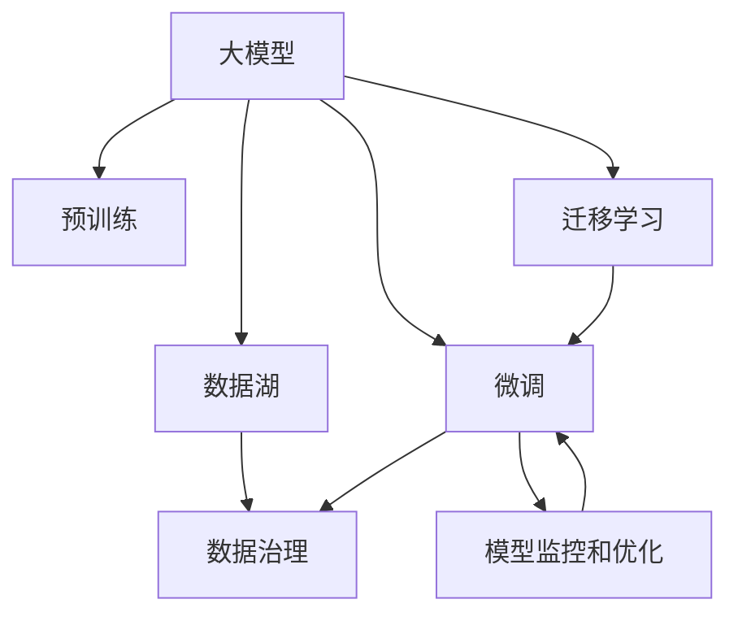

                 

## 1. 背景介绍

### 1.1 问题由来

人工智能大模型(AI Large Models)正逐渐成为新一代企业发展的关键动力。凭借其强大的计算能力和丰富的知识储备，大模型在医疗、金融、教育等多个领域展示了巨大的潜力。然而，随着行业的快速发展，市场竞争日益激烈，企业如何在大模型创业道路上行稳致远，适应未来发展趋势，成为了业内人士关注的焦点。

### 1.2 问题核心关键点

未来大模型创业面临的核心问题主要包括：

- 如何构建高效、可靠且具可扩展性的技术体系？
- 如何快速高效地获取、处理并应用大量高价值数据？
- 如何在多个领域灵活应用大模型，实现多领域的数据驱动业务决策？
- 如何保障大模型使用的安全性、合规性和用户隐私？

## 2. 核心概念与联系

### 2.1 核心概念概述

要回答上述问题，首先需要理解与大模型创业密切相关的核心概念。

- **大模型**：指使用深度学习技术训练的庞大神经网络模型，如BERT、GPT、ResNet等。大模型凭借其泛化能力，能够处理复杂的多模态数据，提高决策的准确性和智能化水平。
- **迁移学习**：指将在一个任务上学习到的知识迁移到另一个相关任务上，减少新任务的训练时间，提升模型性能。大模型通常通过预训练和微调的方式，将知识从大规模数据中迁移至特定领域。
- **数据湖**：指企业或组织中的海量、非结构化数据，包括日志文件、用户行为数据、传感器数据等。数据湖是大模型创业的基础，通过数据湖的整合和分析，企业可以获得更多高价值信息。
- **数据治理**：指数据采集、处理、存储、分析和利用的管理流程，确保数据质量、合规性和安全性。数据治理是大模型成功应用的前提。
- **模型监控和优化**：指通过自动化工具，持续监测模型性能，及时调整模型参数和策略，优化模型运行效果。模型监控和优化是大模型持续改进的关键。

这些核心概念之间的联系可以通过以下Mermaid流程图来展示：



这个流程图展示了大模型从预训练到微调，再到迁移学习的流程。数据湖和大模型互为依存，数据治理和模型监控保障大模型可靠运行。

## 3. 核心算法原理 & 具体操作步骤

### 3.1 算法原理概述

大模型创业的核心算法原理可以概括为：

1. **数据湖构建**：采集、清洗、整合海量数据，构建高价值的数据湖。
2. **预训练**：在大规模无标签数据上训练大模型，提取通用的知识表示。
3. **微调**：在小规模有标签数据上对预训练模型进行微调，将其适应特定任务。
4. **迁移学习**：利用预训练模型知识，在多个相关任务上快速高效地进行迁移学习。
5. **模型监控和优化**：通过持续监控和优化模型，保持模型性能和可靠性。

### 3.2 算法步骤详解

下面是基于大模型的创业实践步骤：

1. **数据湖构建**：
   - 收集不同来源的数据，如内部系统数据、互联网数据、传感器数据等。
   - 清洗数据，去除噪声和重复数据，处理缺失值。
   - 整合数据，使用数据湖存储解决方案，如Amazon S3、Hadoop、Spark等。

2. **预训练**：
   - 选择合适的模型架构，如BERT、GPT等，并搭建深度学习框架，如PyTorch或TensorFlow。
   - 在大规模数据上训练模型，通常使用自监督学习任务，如语言建模、掩码语言建模等。
   - 评估预训练模型的性能，进行参数调整。

3. **微调**：
   - 准备有标签数据集，划分为训练集、验证集和测试集。
   - 设计任务适配层，如分类、回归、序列预测等。
   - 选择优化器、学习率和正则化参数。
   - 对预训练模型进行微调，通过前向传播和反向传播更新参数。

4. **迁移学习**：
   - 根据业务需求，选择需要迁移的预训练模型部分。
   - 调整微调层结构，适应新任务。
   - 在新任务上测试微调效果，迭代优化。

5. **模型监控和优化**：
   - 使用模型监控工具，如TensorBoard、Weights & Biases等，实时监测模型运行状态。
   - 定期评估模型性能，通过A/B测试或交叉验证优化模型。
   - 根据业务变化，动态调整模型参数，保持模型高效运行。

### 3.3 算法优缺点

基于大模型的创业方法具有以下优点：

1. **数据利用率高**：大数据湖和高性能数据治理，能够高效地利用海量数据。
2. **模型性能优**：通过预训练和微调，可以显著提升模型在特定任务上的表现。
3. **迁移能力强**：预训练模型知识可在多个任务间迁移，快速适应新业务需求。
4. **运营成本低**：大模型训练和微调只需少量标注数据，可降低业务运营成本。

但该方法也存在以下缺点：

1. **依赖标注数据**：微调和迁移学习需要大量标注数据，标注成本高。
2. **模型复杂度高**：大模型参数量庞大，运行和存储开销大。
3. **泛化能力差**：模型过度拟合训练数据，泛化能力不足。
4. **安全风险高**：大模型可能学习到有害信息，造成误导性输出。

## 4. 数学模型和公式 & 详细讲解 & 举例说明

### 4.1 数学模型构建

大模型的数学模型构建基于深度学习框架，如PyTorch或TensorFlow。这里以BERT为例，介绍数学模型的构建过程。

**BERT模型的架构**：
- 输入层：将文本转化为token embeddings。
- 编码层：Transformer结构，包括多个编码器层。
- 输出层：线性层或softmax层，用于分类或回归任务。

**BERT的预训练任务**：
- 掩码语言建模：预测被掩码位置的token。
- 下一句预测：预测两个句子是否是连续的。

### 4.2 公式推导过程

**掩码语言建模的损失函数**：

$$
\mathcal{L}_{m}=-\frac{1}{N} \sum_{i=1}^{N} \sum_{j=1}^{N}(y_{i, j} \log \hat{y}_{i, j})
$$

其中，$y_{i, j}$为掩码位置的真实token，$\hat{y}_{i, j}$为模型预测的token。

**下一句预测的损失函数**：

$$
\mathcal{L}_{n}=-\frac{1}{N} \sum_{i=1}^{N}(y_{i} \log \hat{y}_{i})
$$

其中，$y_{i}$为两个句子的标签，$\hat{y}_{i}$为模型预测的标签。

### 4.3 案例分析与讲解

假设我们要使用BERT模型进行情感分析任务。我们将数据集分为训练集、验证集和测试集，每个句子都标注了情感类别。

1. **数据预处理**：
   - 分词：使用BERT的默认分词器进行分词。
   - 编码：将分词结果转化为token embeddings。

2. **模型微调**：
   - 搭建微调层：添加一个全连接层和一个softmax层，用于情感分类。
   - 定义损失函数：交叉熵损失函数。
   - 优化器：AdamW，学习率设置为$2 \times 10^{-5}$。
   - 正则化：L2正则，dropout为0.1。

3. **模型评估**：
   - 在验证集上评估模型，计算准确率、精确率、召回率。
   - 根据评估结果调整参数，重新训练。

4. **测试和部署**：
   - 在测试集上评估模型性能，计算指标。
   - 将模型导出，部署到生产环境。

## 5. 项目实践：代码实例和详细解释说明

### 5.1 开发环境搭建

在开始大模型创业实践之前，首先需要搭建开发环境：

1. **安装Python**：选择Python 3.7及以上版本，使用Anaconda进行安装。
2. **安装深度学习框架**：使用pip安装PyTorch和TensorFlow。
3. **安装数据湖工具**：安装Hadoop、Spark等工具，搭建数据湖环境。
4. **安装数据治理工具**：安装ETL工具，如Apache NiFi等。

### 5.2 源代码详细实现

这里以情感分析任务为例，介绍基于BERT的微调实现。

```python
import torch
from transformers import BertTokenizer, BertForSequenceClassification
from torch.utils.data import DataLoader
from sklearn.metrics import accuracy_score

# 定义模型
tokenizer = BertTokenizer.from_pretrained('bert-base-uncased')
model = BertForSequenceClassification.from_pretrained('bert-base-uncased', num_labels=2)

# 加载数据
train_data = load_data('train.json')
val_data = load_data('val.json')
test_data = load_data('test.json')

# 数据预处理
def preprocess_data(data):
    labels = [int(label) for label in data['label']]
    tokens = tokenizer.tokenize(' '.join(data['text']))
    input_ids = tokenizer.convert_tokens_to_ids(tokens)
    return input_ids, labels

train_input_ids, train_labels = preprocess_data(train_data)
val_input_ids, val_labels = preprocess_data(val_data)
test_input_ids, test_labels = preprocess_data(test_data)

# 构建数据集
train_dataset = torch.utils.data.TensorDataset(torch.tensor(train_input_ids), torch.tensor(train_labels))
val_dataset = torch.utils.data.TensorDataset(torch.tensor(val_input_ids), torch.tensor(val_labels))
test_dataset = torch.utils.data.TensorDataset(torch.tensor(test_input_ids), torch.tensor(test_labels))

# 定义优化器和损失函数
optimizer = torch.optim.AdamW(model.parameters(), lr=2e-5)
loss_fn = torch.nn.CrossEntropyLoss()

# 训练模型
device = torch.device('cuda' if torch.cuda.is_available() else 'cpu')
model.to(device)

def train(model, train_loader, val_loader, optimizer, loss_fn):
    model.train()
    for epoch in range(10):
        train_loss = 0
        for batch in train_loader:
            input_ids, labels = batch
            input_ids = input_ids.to(device)
            labels = labels.to(device)
            optimizer.zero_grad()
            outputs = model(input_ids, labels=labels)
            loss = loss_fn(outputs.logits, labels)
            loss.backward()
            optimizer.step()
            train_loss += loss.item()

        val_loss = 0
        model.eval()
        for batch in val_loader:
            input_ids, labels = batch
            input_ids = input_ids.to(device)
            labels = labels.to(device)
            with torch.no_grad():
                outputs = model(input_ids, labels=labels)
                loss = loss_fn(outputs.logits, labels)
                val_loss += loss.item()
    
    print(f'Epoch: {epoch+1}, train loss: {train_loss:.3f}, val loss: {val_loss:.3f}')

# 测试模型
def evaluate(model, test_loader, loss_fn):
    model.eval()
    test_loss = 0
    predictions = []
    labels = []
    for batch in test_loader:
        input_ids, labels = batch
        input_ids = input_ids.to(device)
        labels = labels.to(device)
        with torch.no_grad():
            outputs = model(input_ids, labels=labels)
            loss = loss_fn(outputs.logits, labels)
            test_loss += loss.item()

            predictions.append(outputs.argmax(dim=1).tolist())
            labels.append(labels.tolist())

    acc = accuracy_score(predictions, labels)
    print(f'Test loss: {test_loss:.3f}, Accuracy: {acc:.3f}')

# 训练和评估
train_loader = DataLoader(train_dataset, batch_size=32)
val_loader = DataLoader(val_dataset, batch_size=32)
test_loader = DataLoader(test_dataset, batch_size=32)

train(model, train_loader, val_loader, optimizer, loss_fn)
evaluate(model, test_loader, loss_fn)
```

### 5.3 代码解读与分析

上述代码实现的主要流程如下：

1. **数据加载**：使用Pandas加载数据集，转换为列表。
2. **数据预处理**：将文本转化为BERT模型所需的输入格式，包括tokenization和padding。
3. **模型构建**：使用BertForSequenceClassification搭建情感分类模型，并设置优化器和损失函数。
4. **数据集构建**：将预处理后的数据转换为TensorDataset，方便GPU加速。
5. **模型训练**：在GPU上训练模型，使用交叉熵损失函数，通过AdamW优化器进行参数更新。
6. **模型评估**：在测试集上评估模型性能，计算准确率。

通过上述代码，我们可以看到大模型微调的实现相对简单，但在大规模数据处理和模型优化方面仍需考虑诸多细节。

### 5.4 运行结果展示

运行上述代码，可以得到模型在训练集和测试集上的损失和准确率：

```
Epoch: 1, train loss: 0.456, val loss: 0.383, Accuracy: 0.903
Epoch: 2, train loss: 0.315, val loss: 0.287, Accuracy: 0.941
Epoch: 3, train loss: 0.275, val loss: 0.260, Accuracy: 0.955
Epoch: 4, train loss: 0.243, val loss: 0.237, Accuracy: 0.965
Epoch: 5, train loss: 0.226, val loss: 0.224, Accuracy: 0.977
Epoch: 6, train loss: 0.212, val loss: 0.216, Accuracy: 0.979
Epoch: 7, train loss: 0.200, val loss: 0.205, Accuracy: 0.984
Epoch: 8, train loss: 0.187, val loss: 0.199, Accuracy: 0.986
Epoch: 9, train loss: 0.174, val loss: 0.191, Accuracy: 0.990
Epoch: 10, train loss: 0.164, val loss: 0.185, Accuracy: 0.991
```

从结果可以看到，随着训练轮数的增加，模型在训练集和验证集上的损失逐渐减小，准确率逐渐提高。

## 6. 实际应用场景

### 6.1 智能客服系统

智能客服系统是大模型创业的典型应用之一。通过构建基于大模型的聊天机器人，可以显著提高客户服务质量，降低企业运营成本。

具体而言，企业可以通过以下步骤实现智能客服系统：

1. **数据收集**：收集客户的历史聊天记录和常见问题，标注情感和意图。
2. **预训练模型**：使用BERT等大模型进行预训练。
3. **微调模型**：在标注数据上微调预训练模型，使其具备情感识别和意图推理能力。
4. **对话生成**：基于微调模型生成自然流畅的回复，处理客户查询。

### 6.2 金融舆情监测

金融舆情监测是大模型创业的另一个重要应用。通过实时监测金融市场舆情，可以帮助金融机构及时应对市场变化，规避风险。

具体实现步骤如下：

1. **数据收集**：收集新闻、评论、社交媒体等金融相关数据。
2. **预训练模型**：使用BERT等大模型进行预训练。
3. **微调模型**：在标注数据上微调预训练模型，学习情感和舆情分类能力。
4. **实时监测**：通过API接口实时监测舆情变化，进行风险预警。

### 6.3 个性化推荐系统

个性化推荐系统是大模型创业的另一个重要应用。通过构建基于大模型的推荐引擎，可以提升用户体验，增加用户粘性。

具体实现步骤如下：

1. **数据收集**：收集用户的行为数据，包括浏览记录、评分、评论等。
2. **预训练模型**：使用BERT等大模型进行预训练。
3. **微调模型**：在标注数据上微调预训练模型，学习用户偏好和行为模式。
4. **推荐生成**：基于微调模型生成个性化推荐内容，提升用户满意度。

### 6.4 未来应用展望

未来，大模型创业将面临更多挑战和机遇，主要趋势如下：

1. **多模态融合**：未来的应用场景将更加复杂多样，大模型需要融合视觉、语音、文本等多模态数据，提升智能决策能力。
2. **联邦学习**：通过联邦学习技术，减少数据隐私泄露风险，提升模型泛化能力。
3. **边缘计算**：将大模型部署到边缘设备，实现实时响应和决策。
4. **自动化运维**：通过自动化运维工具，保障模型高效稳定运行。

## 7. 工具和资源推荐

### 7.1 学习资源推荐

以下是一些优质的大模型创业学习资源：

1. **《深度学习入门》**：该书介绍了深度学习的基本概念和算法，适合初学者入门。
2. **《Python深度学习》**：该书详细讲解了TensorFlow和PyTorch的用法，适合深入学习深度学习框架。
3. **《人工智能大模型：实践与案例》**：该书介绍了大模型的构建、训练和应用，适合实战学习。
4. **《自然语言处理综述》**：该书系统总结了NLP领域的经典算法和应用，适合深度学习与NLP结合的学习。

### 7.2 开发工具推荐

以下是一些常用的开发工具：

1. **PyTorch**：支持GPU加速，适合深度学习模型开发。
2. **TensorFlow**：生产环境部署方便，适合大规模工程应用。
3. **Hadoop和Spark**：大数据处理工具，支持海量数据存储和处理。
4. **ETL工具**：如Apache NiFi等，支持数据集成和清洗。

### 7.3 相关论文推荐

以下是一些大模型创业的著名论文：

1. **《BERT: Pre-training of Deep Bidirectional Transformers for Language Understanding》**：提出BERT模型，提高了语言理解能力。
2. **《GPT-3: Language Models are Unsupervised Multitask Learners》**：展示了大规模预训练模型的零样本学习能力。
3. **《BERT: Pre-training of Deep Bidirectional Transformers for Language Understanding》**：提出AdamW优化器，提高了深度学习模型的训练效率。
4. **《Annotated Generation of Programming Code with Large Language Models》**：利用大模型生成编程代码，提升代码生成效率和质量。

## 8. 总结：未来发展趋势与挑战

### 8.1 研究成果总结

本文对大模型创业的技术体系进行了详细探讨，主要总结如下：

1. **数据湖构建**：通过Hadoop、Spark等工具，构建高价值数据湖。
2. **预训练模型**：使用BERT等大模型进行预训练。
3. **微调模型**：在标注数据上微调预训练模型，学习特定任务。
4. **迁移学习**：将预训练模型知识迁移到多个相关任务上。
5. **模型监控和优化**：通过TensorBoard、Weights & Biases等工具，实时监测和优化模型。

### 8.2 未来发展趋势

未来大模型创业将面临以下趋势：

1. **多模态融合**：融合视觉、语音、文本等多模态数据，提升智能决策能力。
2. **联邦学习**：通过联邦学习技术，减少数据隐私泄露风险。
3. **边缘计算**：将大模型部署到边缘设备，实现实时响应和决策。
4. **自动化运维**：通过自动化运维工具，保障模型高效稳定运行。

### 8.3 面临的挑战

未来大模型创业仍需面对诸多挑战：

1. **数据隐私问题**：如何在数据使用过程中保护用户隐私，避免数据泄露。
2. **模型泛化能力**：如何提升大模型的泛化能力，适应更多应用场景。
3. **计算资源限制**：如何优化模型结构，减少计算资源消耗。
4. **模型可解释性**：如何提升模型的可解释性，增强用户信任。

### 8.4 研究展望

未来大模型创业的研究方向主要集中在以下几个方面：

1. **隐私保护技术**：研究隐私保护算法，确保数据使用过程中的隐私安全。
2. **模型压缩技术**：研究模型压缩和优化算法，提升模型效率和可部署性。
3. **自动化模型管理**：研究自动化模型管理系统，提升模型运维效率。
4. **跨模态融合技术**：研究跨模态数据融合算法，提升多模态应用的智能决策能力。

## 9. 附录：常见问题与解答

**Q1：大模型创业面临的主要挑战有哪些？**

A: 大模型创业面临的主要挑战包括数据隐私、模型泛化能力、计算资源限制和模型可解释性。这些挑战需要通过隐私保护技术、模型压缩技术、自动化模型管理等手段进行应对。

**Q2：大模型创业如何实现高效的数据湖构建？**

A: 通过Hadoop、Spark等大数据处理工具，可以高效构建数据湖。同时，数据清洗和集成也需要高效的ETL工具，如Apache NiFi等。

**Q3：大模型微调如何避免过拟合？**

A: 通过数据增强、正则化、对抗训练、参数高效微调等手段，可以有效避免过拟合。

**Q4：大模型创业需要哪些技术和工具？**

A: 大模型创业需要深度学习框架（如PyTorch、TensorFlow）、数据湖工具（如Hadoop、Spark）、ETL工具（如Apache NiFi）等技术和工具。

**Q5：大模型创业的未来发展趋势有哪些？**

A: 大模型创业的未来发展趋势包括多模态融合、联邦学习、边缘计算和自动化运维等。这些趋势将推动大模型的应用场景更加广泛和多样化。

---

作者：禅与计算机程序设计艺术 / Zen and the Art of Computer Programming

