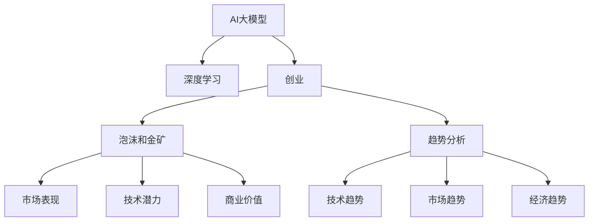

                 

# AI大模型创业：泡沫还是金矿？趋势分析

> 关键词：人工智能创业, 大模型, 深度学习, 泡沫和金矿, 趋势分析

## 1. 背景介绍

近年来，人工智能（AI）技术的飞速发展极大地推动了各行各业数字化转型。尤其是AI大模型，如BERT、GPT-3等，凭借其强大的通用性和泛化能力，已经成为推动行业创新与变革的关键驱动力。特别是在NLP领域，大模型在智能客服、金融舆情、个性化推荐、智能翻译等诸多场景中展现了卓越的表现，为各行各业提供了前所未有的高效解决方案。

然而，随着大模型技术的普及，其背后蕴藏的商业模式、市场竞争与潜在风险也逐渐浮现。AI大模型创业，到底是泡沫还是金矿？本文将从多个角度进行分析，探讨这一问题的答案。

## 2. 核心概念与联系

### 2.1 核心概念概述

- **AI大模型**：指基于深度学习算法，在特定领域（如NLP、计算机视觉、语音识别等）上经过大规模预训练的模型。其特点是参数量庞大、模型复杂，能够在多种任务上表现出色。

- **深度学习**：一种基于多层神经网络的学习方法，通过模拟人脑处理信息的方式，从大量数据中学习出高级特征，并用于分类、回归、生成等任务。

- **创业**：指企业创立、经营、发展至盈利的过程，是一种风险与机遇并存的经济活动。

- **泡沫和金矿**：泡沫指资产价格虚高、严重偏离其实际价值的市场现象；金矿则指具有巨大市场潜力和盈利前景的投资机会。

- **趋势分析**：通过研究市场、技术、经济等多方面因素，预测未来发展方向和可能的机遇与挑战。

### 2.2 核心概念原理和架构的 Mermaid 流程图



此图展示了AI大模型与创业、泡沫与金矿、趋势分析之间的关系。大模型作为技术驱动，创业则是商业实践，趋势分析则是两者之间的桥梁，帮助创业者识别市场机会和风险。

## 3. 核心算法原理 & 具体操作步骤

### 3.1 算法原理概述

AI大模型创业的关键在于将前沿技术转化为商业价值。这一过程涉及多个步骤，包括模型选择、数据准备、模型训练、应用部署等。

### 3.2 算法步骤详解

**Step 1: 选择适合的AI大模型**

- 根据业务需求，选择合适的AI大模型。如NLP领域的BERT、GPT系列，计算机视觉领域的ResNet、Inception等。

**Step 2: 数据准备**

- 收集和清洗标注数据。标注数据的质量和量直接影响到模型的表现。

**Step 3: 模型训练**

- 使用GPU/TPU等硬件进行模型训练。训练过程中需要设置合适的超参数，如学习率、批大小、迭代次数等。

**Step 4: 应用部署**

- 将训练好的模型部署到生产环境中，提供API服务或嵌入到应用中。

**Step 5: 持续优化**

- 收集用户反馈数据，持续优化模型性能，保持竞争力。

### 3.3 算法优缺点

**优点**：

- **通用性强**：大模型能够在多种任务上表现出色，适用范围广。
- **性能优越**：通过大规模预训练，模型具有强大的泛化能力和推理能力。
- **开发周期短**：相比从头训练模型，微调过程耗时短，可以迅速进入市场。

**缺点**：

- **数据依赖高**：高质量标注数据的获取成本高，数据量不足会影响模型表现。
- **资源消耗大**：大模型训练和推理需要大量计算资源，对硬件要求高。
- **模型复杂**：模型结构复杂，难以理解和调试。

### 3.4 算法应用领域

AI大模型在以下领域有着广泛的应用：

- **NLP领域**：智能客服、智能翻译、情感分析、舆情监测等。
- **计算机视觉**：图像识别、人脸识别、视频分析等。
- **语音识别**：语音转文字、智能音箱、语音助手等。
- **金融领域**：风险控制、信贷评估、市场分析等。
- **医疗领域**：疾病诊断、医学影像分析、患者咨询等。

## 4. 数学模型和公式 & 详细讲解 & 举例说明

### 4.1 数学模型构建

以NLP领域中的情感分析为例，模型输入为文本，输出为情感标签。假设模型采用BERT作为基础模型，使用交叉熵损失函数进行训练。

### 4.2 公式推导过程

设输入文本为 $x$，标签为 $y$，模型输出为 $M(x)$。交叉熵损失函数定义为：

$$
L(x, y) = -\frac{1}{N}\sum_{i=1}^N[y_i\log M(x_i)+(1-y_i)\log(1-M(x_i))]
$$

其中，$N$ 为样本数量。

### 4.3 案例分析与讲解

假设某电商平台希望使用大模型进行情感分析，以便更好地理解用户评价。他们从平台收集了5万条评论数据，并将其划分为训练集和测试集。使用BERT模型进行微调，并在训练集上进行优化。最终模型在测试集上的准确率达到85%，远超传统机器学习模型。

## 5. AI大模型创业项目实践：代码实例和详细解释说明

### 5.1 开发环境搭建

开发环境搭建主要包括以下步骤：

1. 安装Python和相关依赖包，如TensorFlow、PyTorch等。
2. 搭建GPU/TPU环境，确保有足够的计算资源。
3. 配置数据预处理工具，如NLTK、spaCy等。

### 5.2 源代码详细实现

以情感分析为例，使用BERT模型进行微调。

```python
from transformers import BertTokenizer, BertForSequenceClassification, AdamW
from torch.utils.data import DataLoader, Dataset
from sklearn.model_selection import train_test_split

class TextDataset(Dataset):
    def __init__(self, texts, labels, tokenizer):
        self.tokenizer = tokenizer
        self.texts = texts
        self.labels = labels
        
    def __len__(self):
        return len(self.texts)
    
    def __getitem__(self, item):
        text = self.texts[item]
        label = self.labels[item]
        
        encoding = self.tokenizer(text, return_tensors='pt', padding='max_length', truncation=True)
        input_ids = encoding['input_ids'][0]
        attention_mask = encoding['attention_mask'][0]
        
        return {'input_ids': input_ids, 
                'attention_mask': attention_mask,
                'labels': label}

# 加载数据
train_texts, test_texts, train_labels, test_labels = train_test_split(train_data, test_data, test_size=0.2)

# 初始化模型和优化器
model = BertForSequenceClassification.from_pretrained('bert-base-uncased', num_labels=2)
optimizer = AdamW(model.parameters(), lr=2e-5)

# 数据预处理
tokenizer = BertTokenizer.from_pretrained('bert-base-uncased')
train_dataset = TextDataset(train_texts, train_labels, tokenizer)
test_dataset = TextDataset(test_texts, test_labels, tokenizer)

# 训练过程
batch_size = 16
epochs = 5

for epoch in range(epochs):
    model.train()
    for batch in DataLoader(train_dataset, batch_size=batch_size):
        optimizer.zero_grad()
        loss = model(**batch).loss
        loss.backward()
        optimizer.step()
        
    model.eval()
    for batch in DataLoader(test_dataset, batch_size=batch_size):
        with torch.no_grad():
            preds = model(**batch).logits.argmax(dim=1)
            acc = (preds == batch['labels']).mean().item()
            print(f'Epoch {epoch+1}, Test Accuracy: {acc:.3f}')
```

### 5.3 代码解读与分析

- 定义了一个`TextDataset`类，用于加载和预处理文本数据。
- 使用`BertForSequenceClassification`模型作为基础模型。
- 使用AdamW优化器进行参数更新。
- 训练过程中，每次迭代都计算损失并更新模型参数。

## 6. 实际应用场景

### 6.1 智能客服系统

智能客服系统是大模型在NLP领域的重要应用之一。通过微调大模型，可以使其具备理解和回答客户问题的能力，提升客户体验。

### 6.2 金融舆情监测

金融领域的大模型可以用于监测市场舆情，及时预警可能的风险。通过微调，模型可以识别出潜在的负面新闻，帮助金融机构提前准备。

### 6.3 个性化推荐系统

推荐系统可以借助大模型进行用户画像建模，从而提供更加个性化、精准的推荐。通过微调，模型能够更好地理解用户兴趣和行为，提升推荐效果。

### 6.4 未来应用展望

未来，AI大模型在医疗、教育、城市治理等领域的应用将更加广泛。随着技术的不断进步，AI大模型将带来更加深刻的社会变革，推动人类生产生活方式的演进。

## 7. 工具和资源推荐

### 7.1 学习资源推荐

- 《深度学习》课程：斯坦福大学计算机科学系推出的课程，介绍了深度学习的基础理论和实践技能。
- 《Transformers》书籍：介绍了Transformer模型及其在NLP领域的应用。
- 《AI创业指南》书籍：详细介绍了AI创业的各个环节，包括模型选择、数据准备、市场分析等。

### 7.2 开发工具推荐

- TensorFlow：开源深度学习框架，支持大规模模型训练和部署。
- PyTorch：灵活的深度学习框架，适合快速迭代研究。
- HuggingFace Transformers库：提供了多种预训练模型和微调工具。

### 7.3 相关论文推荐

- 《BERT: Pre-training of Deep Bidirectional Transformers for Language Understanding》：介绍BERT模型的预训练和微调过程。
- 《Attention is All You Need》：介绍Transformer模型和自注意力机制。
- 《Parameter-Efficient Transfer Learning for NLP》：介绍参数高效微调技术。

## 8. 总结：未来发展趋势与挑战

### 8.1 研究成果总结

本文详细分析了AI大模型创业的各个环节，探讨了其成功与否的关键因素。通过深入了解AI大模型的原理和应用，有助于创业者识别市场机会和规避风险。

### 8.2 未来发展趋势

- **模型规模增大**：未来的模型将具备更强大的泛化能力和推理能力。
- **算法优化**：参数高效和计算高效的算法将成为主流。
- **多模态融合**：将视觉、语音等数据与文本数据融合，提高模型的通用性和鲁棒性。

### 8.3 面临的挑战

- **数据获取**：高质量标注数据的获取成本高，数据量不足会影响模型表现。
- **模型复杂**：模型结构复杂，难以理解和调试。
- **资源消耗**：大模型训练和推理需要大量计算资源。

### 8.4 研究展望

未来的研究应聚焦于以下几个方向：

- **数据增强**：通过数据增强技术提高模型泛化能力。
- **模型压缩**：优化模型结构，减小计算资源消耗。
- **自动化学习**：引入自动化学习技术，降低数据标注成本。

## 9. 附录：常见问题与解答

**Q1: 大模型创业需要多少数据？**

A: 数据量对模型性能影响较大。通常而言，至少需要几千条标注数据进行微调，但高质量数据更为关键。

**Q2: 如何选择合适的模型？**

A: 根据业务需求选择模型。如NLP领域，BERT和GPT系列是常用的选择。

**Q3: 如何优化模型性能？**

A: 优化模型的超参数、使用数据增强和正则化技术、使用参数高效微调等。

**Q4: 大模型创业面临哪些风险？**

A: 数据获取成本高、模型复杂、资源消耗大等。

**Q5: 大模型创业的未来展望？**

A: 大模型未来将广泛应用于更多领域，带来更深远的社会变革。

---

作者：禅与计算机程序设计艺术 / Zen and the Art of Computer Programming

