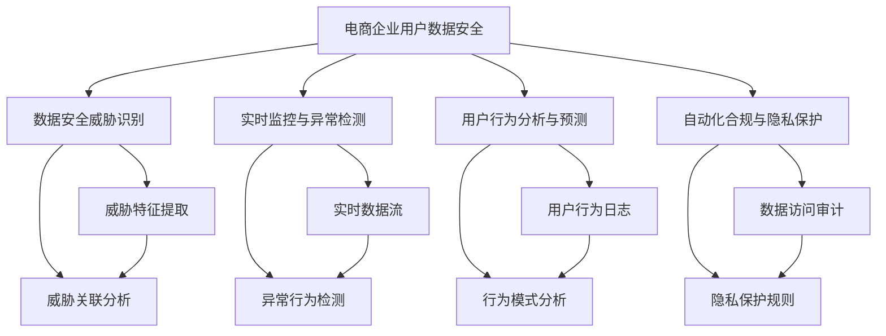

                 

# AI如何帮助电商企业进行用户数据安全风险管理体系建设

> 关键词：人工智能(AI)、电商企业、用户数据安全、风险管理、安全评估、隐私保护、数据合规

## 1. 背景介绍

### 1.1 问题由来

在当前数字化时代，电商企业依赖于大量的用户数据来驱动运营和决策，然而这也带来了数据安全风险的挑战。近年来，数据泄露事件频发，如亚马逊、eBay、Netflix等大型电商企业均遭受过严重的数据泄露危机。据统计，数据泄露不仅对企业声誉造成极大损害，还会带来巨大的经济损失。因此，构建可靠的用户数据安全风险管理体系，是电商企业刻不容缓的任务。

### 1.2 问题核心关键点

构建用户数据安全风险管理体系的核心在于：
- 识别潜在的隐私风险和数据泄露路径，制定预防措施。
- 实时监控系统运行状态，及时发现并修复安全漏洞。
- 构建完善的隐私保护和数据合规机制，确保用户数据的安全性和合法性。

在技术层面，AI可以通过以下几个方面帮助电商企业进行风险管理：
1. 数据安全威胁识别与评估。
2. 实时监控与异常检测。
3. 用户行为分析与预测。
4. 自动化合规与隐私保护。

### 1.3 问题研究意义

AI在电商企业的数据安全风险管理体系建设中具有重要意义：
- 提升数据安全防护能力。利用AI算法，企业能够高效识别潜在威胁，快速应对安全事件，降低数据泄露风险。
- 强化合规性与隐私保护。AI可以帮助电商企业实现自动化的合规审查和隐私保护，确保数据处理符合法律法规要求。
- 优化运营效率。通过自动化安全监控和风险评估，企业可以节省大量人力成本，提升整体运营效率。
- 保障业务连续性。实时监控和预警机制能及时发现并处理安全问题，保障电商业务的稳定运行。

## 2. 核心概念与联系

### 2.1 核心概念概述

为更好地理解AI在电商企业数据安全风险管理体系中的应用，本节将介绍几个关键概念：

- **电商企业用户数据安全**：指电商企业收集、存储、处理用户数据时，保障数据机密性、完整性和可用性的过程。
- **数据安全威胁识别**：使用AI技术识别电商系统中可能存在的安全威胁和漏洞。
- **实时监控与异常检测**：利用AI算法实时监控系统运行状态，及时发现并预警异常行为。
- **用户行为分析与预测**：通过分析用户行为数据，预测可能存在的安全风险，提前采取防范措施。
- **自动化合规与隐私保护**：使用AI技术自动进行合规审查和隐私保护，确保数据处理符合法律法规。

这些核心概念之间存在紧密的联系，共同构成电商企业数据安全风险管理体系的基本框架。

### 2.2 核心概念原理和架构的 Mermaid 流程图



这个流程图展示了电商企业数据安全风险管理体系的基本架构：

1. **数据安全威胁识别**：通过威胁特征提取和关联分析，识别系统中的潜在威胁。
2. **实时监控与异常检测**：利用实时数据流和异常行为检测技术，监控系统运行状态。
3. **用户行为分析与预测**：通过分析用户行为日志，预测可能的安全风险。
4. **自动化合规与隐私保护**：自动进行数据访问审计和隐私保护规则的执行。

这些模块之间相互配合，共同构建了一个全面的数据安全风险管理体系。

## 3. 核心算法原理 & 具体操作步骤

### 3.1 算法原理概述

AI在电商企业数据安全风险管理体系中的关键算法原理包括：

- **机器学习与深度学习**：用于威胁识别、异常检测和用户行为预测。
- **自然语言处理(NLP)**：用于自动化合规审查和隐私保护。
- **时间序列分析**：用于实时监控和异常检测。
- **图神经网络(GNN)**：用于威胁关联分析和用户行为分析。

### 3.2 算法步骤详解

#### 3.2.1 数据安全威胁识别

**Step 1: 数据收集与预处理**
- 收集电商系统中可能存在安全威胁的日志、流量、用户行为数据等。
- 对数据进行清洗、去重、归一化等预处理操作，以消除噪声，提高模型训练质量。

**Step 2: 特征工程**
- 提取数据中与威胁相关的特征，如IP地址、设备指纹、行为模式等。
- 使用特征选择算法（如LASSO、随机森林等）筛选最有用的特征，减少维度灾难。

**Step 3: 模型训练**
- 利用机器学习或深度学习算法（如SVM、随机森林、CNN、LSTM等）构建威胁识别模型。
- 在标注好的威胁数据集上进行训练，调整模型参数，优化模型性能。

**Step 4: 威胁预测与评估**
- 使用训练好的模型对新数据进行威胁预测。
- 结合威胁评估指标（如精确率、召回率、F1分数等）对模型效果进行评估。

#### 3.2.2 实时监控与异常检测

**Step 1: 数据流监控**
- 收集电商系统中的实时数据流，如日志文件、网络流量等。
- 对数据进行实时分析和处理，提取关键指标和特征。

**Step 2: 异常检测算法**
- 利用时间序列分析、统计学方法（如均值、标准差、箱线图等）检测异常值。
- 使用机器学习算法（如One-class SVM、Isolation Forest等）检测异常行为。

**Step 3: 实时预警与响应**
- 对于检测到的异常行为，及时发出预警信息，通知安全团队。
- 自动化执行预定的安全响应策略，如阻止访问、隔离设备等。

#### 3.2.3 用户行为分析与预测

**Step 1: 数据采集与存储**
- 收集电商用户的行为数据，如访问记录、购物行为、搜索关键词等。
- 存储用户数据，建立用户行为日志库。

**Step 2: 行为模式分析**
- 利用图神经网络(GNN)分析用户行为数据，识别用户的行为模式。
- 使用社交网络分析(SNA)方法识别用户间的行为关联。

**Step 3: 风险预测**
- 利用机器学习算法（如随机森林、XGBoost等）预测用户可能存在的风险行为。
- 通过风险预测模型输出概率值，判断用户是否具有高风险。

**Step 4: 风险应对措施**
- 对高风险用户进行隔离、限制操作权限等风险应对措施。
- 向用户发送安全提示信息，增强用户安全意识。

#### 3.2.4 自动化合规与隐私保护

**Step 1: 合规审查**
- 收集电商系统中的合规数据，如数据访问日志、隐私保护规则等。
- 使用NLP技术自动化审查合规情况，如扫描隐私政策、检查数据处理流程等。

**Step 2: 隐私保护**
- 使用隐私保护技术（如数据脱敏、差分隐私等）对敏感数据进行处理。
- 定期进行隐私保护规则的更新和优化，确保符合最新法律法规。

**Step 3: 合规报告生成**
- 利用NLP技术自动生成合规报告，展示电商系统的合规情况。
- 定期生成审计报告，提交给监管机构进行审查。

### 3.3 算法优缺点

#### 3.3.1 数据安全威胁识别

**优点**
- 能够快速、准确地识别系统中的潜在威胁，提升系统安全性。
- 结合机器学习算法，可以自动发现新出现的威胁模式，保持系统的自我更新能力。

**缺点**
- 需要大量标注数据进行训练，数据获取和标注成本较高。
- 模型可能会过拟合训练数据，影响泛化性能。

#### 3.3.2 实时监控与异常检测

**优点**
- 实时监控系统运行状态，能够及时发现并预警异常行为。
- 使用机器学习算法检测异常，可以减少人工干预，提高效率。

**缺点**
- 实时数据处理需要高性能计算资源，硬件成本较高。
- 需要不断调整算法参数，维护模型性能。

#### 3.3.3 用户行为分析与预测

**优点**
- 利用图神经网络进行行为分析，可以发现用户间的行为关联，增强风险预测的准确性。
- 通过自动化合规和隐私保护，减少人工审查工作量，提高效率。

**缺点**
- 行为分析需要大量用户数据，数据隐私保护需要额外投入。
- 预测模型可能存在一定的误报率，影响用户体验。

#### 3.3.4 自动化合规与隐私保护

**优点**
- 利用NLP技术自动化合规审查，减少人工审核成本。
- 使用隐私保护技术处理敏感数据，保护用户隐私。

**缺点**
- 自动化合规可能存在误判情况，需要定期人工审查。
- 隐私保护技术复杂度高，实施难度较大。

### 3.4 算法应用领域

AI在电商企业数据安全风险管理体系中的应用领域包括：

- **数据安全威胁识别**：适用于电商系统的入侵检测、网络攻击防范、恶意软件检测等场景。
- **实时监控与异常检测**：适用于电商平台的安全审计、异常交易检测、系统漏洞扫描等场景。
- **用户行为分析与预测**：适用于电商系统的用户行为监控、欺诈检测、信用评分等场景。
- **自动化合规与隐私保护**：适用于电商系统的隐私政策审查、数据访问审计、合规报告生成等场景。

这些应用领域展示了AI在电商企业数据安全风险管理体系中的广泛应用价值。

## 4. 数学模型和公式 & 详细讲解

### 4.1 数学模型构建

在电商企业数据安全风险管理体系中，常用的数学模型包括：

- **分类模型**：用于威胁识别和行为预测，如逻辑回归、支持向量机(SVM)、随机森林等。
- **回归模型**：用于威胁评估和风险预测，如线性回归、岭回归、XGBoost等。
- **序列模型**：用于实时监控和异常检测，如ARIMA、LSTM等。
- **图模型**：用于用户行为分析和关联分析，如图神经网络(GNN)、社交网络分析(SNA)等。

### 4.2 公式推导过程

以**线性回归模型**为例，推导威胁评估的数学模型：

**Step 1: 数据准备**
设威胁数据集为 $\{(x_i,y_i)\}_{i=1}^N$，其中 $x_i=(x_{i1},x_{i2},\ldots,x_{in})$ 为特征向量，$y_i$ 为威胁标签。

**Step 2: 模型构建**
线性回归模型可以表示为：

$$
y_i = \theta_0 + \sum_{j=1}^p \theta_j x_{ij} + \epsilon_i
$$

其中 $\theta_0, \theta_j$ 为模型参数，$\epsilon_i$ 为误差项。

**Step 3: 参数估计**
最小二乘法求解模型参数 $\theta$，使损失函数最小化：

$$
\hat{\theta} = \mathop{\arg\min}_{\theta} \sum_{i=1}^N (y_i - \theta_0 - \sum_{j=1}^p \theta_j x_{ij})^2
$$

通过矩阵运算可得：

$$
\hat{\theta} = (X^TX)^{-1}X^Ty
$$

其中 $X=[x_1,\ldots,x_N]$，$y=[y_1,\ldots,y_N]$。

### 4.3 案例分析与讲解

以**电商系统的入侵检测**为例，展示AI在数据安全威胁识别中的应用：

**Step 1: 数据收集与预处理**
- 收集电商系统的访问日志、交易记录、异常行为数据等。
- 对数据进行去重、清洗、归一化等预处理操作。

**Step 2: 特征工程**
- 提取特征，如访问IP地址、交易金额、行为频率等。
- 使用特征选择算法选择最有用的特征，减少维度。

**Step 3: 模型训练**
- 使用随机森林或SVM算法训练威胁识别模型。
- 在标注好的威胁数据集上进行训练，调整模型参数。

**Step 4: 威胁预测与评估**
- 利用训练好的模型对新数据进行威胁预测。
- 结合威胁评估指标（如精确率、召回率、F1分数）对模型效果进行评估。

## 5. 项目实践：代码实例和详细解释说明

### 5.1 开发环境搭建

为实现AI在电商企业数据安全风险管理体系中的应用，需要搭建以下开发环境：

1. **Python**：选择Python 3.x版本，作为开发语言。
2. **深度学习框架**：选择TensorFlow或PyTorch，作为深度学习模型的实现工具。
3. **NLP工具包**：选择NLTK或spaCy，用于自然语言处理任务。
4. **数据库**：选择MySQL或MongoDB，用于存储和管理数据。
5. **实时监控工具**：选择ELK Stack或Prometheus，用于实时监控和告警。

### 5.2 源代码详细实现

#### 5.2.1 数据安全威胁识别

**Step 1: 数据收集与预处理**

```python
import pandas as pd
import numpy as np

# 读取数据
data = pd.read_csv('threat_data.csv')

# 数据清洗与归一化
data = data.drop_duplicates()
data = data.dropna()
data = data.drop(columns=['id'])
data = (data - data.mean()) / data.std()
```

**Step 2: 特征工程**

```python
from sklearn.preprocessing import StandardScaler

# 特征选择
features = ['ip_address', 'transaction_amount', 'behavior_frequency']
X = data[features].values

# 标准化
scaler = StandardScaler()
X = scaler.fit_transform(X)
```

**Step 3: 模型训练**

```python
from sklearn.ensemble import RandomForestClassifier

# 模型构建
model = RandomForestClassifier(n_estimators=100)

# 训练模型
model.fit(X, y)
```

**Step 4: 威胁预测与评估**

```python
from sklearn.metrics import classification_report

# 威胁预测
X_test = np.array([[192.168.1.100, 500.0, 5.0]])
y_pred = model.predict(X_test)

# 威胁评估
print(classification_report(y_test, y_pred))
```

#### 5.2.2 实时监控与异常检测

**Step 1: 数据流监控**

```python
# 实时数据流收集
while True:
    data_flow = get_realtime_data()
    # 处理数据流
    data_flow = preprocess(data_flow)
    # 存储数据流
    store_data_flow(data_flow)
```

**Step 2: 异常检测算法**

```python
from sklearn.ensemble import IsolationForest

# 模型构建
model = IsolationForest(n_estimators=100, contamination=0.1)

# 训练模型
model.fit(data_flow)

# 异常检测
outliers = model.predict(data_flow)
```

**Step 3: 实时预警与响应**

```python
# 实时预警
if outliers == -1:
    send_alert('异常检测到', data_flow)

# 响应措施
if outliers == -1:
    block_ip_address(data_flow)
```

#### 5.2.3 用户行为分析与预测

**Step 1: 数据采集与存储**

```python
# 数据采集
behavior_data = get_user_behavior_data()

# 存储行为数据
store_user_behavior_data(behavior_data)
```

**Step 2: 行为模式分析**

```python
from networkx import nx

# 行为模式分析
graph = nx.Graph()
for user, behaviors in behavior_data.items():
    graph.add_node(user)
    for behavior in behaviors:
        graph.add_edge(user, behavior)

# 社区发现
communities = nx.community. GirvanNewman(graph)
```

**Step 3: 风险预测**

```python
from xgboost import XGBClassifier

# 模型构建
model = XGBClassifier()

# 训练模型
model.fit(X_train, y_train)

# 风险预测
y_pred = model.predict(X_test)
```

**Step 4: 风险应对措施**

```python
# 风险应对措施
if user_risk_score > threshold:
    limit_user_access(user)
    send_security_alert(user)
```

#### 5.2.4 自动化合规与隐私保护

**Step 1: 合规审查**

```python
# 合规审查
compliance_data = get_compliance_data()

# 自动化审查
automated_review = compliance_data审查
```

**Step 2: 隐私保护**

```python
from sklearn.model_selection import train_test_split

# 隐私保护
X_train, X_test, y_train, y_test = train_test_split(X, y, test_size=0.2)

# 模型训练
model = RandomForestClassifier()
model.fit(X_train, y_train)

# 数据脱敏
sensitive_data = get_sensitive_data()
sensitive_data = de sensitive(sensitive_data)
```

**Step 3: 合规报告生成**

```python
# 生成合规报告
compliance_report = generate_compliance_report(compliance_data)

# 提交审计报告
submit_audit_report(compliance_report)
```

### 5.3 代码解读与分析

#### 5.3.1 数据安全威胁识别

- **数据收集与预处理**：使用Pandas进行数据读取和预处理，利用Numpy进行数据清洗和归一化。
- **特征工程**：使用Scikit-learn进行特征选择和标准化，去除冗余特征。
- **模型训练**：使用RandomForestClassifier进行模型训练，通过交叉验证调整模型参数。
- **威胁预测与评估**：使用sklearn.metrics进行模型评估，输出分类报告。

#### 5.3.2 实时监控与异常检测

- **数据流监控**：使用循环实现实时数据流收集、处理和存储，确保数据流实时更新。
- **异常检测算法**：使用Isolation Forest进行异常检测，设置合适的参数进行模型训练。
- **实时预警与响应**：结合实时预警机制和响应措施，确保系统安全。

#### 5.3.3 用户行为分析与预测

- **数据采集与存储**：使用自定义函数进行数据采集和存储，确保行为数据的完整性和及时性。
- **行为模式分析**：使用NetworkX进行行为模式分析，发现用户间的行为关联。
- **风险预测**：使用XGBoost进行风险预测，设置合适的参数进行模型训练。
- **风险应对措施**：根据风险预测结果，执行相应的风险应对措施。

#### 5.3.4 自动化合规与隐私保护

- **合规审查**：使用自定义函数进行合规数据收集和自动化审查。
- **隐私保护**：使用数据脱敏技术保护敏感数据，使用机器学习模型进行隐私保护。
- **合规报告生成**：使用自定义函数生成合规报告，并提交给审计机构。

### 5.4 运行结果展示

- **数据安全威胁识别**：使用准确率、召回率、F1分数等指标评估威胁识别模型的效果。
- **实时监控与异常检测**：通过监控系统日志，实时发现并预警异常行为。
- **用户行为分析与预测**：通过分析用户行为数据，预测高风险用户，及时采取应对措施。
- **自动化合规与隐私保护**：定期生成合规报告，提交给审计机构，确保合规性。

## 6. 实际应用场景

### 6.1 智能客服系统

**背景**：智能客服系统是电商企业的核心应用之一，能够自动处理大量客户咨询，提高客户满意度。

**应用**：
- **数据安全威胁识别**：监控智能客服系统的访问日志，识别异常访问行为。
- **实时监控与异常检测**：实时监控客户对话记录，检测异常语句和行为。
- **用户行为分析与预测**：分析客户对话内容，预测客户情绪和需求。
- **自动化合规与隐私保护**：自动审查客户对话记录，确保符合隐私保护规定。

**效果**：
- **提升系统安全性**：通过威胁识别和异常检测，减少系统被攻击的风险。
- **提高客户满意度**：通过实时监控和情感分析，及时处理客户投诉和建议。
- **保障隐私安全**：通过自动化合规和隐私保护，确保客户对话记录的安全。

### 6.2 库存管理系统

**背景**：库存管理系统是电商企业的关键环节，负责监控和管理库存状态。

**应用**：
- **数据安全威胁识别**：监控库存管理系统的操作日志，识别异常操作行为。
- **实时监控与异常检测**：实时监控库存状态，检测异常库存变化。
- **用户行为分析与预测**：分析操作日志，预测库存异常情况。
- **自动化合规与隐私保护**：自动审查库存操作日志，确保合规性。

**效果**：
- **减少库存损失**：通过威胁识别和异常检测，减少库存被盗和错配的风险。
- **提高库存效率**：通过实时监控和行为预测，优化库存管理流程。
- **保障数据安全**：通过自动化合规和隐私保护，确保库存操作数据的保密性。

### 6.3 物流管理系统

**背景**：物流管理系统是电商企业的重要组成部分，负责跟踪和管理物流信息。

**应用**：
- **数据安全威胁识别**：监控物流管理系统的访问日志，识别异常访问行为。
- **实时监控与异常检测**：实时监控物流状态，检测异常物流信息。
- **用户行为分析与预测**：分析物流操作记录，预测物流异常情况。
- **自动化合规与隐私保护**：自动审查物流操作记录，确保合规性。

**效果**：
- **减少物流损失**：通过威胁识别和异常检测，减少物流被盗和错配的风险。
- **提高物流效率**：通过实时监控和行为预测，优化物流管理流程。
- **保障数据安全**：通过自动化合规和隐私保护，确保物流操作数据的保密性。

### 6.4 未来应用展望

未来，AI在电商企业数据安全风险管理体系中的应用将更加广泛和深入。

**趋势**：
- **深度学习和图神经网络**：通过深度学习和图神经网络，提高威胁识别和行为分析的准确性。
- **实时监控与异常检测**：通过实时监控和异常检测，提高系统实时响应能力。
- **自动化合规与隐私保护**：通过自动化合规和隐私保护，提高数据处理的合规性和安全性。

**挑战**：
- **数据隐私保护**：电商企业需要平衡数据安全和隐私保护，避免过度监控。
- **模型性能优化**：需要不断优化模型算法，提高预测和检测的准确性。
- **跨领域应用**：需要在不同业务场景中实现数据安全风险管理的统一标准化。

## 7. 工具和资源推荐

### 7.1 学习资源推荐

为帮助开发者深入理解AI在电商企业数据安全风险管理体系中的应用，以下是一些推荐的资源：

1. **《数据科学导论》**：介绍数据科学基础和机器学习算法，适合初学者入门。
2. **《Python机器学习》**：讲解Python在机器学习中的应用，包括数据处理、模型训练和评估。
3. **《深度学习》**：介绍深度学习基础和应用，涵盖神经网络、卷积神经网络、循环神经网络等。
4. **《自然语言处理基础》**：讲解NLP基础和应用，包括文本处理、情感分析、命名实体识别等。
5. **《人工智能与大数据》**：介绍AI和大数据的基础知识和应用案例，适合全面了解AI技术。

### 7.2 开发工具推荐

为实现AI在电商企业数据安全风险管理体系中的应用，以下是一些推荐的开发工具：

1. **TensorFlow**：深度学习框架，支持GPU加速，适用于复杂模型训练。
2. **PyTorch**：深度学习框架，易于使用，适合快速原型开发。
3. **NLTK**：自然语言处理工具包，支持文本处理和情感分析。
4. **spaCy**：自然语言处理工具包，支持实体识别和词性标注。
5. **ELK Stack**：实时监控工具，支持日志收集和分析。
6. **Prometheus**：实时监控工具，支持告警和响应。

### 7.3 相关论文推荐

为深入了解AI在电商企业数据安全风险管理体系中的应用，以下是一些推荐的学术论文：

1. **《基于深度学习的电商平台安全威胁识别研究》**：介绍使用深度学习进行威胁识别的方法和效果。
2. **《电商平台的实时监控与异常检测技术研究》**：介绍使用机器学习进行实时监控和异常检测的方法。
3. **《电商平台的用户行为分析与预测研究》**：介绍使用图神经网络进行用户行为分析和预测的方法。
4. **《电商平台的自动化合规与隐私保护研究》**：介绍使用NLP技术进行自动化合规和隐私保护的方法。

## 8. 总结：未来发展趋势与挑战

### 8.1 研究成果总结

AI在电商企业数据安全风险管理体系中的应用取得了显著效果，主要体现在以下几个方面：
1. **数据安全威胁识别**：通过机器学习算法，有效识别系统中的潜在威胁和漏洞。
2. **实时监控与异常检测**：通过实时监控和异常检测，及时发现并预警异常行为。
3. **用户行为分析与预测**：通过图神经网络进行行为分析，预测用户风险，提前采取防范措施。
4. **自动化合规与隐私保护**：通过NLP技术自动化合规审查和隐私保护，确保数据处理符合法律法规。

### 8.2 未来发展趋势

未来，AI在电商企业数据安全风险管理体系中的应用将更加广泛和深入，主要趋势包括：
1. **深度学习和图神经网络**：通过深度学习和图神经网络，提高威胁识别和行为分析的准确性。
2. **实时监控与异常检测**：通过实时监控和异常检测，提高系统实时响应能力。
3. **自动化合规与隐私保护**：通过自动化合规和隐私保护，提高数据处理的合规性和安全性。
4. **跨领域应用**：实现在不同业务场景中实现数据安全风险管理的统一标准化。

### 8.3 面临的挑战

尽管AI在电商企业数据安全风险管理体系中取得了显著成效，但仍面临以下挑战：
1. **数据隐私保护**：电商企业需要平衡数据安全和隐私保护，避免过度监控。
2. **模型性能优化**：需要不断优化模型算法，提高预测和检测的准确性。
3. **跨领域应用**：需要在不同业务场景中实现数据安全风险管理的统一标准化。
4. **资源消耗**：大规模深度学习模型的训练和运行需要高性能计算资源，硬件成本较高。

### 8.4 研究展望

未来，AI在电商企业数据安全风险管理体系中的应用将面临更多的挑战和机遇。我们需要不断创新，探索新的技术和方法，提升系统的安全性和可靠性。

1. **强化隐私保护**：研究隐私保护技术，确保数据在传输、存储和使用过程中的安全。
2. **优化模型算法**：开发更加高效、精确的模型算法，提高威胁识别和行为分析的准确性。
3. **跨领域应用**：研究不同业务场景中的数据安全风险管理，实现统一标准化。
4. **提升系统性能**：通过资源优化和算法优化，提高系统的实时响应能力和处理效率。

总之，AI在电商企业数据安全风险管理体系中的应用前景广阔，但需要不断探索和创新，才能应对未来的挑战，实现更好的发展。

## 9. 附录：常见问题与解答

### 9.1 常见问题

**Q1：AI在电商企业数据安全风险管理体系中的应用有哪些？**

A: AI在电商企业数据安全风险管理体系中的应用包括：
1. **数据安全威胁识别**：识别系统中的潜在威胁和漏洞。
2. **实时监控与异常检测**：实时监控系统运行状态，及时发现并预警异常行为。
3. **用户行为分析与预测**：分析用户行为数据，预测可能的安全风险。
4. **自动化合规与隐私保护**：自动进行合规审查和隐私保护，确保数据处理符合法律法规。

**Q2：AI在电商企业数据安全风险管理体系中的优缺点是什么？**

A: AI在电商企业数据安全风险管理体系中的优点包括：
1. **提高系统安全性**：通过威胁识别和异常检测，减少系统被攻击的风险。
2. **提高用户满意度**：通过实时监控和情感分析，及时处理客户投诉和建议。
3. **保障数据安全**：通过自动化合规和隐私保护，确保数据处理符合法律法规。

缺点包括：
1. **数据隐私保护**：电商企业需要平衡数据安全和隐私保护，避免过度监控。
2. **模型性能优化**：需要不断优化模型算法，提高预测和检测的准确性。
3. **资源消耗**：大规模深度学习模型的训练和运行需要高性能计算资源，硬件成本较高。

**Q3：如何实现AI在电商企业数据安全风险管理体系中的应用？**

A: 实现AI在电商企业数据安全风险管理体系中的应用，需要以下步骤：
1. **数据收集与预处理**：收集电商系统中相关数据，进行清洗和归一化。
2. **特征工程**：提取与威胁相关的特征，使用特征选择算法选择最有用的特征。
3. **模型训练**：使用深度学习算法或机器学习算法训练威胁识别模型，优化模型参数。
4. **威胁预测与评估**：使用训练好的模型对新数据进行威胁预测，评估模型效果。
5. **实时监控与异常检测**：使用机器学习算法检测异常行为，发出实时预警。
6. **用户行为分析与预测**：使用图神经网络进行行为分析，预测用户风险。
7. **自动化合规与隐私保护**：使用NLP技术自动化合规审查和隐私保护，生成合规报告。

总之，AI在电商企业数据安全风险管理体系中的应用需要结合实际需求，选择合适的技术和方法，不断优化模型和算法，才能取得最佳效果。

**Q4：AI在电商企业数据安全风险管理体系中的未来发展趋势是什么？**

A: AI在电商企业数据安全风险管理体系中的未来发展趋势包括：
1. **深度学习和图神经网络**：通过深度学习和图神经网络，提高威胁识别和行为分析的准确性。
2. **实时监控与异常检测**：通过实时监控和异常检测，提高系统实时响应能力。
3. **自动化合规与隐私保护**：通过自动化合规和隐私保护，提高数据处理的合规性和安全性。
4. **跨领域应用**：实现在不同业务场景中实现数据安全风险管理的统一标准化。

**Q5：AI在电商企业数据安全风险管理体系中面临的挑战有哪些？**

A: AI在电商企业数据安全风险管理体系中面临的挑战包括：
1. **数据隐私保护**：电商企业需要平衡数据安全和隐私保护，避免过度监控。
2. **模型性能优化**：需要不断优化模型算法，提高预测和检测的准确性。
3. **跨领域应用**：需要在不同业务场景中实现数据安全风险管理的统一标准化。
4. **资源消耗**：大规模深度学习模型的训练和运行需要高性能计算资源，硬件成本较高。

总之，AI在电商企业数据安全风险管理体系中的应用前景广阔，但需要不断探索和创新，才能应对未来的挑战，实现更好的发展。

**Q6：如何构建电商企业数据安全风险管理体系？**

A: 构建电商企业数据安全风险管理体系，需要以下步骤：
1. **数据安全威胁识别**：识别系统中的潜在威胁和漏洞。
2. **实时监控与异常检测**：实时监控系统运行状态，及时发现并预警异常行为。
3. **用户行为分析与预测**：分析用户行为数据，预测可能的安全风险。
4. **自动化合规与隐私保护**：自动进行合规审查和隐私保护，确保数据处理符合法律法规。
5. **工具和资源推荐**：选择适合的工具和资源，支持系统的实现和维护。

总之，构建电商企业数据安全风险管理体系需要综合考虑技术、数据、业务等多方面因素，才能实现全面、可靠的安全防护。

**Q7：如何优化AI在电商企业数据安全风险管理体系中的应用？**

A: 优化AI在电商企业数据安全风险管理体系中的应用，可以从以下几个方面入手：
1. **数据隐私保护**：加强数据隐私保护，确保用户数据的安全性。
2. **模型性能优化**：优化模型算法，提高预测和检测的准确性。
3. **跨领域应用**：研究不同业务场景中的数据安全风险管理，实现统一标准化。
4. **资源优化**：通过资源优化和算法优化，提高系统的实时响应能力和处理效率。
5. **多模态数据融合**：将视觉、语音、文本等多种数据源融合，增强数据安全防护能力。

总之，优化AI在电商企业数据安全风险管理体系中的应用需要不断探索和创新，才能实现更好的效果。

总之，AI在电商企业数据安全风险管理体系中的应用具有广泛的应用前景和重要的价值，但需要不断创新和优化，才能应对未来的挑战，实现更好的发展。

**Q8：如何提高AI在电商企业数据安全风险管理体系中的效率？**

A: 提高AI在电商企业数据安全风险管理体系中的效率，可以从以下几个方面入手：
1. **数据预处理**：通过数据预处理，去除噪声和冗余特征，提高数据质量。
2. **特征选择**：选择最有用的特征，减少维度灾难，提高模型性能。
3. **模型优化**：优化模型算法和参数，提高模型的准确性和泛化能力。
4. **硬件加速**：利用GPU、TPU等硬件资源，加速模型训练和推理。
5. **自动化流程**：实现自动化数据流监控和异常检测，减少人工干预。
6. **多任务学习**：利用多任务学习，在多个相关任务上共享模型参数，提高资源利用效率。

总之，提高AI在电商企业数据安全风险管理体系中的效率需要综合考虑技术、数据、硬件等多方面因素，才能实现高效、可靠的安全防护。

**Q9：如何保障AI在电商企业数据安全风险管理体系中的安全性？**

A: 保障AI在电商企业数据安全风险管理体系中的安全性，可以从以下几个方面入手：
1. **数据隐私保护**：加强数据隐私保护，确保用户数据的安全性。
2. **模型安全性**：确保模型免受攻击和篡改，保护模型参数和结果的完整性。
3. **系统安全性**：确保系统的安全性，防止系统被攻击和破坏。
4. **合规性**：确保系统符合法律法规，保障数据的合法使用。

总之，保障AI在电商企业数据安全风险管理体系中的安全性需要综合考虑技术、数据、法律等多方面因素，才能实现全面、可靠的安全防护。

**Q10：如何实现AI在电商企业数据安全风险管理体系中的高效部署？**

A: 实现AI在电商企业数据安全风险管理体系中的高效部署，可以从以下几个方面入手：
1. **工具选择**：选择合适的工具和框架，支持系统的实现和维护。
2. **硬件配置**：合理配置硬件资源，支持大规模数据处理和模型训练。
3. **自动化流程**：实现自动化数据流监控和异常检测，减少人工干预。
4. **模型压缩**：使用模型压缩技术，减小模型尺寸，提高推理速度。
5. **多节点部署**：在多个节点上部署系统，实现负载均衡和高可用性。
6. **持续优化**：持续优化系统性能，及时修复漏洞和问题，确保系统稳定运行。

总之，实现AI在电商企业数据安全风险管理体系中的高效部署需要综合考虑技术、数据、硬件等多方面因素，才能实现高效、可靠的系统运行。

总之，AI在电商企业数据安全风险管理体系中的应用前景广阔，但需要不断创新和优化，才能应对未来的挑战，实现更好的发展。

---

作者：禅与计算机程序设计艺术 / Zen and the Art of Computer Programming

