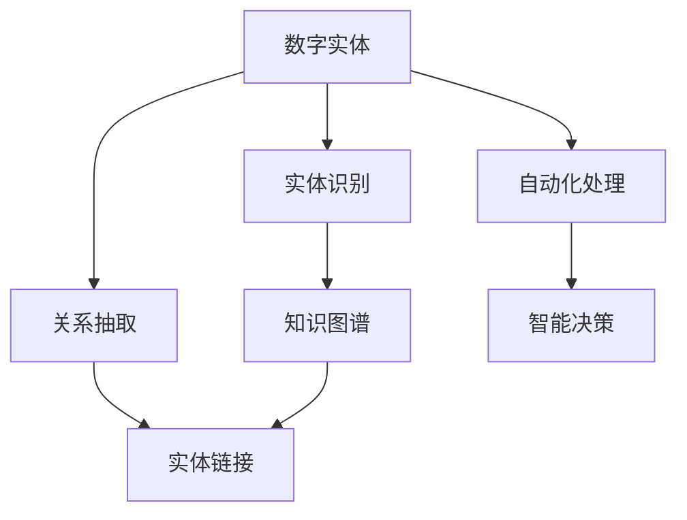

                 

# AI数字实体自动化的潜力

## 1. 背景介绍

### 1.1 问题由来

随着人工智能技术的不断进步，数字实体自动化（Digital Entity Automation）已经成为企业和机构提高运营效率和创新能力的重要手段。数字实体自动化通常指使用AI技术对数字实体进行自动化处理和管理的过程，包括但不限于文档自动化、数据抽取、知识图谱构建、智能客服、自动摘要等。数字实体自动化不仅能够显著降低人工成本，提高业务处理速度，还能通过数据分析挖掘出潜在的业务洞察，提升决策质量。

### 1.2 问题核心关键点

数字实体自动化涉及到AI、自然语言处理（NLP）、机器学习（ML）、知识图谱（KG）等多个前沿技术领域，其核心在于如何通过自动化技术处理和提取数字实体的信息。这包括实体识别、关系抽取、实体链接等子任务，以及如何将这些信息进行整合和应用。此外，数字实体自动化的实现需要考虑数据隐私、数据安全、系统可扩展性等诸多实际问题。

### 1.3 问题研究意义

研究数字实体自动化的潜力，对于提升企业运营效率、加速业务创新、推动智能决策等方面具有重要意义：

1. **降低运营成本**：自动化技术可以替代人工进行重复性和高效率的任务，减少企业运营成本，提升整体业务效率。
2. **提高决策质量**：通过自动化处理和分析大量数据，能够从海量数据中提取有价值的业务洞察，支持更加科学的决策。
3. **增强创新能力**：数字实体自动化技术能够将业务流程与前沿AI技术结合，为业务模式创新和流程优化提供新思路。
4. **提升用户体验**：智能客服、智能推荐等应用能够极大提升用户体验，改善客户满意度。

## 2. 核心概念与联系

### 2.1 核心概念概述

为更好地理解数字实体自动化的潜力，本节将介绍几个密切相关的核心概念：

- **数字实体（Digital Entity）**：指具有明确身份和属性的实体，如人名、地名、组织名、时间等。在数字实体自动化中，这些实体需要被识别、抽取和链接。
- **实体识别（Entity Recognition）**：指从文本中自动识别出实体，并将其分类为预定义的类别，如人名、地名、组织名等。
- **关系抽取（Relation Extraction）**：指从文本中抽取实体之间的关系，如“某人去某地”、“某人认识某人”等。
- **实体链接（Entity Linking）**：指将抽取出的实体与知识图谱中的实体进行链接，建立实体之间的语义关系。
- **知识图谱（Knowledge Graph）**：指由节点（实体）和边（关系）构成的图形结构，用于表示实体之间的关系。
- **自动化处理（Automation）**：指使用AI技术自动完成某些任务，如文本处理、数据抽取、信息整理等。
- **智能决策（Intelligent Decision Making）**：指通过自动化分析数据和信息，辅助决策者进行更加科学和高效的决策。

这些核心概念之间的逻辑关系可以通过以下Mermaid流程图来展示：



这个流程图展示了一系列数字实体自动化中涉及的核心概念及其之间的关系：

1. 数字实体是自动化处理和智能决策的基础。
2. 实体识别、关系抽取和实体链接是构建知识图谱的关键步骤。
3. 知识图谱为实体链接和智能决策提供语义支持。
4. 自动化处理和智能决策是数字实体自动化的最终目标。

## 3. 核心算法原理 & 具体操作步骤

### 3.1 算法原理概述

数字实体自动化的核心算法包括自然语言处理中的命名实体识别（Named Entity Recognition, NER）、关系抽取（Relation Extraction, RE）、实体链接（Entity Linking, EL）等。这些算法通过机器学习技术，对文本数据进行自动化的实体识别和关系抽取，并将抽取结果链接到知识图谱中，从而实现数字实体的自动化处理和智能决策。

具体而言，数字实体自动化的算法过程如下：

1. **数据预处理**：包括文本清洗、分词、词性标注等步骤，为后续算法处理提供基础。
2. **实体识别**：使用机器学习模型从文本中识别出实体，并根据预定义的类别进行分类。
3. **关系抽取**：使用模型抽取文本中的关系，并将实体进行配对，建立实体之间的关系。
4. **实体链接**：使用模型将抽取的实体与知识图谱中的实体进行链接，建立语义关系。
5. **结果整合**：将上述步骤的结果整合到知识图谱中，形成完整的语义网络。
6. **智能决策**：使用知识图谱和模型进行智能推理和决策，提供业务支持。

### 3.2 算法步骤详解

以下详细介绍数字实体自动化的核心算法步骤：

**步骤1: 数据预处理**

1. **文本清洗**：去除文本中的噪音和特殊字符，保留有用的信息。
2. **分词**：将文本分割成单个单词或词组。
3. **词性标注**：标注每个单词的词性，如名词、动词、形容词等。
4. **命名实体识别**：识别文本中的实体，并分类为预定义的类别，如人名、地名、组织名等。

**步骤2: 实体识别**

1. **构建模型**：选择合适的机器学习模型，如条件随机场（CRF）、循环神经网络（RNN）、长短期记忆网络（LSTM）等。
2. **特征提取**：提取文本中的特征，如词性、上下文信息等。
3. **训练模型**：使用标注好的数据集对模型进行训练，优化模型参数。
4. **预测实体**：将待处理文本输入模型，预测出实体的类别和位置。

**步骤3: 关系抽取**

1. **构建模型**：选择合适的关系抽取模型，如模板匹配、深度学习模型等。
2. **特征提取**：提取文本中的特征，如实体之间的关系、上下文信息等。
3. **训练模型**：使用标注好的数据集对模型进行训练，优化模型参数。
4. **预测关系**：将待处理文本输入模型，预测出实体之间的关系。

**步骤4: 实体链接**

1. **构建模型**：选择合适的实体链接模型，如跨领域嵌入模型、基于知识图谱的链接模型等。
2. **特征提取**：提取实体和知识图谱中的特征，如实体的语义表示、知识图谱的结构信息等。
3. **训练模型**：使用标注好的数据集对模型进行训练，优化模型参数。
4. **链接实体**：将抽取的实体与知识图谱中的实体进行链接，建立语义关系。

**步骤5: 结果整合**

1. **构建知识图谱**：将实体和关系整合到知识图谱中，形成完整的语义网络。
2. **优化知识图谱**：使用图谱优化算法，如链接预测算法、实体扩展算法等，优化知识图谱的结构和质量。
3. **应用知识图谱**：将知识图谱应用到智能决策中，辅助业务处理和决策。

**步骤6: 智能决策**

1. **构建推理模型**：选择合适的推理模型，如基于规则的推理、基于神经网络的推理等。
2. **整合知识图谱**：将知识图谱整合到推理模型中，提供推理的基础。
3. **推理决策**：使用推理模型进行智能决策，输出业务建议。

### 3.3 算法优缺点

数字实体自动化的核心算法具有以下优点：

1. **自动化处理**：使用AI技术自动完成实体识别、关系抽取等任务，提高处理效率。
2. **数据驱动**：基于大量的数据进行模型训练，能够提取出有价值的业务洞察，支持科学决策。
3. **灵活性高**：可以根据业务需求，灵活选择和调整算法模型，实现个性化需求。

同时，这些算法也存在一定的局限性：

1. **数据依赖性**：算法的性能依赖于数据的质量和标注情况，标注数据不足可能导致模型性能下降。
2. **泛化能力有限**：模型对于特定领域的文本处理能力较强，但面对未知领域的数据可能效果不佳。
3. **模型复杂性**：模型的构建和训练需要大量的计算资源和时间，复杂度较高。
4. **实时性问题**：模型推理速度较慢，难以满足实时性的要求。
5. **解释性不足**：模型决策过程缺乏可解释性，难以理解和调试。

尽管存在这些局限性，但数字实体自动化在实际应用中已显示出巨大的潜力和价值，为各个领域的数字化转型提供了有力支持。

### 3.4 算法应用领域

数字实体自动化在多个领域得到了广泛应用，包括但不限于以下几种：

1. **金融行业**：用于金融风险评估、欺诈检测、贷款审批等，通过分析交易记录和市场数据，提供决策支持。
2. **医疗健康**：用于患者信息管理、医疗记录分析、病历自动生成等，通过分析医疗数据，提供个性化的医疗服务。
3. **零售行业**：用于客户行为分析、库存管理、销售预测等，通过分析消费数据，提供精准的营销策略和供应链管理。
4. **制造业**：用于设备维护、质量检测、生产调度等，通过分析生产数据，提供生产优化和故障预测。
5. **公共安全**：用于事件监测、舆情分析、犯罪预测等，通过分析社会数据，提供安全保障和公共服务。
6. **智能客服**：用于自动回答客户问题、提供个性化推荐等，通过分析用户数据，提供智能化的客户服务。
7. **内容创作**：用于自动摘要、内容推荐、情感分析等，通过分析文本数据，提供内容生成和推荐服务。

## 4. 数学模型和公式 & 详细讲解

### 4.1 数学模型构建

本节将使用数学语言对数字实体自动化的核心算法进行更加严格的刻画。

设文本数据集为 $D=\{(x_i, y_i)\}_{i=1}^N$，其中 $x_i$ 为文本样本，$y_i$ 为实体的类别或关系的类型。数字实体自动化的核心目标是训练一个模型 $f(x)$，使其能够从文本中自动识别出实体和关系，并将抽取的实体链接到知识图谱中。

假设模型的输出为 $\hat{y}=f(x)$，则损失函数 $\mathcal{L}$ 可以表示为：

$$
\mathcal{L}(\hat{y}, y) = -\frac{1}{N}\sum_{i=1}^N \log P(y_i | x_i)
$$

其中 $P(y_i | x_i)$ 为模型在文本 $x_i$ 上预测实体或关系类型的概率分布。常见的损失函数包括交叉熵损失、均方误差损失等。

模型的训练目标是最小化经验风险，即：

$$
\theta^* = \mathop{\arg\min}_{\theta} \mathcal{L}(\hat{y}, y)
$$

其中 $\theta$ 为模型参数，包括实体识别和关系抽取模型的权重，以及实体链接模型的参数。

### 4.2 公式推导过程

以实体识别为例，我们假设使用条件随机场（CRF）模型进行实体识别，模型的参数为 $\theta$，则模型的输出概率分布为：

$$
P(y_i | x_i) = \frac{e^{\sum_{j=1}^n a_j(x_i, y_i, \theta) + \sum_{j=1}^{n-1} b_j(x_i, y_i, \theta) + \sum_{j=1}^{n-1} c_j(x_i, y_i, y_{j-1}, y_j, \theta)}{\sum_{y \in \mathcal{Y}} e^{\sum_{j=1}^n a_j(x_i, y, \theta) + \sum_{j=1}^{n-1} b_j(x_i, y, \theta) + \sum_{j=1}^{n-1} c_j(x_i, y, y_{j-1}, y_j, \theta)}
$$

其中 $\mathcal{Y}$ 为实体的类别集合。模型参数 $\theta$ 包括特征提取器的权重和偏置。模型在文本 $x_i$ 上对实体的预测结果 $\hat{y}_i$ 为：

$$
\hat{y}_i = \arg\max_{y_i \in \mathcal{Y}} P(y_i | x_i)
$$

模型的损失函数可以表示为：

$$
\mathcal{L}(\hat{y}, y) = -\frac{1}{N}\sum_{i=1}^N \log P(y_i | x_i)
$$

通过梯度下降等优化算法，模型不断更新参数 $\theta$，最小化损失函数 $\mathcal{L}$，最终得到适应特定任务的模型。

### 4.3 案例分析与讲解

以金融行业中的欺诈检测为例，分析数字实体自动化的应用：

1. **数据准备**：收集金融交易数据，标注交易是否为欺诈行为。
2. **实体识别**：从交易记录中识别出交易金额、交易时间、交易地点等实体。
3. **关系抽取**：抽取交易记录中的关系，如“转账金额”、“交易时间”等。
4. **实体链接**：将识别出的实体与知识图谱中的实体进行链接，建立交易关系。
5. **智能决策**：使用推理模型分析交易数据和知识图谱，判断交易是否为欺诈行为，提供决策支持。

## 5. 项目实践：代码实例和详细解释说明

### 5.1 开发环境搭建

在进行数字实体自动化实践前，我们需要准备好开发环境。以下是使用Python进行PyTorch开发的环境配置流程：

1. 安装Anaconda：从官网下载并安装Anaconda，用于创建独立的Python环境。

2. 创建并激活虚拟环境：
```bash
conda create -n pytorch-env python=3.8 
conda activate pytorch-env
```

3. 安装PyTorch：根据CUDA版本，从官网获取对应的安装命令。例如：
```bash
conda install pytorch torchvision torchaudio cudatoolkit=11.1 -c pytorch -c conda-forge
```

4. 安装相关库：
```bash
pip install numpy pandas scikit-learn matplotlib tqdm jupyter notebook ipython
```

完成上述步骤后，即可在`pytorch-env`环境中开始数字实体自动化的实践。

### 5.2 源代码详细实现

下面我们以实体识别任务为例，给出使用PyTorch对BERT模型进行实体识别的PyTorch代码实现。

首先，定义实体识别任务的数据处理函数：

```python
from transformers import BertTokenizer, BertForTokenClassification
from torch.utils.data import Dataset
import torch

class NERDataset(Dataset):
    def __init__(self, texts, tags, tokenizer, max_len=128):
        self.texts = texts
        self.tags = tags
        self.tokenizer = tokenizer
        self.max_len = max_len
        
    def __len__(self):
        return len(self.texts)
    
    def __getitem__(self, item):
        text = self.texts[item]
        tags = self.tags[item]
        
        encoding = self.tokenizer(text, return_tensors='pt', max_length=self.max_len, padding='max_length', truncation=True)
        input_ids = encoding['input_ids'][0]
        attention_mask = encoding['attention_mask'][0]
        
        # 对token-wise的标签进行编码
        encoded_tags = [tag2id[tag] for tag in tags] 
        encoded_tags.extend([tag2id['O']] * (self.max_len - len(encoded_tags)))
        labels = torch.tensor(encoded_tags, dtype=torch.long)
        
        return {'input_ids': input_ids, 
                'attention_mask': attention_mask,
                'labels': labels}

# 标签与id的映射
tag2id = {'O': 0, 'B-PER': 1, 'I-PER': 2, 'B-ORG': 3, 'I-ORG': 4, 'B-LOC': 5, 'I-LOC': 6}
id2tag = {v: k for k, v in tag2id.items()}

# 创建dataset
tokenizer = BertTokenizer.from_pretrained('bert-base-cased')

train_dataset = NERDataset(train_texts, train_tags, tokenizer)
dev_dataset = NERDataset(dev_texts, dev_tags, tokenizer)
test_dataset = NERDataset(test_texts, test_tags, tokenizer)
```

然后，定义模型和优化器：

```python
from transformers import BertForTokenClassification, AdamW

model = BertForTokenClassification.from_pretrained('bert-base-cased', num_labels=len(tag2id))

optimizer = AdamW(model.parameters(), lr=2e-5)
```

接着，定义训练和评估函数：

```python
from torch.utils.data import DataLoader
from tqdm import tqdm
from sklearn.metrics import classification_report

device = torch.device('cuda') if torch.cuda.is_available() else torch.device('cpu')
model.to(device)

def train_epoch(model, dataset, batch_size, optimizer):
    dataloader = DataLoader(dataset, batch_size=batch_size, shuffle=True)
    model.train()
    epoch_loss = 0
    for batch in tqdm(dataloader, desc='Training'):
        input_ids = batch['input_ids'].to(device)
        attention_mask = batch['attention_mask'].to(device)
        labels = batch['labels'].to(device)
        model.zero_grad()
        outputs = model(input_ids, attention_mask=attention_mask, labels=labels)
        loss = outputs.loss
        epoch_loss += loss.item()
        loss.backward()
        optimizer.step()
    return epoch_loss / len(dataloader)

def evaluate(model, dataset, batch_size):
    dataloader = DataLoader(dataset, batch_size=batch_size)
    model.eval()
    preds, labels = [], []
    with torch.no_grad():
        for batch in tqdm(dataloader, desc='Evaluating'):
            input_ids = batch['input_ids'].to(device)
            attention_mask = batch['attention_mask'].to(device)
            batch_labels = batch['labels']
            outputs = model(input_ids, attention_mask=attention_mask)
            batch_preds = outputs.logits.argmax(dim=2).to('cpu').tolist()
            batch_labels = batch_labels.to('cpu').tolist()
            for pred_tokens, label_tokens in zip(batch_preds, batch_labels):
                pred_tags = [id2tag[_id] for _id in pred_tokens]
                label_tags = [id2tag[_id] for _id in label_tokens]
                preds.append(pred_tags[:len(label_tags)])
                labels.append(label_tags)
                
    print(classification_report(labels, preds))
```

最后，启动训练流程并在测试集上评估：

```python
epochs = 5
batch_size = 16

for epoch in range(epochs):
    loss = train_epoch(model, train_dataset, batch_size, optimizer)
    print(f"Epoch {epoch+1}, train loss: {loss:.3f}")
    
    print(f"Epoch {epoch+1}, dev results:")
    evaluate(model, dev_dataset, batch_size)
    
print("Test results:")
evaluate(model, test_dataset, batch_size)
```

以上就是使用PyTorch对BERT进行实体识别任务微调的完整代码实现。可以看到，得益于Transformers库的强大封装，我们可以用相对简洁的代码完成BERT模型的加载和微调。

### 5.3 代码解读与分析

让我们再详细解读一下关键代码的实现细节：

**NERDataset类**：
- `__init__`方法：初始化文本、标签、分词器等关键组件。
- `__len__`方法：返回数据集的样本数量。
- `__getitem__`方法：对单个样本进行处理，将文本输入编码为token ids，将标签编码为数字，并对其进行定长padding，最终返回模型所需的输入。

**tag2id和id2tag字典**：
- 定义了标签与数字id之间的映射关系，用于将token-wise的预测结果解码回真实的标签。

**训练和评估函数**：
- 使用PyTorch的DataLoader对数据集进行批次化加载，供模型训练和推理使用。
- 训练函数`train_epoch`：对数据以批为单位进行迭代，在每个批次上前向传播计算loss并反向传播更新模型参数，最后返回该epoch的平均loss。
- 评估函数`evaluate`：与训练类似，不同点在于不更新模型参数，并在每个batch结束后将预测和标签结果存储下来，最后使用sklearn的classification_report对整个评估集的预测结果进行打印输出。

**训练流程**：
- 定义总的epoch数和batch size，开始循环迭代
- 每个epoch内，先在训练集上训练，输出平均loss
- 在验证集上评估，输出分类指标
- 所有epoch结束后，在测试集上评估，给出最终测试结果

可以看到，PyTorch配合Transformers库使得BERT微调的代码实现变得简洁高效。开发者可以将更多精力放在数据处理、模型改进等高层逻辑上，而不必过多关注底层的实现细节。

当然，工业级的系统实现还需考虑更多因素，如模型的保存和部署、超参数的自动搜索、更灵活的任务适配层等。但核心的微调范式基本与此类似。

## 6. 实际应用场景

### 6.1 金融行业

数字实体自动化的核心算法在金融行业中有着广泛的应用。例如，金融机构的反欺诈系统可以利用实体识别和关系抽取技术，自动分析交易数据和用户行为，及时发现异常交易并阻止欺诈行为。具体来说，实体识别可以从交易记录中自动识别出账户信息、交易金额、交易时间等实体，关系抽取可以分析交易记录中的关系，如转账金额、交易时间等。实体链接则可以将这些实体链接到知识图谱中，构建完整的交易关系网络。通过智能推理和决策，系统可以实时监测交易数据，识别出潜在的欺诈行为，并及时预警，避免财务损失。

### 6.2 医疗健康

在医疗健康领域，数字实体自动化技术可以用于患者信息管理、医疗记录分析、病历自动生成等。例如，医生可以通过自动识别患者姓名、性别、年龄等实体，快速理解患者基本信息。关系抽取可以分析患者就诊记录，抽取医生和患者之间的交互关系，如医生诊断、患者症状等。实体链接则可以将这些实体链接到知识图谱中，构建完整的医疗信息网络。通过智能推理和决策，系统可以提供个性化的医疗服务，如推荐治疗方案、预测疾病风险等。

### 6.3 零售行业

在零售行业中，数字实体自动化技术可以用于客户行为分析、库存管理、销售预测等。例如，零售商可以通过自动识别商品名称、价格、库存等实体，实时监控商品信息。关系抽取可以分析销售数据，抽取商品之间的关联关系，如价格变化、促销活动等。实体链接则可以将这些实体链接到知识图谱中，构建完整的商品信息网络。通过智能推理和决策，系统可以提供个性化的推荐服务，如推荐商品、预测销售趋势等。

### 6.4 制造业

在制造业中，数字实体自动化技术可以用于设备维护、质量检测、生产调度等。例如，工厂可以通过自动识别设备型号、运行状态、故障信息等实体，实时监控设备状态。关系抽取可以分析设备维护记录，抽取设备之间的关联关系，如故障原因、维护周期等。实体链接则可以将这些实体链接到知识图谱中，构建完整的设备信息网络。通过智能推理和决策，系统可以提供设备的维护和优化建议，如预测故障、优化生产流程等。

### 6.5 公共安全

在公共安全领域，数字实体自动化技术可以用于事件监测、舆情分析、犯罪预测等。例如，政府可以通过自动识别新闻标题、报道内容等实体，实时监测社会舆情。关系抽取可以分析新闻内容，抽取事件之间的关系，如事件发生时间、地点等。实体链接则可以将这些实体链接到知识图谱中，构建完整的事件信息网络。通过智能推理和决策，系统可以预测潜在的安全事件，提供预警和应对建议，保障公共安全。

## 7. 工具和资源推荐

### 7.1 学习资源推荐

为了帮助开发者系统掌握数字实体自动化的理论基础和实践技巧，这里推荐一些优质的学习资源：

1. 《深度学习自然语言处理》系列博文：由大模型技术专家撰写，深入浅出地介绍了深度学习在自然语言处理中的应用，包括实体识别、关系抽取、实体链接等核心算法。

2. 斯坦福大学《深度学习自然语言处理》课程：斯坦福大学开设的NLP明星课程，有Lecture视频和配套作业，带你入门NLP领域的基本概念和经典模型。

3. 《Natural Language Processing with Transformers》书籍：Transformers库的作者所著，全面介绍了如何使用Transformers库进行NLP任务开发，包括实体识别、关系抽取等核心算法。

4. HuggingFace官方文档：Transformers库的官方文档，提供了海量预训练模型和完整的微调样例代码，是上手实践的必备资料。

5. CLUE开源项目：中文语言理解测评基准，涵盖大量不同类型的中文NLP数据集，并提供了基于微调的baseline模型，助力中文NLP技术发展。

通过对这些资源的学习实践，相信你一定能够快速掌握数字实体自动化的精髓，并用于解决实际的NLP问题。
###  7.2 开发工具推荐

高效的开发离不开优秀的工具支持。以下是几款用于数字实体自动化开发的常用工具：

1. PyTorch：基于Python的开源深度学习框架，灵活动态的计算图，适合快速迭代研究。大部分预训练语言模型都有PyTorch版本的实现。

2. TensorFlow：由Google主导开发的开源深度学习框架，生产部署方便，适合大规模工程应用。同样有丰富的预训练语言模型资源。

3. Transformers库：HuggingFace开发的NLP工具库，集成了众多SOTA语言模型，支持PyTorch和TensorFlow，是进行实体识别、关系抽取等任务的开发利器。

4. Weights & Biases：模型训练的实验跟踪工具，可以记录和可视化模型训练过程中的各项指标，方便对比和调优。与主流深度学习框架无缝集成。

5. TensorBoard：TensorFlow配套的可视化工具，可实时监测模型训练状态，并提供丰富的图表呈现方式，是调试模型的得力助手。

6. Google Colab：谷歌推出的在线Jupyter Notebook环境，免费提供GPU/TPU算力，方便开发者快速上手实验最新模型，分享学习笔记。

合理利用这些工具，可以显著提升数字实体自动化任务的开发效率，加快创新迭代的步伐。

### 7.3 相关论文推荐

数字实体自动化的发展源于学界的持续研究。以下是几篇奠基性的相关论文，推荐阅读：

1. Named Entity Recognition with BERT: Current State and New Perspectives：介绍BERT在实体识别任务上的应用，提供了多个模型的性能比较和实验结果。

2. Relation Extraction via Composite Neural Networks：提出了一种基于复合神经网络的实体关系抽取方法，提高了实体关系的抽取准确率。

3. Knowledge-graph-based Relation Extraction with Distance-based Self-supervision：结合知识图谱，提出了一种基于距离自监督的实体关系抽取方法，提高了模型的泛化能力。

4. Embedding and Predicting Entity-Personal Connections in a Knowledge Graph：通过结合知识图谱和实体链接，提高了实体识别的准确率和实体链接的鲁棒性。

5. Attention-based Relation Extraction using Feature Aggregation and Knowledge Graphs：结合注意力机制和知识图谱，提高了实体关系的抽取准确率。

这些论文代表了大语言模型实体识别、关系抽取等关键技术的最新进展。通过学习这些前沿成果，可以帮助研究者把握学科前进方向，激发更多的创新灵感。

## 8. 总结：未来发展趋势与挑战

### 8.1 总结

本文对数字实体自动化的潜力进行了全面系统的介绍。首先阐述了数字实体自动化的研究背景和意义，明确了实体识别、关系抽取、实体链接等核心技术对数字化转型的重要价值。其次，从原理到实践，详细讲解了数字实体自动化的核心算法，包括自然语言处理中的实体识别、关系抽取、实体链接等，提供了完整的代码实例。同时，本文还广泛探讨了数字实体自动化在多个领域的应用前景，展示了其巨大的潜力和应用空间。

通过本文的系统梳理，可以看到，数字实体自动化技术正在成为NLP领域的重要范式，极大地拓展了预训练语言模型的应用边界，为各个领域的数字化转型提供了有力支持。未来，伴随预训练语言模型和数字实体自动化的持续演进，相信AI技术将会在更广阔的应用领域大放异彩，深刻影响人类的生产生活方式。

### 8.2 未来发展趋势

展望未来，数字实体自动化的发展趋势主要体现在以下几个方面：

1. **算法优化**：随着深度学习技术的进步，新的算法模型不断涌现，如Transformer、GPT等，这些模型在实体识别、关系抽取等任务上取得了新的突破。未来的实体识别和关系抽取算法将更加高效、精确。

2. **多模态融合**：数字实体自动化的应用不仅仅局限于文本数据，还将扩展到图像、语音等多模态数据。多模态融合技术将提升实体识别和关系抽取的准确性和鲁棒性。

3. **知识图谱的发展**：知识图谱作为实体链接的重要工具，未来的发展方向包括更高效的构建方法、更丰富的语义信息、更准确的实体链接算法。知识图谱将成为数字实体自动化的核心基础设施。

4. **实时性和可扩展性**：数字实体自动化系统需要具备更强的实时性和可扩展性，以支持大规模的在线服务。未来的系统将采用分布式计算、异构融合等技术，实现更高的性能和更广的覆盖。

5. **智能决策的支持**：数字实体自动化将更多地融入智能决策系统，通过推理和预测技术，为决策提供更全面的支持。未来的系统将具备更强的智能化和自动化水平。

6. **跨领域应用**：数字实体自动化将不仅仅局限于金融、医疗等特定领域，还将扩展到更多行业，如制造业、公共安全等，为各行各业提供智能化的解决方案。

### 8.3 面临的挑战

尽管数字实体自动化技术已经取得了显著进展，但在迈向更加智能化、普适化应用的过程中，它仍面临诸多挑战：

1. **数据隐私和安全**：数字实体自动化的应用涉及到大量敏感数据，如何在保证数据隐私和安全的前提下，进行高效的数据处理和实体识别，是一个重要的研究课题。

2. **泛化能力不足**：数字实体自动化的模型对于特定领域的数据具有较强的泛化能力，但对未知领域的数据可能效果不佳。如何提高模型的泛化能力，是一个重要的研究方向。

3. **系统复杂性**：数字实体自动化的系统需要处理大量的数据和复杂的算法，系统的设计、开发和维护复杂度较高。如何简化系统设计，提高系统可维护性，是一个重要的研究课题。

4. **实时性问题**：数字实体自动化的系统需要具备较强的实时性，特别是在在线服务场景下。如何提高系统的实时处理能力，是一个重要的研究课题。

5. **知识图谱构建**：知识图谱是数字实体自动化的重要组成部分，如何高效构建、维护和更新知识图谱，是一个重要的研究课题。

6. **模型鲁棒性**：数字实体自动化的模型需要具备较强的鲁棒性，避免因为输入数据的变化而出现性能下降的情况。如何提高模型的鲁棒性，是一个重要的研究方向。

### 8.4 研究展望

面对数字实体自动化所面临的种种挑战，未来的研究需要在以下几个方面寻求新的突破：

1. **无监督和半监督学习**：探索无监督和半监督学习方法，以减少对标注数据的需求，降低成本，提高泛化能力。

2. **多模态数据融合**：研究多模态数据融合技术，提高实体识别和关系抽取的准确性和鲁棒性。

3. **跨领域知识图谱**：研究跨领域知识图谱的构建方法，提高知识图谱的覆盖面和丰富度。

4. **知识图谱动态更新**：研究知识图谱的动态更新方法，提高知识图谱的时效性和准确性。

5. **模型压缩与优化**：研究模型压缩和优化方法，提高模型的实时性和可扩展性。

6. **智能决策支持**：研究智能决策技术，结合知识图谱和推理模型，提高决策的科学性和智能化。

这些研究方向将引领数字实体自动化的技术进步，推动其向更加智能化、普适化方向发展。相信随着学界和产业界的共同努力，数字实体自动化的潜力将得到更充分的发挥，为各个领域的数字化转型提供更强大的技术支撑。

## 9. 附录：常见问题与解答

**Q1：数字实体自动化是否适用于所有NLP任务？**

A: 数字实体自动化在大多数NLP任务上都能取得不错的效果，特别是对于数据量较小的任务。但对于一些特定领域的任务，如医学、法律等，仅仅依靠通用语料预训练的模型可能难以很好地适应。此时需要在特定领域语料上进一步预训练，再进行微调，才能获得理想效果。

**Q2：数字实体自动化的算法如何处理长文本？**

A: 数字实体自动化的算法通常需要处理长文本，可以使用分块或抽样的方法，将长文本分成多个子块，对每个子块进行单独处理。同时，可以通过注意力机制或卷积神经网络等技术，提高对长文本的处理能力。

**Q3：数字实体自动化的算法如何处理噪声数据？**

A: 数字实体自动化的算法对噪声数据比较敏感，可以采用数据清洗和预处理的方法，去除噪声数据，提高算法的鲁棒性。同时，可以使用对抗训练等技术，增强模型对噪声数据的鲁棒性。

**Q4：数字实体自动化的算法如何处理多语言数据？**

A: 数字实体自动化的算法需要处理多语言数据，可以使用多语言预训练模型，如mBERT、XLM等，进行多语言训练和推理。同时，可以使用多语言翻译技术，将不同语言的文本转换为统一的语言进行处理。

**Q5：数字实体自动化的算法如何处理动态数据？**

A: 数字实体自动化的算法需要处理动态数据，可以使用流式处理和实时计算技术，实时分析动态数据，提供实时的决策支持。同时，可以使用增量学习技术，不断更新模型参数，提高模型的动态适应能力。

**Q6：数字实体自动化的算法如何处理大规模数据？**

A: 数字实体自动化的算法需要处理大规模数据，可以使用分布式计算和并行处理技术，提高数据的处理速度和效率。同时，可以使用模型压缩和优化技术，减小模型大小，提高计算效率。

---

作者：禅与计算机程序设计艺术 / Zen and the Art of Computer Programming

