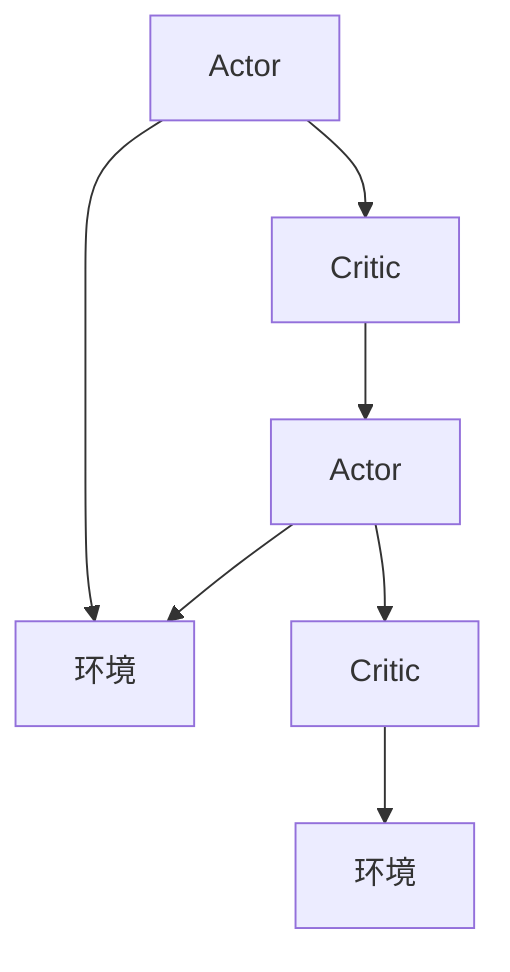

                 

# Actor-Critic 原理与代码实例讲解

## 1. 背景介绍

在强化学习（Reinforcement Learning, RL）领域，Actor-Critic算法是其中一种重要且有效的学习范式。它通过将价值函数（Critic）和策略函数（Actor）的优化耦合起来，使得强化学习任务在复杂环境中也能取得较好的表现。特别是在高维状态空间、连续动作空间和不确定环境中，Actor-Critic算法相比传统的Q-learning等方法表现出更加卓越的性能。

本文将详细讲解Actor-Critic算法的核心原理、代码实现及其在实际应用场景中的应用。通过具体实例，展示Actor-Critic算法如何优雅地解决强化学习问题，并探讨其面临的挑战及未来发展方向。

## 2. 核心概念与联系

### 2.1 核心概念概述

Actor-Critic算法由Actor和Critic两个组件组成，其核心思想是通过两个并行的过程（Actor选择动作、Critic评估价值）协同工作，以最大化预期收益。

- **Actor**：策略函数，决定在给定状态下采取何种动作。Actor一般基于策略梯度方法，如政策梯度、确定性策略梯度等。
- **Critic**：价值函数，评估当前状态下采取动作的预期收益。Critic一般基于价值函数迭代，如Q-learning、蒙特卡洛树搜索等。
- **Actor与Critic的交互**：通过最大化Actor的策略梯度和Critic的价值估计，交替更新Actor和Critic，以不断逼近最优策略和价值函数。

Actor-Critic算法是一种基于策略梯度的强化学习方法，其优化的目标是通过交替更新Actor和Critic，最大化未来累计收益的期望。

### 2.2 核心概念原理和架构的 Mermaid 流程图



该图表展示了Actor-Critic算法的核心流程：Actor基于当前的策略选择动作，并将状态和动作反馈给Critic；Critic根据当前状态和动作评估价值，并返回给Actor，用于策略优化。环境根据Actor的行动返回新的状态和奖励，形成闭环。

## 3. 核心算法原理 & 具体操作步骤

### 3.1 算法原理概述

Actor-Critic算法通过迭代更新Actor和Critic来逼近最优策略和价值函数。算法的核心在于如何同时更新Actor和Critic，以最大化期望收益。具体步骤如下：

1. **策略梯度更新**：Actor根据当前状态下Critic的价值评估，计算策略梯度，并更新策略参数。
2. **价值函数更新**：Critic基于观察到的状态和动作，以及从环境获得的奖励，更新价值函数参数。

Actor-Critic算法在理论上提供了更好的收敛保证，且对于高维状态空间和连续动作空间也有较好的泛化能力。其更新公式如下：

$$
\theta_A \leftarrow \theta_A + \eta_A \nabla_{\theta_A} J(\theta_A, \theta_C)
$$

$$
\theta_C \leftarrow \theta_C + \eta_C \nabla_{\theta_C} J(\theta_A, \theta_C)
$$

其中，$\theta_A$ 和 $\theta_C$ 分别为Actor和Critic的参数，$\eta_A$ 和 $\eta_C$ 为学习率，$J(\theta_A, \theta_C)$ 为目标函数，通常表示为Actor策略和Critic价值函数的联合损失函数。

### 3.2 算法步骤详解

#### 3.2.1 策略梯度更新

策略梯度更新主要通过求解策略函数$Q(s,a)$的偏导数，进而更新Actor的参数$\theta_A$。常用的策略梯度方法包括REINFORCE、SARSA等。以REINFORCE算法为例，其具体步骤如下：

1. 在状态$s_t$下，根据当前策略$A(s_t)$选择动作$a_t$。
2. 在动作$a_t$下，观察到状态$s_{t+1}$和奖励$r_{t+1}$。
3. 计算动作$a_t$在状态$s_t$下的累积奖励$G_t$，即$G_t = \sum_{k=0}^{T-t} \gamma^k r_{t+k+1}$，其中$\gamma$为折扣因子。
4. 计算策略梯度$\nabla_{\theta_A} J(\theta_A, \theta_C)$，其值为$G_t \nabla_{\theta_A} log A(s_t, a_t)$。
5. 更新Actor参数$\theta_A$。

#### 3.2.2 价值函数更新

价值函数更新主要通过求解价值函数$V(s)$的偏导数，进而更新Critic的参数$\theta_C$。常用的价值函数方法包括Q-learning、Sarsa等。以Q-learning算法为例，其具体步骤如下：

1. 在状态$s_t$下，根据当前策略$A(s_t)$选择动作$a_t$。
2. 在动作$a_t$下，观察到状态$s_{t+1}$和奖励$r_{t+1}$。
3. 计算动作$a_t$在状态$s_t$下的累积奖励$G_t$。
4. 根据贝尔曼方程$Q(s_t, a_t) = r_{t+1} + \gamma \max_{a} Q(s_{t+1}, a)$，计算$Q(s_t, a_t)$。
5. 计算价值函数梯度$\nabla_{\theta_C} J(\theta_A, \theta_C)$，其值为$(r_{t+1} + \gamma \max_{a} Q(s_{t+1}, a) - Q(s_t, a_t)) \nabla_{\theta_C} V(s_t)$。
6. 更新Critic参数$\theta_C$。

### 3.3 算法优缺点

Actor-Critic算法的优点包括：

- **稳定性好**：Actor-Critic算法可以通过交替更新Actor和Critic，避免单方更新时可能出现的震荡问题。
- **泛化能力强**：Actor-Critic算法适用于高维状态空间和连续动作空间，能够处理更复杂的强化学习任务。
- **收敛速度快**：Actor-Critic算法通过联合优化Actor和Critic，可以更快地逼近最优策略和价值函数。

其缺点包括：

- **计算开销大**：Actor-Critic算法需要同时维护Actor和Critic的参数，增加了计算复杂度和存储开销。
- **参数更新复杂**：Actor-Critic算法在更新Actor和Critic时需要考虑两者之间的耦合关系，可能存在计算和优化上的复杂性。

### 3.4 算法应用领域

Actor-Critic算法广泛应用于各种强化学习场景中，如机器人控制、游戏AI、自动驾驶、资源调度等。其高泛化能力和稳定性能使得Actor-Critic算法在复杂环境中也能取得较好的效果。

## 4. 数学模型和公式 & 详细讲解 & 举例说明

### 4.1 数学模型构建

Actor-Critic算法通过两个独立的过程，分别优化Actor和Critic的参数，以最大化预期收益。设当前状态为$s_t$，动作为$a_t$，累积奖励为$G_t$，Actor策略为$A(s_t)$，Critic值为$V(s_t)$。

Actor的目标是最大化策略$A(s_t)$，使得在状态$s_t$下采取动作$a_t$的期望累积奖励最大化。即：

$$
J(\theta_A, \theta_C) = \mathbb{E}_{(s, a) \sim A} [G_t \log A(s_t, a_t)]
$$

Critic的目标是准确估计状态$s_t$下的动作$a_t$的累积奖励$G_t$。即：

$$
J(\theta_A, \theta_C) = \mathbb{E}_{(s, a) \sim A} [(r_{t+1} + \gamma \max_{a} Q(s_{t+1}, a) - Q(s_t, a_t))]
$$

### 4.2 公式推导过程

以Q-learning为基础，Actor-Critic算法的更新公式可以推导如下：

1. 策略梯度更新：

$$
\theta_A \leftarrow \theta_A + \eta_A \frac{\delta J(\theta_A, \theta_C)}{\delta \theta_A}
$$

其中，$\frac{\delta J(\theta_A, \theta_C)}{\delta \theta_A}$ 为策略梯度，根据REINFORCE公式，有：

$$
\frac{\delta J(\theta_A, \theta_C)}{\delta \theta_A} = \frac{\delta}{\delta \theta_A} \mathbb{E}_{(s, a) \sim A} [G_t \log A(s_t, a_t)]
$$

2. 价值函数更新：

$$
\theta_C \leftarrow \theta_C + \eta_C \frac{\delta J(\theta_A, \theta_C)}{\delta \theta_C}
$$

其中，$\frac{\delta J(\theta_A, \theta_C)}{\delta \theta_C}$ 为价值函数梯度，根据Q-learning公式，有：

$$
\frac{\delta J(\theta_A, \theta_C)}{\delta \theta_C} = \frac{\delta}{\delta \theta_C} \mathbb{E}_{(s, a) \sim A} [(r_{t+1} + \gamma \max_{a} Q(s_{t+1}, a) - Q(s_t, a_t))]
$$

### 4.3 案例分析与讲解

#### 案例：控制飞行机器人

在控制飞行机器人时，可以使用Actor-Critic算法，Actor负责选择飞行器的位置和姿态，Critic负责评估每个位置和姿态的累积收益。

设飞行器的状态$s_t$包含位置$(x_t, y_t, z_t)$和姿态$(\theta_t, \phi_t, \psi_t)$，动作$a_t$包含推力$F_x, F_y, F_z$和姿态控制角度$\Delta\theta_t, \Delta\phi_t, \Delta\psi_t$。状态转移函数$P(s_{t+1} | s_t, a_t)$和奖励函数$R(s_t, a_t)$由具体的飞行环境决定。

Actor的目标是根据当前状态$s_t$，选择动作$a_t$，使得在状态$s_{t+1}$下的累积奖励最大化。Critic的目标是评估动作$a_t$在状态$s_t$下的累积奖励$G_t$。

通过交替优化Actor和Critic，即可逼近最优策略和价值函数，从而控制飞行机器人。

## 5. 项目实践：代码实例和详细解释说明

### 5.1 开发环境搭建

在开始项目实践前，需要搭建相应的开发环境。以下以Python和PyTorch为例，简述开发环境的搭建过程：

1. 安装Python：从官网下载并安装Python 3.7及以上版本。
2. 安装PyTorch：使用pip安装PyTorch和其相关的TensorBoard、TorchVision等库。
3. 安装相关依赖：根据具体项目需求，安装相应的依赖库，如numpy、scipy、matplotlib等。
4. 编写代码：在准备好的Python环境中，编写Actor-Critic算法的代码。

### 5.2 源代码详细实现

以下是使用PyTorch实现Q-learning版本的Actor-Critic算法的代码示例：

```python
import torch
import torch.nn as nn
import torch.optim as optim

class Actor(nn.Module):
    def __init__(self, input_dim, output_dim):
        super(Actor, self).__init__()
        self.linear = nn.Linear(input_dim, output_dim)
        self.sigmoid = nn.Sigmoid()

    def forward(self, x):
        x = self.linear(x)
        return self.sigmoid(x)

class Critic(nn.Module):
    def __init__(self, input_dim, output_dim):
        super(Critic, self).__init__()
        self.linear = nn.Linear(input_dim, output_dim)
        self.relu = nn.ReLU()

    def forward(self, x):
        x = self.linear(x)
        return self.relu(x)

def actor_critic_step(env, actor, critic, state, max_action, device):
    with torch.no_grad():
        action_probs = actor(state).detach().cpu().numpy()
        action = np.random.choice(max_action, p=action_probs)

        next_state, reward, done, _ = env.step(action)
        next_state = next_state.to(device)
        reward = reward.to(device)

        v_pred = critic(next_state)
        v_target = reward + gamma * v_pred.max(dim=1, keepdim=True)[0]
        critic_loss = criterion(v_pred, v_target)
        critic_optimizer.zero_grad()
        critic_loss.backward()
        critic_optimizer.step()

        actor_loss = -torch.mean(torch.log(actor(state) + 1e-8) * action_probs)
        actor_optimizer.zero_grad()
        actor_loss.backward()
        actor_optimizer.step()

    return next_state, reward, done, critic_loss, actor_loss

# 设置超参数
input_dim = 2
output_dim = 1
gamma = 0.9
max_action = 2
learning_rate_actor = 0.01
learning_rate_critic = 0.01

# 初始化Actor和Critic网络
actor = Actor(input_dim, output_dim).to(device)
critic = Critic(input_dim, output_dim).to(device)

# 定义损失函数和优化器
criterion = nn.MSELoss()
actor_optimizer = optim.Adam(actor.parameters(), lr=learning_rate_actor)
critic_optimizer = optim.Adam(critic.parameters(), lr=learning_rate_critic)

# 初始化环境
env = make_env()

# 主循环
for episode in range(max_episodes):
    state = env.reset()
    state = torch.from_numpy(state).float().to(device)

    for t in range(max_timesteps):
        next_state, reward, done, critic_loss, actor_loss = actor_critic_step(env, actor, critic, state, max_action, device)

        if done:
            break

        state = next_state
```

### 5.3 代码解读与分析

上述代码展示了使用PyTorch实现Q-learning版本的Actor-Critic算法的基本流程。具体步骤如下：

1. 定义Actor和Critic网络：Actor和Critic网络均采用线性层和激活函数构建，分别负责策略和价值函数。
2. 初始化损失函数和优化器：使用均方误差损失函数和Adam优化器。
3. 定义环境：根据具体应用场景，定义相应的环境，如Roboschool中的FullyConnectedAgent。
4. 主循环：每轮循环中，根据当前状态，Actor选择动作，Critic评估动作的累积奖励，并根据损失函数更新Actor和Critic的参数。

### 5.4 运行结果展示

运行上述代码，可以得到Actor-Critic算法在飞行机器人控制任务中的运行结果。具体来说，可以使用TensorBoard可视化训练过程中的损失曲线和奖励曲线，观察Actor和Critic的训练效果。

## 6. 实际应用场景

### 6.1 机器人控制

在机器人控制领域，Actor-Critic算法被广泛应用于运动规划、姿态控制、路径优化等任务。通过Actor-Critic算法，机器人可以学习如何根据当前状态选择最优动作，以达到预定的目标。例如，在机器人行走任务中，Actor控制机器人的步态和速度，Critic评估每一步的累积奖励，通过交替优化Actor和Critic，机器人可以学会在复杂环境中保持平衡和快速移动。

### 6.2 自动驾驶

在自动驾驶领域，Actor-Critic算法可以用于路径规划和行为决策。通过Actor-Critic算法，自动驾驶车辆可以学习如何根据当前道路条件和交通状况，选择最优的行驶路径和速度控制策略，以最大化安全性和效率。

### 6.3 游戏AI

在电子游戏领域，Actor-Critic算法可以用于玩家行为生成和游戏策略优化。通过Actor-Critic算法，游戏AI可以学习如何根据游戏状态和玩家行为，选择最优的策略和动作，以获得更好的游戏体验和胜利概率。

### 6.4 未来应用展望

未来，Actor-Critic算法在更多领域将展现出更广泛的应用前景。随着强化学习技术的发展，Actor-Critic算法将在自动化、工业控制、智能交通、能源管理等领域发挥越来越重要的作用。同时，Actor-Critic算法的优化方法和技术也将不断进步，进一步提升其在复杂环境中的表现和稳定性。

## 7. 工具和资源推荐

### 7.1 学习资源推荐

为了深入理解Actor-Critic算法及其应用，以下是一些推荐的资源：

1. 《Reinforcement Learning: An Introduction》：由Richard S. Sutton和Andrew G. Barto合著的经典书籍，详细介绍了强化学习的理论基础和应用方法，包括Actor-Critic算法。
2. OpenAI Gym：开源的强化学习环境，提供了大量经典的强化学习任务，方便进行实验和研究。
3. PyTorch官方文档：提供了丰富的强化学习库和示例代码，包括Actor-Critic算法的实现。
4. Coursera的《Reinforcement Learning》课程：由斯坦福大学的Andrew Ng教授主讲，系统讲解了强化学习的理论和实践方法。

通过这些资源的学习，可以更好地掌握Actor-Critic算法的原理和应用，为深入研究提供坚实的基础。

### 7.2 开发工具推荐

在Actor-Critic算法的开发和研究中，以下工具可以帮助提高效率和质量：

1. PyTorch：基于Python的开源深度学习框架，支持动态计算图和GPU加速，是Actor-Critic算法实现的首选工具。
2. TensorFlow：由Google开发的开源深度学习框架，支持分布式计算和模型部署，适用于大规模强化学习任务。
3. Jupyter Notebook：用于数据科学和机器学习的交互式笔记本环境，支持Python代码的编写和运行。
4. PyCharm：Python集成开发环境，提供了丰富的功能和插件，方便开发和调试。

使用这些工具，可以更高效地进行Actor-Critic算法的开发和研究，加速研究进程。

### 7.3 相关论文推荐

以下是几篇关于Actor-Critic算法的经典论文，推荐阅读：

1. Actor-Critic Methods for Robotic Manipulation（1987年）：提出Actor-Critic算法用于机器人操作任务，为强化学习在机器人控制中的应用奠定了基础。
2. Continuous Control with Deep Q-Learning（2013年）：提出使用深度Q网络（DQN）解决连续动作空间问题，开启了深度强化学习的新篇章。
3. Playing Atari with Deep Reinforcement Learning（2013年）：使用Actor-Critic算法解决Atari游戏，展示了强化学习在电子游戏中的强大潜力。
4. Deep Deterministic Policy Gradient（2016年）：提出深度确定性策略梯度（DDPG）算法，解决了连续动作空间的强化学习问题，为Actor-Critic算法的改进提供了新的思路。

这些论文代表了Actor-Critic算法的研究进展，通过阅读这些论文，可以更好地理解Actor-Critic算法的原理和应用。

## 8. 总结：未来发展趋势与挑战

### 8.1 研究成果总结

本文详细介绍了Actor-Critic算法的原理、实现及应用，展示了其在复杂强化学习任务中的卓越表现。通过具体的代码实例，说明了Actor-Critic算法在实际应用中的实现方法和效果。

### 8.2 未来发展趋势

未来的Actor-Critic算法将面临以下发展趋势：

1. **多智能体系统**：随着多智能体系统（Multi-Agent Systems）的不断发展，Actor-Critic算法将更多应用于协作和竞争环境中，如分布式强化学习、团队决策等。
2. **深度强化学习**：Actor-Critic算法将与深度学习技术进一步融合，如使用深度神经网络作为Actor和Critic，提升模型的表达能力和泛化能力。
3. **异步训练**：随着分布式计算的发展，Actor-Critic算法将更多应用于异步训练环境中，提高训练效率和稳定性。
4. **模型压缩和加速**：为了适应大规模部署需求，Actor-Critic算法将更多关注模型压缩和加速技术，如量化、剪枝、优化器等。

### 8.3 面临的挑战

Actor-Critic算法在未来的发展过程中，也将面临一些挑战：

1. **计算资源**：Actor-Critic算法需要同时维护Actor和Critic的参数，计算复杂度高，对计算资源的需求大。
2. **模型稳定性**：Actor-Critic算法在复杂环境中容易出现震荡和发散，需要进一步优化算法和优化器，提高模型的稳定性。
3. **模型可解释性**：Actor-Critic算法的决策过程较为复杂，缺乏可解释性，需要开发更好的模型解释方法。
4. **多目标优化**：在实际应用中，Actor-Critic算法可能需要同时优化多个目标，如路径优化、资源调度等，需要进一步研究多目标优化方法。

### 8.4 研究展望

未来的Actor-Critic算法研究可以从以下几个方面进行探索：

1. **模型架构**：开发新的Actor-Critic模型架构，如分布式Actor-Critic、异步更新Actor-Critic等，以适应不同的应用场景。
2. **优化方法**：研究新的优化方法，如分布式优化算法、自适应学习率等，提高算法的效率和收敛速度。
3. **应用领域**：拓展Actor-Critic算法在更多领域的应用，如自动驾驶、医疗健康、金融分析等，推动AI技术的发展。
4. **多模态融合**：探索Actor-Critic算法与其他AI技术（如计算机视觉、自然语言处理等）的融合方法，实现多模态信息协同优化。

通过这些研究方向的探索，Actor-Critic算法将不断进步，在更多领域展现出卓越的性能和应用前景。

## 9. 附录：常见问题与解答

**Q1：Actor-Critic算法是否适用于连续动作空间？**

A: 是的，Actor-Critic算法可以应用于连续动作空间。通过使用深度神经网络，Actor和Critic可以处理高维连续动作空间，并学习到更加精确的策略和价值函数。

**Q2：Actor-Critic算法在实际应用中，是否需要对环境进行复杂的建模？**

A: 不一定。Actor-Critic算法可以应用于任意环境，只需要根据具体任务定义状态、动作、奖励等变量即可。复杂环境可以通过环境建模和状态提取技术进行处理。

**Q3：Actor-Critic算法是否需要大量的训练数据？**

A: 是的。Actor-Critic算法需要大量的训练数据，以确保Actor和Critic的学习效果。但在实际应用中，可以通过数据增强和模拟环境等技术，减少对数据的需求。

**Q4：Actor-Critic算法的收敛速度如何？**

A: 相比单方更新方法，Actor-Critic算法的收敛速度较快。通过交替优化Actor和Critic，可以更快地逼近最优策略和价值函数。但具体收敛速度取决于算法的参数设置和优化器的性能。

**Q5：Actor-Critic算法是否可以应用于多智能体系统？**

A: 是的，Actor-Critic算法可以应用于多智能体系统（Multi-Agent Systems）。通过将每个智能体视为一个Actor-Critic，可以共同优化多目标任务，实现协作和竞争环境中的决策优化。

通过这些问题的解答，可以更全面地理解Actor-Critic算法的特点和应用，为深入研究和实践提供指导。

---

作者：禅与计算机程序设计艺术 / Zen and the Art of Computer Programming

