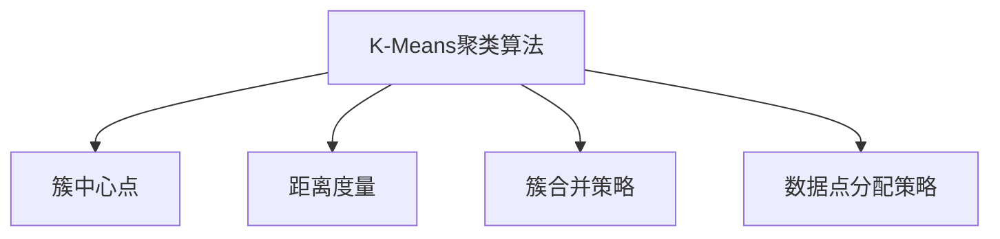

                 

# K-Means 聚类 (K-Means Clustering)

## 1. 背景介绍

### 1.1 问题由来
聚类分析是数据挖掘和机器学习领域中非常重要的一个主题。它旨在将相似的数据点分为不同的组或簇，使得同一簇内的数据点彼此相似，而不同簇之间的数据点差异较大。这一过程在数据分析、图像处理、模式识别、自然语言处理等多个领域有着广泛的应用。

K-Means聚类算法是最经典的聚类算法之一，广泛应用于各种数据挖掘和机器学习任务中。在市场细分、异常检测、图像分割等实际应用中，K-Means算法因其简单易懂、易于实现、计算效率高等优点，成为了首选算法之一。

然而，随着数据量增大和维度增高，K-Means算法的性能逐渐受到质疑，面临诸多挑战。如何克服K-Means算法在处理大规模数据和高维数据时的局限性，提高算法的效率和鲁棒性，成为当前研究的一个重要方向。

### 1.2 问题核心关键点
K-Means聚类算法的核心思想是通过迭代优化算法，将数据点划分为K个簇，使得簇内各数据点之间的距离最小，而簇间距离尽可能大。具体步骤如下：
1. 随机初始化K个簇的中心点。
2. 对于每个数据点，计算其与各簇中心的距离，并将其分配到距离最近的簇。
3. 更新每个簇的中心点，重新计算各数据点与簇中心的距离，重复步骤2。
4. 当簇中心不再发生显著变化时，聚类过程结束，返回最终的簇划分结果。

该算法主要包含以下几个关键点：
- 初始簇中心的随机初始化。
- 簇间距离与簇内距离的计算方式。
- 数据点的分配策略。
- 簇中心点的更新方法。
- 迭代终止条件。

### 1.3 问题研究意义
K-Means聚类算法因其简单高效，被广泛应用于市场细分、图像分割、异常检测、文本分类等领域，极大地推动了数据挖掘和机器学习技术的发展。

深入研究K-Means算法的理论基础和实际应用，对于理解聚类算法的原理，探索高效、鲁棒的聚类算法，以及在实际场景中优化算法性能，具有重要的理论和实际意义。

## 2. 核心概念与联系

### 2.1 核心概念概述
为了更好地理解K-Means聚类算法，本节将介绍几个密切相关的核心概念：

- K-Means聚类算法：基于迭代优化的聚类算法，通过将数据点划分为K个簇，使得簇内各数据点之间的距离最小，而簇间距离尽可能大。
- 簇中心点：K-Means算法中，每个簇的中心点用于表示该簇的聚类中心，通常是该簇所有数据点的平均值。
- 距离度量：用于计算数据点之间相似性或距离的度量标准，如欧氏距离、曼哈顿距离、余弦距离等。
- 簇合并策略：在K-Means算法中，当两个簇的距离小于某个阈值时，可以选择将它们合并为一个新的簇。
- 数据点分配策略：用于确定每个数据点应该分配到哪个簇。

这些核心概念之间的逻辑关系可以通过以下Mermaid流程图来展示：



这个流程图展示了大语言模型的核心概念及其之间的关系：

1. K-Means算法以簇中心点为聚类结果。
2. 距离度量用于计算数据点之间的相似性或距离。
3. 簇合并策略用于处理相邻簇合并的情况。
4. 数据点分配策略用于确定每个数据点应该分配到哪个簇。

这些概念共同构成了K-Means算法的核心思想，使得K-Means算法在聚类任务中得到广泛应用。

## 3. 核心算法原理 & 具体操作步骤

### 3.1 算法原理概述
K-Means聚类算法的核心思想是通过迭代优化算法，将数据点划分为K个簇，使得簇内各数据点之间的距离最小，而簇间距离尽可能大。具体步骤如下：
1. 随机初始化K个簇的中心点。
2. 对于每个数据点，计算其与各簇中心的距离，并将其分配到距离最近的簇。
3. 更新每个簇的中心点，重新计算各数据点与簇中心的距离，重复步骤2。
4. 当簇中心不再发生显著变化时，聚类过程结束，返回最终的簇划分结果。

### 3.2 算法步骤详解

K-Means聚类算法的主要步骤如下：

**Step 1: 初始化簇中心点**
- 随机选择K个数据点作为初始的簇中心点。
- 可以使用K-Means++算法等方法，选择更加分散的簇中心点，以避免局部最优解。

**Step 2: 分配数据点至簇**
- 对于每个数据点，计算其与K个簇中心点的距离，并将其分配到距离最近的簇。
- 可以使用欧氏距离、曼哈顿距离等方法计算距离。

**Step 3: 更新簇中心点**
- 对于每个簇，重新计算簇内所有数据点的平均值，更新簇中心点。
- 簇中心点的更新公式为：

$$
c_k = \frac{1}{|C_k|} \sum_{x_i \in C_k} x_i
$$

其中 $c_k$ 表示第k个簇的中心点，$C_k$ 表示第k个簇的数据点集合，$|C_k|$ 表示簇 $C_k$ 的数据点数量。

**Step 4: 迭代优化**
- 重复执行Step 2和Step 3，直到簇中心不再发生显著变化或达到预设的迭代次数。

### 3.3 算法优缺点

K-Means聚类算法具有以下优点：
1. 简单高效：算法实现简单，计算效率高，适合大规模数据集的处理。
2. 易于解释：簇中心点的直观表示，易于理解聚类结果。
3. 适用于多维数据：K-Means算法可以处理多维数据，无需进行特征降维。

同时，该算法也存在一些缺点：
1. 对初始值敏感：不同的初始簇中心点可能导致不同的聚类结果，需要多次运行算法，选择最优解。
2. 簇数目需要预设：K-Means算法需要预先指定簇的数目K，当K不合适时，可能无法得到理想的聚类结果。
3. 处理高维数据时效果较差：在高维空间中，数据点之间的距离可能变得非常相似，导致聚类效果不佳。
4. 对于非凸分布的数据聚类效果不好：K-Means算法只能处理凸性分布的数据，对于非凸分布的数据，聚类效果较差。

### 3.4 算法应用领域
K-Means聚类算法广泛应用于各种数据挖掘和机器学习任务中，例如：

- 市场细分：将消费者分为不同的细分市场，以便制定针对性的营销策略。
- 图像分割：将图像分割成多个区域，用于目标检测、图像压缩等。
- 异常检测：检测异常数据点，用于金融风险控制、网络安全等。
- 文本分类：将文本数据聚类成不同的主题，用于内容推荐、情感分析等。
- 生物信息学：用于基因表达数据分析、蛋白质结构预测等。

K-Means算法在实际应用中已经展现出强大的生命力，成为数据挖掘和机器学习领域中不可或缺的重要工具。

## 4. 数学模型和公式 & 详细讲解 & 举例说明

### 4.1 数学模型构建

K-Means聚类算法通过最小化簇内平方和与簇间平方和之和来确定簇中心点。假设数据集为 $X=\{x_1, x_2, ..., x_n\}$，其中 $x_i$ 为数据点的特征向量，$n$ 为数据点数量。聚类算法通过最小化目标函数：

$$
J = \sum_{k=1}^K \sum_{x_i \in C_k} ||x_i - c_k||^2
$$

其中 $K$ 为簇的数目，$c_k$ 为第 $k$ 个簇的中心点，$||.||$ 表示向量的欧氏距离。

### 4.2 公式推导过程

K-Means算法的目标函数可以推导如下：

假设数据集 $X$ 被分为 $K$ 个簇，每个簇的中心点为 $c_k$，则有：

$$
\sum_{k=1}^K \sum_{x_i \in C_k} ||x_i - c_k||^2 = \sum_{k=1}^K |C_k| ||\frac{1}{|C_k|} \sum_{x_i \in C_k} x_i - c_k||^2
$$

上式中，$|C_k|$ 表示第 $k$ 个簇的数据点数量，$\frac{1}{|C_k|} \sum_{x_i \in C_k} x_i$ 表示簇 $C_k$ 的平均值，因此上式可以简化为：

$$
\sum_{k=1}^K |C_k| ||\frac{1}{|C_k|} \sum_{x_i \in C_k} x_i - c_k||^2 = \sum_{k=1}^K |C_k| ||\bar{x}_k - c_k||^2
$$

其中 $\bar{x}_k$ 表示簇 $C_k$ 的平均值。上式进一步简化为：

$$
J = \sum_{k=1}^K |C_k| ||\bar{x}_k - c_k||^2
$$

上式即为K-Means算法的目标函数。

### 4.3 案例分析与讲解

假设我们有一组数据集，包含5个数据点，分别表示5种颜色（红、橙、黄、绿、蓝）：

| 数据点 | 特征向量 |
| ------ | -------- |
| 1      | [1, 0, 0] |
| 2      | [1, 1, 0] |
| 3      | [0, 1, 0] |
| 4      | [0, 0, 1] |
| 5      | [0, 0, 1] |

我们希望将这5个数据点聚类成2个簇，即红色和蓝色。

**Step 1: 初始化簇中心点**

假设我们随机初始化簇中心点为：

| 簇中心点 | 特征向量 |
| -------- | -------- |
| 簇1中心 | [0.5, 0.5, 0] |
| 簇2中心 | [0, 0.5, 0.5] |

**Step 2: 分配数据点至簇**

计算每个数据点与两个簇中心点的距离，将其分配到距离最近的簇：

| 数据点 | 分配簇 | 距离 |
| ------ | ------ | ---- |
| 1      | 簇1    | 0.5  |
| 2      | 簇1    | 1    |
| 3      | 簇1    | 1    |
| 4      | 簇2    | 0.5  |
| 5      | 簇2    | 0.5  |

**Step 3: 更新簇中心点**

更新簇中心点，计算每个簇内所有数据点的平均值：

| 簇中心点 | 更新后特征向量 |
| -------- | -------------- |
| 簇1中心 | [0.75, 0.5, 0]  |
| 簇2中心 | [0, 0.5, 0.5]  |

**Step 4: 迭代优化**

重复执行Step 2和Step 3，直到簇中心不再发生显著变化或达到预设的迭代次数。假设迭代3次后，簇中心点不再发生变化，聚类结果如下：

| 数据点 | 分配簇 |
| ------ | ------ |
| 1      | 簇1    |
| 2      | 簇1    |
| 3      | 簇1    |
| 4      | 簇2    |
| 5      | 簇2    |

## 5. 项目实践：代码实例和详细解释说明

### 5.1 开发环境搭建

在进行K-Means聚类实践前，我们需要准备好开发环境。以下是使用Python进行Scikit-learn开发的环境配置流程：

1. 安装Anaconda：从官网下载并安装Anaconda，用于创建独立的Python环境。

2. 创建并激活虚拟环境：
```bash
conda create -n sklearn-env python=3.8 
conda activate sklearn-env
```

3. 安装Scikit-learn：
```bash
pip install -U scikit-learn
```

4. 安装其他必要工具：
```bash
pip install matplotlib numpy pandas scipy
```

完成上述步骤后，即可在`sklearn-env`环境中开始K-Means聚类的实践。

### 5.2 源代码详细实现

下面我们以二维数据集为例，给出使用Scikit-learn库进行K-Means聚类的Python代码实现。

```python
import matplotlib.pyplot as plt
from sklearn.cluster import KMeans
from sklearn.datasets import make_blobs

# 生成二维数据集
X, y = make_blobs(n_samples=1000, centers=2, n_features=2, random_state=0)

# 初始化KMeans模型
kmeans = KMeans(n_clusters=2, random_state=0)

# 拟合数据并获取聚类结果
kmeans.fit(X)
labels = kmeans.labels_

# 可视化聚类结果
plt.scatter(X[:, 0], X[:, 1], c=labels, cmap='viridis')
plt.show()
```

### 5.3 代码解读与分析

让我们再详细解读一下关键代码的实现细节：

**make_blobs函数**：
- 用于生成二维数据集，其中`n_samples`表示数据点数量，`centers`表示簇中心点数量，`n_features`表示数据维度，`random_state`用于控制随机种子，确保结果可复现。

**KMeans模型**：
- 使用Scikit-learn库中的KMeans模型，初始化聚类簇数目为2，即要聚成2个簇。
- `fit`方法用于拟合数据集，计算聚类结果。
- `labels_`属性表示每个数据点的聚类标签。

**可视化聚类结果**：
- 使用`plt.scatter`函数绘制散点图，`c`参数指定数据点颜色，`cmap`参数指定颜色映射。
- `plt.show()`函数用于显示图表。

可以看到，通过Scikit-learn库，K-Means聚类的实现变得非常简单。开发者可以将更多精力放在数据处理和模型优化上，而不必过多关注底层的实现细节。

当然，工业级的系统实现还需考虑更多因素，如聚类数量的自动选择、数据预处理、聚类结果的评估等。但核心的K-Means算法基本与此类似。

## 6. 实际应用场景

### 6.1 市场细分

K-Means聚类算法在市场细分中有着广泛的应用。通过将消费者分为不同的细分市场，企业可以制定更加精准的营销策略，提高市场竞争力和盈利能力。

具体而言，企业可以收集消费者的购买行为、兴趣偏好等数据，进行特征工程和数据预处理，然后应用K-Means算法进行聚类分析，得到不同的市场细分群体。每个细分群体代表一类特定的消费者群体，企业可以根据不同群体的特点，制定相应的营销策略，如产品推荐、广告投放等。

### 6.2 图像分割

K-Means聚类算法在图像处理中也得到广泛应用，特别是在图像分割和目标检测任务中。

例如，在医学影像中，K-Means算法可以用于分割肿瘤、病灶等重要区域，帮助医生进行诊断和治疗。在计算机视觉中，K-Means算法可以用于分割图像中的对象，如人脸、车辆等，用于图像识别和目标跟踪。

### 6.3 异常检测

K-Means聚类算法可以用于异常检测，检测数据中的异常点。在金融领域，K-Means算法可以用于检测信用卡欺诈行为，实时监控交易行为，及时发现异常交易并进行风险预警。在网络安全中，K-Means算法可以用于检测异常流量，防止DDoS攻击等网络安全威胁。

### 6.4 未来应用展望

随着K-Means聚类算法的不断发展，其应用领域将会进一步拓展，为各行各业带来新的突破。

在智慧城市治理中，K-Means算法可以用于城市事件监测、舆情分析、应急指挥等环节，提高城市管理的自动化和智能化水平，构建更安全、高效的未来城市。

在医疗领域，K-Means算法可以用于基因表达数据分析、蛋白质结构预测等，为医学研究和临床诊断提供新的方法。

在自然语言处理中，K-Means算法可以用于文本分类、情感分析、主题建模等任务，推动人工智能技术在NLP领域的进一步发展。

## 7. 工具和资源推荐

### 7.1 学习资源推荐

为了帮助开发者系统掌握K-Means聚类算法的理论基础和实践技巧，这里推荐一些优质的学习资源：

1. 《Python机器学习》（原文：Python Machine Learning）：O'Reilly出版社的经典著作，介绍了机器学习算法的基本原理和Python实现，包括K-Means聚类算法。

2. Scikit-learn官方文档：Scikit-learn库的官方文档，提供了丰富的算法介绍和样例代码，是学习K-Means聚类算法的必备资料。

3. K-Means聚类算法课程：在Coursera、edX等在线教育平台上，有许多关于K-Means聚类算法的课程，如斯坦福大学的Machine Learning课程，涵盖了K-Means算法的基本原理和实际应用。

4. K-Means聚类算法博客：许多数据科学和机器学习博客，如Towards Data Science、Medium等，提供了丰富的K-Means聚类算法示例和案例分析。

通过对这些资源的学习实践，相信你一定能够快速掌握K-Means聚类算法的精髓，并用于解决实际的聚类问题。

### 7.2 开发工具推荐

高效的开发离不开优秀的工具支持。以下是几款用于K-Means聚类开发的常用工具：

1. Scikit-learn：基于Python的开源机器学习库，提供了丰富的聚类算法和工具，包括K-Means聚类算法。

2. MATLAB：MathWorks公司开发的商业数学软件，提供了强大的数值计算和可视化功能，适合进行大规模数据处理和聚类分析。

3. R：开源统计分析软件，提供了丰富的聚类算法包，如Kmeans、Hclust等，适合进行聚类分析。

4. Apache Spark：Apache基金会开发的分布式计算框架，支持大规模数据的处理和分析，适合进行分布式聚类分析。

5. PyTorch：基于Python的开源深度学习框架，支持分布式计算，适合进行高效的聚类分析。

6. TensorFlow：由Google主导开发的开源深度学习框架，支持分布式计算，适合进行高效的聚类分析。

合理利用这些工具，可以显著提升K-Means聚类任务的开发效率，加快创新迭代的步伐。

### 7.3 相关论文推荐

K-Means聚类算法的研究源于学界的持续研究。以下是几篇奠基性的相关论文，推荐阅读：

1. "K-Means: Algorithms for vector quantization"（K-Means: Algorithms for Vector Quantization）：由Arthur Dempster、Norbert McLachlan和John Charles Bentley于1977年发表，提出了K-Means聚类算法的核心思想。

2. "An Efficient K-Means Clustering Algorithm: Analysis and Implementation"（An Efficient K-Means Clustering Algorithm: Analysis and Implementation）：由Martin et al.于1998年发表，提出了一个高效的K-Means聚类算法，可用于大规模数据集的处理。

3. "A Survey of Clustering Algorithms"（A Survey of Clustering Algorithms）：由Ding et al.于2007年发表，总结了多种聚类算法，包括K-Means聚类算法，并介绍了聚类算法的应用领域和优缺点。

4. "K-means++: The advantages of careful seeding"（K-means++: The Advantages of Careful Seeding）：由Dmitris Papadopoulos、Vikas Schmidt和Neil Healy于2006年发表，提出了一种更加有效的初始化方法，可以显著提高K-Means聚类算法的性能。

这些论文代表了大语言模型聚类技术的发展脉络。通过学习这些前沿成果，可以帮助研究者把握学科前进方向，激发更多的创新灵感。

## 8. 总结：未来发展趋势与挑战

### 8.1 总结

本文对K-Means聚类算法进行了全面系统的介绍。首先阐述了K-Means聚类算法的研究背景和实际应用，明确了K-Means聚类算法在聚类任务中的重要性和实际意义。其次，从原理到实践，详细讲解了K-Means聚类算法的数学原理和关键步骤，给出了K-Means聚类任务开发的完整代码实例。同时，本文还广泛探讨了K-Means算法在市场细分、图像分割、异常检测等多个领域的应用前景，展示了K-Means算法的强大生命力。

通过本文的系统梳理，可以看到，K-Means聚类算法在聚类任务中发挥着重要作用，具有简单高效、易于解释等优点。然而，在处理大规模数据和高维数据时，K-Means算法仍然面临诸多挑战。未来相关研究需要在以下几个方面寻求新的突破：

### 8.2 未来发展趋势

展望未来，K-Means聚类算法将呈现以下几个发展趋势：

1. 数据处理能力提升：随着硬件技术的进步，K-Means聚类算法的数据处理能力将进一步提升，能够处理更大规模和更高维度的数据。

2. 聚类算法优化：未来的聚类算法将更加注重计算效率和鲁棒性，开发更加高效的算法，如基于分布式计算、基于协同过滤等。

3. 聚类结果可视化：通过引入可视化技术，使得聚类结果更加直观、易于理解，帮助用户更好地理解聚类过程和结果。

4. 聚类算法融合：未来聚类算法将更多地与深度学习、强化学习等技术融合，推动多模态聚类和实时聚类等新方向的发展。

5. 聚类算法应用拓展：K-Means聚类算法将在更多领域得到应用，如社交网络分析、交通流量监测等，为不同行业带来新的解决方案。

以上趋势凸显了K-Means聚类算法的广阔前景。这些方向的探索发展，必将进一步提升聚类算法的性能和应用范围，为数据挖掘和机器学习技术带来新的突破。

### 8.3 面临的挑战

尽管K-Means聚类算法已经取得了不小的进展，但在处理大规模数据和高维数据时，仍面临诸多挑战：

1. 数据规模限制：K-Means算法在处理大规模数据时，需要消耗大量的内存和计算资源，可能导致内存不足或计算时间过长。

2. 维度诅咒：在处理高维数据时，K-Means算法的效果不佳，容易陷入局部最优解，难以找到全局最优解。

3. 数据分布限制：K-Means算法假设数据点之间的距离是欧氏距离，对于非凸分布的数据，聚类效果较差。

4. 初始值选择困难：K-Means算法对初始簇中心点的选择敏感，不同的初始值可能导致不同的聚类结果，需要多次运行算法，选择最优解。

5. 聚类效果不稳定：K-Means算法对于数据噪声和异常点的处理效果不佳，可能导致聚类效果不稳定。

6. 算法复杂度高：K-Means算法的时间复杂度为O(Kn*D)，其中K为簇数目，n为数据点数量，D为数据维度，在大规模数据和高维数据情况下，算法复杂度较高。

这些挑战是K-Means聚类算法需要进一步研究和解决的问题。只有在数据、算法、工程、业务等多个维度协同发力，才能充分发挥K-Means算法的优势，解决实际问题。

### 8.4 研究展望

未来K-Means聚类算法的研究方向主要包括以下几个方面：

1. 改进初始化方法：提出更加高效、稳定的初始化方法，如K-means++、K-means+++等，以提高聚类算法的稳定性和鲁棒性。

2. 引入分布式计算：通过分布式计算技术，提高K-Means聚类算法在大规模数据和高维数据上的性能，使其能够在实际应用中得到广泛应用。

3. 引入协同过滤技术：通过协同过滤技术，提高K-Means聚类算法在多模态数据上的性能，使得聚类算法能够处理不同类型的数据。

4. 引入深度学习技术：将深度学习技术与K-Means聚类算法结合，提升聚类算法的表现力和适用性，如通过自编码器进行特征降维，通过生成对抗网络进行聚类结果可视化等。

5. 引入强化学习技术：通过强化学习技术，优化K-Means聚类算法的参数选择和算法设计，提高聚类算法的性能和可解释性。

这些研究方向的探索，必将推动K-Means聚类算法向更高层次发展，为数据挖掘和机器学习技术带来新的突破。

## 9. 附录：常见问题与解答

**Q1：K-Means算法能否处理高维数据？**

A: K-Means算法在处理高维数据时效果较差，容易陷入局部最优解，难以找到全局最优解。但可以通过降维技术，如主成分分析(PCA)、独立成分分析(ICA)等，对高维数据进行降维处理，然后再应用K-Means算法，以提高聚类效果。

**Q2：K-Means算法能否处理非凸分布的数据？**

A: K-Means算法假设数据点之间的距离是欧氏距离，对于非凸分布的数据，聚类效果较差。可以使用密度聚类算法，如DBSCAN、OPTICS等，处理非凸分布的数据。

**Q3：K-Means算法能否处理大规模数据？**

A: K-Means算法在处理大规模数据时，需要消耗大量的内存和计算资源，可能导致内存不足或计算时间过长。可以使用分布式计算技术，如Apache Spark、Hadoop等，进行分布式聚类分析，以提高聚类性能。

**Q4：K-Means算法能否处理噪声和异常点？**

A: K-Means算法对于数据噪声和异常点的处理效果不佳，可能导致聚类效果不稳定。可以使用鲁棒聚类算法，如DBSCAN、OPTICS等，处理数据中的噪声和异常点。

**Q5：K-Means算法能否处理多模态数据？**

A: K-Means算法只能处理单模态数据，无法处理多模态数据。可以使用多模态聚类算法，如多核聚类、协同聚类等，处理多模态数据。

这些问答涵盖了K-Means算法在实际应用中的常见问题，为开发者提供了有益的参考。

---

作者：禅与计算机程序设计艺术 / Zen and the Art of Computer Programming

