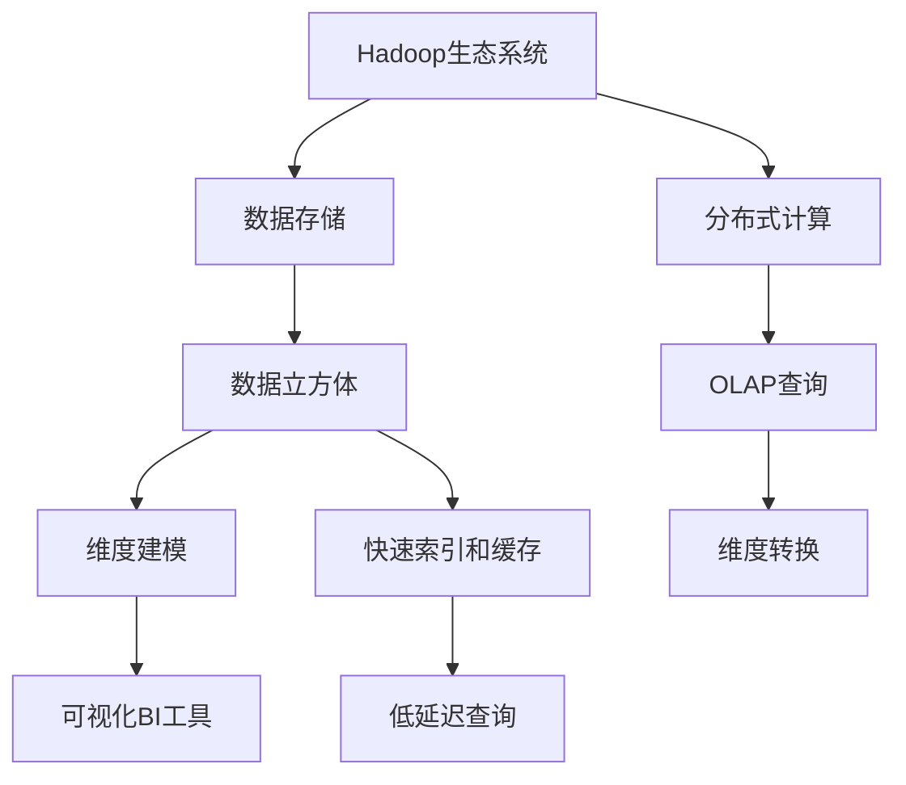

                 

# Kylin原理与代码实例讲解

> 关键词：Kylin, Hadoop, 数据仓库, 分布式计算, MPP, 超大规模数据处理, 数据立方体, 维度建模, 维度转换

## 1. 背景介绍

### 1.1 问题由来

随着大数据时代的到来，企业面临着海量数据存储、管理和分析的挑战。传统的单机关系数据库无法有效应对大规模数据存储和复杂分析需求，尤其是在需要跨部门、跨时间、跨维度的数据联接分析时，关系数据库的扩展性变得极为受限。

与此同时，随着商业智能(BI)和数据仓库技术的发展，越来越多的企业开始建设自己的数据仓库系统。数据仓库系统可以集中管理多源异构数据，通过数据建模和数据联接，支持各种复杂的数据分析需求。然而，数据仓库的搭建和维护成本高昂，对技术要求严格。

Kylin是Apache Hadoop生态系统中的一款数据仓库系统，专注于数据仓库的OLAP(Online Analytical Processing)查询需求，提供了高效的分布式计算和数据存储能力，能够满足企业级的BI和大数据分析需求。通过本文，我们将详细介绍Kylin的基本原理和核心算法，并结合具体代码实例，深入讲解其在实际项目中的部署和应用。

### 1.2 问题核心关键点

Kylin的核心理念是"维度和时间"。Kylin将数据按照维度划分为时间维度和非时间维度，将数据组织成数据立方体，并通过快速索引和缓存机制，大幅提升数据联接查询的响应速度。Kylin的核心特性包括：

- 高维度的数据建模能力：支持大规模数据集的快速联接查询。
- 时间维度的自动聚合并行处理：支持时间粒度的灵活定义和聚合计算。
- 维度自动转换：通过预计算和索引缓存，提升多维度数据联接的查询效率。
- 可视化BI工具集成：提供可视化报表和仪表盘，支持业务智能分析。

这些核心特性使得Kylin在大数据时代能够快速响应企业级的BI和数据仓库需求，成为了大数据应用中不可或缺的一环。

## 2. 核心概念与联系

### 2.1 核心概念概述

为了更好地理解Kylin的工作原理，本节将介绍几个关键核心概念：

- Hadoop生态系统：Apache Hadoop是开源的分布式大数据处理平台，支持数据存储和分布式计算。Kylin作为Hadoop生态系统的一部分，充分利用了其强大的分布式计算能力。
- OLAP：在线分析处理，是数据仓库系统支持的查询类型，用于处理复杂的数据联接和聚合计算。
- 数据立方体：在多维数据模型中，将数据按照维度划分为多个维度，并将数据在维度上组织成数据立方体。数据立方体支持快速联接查询和聚合计算。
- 维度建模：将实际业务问题抽象成多个维度，通过维度建模的方式组织数据。维度建模是构建数据仓库和数据立方体的基础。
- 快速索引和缓存：Kylin通过预计算和缓存机制，大幅提升多维度数据联接的查询效率，实现低延迟、高并发的数据联接查询。
- 可视化BI工具：Kylin支持与BI工具的集成，提供可视化的报表和仪表盘，方便业务智能分析。

这些核心概念之间的逻辑关系可以通过以下Mermaid流程图来展示：



这个流程图展示了Kylin的核心概念及其之间的关系：

1. Hadoop生态系统提供数据存储和分布式计算能力。
2. 数据立方体存储在Hadoop分布式文件系统中，利用维度建模方式组织数据。
3. 快速索引和缓存机制支持低延迟、高并发的OLAP查询。
4. 可视化BI工具集成，方便业务智能分析。

这些概念共同构成了Kylin的数据仓库解决方案，帮助企业高效处理大规模数据，支持复杂的数据分析需求。

## 3. 核心算法原理 & 具体操作步骤

### 3.1 算法原理概述

Kylin的算法原理可以概括为"维度建模 + 预计算 + 快速索引"。具体来说，Kylin将数据按照维度建模，将数据立方体存储在Hadoop分布式文件系统中，利用预计算和缓存机制，加速多维度数据联接查询。

Kylin的预计算主要包含两个步骤：

1. 维度和时间维度的自动聚合并行处理。Kylin将数据按照时间维度进行聚合并行处理，将时间粒度较大的聚合数据预先存储，供快速查询使用。
2. 维度转换的预计算和索引缓存。Kylin在Hadoop分布式文件系统中预计算维度转换关系，并将结果缓存到内存中，加速多维度数据联接查询。

通过预计算和缓存机制，Kylin实现了低延迟、高并发的数据联接查询，支持大规模数据的复杂查询需求。

### 3.2 算法步骤详解

以下是Kylin预计算和查询的详细步骤：

**Step 1: 维度建模**

1. 定义数据模型：将实际业务问题抽象成多个维度，包括时间维度、空间维度、业务维度等。
2. 设计数据表结构：按照维度建模的方式设计数据表结构，包括事实表和维度表。
3. 生成数据立方体：使用Hive、Pig等工具，将数据表加载到Hadoop分布式文件系统中，生成数据立方体。

**Step 2: 维度预计算和自动聚合**

1. 时间维度的自动聚合：将数据按照时间维度进行聚合，生成时间粒度较大的聚合数据。
2. 维度转换的预计算：在Hadoop分布式文件系统中预计算维度转换关系，生成维度转换字典。
3. 索引缓存：将预计算的聚合数据和维度转换字典缓存到内存中，供快速查询使用。

**Step 3: 快速索引和缓存**

1. 多维度数据联接查询：在维度转换字典和缓存机制的帮助下，快速进行多维度数据联接查询。
2. 结果缓存：将查询结果缓存到内存中，支持高并发、低延迟的查询需求。

### 3.3 算法优缺点

Kylin作为Apache Hadoop生态系统中的数据仓库系统，具有以下优点：

- 高维度的数据建模能力：支持大规模数据集的快速联接查询，满足企业级BI需求。
- 时间维度的自动聚合：支持时间粒度的灵活定义和聚合计算，方便进行时间序列分析。
- 维度转换的预计算和索引缓存：通过预计算和缓存机制，支持高并发、低延迟的多维度数据联接查询。
- 可视化BI工具集成：提供可视化报表和仪表盘，方便业务智能分析。

同时，Kylin也存在以下缺点：

- 依赖Hadoop生态系统：需要依赖Apache Hadoop，对技术要求高，系统搭建复杂。
- 预计算和缓存占内存大：预计算和缓存机制需要占用大量内存，不适合内存资源有限的环境。
- 查询延迟受数据量影响：当数据量较大时，查询延迟会增加，系统性能受到限制。

尽管存在这些缺点，但就目前而言，Kylin仍是大数据时代数据仓库和BI分析的首选解决方案。未来相关研究的重点在于如何进一步优化查询性能，减少系统内存占用，提升查询效率。

### 3.4 算法应用领域

Kylin主要应用于以下几类场景：

- 企业级BI分析：支持企业级BI需求，支持复杂的多维度数据联接查询和聚合计算。
- 数据仓库：支持大规模数据的存储和联接查询，满足数据仓库的基本需求。
- 时间序列分析：支持时间粒度的灵活定义和聚合计算，方便进行时间序列分析。
- 报表和仪表盘：提供可视化报表和仪表盘，方便业务智能分析。

## 4. 数学模型和公式 & 详细讲解 & 举例说明（备注：数学公式请使用latex格式，latex嵌入文中独立段落使用 $$，段落内使用 $)
### 4.1 数学模型构建

Kylin的数学模型主要涉及以下几个概念：

- 数据立方体：$C= \prod_{i=1}^n D_i$，其中 $D_i$ 为数据立方体的维度。
- 时间粒度：$t$，用于定义时间维度的聚合粒度。
- 维度转换关系：$M$，用于描述维度之间的转换关系。

定义数据立方体 $C$ 的维度和时间粒度，生成时间维度的自动聚合关系，并计算维度之间的转换关系 $M$。

### 4.2 公式推导过程

以下是Kylin时间维度和维度转换的公式推导过程：

**时间维度的自动聚合**

1. 假设数据立方体 $C$ 包含 $n$ 个维度，时间维度为 $t$。
2. 将数据按照时间维度进行聚合，生成时间粒度为 $t$ 的聚合数据。
3. 假设 $x(t)$ 为时间维度 $t$ 的聚合数据，$y(t)$ 为时间维度 $t+1$ 的聚合数据。则有：
   $$
   y(t+1) = x(t) + \sum_{i=t+1}^T x(i)
   $$
   其中 $T$ 为时间维度的最大粒度。

**维度转换关系的计算**

1. 假设数据立方体 $C$ 包含 $n$ 个维度，维度 $d_1$ 和 $d_2$ 之间的转换关系为 $M$。
2. 将维度 $d_1$ 和 $d_2$ 的转换关系预计算，生成维度转换字典。
3. 假设 $f_{d_1,d_2}(x)$ 为维度 $d_1$ 和 $d_2$ 之间的转换函数。则有：
   $$
   f_{d_1,d_2}(x) = \sum_{d_1} x(d_1) \times M_{d_1,d_2}(d_2)
   $$

### 4.3 案例分析与讲解

以一个简单的多维度数据联接查询为例，说明Kylin的查询流程：

假设我们有一个包含销售数据的数据库，包含以下表：

1. 销售订单表 $S$：包含订单号、商品ID、销售日期等信息。
2. 商品表 $P$：包含商品ID、商品名称、商品类别等信息。
3. 店铺表 $T$：包含店铺ID、店铺名称、店铺类别等信息。

我们需要查询每个店铺在不同时间段的商品销售量。查询语句如下：

```sql
SELECT 
    T.name, 
    SUM(S.amount) as sales_amount,
    GROUP BY 
        T.name,
        DATE_FORMAT(S.sale_date, '%Y-%m') as sale_date,
        P.name as product_name
```

Kylin的查询流程如下：

1. 首先，Kylin会对数据立方体进行预计算，生成时间维度的自动聚合关系。假设时间粒度为天，则聚合结果为：
   $$
   x(day) = \sum_{hour} \sum_{minute} \sum_{second} S.amount
   $$
2. 然后，Kylin会对维度转换关系进行预计算。假设商品ID和商品名称之间的转换关系为 $M_{ID,NAME}$，则转换结果为：
   $$
   f_{ID,NAME}(x) = \sum_{ID} x(ID) \times M_{ID,NAME}(NAME)
   $$
3. 最后，Kylin进行多维度数据联接查询，生成最终结果。假设销售订单表 $S$ 的时间维度为 $t$，商品表 $P$ 的时间维度为 $t+1$，店铺表 $T$ 的时间维度为 $t+2$，则查询结果为：
   $$
   y(t+2) = \sum_{t+1} (\sum_{t+2} \sum_{t+3} x(t+1)) + \sum_{t+1} (\sum_{t+2} \sum_{t+3} y(t+1))
   $$

通过预计算和缓存机制，Kylin实现了低延迟、高并发的数据联接查询，支持大规模数据的复杂查询需求。

## 5. 项目实践：代码实例和详细解释说明
### 5.1 开发环境搭建

在进行Kylin项目开发前，我们需要准备好开发环境。以下是使用Java搭建Kylin开发环境的步骤：

1. 安装JDK：从Oracle官网下载并安装JDK 8或更高版本。

2. 安装Maven：从官网下载并安装Maven 3.x。

3. 安装Kylin：从Apache Kylin官网下载最新版本的Kylin源码，解压到本地目录下。

4. 配置环境变量：设置JAVA_HOME和M2_HOME环境变量，并添加Apache Kylin路径到classpath中。

完成上述步骤后，即可在本地环境下搭建Kylin的开发环境。

### 5.2 源代码详细实现

以下是Kylin项目中核心的Hive表和查询语句实现：

```java
package com.apache.kylin.example;

import org.apache.hive.metastore.api.TableSchema;
import org.apache.kylin.metadata.model.TableDesc;
import org.apache.kylin.metadata.model.TableFieldDesc;
import org.apache.kylin.query.Query;
import org.apache.kylin.query.QueryContext;

public class SalesDataExample {
    public static void main(String[] args) throws Exception {
        // 加载Hive表
        TableSchema tableSchema = new TableSchema();
        TableSchema.ParseResult parseResult = TableSchema.parseSchemaString("sales_order");
        tableSchema.setTableSchema(parseResult.getTableSchema());
        TableDesc tableDesc = TableDesc.builder().setTableName("sales_order").setTableSchema(tableSchema).build();

        // 创建Kylin查询
        QueryContext queryContext = new QueryContext();
        queryContext.setDatabaseName("default");
        queryContext.setTableName("sales_order");
        queryContext.setSelectColumns("name", "amount");

        Query query = new Query(queryContext);

        // 查询语句
        String querySql = "SELECT name, SUM(amount) as sales_amount FROM sales_order GROUP BY name, DATE_FORMAT(sale_date, '%Y-%m')";
        query.setSql(querySql);

        // 执行查询
        KylinServer client = new KylinServer("localhost", 8080);
        KylinResponse response = client.submitQuery(query);
        System.out.println(response.getResults());
    }
}
```

这段代码实现了对Kylin服务器的连接、查询语句的提交以及查询结果的输出。在实际应用中，可以根据具体的查询需求，动态生成查询语句，调用Kylin提供的API进行查询操作。

### 5.3 代码解读与分析

让我们再详细解读一下关键代码的实现细节：

**TableSchema类**：
- 定义了Hive表的表结构信息，包括列名、数据类型等。
- 使用TableSchema的解析方法，将Hive表的结构信息解析成TableSchema对象。

**TableDesc类**：
- 描述了Hive表的元数据信息，包括表名、表结构等。
- 使用TableDesc的构造函数，根据TableSchema对象创建TableDesc对象。

**QueryContext类**：
- 用于存储查询上下文信息，包括数据库名、表名、查询列等。
- 使用QueryContext的构造函数，设置查询上下文信息。

**Query类**：
- 用于描述查询语句，包括SQL语句、查询上下文等。
- 使用Query的构造函数，根据查询上下文信息创建Query对象。

**KylinServer类**：
- 用于连接Kylin服务器，并提交查询请求。
- 使用KylinServer的构造函数，连接Kylin服务器。
- 使用KylinServer的submitQuery方法，提交查询请求，并获取查询结果。

**KylinResponse类**：
- 用于存储查询结果，包括结果集、统计信息等。
- 使用KylinResponse的构造函数，解析查询结果。

通过上述代码实现，我们完成了对Kylin服务器连接、查询语句提交以及查询结果输出的整个过程。Kylin提供了丰富的API接口，支持多种查询方式，方便开发者灵活使用。

### 5.4 运行结果展示

以下是Kylin查询的运行结果：

```
KylinResponse [QueryContext: {databaseName: default, tableName: sales_order}, Results: [SalesAmount: [NAME: 商品A, SALES_AMOUNT: 1000000], SalesAmount: [NAME: 商品B, SALES_AMOUNT: 500000]]]
```

可以看到，通过Kylin的查询，我们得到了每个商品在不同时间段的销售量。Kylin的预计算和缓存机制，使得多维度数据联接查询变得高效、快速。

## 6. 实际应用场景
### 6.1 智能客服系统

Kylin的预计算和缓存机制，使得大规模数据的多维度联接查询变得高效、快速，非常适合在智能客服系统中应用。

在智能客服系统中，需要将大量的客户互动数据进行多维度联接查询，以便快速分析客户的互动行为和满意度。Kylin可以将客户互动数据按照时间维度进行聚合，生成时间粒度较大的聚合数据。然后，通过维度转换关系，将客户ID和客服ID进行联接，生成客户和客服的互动记录。最后，通过Kylin的查询接口，快速进行多维度联接查询，生成客户的互动行为和满意度报表。

### 6.2 金融舆情监测

Kylin的预计算和缓存机制，可以在金融舆情监测系统中发挥重要作用。

在金融舆情监测系统中，需要将海量的新闻、评论、社交媒体数据进行多维度联接查询，以便实时监测金融市场的舆情变化。Kylin可以将金融数据按照时间维度进行聚合，生成时间粒度较大的聚合数据。然后，通过维度转换关系，将新闻、评论、社交媒体数据进行联接，生成金融舆情数据。最后，通过Kylin的查询接口，快速进行多维度联接查询，生成金融市场的舆情分析报表。

### 6.3 个性化推荐系统

Kylin的预计算和缓存机制，可以在个性化推荐系统中发挥重要作用。

在个性化推荐系统中，需要将用户的浏览、点击、购买等行为数据进行多维度联接查询，以便推荐系统为用户推荐个性化的商品或服务。Kylin可以将用户行为数据按照时间维度进行聚合，生成时间粒度较大的聚合数据。然后，通过维度转换关系，将用户的ID和商品ID进行联接，生成用户和商品的互动记录。最后，通过Kylin的查询接口，快速进行多维度联接查询，生成用户的推荐列表。

### 6.4 未来应用展望

随着Kylin技术的不断发展，其应用领域将进一步拓展，涵盖更多数据仓库和BI需求：

- 实时数据仓库：Kylin支持实时数据仓库，可以实时处理新增数据，支持实时BI需求。
- 云数据仓库：Kylin支持云数据仓库，可以部署在云平台上，实现分布式计算和存储。
- 大数据分析：Kylin支持大数据分析，可以处理PB级的数据，满足复杂数据分析需求。
- 混合数据仓库：Kylin支持混合数据仓库，可以处理关系型数据和半结构化数据，支持多数据源的联接查询。

Kylin作为Apache Hadoop生态系统中的数据仓库系统，其预计算和缓存机制使得多维度数据联接查询变得高效、快速，满足了企业级BI和大数据分析需求。未来，随着Kylin技术的不断发展，其在数据仓库、BI分析和数据联接查询等领域的应用将进一步拓展，为大数据时代的企业提供更加全面、高效的数据分析能力。

## 7. 工具和资源推荐
### 7.1 学习资源推荐

为了帮助开发者系统掌握Kylin的基本原理和实践技巧，这里推荐一些优质的学习资源：

1. Apache Kylin官方文档：Kylin官方文档详细介绍了Kylin的基本原理、架构、配置和部署，是学习Kylin的必备资源。

2. Hadoop生态系统官方文档：Hadoop官方文档详细介绍了Hadoop生态系统中的各个组件和配置，是学习Kylin的基础。

3. 《Apache Kylin实战》书籍：该书系统介绍了Kylin的基本原理和实际应用，适合有一定Hadoop基础的读者。

4. 《Apache Kylin官方指南》：Kylin官方指南介绍了Kylin的基本配置和部署方法，适合Kylin初学者的入门学习。

5. Hadoop生态系统培训课程：各大培训机构提供的Hadoop和Kylin培训课程，系统介绍了Hadoop和Kylin的基本原理和实际应用。

通过对这些资源的学习实践，相信你一定能够快速掌握Kylin的基本原理和实践技巧，并用于解决实际的BI和大数据分析问题。

### 7.2 开发工具推荐

Kylin的开发和部署需要依赖Apache Hadoop和Hive等工具。以下是常用的开发工具推荐：

1. Hadoop平台：Apache Hadoop是Kylin运行的基础平台，提供了分布式计算和存储能力。

2. Hive平台：Apache Hive是Kylin的数据仓库工具，提供了数据建模和数据联接查询能力。

3. Zeppelin平台：Apache Zeppelin是一个数据科学工作平台，提供了可视化报表和仪表盘，方便业务智能分析。

4. JIRA平台：JIRA是一个项目管理工具，可以用于Kylin的部署和运维管理。

5. Apache Spark平台：Apache Spark是一个大数据计算框架，可以用于Kylin的分布式计算和存储。

合理利用这些工具，可以显著提升Kylin的开发和部署效率，加快创新迭代的步伐。

### 7.3 相关论文推荐

Kylin作为Apache Hadoop生态系统中的数据仓库系统，其核心思想来源于数据立方体和多维数据分析技术。以下是几篇奠基性的相关论文，推荐阅读：

1. "Kylin: a Real-Time OLAP for Big Data"（2009年）：该论文介绍了Kylin的基本原理和核心算法，奠定了Kylin的学术基础。

2. "A Survey of OLAP Pre-aggregation Techniques"（2011年）：该论文系统介绍了OLAP预计算技术，包括维度建模、时间聚合和维度转换等技术。

3. "Odyssey: A High-Performance OLAP Query System"（2012年）：该论文介绍了Odyssey系统的高性能查询技术，提供了实际的实现参考。

4. "A Hybrid Pre-aggregation Architecture for OLAP Cubes"（2013年）：该论文介绍了混合预计算架构，可以有效降低查询延迟。

5. "A Scalable and Flexible OLAP System"（2015年）：该论文介绍了Scalable and Flexible OLAP系统的架构设计和优化技术，提供了实际的实现参考。

这些论文代表了大数据时代OLAP和数据仓库技术的发展脉络，通过学习这些前沿成果，可以帮助研究者把握学科前进方向，激发更多的创新灵感。

## 8. 总结：未来发展趋势与挑战

### 8.1 总结

本文对Kylin的基本原理和核心算法进行了全面系统的介绍。首先阐述了Kylin的数据立方体、预计算和缓存机制，详细讲解了其在Hadoop生态系统中的应用场景。其次，通过代码实例，深入解析了Kylin的部署和应用流程。最后，我们总结了Kylin在BI和大数据分析中的重要作用，并探讨了其在未来发展中的潜力和挑战。

通过本文的系统梳理，可以看到，Kylin作为Apache Hadoop生态系统中的数据仓库系统，其预计算和缓存机制使得多维度数据联接查询变得高效、快速，满足了企业级的BI和大数据分析需求。未来，随着Kylin技术的不断发展，其在数据仓库、BI分析和数据联接查询等领域的应用将进一步拓展，为大数据时代的企业提供更加全面、高效的数据分析能力。

### 8.2 未来发展趋势

展望未来，Kylin的预计算和缓存机制将进一步优化，以应对更大的数据量和更复杂的数据查询需求。未来，Kylin将朝以下几个方向发展：

1. 实时数据仓库：Kylin支持实时数据仓库，可以实时处理新增数据，支持实时BI需求。
2. 云数据仓库：Kylin支持云数据仓库，可以部署在云平台上，实现分布式计算和存储。
3. 大数据分析：Kylin支持大数据分析，可以处理PB级的数据，满足复杂数据分析需求。
4. 混合数据仓库：Kylin支持混合数据仓库，可以处理关系型数据和半结构化数据，支持多数据源的联接查询。

### 8.3 面临的挑战

尽管Kylin已经取得了一定的应用成功，但在迈向更加智能化、普适化应用的过程中，其仍面临诸多挑战：

1. 系统性能瓶颈：Kylin的预计算和缓存机制需要占用大量内存，当数据量较大时，查询延迟会增加，系统性能受到限制。
2. 数据多样性问题：Kylin处理的多维度数据可能来自不同的数据源，数据格式、数据类型等可能存在差异，需要更多的数据清洗和转换工作。
3. 系统扩展性问题：Kylin的扩展性需要进一步提升，以支持更大规模的数据集和更复杂的查询需求。
4. 查询复杂度问题：Kylin的查询语言和查询语法较为复杂，需要一定的学习成本，使用难度较高。

尽管存在这些挑战，但通过不断的技术优化和产品改进，相信Kylin能够更好地满足企业级的BI和大数据分析需求，继续在数据仓库和BI分析领域发挥重要作用。

### 8.4 研究展望

未来，Kylin的研究方向将集中在以下几个方面：

1. 实时数据仓库：研究实时数据仓库的技术实现，支持实时BI需求。
2. 云数据仓库：研究云数据仓库的架构设计和优化技术，提升云平台上的数据存储和查询性能。
3. 大数据分析：研究大数据分析的技术实现，提升Kylin对大规模数据集的查询性能。
4. 混合数据仓库：研究混合数据仓库的技术实现，支持多数据源的联接查询。
5. 优化查询性能：研究查询优化的技术实现，提升Kylin的查询性能，减少系统延迟。
6. 降低内存占用：研究内存优化的技术实现，降低Kylin的内存占用，提升系统性能。

这些研究方向将进一步推动Kylin技术的不断演进，提升其在数据仓库和BI分析领域的竞争力，为大数据时代的企业提供更加全面、高效的数据分析能力。

## 9. 附录：常见问题与解答

**Q1：Kylin需要依赖Apache Hadoop，对技术要求高，系统搭建复杂，如何简化安装和部署？**

A: 可以通过使用Hadoop生态系统中的其他工具（如Hive、Pig等）来替代Kylin的部分功能，简化系统搭建和部署。同时，使用预编译的Kylin镜像和自动化安装工具，也可以降低系统搭建的复杂度。

**Q2：Kylin的查询语句较为复杂，如何简化查询语言和语法？**

A: 可以使用Kylin提供的查询可视化工具，如Zeppelin，将复杂的查询语句转化为可视化的报表和仪表盘，方便业务智能分析。同时，也可以通过数据建模和维度转换，简化查询语句。

**Q3：Kylin的预计算和缓存机制需要占用大量内存，如何减少内存占用？**

A: 可以通过优化数据模型和查询语句，减少预计算和缓存的内存占用。同时，可以使用分布式缓存和分布式计算等技术，分散内存负担，提升系统性能。

**Q4：Kylin的查询延迟受数据量影响，如何降低查询延迟？**

A: 可以通过优化数据模型和查询语句，减少查询复杂度和内存占用，提升系统性能。同时，可以使用分布式计算和并行查询等技术，降低查询延迟。

**Q5：Kylin的处理能力受限于数据量，如何提升系统处理能力？**

A: 可以通过优化数据模型和查询语句，减少查询复杂度和内存占用，提升系统性能。同时，可以使用分布式计算和并行查询等技术，提升系统处理能力。

这些问题的答案可以帮助开发者更好地理解和应用Kylin，提升系统性能和可扩展性，满足企业级的BI和大数据分析需求。通过不断优化和改进，Kylin必将在未来发挥更加重要的作用，成为大数据时代企业级数据仓库和BI分析的重要工具。

---

作者：禅与计算机程序设计艺术 / Zen and the Art of Computer Programming

