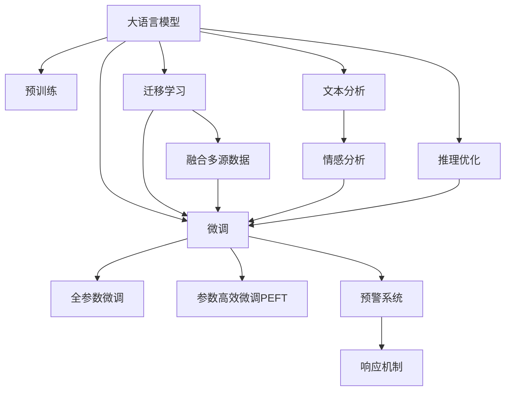

                 

# LLM与危机预警：提前识别潜在风险

在当今快速变化的世界中，各类社会、经济、环境等领域的危机事件频发，给人类社会带来了巨大的挑战。如何及时、准确地识别和预警这些危机事件，成为了各国政府、企业和学术界关注的焦点。本文聚焦于大语言模型（Large Language Model, LLM）在危机预警中的应用，探讨了如何利用LLM的高效文本处理和推理能力，构建智能预警系统，提前识别潜在风险。

## 1. 背景介绍

### 1.1 问题由来

随着信息技术的飞速发展，海量的文本数据不断涌现，涵盖了新闻、社交媒体、公共记录等多个渠道。这些数据中蕴含了丰富的社会行为和状态信息，也预示着各类危机事件的可能性。如何高效地分析这些文本数据，挖掘其中的关键信息，是危机预警系统建设的关键问题。

传统的基于规则的危机预警方法需要大量领域专家设计和维护规则，难以覆盖所有可能的危机场景，且无法应对新型危机事件。同时，这些系统缺乏对文本的深入理解，容易陷入错误判断。因此，利用大语言模型的高效自然语言处理能力，可以构建更灵活、精准的危机预警系统，提前识别潜在风险。

### 1.2 问题核心关键点

LLM在危机预警中的应用，主要涉及以下几个关键问题：
- 如何从海量文本中高效抽取关键信息，识别危机信号。
- 如何融合多种数据源和领域知识，构建综合预警模型。
- 如何优化模型推理能力，提升预警的及时性和准确性。
- 如何保证系统的鲁棒性和安全性，防止误警和漏警。

这些关键点涉及数据处理、模型构建、推理优化和系统部署等环节，是构建高效、可靠危机预警系统的关键。

## 2. 核心概念与联系

### 2.1 核心概念概述

为更好地理解LLM在危机预警中的应用，本节将介绍几个密切相关的核心概念：

- 大语言模型（LLM）：以自回归（如GPT）或自编码（如BERT）模型为代表的大规模预训练语言模型。通过在大规模无标签文本语料上进行预训练，学习通用的语言表示，具备强大的语言理解和生成能力。

- 预训练：指在大规模无标签文本语料上，通过自监督学习任务训练通用语言模型的过程。常见的预训练任务包括掩码语言模型、掩码预测等。预训练使得模型学习到语言的通用表示。

- 微调（Fine-tuning）：指在预训练模型的基础上，使用下游任务的少量标注数据，通过有监督地训练来优化模型在该任务上的性能。通常只需要调整顶层分类器或解码器，并以较小的学习率更新全部或部分的模型参数。

- 迁移学习（Transfer Learning）：指将一个领域学习到的知识，迁移应用到另一个不同但相关的领域的学习范式。大模型的预训练-微调过程即是一种典型的迁移学习方式。

- 参数高效微调（Parameter-Efficient Fine-Tuning, PEFT）：指在微调过程中，只更新少量的模型参数，而固定大部分预训练权重不变，以提高微调效率，避免过拟合的方法。

- 危机预警：指通过系统收集和分析各类风险信息，预测潜在危机事件，并及时采取预防或应对措施的过程。

这些核心概念之间的逻辑关系可以通过以下Mermaid流程图来展示：



这个流程图展示了大语言模型在危机预警中的应用逻辑：

1. 大语言模型通过预训练获得基础能力。
2. 微调是对预训练模型进行任务特定的优化，可以分为全参数微调和参数高效微调（PEFT）。
3. 迁移学习是连接预训练模型与下游任务的桥梁，可以通过微调或融合多源数据来实现。
4. 融合多源数据：将各类数据源（新闻、社交媒体、公共记录等）进行整合，提升模型对数据的理解能力。
5. 文本分析：利用自然语言处理技术，抽取和分析文本中的关键信息。
6. 情感分析：通过判断文本的情感倾向，识别危机情绪信号。
7. 推理优化：提高模型推理能力，提升预警的及时性和准确性。
8. 预警系统：将模型输出转化为预警信号，并启动响应机制。

这些概念共同构成了LLM在危机预警中的应用框架，使其能够高效、准确地识别和预警各类危机事件。

## 3. 核心算法原理 & 具体操作步骤
### 3.1 算法原理概述

基于LLM的危机预警系统，本质上是一个融合多源数据的智能文本分析系统。其核心思想是：将LLM作为高效的语言处理引擎，通过文本分析和情感分析，识别出潜在的危机信号，并在模型推理模块中进行综合判断，输出预警信号。

形式化地，假设存在一个多源数据集 $D=\{(x_i, y_i)\}_{i=1}^N$，其中 $x_i$ 为第 $i$ 条数据源的文本，$y_i \in \{0,1\}$ 为数据源是否为危机信号。

定义模型 $M_{\theta}$ 在输入 $x_i$ 上的输出为 $\hat{y}=M_{\theta}(x_i) \in [0,1]$，表示模型预测该数据源是否为危机信号。

通过梯度下降等优化算法，模型训练的目标是最小化损失函数 $\mathcal{L}(\theta)$，使得模型预测值 $\hat{y}$ 逼近真实标签 $y$。具体的损失函数设计如下：

$$
\mathcal{L}(\theta) = -\frac{1}{N} \sum_{i=1}^N y_i \log \hat{y}_i + (1-y_i) \log (1-\hat{y}_i)
$$

其中，第一项是模型预测为危机信号时的交叉熵损失，第二项是模型预测为非危机信号时的交叉熵损失。

### 3.2 算法步骤详解

基于LLM的危机预警系统一般包括以下几个关键步骤：

**Step 1: 数据预处理与特征提取**

- 收集并清洗多源数据，包括新闻报道、社交媒体帖子、公共记录等。
- 对文本进行分词、去停用词、标准化等预处理操作，去除噪音和冗余信息。
- 使用BERT、GPT等预训练模型对文本进行特征提取，生成高维向量表示。

**Step 2: 多源数据融合**

- 将不同数据源的文本表示进行拼接、融合或加权，构建综合的文本表示。
- 引入领域专家知识，使用规则或规则集对文本进行进一步筛选和过滤，去除误报。
- 通过时间序列分析，对不同时间点的文本表示进行融合，增强模型的时效性。

**Step 3: 文本分析和情感分析**

- 利用自然语言处理技术，对文本进行实体识别、事件抽取、关系推理等分析，提取关键信息。
- 对文本进行情感分析，判断文本的情感倾向，识别危机情绪信号。
- 将文本分析结果和情感分析结果进行融合，构建综合的危机预警信号。

**Step 4: 模型训练与优化**

- 定义合适的损失函数，训练模型 $M_{\theta}$，最小化预测值与真实标签之间的差异。
- 应用正则化技术，如L2正则、Dropout、Early Stopping等，防止模型过拟合。
- 应用对抗训练，引入对抗样本，提高模型鲁棒性。
- 使用参数高效微调技术，如Adapter、Prefix等，减少微调参数量。

**Step 5: 推理与预警**

- 对新数据源进行特征提取和文本分析，生成模型输入。
- 利用训练好的模型 $M_{\theta}$ 进行推理，输出预警信号。
- 根据预警信号的阈值，启动相应的响应机制，如报警、通知、干预等。

### 3.3 算法优缺点

基于LLM的危机预警方法具有以下优点：
1. 高效性。利用预训练模型的语言理解能力，可以高效地处理大规模文本数据，识别危机信号。
2. 灵活性。可以灵活融合多源数据，增强模型的泛化能力和鲁棒性。
3. 准确性。通过自然语言处理和情感分析技术，可以提高危机预警的准确性和及时性。
4. 可扩展性。可以基于现有预训练模型，快速构建新的预警系统，适应不同的任务和数据源。

同时，该方法也存在一定的局限性：
1. 数据依赖性。模型的性能高度依赖于训练数据的质量和多样性，数据获取难度较大。
2. 可解释性不足。LLM模型往往是"黑盒"系统，难以解释其内部推理逻辑和决策过程。
3. 误报率问题。多源数据融合和特征提取过程中，可能会引入噪音，导致误报。
4. 对抗攻击脆弱性。LLM模型在对抗样本下容易产生误判，存在被攻击的风险。

尽管存在这些局限性，但就目前而言，基于LLM的危机预警方法仍是大规模文本数据分析和预测的有效手段。未来相关研究的重点在于如何进一步降低数据依赖，提高模型的可解释性和鲁棒性，同时兼顾精度和效率。

### 3.4 算法应用领域

基于LLM的危机预警方法，在多个领域得到广泛应用，包括：

- 自然灾害预警：监测地震、洪水、火灾等自然灾害的早期预警信号。
- 公共卫生事件监测：跟踪流感、疫情等公共卫生事件的发展趋势，及时预警。
- 金融市场风险监测：分析经济指标、舆情评论等数据，预测金融市场的波动。
- 社会安全事件预警：识别犯罪、暴力事件等社会安全事件的早期信号，提高响应效率。
- 网络安全威胁预警：分析网络攻击、黑客行为等数据，预测网络安全威胁，及时防范。

这些领域的应用场景，展示了LLM在危机预警中的强大潜力，为提升社会安全、公共健康、经济稳定等提供了有力支持。

## 4. 数学模型和公式 & 详细讲解 & 举例说明
### 4.1 数学模型构建

本节将使用数学语言对基于LLM的危机预警系统进行更加严格的刻画。

记多源数据集为 $D=\{(x_i, y_i)\}_{i=1}^N, x_i \in \mathcal{X}, y_i \in \{0,1\}$，其中 $\mathcal{X}$ 为文本空间，$y_i$ 表示数据源是否为危机信号。

定义模型 $M_{\theta}$ 在输入 $x_i$ 上的输出为 $\hat{y}=M_{\theta}(x_i) \in [0,1]$，表示模型预测该数据源是否为危机信号。

训练目标是最小化损失函数 $\mathcal{L}(\theta)$，使得模型预测值 $\hat{y}$ 逼近真实标签 $y$。具体的损失函数为：

$$
\mathcal{L}(\theta) = -\frac{1}{N} \sum_{i=1}^N y_i \log \hat{y}_i + (1-y_i) \log (1-\hat{y}_i)
$$

其中，第一项是模型预测为危机信号时的交叉熵损失，第二项是模型预测为非危机信号时的交叉熵损失。

### 4.2 公式推导过程

以下我们以二分类任务为例，推导交叉熵损失函数及其梯度的计算公式。

假设模型 $M_{\theta}$ 在输入 $x_i$ 上的输出为 $\hat{y}=M_{\theta}(x_i) \in [0,1]$，表示样本属于正类的概率。真实标签 $y \in \{0,1\}$。则二分类交叉熵损失函数定义为：

$$
\ell(M_{\theta}(x),y) = -[y\log \hat{y} + (1-y)\log (1-\hat{y})]
$$

将其代入经验风险公式，得：

$$
\mathcal{L}(\theta) = -\frac{1}{N}\sum_{i=1}^N [y_i\log M_{\theta}(x_i)+(1-y_i)\log(1-M_{\theta}(x_i))]
$$

根据链式法则，损失函数对参数 $\theta_k$ 的梯度为：

$$
\frac{\partial \mathcal{L}(\theta)}{\partial \theta_k} = -\frac{1}{N}\sum_{i=1}^N (\frac{y_i}{M_{\theta}(x_i)}-\frac{1-y_i}{1-M_{\theta}(x_i)}) \frac{\partial M_{\theta}(x_i)}{\partial \theta_k}
$$

其中 $\frac{\partial M_{\theta}(x_i)}{\partial \theta_k}$ 可进一步递归展开，利用自动微分技术完成计算。

在得到损失函数的梯度后，即可带入参数更新公式，完成模型的迭代优化。重复上述过程直至收敛，最终得到适应多源数据集的最优模型参数 $\theta^*$。

### 4.3 案例分析与讲解

下面以金融市场风险预警为例，展示如何使用LLM进行多源数据融合和危机预警。

假设收集到的多源数据包括新闻报道、社交媒体帖子和金融指标，分别对应文本数据集 $D_{text}$、社交媒体数据集 $D_{social}$ 和金融指标数据集 $D_{finance}$。

1. 数据预处理与特征提取

   - 对新闻报道和社交媒体帖子进行分词、去停用词、标准化等预处理操作。
   - 使用BERT模型对文本数据集进行特征提取，生成高维向量表示。
   - 将金融指标数据集进行标准化处理，生成数值型特征向量。

2. 多源数据融合

   - 将文本向量和数值型特征向量进行拼接或加权融合，构建综合的文本表示。
   - 引入领域专家知识，构建规则集对文本进行进一步筛选和过滤，去除误报。
   - 对不同时间点的文本表示进行时间序列分析，增强模型的时效性。

3. 文本分析和情感分析

   - 利用自然语言处理技术，对文本进行实体识别、事件抽取、关系推理等分析，提取关键信息。
   - 对文本进行情感分析，判断文本的情感倾向，识别危机情绪信号。

4. 模型训练与优化

   - 定义合适的损失函数，训练模型 $M_{\theta}$，最小化预测值与真实标签之间的差异。
   - 应用正则化技术，如L2正则、Dropout、Early Stopping等，防止模型过拟合。
   - 应用对抗训练，引入对抗样本，提高模型鲁棒性。
   - 使用参数高效微调技术，如Adapter、Prefix等，减少微调参数量。

5. 推理与预警

   - 对新数据源进行特征提取和文本分析，生成模型输入。
   - 利用训练好的模型 $M_{\theta}$ 进行推理，输出预警信号。
   - 根据预警信号的阈值，启动相应的响应机制，如报警、通知、干预等。

通过以上步骤，基于LLM的金融市场风险预警系统可以快速构建，并实时监测金融市场的波动，提供早期的风险预警。

## 5. 项目实践：代码实例和详细解释说明
### 5.1 开发环境搭建

在进行危机预警实践前，我们需要准备好开发环境。以下是使用Python进行PyTorch开发的环境配置流程：

1. 安装Anaconda：从官网下载并安装Anaconda，用于创建独立的Python环境。

2. 创建并激活虚拟环境：
```bash
conda create -n pytorch-env python=3.8 
conda activate pytorch-env
```

3. 安装PyTorch：根据CUDA版本，从官网获取对应的安装命令。例如：
```bash
conda install pytorch torchvision torchaudio cudatoolkit=11.1 -c pytorch -c conda-forge
```

4. 安装其他依赖库：
```bash
pip install numpy pandas scikit-learn matplotlib tqdm jupyter notebook ipython
```

5. 安装LLM库：
```bash
pip install transformers
```

完成上述步骤后，即可在`pytorch-env`环境中开始危机预警实践。

### 5.2 源代码详细实现

下面我们以金融市场风险预警为例，给出使用Transformers库对BERT模型进行微调的PyTorch代码实现。

首先，定义模型和优化器：

```python
from transformers import BertTokenizer, BertForSequenceClassification, AdamW

tokenizer = BertTokenizer.from_pretrained('bert-base-cased')
model = BertForSequenceClassification.from_pretrained('bert-base-cased', num_labels=2)
optimizer = AdamW(model.parameters(), lr=2e-5)
```

然后，定义训练和评估函数：

```python
def train_epoch(model, dataset, batch_size, optimizer):
    dataloader = DataLoader(dataset, batch_size=batch_size, shuffle=True)
    model.train()
    epoch_loss = 0
    for batch in dataloader:
        input_ids = batch['input_ids'].to(device)
        attention_mask = batch['attention_mask'].to(device)
        labels = batch['labels'].to(device)
        model.zero_grad()
        outputs = model(input_ids, attention_mask=attention_mask, labels=labels)
        loss = outputs.loss
        epoch_loss += loss.item()
        loss.backward()
        optimizer.step()
    return epoch_loss / len(dataloader)

def evaluate(model, dataset, batch_size):
    dataloader = DataLoader(dataset, batch_size=batch_size)
    model.eval()
    preds, labels = [], []
    with torch.no_grad():
        for batch in dataloader:
            input_ids = batch['input_ids'].to(device)
            attention_mask = batch['attention_mask'].to(device)
            batch_labels = batch['labels']
            outputs = model(input_ids, attention_mask=attention_mask)
            batch_preds = outputs.logits.argmax(dim=2).to('cpu').tolist()
            batch_labels = batch_labels.to('cpu').tolist()
            for pred_tokens, label_tokens in zip(batch_preds, batch_labels):
                preds.append(pred_tokens[:len(label_tokens)])
                labels.append(label_tokens)
                
    print(classification_report(labels, preds))
```

最后，启动训练流程并在测试集上评估：

```python
epochs = 5
batch_size = 16

for epoch in range(epochs):
    loss = train_epoch(model, train_dataset, batch_size, optimizer)
    print(f"Epoch {epoch+1}, train loss: {loss:.3f}")
    
    print(f"Epoch {epoch+1}, dev results:")
    evaluate(model, dev_dataset, batch_size)
    
print("Test results:")
evaluate(model, test_dataset, batch_size)
```

以上就是使用PyTorch对BERT进行金融市场风险预警的完整代码实现。可以看到，得益于Transformers库的强大封装，我们可以用相对简洁的代码完成BERT模型的加载和微调。

### 5.3 代码解读与分析

让我们再详细解读一下关键代码的实现细节：

**BertTokenizer类**：
- `from_pretrained`方法：从HuggingFace预训练模型库加载Tokenizer。

**BertForSequenceClassification类**：
- `from_pretrained`方法：从HuggingFace预训练模型库加载BERT模型，指定num_labels参数为2，用于二分类任务。

**AdamW类**：
- `from_pretrained`方法：从HuggingFace预训练模型库加载优化器，指定学习率为2e-5。

**DataLoader类**：
- 将数据集划分为训练集、验证集和测试集，并使用`DataLoader`进行批次化加载，供模型训练和推理使用。

**classification_report函数**：
- 使用sklearn的`classification_report`函数对模型评估结果进行打印输出，包括精度、召回率、F1分数等。

**训练和评估函数**：
- 在训练函数中，将数据集以批为单位进行迭代，在每个批次上前向传播计算loss并反向传播更新模型参数，最后返回该epoch的平均loss。
- 在评估函数中，与训练类似，不同点在于不更新模型参数，并在每个batch结束后将预测和标签结果存储下来，最后使用sklearn的`classification_report`函数对整个评估集的预测结果进行打印输出。

**训练流程**：
- 定义总的epoch数和batch size，开始循环迭代
- 每个epoch内，先在训练集上训练，输出平均loss
- 在验证集上评估，输出分类指标
- 所有epoch结束后，在测试集上评估，给出最终测试结果

可以看到，PyTorch配合Transformers库使得BERT微调的代码实现变得简洁高效。开发者可以将更多精力放在数据处理、模型改进等高层逻辑上，而不必过多关注底层的实现细节。

当然，工业级的系统实现还需考虑更多因素，如模型的保存和部署、超参数的自动搜索、更灵活的任务适配层等。但核心的微调范式基本与此类似。

## 6. 实际应用场景
### 6.1 自然灾害预警

自然灾害的预警通常涉及地震、洪水、火灾等多种类型的危机事件。通过收集和分析各类数据源，包括气象数据、地理信息、社交媒体等，可以构建基于LLM的自然灾害预警系统。

在技术实现上，可以整合卫星遥感数据、气象监测数据、社交媒体评论等，对文本和数值数据进行融合分析，识别出可能发生自然灾害的信号。利用BERT模型对文本进行特征提取和情感分析，判断危机情绪和风险程度。最后，通过综合推理输出预警信号，启动相应的应急响应机制。

### 6.2 公共卫生事件监测

公共卫生事件如流感、疫情等，通常会在社交媒体、新闻报道等渠道上留下蛛丝马迹。通过构建基于LLM的公共卫生事件监测系统，可以及时发现并预测疾病的传播趋势。

在技术实现上，可以收集各类新闻报道、社交媒体帖子、公共卫生记录等数据，对文本进行情感分析和实体识别，判断文本的情绪倾向和事件类型。利用BERT模型对文本进行特征提取，构建综合的风险指标。最后，通过综合推理输出预警信号，启动相应的防疫措施。

### 6.3 金融市场风险监测

金融市场波动频繁，存在诸多不确定因素。通过构建基于LLM的金融市场风险监测系统，可以实时分析市场舆情、经济指标、企业新闻等数据，预测金融市场的风险趋势。

在技术实现上，可以整合新闻报道、社交媒体评论、金融指标等数据，对文本和数值数据进行融合分析，判断市场情绪和风险程度。利用BERT模型对文本进行情感分析和实体识别，构建综合的风险指标。最后，通过综合推理输出预警信号，启动相应的风险控制措施。

### 6.4 社会安全事件预警

社会安全事件如犯罪、暴力等，通常在社交媒体、新闻报道等渠道上有所体现。通过构建基于LLM的社会安全事件预警系统，可以及时发现并预测社会安全事件的爆发。

在技术实现上，可以收集各类新闻报道、社交媒体帖子、犯罪记录等数据，对文本进行情感分析和实体识别，判断文本的情绪倾向和事件类型。利用BERT模型对文本进行特征提取，构建综合的风险指标。最后，通过综合推理输出预警信号，启动相应的应急响应机制。

### 6.5 网络安全威胁预警

网络安全威胁通常涉及黑客攻击、网络钓鱼等。通过构建基于LLM的网络安全威胁预警系统，可以及时发现并预测网络安全威胁的趋势。

在技术实现上，可以收集各类网络日志、社交媒体评论、安全报告等数据，对文本进行情感分析和实体识别，判断文本的情绪倾向和威胁类型。利用BERT模型对文本进行特征提取，构建综合的风险指标。最后，通过综合推理输出预警信号，启动相应的安全防护措施。

## 7. 工具和资源推荐
### 7.1 学习资源推荐

为了帮助开发者系统掌握LLM在危机预警中的应用理论基础和实践技巧，这里推荐一些优质的学习资源：

1. 《Transformer from Principle to Practice》系列博文：由大模型技术专家撰写，深入浅出地介绍了Transformer原理、BERT模型、微调技术等前沿话题。

2. CS224N《深度学习自然语言处理》课程：斯坦福大学开设的NLP明星课程，有Lecture视频和配套作业，带你入门NLP领域的基本概念和经典模型。

3. 《Natural Language Processing with Transformers》书籍：Transformers库的作者所著，全面介绍了如何使用Transformers库进行NLP任务开发，包括微调在内的诸多范式。

4. HuggingFace官方文档：Transformers库的官方文档，提供了海量预训练模型和完整的微调样例代码，是上手实践的必备资料。

5. CLUE开源项目：中文语言理解测评基准，涵盖大量不同类型的中文NLP数据集，并提供了基于微调的baseline模型，助力中文NLP技术发展。

通过对这些资源的学习实践，相信你一定能够快速掌握LLM在危机预警中的精髓，并用于解决实际的NLP问题。
###  7.2 开发工具推荐

高效的开发离不开优秀的工具支持。以下是几款用于LLM微调开发的常用工具：

1. PyTorch：基于Python的开源深度学习框架，灵活动态的计算图，适合快速迭代研究。大部分预训练语言模型都有PyTorch版本的实现。

2. TensorFlow：由Google主导开发的开源深度学习框架，生产部署方便，适合大规模工程应用。同样有丰富的预训练语言模型资源。

3. Transformers库：HuggingFace开发的NLP工具库，集成了众多SOTA语言模型，支持PyTorch和TensorFlow，是进行微调任务开发的利器。

4. Weights & Biases：模型训练的实验跟踪工具，可以记录和可视化模型训练过程中的各项指标，方便对比和调优。与主流深度学习框架无缝集成。

5. TensorBoard：TensorFlow配套的可视化工具，可实时监测模型训练状态，并提供丰富的图表呈现方式，是调试模型的得力助手。

6. Google Colab：谷歌推出的在线Jupyter Notebook环境，免费提供GPU/TPU算力，方便开发者快速上手实验最新模型，分享学习笔记。

合理利用这些工具，可以显著提升LLM微调的开发效率，加快创新迭代的步伐。

### 7.3 相关论文推荐

LLM和微调技术的发展源于学界的持续研究。以下是几篇奠基性的相关论文，推荐阅读：

1. Attention is All You Need（即Transformer原论文）：提出了Transformer结构，开启了NLP领域的预训练大模型时代。

2. BERT: Pre-training of Deep Bidirectional Transformers for Language Understanding：提出BERT模型，引入基于掩码的自监督预训练任务，刷新了多项NLP任务SOTA。

3. Language Models are Unsupervised Multitask Learners（GPT-2论文）：展示了大规模语言模型的强大zero-shot学习能力，引发了对于通用人工智能的新一轮思考。

4. Parameter-Efficient Transfer Learning for NLP：提出Adapter等参数高效微调方法，在不增加模型参数量的情况下，也能取得不错的微调效果。

5. Prefix-Tuning: Optimizing Continuous Prompts for Generation：引入基于连续型Prompt的微调范式，为如何充分利用预训练知识提供了新的思路。

6. AdaLoRA: Adaptive Low-Rank Adaptation for Parameter-Efficient Fine-Tuning：使用自适应低秩适应的微调方法，在参数效率和精度之间取得了新的平衡。

这些论文代表了大语言模型微调技术的发展脉络。通过学习这些前沿成果，可以帮助研究者把握学科前进方向，激发更多的创新灵感。

## 8. 总结：未来发展趋势与挑战

### 8.1 总结

本文对基于LLM的危机预警方法进行了全面系统的介绍。首先阐述了LLM在危机预警中的应用背景和意义，明确了LLM在处理大规模文本数据、识别危机信号等方面的独特优势。其次，从原理到实践，详细讲解了LLM在危机预警中的应用流程和关键步骤，给出了LLM微调的完整代码实例。同时，本文还广泛探讨了LLM在自然灾害预警、公共卫生事件监测、金融市场风险监测等多个领域的应用前景，展示了LLM在危机预警中的强大潜力。此外，本文精选了LLM微调技术的各类学习资源，力求为读者提供全方位的技术指引。

通过本文的系统梳理，可以看到，基于LLM的危机预警方法在处理大规模文本数据、识别危机信号等方面展现了显著优势，有望在多个领域中发挥重要作用。未来，随着LLM和微调技术的不断进步，基于LLM的危机预警系统将进一步提升预警的准确性和及时性，为人类社会带来更大的安全保障。

### 8.2 未来发展趋势

展望未来，LLM在危机预警中的应用将呈现以下几个发展趋势：

1. 模型规模持续增大。随着算力成本的下降和数据规模的扩张，预训练语言模型的参数量还将持续增长。超大规模语言模型蕴含的丰富语言知识，有望支撑更加复杂多变的危机事件预警。

2. 多源数据融合能力提升。未来将更加注重多源数据融合技术的发展，提高模型对多种数据源的综合理解能力，增强模型的鲁棒性和泛化能力。

3. 模型推理优化。通过引入因果推理、对抗训练等技术，提高模型的推理能力，提升预警的及时性和准确性。

4. 可解释性增强。如何赋予LLM模型更强的可解释性，使其输出决策过程透明、可信，是未来研究的重要方向。

5. 跨领域应用拓展。LLM在危机预警中的应用将从单一领域向多个领域扩展，如公共安全、金融市场、自然灾害等，带来更广泛的应用价值。

6. 隐私和安全保护。如何在大规模数据处理和模型训练中保护数据隐私和模型安全，是未来研究的重要课题。

以上趋势凸显了LLM在危机预警中的广阔前景。这些方向的探索发展，必将进一步提升LLM系统在多个领域的预警能力，为人类社会带来更大的安全保障。

### 8.3 面临的挑战

尽管基于LLM的危机预警方法已经取得了瞩目成就，但在迈向更加智能化、普适化应用的过程中，它仍面临着诸多挑战：

1. 数据依赖性。模型的性能高度依赖于训练数据的质量和多样性，数据获取难度较大。如何降低数据依赖，提高模型的泛化能力，仍需进一步研究。

2. 可解释性不足。LLM模型往往是"黑盒"系统，难以解释其内部推理逻辑和决策过程。如何赋予模型更强的可解释性，使其输出决策过程透明、可信，是未来研究的重要方向。

3. 误报率问题。多源数据融合和特征提取过程中，可能会引入噪音，导致误报。如何降低误报率，提高模型的准确性，是未来研究的重要课题。

4. 对抗攻击脆弱性。LLM模型在对抗样本下容易产生误判，存在被攻击的风险。如何提高模型的鲁棒性，防止对抗攻击，是未来研究的重要方向。

5. 资源消耗。大规模语言模型在推理和训练时，资源消耗较大。如何优化模型结构，提高推理效率，减少计算资源消耗，是未来研究的重要方向。

尽管存在这些挑战，但就目前而言，基于LLM的危机预警方法仍是大规模文本数据分析和预测的有效手段。未来相关研究的重点在于如何进一步降低数据依赖，提高模型的可解释性和鲁棒性，同时兼顾精度和效率。

### 8.4 研究展望

面对LLM在危机预警中面临的种种挑战，未来的研究需要在以下几个方面寻求新的突破：

1. 探索无监督和半监督微调方法。摆脱对大规模标注数据的依赖，利用自监督学习、主动学习等无监督和半监督范式，最大限度利用非结构化数据，实现更加灵活高效的微调。

2. 研究参数高效和计算高效的微调范式。开发更加参数高效的微调方法，在固定大部分预训练参数的同时，只更新极少量的任务相关参数。同时优化微调模型的计算图，减少前向传播和反向传播的资源消耗，实现更加轻量级、实时性的部署。

3. 引入因果推理和对比学习。通过引入因果推理和对比学习思想，增强模型建立稳定因果关系的能力，学习更加普适、鲁棒的语言表征，从而提升模型泛化性和抗干扰能力。

4. 引入更多先验知识。将符号化的先验知识，如知识图谱、逻辑规则等，与神经网络模型进行巧妙融合，引导微调过程学习更准确、合理的语言模型。同时加强不同模态数据的整合，实现视觉、语音等多模态信息与文本信息的协同建模。

5. 结合因果分析和博弈论工具。将因果分析方法引入微调模型，识别出模型决策的关键特征，增强输出解释的因果性和逻辑性。借助博弈论工具刻画人机交互过程，主动探索并规避模型的脆弱点，提高系统稳定性。

6. 纳入伦理道德约束。在模型训练目标中引入伦理导向的评估指标，过滤和惩罚有偏见、有害的输出倾向。同时加强人工干预和审核，建立模型行为的监管机制，确保输出符合人类价值观和伦理道德。

这些研究方向的探索，必将引领基于LLM的危机预警技术迈向更高的台阶，为构建安全、可靠、可解释、可控的智能系统铺平道路。面向未来，基于LLM的危机预警技术还需要与其他人工智能技术进行更深入的融合，如知识表示、因果推理、强化学习等，多路径协同发力，共同推动自然语言理解和智能交互系统的进步。只有勇于创新、敢于突破，才能不断拓展LLM的边界，让智能技术更好地造福人类社会。

## 9. 附录：常见问题与解答

**Q1：基于LLM的危机预警系统如何处理噪声数据？**

A: 噪声数据对模型性能有较大影响，需要在数据预处理和模型训练中采取以下措施：

1. 数据清洗：对文本进行分词、去停用词、标准化等预处理操作，去除噪音和冗余信息。
2. 特征选择：使用文本分析技术（如实体识别、事件抽取等）对文本进行初步筛选，去除低质量数据。
3. 数据增强：通过回译、近义替换等方式扩充训练集，增加数据多样性。
4. 模型正则化：使用L2正则、Dropout等技术防止模型过拟合。
5. 模型集成：训练多个模型，取平均输出，抑制过拟合。

这些措施可以有效降低噪声数据的影响，提升模型的稳定性和泛化能力。

**Q2：基于LLM的危机预警系统如何进行多源数据融合？**

A: 多源数据融合是构建高效危机预警系统的关键步骤。具体步骤如下：

1. 数据收集：整合来自不同数据源的文本、数值数据，包括新闻报道、社交媒体、公共记录等。
2. 特征提取：对文本进行分词、去停用词、标准化等预处理操作，使用BERT等预训练模型进行特征提取。
3. 数据拼接：将不同数据源的特征向量进行拼接或加权融合，构建综合的文本表示。
4. 规则过滤：引入领域专家知识，构建规则集对文本进行进一步筛选和过滤，去除误报。
5. 时间序列分析：对不同时间点的文本表示进行时间序列分析，增强模型的时效性。

通过多源数据融合，可以有效提高模型的泛化能力和鲁棒性，增强对数据源多样性的理解。

**Q3：基于LLM的危机预警系统如何进行情感分析？**

A: 情感分析是识别危机情绪信号的重要步骤。具体步骤如下：

1. 文本预处理：对文本进行分词、去停用词、标准化等预处理操作。
2. 情感词典构建：构建情感词典，用于情感词向量的计算。
3. 情感特征提取：使用BERT等预训练模型对文本进行特征提取，生成高维向量表示。
4. 情感计算：利用情感词典和预训练模型，计算文本情感得分。
5. 情感判断：将文本情感得分与阈值比较，判断文本是否为危机情绪信号。

通过情感分析，可以有效识别危机情绪，为预警信号的输出提供重要参考。

**Q4：基于LLM的危机预警系统如何进行综合推理？**

A: 综合推理是危机预警系统的核心步骤。具体步骤如下：

1. 特征融合：将文本分析和情感分析的结果进行融合，构建综合的风险指标。
2. 模型训练：使用合适的损失函数，训练模型 $M_{\theta}$，最小化预测值与真实标签之间的差异。
3. 模型优化：应用正则化技术，防止模型过拟合。应用对抗训练，提高模型鲁棒性。
4. 推理输出：对新数据源进行特征提取和文本分析，生成模型输入。利用训练好的模型 $M_{\theta}$ 进行推理，输出预警信号。

通过综合推理，可以有效提高预警的准确性和及时性，为应急响应提供重要支持。

**Q5：基于LLM的危机预警系统如何处理冷启动问题？**

A: 冷启动问题是指新数据源的特征提取和分析无法在已有数据上进行。为解决这一问题，可以采取以下措施：

1. 数据增强：通过回译、近义替换等方式扩充训练集，增加数据多样性。
2. 迁移学习：利用预训练模型在已有数据上的学习经验，进行零样本或少样本学习，提升新数据源的特征提取能力。
3. 提示学习：设计合适的提示模板，引导模型进行新数据源的推理和生成。

通过以上措施，可以有效解决冷启动问题，提高模型的泛化能力。

---

作者：禅与计算机程序设计艺术 / Zen and the Art of Computer Programming

