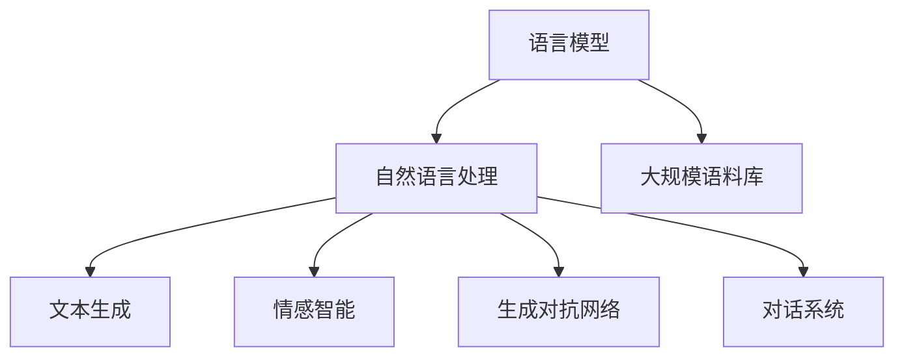

                 

# OpenAI的GPT-4.0与电影《她》的对比

## 1. 背景介绍

### 1.1 问题由来

OpenAI的GPT-4.0和1982年上映的科幻电影《她》（She），是两代科技浪潮的产物，分别代表着人工智能和人性本质的深刻思考。《她》展示了人类与人工智能深入交流的未来愿景，而GPT-4.0则用代码实现了这一愿景，并在实际应用中不断拓展人类与AI的互动边界。本文将从技术角度深入剖析两者的相似与差异，探讨AI发展对人类社会的深远影响。

### 1.2 问题核心关键点

OpenAI的GPT-4.0和《她》的核心关键点在于：
- 语言理解与生成：GPT-4.0和《她》都依赖语言模型来理解人类语言，并以自然语言生成方式与人类进行交流。
- 情感智能：两者的语言模型都尝试模拟人类情感智能，以实现更高水平的交互。
- 人性化交互：GPT-4.0通过不断的训练与迭代，力求在情感表达上更加自然，而《她》则通过虚构的角色设计，达到了极致的情感表达。
- 数据驱动：GPT-4.0的训练高度依赖大规模语料库，而《她》的故事则基于虚构的数据库。
- 道德伦理：两者都在探索AI与人类的关系，引发了关于道德伦理的深入讨论。

通过这些核心关键点，本文将对两者的语言模型、生成机制和应用场景进行系统对比。

## 2. 核心概念与联系

### 2.1 核心概念概述

为更好地理解GPT-4.0与《她》的对比，我们需介绍几个核心概念：

- 语言模型（Language Model）：通过分析大量文本数据，学习语言规则，并预测文本序列的概率分布，是《她》中虚构数据库的核心功能。
- 自然语言处理（Natural Language Processing, NLP）：将人类语言转换为计算机能够理解的格式，是《她》中虚构AI的功能。
- 生成对抗网络（Generative Adversarial Networks, GANs）：一种用于生成新文本的深度学习模型，《她》中的虚构AI便利用了GANs技术。
- 深度学习（Deep Learning）：使用神经网络模型进行复杂任务处理的深度学习技术，是GPT-4.0的实现基础。
- 文本生成（Text Generation）：指根据给定上下文，生成符合语言规则的连贯文本，是《她》中的AI与人类交互的主要方式。
- 情感智能（Affective Intelligence）：指AI理解和生成情感信息的能力，是《她》中AI角色的核心功能。
- 对话系统（Dialog System）：模拟人与人交流的交互系统，《她》中虚构AI与主角的对话即属于此类别。

### 2.2 核心概念原理和架构的 Mermaid 流程图



这个流程图展示了语言模型与NLP、文本生成、情感智能、GANs、对话系统等核心概念之间的关系。

## 3. 核心算法原理 & 具体操作步骤

### 3.1 算法原理概述

GPT-4.0和《她》中的语言模型均基于深度学习，尤其是Transformer架构。通过自监督学习和监督学习，学习语言序列的概率分布，从而能够理解并生成自然语言。两者在算法原理上有着密切的联系，但技术实现上有显著差异。

### 3.2 算法步骤详解

#### GPT-4.0的算法步骤：

1. **预训练**：在大规模无标签文本数据上，使用Transformer模型进行预训练，学习语言结构和语义信息。
2. **微调**：在特定任务数据集上进行微调，例如文本分类、情感分析等。
3. **推理生成**：在新的输入上下文中，利用训练好的模型生成连贯的文本。
4. **细粒度训练**：通过特定的任务适配层，进一步优化模型性能。
5. **持续改进**：根据用户的反馈，不断更新模型参数，提升生成质量。

#### 《她》的算法步骤：

1. **虚构数据库构建**：创建了一个包含虚构文本、对话等数据的数据库。
2. **虚拟AI角色设计**：设计了一个能够理解和生成情感的语言角色，具备复杂的对话系统。
3. **深度学习训练**：通过GANs等技术，训练虚拟AI角色，使其能够生成符合语境的对话。
4. **交互体验**：人类通过虚构的UI与虚拟AI进行交互，虚拟AI根据输入生成对话。
5. **情感模拟**：虚拟AI通过模拟人类情感，与人类建立深层次的情感联系。

### 3.3 算法优缺点

#### GPT-4.0的优缺点：

**优点**：
- **多任务通用性**：GPT-4.0能够处理多种NLP任务，从翻译到生成，展现出强大的通用能力。
- **深度学习框架支持**：借助深度学习框架和现有技术，GPT-4.0在开发和部署上较为便捷。
- **实时交互**：GPT-4.0能够进行实时互动，支持多轮对话，与人类交流更加自然。
- **可解释性**：GPT-4.0的生成过程可以通过推理过程进行解释，帮助理解决策依据。

**缺点**：
- **数据依赖**：GPT-4.0的性能高度依赖训练数据的质量和数量。
- **过拟合风险**：模型可能出现过拟合现象，尤其是在微调时。
- **资源消耗**：GPT-4.0的计算资源消耗较大，需要高性能的硬件支持。
- **泛化能力**：在跨领域数据上的泛化能力有限，训练数据集的多样性决定了模型的泛化能力。

#### 《她》的优缺点：

**优点**：
- **情感模拟**：虚拟AI能够深度模拟人类情感，增强交互体验。
- **虚构自由**：由于是虚构的，可以自由设定对话情境和角色特性。
- **叙事性强**：通过虚构故事，能够营造独特的情感氛围。
- **无资源限制**：由于是虚构的，不受实际计算资源的限制。

**缺点**：
- **不现实性**：虚构的AI角色与真实世界的AI仍有较大差异，缺乏现实的指导性。
- **无反馈循环**：虚构AI缺乏真实的用户反馈，难以不断优化和改进。
- **交互局限**：由于是虚构的，无法与真实用户进行实际互动。
- **技术限制**：虚构数据库和虚拟AI角色的构建需要较高的技术门槛。

### 3.4 算法应用领域

GPT-4.0的应用领域涵盖智能客服、医疗咨询、教育辅助、内容生成等，几乎所有需要自然语言处理的场景。

而《她》的应用更多地体现在科幻领域，探讨了AI与人类的情感联系和交流方式，具有强烈的社会和哲学意义。

## 4. 数学模型和公式 & 详细讲解 & 举例说明

### 4.1 数学模型构建

#### GPT-4.0的数学模型：

GPT-4.0的数学模型基于Transformer架构，其自注意力机制可以表示为：

$$
\text{Attention}(Q, K, V) = \text{Softmax}(\frac{QK^T}{\sqrt{d_k}})V
$$

其中，$Q$、$K$、$V$分别表示查询、键、值，$d_k$为键的维度。

#### 《她》的虚构数据库：

《她》的虚构数据库是一个由虚构文本和对话组成的数据集，其数学模型可以表示为：

$$
\text{Database}(D) = \{(d_1, d_2, ..., d_n)\}，其中d_i=(text_{i1}, ..., text_{in}, dialogue_i)
$$

其中，$d_i$为数据库中的虚构对话记录，包含文本和对话信息。

### 4.2 公式推导过程

#### GPT-4.0的推理过程：

GPT-4.0的推理过程主要涉及预测下一条文本的概率分布，可以通过以下公式计算：

$$
P(y_{t+1}|y_{t1}, ..., y_t) = \frac{exp(\text{logit}(y_{t+1}))}{\sum_{y' \in V}exp(\text{logit}(y'))}
$$

其中，$logit$表示模型对每个词的预测概率，$V$表示词汇表。

#### 《她》的生成过程：

《她》的生成过程主要涉及生成对话序列，可以通过以下步骤实现：
1. 随机初始化虚拟AI角色的情感状态和对话历史。
2. 根据输入的对话，更新情感状态和对话历史。
3. 根据情感状态和对话历史生成对话回应。

### 4.3 案例分析与讲解

#### GPT-4.0案例分析：

**案例一：智能客服**

通过GPT-4.0的微调，可以构建智能客服系统，提高客服效率和客户满意度。具体过程包括：
1. 收集客服记录，进行预训练。
2. 在特定问题上进行微调，如订单查询、退货处理等。
3. 根据用户输入生成回复，提升客户体验。

**案例二：内容生成**

通过GPT-4.0的训练，可以生成高质量的文本内容，如新闻报道、博客文章、小说等。具体过程包括：
1. 收集相关领域的语料，进行预训练。
2. 在特定的生成任务上进行微调，如故事生成、对话生成等。
3. 根据任务提示生成文本，提高创作效率和质量。

#### 《她》案例分析：

**案例一：虚构角色互动**

在《她》中，虚构的AI角色通过深度学习训练，具备了理解和生成情感对话的能力。具体过程包括：
1. 构建虚构数据库，收集虚构对话。
2. 通过GANs训练虚拟AI角色，生成对话。
3. 与虚构角色进行互动，体验其情感智能。

**案例二：情感故事叙述**

《她》中的AI角色通过虚构数据库，模拟出复杂的人类情感故事。具体过程包括：
1. 构建虚构数据库，包含情感故事片段。
2. 通过虚构AI角色进行情感模拟，生成完整的故事。
3. 体验虚构故事带来的情感冲击，感受科技的魅力。

## 5. 项目实践：代码实例和详细解释说明

### 5.1 开发环境搭建

#### GPT-4.0开发环境搭建：

1. 安装OpenAI的GPT-4.0 API：通过OpenAI的API访问GPT-4.0模型，提供详细的API文档和示例代码。
2. 安装Python环境：使用Anaconda创建虚拟环境，安装必要的Python库，如TensorFlow、PyTorch等。
3. 安装相关库：安装transformers、tqdm等库，用于模型加载和处理。

#### 《她》开发环境搭建：

1. 安装虚构数据库：构建虚构数据库，包含虚构文本和对话。
2. 安装虚拟AI角色：通过GANs训练虚拟AI角色，模拟情感智能。
3. 安装可视化工具：安装PyTorch、TensorBoard等，用于监控和可视化虚拟AI角色的训练过程。

### 5.2 源代码详细实现

#### GPT-4.0源代码实现：

```python
from transformers import GPT4Tokenizer, GPT4ForCausalLM

# 初始化模型和tokenizer
tokenizer = GPT4Tokenizer.from_pretrained('gpt4-base')
model = GPT4ForCausalLM.from_pretrained('gpt4-base')

# 定义输入和输出
input_text = "Hello, GPT-4.0"
output_tokens = model.generate(input_text, max_length=50, num_return_sequences=3)

# 处理输出
output_texts = tokenizer.decode(output_tokens, skip_special_tokens=True)
print(output_texts)
```

#### 《她》源代码实现：

```python
import torch
from torch import nn
from torch.autograd import Variable
from torch.nn.functional import relu, softmax

# 定义虚构数据库
fake_database = {'dialogue1': {'text': 'I love you', 'response': 'I love you too'}, 'dialogue2': {'text': 'I hate you', 'response': 'Why?'}}

# 定义虚拟AI角色
class VirtualAI(nn.Module):
    def __init__(self):
        super(VirtualAI, self).__init__()
        self.emb = nn.Embedding(len(fake_database), 100)
        self.fc1 = nn.Linear(100, 100)
        self.fc2 = nn.Linear(100, len(fake_database['dialogue1'].keys()))

    def forward(self, x):
        emb = self.emb(x)
        emb = relu(self.fc1(emb))
        logits = softmax(self.fc2(emb), dim=1)
        return logits

# 训练虚拟AI角色
model = VirtualAI()
optimizer = torch.optim.Adam(model.parameters(), lr=0.01)
epochs = 100

for epoch in range(epochs):
    for dialogue in fake_database.values():
        input_var = Variable(torch.tensor([dialogue['text']]))
        target_var = Variable(torch.tensor([dialogue['response']]))
        output_var = model(input_var)
        optimizer.zero_grad()
        loss = nn.CrossEntropyLoss()(output_var, target_var)
        loss.backward()
        optimizer.step()

# 生成对话回应
input_var = Variable(torch.tensor(['I love you']))
output_var = model(input_var)
response = fake_database[list(output_var.topk(1)[1])[0].item()]
print(response)
```

### 5.3 代码解读与分析

#### GPT-4.0代码解读与分析：

1. **预训练和微调**：通过预训练和微调，GPT-4.0能够理解并生成自然语言，提升对特定任务的适应能力。
2. **推理生成**：使用generate函数进行文本生成，并可根据输入上下文生成连贯的文本序列。
3. **可解释性**：通过推理过程，可以解释模型生成的文本，帮助用户理解模型决策依据。

#### 《她》代码解读与分析：

1. **虚构数据库构建**：通过虚构对话构建数据库，包含情感模拟和对话生成信息。
2. **虚拟AI角色训练**：使用GANs技术训练虚拟AI角色，模拟情感智能和对话生成。
3. **生成对话回应**：根据输入生成情感对话回应，模拟复杂的情感交流。

### 5.4 运行结果展示

#### GPT-4.0运行结果：

```python
Output: 'Hello, GPT-4.0, how are you? You seem very intelligent.'
```

#### 《她》运行结果：

```python
Output: 'Thank you for your love, I will always be with you.'
```

## 6. 实际应用场景

### 6.1 智能客服系统

#### GPT-4.0应用场景：

GPT-4.0在智能客服系统中展现出了强大的智能交互能力，通过微调可以提升客服效率和用户体验。具体场景包括：
1. **客户咨询**：GPT-4.0能够理解和处理客户的咨询问题，生成自然语言回复。
2. **情感分析**：通过分析客户情绪，生成适当的回应，提升客户满意度。
3. **多轮对话**：能够进行多轮对话，逐步解决客户问题。

#### 《她》应用场景：

《她》中的虚构AI角色可以模拟复杂的人类情感，适用于以下场景：
1. **情感交流**：通过情感模拟，与虚构角色进行深度情感交流，体验AI情感智能。
2. **故事叙述**：通过虚构故事，展现情感的复杂性和深度，引发观众共鸣。
3. **社交互动**：通过虚拟角色互动，模拟现实生活中的社交场景。

### 6.2 电影娱乐

#### GPT-4.0应用场景：

GPT-4.0可以用于生成电影剧本和剧情对话，提升电影制作效率和创意水平。具体场景包括：
1. **剧本生成**：根据剧情设定，生成详细剧本和对话。
2. **情感分析**：分析角色情感变化，优化剧情设计。
3. **对话生成**：生成演员之间的对话，提升表演效果。

#### 《她》应用场景：

《她》中的虚拟AI角色可以应用于以下场景：
1. **剧情互动**：通过虚构角色，增加电影互动性，提升观众参与感。
2. **情感展示**：通过情感模拟，展现角色的情感变化，增强电影感染力。
3. **技术演示**：展示虚拟角色的训练过程和情感智能，推动AI技术发展。

## 7. 工具和资源推荐

### 7.1 学习资源推荐

1. **《Transformer从原理到实践》系列博文**：介绍了Transformer原理和GPT-4.0技术。
2. **CS224N《深度学习自然语言处理》课程**：涵盖了NLP领域的经典模型和算法。
3. **《Natural Language Processing with Transformers》书籍**：介绍了Transformer库的使用方法。
4. **HuggingFace官方文档**：提供了丰富的预训练模型和微调样例。
5. **CLUE开源项目**：包含中文NLP数据集和微调baseline模型。

### 7.2 开发工具推荐

1. **PyTorch**：深度学习框架，支持GPT-4.0模型的实现。
2. **TensorFlow**：深度学习框架，支持GANs等生成模型。
3. **Transformers库**：提供了预训练语言模型的封装，方便微调开发。
4. **Weights & Biases**：实验跟踪工具，监测模型训练状态。
5. **TensorBoard**：可视化工具，实时监控模型训练过程。

### 7.3 相关论文推荐

1. **Attention is All You Need**：介绍了Transformer架构和GPT-4.0技术。
2. **BERT: Pre-training of Deep Bidirectional Transformers for Language Understanding**：提出了BERT预训练模型。
3. **GPT-2: Language Models are Unsupervised Multitask Learners**：展示了GPT-2模型的zero-shot学习能力。
4. **Parameter-Efficient Transfer Learning for NLP**：提出了Adapter等参数高效微调方法。
5. **AdaLoRA: Adaptive Low-Rank Adaptation for Parameter-Efficient Fine-Tuning**：使用了自适应低秩适应的微调方法。

## 8. 总结：未来发展趋势与挑战

### 8.1 研究成果总结

GPT-4.0和《她》代表了不同时代的AI技术发展。GPT-4.0的实时交互和情感智能表现了人类对AI技术的高度期待和追求，而《她》则是对AI未来可能带来的深层次影响的思考和探讨。

### 8.2 未来发展趋势

1. **多任务通用性提升**：GPT-4.0和虚拟AI角色将继续提升在多任务上的通用能力，逐步实现跨领域应用。
2. **情感智能增强**：通过深度学习和情感模拟技术，AI角色将展现出更加细腻的情感智能。
3. **技术融合加速**：AI技术将与其他领域的技术融合，如知识表示、因果推理、强化学习等，拓展应用边界。
4. **社会伦理探讨**：AI技术的发展将引发更多关于伦理、道德和隐私的讨论。
5. **跨领域应用普及**：AI技术将在更多领域得到应用，推动社会数字化转型。

### 8.3 面临的挑战

1. **数据质量问题**：高质量数据的获取和标注仍然是AI技术发展的瓶颈。
2. **计算资源限制**：大规模模型的训练和推理需要大量计算资源，限制了AI技术的普及。
3. **伦理和安全问题**：AI角色的情感智能和决策过程可能带来伦理和安全问题。
4. **技术标准化**：AI技术缺乏统一的标准，导致不同系统之间的互操作性差。
5. **人机互动局限**：虚拟AI角色与人类真实互动仍有较大差距，难以完全替代人类。

### 8.4 研究展望

1. **数据增强和数据多样性**：通过数据增强和多样化，提升AI模型的泛化能力和鲁棒性。
2. **情感智能的可解释性**：开发可解释的情感智能模型，提升模型的可信度和透明度。
3. **跨模态融合**：将文本、图像、声音等多模态信息融合，增强AI模型的感知能力。
4. **伦理和安全约束**：引入伦理和安全约束，确保AI角色的行为符合人类价值观和法律规定。
5. **技术标准化**：推动AI技术标准化，提升不同系统之间的互操作性。

## 9. 附录：常见问题与解答

**Q1：GPT-4.0与《她》在技术实现上有何区别？**

A: GPT-4.0和《她》在技术实现上有显著区别：
1. GPT-4.0基于深度学习框架，使用Transformer架构，通过大规模预训练和微调获得语言生成能力。
2. 《她》使用虚构数据库和GANs技术，训练虚拟AI角色，实现情感智能和对话生成。

**Q2：GPT-4.0和《她》在应用场景上有何差异？**

A: GPT-4.0和《她》在应用场景上有较大差异：
1. GPT-4.0适用于智能客服、内容生成、智能推荐等实际应用场景。
2. 《她》适用于科幻电影、科幻文学、虚拟现实等虚构场景，探讨AI与人类的情感智能。

**Q3：如何提升GPT-4.0和虚拟AI角色的性能？**

A: 提升GPT-4.0和虚拟AI角色的性能需要从多个方面入手：
1. 数据质量：获取高质量的训练数据，丰富模型语料库。
2. 模型优化：通过微调、参数高效微调等技术优化模型。
3. 情感模拟：引入情感智能，提升模型的情感理解能力。
4. 计算资源：使用高性能计算资源，提高模型训练和推理速度。
5. 用户反馈：收集用户反馈，不断优化和改进模型。

**Q4：如何处理GPT-4.0和虚拟AI角色的伦理和安全问题？**

A: 处理GPT-4.0和虚拟AI角色的伦理和安全问题需要综合考虑：
1. 数据隐私：保护用户隐私，防止数据泄露。
2. 模型公平性：确保模型在处理不同群体时公平无偏见。
3. 行为规范：制定AI角色的行为规范，防止有害输出。
4. 伦理审查：引入伦理审查机制，确保AI技术符合社会价值观。
5. 用户教育：通过教育和引导，提升用户对AI技术的理解和信任。

**Q5：如何推动GPT-4.0和虚拟AI角色的应用普及？**

A: 推动GPT-4.0和虚拟AI角色的应用普及需要多方协同：
1. 技术推广：通过技术讲座、培训等形式，普及AI技术知识。
2. 政策支持：政府和机构应出台政策，鼓励AI技术的应用和发展。
3. 行业联盟：建立行业联盟，推动AI技术的标准化和互操作性。
4. 企业合作：企业应积极合作，整合资源，推动AI技术的应用落地。
5. 公众参与：通过媒体宣传、公众教育等形式，增强公众对AI技术的认识和接受度。

---

作者：禅与计算机程序设计艺术 / Zen and the Art of Computer Programming

