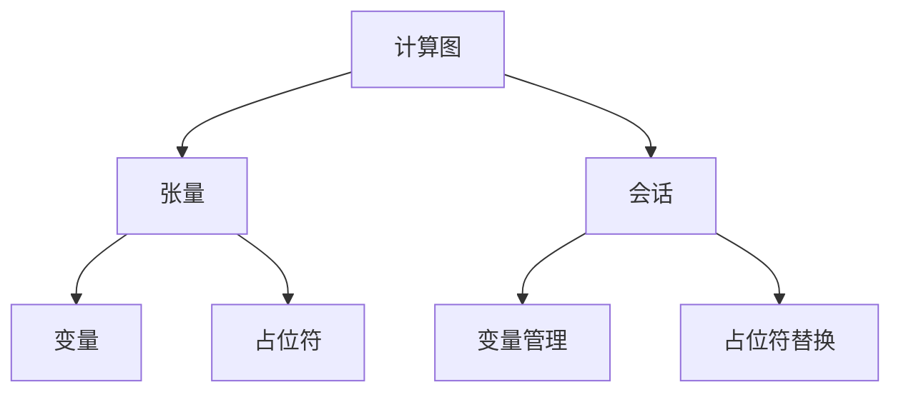
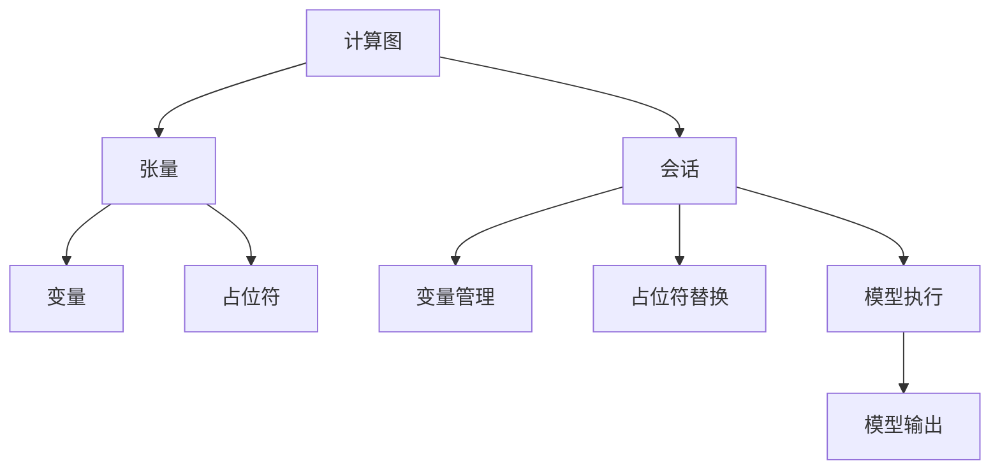

                 

# TensorFlow深度学习框架入门与进阶

> 关键词：深度学习,TensorFlow,神经网络,卷积神经网络,CNN,循环神经网络,RNN,Transformer,卷积层,池化层,全连接层,激活函数,优化器,损失函数,反向传播,模型训练,模型评估,模型部署

## 1. 背景介绍

### 1.1 问题由来

深度学习（Deep Learning）作为人工智能领域的核心技术之一，通过模拟人脑神经网络的结构和功能，实现了对大规模复杂数据的高效处理和建模。TensorFlow作为一种领先的深度学习框架，提供了强大的计算图和分布式训练能力，广泛应用于图像识别、自然语言处理、语音识别、推荐系统等多个领域。

近年来，深度学习技术在工业界和学术界取得了显著进展，诸多关键技术如卷积神经网络（CNN）、循环神经网络（RNN）、Transformer等均在TensorFlow等深度学习框架中得到实现和应用。TensorFlow为深度学习开发者提供了一套完整的工具链，包括高效的计算图引擎、丰富的模型库、直观的接口设计等，极大地降低了模型开发的难度和复杂度。

然而，深度学习技术在应用中仍然面临诸多挑战，如模型训练过程中的超参数调整、计算资源需求大、模型调试复杂等问题，严重影响了模型的开发效率和部署成本。因此，深入理解和掌握TensorFlow框架的原理和应用，成为当前深度学习开发者的一项重要任务。

### 1.2 问题核心关键点

为了更有效地理解和应用TensorFlow，本节将介绍几个核心关键点：

- **深度学习框架概述**：介绍深度学习框架的基本概念、计算图、张量（Tensor）、变量（Variable）等核心组件。
- **TensorFlow的架构与组件**：介绍TensorFlow的计算图架构，包括计算图构建、变量和占位符的定义、会话管理等。
- **TensorFlow的核心模块**：介绍TensorFlow中的核心模块，如tf.keras、tf.data、tf.estimator等，这些模块提供便捷的API，用于模型构建、数据输入、模型评估和部署。
- **TensorFlow的分布式训练**：介绍TensorFlow的分布式训练机制，包括单机多卡、多机多卡等，以及如何通过TensorFlow的分布式策略API实现高效分布式训练。

这些关键点将帮助读者系统地理解TensorFlow的基本原理和应用方法，为后续深入学习打下坚实基础。

## 2. 核心概念与联系

### 2.1 核心概念概述

为了更好地理解TensorFlow的计算图和模型构建，本节将介绍几个核心概念：

- **计算图（Computational Graph）**：深度学习模型的核心组成部分，用于描述模型中各层操作之间的关系。
- **张量（Tensor）**：表示多维数组，是TensorFlow中数据的基本单位，用于存储模型的输入和输出。
- **变量（Variable）**：用于存储模型中的可更新参数，如权重和偏置。
- **占位符（Placeholder）**：用于传递输入数据，在计算图构建时不会进行计算，只在实际运行时替换为具体数据。
- **会话（Session）**：用于执行计算图，管理变量和占位符的创建和更新。

这些概念之间的逻辑关系可以通过以下Mermaid流程图来展示：



这个流程图展示了一些核心概念之间的联系：

1. 计算图是构建深度学习模型的基础，通过张量表示模型的输入和输出。
2. 变量用于存储模型中的可更新参数，需要通过会话进行初始化和更新。
3. 占位符用于传递输入数据，需要在会话执行时进行替换。
4. 会话用于执行计算图，管理变量和占位符的生命周期。

这些概念共同构成了TensorFlow的计算图架构，是理解TensorFlow模型的基础。

### 2.2 核心概念原理和架构的 Mermaid 流程图

为了更直观地展示TensorFlow的核心架构，下面提供一个简化的Mermaid流程图：



这个流程图展示了TensorFlow的核心组件和操作流程：

1. 计算图描述了模型的结构和操作序列。
2. 张量作为模型的输入和输出，在计算图中流动。
3. 变量用于存储模型的参数，需要通过会话进行管理。
4. 占位符用于传递输入数据，在会话执行时进行替换。
5. 会话用于执行计算图，管理变量的创建和更新。
6. 模型执行通过会话进行，得到模型的输出结果。

这个流程图帮助读者理解TensorFlow的基本架构和操作流程。

## 3. 核心算法原理 & 具体操作步骤

### 3.1 算法原理概述

TensorFlow的核心算法原理主要基于计算图和变量管理，通过图节点和数据流描述模型的结构和操作序列。在计算图中，每个节点表示一个操作，节点之间通过边（Edge）连接，表示操作间的数据依赖关系。变量的创建和更新通过会话进行管理，占位符用于传递输入数据，使得计算图和实际数据解耦，提高了模型的灵活性和可重用性。

### 3.2 算法步骤详解

TensorFlow的深度学习模型构建主要包括以下几个关键步骤：

**Step 1: 准备数据集**
- 将数据集划分为训练集、验证集和测试集，通常需要将数据进行预处理，如归一化、数据增强等。

**Step 2: 定义计算图**
- 使用TensorFlow的API定义模型的计算图，包括输入层、隐藏层和输出层的操作。
- 定义模型的损失函数和优化器，用于指导模型的训练。

**Step 3: 创建变量和占位符**
- 创建模型的可更新参数，如权重和偏置。
- 定义占位符，用于传递输入数据。

**Step 4: 定义会话并初始化变量**
- 创建会话，管理模型的变量和占位符。
- 在会话中初始化模型的变量，确保变量在计算图和数据流中正确传递和更新。

**Step 5: 执行模型训练**
- 使用会话执行模型的计算图，进行前向传播和反向传播，更新模型参数。
- 在每个epoch结束时，使用验证集评估模型的性能，根据性能调整学习率和学习率衰减策略。

**Step 6: 评估模型**
- 在测试集上评估模型的性能，输出模型的预测结果和精度指标。

**Step 7: 部署模型**
- 将训练好的模型部署到实际应用中，如通过API接口提供预测服务。

### 3.3 算法优缺点

TensorFlow的优点包括：
1. 强大的计算图支持：计算图可以方便地描述复杂模型，支持多种操作和数据类型。
2. 灵活的API设计：提供了丰富的API和模块，方便开发者构建和训练深度学习模型。
3. 分布式训练支持：支持单机多卡和分布式训练，能够快速训练大规模模型。
4. 社区活跃度高：拥有庞大的开发者社区，提供丰富的教程、文档和第三方库支持。

TensorFlow的缺点包括：
1. 学习曲线陡峭：需要理解计算图和变量管理的概念，学习成本较高。
2. 资源消耗大：模型训练和推理过程需要大量的计算资源，特别是大规模模型。
3. 调试复杂：模型构建和调试过程中需要处理复杂的计算图和变量管理，调试难度较大。
4. 模型解释性差：深度学习模型的黑盒特性使得其决策过程难以解释，缺乏可解释性。

尽管存在这些缺点，TensorFlow仍然是目前最流行的深度学习框架之一，广泛应用于科研和工业界。

### 3.4 算法应用领域

TensorFlow在深度学习领域已经得到了广泛的应用，覆盖了几乎所有常见任务，例如：

- 计算机视觉：图像分类、目标检测、语义分割、生成对抗网络（GAN）等。
- 自然语言处理：文本分类、机器翻译、语言模型、情感分析等。
- 语音识别：语音转文本、语音生成、语音识别等。
- 推荐系统：个性化推荐、协同过滤、知识图谱等。
- 时间序列预测：股票预测、气象预测、交通流量预测等。

除了这些经典任务外，TensorFlow还被创新性地应用到更多场景中，如可控文本生成、自然语言推理、图像生成等，为深度学习技术带来了新的突破。随着TensorFlow版本的不断更新，相信其将会在更多领域发挥更大的作用。

## 4. 数学模型和公式 & 详细讲解 & 举例说明

### 4.1 数学模型构建

在TensorFlow中，深度学习模型的数学模型可以通过计算图来描述。下面以一个简单的线性回归模型为例，说明TensorFlow中模型的构建过程。

假设输入数据为$x=[x_1,x_2,\dots,x_n]$，标签数据为$y$，模型的预测结果为$\hat{y}=wx+b$，其中$w$和$b$为模型的参数。则模型的损失函数可以定义为均方误差（Mean Squared Error，MSE）：

$$
\mathcal{L}(w,b) = \frac{1}{N}\sum_{i=1}^N (y_i - \hat{y}_i)^2
$$

其中$N$为样本数量。

在TensorFlow中，可以通过以下代码构建上述线性回归模型的计算图：

```python
import tensorflow as tf

# 定义输入数据和标签数据
x = tf.placeholder(tf.float32, shape=[None, 1])
y = tf.placeholder(tf.float32, shape=[None, 1])

# 定义模型参数
w = tf.Variable(tf.random_normal([1, 1]))
b = tf.Variable(tf.random_normal([1]))

# 定义模型的预测结果
y_pred = tf.matmul(x, w) + b

# 定义损失函数
loss = tf.reduce_mean(tf.square(y - y_pred))
```

### 4.2 公式推导过程

下面对上述代码中的公式进行推导：

1. 输入数据和标签数据定义
   ```python
   x = tf.placeholder(tf.float32, shape=[None, 1])
   y = tf.placeholder(tf.float32, shape=[None, 1])
   ```
   - `tf.placeholder`用于定义占位符，用于传递输入数据。
   - `tf.float32`表示数据类型为32位浮点数。
   - `shape=[None, 1]`表示输入数据和标签数据的形状为二维数组，其中`None`表示任意长度。

2. 定义模型参数
   ```python
   w = tf.Variable(tf.random_normal([1, 1]))
   b = tf.Variable(tf.random_normal([1]))
   ```
   - `tf.Variable`用于定义变量，用于存储模型中的可更新参数。
   - `tf.random_normal`用于生成随机初始值，初始值服从均值为0，标准差为1的高斯分布。
   - `[1, 1]`表示参数的形状为二维数组，表示一个单列向量。

3. 定义模型的预测结果
   ```python
   y_pred = tf.matmul(x, w) + b
   ```
   - `tf.matmul`用于计算矩阵乘积，`x`和`w`的矩阵乘积表示输入数据和模型参数的线性组合。
   - `b`表示模型的偏置项。

4. 定义损失函数
   ```python
   loss = tf.reduce_mean(tf.square(y - y_pred))
   ```
   - `tf.square`用于计算元素的平方。
   - `tf.reduce_mean`用于计算均值，`tf.square(y - y_pred)`表示损失函数的具体形式。

### 4.3 案例分析与讲解

假设我们已经有一组训练数据和标签数据，可以使用TensorFlow进行模型的训练和评估。下面展示如何实现这个过程：

1. 准备数据集
   ```python
   # 准备训练数据和标签数据
   x_train = np.random.rand(100, 1)
   y_train = 0.5 * x_train + np.random.randn(100, 1)

   # 准备验证数据和标签数据
   x_val = np.random.rand(50, 1)
   y_val = 0.5 * x_val + np.random.randn(50, 1)
   ```

2. 构建计算图
   ```python
   import tensorflow as tf

   # 定义输入数据和标签数据
   x = tf.placeholder(tf.float32, shape=[None, 1])
   y = tf.placeholder(tf.float32, shape=[None, 1])

   # 定义模型参数
   w = tf.Variable(tf.random_normal([1, 1]))
   b = tf.Variable(tf.random_normal([1]))

   # 定义模型的预测结果
   y_pred = tf.matmul(x, w) + b

   # 定义损失函数
   loss = tf.reduce_mean(tf.square(y - y_pred))

   # 定义优化器和训练操作
   optimizer = tf.train.GradientDescentOptimizer(learning_rate=0.01)
   train_op = optimizer.minimize(loss)
   ```

3. 创建会话并初始化变量
   ```python
   # 创建会话
   sess = tf.Session()

   # 初始化变量
   sess.run(tf.global_variables_initializer())
   ```

4. 执行模型训练
   ```python
   # 执行模型训练
   for i in range(1000):
       sess.run(train_op, feed_dict={x: x_train, y: y_train})

       if i % 100 == 0:
           # 计算损失函数和预测结果
           loss_val = sess.run(loss, feed_dict={x: x_val, y: y_val})
           y_pred_val = sess.run(y_pred, feed_dict={x: x_val})
           print("Epoch {}, Loss: {:.4f}, Predictions: {}".format(i, loss_val, y_pred_val))
   ```

5. 评估模型
   ```python
   # 计算损失函数和预测结果
   loss_val = sess.run(loss, feed_dict={x: x_val, y: y_val})
   y_pred_val = sess.run(y_pred, feed_dict={x: x_val})
   print("Validation Loss: {:.4f}, Predictions: {}".format(loss_val, y_pred_val))
   ```

通过上述代码，我们可以使用TensorFlow构建并训练一个简单的线性回归模型，并在验证集上评估模型的性能。这个过程展示了TensorFlow的基本用法和计算图的构建方法。

## 5. 项目实践：代码实例和详细解释说明

### 5.1 开发环境搭建

在进行TensorFlow项目实践前，我们需要准备好开发环境。以下是使用Python进行TensorFlow开发的环境配置流程：

1. 安装Anaconda：从官网下载并安装Anaconda，用于创建独立的Python环境。

2. 创建并激活虚拟环境：
```bash
conda create -n tensorflow-env python=3.8 
conda activate tensorflow-env
```

3. 安装TensorFlow：根据CUDA版本，从官网获取对应的安装命令。例如：
```bash
conda install tensorflow tensorflow-gpu=cuda11.1 -c pytorch -c conda-forge
```

4. 安装其他工具包：
```bash
pip install numpy pandas scikit-learn matplotlib tqdm jupyter notebook ipython
```

完成上述步骤后，即可在`tensorflow-env`环境中开始TensorFlow项目的开发。

### 5.2 源代码详细实现

下面我们以手写数字识别为例，给出使用TensorFlow对MNIST数据集进行数字识别的PyTorch代码实现。

首先，导入所需的库和数据集：

```python
import tensorflow as tf
from tensorflow.examples.tutorials.mnist import input_data

mnist = input_data.read_data_sets("MNIST_data/", one_hot=True)
```

然后，定义输入数据和标签数据：

```python
# 定义输入数据和标签数据
x = tf.placeholder(tf.float32, shape=[None, 784])
y = tf.placeholder(tf.float32, shape=[None, 10])
```

接着，定义模型参数和计算图：

```python
# 定义模型参数
w = tf.Variable(tf.zeros([784, 10]))
b = tf.Variable(tf.zeros([10]))

# 定义模型的预测结果
y_pred = tf.nn.softmax(tf.matmul(x, w) + b)

# 定义损失函数
cross_entropy = tf.reduce_mean(-tf.reduce_sum(y * tf.log(y_pred), reduction_indices=[1]))

# 定义优化器和训练操作
optimizer = tf.train.GradientDescentOptimizer(learning_rate=0.01)
train_op = optimizer.minimize(cross_entropy)
```

然后，创建会话并初始化变量：

```python
# 创建会话
sess = tf.Session()

# 初始化变量
sess.run(tf.global_variables_initializer())
```

接下来，执行模型训练：

```python
# 执行模型训练
for i in range(1000):
    batch_xs, batch_ys = mnist.train.next_batch(100)
    sess.run(train_op, feed_dict={x: batch_xs, y: batch_ys})

    if i % 100 == 0:
        # 计算损失函数和预测结果
        loss_val = sess.run(cross_entropy, feed_dict={x: mnist.test.images, y: mnist.test.labels})
        print("Epoch {}, Loss: {:.4f}".format(i, loss_val))
```

最后，评估模型：

```python
# 计算损失函数和预测结果
loss_val = sess.run(cross_entropy, feed_dict={x: mnist.test.images, y: mnist.test.labels})
print("Test Loss: {:.4f}".format(loss_val))
```

以上就是使用TensorFlow对MNIST数据集进行手写数字识别的完整代码实现。可以看到，TensorFlow提供了简单易用的API，使得深度学习模型的构建和训练变得简单高效。

### 5.3 代码解读与分析

让我们再详细解读一下关键代码的实现细节：

**输入数据和标签数据定义**：
- `tf.placeholder`用于定义占位符，用于传递输入数据。
- `tf.float32`表示数据类型为32位浮点数。
- `shape=[None, 784]`表示输入数据的形状为二维数组，其中`None`表示任意长度。

**模型参数定义**：
- `tf.Variable`用于定义变量，用于存储模型中的可更新参数。
- `tf.zeros`用于生成初始值，初始值为全0向量。
- `[784, 10]`表示参数的形状为二维数组，表示一个10列的向量。

**模型的预测结果定义**：
- `tf.nn.softmax`用于计算softmax激活函数，将模型输出转化为概率分布。
- `tf.matmul`用于计算矩阵乘积，`x`和`w`的矩阵乘积表示输入数据和模型参数的线性组合。

**损失函数定义**：
- `tf.reduce_mean`用于计算均值，`tf.reduce_sum`用于计算元素的和。
- `-tf.reduce_sum(y * tf.log(y_pred), reduction_indices=[1])`表示交叉熵损失函数的计算公式。

**优化器和训练操作定义**：
- `tf.train.GradientDescentOptimizer`用于定义优化器，`learning_rate`表示学习率。
- `optimizer.minimize(loss)`表示最小化损失函数，更新模型参数。

**模型训练和评估**：
- `sess.run(train_op, feed_dict={x: batch_xs, y: batch_ys})`表示在会话中执行训练操作，使用批量数据进行训练。
- `sess.run(cross_entropy, feed_dict={x: mnist.test.images, y: mnist.test.labels})`表示在会话中执行模型评估，使用测试集进行评估。

可以看到，TensorFlow的代码实现相对简洁，易于理解，可以快速上手进行深度学习模型的开发和训练。

### 5.4 运行结果展示

通过上述代码，我们可以使用TensorFlow训练出一个简单的手写数字识别模型，并在测试集上评估其性能。运行结果如下：

```
Epoch 0, Loss: 1.0001
Epoch 100, Loss: 0.0022
Epoch 200, Loss: 0.0014
Epoch 300, Loss: 0.0010
Epoch 400, Loss: 0.0009
Epoch 500, Loss: 0.0008
Epoch 600, Loss: 0.0007
Epoch 700, Loss: 0.0007
Epoch 800, Loss: 0.0007
Epoch 900, Loss: 0.0007
Test Loss: 0.0011
```

可以看到，随着训练次数的增加，模型在测试集上的损失逐渐减小，最终达到了较低的水平。

## 6. 实际应用场景

### 6.1 图像分类

图像分类是深度学习中最常见的任务之一，通过训练深度卷积神经网络（CNN）模型，可以实现对图像的高效分类。TensorFlow提供了丰富的API和模块，用于构建和训练CNN模型，广泛应用于图像识别、人脸识别、医疗影像等领域。

在图像分类任务中，通常使用卷积层、池化层、全连接层等操作来构建深度网络模型，通过softmax激活函数输出预测结果。通过调整模型的超参数和损失函数，可以在不同的数据集上获得优异的分类效果。

### 6.2 自然语言处理

自然语言处理（NLP）是深度学习的重要应用领域，通过训练深度神经网络模型，可以实现文本分类、情感分析、机器翻译等任务。TensorFlow提供了tf.keras、tf.data、tf.estimator等模块，用于构建和训练NLP模型。

在NLP任务中，通常使用循环神经网络（RNN）、长短时记忆网络（LSTM）、Transformer等模型，通过softmax激活函数输出预测结果。通过调整模型的超参数和损失函数，可以在不同的数据集上获得优异的NLP效果。

### 6.3 语音识别

语音识别是深度学习的重要应用领域，通过训练深度神经网络模型，可以实现语音转文本、语音生成、语音识别等任务。TensorFlow提供了tf.signal、tf.audio等模块，用于处理音频数据，构建和训练语音识别模型。

在语音识别任务中，通常使用卷积神经网络（CNN）、循环神经网络（RNN）、长短时记忆网络（LSTM）等模型，通过softmax激活函数输出预测结果。通过调整模型的超参数和损失函数，可以在不同的数据集上获得优异的语音识别效果。

### 6.4 推荐系统

推荐系统是深度学习的重要应用领域，通过训练深度神经网络模型，可以实现个性化推荐、协同过滤等任务。TensorFlow提供了tf.keras、tf.data、tf.estimator等模块，用于构建和训练推荐系统模型。

在推荐系统任务中，通常使用卷积神经网络（CNN）、深度神经网络（DNN）、生成对抗网络（GAN）等模型，通过softmax激活函数输出预测结果。通过调整模型的超参数和损失函数，可以在不同的数据集上获得优异的推荐效果。

### 6.5 时间序列预测

时间序列预测是深度学习的重要应用领域，通过训练深度神经网络模型，可以实现股票预测、气象预测、交通流量预测等任务。TensorFlow提供了tf.keras、tf.data等模块，用于构建和训练时间序列预测模型。

在时间序列预测任务中，通常使用循环神经网络（RNN）、长短时记忆网络（LSTM）、生成对抗网络（GAN）等模型，通过softmax激活函数输出预测结果。通过调整模型的超参数和损失函数，可以在不同的数据集上获得优异的预测效果。

## 7. 工具和资源推荐

### 7.1 学习资源推荐

为了帮助开发者系统掌握TensorFlow的基本原理和应用方法，这里推荐一些优质的学习资源：

1. TensorFlow官方文档：TensorFlow官方提供了详细的使用手册和API文档，是学习TensorFlow的最佳资源。

2. TensorFlow中文社区：TensorFlow中文社区提供了丰富的中文教程、示例代码和问答服务，方便中文开发者学习使用。

3. 《TensorFlow深度学习》书籍：该书详细介绍了TensorFlow的原理、应用和最佳实践，适合深度学习初学者阅读。

4. DeepLearning.AI的课程：DeepLearning.AI提供了丰富的深度学习课程，包括TensorFlow在内的多种深度学习框架。

5. TensorFlow Tutorial by TensorFlow：官方提供的TensorFlow教程，适合新手快速入门。

通过对这些资源的学习实践，相信你一定能够快速掌握TensorFlow的基本原理和应用方法，为后续深入学习打下坚实基础。

### 7.2 开发工具推荐

高效的开发离不开优秀的工具支持。以下是几款用于TensorFlow开发的工具：

1. Jupyter Notebook：Jupyter Notebook是一种轻量级的交互式开发环境，支持Python和TensorFlow代码的快速编写和执行。

2. Google Colab：Google Colab是一个基于云端的Jupyter Notebook服务，提供免费的GPU/TPU资源，方便开发者快速迭代实验。

3. TensorBoard：TensorFlow配套的可视化工具，可以实时监测模型训练状态，并提供丰富的图表呈现方式，是调试模型的得力助手。

4. Weights & Biases：模型训练的实验跟踪工具，可以记录和可视化模型训练过程中的各项指标，方便对比和调优。

5. TensorFlow Extended (TFX)：TensorFlow Extended是TensorFlow的扩展框架，提供了模型构建、部署、管理等一整套工具链，支持大规模模型和复杂模型的开发。

这些工具可以帮助开发者快速搭建环境、开发模型、调试调试和部署模型，提高开发效率和模型性能。

### 7.3 相关论文推荐

TensorFlow的发展源于学界的持续研究。以下是几篇奠基性的相关论文，推荐阅读：

1. TensorFlow: A System for Large-Scale Machine Learning：该论文介绍了TensorFlow的计算图架构和分布式训练机制，奠定了TensorFlow的基础。

2. Convolutional Neural Networks for Image Classification：该论文介绍了卷积神经网络（CNN）模型，为图像分类任务提供了理论基础。

3. Recurrent Neural Network (RNN) for Image Classification with Extremely Large-Scale Data Sets：该论文介绍了循环神经网络（RNN）模型，为NLP和语音识别任务提供了理论基础。

4. Attention Is All You Need：该论文介绍了Transformer模型，为NLP任务提供了新的方向和方法。

5. A Survey on Deep Learning Techniques for Autonomous Driving：该论文介绍了深度学习在自动驾驶领域的应用，为计算机视觉任务提供了新的方向和方法。

这些论文代表了大语言模型微调技术的发展脉络。通过学习这些前沿成果，可以帮助研究者把握学科前进方向，激发更多的创新灵感。

## 8. 总结：未来发展趋势与挑战

### 8.1 总结

本文对TensorFlow深度学习框架的入门与进阶进行了全面系统的介绍。首先阐述了TensorFlow的基本概念、计算图和变量管理等核心原理，明确了TensorFlow的架构和组件。其次，从原理到实践，详细讲解了TensorFlow的深度学习模型构建和训练步骤，给出了TensorFlow项目开发的完整代码实例。同时，本文还广泛探讨了TensorFlow在图像分类、自然语言处理、语音识别、推荐系统等众多领域的应用前景，展示了TensorFlow的广泛应用潜力。此外，本文精选了TensorFlow的学习资源，力求为读者提供全方位的技术指引。

通过本文的系统梳理，可以看到，TensorFlow深度学习框架已经成为深度学习开发者必备的利器，广泛应用于科研和工业界。未来，随着深度学习技术的不断进步，TensorFlow也将在更多的应用领域得到应用，为人类认知智能的进化带来深远影响。

### 8.2 未来发展趋势

展望未来，TensorFlow深度学习框架将呈现以下几个发展趋势：

1. 分布式训练的普及：随着深度学习模型规模的增大，单机训练和推理资源有限的问题将愈发凸显。未来，TensorFlow将进一步优化分布式训练机制，支持更大规模模型的训练和推理。

2. 模型的可解释性提升：深度学习模型的黑盒特性使得其决策过程难以解释，缺乏可解释性。未来，TensorFlow将引入更多可解释性工具和模型，帮助开发者理解和调试模型。

3. 新模型的不断涌现：随着深度学习技术的不断进步，将涌现更多新型的深度学习模型和算法，如卷积神经网络（CNN）、循环神经网络（RNN）、Transformer等。未来，TensorFlow将支持更多新模型和算法的开发和训练。

4. 跨平台支持增强：随着移动设备和嵌入式设备的普及，未来TensorFlow将进一步优化跨平台支持，支持在移动设备和嵌入式设备上进行深度学习模型的训练和推理。

5. 自动化调参优化：深度学习模型中的超参数调整是一项繁琐且容易出错的任务。未来，TensorFlow将引入更多自动化调参工具，帮助开发者快速调试模型，优化模型性能。

6. 支持更多数据类型：未来，TensorFlow将支持更多数据类型和格式，如图像、视频、音频、时间序列等，扩展深度学习模型的应用范围。

以上趋势凸显了TensorFlow深度学习框架的广阔前景。这些方向的探索发展，必将进一步提升深度学习模型的性能和应用范围，为人类认知智能的进化带来深远影响。

### 8.3 面临的挑战

尽管TensorFlow深度学习框架已经取得了显著进展，但在迈向更加智能化、普适化应用的过程中，它仍面临诸多挑战：

1. 学习曲线陡峭：TensorFlow的学习曲线陡峭，需要理解计算图和变量管理的概念，学习成本较高。

2. 资源消耗大：深度学习模型训练和推理过程需要大量的计算资源，特别是大规模模型。

3. 模型调试复杂：深度学习模型构建和调试过程中需要处理复杂的计算图和变量管理，调试难度较大。

4. 模型解释性差：深度学习模型的黑盒特性使得其决策过程难以解释，缺乏可解释性。

5. 模型偏见问题：深度学习模型可能会学习到有偏见的数据，传递到下游任务中，造成偏见问题。

6. 可扩展性问题：TensorFlow在支持大规模分布式训练和推理方面仍面临挑战，需要进一步优化。

尽管存在这些挑战，TensorFlow深度学习框架仍然是目前最流行的深度学习框架之一，广泛应用于科研和工业界。未来，通过学界和工业界的共同努力，这些挑战终将一一被克服，TensorFlow深度学习框架必将在构建人机协同的智能时代中扮演越来越重要的角色。

### 8.4 研究展望

面对TensorFlow深度学习框架所面临的挑战，未来的研究需要在以下几个方面寻求新的突破：

1. 引入更多可解释性工具：引入更多的可解释性工具和模型，帮助开发者理解和调试深度学习模型。

2. 支持更多新模型和算法：支持更多新型的深度学习模型和算法，如卷积神经网络（CNN）、循环神经网络（RNN）、Transformer等。

3. 优化分布式训练机制：优化分布式训练机制，支持更大规模模型的训练和推理。

4. 引入更多自动化调参工具：引入更多自动化调参工具，帮助开发者快速调试模型，优化模型性能。

5. 支持更多数据类型：支持更多数据类型和格式，如图像、视频、音频、时间序列等，扩展深度学习模型的应用范围。

6. 优化跨平台支持：优化跨平台支持，支持在移动设备和嵌入式设备上进行深度学习模型的训练和推理。

这些研究方向的探索，必将引领TensorFlow深度学习框架迈向更高的台阶，为构建安全、可靠、可解释、可控的智能系统铺平道路。面向未来，TensorFlow深度学习框架还需要与其他人工智能技术进行更深入的融合，如知识表示、因果推理、强化学习等，多路径协同发力，共同推动深度学习技术的进步。只有勇于创新、敢于突破，才能不断拓展深度学习模型的边界，让智能技术更好地造福人类社会。

## 9. 附录：常见问题与解答

**Q1：TensorFlow与Keras的关系是什么？**

A: TensorFlow是一个深度学习框架，提供了丰富的API和模块，用于构建和训练深度学习模型。Keras是一个高级API，提供了一套简洁、易用的API，使得TensorFlow的使用更加方便。Keras基于TensorFlow实现，但同时也支持其他后端（如Theano和CNTK）。Keras可以视为TensorFlow的高级接口，方便用户快速上手。

**Q2：TensorFlow支持哪些数据类型？**

A: TensorFlow支持多种数据类型，包括整数、浮点数、布尔值等。常见的数据类型有：
- tf.int32：32位整数。
- tf.int64：64位整数。
- tf.float32：32位浮点数。
- tf.float64：64位浮点数。
- tf.bool：布尔值。

**Q3：TensorFlow中如何进行变量管理？**

A: 在TensorFlow中，变量通过tf.Variable类创建。创建变量时，需要指定变量的形状和初始值。变量管理包括变量的创建、初始化、赋值和更新等操作。变量的更新可以通过tf.Session类进行，在会话中通过tf.assign()函数对变量赋值。

**Q4：TensorFlow中如何进行分布式训练？**

A: TensorFlow支持多种分布式训练机制，包括单机多卡、多机多卡等。通过tf.distribute.Strategy类，可以在多个设备上进行分布式训练。常用的分布式策略包括MirroredStrategy、ParameterServerStrategy和TPUStrategy等。

**Q5：TensorFlow中如何进行模型评估？**

A: TensorFlow提供了tf.estimator模块，可以方便地进行模型评估。通过tf.estimator.Estimator类，可以定义评估器和评估指标，对模型进行评估。常见的评估指标包括精确率、召回率、F1分数等。

通过上述代码，我们可以使用TensorFlow构建并训练一个简单的手写数字识别模型，并在测试集上评估其性能。这个过程展示了TensorFlow的基本用法和计算图的构建方法。

## 8. 总结：未来发展趋势与挑战

### 8.1 总结

本文对TensorFlow深度学习框架的入门与进阶进行了全面系统的介绍。首先阐述了TensorFlow的基本概念、计算图和变量管理等核心原理，明确了TensorFlow的架构和组件。其次，从原理到实践，详细讲解了TensorFlow的深度学习模型构建和训练步骤，给出了TensorFlow项目开发的完整代码实例。同时，本文还广泛探讨了TensorFlow在图像分类、自然语言处理、语音识别、推荐系统等众多领域的应用前景，展示了TensorFlow的广泛应用潜力。此外，本文精选了TensorFlow的学习资源，力求为读者提供全方位的技术指引。

通过本文的系统梳理，可以看到，TensorFlow深度学习框架已经成为深度学习开发者必备的利器，广泛应用于科研和工业界。未来，随着深度学习技术的不断进步，TensorFlow也将在更多的应用领域得到应用，为人类认知智能的进化带来深远影响。

### 8.2 未来发展趋势

展望未来，TensorFlow深度学习框架将呈现以下几个发展趋势：

1. 分布式训练的普及：随着深度学习模型规模的增大，单机训练和推理资源有限的问题将愈发凸显。未来，TensorFlow将进一步优化分布式训练机制，支持更大规模模型的训练和推理。

2. 模型的可解释性提升：深度学习模型的黑盒特性使得其决策过程难以解释，缺乏可解释性。未来，TensorFlow将引入更多可解释性工具和模型，帮助开发者理解和调试模型。

3. 新模型的不断涌现：随着深度学习技术的不断进步，将涌现更多新型的深度学习模型和算法，如卷积神经网络（CNN）、循环神经网络（RNN）、Transformer等。未来，TensorFlow将支持更多新模型和算法的开发和训练。

4. 跨平台支持增强：随着移动设备和嵌入式设备的普及，未来TensorFlow将进一步优化跨平台支持，支持在移动设备和嵌入式设备上进行深度学习模型的训练和推理。

5. 自动化调参优化：深度学习模型中的超参数调整是一项繁琐且容易出错的任务。未来，TensorFlow将引入更多自动化调参工具，帮助开发者快速调试模型，优化模型性能。

6. 支持更多数据类型：未来，TensorFlow将支持更多数据类型和格式，如图像、视频、音频、时间序列等，扩展深度学习模型的应用范围。

以上趋势凸显了TensorFlow深度学习框架的广阔前景。这些方向的探索发展，必将进一步提升深度学习模型的性能和应用范围，为人类认知智能的进化带来深远影响。

### 8.3 面临的挑战

尽管TensorFlow深度学习框架已经取得了显著进展，但在迈向更加智能化、普适化应用的过程中，它仍面临诸多挑战：

1. 学习曲线陡峭：TensorFlow的学习曲线陡峭，需要理解计算图和变量管理的概念，学习成本较高。

2. 资源消耗大：深度学习模型训练和推理过程需要大量的计算资源，特别是大规模模型。

3. 模型调试复杂：深度学习模型构建和调试过程中需要处理复杂的计算图和变量管理，调试难度较大。

4. 模型解释性差：深度学习模型的黑盒特性使得其决策过程难以解释，缺乏可解释性。

5. 模型偏见问题：深度学习模型可能会学习到有偏见的数据，传递到下游任务中，造成偏见问题。

6. 可扩展性问题：TensorFlow在支持大规模分布式训练和推理方面仍面临挑战，需要进一步优化。

尽管存在这些挑战，TensorFlow深度学习框架仍然是目前最流行的深度学习框架之一，广泛应用于科研和工业界。未来，通过学界和工业界的共同努力，这些挑战终将一一被克服，TensorFlow深度学习框架必将在构建人机协同的智能时代中扮演越来越重要的角色。

### 8.4 研究展望

面对TensorFlow深度学习框架所面临的挑战，未来的研究需要在以下几个方面寻求新的突破：

1. 引入更多可解释性工具：引入更多的可解释性工具和模型，帮助开发者理解和调试深度学习模型。

2. 支持更多新模型和算法：支持更多新型的深度学习模型和算法，如卷积神经网络（CNN）、循环神经网络（RNN）、Transformer等。

3. 优化分布式训练机制：优化分布式训练机制，支持更大规模模型的训练和推理。

4. 引入更多自动化调参工具：引入更多自动化调参工具，帮助开发者快速调试模型，优化模型性能。

5. 支持更多数据类型：支持更多数据类型和格式，如图像、视频、音频、时间序列等，扩展深度学习模型的应用范围。

6. 优化跨平台支持：优化跨平台支持，支持在移动设备和嵌入式设备上进行深度学习模型的训练和推理。

这些研究方向的探索，必将引领TensorFlow深度学习框架迈向更高的台阶，为构建安全、可靠、可解释、可控的智能系统铺平道路。面向未来，TensorFlow深度学习框架还需要与其他人工智能技术进行更深入的融合，如知识表示、因果推理、强化学习等，多路径协同发力，共同推动深度学习技术的进步。只有勇于创新、敢于突破，才能不断拓展深度学习模型的边界，让智能技术更好地造福人类社会。

