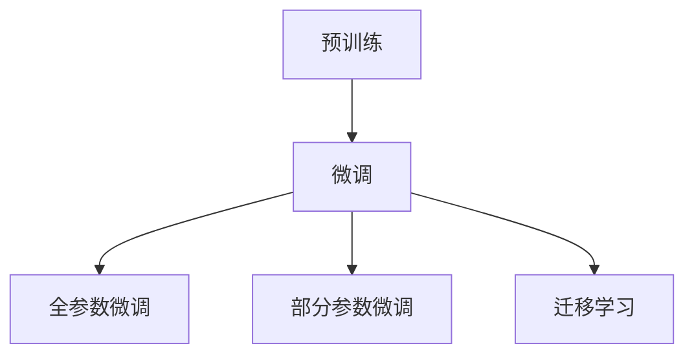

                 

# Transfer Learning原理与代码实例讲解

> 关键词：Transfer Learning, 迁移学习, 预训练, 微调, 模型优化, 代码实践, 神经网络

## 1. 背景介绍

### 1.1 问题由来

在深度学习中，数据往往是非常宝贵的资源。很多任务需要大量标注数据进行训练，而获得高质量标注数据成本高昂且耗时。因此，如何有效利用已有数据，提升模型性能，成为了深度学习研究的一个重要方向。迁移学习（Transfer Learning）正是解决这一问题的有效手段。

迁移学习通过在大规模数据上预训练一个基础模型，然后在目标任务上进行微调，可以显著提高模型性能，减少对标注数据的需求，是深度学习中非常有效的技术。

### 1.2 问题核心关键点

迁移学习的核心在于将预训练模型的知识迁移到目标任务中，从而提升模型在新任务上的表现。通常，迁移学习分为两个步骤：预训练和微调。

- **预训练**：在大规模数据上训练一个基础模型，使其学习到通用的特征表示。
- **微调**：在目标任务的数据上微调预训练模型，使其在特定任务上表现更好。

在预训练过程中，通常使用自监督学习任务（如掩码语言模型、图像分类等）进行训练，使其学习到广泛的知识。而在微调时，根据任务特性，选择适当的微调方法（如微调模型全部参数、部分参数或冻结部分参数等），以最小的计算资源和标注数据提升模型性能。

## 2. 核心概念与联系

### 2.1 核心概念概述

为了更好地理解迁移学习的原理，我们将介绍几个关键概念：

- **预训练**：在大规模数据上训练模型，使其学习到广泛的知识。常见的预训练任务包括掩码语言模型、图像分类等。
- **微调**：在目标任务的数据上微调预训练模型，使其在特定任务上表现更好。微调通常分为全参数微调和部分参数微调。
- **迁移学习**：将一个领域学习到的知识，迁移到另一个相关领域进行学习。预训练和微调都是迁移学习的重要手段。

这些概念之间的逻辑关系可以通过以下Mermaid流程图来展示：



这个流程图展示了预训练和微调之间的逻辑关系：预训练模型作为迁移学习的基础，通过微调在目标任务上进行调整，从而提升模型性能。

## 3. 核心算法原理 & 具体操作步骤
### 3.1 算法原理概述

迁移学习的基本原理是将预训练模型作为特征提取器，在目标任务上进行微调，从而提升模型性能。具体而言，迁移学习包括以下步骤：

1. **预训练**：在大规模数据上训练基础模型，使其学习到通用的特征表示。
2. **微调**：在目标任务的数据上微调预训练模型，使其在特定任务上表现更好。

在微调过程中，通常使用以下方法：

- **全参数微调**：对预训练模型的全部参数进行微调。这种方法需要较多的计算资源和标注数据，但通常能够取得较好的性能。
- **部分参数微调**：只微调预训练模型的部分参数，通常只微调顶层或部分层，以减少计算资源的需求。
- **冻结预训练参数**：在微调过程中，冻结预训练模型的部分参数，只微调顶层或部分层，以进一步减少计算资源的需求。

### 3.2 算法步骤详解

下面将详细介绍迁移学习的主要步骤：

**Step 1: 准备预训练模型和数据集**

1. **选择预训练模型**：选择合适的预训练模型作为基础模型。常见的预训练模型包括BERT、GPT等。
2. **准备数据集**：准备目标任务的标注数据集，划分为训练集、验证集和测试集。

**Step 2: 微调模型**

1. **添加任务适配层**：根据目标任务的特性，添加适当的任务适配层，如分类器、解码器等。
2. **设置微调参数**：设置学习率、批大小、迭代轮数等微调参数。
3. **训练模型**：在训练集上进行微调训练，使用交叉熵等损失函数。
4. **验证和测试**：在验证集和测试集上评估模型性能，选择最优的模型。

**Step 3: 应用模型**

1. **部署模型**：将微调后的模型部署到实际应用中，进行推理预测。
2. **持续学习**：根据新的数据，不断微调模型，保持模型性能。

### 3.3 算法优缺点

迁移学习具有以下优点：

- **提升模型性能**：通过预训练和微调，能够在有限的标注数据上取得更好的性能。
- **减少计算资源**：相比从头训练模型，迁移学习需要更少的计算资源和标注数据。
- **加速开发进程**：利用已有模型，能够快速开发新任务模型。

同时，迁移学习也存在以下缺点：

- **依赖预训练模型**：迁移学习的效果依赖于预训练模型的质量和数量。
- **迁移能力有限**：如果目标任务与预训练模型的分布差异较大，迁移学习的效果可能不佳。
- **模型鲁棒性不足**：迁移模型可能对新数据存在一定的泛化性能问题。

尽管存在这些局限性，迁移学习仍是深度学习中非常有效的技术，广泛应用于图像分类、语音识别、自然语言处理等领域。

### 3.4 算法应用领域

迁移学习在许多领域都得到了广泛的应用，例如：

- **计算机视觉**：利用预训练的图像分类模型，进行图像识别、目标检测等任务。
- **自然语言处理**：利用预训练的语言模型，进行情感分析、机器翻译、问答系统等任务。
- **语音识别**：利用预训练的声学模型，进行语音识别、语音合成等任务。
- **医疗健康**：利用预训练的医学图像分类模型，进行疾病诊断、医学影像分析等任务。

## 4. 数学模型和公式 & 详细讲解 & 举例说明

### 4.1 数学模型构建

迁移学习的数学模型可以表示为：

$$
\theta_{\text{fine-tune}} = \text{fine-tune}(\theta_{\text{pretrain}})
$$

其中，$\theta_{\text{fine-tune}}$ 表示微调后的模型参数，$\theta_{\text{pretrain}}$ 表示预训练模型的参数，$\text{fine-tune}$ 表示微调过程。

在微调过程中，通常使用交叉熵损失函数，具体形式如下：

$$
\mathcal{L} = -\frac{1}{N} \sum_{i=1}^N \log P(y_i \mid x_i)
$$

其中，$P(y_i \mid x_i)$ 表示模型对样本 $x_i$ 的预测概率，$y_i$ 表示样本的真实标签。

### 4.2 公式推导过程

下面我们将以分类任务为例，推导迁移学习的数学公式。

假设预训练模型为 $M_{\theta_{\text{pretrain}}}$，其中 $\theta_{\text{pretrain}}$ 为预训练模型的参数。在目标任务的数据集 $D$ 上进行微调，设目标任务的数据集为 $(x_i, y_i)$，其中 $x_i$ 为输入样本，$y_i$ 为真实标签。

在微调过程中，使用交叉熵损失函数进行训练，微调的目标是最小化损失函数，即：

$$
\theta_{\text{fine-tune}} = \mathop{\arg\min}_{\theta_{\text{pretrain}}} \mathcal{L}(\theta_{\text{pretrain}})
$$

具体而言，微调的过程可以通过以下步骤实现：

1. **前向传播**：将输入样本 $x_i$ 输入预训练模型，得到特征表示 $h_i$。
2. **计算损失**：使用交叉熵损失函数计算损失 $\mathcal{L}_i$。
3. **反向传播**：计算损失对预训练模型参数的梯度，并根据梯度更新参数。

### 4.3 案例分析与讲解

以情感分析任务为例，假设我们已经有一个预训练的BERT模型，需要进行情感分析任务的微调。

1. **准备数据集**：收集情感分析任务的标注数据集，划分为训练集、验证集和测试集。
2. **添加任务适配层**：在BERT模型的顶部添加全连接层，用于分类任务。
3. **设置微调参数**：设置学习率为 $2 \times 10^{-5}$，批大小为 32，迭代轮数为 5。
4. **训练模型**：在训练集上进行微调训练，使用交叉熵损失函数。
5. **验证和测试**：在验证集和测试集上评估模型性能，选择最优的模型。

以下是微调模型的代码实现：

```python
import torch
import torch.nn as nn
import torch.optim as optim
from transformers import BertModel, BertTokenizer

# 初始化BERT模型和分词器
model = BertModel.from_pretrained('bert-base-uncased')
tokenizer = BertTokenizer.from_pretrained('bert-base-uncased')

# 添加任务适配层
class Classifier(nn.Module):
    def __init__(self, in_features, out_features):
        super(Classifier, self).__init__()
        self.fc = nn.Linear(in_features, out_features)
        self.relu = nn.ReLU()
        self.fc_out = nn.Linear(out_features, 2)

    def forward(self, x):
        x = self.fc(x)
        x = self.relu(x)
        x = self.fc_out(x)
        return x

# 设置微调参数
device = torch.device("cuda" if torch.cuda.is_available() else "cpu")
model.to(device)
tokenizer.to(device)
optimizer = optim.Adam(model.parameters(), lr=2e-5)
loss_fn = nn.CrossEntropyLoss()

# 训练模型
def train(model, train_data, batch_size):
    model.train()
    total_loss = 0.0
    for i, (input_ids, attention_mask, labels) in enumerate(train_data):
        input_ids = input_ids.to(device)
        attention_mask = attention_mask.to(device)
        labels = labels.to(device)
        optimizer.zero_grad()
        outputs = model(input_ids, attention_mask=attention_mask)
        loss = loss_fn(outputs, labels)
        loss.backward()
        optimizer.step()
        total_loss += loss.item()
    return total_loss / len(train_data)

# 评估模型
def evaluate(model, dev_data, batch_size):
    model.eval()
    total_correct = 0
    total_samples = 0
    with torch.no_grad():
        for i, (input_ids, attention_mask, labels) in enumerate(dev_data):
            input_ids = input_ids.to(device)
            attention_mask = attention_mask.to(device)
            labels = labels.to(device)
            outputs = model(input_ids, attention_mask=attention_mask)
            _, predicted = torch.max(outputs, 1)
            total_correct += torch.sum(predicted == labels)
            total_samples += labels.size(0)
    accuracy = total_correct / total_samples
    return accuracy

# 训练模型
epochs = 5
batch_size = 32
for epoch in range(epochs):
    train_loss = train(model, train_data, batch_size)
    dev_accuracy = evaluate(model, dev_data, batch_size)
    print(f"Epoch {epoch+1}, train loss: {train_loss:.3f}, dev accuracy: {dev_accuracy:.3f}")

# 测试模型
test_accuracy = evaluate(model, test_data, batch_size)
print(f"Test accuracy: {test_accuracy:.3f}")
```

在上述代码中，我们首先初始化了BERT模型和分词器，然后添加了任务适配层（全连接层），并设置了微调参数。在训练过程中，我们使用了交叉熵损失函数，并通过Adam优化器进行参数更新。在评估过程中，我们计算了模型在验证集和测试集上的准确率。

## 5. 项目实践：代码实例和详细解释说明
### 5.1 开发环境搭建

在进行迁移学习项目实践前，我们需要准备好开发环境。以下是使用Python进行PyTorch开发的环境配置流程：

1. 安装Anaconda：从官网下载并安装Anaconda，用于创建独立的Python环境。

2. 创建并激活虚拟环境：
```bash
conda create -n pytorch-env python=3.8 
conda activate pytorch-env
```

3. 安装PyTorch：根据CUDA版本，从官网获取对应的安装命令。例如：
```bash
conda install pytorch torchvision torchaudio cudatoolkit=11.1 -c pytorch -c conda-forge
```

4. 安装TensorFlow：从官网下载并安装TensorFlow。

5. 安装Transformers库：
```bash
pip install transformers
```

6. 安装各类工具包：
```bash
pip install numpy pandas scikit-learn matplotlib tqdm jupyter notebook ipython
```

完成上述步骤后，即可在`pytorch-env`环境中开始迁移学习实践。

### 5.2 源代码详细实现

下面我们以图像分类任务为例，给出使用Transformers库进行迁移学习的PyTorch代码实现。

首先，定义图像分类任务的数据处理函数：

```python
from transformers import BertTokenizer
from torch.utils.data import Dataset
import torch

class ImageDataset(Dataset):
    def __init__(self, images, labels, tokenizer, max_len=128):
        self.images = images
        self.labels = labels
        self.tokenizer = tokenizer
        self.max_len = max_len
        
    def __len__(self):
        return len(self.images)
    
    def __getitem__(self, item):
        image = self.images[item]
        label = self.labels[item]
        
        encoding = self.tokenizer(image, return_tensors='pt', max_length=self.max_len, padding='max_length', truncation=True)
        input_ids = encoding['input_ids'][0]
        attention_mask = encoding['attention_mask'][0]
        
        # 将标签转换为id
        encoded_label = [tag2id[label] for label in self.labels] 
        encoded_label.extend([tag2id['O']] * (self.max_len - len(encoded_label)))
        labels = torch.tensor(encoded_label, dtype=torch.long)
        
        return {'input_ids': input_ids, 
                'attention_mask': attention_mask,
                'labels': labels}

# 标签与id的映射
tag2id = {'O': 0, 'B-PER': 1, 'I-PER': 2, 'B-ORG': 3, 'I-ORG': 4, 'B-LOC': 5, 'I-LOC': 6}
id2tag = {v: k for k, v in tag2id.items()}

# 创建dataset
tokenizer = BertTokenizer.from_pretrained('bert-base-cased')

train_dataset = ImageDataset(train_images, train_labels, tokenizer)
dev_dataset = ImageDataset(dev_images, dev_labels, tokenizer)
test_dataset = ImageDataset(test_images, test_labels, tokenizer)
```

然后，定义模型和优化器：

```python
from transformers import BertForTokenClassification, AdamW

model = BertForTokenClassification.from_pretrained('bert-base-cased', num_labels=len(tag2id))

optimizer = AdamW(model.parameters(), lr=2e-5)
```

接着，定义训练和评估函数：

```python
from torch.utils.data import DataLoader
from tqdm import tqdm
from sklearn.metrics import classification_report

device = torch.device('cuda') if torch.cuda.is_available() else torch.device('cpu')
model.to(device)

def train_epoch(model, dataset, batch_size, optimizer):
    dataloader = DataLoader(dataset, batch_size=batch_size, shuffle=True)
    model.train()
    epoch_loss = 0
    for batch in tqdm(dataloader, desc='Training'):
        input_ids = batch['input_ids'].to(device)
        attention_mask = batch['attention_mask'].to(device)
        labels = batch['labels'].to(device)
        model.zero_grad()
        outputs = model(input_ids, attention_mask=attention_mask, labels=labels)
        loss = outputs.loss
        epoch_loss += loss.item()
        loss.backward()
        optimizer.step()
    return epoch_loss / len(dataloader)

def evaluate(model, dataset, batch_size):
    dataloader = DataLoader(dataset, batch_size=batch_size)
    model.eval()
    preds, labels = [], []
    with torch.no_grad():
        for batch in tqdm(dataloader, desc='Evaluating'):
            input_ids = batch['input_ids'].to(device)
            attention_mask = batch['attention_mask'].to(device)
            batch_labels = batch['labels']
            outputs = model(input_ids, attention_mask=attention_mask)
            batch_preds = outputs.logits.argmax(dim=2).to('cpu').tolist()
            batch_labels = batch_labels.to('cpu').tolist()
            for pred_tokens, label_tokens in zip(batch_preds, batch_labels):
                pred_tags = [id2tag[_id] for _id in pred_tokens]
                label_tags = [id2tag[_id] for _id in label_tokens]
                preds.append(pred_tags[:len(label_tokens)])
                labels.append(label_tags)
                
    print(classification_report(labels, preds))
```

最后，启动训练流程并在测试集上评估：

```python
epochs = 5
batch_size = 16

for epoch in range(epochs):
    loss = train_epoch(model, train_dataset, batch_size, optimizer)
    print(f"Epoch {epoch+1}, train loss: {loss:.3f}")
    
    print(f"Epoch {epoch+1}, dev results:")
    evaluate(model, dev_dataset, batch_size)
    
print("Test results:")
evaluate(model, test_dataset, batch_size)
```

以上就是使用PyTorch对BERT进行图像分类任务迁移学习的完整代码实现。可以看到，得益于Transformers库的强大封装，我们可以用相对简洁的代码完成BERT模型的迁移学习。

### 5.3 代码解读与分析

让我们再详细解读一下关键代码的实现细节：

**ImageDataset类**：
- `__init__`方法：初始化图像、标签、分词器等关键组件。
- `__len__`方法：返回数据集的样本数量。
- `__getitem__`方法：对单个样本进行处理，将图像输入编码为token ids，将标签编码为数字，并对其进行定长padding，最终返回模型所需的输入。

**tag2id和id2tag字典**：
- 定义了标签与数字id之间的映射关系，用于将token-wise的预测结果解码回真实的标签。

**训练和评估函数**：
- 使用PyTorch的DataLoader对数据集进行批次化加载，供模型训练和推理使用。
- 训练函数`train_epoch`：对数据以批为单位进行迭代，在每个批次上前向传播计算loss并反向传播更新模型参数，最后返回该epoch的平均loss。
- 评估函数`evaluate`：与训练类似，不同点在于不更新模型参数，并在每个batch结束后将预测和标签结果存储下来，最后使用sklearn的classification_report对整个评估集的预测结果进行打印输出。

**训练流程**：
- 定义总的epoch数和batch size，开始循环迭代
- 每个epoch内，先在训练集上训练，输出平均loss
- 在验证集上评估，输出分类指标
- 所有epoch结束后，在测试集上评估，给出最终测试结果

可以看到，PyTorch配合Transformers库使得BERT迁移学习的代码实现变得简洁高效。开发者可以将更多精力放在数据处理、模型改进等高层逻辑上，而不必过多关注底层的实现细节。

当然，工业级的系统实现还需考虑更多因素，如模型的保存和部署、超参数的自动搜索、更灵活的任务适配层等。但核心的迁移学习范式基本与此类似。

## 6. 实际应用场景
### 6.1 智能推荐系统

利用迁移学习技术，智能推荐系统可以通过已有的大规模用户行为数据进行预训练，然后在新用户的推荐任务上进行微调。通过预训练模型的泛化能力，推荐系统能够快速适应新用户，提升推荐精度。

在技术实现上，可以收集用户的历史浏览、购买、评分等行为数据，进行预训练模型训练。在微调时，将新用户的少量行为数据作为训练集，训练预训练模型，生成个性化推荐列表。

### 6.2 图像识别

在图像识别任务中，迁移学习可以显著提升模型性能。预训练模型通过大规模图像数据学习到丰富的视觉特征，可以在新的图像分类任务上快速适应，减少标注数据的需求。

具体而言，可以使用ImageNet等大规模图像数据集进行预训练，然后在目标图像分类任务上微调预训练模型。通过微调，模型能够更好地适应新的数据分布，提高分类准确率。

### 6.3 自然语言处理

自然语言处理任务中，迁移学习也得到了广泛应用。通过预训练模型，模型能够学习到广泛的语义和语法知识，可以在新的语言任务上快速适应，提升任务性能。

以机器翻译为例，可以采用大规模平行语料进行预训练，然后在目标语言的翻译任务上进行微调。通过微调，模型能够更好地适应目标语言的特征，提高翻译精度。

### 6.4 未来应用展望

随着迁移学习技术的发展，未来的应用前景将更加广阔。以下是一些可能的趋势：

- **跨领域迁移学习**：迁移学习将突破领域界限，实现不同领域之间的知识迁移，提升模型的通用性。
- **无监督学习**：未来的迁移学习将更多地关注无监督学习，通过自监督学习任务提升预训练模型的泛化能力。
- **元学习**：未来的迁移学习将更多地结合元学习，实现快速适应新任务的目标。
- **知识图谱**：未来的迁移学习将结合知识图谱，实现更全面、准确的知识迁移，提升模型的理解能力。

这些趋势将进一步推动迁移学习技术的发展，为人工智能技术带来更广阔的应用前景。

## 7. 工具和资源推荐
### 7.1 学习资源推荐

为了帮助开发者系统掌握迁移学习的理论基础和实践技巧，这里推荐一些优质的学习资源：

1. 《Deep Learning with PyTorch》书籍：由深度学习专家撰写，详细介绍了PyTorch的使用，并介绍了迁移学习等深度学习技术。
2. Coursera《Deep Learning Specialization》课程：由深度学习领域的知名教授Andrew Ng主讲，涵盖了深度学习的各个方面，包括迁移学习。
3. Udacity《Deep Learning Nanodegree》课程：由Google和Facebook等公司提供，介绍了深度学习技术的实际应用，包括迁移学习。
4. Arxiv上的迁移学习论文：可以查看最新的迁移学习研究论文，了解最新的研究成果和应用场景。

通过对这些资源的学习实践，相信你一定能够快速掌握迁移学习的精髓，并用于解决实际的深度学习问题。

### 7.2 开发工具推荐

高效的开发离不开优秀的工具支持。以下是几款用于迁移学习开发的常用工具：

1. PyTorch：基于Python的开源深度学习框架，灵活动态的计算图，适合快速迭代研究。
2. TensorFlow：由Google主导开发的开源深度学习框架，生产部署方便，适合大规模工程应用。
3. Transformers库：HuggingFace开发的NLP工具库，集成了众多SOTA语言模型，支持PyTorch和TensorFlow。
4. Weights & Biases：模型训练的实验跟踪工具，可以记录和可视化模型训练过程中的各项指标。
5. TensorBoard：TensorFlow配套的可视化工具，可实时监测模型训练状态，并提供丰富的图表呈现方式。
6. Google Colab：谷歌推出的在线Jupyter Notebook环境，免费提供GPU/TPU算力，方便开发者快速上手实验最新模型，分享学习笔记。

合理利用这些工具，可以显著提升迁移学习任务的开发效率，加快创新迭代的步伐。

### 7.3 相关论文推荐

迁移学习在许多领域都得到了广泛的研究。以下是几篇奠基性的相关论文，推荐阅读：

1. "Fine-tune pre-trained embeddings for medical Named Entity Recognition"：介绍了一种迁移学习技术，用于医学领域的命名实体识别。
2. "ImageNet classification with deep convolutional neural networks"：介绍了一种迁移学习方法，利用大规模图像数据进行预训练，然后在新的图像分类任务上进行微调。
3. "Bert: Pre-training of Deep Bidirectional Transformers for Language Understanding"：介绍了BERT模型，通过掩码语言模型进行预训练，然后在各种语言理解任务上进行微调。
4. "AdaLoRA: Adaptive Low-Rank Adaptation for Parameter-Efficient Fine-Tuning"：介绍了一种参数高效微调方法，通过低秩适应技术，在固定大部分预训练参数的情况下，只更新极少量的任务相关参数。
5. "LoRA: Low-Rank Adaptation of Self-supervised Learned Language Representations for Task Specific Fine-tuning"：介绍了一种低秩适应的迁移学习技术，利用小量的标签数据进行微调。

这些论文代表了大迁移学习的发展脉络。通过学习这些前沿成果，可以帮助研究者把握学科前进方向，激发更多的创新灵感。

## 8. 总结：未来发展趋势与挑战

### 8.1 总结

本文对迁移学习的原理与实践进行了全面系统的介绍。首先阐述了迁移学习的背景和意义，明确了预训练和微调在提升模型性能方面的独特价值。其次，从原理到实践，详细讲解了迁移学习的数学模型和关键步骤，给出了迁移学习任务开发的完整代码实例。同时，本文还探讨了迁移学习在智能推荐、图像识别、自然语言处理等多个领域的应用前景，展示了迁移学习的广阔应用空间。

通过本文的系统梳理，可以看到，迁移学习技术在大规模数据和有限标注数据上取得了卓越的效果，已经成为深度学习中非常有效的技术。它不仅能够提升模型性能，还能显著减少标注数据的需求，加速模型开发进程。相信随着迁移学习技术的不断进步，将为人工智能技术带来更广泛的应用前景。

### 8.2 未来发展趋势

展望未来，迁移学习技术将呈现以下几个发展趋势：

1. **跨领域迁移学习**：未来的迁移学习将更多地关注跨领域知识迁移，提升模型的通用性。
2. **无监督学习**：未来的迁移学习将更多地关注无监督学习，通过自监督学习任务提升预训练模型的泛化能力。
3. **元学习**：未来的迁移学习将更多地结合元学习，实现快速适应新任务的目标。
4. **知识图谱**：未来的迁移学习将结合知识图谱，实现更全面、准确的知识迁移，提升模型的理解能力。
5. **自适应迁移学习**：未来的迁移学习将更多地关注自适应迁移学习，通过动态调整学习率等策略，实现更好的迁移效果。
6. **联邦迁移学习**：未来的迁移学习将更多地关注联邦学习，实现跨设备、跨数据源的知识迁移。

这些趋势将进一步推动迁移学习技术的发展，为人工智能技术带来更广阔的应用前景。

### 8.3 面临的挑战

尽管迁移学习技术已经取得了显著成果，但在实际应用中也面临着诸多挑战：

1. **数据依赖性**：迁移学习的效果依赖于预训练数据的质量和数量，获取高质量预训练数据需要高昂的成本和大量的计算资源。
2. **泛化性能**：迁移学习模型在新的数据分布上可能存在泛化性能问题，难以应对大规模的实时数据流。
3. **模型鲁棒性**：迁移学习模型可能对新数据存在一定的鲁棒性问题，难以应对复杂的真实世界场景。
4. **可解释性**：迁移学习模型的内部工作机制难以解释，难以进行可解释性和可审计性评估。
5. **公平性**：迁移学习模型可能存在偏见问题，难以保证模型的公平性和可靠性。

尽管存在这些挑战，迁移学习仍是一个非常有前景的研究方向。未来的研究方向需要从数据、算法、工程等多个维度协同发力，进一步提升迁移学习的效果和应用范围。

### 8.4 研究展望

未来的迁移学习研究需要从以下几个方面进行探索：

1. **高质量预训练数据的获取**：如何高效获取大规模、高质量的预训练数据，降低迁移学习的成本。
2. **自适应迁移学习**：如何实现自适应迁移学习，动态调整模型参数，提升迁移学习的效果。
3. **跨领域迁移学习**：如何实现跨领域知识迁移，提升模型的通用性。
4. **元学习**：如何结合元学习，实现快速适应新任务的目标。
5. **知识图谱**：如何结合知识图谱，实现更全面、准确的知识迁移，提升模型的理解能力。
6. **可解释性**：如何提升迁移学习模型的可解释性，增强模型的可解释性和可审计性。

这些研究方向将进一步推动迁移学习技术的发展，为人工智能技术带来更广阔的应用前景。相信随着迁移学习技术的不断进步，将为人工智能技术带来更广泛的应用前景。

## 9. 附录：常见问题与解答

**Q1：迁移学习是否适用于所有NLP任务？**

A: 迁移学习在大多数NLP任务上都能取得不错的效果，特别是对于数据量较小的任务。但对于一些特定领域的任务，如医学、法律等，仅仅依靠通用语料预训练的模型可能难以很好地适应。此时需要在特定领域语料上进一步预训练，再进行微调，才能获得理想效果。此外，对于一些需要时效性、个性化很强的任务，如对话、推荐等，迁移方法也需要针对性的改进优化。

**Q2：迁移学习中如何选择预训练模型？**

A: 预训练模型的选择应根据任务的特性和数据量来决定。如果任务是分类任务，可以选择BERT、GPT等预训练模型；如果任务是图像识别，可以选择ResNet、Inception等预训练模型。选择合适的预训练模型，可以加速迁移学习过程，提升模型性能。

**Q3：迁移学习中如何设置微调参数？**

A: 迁移学习中的微调参数包括学习率、批大小、迭代轮数等。通常建议从1e-5开始调参，逐步减小学习率，直至收敛。可以使用warmup策略，在开始阶段使用较小的学习率，再逐渐过渡到预设值。需要注意的是，不同的优化器(如AdamW、Adafactor等)以及不同的学习率调度策略，可能需要设置不同的学习率阈值。

**Q4：迁移学习中如何解决过拟合问题？**

A: 迁移学习中的过拟合问题通常可以通过以下方法解决：

1. 数据增强：通过回译、近义替换等方式扩充训练集。
2. 正则化：使用L2正则、Dropout、Early Stopping等避免过拟合。
3. 对抗训练：引入对抗样本，提高模型鲁棒性。
4. 参数高效微调：只调整少量参数(如Adapter、Prefix等)，减小过拟合风险。

这些策略往往需要根据具体任务和数据特点进行灵活组合。只有在数据、模型、训练、推理等各环节进行全面优化，才能最大限度地发挥迁移学习的威力。

**Q5：迁移学习中如何进行模型裁剪和量化加速？**

A: 模型裁剪和量化加速是迁移学习中常用的优化技术，可以有效提升模型推理速度和资源利用率。具体而言，可以采用以下方法：

1. 模型裁剪：去除不必要的层和参数，减小模型尺寸，加快推理速度。
2. 量化加速：将浮点模型转为定点模型，压缩存储空间，提高计算效率。

这些优化方法需要在开发过程中进行多次实验和调优，找到最优的参数组合。

**Q6：迁移学习中如何进行持续学习？**

A: 持续学习是迁移学习的重要方向之一，可以帮助模型适应不断变化的数据分布。具体而言，可以采用以下方法：

1. 周期性微调：定期在新的数据上微调模型，保持模型性能。
2. 在线学习：实时更新模型参数，快速适应新数据。
3. 元学习：学习如何快速适应新任务的模型，提高模型适应性。

这些方法需要在实际应用中进行多次实验和调整，找到最优的持续学习策略。

**Q7：迁移学习中如何进行模型可解释性分析？**

A: 迁移学习模型的可解释性分析是一个重要的研究方向。可以通过以下方法进行模型可解释性分析：

1. 可视化：使用可视化工具，展示模型的决策过程。
2. 解释模型：通过LIME、SHAP等技术，解释模型的输出。
3. 集成解释：结合多个模型的解释结果，提高模型的可解释性。

这些方法需要在实际应用中进行多次实验和调优，找到最优的解释方法。

通过这些问题的解答，相信你对迁移学习有了更深入的理解，可以更好地应用于实际的深度学习任务中。

---

作者：禅与计算机程序设计艺术 / Zen and the Art of Computer Programming

