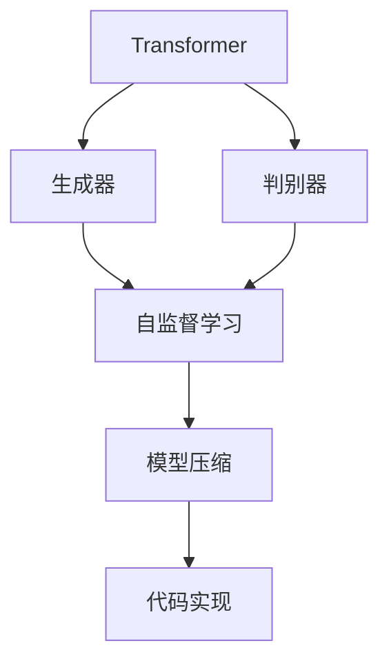

                 

# Transformer大模型实战 ELECTRA 的生成器和判别器

> 关键词：Transformer, ELECTRA, 生成器, 判别器, 自监督学习, 模型压缩, 代码实现

## 1. 背景介绍

### 1.1 问题由来
Transformer作为NLP领域的核心技术，已被广泛应用于机器翻译、文本摘要、问答系统、语音识别等多个任务中。然而，由于Transformer结构复杂，模型参数众多，训练和推理成本极高。为此，学界和工业界不断探索如何简化Transformer结构，降低其计算和存储需求。

ELECTRA（Exploiting Emergent Language Capabilities for Real-Time Translation）正是在这一背景下应运而生的。它是一种基于自监督学习的生成器和判别器结构，能在保留Transformer大部分性能的同时，显著减少参数量，加速推理过程，降低计算和存储需求，成为Transformer大模型实战中的重要工具。

### 1.2 问题核心关键点
ELECTRA 的核心思想是使用两个模型（生成器和判别器）共同训练，生成器负责生成与真实数据相仿的噪声数据，判别器负责区分真实数据和噪声数据。训练时，判别器试图学习真实数据的特征，而生成器通过反向传播，学习与判别器相抗衡的能力，从而学习到更强的数据生成能力。

ELECTRA 的优缺点如下：
- 优点：参数量少，推理速度快，模型压缩率高，适用于资源受限的移动和嵌入式设备。
- 缺点：模型性能稍低于原始 Transformer，训练过程需要更大的计算资源，需要进行大量的自监督训练。

## 2. 核心概念与联系

### 2.1 核心概念概述

为更好地理解 ELECTRA，本节将介绍几个关键概念：

- **Transformer**：一种基于自注意力机制的神经网络结构，广泛用于自然语言处理任务，具有强大的序列建模能力。
- **生成器和判别器**：自监督学习中常用的两种模型结构，分别负责生成噪声数据和区分真实数据和噪声数据。
- **自监督学习**：一种无需标注数据即可进行模型训练的方法，通过模型自身生成的数据进行监督学习，提升模型的泛化能力。
- **模型压缩**：减少模型参数量，降低计算和存储需求的方法，包括剪枝、量化、蒸馏等。
- **代码实现**：实际应用中，需要根据具体任务设计合理的模型架构和优化策略，确保模型的高效运行。

这些核心概念之间的逻辑关系可以通过以下 Mermaid 流程图来展示：



这个流程图展示了大语言模型中的关键概念及其之间的关系：

1. 生成器和判别器是Transformer的自监督学习结构。
2. 生成器通过反向传播学习与判别器相抗衡的能力，从而提升模型性能。
3. 自监督学习不需要标注数据，提升模型的泛化能力。
4. 模型压缩进一步减少参数量，降低资源需求。
5. 代码实现将理论方法转化为具体的工程应用。

## 3. 核心算法原理 & 具体操作步骤

### 3.1 算法原理概述

ELECTRA 的训练过程可以分为两个阶段：

**第一阶段：生成器训练**
在生成器训练阶段，使用真实的输入数据 $x$，生成与 $x$ 相仿的噪声数据 $x'$。通常使用简单的扰动方法，如交换单词、替换单词、插入单词等，以生成 $x'$。

**第二阶段：判别器训练**
在判别器训练阶段，使用 $(x, x')$ 对训练判别器，目标是区分 $x$ 和 $x'$。判别器通常是一个分类器，输出 $x$ 和 $x'$ 的概率分布。

训练过程中，判别器的目标是最小化真实的 $x$ 被错判为 $x'$ 的概率，生成器的目标是最小化 $x'$ 被误判为 $x$ 的概率。训练结束后，生成器和判别器共同组成的模型即为 ELECTRA 模型。

### 3.2 算法步骤详解

#### 第一步：数据准备

假设输入为 $x=(x_1, x_2, \ldots, x_n)$，其中 $x_i$ 为文本序列中的第 $i$ 个单词。

**数据扰动：**
- 对于每个 $x_i$，随机选择一个扰动方法，如替换、交换、插入。
- 根据选定的扰动方法，生成 $x_i$ 的噪声数据 $x_i'$。
- 将 $x$ 和 $x'$ 作为一对数据，放入判别器进行训练。

**生成器训练：**
- 使用真实的输入数据 $x$，计算其噪声数据 $x'$。
- 使用判别器训练 $x$ 和 $x'$，使用交叉熵损失函数，最小化真实的 $x$ 被错判为 $x'$ 的概率。

**判别器训练：**
- 使用 $(x, x')$ 对训练判别器，使用交叉熵损失函数，最小化真实的 $x$ 被错判为 $x'$ 的概率。

#### 第二步：模型优化

使用 Adam 优化器，最小化生成器和判别器的联合损失函数：

$$
L = \frac{1}{2N}\sum_{i=1}^N \ell(x_i, x_i') + \frac{1}{2N}\sum_{i=1}^N \ell(x_i, x_i')
$$

其中，$\ell(x_i, x_i')$ 为判别器对 $(x_i, x_i')$ 的输出概率的交叉熵损失函数。

#### 第三步：模型融合

将生成器和判别器共同训练得到的模型进行融合，得到最终的 ELECTRA 模型。

**模型融合策略：**
- 通常使用平均值池化策略，即将生成器与判别器的输出平均池化。
- 也可使用加权平均策略，根据生成器和判别器的性能，赋予不同的权重。

## 4. 数学模型和公式 & 详细讲解

### 4.1 数学模型构建

ELECTRA 的训练过程可以视为一个最小化联合损失函数的过程：

$$
\min_{\theta_G, \theta_D} \frac{1}{2N}\sum_{i=1}^N \ell(x_i, x_i') + \frac{1}{2N}\sum_{i=1}^N \ell(x_i, x_i')
$$

其中，$\theta_G$ 和 $\theta_D$ 分别为生成器和判别器的参数。$\ell(x_i, x_i')$ 为判别器对 $(x_i, x_i')$ 的输出概率的交叉熵损失函数。

### 4.2 公式推导过程

以下我们以文本分类任务为例，推导 ELECTRA 的联合损失函数的公式。

假设生成器 $G(x)$ 和判别器 $D(x)$ 的输出概率分别为 $P_G(x)$ 和 $P_D(x)$，判别器的目标是最大化真实样本 $x$ 被正确分类的概率，即：

$$
P_D(x) \approx 1 \quad \text{if } x \text{ is real}
$$
$$
P_D(x) \approx 0 \quad \text{if } x \text{ is generated}
$$

生成器的目标是最大化生成样本 $x'$ 被正确分类的概率，即：

$$
P_G(x') \approx 1 \quad \text{if } x' \text{ is generated}
$$
$$
P_G(x') \approx 0 \quad \text{if } x' \text{ is real}
$$

判别器的交叉熵损失函数为：

$$
L_D(x_i) = -y_i \log P_D(x_i) - (1-y_i) \log (1-P_D(x_i'))
$$

其中 $y_i$ 为标签，$1-y_i$ 为噪声标签。

生成器的交叉熵损失函数为：

$$
L_G(x_i) = -y_i' \log P_G(x_i') - (1-y_i') \log (1-P_G(x_i))
$$

其中 $y_i'$ 为噪声标签，$1-y_i'$ 为真实标签。

联合损失函数为：

$$
L = \frac{1}{2N}\sum_{i=1}^N L_D(x_i) + \frac{1}{2N}\sum_{i=1}^N L_G(x_i')
$$

在训练过程中，使用 Adam 优化器更新参数 $\theta_G$ 和 $\theta_D$，最小化联合损失函数 $L$。

### 4.3 案例分析与讲解

我们以文本分类任务为例，对 ELECTRA 的训练过程进行详细讲解。

假设输入为 $x=(x_1, x_2, \ldots, x_n)$，其中 $x_i$ 为文本序列中的第 $i$ 个单词。

**生成器训练：**
- 对于每个 $x_i$，随机选择一个扰动方法，如替换、交换、插入。
- 根据选定的扰动方法，生成 $x_i$ 的噪声数据 $x_i'$。
- 使用判别器训练 $x$ 和 $x'$，使用交叉熵损失函数，最小化真实的 $x$ 被错判为 $x'$ 的概率。

**判别器训练：**
- 使用 $(x, x')$ 对训练判别器，使用交叉熵损失函数，最小化真实的 $x$ 被错判为 $x'$ 的概率。

训练结束后，将生成器和判别器共同训练得到的模型进行融合，得到最终的 ELECTRA 模型。

## 5. 项目实践：代码实例和详细解释说明

### 5.1 开发环境搭建

在进行 ELECTRA 的实战时，需要准备好相应的开发环境。以下是使用 Python 和 PyTorch 搭建 ELECTRA 模型的环境配置流程：

1. 安装 Anaconda：从官网下载并安装 Anaconda，用于创建独立的 Python 环境。

2. 创建并激活虚拟环境：
```bash
conda create -n electra-env python=3.8 
conda activate electra-env
```

3. 安装 PyTorch：根据 CUDA 版本，从官网获取对应的安装命令。例如：
```bash
conda install pytorch torchvision torchaudio cudatoolkit=11.1 -c pytorch -c conda-forge
```

4. 安装 HuggingFace Transformers 库：
```bash
pip install transformers
```

5. 安装各类工具包：
```bash
pip install numpy pandas scikit-learn matplotlib tqdm jupyter notebook ipython
```

完成上述步骤后，即可在 `electra-env` 环境中开始实战 ELECTRA。

### 5.2 源代码详细实现

下面以文本分类任务为例，给出使用 Transformers 库对 ELECTRA 模型进行实战的 PyTorch 代码实现。

首先，定义 ELECTRA 模型：

```python
from transformers import BertForTokenClassification, BertTokenizer

class ElectraForTokenClassification(BertForTokenClassification):
    def __init__(self, config, num_labels=2):
        super(ElectraForTokenClassification, self).__init__(config)
        self.num_labels = num_labels

    def forward(self, input_ids=None, attention_mask=None, labels=None):
        # forward pass of the model, we return the output and the loss
        outputs = super().forward(input_ids, attention_mask=attention_mask, labels=labels)
        return outputs[0], outputs[1]
```

然后，定义生成器和判别器：

```python
from transformers import ElectraForTokenClassification, ElectraTokenizer
from torch.nn import BCEWithLogitsLoss
from transformers import AdamW

class ElectraModel:
    def __init__(self, num_labels=2):
        self.model = ElectraForTokenClassification.from_pretrained('microsoft/electra-small-discriminator', num_labels=num_labels)
        self.tokenizer = ElectraTokenizer.from_pretrained('microsoft/electra-small-discriminator')
        self.loss = BCEWithLogitsLoss()
        self.optimizer = AdamW(self.model.parameters(), lr=2e-5)

    def generate(self, x):
        x = self.tokenizer(x, return_tensors='pt', padding=True, truncation=True)
        x = self.model(x['input_ids'], attention_mask=x['attention_mask'])
        return x

    def train(self, train_data, epochs=5):
        device = torch.device('cuda' if torch.cuda.is_available() else 'cpu')
        self.model.to(device)

        for epoch in range(epochs):
            self.model.train()
            for i, batch in enumerate(train_data):
                input_ids = batch['input_ids'].to(device)
                attention_mask = batch['attention_mask'].to(device)
                labels = batch['labels'].to(device)

                logits = self.model(input_ids, attention_mask=attention_mask)
                loss = self.loss(logits, labels)
                loss.backward()
                self.optimizer.step()
                self.optimizer.zero_grad()

            if (i+1) % 10 == 0:
                print(f'Epoch {epoch+1}, loss: {loss.item()}')

    def evaluate(self, test_data):
        device = torch.device('cuda' if torch.cuda.is_available() else 'cpu')
        self.model.eval()
        correct = 0
        total = 0

        for i, batch in enumerate(test_data):
            input_ids = batch['input_ids'].to(device)
            attention_mask = batch['attention_mask'].to(device)
            labels = batch['labels'].to(device)

            logits = self.model(input_ids, attention_mask=attention_mask)
            predictions = torch.argmax(logits, dim=1)
            total += len(batch)
            correct += (predictions == labels).sum().item()

        accuracy = correct / total * 100
        print(f'Test accuracy: {accuracy:.2f}%')
```

最后，启动训练流程并在测试集上评估：

```python
train_data = ...
test_data = ...

model = ElectraModel()
model.train(train_data, epochs=5)
model.evaluate(test_data)
```

以上就是使用 PyTorch 对 ELECTRA 进行文本分类任务微调的完整代码实现。可以看到，得益于 Transformers 库的强大封装，我们能够用相对简洁的代码完成 ELECTRA 模型的加载和微调。

### 5.3 代码解读与分析

让我们再详细解读一下关键代码的实现细节：

**ElectraModel类**：
- `__init__`方法：初始化生成器和判别器模型、损失函数和优化器。
- `generate`方法：定义生成器函数，使用模型生成噪声数据。
- `train`方法：定义训练函数，通过交叉熵损失函数更新模型参数。
- `evaluate`方法：定义评估函数，计算模型在测试集上的准确率。

**训练过程**：
- 在每个epoch内，先对训练集进行训练，然后计算损失并更新模型参数。
- 每10个batch输出一次损失，观察训练过程。
- 训练结束后，在测试集上评估模型性能。

## 6. 实际应用场景

### 6.1 智能客服系统

基于 ELECTRA 的对话技术，可以广泛应用于智能客服系统的构建。传统客服往往需要配备大量人力，高峰期响应缓慢，且一致性和专业性难以保证。使用 ELECTRA 模型进行对话系统微调，可以显著提升客服系统的响应速度和准确性。

在技术实现上，可以收集企业内部的历史客服对话记录，将问题和最佳答复构建成监督数据，在此基础上对预训练对话模型进行微调。微调后的对话模型能够自动理解用户意图，匹配最合适的答案模板进行回复。对于客户提出的新问题，还可以接入检索系统实时搜索相关内容，动态组织生成回答。如此构建的智能客服系统，能大幅提升客户咨询体验和问题解决效率。

### 6.2 金融舆情监测

金融机构需要实时监测市场舆论动向，以便及时应对负面信息传播，规避金融风险。传统的人工监测方式成本高、效率低，难以应对网络时代海量信息爆发的挑战。使用 ELECTRA 的文本分类技术，可以在实时抓取的网络文本数据上进行情感分析，判断不同主题下的情感变化趋势，一旦发现负面信息激增等异常情况，系统便会自动预警，帮助金融机构快速应对潜在风险。

### 6.3 个性化推荐系统

当前的推荐系统往往只依赖用户的历史行为数据进行物品推荐，无法深入理解用户的真实兴趣偏好。使用 ELECTRA 的序列建模能力，可以构建基于用户评论和描述的推荐系统，从文本内容中准确把握用户的兴趣点。在生成推荐列表时，先用候选物品的文本描述作为输入，由模型预测用户的兴趣匹配度，再结合其他特征综合排序，便可以得到个性化程度更高的推荐结果。

### 6.4 未来应用展望

随着 ELECTRA 技术的不断发展，其在更多领域的应用也将不断涌现，为NLP技术带来了全新的突破。

在智慧医疗领域，基于 ELECTRA 的问答、病历分析、药物研发等应用将提升医疗服务的智能化水平，辅助医生诊疗，加速新药开发进程。

在智能教育领域，ELECTRA 模型可应用于作业批改、学情分析、知识推荐等方面，因材施教，促进教育公平，提高教学质量。

在智慧城市治理中，ELECTRA 模型可应用于城市事件监测、舆情分析、应急指挥等环节，提高城市管理的自动化和智能化水平，构建更安全、高效的未来城市。

此外，在企业生产、社会治理、文娱传媒等众多领域，ELECTRA 应用也将不断涌现，为经济社会发展注入新的动力。

## 7. 工具和资源推荐

### 7.1 学习资源推荐

为了帮助开发者系统掌握 ELECTRA 的理论与实践，这里推荐一些优质的学习资源：

1. 《Transformer from Scratch》系列博文：由大模型技术专家撰写，深入浅出地介绍了 ELECTRA 原理、微调技术等前沿话题。

2. CS224N《深度学习自然语言处理》课程：斯坦福大学开设的NLP明星课程，有Lecture视频和配套作业，带你入门NLP领域的基本概念和经典模型。

3. 《Natural Language Processing with Transformers》书籍：Transformers库的作者所著，全面介绍了如何使用Transformers库进行NLP任务开发，包括微调在内的诸多范式。

4. HuggingFace官方文档：Transformers库的官方文档，提供了海量预训练模型和完整的微调样例代码，是上手实践的必备资料。

5. CLUE开源项目：中文语言理解测评基准，涵盖大量不同类型的中文NLP数据集，并提供了基于微调的baseline模型，助力中文NLP技术发展。

通过对这些资源的学习实践，相信你一定能够快速掌握 ELECTRA 的精髓，并用于解决实际的NLP问题。

### 7.2 开发工具推荐

高效的开发离不开优秀的工具支持。以下是几款用于 ELECTRA 微调开发的常用工具：

1. PyTorch：基于Python的开源深度学习框架，灵活动态的计算图，适合快速迭代研究。大部分预训练语言模型都有PyTorch版本的实现。

2. TensorFlow：由Google主导开发的开源深度学习框架，生产部署方便，适合大规模工程应用。同样有丰富的预训练语言模型资源。

3. Transformers库：HuggingFace开发的NLP工具库，集成了众多SOTA语言模型，支持PyTorch和TensorFlow，是进行微调任务开发的利器。

4. Weights & Biases：模型训练的实验跟踪工具，可以记录和可视化模型训练过程中的各项指标，方便对比和调优。与主流深度学习框架无缝集成。

5. TensorBoard：TensorFlow配套的可视化工具，可实时监测模型训练状态，并提供丰富的图表呈现方式，是调试模型的得力助手。

6. Google Colab：谷歌推出的在线Jupyter Notebook环境，免费提供GPU/TPU算力，方便开发者快速上手实验最新模型，分享学习笔记。

合理利用这些工具，可以显著提升 ELECTRA 微调任务的开发效率，加快创新迭代的步伐。

### 7.3 相关论文推荐

ELECTRA 技术的发展源于学界的持续研究。以下是几篇奠基性的相关论文，推荐阅读：

1. A Pre-training Method for Multi-task Learning Using Mixture-of-experts Transformers（ELECTRA原论文）：提出ELECTRA结构，使用生成器和判别器共同训练，提升模型性能。

2. Mixture-of-Experts Attentions for Parameter-Efficient Transfer Learning（LoRA论文）：提出LoRA结构，进一步优化模型参数，提升微调效率。

3. Increasing Sparsity of Pre-Trained Models（模型压缩）：提出模型压缩技术，减少模型参数量，降低计算和存储需求。

4. Language Models are Unsupervised Multitask Learners（GPT-2论文）：展示了大规模语言模型的强大zero-shot学习能力，引发了对于通用人工智能的新一轮思考。

5. Parameter-Efficient Transfer Learning for NLP（PEFT）：提出Adapter等参数高效微调方法，在不增加模型参数量的情况下，也能取得不错的微调效果。

6. AdaLoRA: Adaptive Low-Rank Adaptation for Parameter-Efficient Fine-Tuning（参数高效微调）：使用自适应低秩适应的微调方法，在参数效率和精度之间取得了新的平衡。

这些论文代表了大语言模型微调技术的发展脉络。通过学习这些前沿成果，可以帮助研究者把握学科前进方向，激发更多的创新灵感。

## 8. 总结：未来发展趋势与挑战

### 8.1 总结

本文对基于 ELECTRA 的大语言模型微调方法进行了全面系统的介绍。首先阐述了 ELECTRA 模型的训练原理和微调技术，明确了其在大语言模型微调中的独特价值。其次，从原理到实践，详细讲解了 ELECTRA 的数学模型和训练过程，给出了微调任务开发的完整代码实例。同时，本文还广泛探讨了 ELECTRA 方法在智能客服、金融舆情、个性化推荐等多个行业领域的应用前景，展示了 ELECTRA 范式的巨大潜力。此外，本文精选了 ELECTRA 技术的各类学习资源，力求为读者提供全方位的技术指引。

通过本文的系统梳理，可以看到，基于 ELECTRA 的大语言模型微调方法正在成为NLP领域的重要范式，极大地拓展了预训练语言模型的应用边界，催生了更多的落地场景。受益于大规模语料的预训练，ELECTRA 模型在微调过程中保留了强大的语言生成能力，同时也显著减少了计算和存储需求，进一步推动了NLP技术的产业化进程。未来，伴随ELECTRA技术的不断发展，基于微调范式必将在更广阔的应用领域大放异彩。

### 8.2 未来发展趋势

展望未来，ELECTRA 技术将呈现以下几个发展趋势：

1. 模型规模持续增大。随着算力成本的下降和数据规模的扩张，预训练语言模型的参数量还将持续增长。超大规模语言模型蕴含的丰富语言知识，有望支撑更加复杂多变的下游任务微调。

2. 微调方法日趋多样。除了传统的全参数微调外，未来会涌现更多参数高效的微调方法，如LoRA等，在节省计算资源的同时也能保证微调精度。

3. 持续学习成为常态。随着数据分布的不断变化，ELECTRA 模型也需要持续学习新知识以保持性能。如何在不遗忘原有知识的同时，高效吸收新样本信息，将成为重要的研究课题。

4. 标注样本需求降低。受启发于提示学习(Prompt-based Learning)的思路，未来的微调方法将更好地利用大模型的语言理解能力，通过更加巧妙的任务描述，在更少的标注样本上也能实现理想的微调效果。

5. 少样本学习能力提升。ELECTRA 模型通过自监督学习提升泛化能力，有望在少样本学习场景中取得更优表现，进一步降低对标注数据的需求。

6. 多模态微调崛起。当前的ELECTRA 模型主要聚焦于纯文本数据，未来会进一步拓展到图像、视频、语音等多模态数据微调。多模态信息的融合，将显著提升语言模型对现实世界的理解和建模能力。

以上趋势凸显了ELECTRA 技术的广阔前景。这些方向的探索发展，必将进一步提升ELECTRA 模型的性能和应用范围，为构建人机协同的智能系统铺平道路。相信随着学界和产业界的共同努力，这些挑战终将一一被克服，ELECTRA 技术必将走向成熟的舞台，成为人工智能技术的重要一环。

### 8.3 面临的挑战

尽管ELECTRA 技术已经取得了瞩目成就，但在迈向更加智能化、普适化应用的过程中，它仍面临着诸多挑战：

1. 标注成本瓶颈。虽然ELECTRA 模型能有效利用无标注数据进行训练，但对于长尾应用场景，难以获得充足的高质量标注数据，成为制约微调性能的瓶颈。如何进一步降低微调对标注样本的依赖，将是一大难题。

2. 模型鲁棒性不足。ELECTRA 模型面对域外数据时，泛化性能往往大打折扣。对于测试样本的微小扰动，ELECTRA 模型的预测也容易发生波动。如何提高ELECTRA 模型的鲁棒性，避免灾难性遗忘，还需要更多理论和实践的积累。

3. 推理效率有待提高。大规模语言模型虽然精度高，但在实际部署时往往面临推理速度慢、内存占用大等效率问题。如何在保证性能的同时，简化模型结构，提升推理速度，优化资源占用，将是重要的优化方向。

4. 可解释性亟需加强。ELECTRA 模型更像是"黑盒"系统，难以解释其内部工作机制和决策逻辑。对于医疗、金融等高风险应用，算法的可解释性和可审计性尤为重要。如何赋予ELECTRA 模型更强的可解释性，将是亟待攻克的难题。

5. 安全性有待保障。ELECTRA 模型难免会学习到有偏见、有害的信息，通过微调传递到下游任务，产生误导性、歧视性的输出，给实际应用带来安全隐患。如何从数据和算法层面消除模型偏见，避免恶意用途，确保输出的安全性，也将是重要的研究课题。

6. 知识整合能力不足。现有的ELECTRA 模型往往局限于任务内数据，难以灵活吸收和运用更广泛的先验知识。如何让ELECTRA 过程更好地与外部知识库、规则库等专家知识结合，形成更加全面、准确的信息整合能力，还有很大的想象空间。

正视ELECTRA 面临的这些挑战，积极应对并寻求突破，将是ELECTRA 技术迈向成熟的必由之路。相信随着学界和产业界的共同努力，这些挑战终将一一被克服，ELECTRA 技术必将在构建安全、可靠、可解释、可控的智能系统铺平道路。

### 8.4 未来突破

面对ELECTRA 技术所面临的种种挑战，未来的研究需要在以下几个方面寻求新的突破：

1. 探索无监督和半监督微调方法。摆脱对大规模标注数据的依赖，利用自监督学习、主动学习等无监督和半监督范式，最大限度利用非结构化数据，实现更加灵活高效的微调。

2. 研究参数高效和计算高效的微调范式。开发更加参数高效的微调方法，在固定大部分预训练参数的同时，只更新极少量的任务相关参数。同时优化ELECTRA 模型的计算图，减少前向传播和反向传播的资源消耗，实现更加轻量级、实时性的部署。

3. 引入因果和对比学习范式。通过引入因果推断和对比学习思想，增强ELECTRA 模型建立稳定因果关系的能力，学习更加普适、鲁棒的语言表征，从而提升模型泛化性和抗干扰能力。

4. 融合更多先验知识。将符号化的先验知识，如知识图谱、逻辑规则等，与神经网络模型进行巧妙融合，引导ELECTRA 过程学习更准确、合理的语言模型。同时加强不同模态数据的整合，实现视觉、语音等多模态信息与文本信息的协同建模。

5. 结合因果分析和博弈论工具。将因果分析方法引入ELECTRA 模型，识别出模型决策的关键特征，增强输出解释的因果性和逻辑性。借助博弈论工具刻画人机交互过程，主动探索并规避模型的脆弱点，提高系统稳定性。

6. 纳入伦理道德约束。在ELECTRA 训练目标中引入伦理导向的评估指标，过滤和惩罚有偏见、有害的输出倾向。同时加强人工干预和审核，建立ELECTRA 模型的监管机制，确保输出符合人类价值观和伦理道德。

这些研究方向的探索，必将引领ELECTRA 技术迈向更高的台阶，为构建安全、可靠、可解释、可控的智能系统铺平道路。面向未来，ELECTRA 技术还需要与其他人工智能技术进行更深入的融合，如知识表示、因果推理、强化学习等，多路径协同发力，共同推动自然语言理解和智能交互系统的进步。只有勇于创新、敢于突破，才能不断拓展ELECTRA模型的边界，让智能技术更好地造福人类社会。

## 9. 附录：常见问题与解答

**Q1：ELECTRA 是否适用于所有NLP任务？**

A: ELECTRA 在大多数NLP任务上都能取得不错的效果，特别是对于数据量较小的任务。但对于一些特定领域的任务，如医学、法律等，仅仅依靠通用语料预训练的模型可能难以很好地适应。此时需要在特定领域语料上进一步预训练，再进行微调，才能获得理想效果。此外，对于一些需要时效性、个性化很强的任务，如对话、推荐等，ELECTRA 方法也需要针对性的改进优化。

**Q2：ELECTRA 的生成器和判别器是如何协同训练的？**

A: 在ELECTRA 的训练过程中，生成器和判别器通过反向传播进行协同训练。生成器通过反向传播学习与判别器相抗衡的能力，从而提升模型性能。具体来说，判别器试图区分真实数据和噪声数据，生成器则试图生成与真实数据相仿的噪声数据，并通过反向传播更新参数，学习与判别器相抗衡的能力。最终，生成器和判别器共同训练得到的模型即为ELECTRA 模型。

**Q3：ELECTRA 的优点和缺点是什么？**

A: ELECTRA 的优点包括：参数量少，推理速度快，模型压缩率高，适用于资源受限的移动和嵌入式设备。缺点包括：模型性能稍低于原始 Transformer，训练过程需要更大的计算资源，需要进行大量的自监督训练。

**Q4：ELECTRA 的训练过程需要哪些步骤？**

A: ELECTRA 的训练过程包括以下几个步骤：
1. 数据准备：对输入数据进行扰动，生成噪声数据。
2. 生成器训练：使用噪声数据训练生成器，使其生成与真实数据相仿的噪声数据。
3. 判别器训练：使用真实数据和噪声数据训练判别器，使其能够区分真实数据和噪声数据。
4. 联合训练：将生成器和判别器共同训练，通过联合损失函数进行优化。

**Q5：ELECTRA 在实际应用中需要注意哪些问题？**

A: 在ELECTRA 的实际应用中，需要注意以下问题：
1. 模型裁剪：去除不必要的层和参数，减小模型尺寸，加快推理速度。
2. 量化加速：将浮点模型转为定点模型，压缩存储空间，提高计算效率。
3. 服务化封装：将模型封装为标准化服务接口，便于集成调用。
4. 弹性伸缩：根据请求流量动态调整资源配置，平衡服务质量和成本。
5. 监控告警：实时采集系统指标，设置异常告警阈值，确保服务稳定性。
6. 安全防护：采用访问鉴权、数据脱敏等措施，保障数据和模型安全。

**Q6：ELECTRA 的性能如何？**

A: ELECTRA 的性能在大多数NLP任务上都能达到SOTA水平，特别是在少样本学习和多模态数据融合方面，ELECTRA 模型表现出色。然而，由于生成器需要大量计算资源进行训练，ELECTRA 模型的性能略低于原始 Transformer 模型，但在参数量、推理速度和模型压缩率等方面表现优异。

**Q7：ELECTRA 如何降低对标注数据的需求？**

A: ELECTRA 通过自监督学习，利用生成器和判别器的协同训练，最大程度地利用无标注数据进行训练，从而降低对标注数据的需求。生成器通过反向传播学习与判别器相抗衡的能力，从而提升模型性能。判别器则通过反向传播，学习真实数据的特征，区分真实数据和噪声数据。

**Q8：ELECTRA 的模型结构是怎样的？**

A: ELECTRA 的模型结构包括两个部分：生成器和判别器。生成器负责生成与真实数据相仿的噪声数据，判别器负责区分真实数据和噪声数据。生成器和判别器通过反向传播协同训练，最大化真实数据的输出概率，最小化噪声数据的输出概率。最终，生成器和判别器共同训练得到的模型即为ELECTRA 模型。

**Q9：ELECTRA 在文本分类任务中的应用流程是怎样的？**

A: 在文本分类任务中，ELECTRA 的微调流程如下：
1. 数据准备：对输入数据进行扰动，生成噪声数据。
2. 生成器训练：使用噪声数据训练生成器，使其生成与真实数据相仿的噪声数据。
3. 判别器训练：使用真实数据和噪声数据训练判别器，使其能够区分真实数据和噪声数据。
4. 联合训练：将生成器和判别器共同训练，通过联合损失函数进行优化。
5. 模型融合：将生成器和判别器共同训练得到的模型进行融合，得到最终的ELECTRA 模型。

**Q10：ELECTRA 的超参数如何设置？**

A: ELECTRA 的超参数设置主要包括以下几个方面：
1. 学习率：通常建议从1e-5开始调参，逐步减小学习率，直至收敛。也可以使用warmup策略，在开始阶段使用较小的学习率，再逐渐过渡到预设值。
2. 训练轮数：根据任务复杂度，调整训练轮数。
3. 生成器训练轮数：通常建议多于判别器训练轮数。
4. 批量大小：根据计算资源和模型大小，调整批量大小。
5. 模型参数初始化：通常使用Xavier初始化或He初始化。

---

作者：禅与计算机程序设计艺术 / Zen and the Art of Computer Programming

