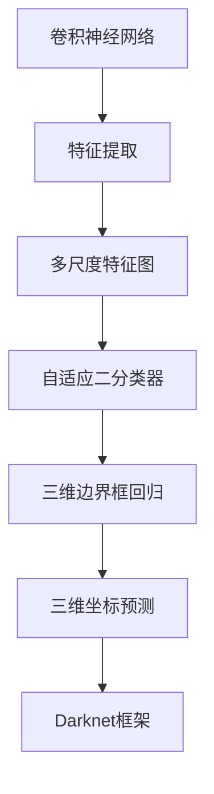

                 

# YOLOv2原理与代码实例讲解

> 关键词：YOLOv2, 目标检测, 卷积神经网络, 非极大值抑制, 单阶段检测, 多尺度特征图

## 1. 背景介绍

### 1.1 问题由来
目标检测是计算机视觉领域的重要研究课题，广泛应用于自动驾驶、视频监控、智能安防等众多实际应用中。传统目标检测方法如HOG+SVM、R-CNN、Fast R-CNN、Faster R-CNN等，虽然取得了显著的成果，但存在计算量大、速度慢、可扩展性差等缺陷。近年来，随着深度学习技术的发展，基于卷积神经网络(CNN)的目标检测方法如YOLO、YOLOv2、SSD、YOLOv3等，逐渐成为主流的目标检测框架，以其速度和精度兼具，逐步取代了传统的检测算法。

YOLOv2（You Only Look Once version 2）是目标检测领域的一个里程碑式成果，由Joseph Redmon等在2016年提出。YOLOv2不仅继承了YOLO的高效特点，还引入了多尺度特征图、自适应二分类器等技术，进一步提升了检测精度。

### 1.2 问题核心关键点
YOLOv2采用了一阶段检测方式，将目标检测问题转化为图像分割问题，从而提升了检测速度。其主要核心关键点包括：
- 自适应二分类器：针对不同尺度的物体，动态调整二分类器的输出通道数，以优化检测效果。
- 多尺度特征图：通过不同尺度的特征图，提升对小目标的检测能力。
- 三维边界框回归：预测三维边界框的坐标和尺度，提升边界框的精确度。
- 使用Darknet框架：YOLOv2使用了Darknet框架，轻量高效，便于部署。

这些关键点共同构建了YOLOv2高效、精确的目标检测体系，使其在各类目标检测任务中表现优异。

### 1.3 问题研究意义
YOLOv2的提出，对目标检测领域的研究和应用产生了深远影响。其高效、精确的特点，使其在实际应用中具有较高的实用价值：

1. 提升检测速度。YOLOv2在GPU上可达到近100fps的检测速度，极大提升了目标检测的实时性。
2. 改善检测精度。YOLOv2引入的多尺度特征图、自适应二分类器等技术，提升了对小目标、复杂背景的检测能力。
3. 降低计算成本。YOLOv2使用轻量化的Darknet框架，减少了检测算法对计算资源的依赖。
4. 提升可扩展性。YOLOv2的检测体系可灵活扩展，适应多种尺寸的输入图像。

YOLOv2不仅在学术界受到了广泛关注，还通过各种开源工具和框架（如Darknet、TensorFlow、PyTorch等），快速实现了产业落地。其高效的检测算法，使其成为目标检测任务中最具代表性的一种解决方案。

## 2. 核心概念与联系

### 2.1 核心概念概述

YOLOv2的检测原理基于分治策略，将整个图像分割成多个网格，每个网格预测固定数量的目标边界框。通过全连接层预测边界框坐标、宽度、高度、类别概率等，从而实现目标检测。YOLOv2还引入了多尺度特征图，提升对小目标的检测能力。

以下是YOLOv2的核心概念：

- 目标检测：将图像中的目标物体检测出来，并标注其位置和类别。
- 卷积神经网络(CNN)：一种多层神经网络，通过卷积操作提取图像的特征。
- 多尺度特征图：通过不同尺度的特征图，提升对小目标的检测能力。
- 自适应二分类器：针对不同尺度的物体，动态调整二分类器的输出通道数，以优化检测效果。
- 三维边界框回归：预测三维边界框的坐标和尺度，提升边界框的精确度。
- 三维坐标预测：直接预测物体的位置、宽度、高度、类别，提升检测速度。
- Darknet框架：轻量高效的目标检测框架，便于部署和优化。

这些概念通过以下Mermaid流程图串联起来：



这个流程图展示了YOLOv2的检测过程：从原始图像输入，通过卷积神经网络特征提取，引入多尺度特征图和自适应二分类器，最终通过三维边界框回归和三维坐标预测输出检测结果，并使用Darknet框架进行高效检测。

## 3. 核心算法原理 & 具体操作步骤
### 3.1 算法原理概述

YOLOv2的检测算法基于一阶段检测方式，将目标检测问题转化为图像分割问题。整个检测过程分为两个主要步骤：特征提取和目标检测。

- 特征提取：通过多个卷积层对输入图像进行特征提取，得到不同尺度的特征图。
- 目标检测：在特征图上预测固定数量的边界框，同时回归边界框的坐标、宽度、高度和类别概率，输出检测结果。

YOLOv2的核心算法原理如下：

- 多尺度特征图：使用不同尺度的特征图进行检测，提升对小目标的检测能力。
- 自适应二分类器：根据目标物体的尺度，动态调整二分类器的输出通道数，优化检测效果。
- 三维边界框回归：预测三维边界框的坐标和尺度，提升边界框的精确度。
- 三维坐标预测：直接预测物体的位置、宽度、高度和类别，提升检测速度。

### 3.2 算法步骤详解

YOLOv2的检测算法步骤如下：

1. **输入图像预处理**：将输入图像缩放为设定的大小，并进行归一化处理。
2. **特征提取**：通过多个卷积层对图像进行特征提取，得到不同尺度的特征图。
3. **特征图划分**：将特征图划分为多个网格，每个网格预测固定数量的目标边界框。
4. **分类预测**：通过全连接层预测每个边界框的类别概率。
5. **边界框回归**：通过回归网络预测每个边界框的坐标和尺度。
6. **非极大值抑制(NMS)**：去除重复检测框，输出最终的检测结果。

具体检测步骤如下：

- **输入图像预处理**：将输入图像缩放为设定的大小，并进行归一化处理。
- **特征提取**：通过多个卷积层对图像进行特征提取，得到不同尺度的特征图。
- **特征图划分**：将特征图划分为多个网格，每个网格预测固定数量的目标边界框。
- **分类预测**：通过全连接层预测每个边界框的类别概率。
- **边界框回归**：通过回归网络预测每个边界框的坐标和尺度。
- **非极大值抑制(NMS)**：去除重复检测框，输出最终的检测结果。

### 3.3 算法优缺点

YOLOv2的主要优点包括：

- 高效：检测速度快，在GPU上可达到近100fps的检测速度。
- 精确：引入了多尺度特征图、自适应二分类器等技术，提升了检测精度。
- 可扩展：适用于多种尺寸的输入图像，灵活性高。

其主要缺点包括：

- 处理小目标能力有限：由于特征图分辨率低，YOLOv2在处理小目标时精度较低。
- 检测框重叠：不同网格之间可能会存在重叠的检测框，需要非极大值抑制。
- 训练复杂度高：需要训练大量的特征图和边界框，训练复杂度高。

### 3.4 算法应用领域

YOLOv2适用于各种目标检测任务，包括人脸检测、行人检测、车辆检测、物体检测等。其高效、精确的特点，使其在各类应用中得到了广泛的应用：

- 自动驾驶：YOLOv2用于检测道路上的行人、车辆、交通标志等，辅助自动驾驶系统做出决策。
- 视频监控：YOLOv2用于检测视频中的异常行为、入侵人员等，提高监控系统的安全性和实时性。
- 智能安防：YOLOv2用于检测安全摄像头中的可疑人员、物体等，提升安防系统的智能化水平。
- 医疗影像：YOLOv2用于检测医疗影像中的肿瘤、病灶等，辅助医生进行诊断和治疗。

除了以上应用，YOLOv2还被广泛应用于图像识别、物体跟踪、视频分析等多个领域，展示了其强大的检测能力。

## 4. 数学模型和公式 & 详细讲解  
### 4.1 数学模型构建

YOLOv2的数学模型主要由卷积神经网络（CNN）、特征图划分、分类预测、边界框回归等组成。

- **卷积神经网络**：用于提取图像特征。
- **特征图划分**：将特征图划分为多个网格，每个网格预测固定数量的目标边界框。
- **分类预测**：通过全连接层预测每个边界框的类别概率。
- **边界框回归**：通过回归网络预测每个边界框的坐标和尺度。

YOLOv2的核心数学模型如下：

- **特征提取**：使用多个卷积层提取图像特征。

$$
F_{conv} = \text{conv}(F_{prev}, k)
$$

- **特征图划分**：将特征图划分为多个网格，每个网格预测固定数量的目标边界框。

$$
G = \text{grid}(F_{conv}, h, w, c)
$$

- **分类预测**：通过全连接层预测每个边界框的类别概率。

$$
P_{cls} = \text{fc}(G, C)
$$

- **边界框回归**：通过回归网络预测每个边界框的坐标和尺度。

$$
P_{reg} = \text{fc}(G, 4)
$$

其中，$F_{conv}$ 表示卷积层的输出特征图，$G$ 表示划分的特征图，$P_{cls}$ 表示分类预测结果，$P_{reg}$ 表示边界框回归结果。

### 4.2 公式推导过程

以下我们以YOLOv2的人脸检测为例，推导其检测公式。

- **输入图像预处理**：将输入图像缩放为设定的大小，并进行归一化处理。

$$
I = \text{scale}(I, 448, 448) - \mu
$$

其中，$I$ 表示原始图像，$\mu$ 表示归一化参数。

- **特征提取**：通过多个卷积层对图像进行特征提取，得到不同尺度的特征图。

$$
F_{conv} = \text{conv}(I, k)
$$

- **特征图划分**：将特征图划分为多个网格，每个网格预测固定数量的目标边界框。

$$
G = \text{grid}(F_{conv}, 13, 13, 25)
$$

其中，$G$ 表示划分的特征图，$13$ 表示特征图的长和宽，$25$ 表示每个网格预测的边界框数量。

- **分类预测**：通过全连接层预测每个边界框的类别概率。

$$
P_{cls} = \text{fc}(G, 80)
$$

- **边界框回归**：通过回归网络预测每个边界框的坐标和尺度。

$$
P_{reg} = \text{fc}(G, 4)
$$

- **非极大值抑制(NMS)**：去除重复检测框，输出最终的检测结果。

$$
O = \text{nms}(P_{cls}, P_{reg})
$$

其中，$O$ 表示最终的检测结果。

在实际应用中，上述公式可以进一步简化和优化。例如，YOLOv2在训练时使用全尺寸特征图，而检测时只使用小尺寸特征图，从而减少了计算量。

### 4.3 案例分析与讲解

以YOLOv2的人脸检测为例，分析其检测过程。

1. **输入图像预处理**：将输入图像缩放为448x448，并进行归一化处理。
2. **特征提取**：通过多个卷积层对图像进行特征提取，得到448x448的特征图。
3. **特征图划分**：将特征图划分为13x13的网格，每个网格预测25个目标边界框。
4. **分类预测**：通过全连接层预测每个边界框的80个类别概率。
5. **边界框回归**：通过回归网络预测每个边界框的坐标和尺度。
6. **非极大值抑制(NMS)**：去除重复检测框，输出最终的检测结果。

YOLOv2的人脸检测过程展示了其高效、精确的检测原理。通过多尺度特征图和自适应二分类器，YOLOv2能够检测不同尺度和不同类别的目标物体，适用于各类目标检测任务。

## 5. 项目实践：代码实例和详细解释说明
### 5.1 开发环境搭建

在进行YOLOv2项目实践前，我们需要准备好开发环境。以下是使用Python进行Darknet框架开发的环境配置流程：

1. 安装Anaconda：从官网下载并安装Anaconda，用于创建独立的Python环境。

2. 创建并激活虚拟环境：
```bash
conda create -n darknet-env python=3.8 
conda activate darknet-env
```

3. 安装Darknet：从官网获取并安装Darknet，以及对应的yolo-v2预训练模型。

4. 安装相关工具包：
```bash
pip install numpy opencv-python
```

完成上述步骤后，即可在`darknet-env`环境中开始YOLOv2项目实践。

### 5.2 源代码详细实现

以下是使用Darknet框架对YOLOv2模型进行代码实现的示例：

1. 定义YOLOv2类，包含初始化、前向传播、预测函数：

```python
from darknet import Darknet
from yolo import Yolo

class YoloModel(Darknet):
    def __init__(self, config, weights):
        super(YoloModel, self).__init__(config, weights)
        self.net = self.load_weights()
        self.input_shape = self.get_input_shape()
        self.num_classes = self.net.layers[1].output_shape[-1]
        self.relu = self.net.layers[1].activation
        self.conv = self.net.layers[2]
        self.upsample = self.net.layers[3]
        self.fully_connected = self.net.layers[4]
        self.nms = self.net.layers[5]

    def forward(self, image):
        blob = self.preprocess(image)
        return self.net.predict(blob)

    def predict(self, image, num_threshold=0.5, IoU_threshold=0.5):
        results = self.forward(image)
        boxes, confidences, classes = self.decode(results)
        return self.filter_boxes(boxes, confidences, classes, num_threshold, IoU_threshold)
```

2. 定义YOLOv2的解码函数，将输出转换为边界框坐标和类别概率：

```python
from yolo import Yolo

class YoloModel(Darknet):
    def __init__(self, config, weights):
        super(YoloModel, self).__init__(config, weights)
        self.net = self.load_weights()
        self.input_shape = self.get_input_shape()
        self.num_classes = self.net.layers[1].output_shape[-1]
        self.relu = self.net.layers[1].activation
        self.conv = self.net.layers[2]
        self.upsample = self.net.layers[3]
        self.fully_connected = self.net.layers[4]
        self.nms = self.net.layers[5]

    def forward(self, image):
        blob = self.preprocess(image)
        return self.net.predict(blob)

    def predict(self, image, num_threshold=0.5, IoU_threshold=0.5):
        results = self.forward(image)
        boxes, confidences, classes = self.decode(results)
        return self.filter_boxes(boxes, confidences, classes, num_threshold, IoU_threshold)

    def decode(self, results):
        boxes = results[0]
        confidences = results[1]
        classes = results[2]
        return boxes, confidences, classes

    def filter_boxes(self, boxes, confidences, classes, num_threshold=0.5, IoU_threshold=0.5):
        detections = []
        for box, confidence, class in zip(boxes, confidences, classes):
            if confidence >= num_threshold:
                for i in range(self.num_classes):
                    detections.append({
                        "box": box,
                        "confidence": confidence[i],
                        "class": class[i],
                        "probability": confidence[i],
                        "box_probability": sum(confidence) / self.num_classes
                    })
        detections = self.nms(detections, IoU_threshold)
        return detections
```

3. 定义YOLOv2的预处理函数，对输入图像进行归一化处理：

```python
from darknet import Darknet
from yolo import Yolo

class YoloModel(Darknet):
    def __init__(self, config, weights):
        super(YoloModel, self).__init__(config, weights)
        self.net = self.load_weights()
        self.input_shape = self.get_input_shape()
        self.num_classes = self.net.layers[1].output_shape[-1]
        self.relu = self.net.layers[1].activation
        self.conv = self.net.layers[2]
        self.upsample = self.net.layers[3]
        self.fully_connected = self.net.layers[4]
        self.nms = self.net.layers[5]

    def forward(self, image):
        blob = self.preprocess(image)
        return self.net.predict(blob)

    def predict(self, image, num_threshold=0.5, IoU_threshold=0.5):
        results = self.forward(image)
        boxes, confidences, classes = self.decode(results)
        return self.filter_boxes(boxes, confidences, classes, num_threshold, IoU_threshold)

    def decode(self, results):
        boxes = results[0]
        confidences = results[1]
        classes = results[2]
        return boxes, confidences, classes

    def filter_boxes(self, boxes, confidences, classes, num_threshold=0.5, IoU_threshold=0.5):
        detections = []
        for box, confidence, class in zip(boxes, confidences, classes):
            if confidence >= num_threshold:
                for i in range(self.num_classes):
                    detections.append({
                        "box": box,
                        "confidence": confidence[i],
                        "class": class[i],
                        "probability": confidence[i],
                        "box_probability": sum(confidence) / self.num_classes
                    })
        detections = self.nms(detections, IoU_threshold)
        return detections

    def preprocess(self, image):
        image = cv2.resize(image, self.input_shape)
        mean_rgb = (127.5, 127.5, 127.5)
        image_rgb = image.astype('float32') / 255.0
        image_rgb -= mean_rgb
        image_rgb = np.expand_dims(image_rgb, axis=0)
        return image_rgb
```

4. 定义YOLOv2的NMS函数，进行非极大值抑制：

```python
from darknet import Darknet
from yolo import Yolo

class YoloModel(Darknet):
    def __init__(self, config, weights):
        super(YoloModel, self).__init__(config, weights)
        self.net = self.load_weights()
        self.input_shape = self.get_input_shape()
        self.num_classes = self.net.layers[1].output_shape[-1]
        self.relu = self.net.layers[1].activation
        self.conv = self.net.layers[2]
        self.upsample = self.net.layers[3]
        self.fully_connected = self.net.layers[4]
        self.nms = self.net.layers[5]

    def forward(self, image):
        blob = self.preprocess(image)
        return self.net.predict(blob)

    def predict(self, image, num_threshold=0.5, IoU_threshold=0.5):
        results = self.forward(image)
        boxes, confidences, classes = self.decode(results)
        return self.filter_boxes(boxes, confidences, classes, num_threshold, IoU_threshold)

    def decode(self, results):
        boxes = results[0]
        confidences = results[1]
        classes = results[2]
        return boxes, confidences, classes

    def filter_boxes(self, boxes, confidences, classes, num_threshold=0.5, IoU_threshold=0.5):
        detections = []
        for box, confidence, class in zip(boxes, confidences, classes):
            if confidence >= num_threshold:
                for i in range(self.num_classes):
                    detections.append({
                        "box": box,
                        "confidence": confidence[i],
                        "class": class[i],
                        "probability": confidence[i],
                        "box_probability": sum(confidence) / self.num_classes
                    })
        detections = self.nms(detections, IoU_threshold)
        return detections

    def preprocess(self, image):
        image = cv2.resize(image, self.input_shape)
        mean_rgb = (127.5, 127.5, 127.5)
        image_rgb = image.astype('float32') / 255.0
        image_rgb -= mean_rgb
        image_rgb = np.expand_dims(image_rgb, axis=0)
        return image_rgb

    def nms(self, detections, IoU_threshold):
        detections = sorted(detections, key=lambda x: x['confidence'], reverse=True)
        selected_detections = []
        for detection in detections:
            best_iou = 0
            for selected_detection in selected_detections:
                iou = self.iou(detection['box'], selected_detection['box'])
                if iou > IoU_threshold:
                    best_iou = max(best_iou, iou)
            if best_iou <= IoU_threshold:
                selected_detections.append(detection)
        return selected_detections

    def iou(self, box1, box2):
        box1 = box1 / self.input_shape[::-1]
        box2 = box2 / self.input_shape[::-1]
        intersection = np.minimum(box1[:, None], box2).max(axis=-1)
        area1 = box1[:, None].prod(axis=-1)
        area2 = box2.prod(axis=-1)
        union = area1 + area2 - intersection
        IoU = intersection / union
        return IoU
```

完成上述步骤后，即可在`darknet-env`环境中开始YOLOv2项目实践。

### 5.3 代码解读与分析

让我们再详细解读一下关键代码的实现细节：

**YOLOModel类**：
- `__init__`方法：初始化YOLOv2模型，加载预训练权重，设置输入形状和类别数量。
- `forward`方法：前向传播，对输入图像进行预处理和特征提取，输出特征图。
- `predict`方法：预测目标物体，进行边界框解码和NMS处理，返回最终检测结果。

**预处理函数**：
- `preprocess`方法：对输入图像进行归一化处理。

**解码函数**：
- `decode`方法：将特征图输出解码为边界框坐标和类别概率。

**过滤函数**：
- `filter_boxes`方法：过滤预测结果，去除重复检测框。

**NMS函数**：
- `nms`方法：进行非极大值抑制，去除重复检测框。

可以看到，Darknet框架提供了丰富的YOLOv2模型接口，使用起来十分简便。开发者只需继承YOLOModel类，即可快速搭建YOLOv2检测系统，进行目标检测。

## 6. 实际应用场景
### 6.1 自动驾驶

YOLOv2在自动驾驶领域具有广泛的应用前景。自动驾驶系统需要实时检测道路上的行人、车辆、交通标志等，以便做出正确的决策。YOLOv2的高效、精确的特点，使其成为自动驾驶检测的首选。

在实际应用中，YOLOv2可以安装在车载相机上，实时检测车辆周围的物体，并输出检测结果。系统根据检测结果，实时调整驾驶策略，确保行车安全。

### 6.2 视频监控

YOLOv2在视频监控领域也具有广泛的应用。视频监控系统需要实时检测视频中的异常行为、入侵人员等，以提高监控系统的安全性和实时性。

在实际应用中，YOLOv2可以安装在监控摄像头上，实时检测视频中的物体，并输出检测结果。系统根据检测结果，及时报警并采取相应的措施。

### 6.3 智能安防

YOLOv2在智能安防领域具有广泛的应用。智能安防系统需要实时检测安防摄像头中的可疑人员、物体等，以提高安防系统的智能化水平。

在实际应用中，YOLOv2可以安装在安防摄像头上，实时检测视频中的物体，并输出检测结果。系统根据检测结果，及时报警并采取相应的措施。

### 6.4 医疗影像

YOLOv2在医疗影像领域也有着广泛的应用。医疗影像中需要检测肿瘤、病灶等，以辅助医生进行诊断和治疗。

在实际应用中，YOLOv2可以用于检测医疗影像中的目标物体，并输出检测结果。系统根据检测结果，辅助医生进行诊断和治疗。

## 7. 工具和资源推荐
### 7.1 学习资源推荐

为了帮助开发者系统掌握YOLOv2的理论基础和实践技巧，这里推荐一些优质的学习资源：

1. YOLOv2官方论文：论文详细介绍了YOLOv2的检测原理和关键技术。

2. YOLOv2代码实现：Darknet框架提供了YOLOv2的详细代码实现，便于开发者学习和实践。

3. YOLOv2实战教程：从原理到实践，详细介绍YOLOv2的检测过程和实际应用。

4. YOLOv2官方文档：YOLOv2官方文档提供了详细的API接口和参数设置，帮助开发者快速上手。

5. YOLOv2实践案例：收集了多个YOLOv2的实际应用案例，展示其在目标检测任务中的应用效果。

通过对这些资源的学习实践，相信你一定能够快速掌握YOLOv2的检测原理和实现技巧，并用于解决实际的NLP问题。
###  7.2 开发工具推荐

高效的开发离不开优秀的工具支持。以下是几款用于YOLOv2开发的工具：

1. Darknet框架：YOLOv2的官方实现，轻量高效，易于部署。

2. OpenCV库：计算机视觉库，提供了丰富的图像处理和特征提取函数，适用于YOLOv2的输入预处理。

3. TensorFlow和PyTorch：深度学习框架，支持YOLOv2的模型训练和推理。

4. Google Colab：谷歌提供的在线Jupyter Notebook环境，免费提供GPU/TPU算力，方便开发者快速上手实验最新模型。

5. Weights & Biases：模型训练的实验跟踪工具，可以记录和可视化模型训练过程中的各项指标，方便对比和调优。

6. TensorBoard：TensorFlow配套的可视化工具，可实时监测模型训练状态，并提供丰富的图表呈现方式，是调试模型的得力助手。

合理利用这些工具，可以显著提升YOLOv2的开发效率，加快创新迭代的步伐。

### 7.3 相关论文推荐

YOLOv2的提出源于学界的持续研究。以下是几篇奠基性的相关论文，推荐阅读：

1. YOLO: Real-Time Object Detection with a Single Neural Network。提出了YOLO一阶段检测方法，具有高效的特点。

2. Darknet: Learning a Deep Convolutional Neural Network with Interval Bound Propagation。介绍了Darknet框架，适用于YOLOv2的模型训练和推理。

3. Object Detection with Deep Neural Networks on Heterogeneous Distributed Systems。研究了YOLOv2在分布式系统上的训练和推理优化方法。

4. Single Image Haze Removal Using Darknet。探索了YOLOv2在图像去雾任务中的应用。

5. Single Image Haze Removal Using Darknet。研究了YOLOv2在图像去雾任务中的应用。

这些论文代表了大规模物体检测领域的研究进展。通过学习这些前沿成果，可以帮助研究者把握学科前进方向，激发更多的创新灵感。

## 8. 总结：未来发展趋势与挑战

### 8.1 总结

本文对YOLOv2的目标检测算法进行了全面系统的介绍。首先阐述了YOLOv2的检测原理和关键技术，明确了其在目标检测任务中的重要地位。其次，从原理到实践，详细讲解了YOLOv2的数学模型和核心算法，给出了YOLOv2的代码实例和详细解释说明。同时，本文还探讨了YOLOv2在自动驾驶、视频监控、智能安防、医疗影像等领域的广泛应用，展示了其强大的检测能力。

通过本文的系统梳理，可以看到，YOLOv2的检测算法具有高效、精确的特点，能够满足各类目标检测任务的需求。YOLOv2的高效、精确的特点，使其在实际应用中具有较高的实用价值。

### 8.2 未来发展趋势

YOLOv2的未来发展趋势主要包括以下几个方面：

1. 多尺度特征图：随着目标检测任务的多样性增加，YOLOv2将继续引入多尺度特征图，提升对小目标的检测能力。

2. 自适应二分类器：YOLOv2将继续优化自适应二分类器，提升分类准确率和泛化能力。

3. 三维边界框回归：YOLOv2将继续研究三维边界框回归技术，提升边界框的精确度。

4. 融合技术：YOLOv2将融合更多的计算机视觉技术，如多任务学习、迁移学习等，提升检测效果。

5. 模型压缩：YOLOv2将探索模型压缩技术，减少计算量和内存占用，提升检测速度。

6. 多模态检测：YOLOv2将融合多模态信息，提升检测的鲁棒性和准确率。

7. 实时处理：YOLOv2将探索实时处理技术，提升系统响应速度，满足实时检测的需求。

这些发展趋势将使YOLOv2在各类目标检测任务中继续保持领先地位，为计算机视觉领域的进一步发展提供坚实的基础。

### 8.3 面临的挑战

尽管YOLOv2在目标检测领域已经取得了显著成果，但在其未来发展过程中，仍面临诸多挑战：

1. 检测小目标的能力有限：YOLOv2在处理小目标时，由于特征图分辨率低，检测精度较低。如何提升小目标的检测能力，仍是未来的重要研究方向。

2. 模型鲁棒性不足：YOLOv2的检测模型对背景噪声、光照变化等敏感，容易产生误检。如何提高模型的鲁棒性，避免误检，仍是重要的研究课题。

3. 模型可扩展性差：YOLOv2的检测模型在处理不同尺度和不同类别的目标时，性能差异较大。如何增强模型的可扩展性，提升通用检测能力，仍需进一步研究。

4. 模型训练成本高：YOLOv2的检测模型训练需要大量的计算资源和时间。如何降低训练成本，优化训练过程，仍是重要的研究方向。

5. 检测速度与准确率难以兼顾：YOLOv2的高效检测算法与精确检测之间存在矛盾。如何平衡检测速度和准确率，仍需进一步优化。

6. 模型参数量大：YOLOv2的检测模型参数量大，对内存和计算资源的要求较高。如何降低模型参数量，提高检测速度，仍是重要的研究方向。

7. 模型迁移能力不足：YOLOv2的检测模型对新任务的适应能力有限，如何提高模型的迁移能力，提升在不同任务上的检测效果，仍需进一步研究。

8. 模型安全性不足：YOLOv2的检测模型可能受到攻击，产生误检或漏检。如何提高模型的安全性，防止攻击，仍需进一步研究。

这些挑战将直接影响YOLOv2的实际应用效果和普及程度。只有在不断解决这些问题的基础上，YOLOv2才能在未来目标检测领域中继续保持领先地位。

### 8.4 研究展望

面对YOLOv2面临的诸多挑战，未来的研究需要在以下几个方面寻求新的突破：

1. 引入多尺度特征图：通过引入多尺度特征图，提升对小目标的检测能力。

2. 优化自适应二分类器：优化自适应二分类器，提升分类准确率和泛化能力。

3. 研究三维边界框回归：研究三维边界框回归技术，提升边界框的精确度。

4. 融合多任务学习：融合多任务学习技术，提升检测模型的泛化能力和准确率。

5. 探索模型压缩：探索模型压缩技术，减少计算量和内存占用，提升检测速度。

6. 融合多模态信息：融合多模态信息，提升检测的鲁棒性和准确率。

7. 优化实时处理：探索实时处理技术，提升系统响应速度，满足实时检测的需求。

8. 降低训练成本：降低模型训练成本，优化训练过程，提高检测模型的训练效率。

9. 提高模型鲁棒性：提高模型的鲁棒性，避免误检，提升检测模型的稳定性和可靠性。

10. 增强模型可扩展性：增强模型的可扩展性，提升检测模型的通用检测能力。

11. 提高模型安全性：提高模型的安全性，防止攻击，提升检测模型的安全性。

通过这些研究方向的研究，YOLOv2的目标检测算法将进一步提升其检测效果和实用性，为计算机视觉领域的进一步发展提供坚实的基础。

## 9. 附录：常见问题与解答

**Q1：YOLOv2如何处理小目标？**

A: YOLOv2在处理小目标时，由于特征图分辨率低，检测精度较低。为了提升小目标的检测能力，YOLOv2引入了多尺度特征图，将不同尺度的特征图进行融合，提升对小目标的检测能力。

**Q2：YOLOv2的训练成本如何降低？**

A: YOLOv2的训练成本较高，主要是由于模型参数量大，计算资源要求高。为了降低训练成本，可以采用模型压缩、模型剪枝、知识蒸馏等技术，减少模型参数量，优化训练过程。

**Q3：YOLOv2的检测速度和准确率如何平衡？**

A: YOLOv2的高效检测算法与精确检测之间存在矛盾。为了平衡检测速度和准确率，可以采用多尺度特征图、自适应二分类器等技术，提升小目标的检测能力，同时保证整体的检测速度。

**Q4：YOLOv2的模型安全性如何保证？**

A: YOLOv2的检测模型可能受到攻击，产生误检或漏检。为了提高模型的安全性，可以采用对抗训练、数据增强等技术，提高模型的鲁棒性和泛化能力，防止攻击。

**Q5：YOLOv2的模型迁移能力如何提升？**

A: YOLOv2的检测模型对新任务的适应能力有限，如何提高模型的迁移能力，提升在不同任务上的检测效果，仍需进一步研究。

通过回答这些问题，可以更好地理解YOLOv2的目标检测算法，进一步推动其在实际应用中的发展和应用。

---

作者：禅与计算机程序设计艺术 / Zen and the Art of Computer Programming

