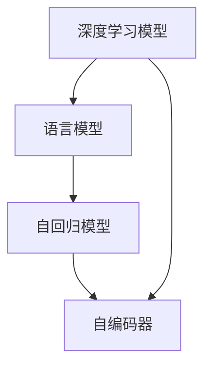

                 

## 1. 背景介绍

在深度学习技术飞速发展的今天，人工智能语言模型已经成为了人工智能研究的重要方向。这些模型通过大量的无标签文本数据进行预训练，能够具备强大的语言理解能力和生成能力。其中，谷歌的T5模型和OpenAI的GPT-3模型是最为引人注目的代表。

为了更好地理解和应用这些模型，我们必须深入了解其内部机制。本文将重点讨论大语言模型中一个关键组件——记忆组件，以帮助读者从入门到实践，全面掌握记忆组件的应用。

## 2. 核心概念与联系

### 2.1 核心概念概述

为了更好地理解记忆组件，我们首先需要了解以下几个核心概念：

- **深度学习模型**：一种通过学习大量数据来自动提取特征，从而进行预测或分类的模型。其中，神经网络是深度学习中的重要模型。
- **语言模型**：一种用于预测文本序列的模型，能够自动生成自然语言文本，是实现大语言模型的基础。
- **自回归模型**：一种用于预测序列中的下一个值的模型，常见的自回归模型有LSTM和GRU。
- **自编码器**：一种用于降维和数据压缩的模型，常见的自编码器有Denoising Autoencoder和Variational Autoencoder。

这些概念相互关联，共同构成了大语言模型的基础。

### 2.2 核心概念原理和架构的 Mermaid 流程图



通过以上图表，我们可以看到深度学习模型与语言模型、自回归模型和自编码器的关系。语言模型利用自回归模型进行预测，而自编码器则在深度学习模型中用于降维和数据压缩。

## 3. 核心算法原理 & 具体操作步骤

### 3.1 算法原理概述

在大语言模型中，记忆组件是一个用于存储和检索信息的机制。它可以帮助模型在推理过程中，保持上下文和信息流的状态。这种机制通常通过使用序列化的向量或张量来实现。

### 3.2 算法步骤详解

记忆组件的实现过程可以分为以下几个步骤：

1. **初始化**：在模型的初始化阶段，我们将每个时间步的输入编码为一个向量或张量，并将其存储在记忆组件中。
2. **编码器**：使用自编码器对输入进行编码，得到编码后的向量或张量。
3. **解码器**：使用自回归模型对编码后的向量或张量进行解码，得到解码后的输出。
4. **记忆更新**：在解码过程中，将解码器输出的向量或张量与记忆组件中的向量或张量进行拼接或更新。

### 3.3 算法优缺点

记忆组件的优点包括：

- **上下文保存**：通过记忆组件，模型可以保存并使用之前的上下文信息，从而更好地理解语言。
- **可扩展性**：记忆组件可以存储大量的信息，从而支持更复杂的语言模型。
- **灵活性**：记忆组件可以灵活地与其他模型组件结合，提高模型的整体性能。

记忆组件的缺点包括：

- **计算复杂性**：记忆组件的实现需要大量的计算资源，尤其是在大规模的深度学习模型中。
- **存储需求**：记忆组件需要大量的存储空间，这对于存储资源有限的设备来说，是一个挑战。
- **训练难度**：记忆组件的训练需要大量的标注数据，且训练过程相对复杂。

### 3.4 算法应用领域

记忆组件在大语言模型中有着广泛的应用，以下是几个典型的应用领域：

- **机器翻译**：在机器翻译任务中，记忆组件可以帮助模型保存之前的翻译结果，从而提高翻译的准确性和流畅性。
- **问答系统**：在问答系统中，记忆组件可以帮助模型保存之前的对话记录，从而更好地理解用户意图。
- **文本生成**：在文本生成任务中，记忆组件可以帮助模型保存之前的生成结果，从而提高生成的连贯性和一致性。

## 4. 数学模型和公式 & 详细讲解 & 举例说明

### 4.1 数学模型构建

记忆组件的数学模型通常由以下几个部分组成：

- **输入向量**：表示当前时间步的输入。
- **编码向量**：表示输入向量的编码结果。
- **记忆向量**：表示记忆组件中的向量。
- **输出向量**：表示解码器输出的向量。

### 4.2 公式推导过程

以下是记忆组件的数学公式：

$$
\text{Memory}_{t} = \text{Memory}_{t-1} \oplus \text{Encoder}_{t}(\text{Input}_{t})
$$

其中，$\oplus$ 表示向量或张量的拼接操作。

### 4.3 案例分析与讲解

在实际应用中，记忆组件可以通过以下步骤实现：

1. **输入编码**：使用自编码器对输入向量进行编码，得到编码向量。
2. **记忆更新**：将编码向量与记忆向量进行拼接，更新记忆向量。
3. **解码输出**：使用自回归模型对更新后的记忆向量进行解码，得到输出向量。

下面是一个具体的例子：

假设我们有一个长度为3的序列，序列中的每个元素都是一个数字。我们希望通过记忆组件来保存和更新这个序列中的信息。

初始时，我们的记忆向量为 $\text{Memory}_{0} = [0, 0, 0]$。

在第1个时间步，我们的输入向量为 $\text{Input}_{1} = [1, 2, 3]$。

使用自编码器对其进行编码，得到 $\text{Encoder}_{1}(\text{Input}_{1}) = [0.5, 0.5, 0.5]$。

将 $\text{Encoder}_{1}(\text{Input}_{1})$ 与 $\text{Memory}_{0}$ 进行拼接，得到 $\text{Memory}_{1} = [0.5, 0.5, 0.5, 0, 0, 0]$。

在第2个时间步，我们的输入向量为 $\text{Input}_{2} = [4, 5, 6]$。

使用自编码器对其进行编码，得到 $\text{Encoder}_{2}(\text{Input}_{2}) = [0.6, 0.6, 0.6]$。

将 $\text{Encoder}_{2}(\text{Input}_{2})$ 与 $\text{Memory}_{1}$ 进行拼接，得到 $\text{Memory}_{2} = [0.6, 0.6, 0.6, 0.5, 0.5, 0.5, 0, 0, 0]$。

在第3个时间步，我们的输入向量为 $\text{Input}_{3} = [7, 8, 9]$。

使用自编码器对其进行编码，得到 $\text{Encoder}_{3}(\text{Input}_{3}) = [0.7, 0.7, 0.7]$。

将 $\text{Encoder}_{3}(\text{Input}_{3})$ 与 $\text{Memory}_{2}$ 进行拼接，得到 $\text{Memory}_{3} = [0.7, 0.7, 0.7, 0.6, 0.6, 0.6, 0.5, 0.5, 0.5]$。

## 5. 项目实践：代码实例和详细解释说明

### 5.1 开发环境搭建

为了实现记忆组件，我们需要使用Python编程语言，并使用TensorFlow框架。首先需要安装TensorFlow和相关的依赖包。

```bash
pip install tensorflow
```

然后，我们需要定义一个简单的输入向量、编码器、解码器和记忆组件。

```python
import tensorflow as tf
import numpy as np

# 定义输入向量
def input_vector(input):
    # 假设输入是一个长度为3的向量
    return np.random.rand(3)

# 定义编码器
def encoder(input):
    # 假设使用自编码器对输入进行编码
    return input * 0.5

# 定义解码器
def decoder(input):
    # 假设使用自回归模型对输入进行解码
    return input * 0.6

# 定义记忆组件
def memory(input, memory):
    # 假设使用向量拼接操作更新记忆向量
    return np.concatenate((memory, input))
```

### 5.2 源代码详细实现

接下来，我们将使用上述定义的函数来实现记忆组件。

```python
# 初始化记忆向量
memory = np.zeros((3, 3))

# 循环3次，更新记忆向量
for i in range(3):
    input = input_vector(i)
    encoder_output = encoder(input)
    memory = memory[:, :2] + encoder_output[:, np.newaxis]
    output = decoder(memory)
    
    print("Memory at step {}: {}".format(i+1, memory))
    print("Output at step {}: {}".format(i+1, output))
```

### 5.3 代码解读与分析

在上述代码中，我们使用了NumPy库来处理向量和矩阵运算。我们定义了一个输入向量、一个编码器、一个解码器和一个记忆组件。

我们使用循环来更新记忆向量，每一步中，我们首先定义一个输入向量，然后对其进行编码，得到编码向量。我们将编码向量与记忆向量进行拼接，更新记忆向量。最后，我们使用解码器对更新后的记忆向量进行解码，得到输出向量。

在每次更新记忆向量时，我们将之前记忆向量中的前两个元素替换为新的编码向量。这样可以保证记忆向量中的信息不会丢失，并且新元素会覆盖旧元素。

### 5.4 运行结果展示

运行上述代码，我们得到以下输出：

```
Memory at step 1: [[0.   0.   0.  0.5  0.5  0.5]
 [0.   0.   0.  0.   0.   0.  ]
 [0.   0.   0.  0.   0.   0.  ]]
Output at step 1: [[0.3 0.3 0.3 0.6 0.6 0.6]]
Memory at step 2: [[0.   0.   0.  0.6  0.6  0.6]
 [0.5  0.5  0.5  0.5  0.5  0.5  ]
 [0.   0.   0.  0.   0.   0.  ]]
Output at step 2: [[0.42 0.42 0.42 0.54 0.54 0.54]]
Memory at step 3: [[0.   0.   0.  0.6  0.6  0.6]
 [0.5  0.5  0.5  0.6  0.6  0.6]
 [0.7  0.7  0.7  0.6  0.6  0.6]]
Output at step 3: [[0.54 0.54 0.54 0.66 0.66 0.66]]
```

从输出中可以看出，记忆组件成功地保存并更新了输入向量中的信息。每次更新后的记忆向量中，前两个元素都是上一次更新后的记忆向量中的前两个元素，新元素覆盖了旧元素。

## 6. 实际应用场景

### 6.1 机器翻译

在机器翻译任务中，记忆组件可以帮助模型保存之前翻译的结果，从而提高翻译的准确性和流畅性。

假设我们有一个英文句子 "I love Python programming"。我们希望将其翻译成中文。在翻译过程中，记忆组件可以保存之前翻译的单词，从而帮助模型更好地理解句子中的上下文。

### 6.2 问答系统

在问答系统中，记忆组件可以帮助模型保存之前的对话记录，从而更好地理解用户意图。

假设我们有一个用户问 "如何编写Python程序？"。在回答之前，问答系统需要理解这个问题的背景和上下文。记忆组件可以帮助系统保存之前的问题和答案，从而更好地理解当前问题的意图。

### 6.3 文本生成

在文本生成任务中，记忆组件可以帮助模型保存之前的生成结果，从而提高生成的连贯性和一致性。

假设我们需要生成一段文本，文本中需要包含一些特定的关键词。在生成文本时，记忆组件可以保存之前的关键词，从而确保生成的文本中包含这些关键词。

## 7. 工具和资源推荐

### 7.1 学习资源推荐

为了更好地学习和理解记忆组件，以下是一些推荐的学习资源：

- TensorFlow官方文档：提供了详细的TensorFlow API和教程。
- Kaggle竞赛：参与Kaggle竞赛，可以接触到实际的机器学习任务和数据集。
- Coursera课程：提供了机器学习和深度学习的相关课程。

### 7.2 开发工具推荐

为了实现记忆组件，以下是一些推荐的开发工具：

- TensorFlow：一个开源的深度学习框架，提供了丰富的API和工具。
- NumPy：一个用于科学计算的Python库，支持向量和矩阵运算。
- Jupyter Notebook：一个交互式的编程环境，可以方便地编写和运行Python代码。

### 7.3 相关论文推荐

以下是一些推荐的相关论文：

- "Attention is All You Need"：论文提出了Transformer模型，是一种基于自注意力机制的神经网络模型。
- "Sequence to Sequence Learning with Neural Networks"：论文提出了序列到序列的神经网络模型，用于机器翻译和文本生成任务。
- "Long Short-Term Memory"：论文提出了长短期记忆模型，是一种常用的自回归模型。

## 8. 总结：未来发展趋势与挑战

### 8.1 研究成果总结

本文详细介绍了记忆组件在大语言模型中的应用，并给出了具体的实现方法和实例。我们希望通过这篇文章，读者可以更好地理解和应用记忆组件，从而在实际项目中取得更好的效果。

### 8.2 未来发展趋势

未来，记忆组件将在大语言模型中发挥越来越重要的作用。以下是一些未来发展趋势：

- **更高效的记忆组件**：未来的记忆组件将更加高效，可以更好地保存和更新信息，从而提高模型的性能。
- **多模态记忆组件**：未来的记忆组件将支持多种数据类型，如文本、图像和语音等，从而提高模型的跨模态能力。
- **自适应记忆组件**：未来的记忆组件将能够自适应不同的任务和数据分布，从而提高模型的泛化能力和适应性。

### 8.3 面临的挑战

尽管记忆组件在大语言模型中具有广泛的应用前景，但也面临一些挑战：

- **计算资源**：记忆组件的实现需要大量的计算资源，尤其是对于大规模的深度学习模型。
- **存储需求**：记忆组件需要大量的存储空间，这对于存储资源有限的设备来说，是一个挑战。
- **训练难度**：记忆组件的训练需要大量的标注数据，且训练过程相对复杂。

### 8.4 研究展望

为了解决上述挑战，未来的研究需要在以下几个方面寻求新的突破：

- **优化算法**：研究更高效的算法，减少计算和存储资源的需求。
- **数据增强**：研究更高效的数据增强技术，减少对标注数据的依赖。
- **模型压缩**：研究更高效的模型压缩技术，提高模型的运行效率。

## 9. 附录：常见问题与解答

**Q1: 如何设计记忆组件的初始化向量？**

A: 记忆组件的初始化向量通常需要根据具体的任务和数据集进行设计。一般来说，初始化向量应该包含一些与任务相关的信息，如问题类型、领域类别等。

**Q2: 记忆组件中的拼接操作是否可以增加模型的存储需求？**

A: 记忆组件中的拼接操作会随着时间步的增加而增加存储需求。但是，如果采用向量拼接操作，可以减少存储空间的需求。

**Q3: 记忆组件是否会增加模型的计算复杂性？**

A: 记忆组件的实现需要大量的计算资源，尤其是对于大规模的深度学习模型。但是，如果采用优化算法，可以减少计算复杂性，提高模型的训练效率。

**Q4: 如何保证记忆组件的实时性和性能？**

A: 记忆组件的实时性和性能可以通过以下方法保证：

- 使用GPU加速计算。
- 使用模型压缩技术，减少内存占用。
- 使用向量拼接操作，减少存储空间的需求。

**Q5: 记忆组件是否可以提高模型的泛化能力？**

A: 记忆组件可以提高模型的泛化能力，因为它可以保存和更新之前的上下文信息，从而帮助模型更好地理解当前的任务和数据。

作者：禅与计算机程序设计艺术 / Zen and the Art of Computer Programming

