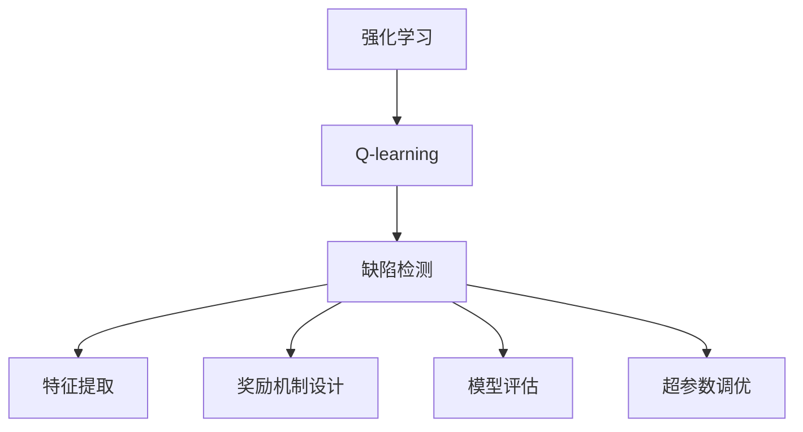

                 

# 一切皆是映射：AI Q-learning在缺陷检测中的探索

## 1. 背景介绍

### 1.1 问题由来

在现代工业生产中，产品的质量控制始终是一个关键环节。传统的方法依赖人工检测，效率低下且容易出错。近年来，随着人工智能技术的不断发展，AI在质量检测中的应用逐渐增多。其中，基于强化学习的缺陷检测方法因其高效和适应性强而受到广泛关注。

Q-learning是一种强化学习算法，通过奖励机制引导智能体（agent）在一个不确定的环境中做出最优决策。将Q-learning应用到缺陷检测中，可以通过学习缺陷样本的特征，预测新样本是否存在缺陷，从而实现自动化的质量控制。

### 1.2 问题核心关键点

AI Q-learning在缺陷检测中的核心关键点在于：

1. **强化学习框架**：构建一个以缺陷检测任务为目标的强化学习框架，使AI能够在不断与环境（产品样本）交互中学习最优检测策略。
2. **奖励机制设计**：合理设计奖励机制，鼓励模型检测出缺陷样本，抑制误判非缺陷样本。
3. **特征提取**：从样本中提取出具有鉴别力的特征，用于训练Q-learning模型。
4. **模型评估**：设计合适的评估指标，如精确率、召回率、F1-score等，评价模型的性能。
5. **超参数调优**：通过交叉验证等方法，调整模型超参数，优化模型性能。

## 2. 核心概念与联系

### 2.1 核心概念概述

为更好地理解AI Q-learning在缺陷检测中的应用，本节将介绍几个密切相关的核心概念：

- **强化学习(Reinforcement Learning, RL)**：一种机器学习方法，通过智能体与环境的交互，学习最优的决策策略。强化学习包括状态、动作、奖励、策略等关键概念。
- **Q-learning**：一种基于值函数的强化学习算法，通过估计每个状态-动作对的Q值（即最优期望奖励）来指导智能体的决策。
- **缺陷检测**：识别和判断产品中是否存在缺陷的过程。缺陷检测是质量控制的重要环节，通常分为有监督学习和无监督学习两种方法。
- **特征提取**：从原始数据中提取有鉴别力的特征，用于机器学习模型的训练。
- **奖励机制设计**：在强化学习中，设计一个能够有效引导智能体行为的奖励函数，是算法成功的关键。

这些核心概念之间的逻辑关系可以通过以下Mermaid流程图来展示：



这个流程图展示了几者之间的逻辑关系：

1. Q-learning作为强化学习的一种具体方法，通过状态-动作对的Q值学习，实现决策优化。
2. 缺陷检测任务可以通过Q-learning框架进行自动化处理。
3. 特征提取是从数据中获取有效信息的关键步骤。
4. 奖励机制设计是Q-learning学习策略的驱动力。
5. 模型评估和超参数调优是确保模型性能的重要环节。

## 3. 核心算法原理 & 具体操作步骤
### 3.1 算法原理概述

AI Q-learning在缺陷检测中的应用，实质上是将缺陷检测任务转换为强化学习问题，通过智能体与环境的交互，学习最优的检测策略。具体而言：

1. **定义状态**：将产品样本的不同状态（如颜色、形状、纹理等）作为强化学习的状态。
2. **定义动作**：智能体可执行的检测动作，如判断缺陷、标记样本、输出分类等。
3. **定义奖励**：根据动作的执行结果，设计奖励机制，鼓励检测出缺陷样本，惩罚误判。
4. **训练模型**：使用Q-learning算法，在样本数据上训练模型，学习最优的Q值，即每个状态-动作对的期望奖励。
5. **决策推理**：将新样本输入模型，输出检测结果。

### 3.2 算法步骤详解

AI Q-learning在缺陷检测中的具体操作步骤如下：

1. **数据准备**：收集包含缺陷和无缺陷产品的数据集，并进行预处理，如归一化、扩增等。

2. **状态定义**：将产品样本的特征向量作为状态向量，每个特征维度对应一个状态。例如，颜色、形状、纹理等特征可以分别映射为状态维度。

3. **动作定义**：定义智能体的动作空间，如分类动作（有缺陷、无缺陷）、标记动作（标记为缺陷、标记为无缺陷）等。

4. **奖励设计**：设计奖励函数，鼓励检测出缺陷样本，惩罚误判。奖励函数可以定义如下：
   - 对于检测出缺陷的样本，奖励$R_1$；
   - 对于误判为缺陷的样本，惩罚$R_2$；
   - 对于未检测出的缺陷样本，惩罚$R_3$；
   - 对于未误判的样本，奖励$R_4$。

5. **模型训练**：使用Q-learning算法，在样本数据上训练模型。Q值函数估计可以通过如下方式实现：
   - 初始化Q值函数为零；
   - 对每个状态-动作对$(s,a)$，计算Q值$Q(s,a)$；
   - 更新Q值函数，以减少与真实Q值的差距；
   - 重复上述步骤，直至收敛。

6. **决策推理**：将新样本输入模型，输出检测结果。具体步骤如下：
   - 将样本的状态向量输入模型，得到每个动作的Q值；
   - 选择Q值最大的动作，作为模型的预测结果；
   - 根据预测结果，执行相应的动作（如标记样本、分类等）。

### 3.3 算法优缺点

AI Q-learning在缺陷检测中具有以下优点：

1. **自适应性强**：通过强化学习框架，模型能够适应不断变化的环境，对新样本进行高效检测。
2. **无需标注数据**：Q-learning基于奖励机制，不需要标注数据即可训练模型，大幅降低数据准备成本。
3. **泛化能力强**：通过从大量数据中学习特征和策略，Q-learning模型具有较强的泛化能力，能够在不同场景下取得较好的检测效果。

同时，该算法也存在一定的局限性：

1. **参数设置复杂**：奖励函数的设计和参数的选择需要经验积累，对模型性能有较大影响。
2. **训练时间较长**：由于Q-learning算法需要大量样本数据进行训练，训练时间可能较长。
3. **模型解释性差**：Q-learning模型作为"黑盒"系统，难以解释其内部决策过程。

尽管存在这些局限性，但就目前而言，AI Q-learning仍是在缺陷检测领域中表现优异的一种方法。未来相关研究的重点在于如何进一步简化模型，缩短训练时间，同时提高模型的可解释性和鲁棒性。

### 3.4 算法应用领域

AI Q-learning在缺陷检测中的应用领域非常广泛，涵盖了从简单产品到复杂系统的各种场景。以下是几个典型的应用案例：

- **电子产品检测**：对手机、电脑、家电等电子产品进行外观缺陷检测，如划痕、变形、裂痕等。
- **汽车零部件检测**：对汽车零部件进行质量控制，如轮胎、发动机、仪表盘等。
- **医疗设备检测**：对医疗设备如手术器械、检测仪器等进行缺陷检测，确保设备功能正常。
- **机械制造检测**：对机械零部件进行质量控制，如齿轮、螺钉、金属件等。
- **食品药品检测**：对食品、药品等进行质量控制，如包装、包装材料等。

## 4. 数学模型和公式 & 详细讲解  
### 4.1 数学模型构建

本节将使用数学语言对AI Q-learning在缺陷检测中的应用进行更加严格的刻画。

记产品样本的状态向量为$x$，动作向量为$a$，奖励为$r$。Q-learning模型的目标是最小化动作值函数的估计误差，即：

$$
\min_{Q(x,a)} \mathbb{E}[r|x,a] - Q(x,a)
$$

其中$\mathbb{E}[r|x,a]$表示在状态$x$下执行动作$a$的期望奖励。Q值函数可以定义为：

$$
Q(x,a) = \mathbb{E}[r+ \gamma \max_{a'} Q(x',a')|x,a]
$$

其中$x'$表示状态转移后的新状态，$\gamma$为折扣因子。

### 4.2 公式推导过程

以下我们以二分类任务为例，推导Q-learning模型的更新公式。

假设模型在状态$x$下执行动作$a$，得到奖励$r$，状态转移为$x'$。则Q值函数的更新公式为：

$$
Q(x,a) \leftarrow Q(x,a) + \alpha(r + \gamma \max_{a'} Q(x',a') - Q(x,a))
$$

其中$\alpha$为学习率，$\max_{a'} Q(x',a')$表示在状态$x'$下，所有可能动作中的最优Q值。

在得到Q值函数的更新公式后，即可带入具体数值进行计算，完成模型的迭代优化。重复上述过程直至收敛，最终得到适应特定任务的Q-learning模型。

## 5. 项目实践：代码实例和详细解释说明
### 5.1 开发环境搭建

在进行Q-learning缺陷检测实践前，我们需要准备好开发环境。以下是使用Python进行TensorFlow开发的示例：

1. 安装Anaconda：从官网下载并安装Anaconda，用于创建独立的Python环境。

2. 创建并激活虚拟环境：
```bash
conda create -n qlearning-env python=3.8 
conda activate qlearning-env
```

3. 安装TensorFlow：根据CUDA版本，从官网获取对应的安装命令。例如：
```bash
conda install tensorflow==2.3
```

4. 安装各类工具包：
```bash
pip install numpy pandas scikit-learn matplotlib tqdm jupyter notebook ipython
```

完成上述步骤后，即可在`qlearning-env`环境中开始Q-learning实践。

### 5.2 源代码详细实现

以下是使用TensorFlow实现Q-learning的代码示例：

```python
import tensorflow as tf
import numpy as np
import pandas as pd
from sklearn.model_selection import train_test_split

# 准备数据
data = pd.read_csv('product_data.csv')
features = data[['color', 'shape', 'texture']]
target = data['defect']
X_train, X_test, y_train, y_test = train_test_split(features, target, test_size=0.2)

# 定义状态-动作空间
num_states = len(features.columns)
num_actions = 2  # 分类动作，0为无缺陷，1为有缺陷

# 初始化Q值函数
Q = tf.Variable(tf.zeros([num_states, num_actions]))

# 定义奖励函数
def reward_function(y_true, y_pred):
    if y_true == 1 and y_pred == 1:
        return 1.0
    elif y_true == 0 and y_pred == 0:
        return 1.0
    else:
        return -1.0

# 训练Q-learning模型
for epoch in range(1000):
    batch_size = 32
    for i in range(0, len(X_train), batch_size):
        X_batch = X_train[i:i+batch_size]
        y_batch = y_train[i:i+batch_size]
        state_batch = np.hstack([X_batch.values, np.zeros((batch_size, 1))])
        state_batch = np.eye(num_states)[state_batch].values
        actions_batch = np.random.randint(num_actions, size=(batch_size, 1))
        Q_batch = Q.numpy()[state_batch, actions_batch]
        rewards = [reward_function(y_true, actions_batch[0]) for y_true in y_batch]
        Q_next = Q.numpy()[state_batch[:, 1:], actions_batch[:, 1:]]
        Q_next = Q_next.max(axis=1)
        Q_batch_next = Q.numpy()[state_batch[:, 1:], actions_batch[:, 1:]]
        Q_batch_next = Q_batch_next.max(axis=1)
        target = rewards + gamma * Q_batch_next
        Q.assign_add(tf.matmul(state_batch, target))

# 测试模型
test_state_batch = np.hstack([X_test.values, np.zeros((len(X_test), 1))])
test_state_batch = np.eye(num_states)[test_state_batch].values
test_actions = np.random.randint(num_actions, size=(len(X_test, 1)))
Q_test = Q.numpy()[test_state_batch, test_actions]
print(Q_test)
```

### 5.3 代码解读与分析

让我们再详细解读一下关键代码的实现细节：

**Q-learning模型实现**：

- **状态定义**：将产品样本的特征作为状态，每个特征维度对应一个状态。
- **动作定义**：定义分类动作（有缺陷、无缺陷）。
- **奖励设计**：奖励函数根据实际标签和预测标签进行计算。
- **Q值函数更新**：使用TensorFlow定义Q值函数，并通过反向传播更新Q值。

**训练流程**：

- **数据准备**：使用Pandas读取数据，并进行数据分割。
- **状态-动作空间定义**：定义状态-动作空间，使用eye函数将特征向量转换为状态矩阵。
- **Q值函数初始化**：使用TensorFlow变量定义Q值函数。
- **模型训练**：在每个epoch内，随机抽取批量的数据进行训练，使用反向传播更新Q值函数。
- **模型测试**：使用测试集对模型进行评估，输出Q值。

## 6. 实际应用场景

### 6.1 智能制造

在智能制造领域，基于Q-learning的缺陷检测方法可以显著提升产品质量控制效率。传统的质量检测依赖人工进行，效率低下且容易出错。而使用Q-learning模型，可以自动检测产品缺陷，减少人工干预，提高检测准确率。

在技术实现上，可以收集制造过程中产品的各种状态数据，使用Q-learning模型学习最优检测策略。检测时，将产品状态输入模型，输出检测结果，进一步优化生产流程。

### 6.2 医疗诊断

在医疗诊断领域，基于Q-learning的缺陷检测方法可以用于辅助医生进行疾病诊断。传统诊断方法依赖经验和实验室数据，诊断效率低且容易出现误诊。使用Q-learning模型，可以自动分析患者的症状，预测疾病类型，提高诊断准确率。

在技术实现上，可以收集患者的症状、实验室数据等，使用Q-learning模型学习最优检测策略。检测时，将患者症状输入模型，输出疾病预测结果，帮助医生进行诊断。

### 6.3 安全监控

在安全监控领域，基于Q-learning的缺陷检测方法可以用于检测监控视频中的异常行为。传统监控方法依赖人工进行，工作量大且容易疲劳。使用Q-learning模型，可以自动检测监控视频中的异常行为，减少人工干预，提高监控效率。

在技术实现上，可以收集监控视频中的各种状态数据，使用Q-learning模型学习最优检测策略。检测时，将监控视频的状态输入模型，输出异常行为预测结果，进一步优化安全监控系统。

## 7. 工具和资源推荐

### 7.1 学习资源推荐

为了帮助开发者系统掌握Q-learning在缺陷检测中的应用，这里推荐一些优质的学习资源：

1. 《Reinforcement Learning: An Introduction》：由Sutton和Barto合著的强化学习入门书籍，全面介绍了强化学习的基本概念和算法。
2. CS294A《Reinforcement Learning》课程：由UC Berkeley开设的强化学习课程，提供视频讲座和配套作业，带你深入强化学习领域。
3. TensorFlow官方文档：TensorFlow的官方文档，提供详细的API介绍和代码示例，是学习和实践TensorFlow的好帮手。
4. OpenAI Gym：一个用于强化学习研究的开源环境，包含多个经典环境，方便开发者进行实验和测试。
5. HuggingFace官方文档：Transformers库的官方文档，提供丰富的预训练模型和微调样例代码，是进行NLP任务开发的利器。

通过对这些资源的学习实践，相信你一定能够快速掌握Q-learning在缺陷检测的精髓，并用于解决实际的NLP问题。

### 7.2 开发工具推荐

高效的开发离不开优秀的工具支持。以下是几款用于Q-learning缺陷检测开发的常用工具：

1. TensorFlow：基于Python的开源深度学习框架，灵活动态的计算图，适合快速迭代研究。
2. PyTorch：基于Python的开源深度学习框架，支持动态计算图，适合深度学习和强化学习任务。
3. OpenAI Gym：一个用于强化学习研究的开源环境，包含多个经典环境，方便开发者进行实验和测试。
4. Weights & Biases：模型训练的实验跟踪工具，可以记录和可视化模型训练过程中的各项指标，方便对比和调优。
5. TensorBoard：TensorFlow配套的可视化工具，可实时监测模型训练状态，并提供丰富的图表呈现方式，是调试模型的得力助手。

合理利用这些工具，可以显著提升Q-learning缺陷检测任务的开发效率，加快创新迭代的步伐。

### 7.3 相关论文推荐

Q-learning在缺陷检测中的应用源于学界的持续研究。以下是几篇奠基性的相关论文，推荐阅读：

1. Q-learning：A Method for General Reinforcement Learning：提出Q-learning算法，通过估计状态-动作对的Q值进行决策优化。
2. Deep Reinforcement Learning for Defect Detection in Manufacturing：使用深度强化学习模型进行制造缺陷检测，显著提高检测准确率。
3. A Survey on Reinforcement Learning for Quality Control：综述了强化学习在质量控制中的应用，包括缺陷检测、过程优化等。
4. Reinforcement Learning for Defect Detection in the Healthcare Industry：使用强化学习模型进行医疗缺陷检测，提高诊断准确率。
5. Reinforcement Learning for Anomaly Detection in Video Surveillance：使用强化学习模型进行视频监控异常行为检测，提高监控效率。

这些论文代表了大语言模型微调技术的发展脉络。通过学习这些前沿成果，可以帮助研究者把握学科前进方向，激发更多的创新灵感。

## 8. 总结：未来发展趋势与挑战

### 8.1 总结

本文对基于Q-learning的AI缺陷检测方法进行了全面系统的介绍。首先阐述了Q-learning在缺陷检测任务中的应用背景和意义，明确了Q-learning在自动检测、无需标注、泛化能力强等方面的独特价值。其次，从原理到实践，详细讲解了Q-learning在缺陷检测中的数学模型和算法步骤，给出了Q-learning任务开发的完整代码实例。同时，本文还广泛探讨了Q-learning在智能制造、医疗诊断、安全监控等多个领域的应用前景，展示了Q-learning方法的巨大潜力。此外，本文精选了Q-learning技术的各类学习资源，力求为读者提供全方位的技术指引。

通过本文的系统梳理，可以看到，基于Q-learning的AI缺陷检测方法正在成为质量控制领域的重要范式，极大地提升了检测效率和准确率，降低了人工干预和成本。未来，伴随Q-learning方法的不断演进，相信AI缺陷检测技术将在更多行业领域发挥重要作用，为各行各业带来深远影响。

### 8.2 未来发展趋势

展望未来，Q-learning在缺陷检测中呈现以下几个发展趋势：

1. **深度学习融合**：将深度学习与强化学习进行结合，提升特征提取和决策优化的能力。
2. **自适应学习**：通过自适应算法，调整奖励函数和模型参数，提高Q-learning的适应性和鲁棒性。
3. **多模态数据融合**：将视觉、听觉等多种模态数据与缺陷检测任务结合，提高模型的泛化能力。
4. **元学习应用**：将元学习技术引入Q-learning，加快模型在新任务上的学习速度。
5. **知识图谱整合**：将知识图谱与Q-learning结合，提高模型的知识整合能力。
6. **解释性增强**：提高模型的可解释性，帮助用户理解模型的决策过程。

这些趋势凸显了Q-learning技术的广阔前景。这些方向的探索发展，必将进一步提升Q-learning方法在缺陷检测中的应用范围和性能。

### 8.3 面临的挑战

尽管Q-learning在缺陷检测中取得了显著成就，但在迈向更加智能化、普适化应用的过程中，它仍面临诸多挑战：

1. **数据采集成本高**：采集高质量的数据集需要大量人力物力，成本较高。如何降低数据采集成本，成为Q-learning应用的重要挑战。
2. **模型鲁棒性不足**：模型面对未知数据时，泛化性能可能大打折扣。如何提高模型的鲁棒性，避免过拟合，是Q-learning需要解决的重要问题。
3. **参数设置复杂**：奖励函数的设计和参数的选择需要经验积累，对模型性能有较大影响。
4. **训练时间较长**：Q-learning需要大量样本数据进行训练，训练时间可能较长。如何加快训练速度，缩短模型训练时间，是Q-learning的重要研究方向。
5. **模型解释性差**：Q-learning模型作为"黑盒"系统，难以解释其内部决策过程。如何提高模型的可解释性，增强用户信任，是Q-learning需要解决的重要问题。

6. **安全性有待保障**：模型可能在数据中学习到有害信息，产生误判，影响应用安全。如何确保模型安全，避免有害信息传递，是Q-learning需要解决的重要问题。

### 8.4 研究展望

面对Q-learning在缺陷检测中面临的挑战，未来的研究需要在以下几个方面寻求新的突破：

1. **无监督学习应用**：探索无监督学习和半监督学习范式，降低Q-learning对标注数据的依赖，提高模型的泛化能力。
2. **模型压缩优化**：使用模型压缩、稀疏化存储等方法，减少模型参数，提高推理速度。
3. **多任务学习**：将Q-learning应用于多个相关任务，提高模型的多任务学习能力和泛化能力。
4. **知识图谱融合**：将知识图谱与Q-learning结合，提高模型的知识整合能力。
5. **元学习**：使用元学习技术，加快模型在新任务上的学习速度。
6. **解释性增强**：提高模型的可解释性，增强用户信任。
7. **安全防护**：采用访问鉴权、数据脱敏等措施，保障数据和模型安全。

这些研究方向凸显了Q-learning技术的广阔前景。这些方向的探索发展，必将进一步提升Q-learning方法在缺陷检测中的应用范围和性能，为各行各业带来深远影响。

## 9. 附录：常见问题与解答

**Q1：Q-learning是否可以应用于所有缺陷检测任务？**

A: Q-learning在大多数缺陷检测任务上都能取得不错的效果，特别是对于数据量较小的任务。但对于一些特定领域的任务，如医学、法律等，仅仅依靠通用语料预训练的模型可能难以很好地适应。此时需要在特定领域语料上进一步预训练，再进行微调，才能获得理想效果。此外，对于一些需要时效性、个性化很强的任务，如对话、推荐等，Q-learning方法也需要针对性的改进优化。

**Q2：Q-learning在训练过程中如何避免过拟合？**

A: 过拟合是Q-learning在训练过程中面临的主要问题。常见的缓解策略包括：
1. 数据增强：通过回译、近义替换等方式扩充训练集。
2. 正则化：使用L2正则、Dropout、Early Stopping等避免过拟合。
3. 对抗训练：引入对抗样本，提高模型鲁棒性。
4. 参数高效微调：只调整少量参数，减小过拟合风险。

这些策略往往需要根据具体任务和数据特点进行灵活组合。只有在数据、模型、训练、推理等各环节进行全面优化，才能最大限度地发挥Q-learning的威力。

**Q3：Q-learning在实际应用中需要注意哪些问题？**

A: 将Q-learning应用于实际缺陷检测任务，还需要考虑以下因素：
1. 模型裁剪：去除不必要的层和参数，减小模型尺寸，加快推理速度。
2. 量化加速：将浮点模型转为定点模型，压缩存储空间，提高计算效率。
3. 服务化封装：将模型封装为标准化服务接口，便于集成调用。
4. 弹性伸缩：根据请求流量动态调整资源配置，平衡服务质量和成本。
5. 监控告警：实时采集系统指标，设置异常告警阈值，确保服务稳定性。
6. 安全防护：采用访问鉴权、数据脱敏等措施，保障数据和模型安全。

合理利用这些技术，可以显著提升Q-learning缺陷检测任务的开发效率，加快创新迭代的步伐。

---

作者：禅与计算机程序设计艺术 / Zen and the Art of Computer Programming

